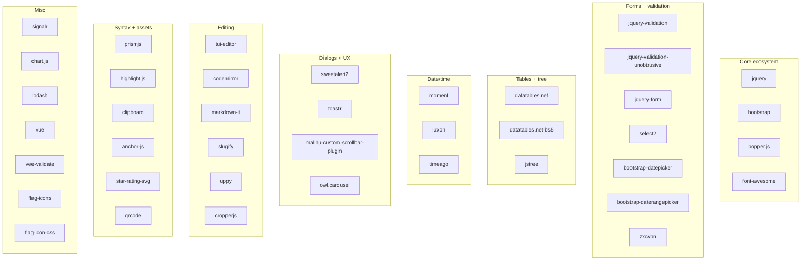
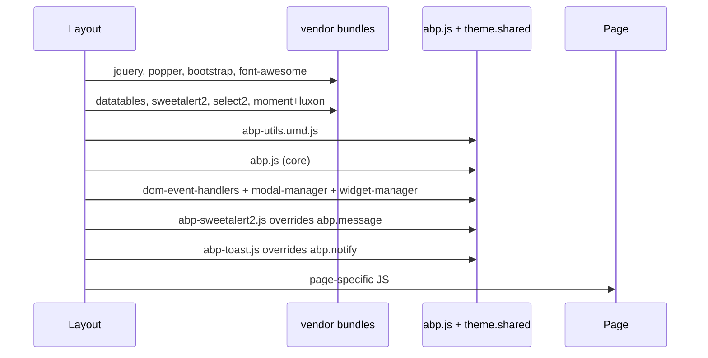

The majority of directories in ABP Framework's `npm/packs/` are thin wrappers that pin an upstream JavaScript library version and configure where ABP CLI should copy its files into `wwwroot/libs/`. This page is a reference catalogue of every vendor pack: name, pinned upstream version, target directory under `wwwroot/libs/`, and the role the library plays in the wider ABP runtime. Each entry maps directly to the contents of `npm/packs/<name>/package.json` (the dependency declaration) and `npm/packs/<name>/abp.resourcemapping.js` (the file-copy rules used by the ABP CLI's `install-libs` command).

These packs are the seams between ABP Framework and the JavaScript ecosystem. When a security advisory hits jQuery or DataTables, this is where the bump lands; the rest of the framework picks it up transitively. Together with the [Core](/js-packs/core), [Theme Shared](/js-packs/theme-shared-pack), and [Mvc.Ui Pack](/js-packs/aspnetcore-mvc-ui) pages, this page completes the picture of how the client-side runtime is assembled.

## How a vendor pack works

```mermaid
flowchart LR
    A[npm install @abp/&lt;pack&gt;] --> B[node_modules/&lt;upstream&gt;/]
    A --> C[node_modules/@abp/&lt;pack&gt;/]
    C --> M[abp.resourcemapping.js]
    M -->|abp install-libs| D[wwwroot/libs/&lt;pack&gt;/]
    B -->|copied per mapping| D
    D --> E[Bundle pipeline]
    E --> F[Razor / Blazor host]
```

Two halves to the picture:

1. The `dependencies` block in the pack's `package.json` is the **version pin** for the upstream package. ABP keeps this current via `npm/packs/npm-check-updates.ps1`.
2. The `abp.resourcemapping.js` is the **copy contract** — a single `module.exports = { mappings: { … } }` object whose keys are glob patterns over `@node_modules/...` and whose values are `@libs/<target>/`. The ABP CLI's `install-libs` step reads these and materializes the `wwwroot/libs/` directory at app build time.

Some packs also ship a per-framework shim under `src/` (e.g. `@abp/jquery` ships `src/abp.jquery.js`) that further integrates the vendor library with the `abp` namespace.

## Complete catalogue

The table below covers every vendor pack in `npm/packs/`. Roles are grouped by colour in the diagram further down.

| Pack | Upstream version | Target under `wwwroot/libs/` | Role |
| --- | --- | --- | --- |
| `@abp/jquery` | `jquery ~3.7.1` | `libs/jquery/`, `libs/abp/jquery/` | jQuery 3 + `abp.utils.isFunction`, `$.fn.findWithSelf` shims |
| `@abp/bootstrap` | `bootstrap ^5.3.8` | `libs/bootstrap/css/`, `libs/bootstrap/js/` | Bootstrap 5 LTR + RTL CSS + bundle JS |
| `@abp/popper.js` | `@popperjs/core ^2.11.8` | `libs/popper.js/` | Tooltip/popover positioning under Bootstrap |
| `@abp/datatables.net` | `datatables.net ^2.3.4` | `libs/datatables.net/` | DataTables core |
| `@abp/datatables.net-bs4` | `datatables.net-bs4 ^2.3.4` | `libs/datatables.net-bs4/` | DataTables Bootstrap 4 integration (legacy) |
| `@abp/datatables.net-bs5` | `datatables.net-bs5 ^2.3.4` | `libs/datatables.net-bs5/` | DataTables Bootstrap 5 integration (default) |
| `@abp/font-awesome` | `@fortawesome/fontawesome-free ^7.0.1` | `libs/@fortawesome/fontawesome-free/` | Icon font for navbars, alerts, dropdowns |
| `@abp/sweetalert2` | `sweetalert2 ^11.23.0` | `libs/sweetalert2/` | Backs `abp.message.info/success/warn/error/confirm/prompt` |
| `@abp/toastr` | `toastr ^2.1.4` | `libs/toastr/` | Legacy backing for `abp.notify.*` (now superseded by `AbpToastService`) |
| `@abp/luxon` | `luxon ^3.7.2` | `libs/luxon/`, `libs/abp/luxon/` | Modern time-zone aware date library |
| `@abp/moment` | `moment ^2.30.1` | `libs/moment/` + `libs/moment/locale/` | Legacy date library still used by Blogging, CMS Kit comments |
| `@abp/markdown-it` | `markdown-it ^14.1.0` | `libs/markdown-it/` | CMS Kit / Docs Markdown rendering |
| `@abp/chart.js` | `chart.js ^4.5.0` | `libs/chart.js/` | Dashboard / widget charts |
| `@abp/tui-editor` | `@abp/jquery + @abp/prismjs` | `libs/tui-editor/` | Toast UI Editor (Markdown WYSIWYG) used by CMS Kit + Blogging |
| `@abp/codemirror` | `codemirror ^5.65.1` | `libs/codemirror/` + `mode/`, `theme/`, `addon/` | Inline JS/CSS editor on CMS Kit page admin |
| `@abp/uppy` | `uppy ^5.1.2` | `libs/uppy/` | Cover-image and file uploader (CMS Kit, Blogging) |
| `@abp/prismjs` | `prismjs ^1.30.0` | `libs/prismjs/` | Syntax highlighting; required by Tui Editor code plug-in |
| `@abp/slugify` | `slugify ^1.6.6` | `libs/slugify/` | Title → URL slug for CMS Kit admin |
| `@abp/qrcode` | local — no upstream pin | `libs/qrcode/` | TOTP / two-factor QR rendering |
| `@abp/signalr` | `@microsoft/signalr ~9.0.6` | `libs/signalr/browser/` | Real-time notifications, background-job updates |
| `@abp/vee-validate` | `vee-validate ~3.4.4` | `libs/vee-validate/` | Vue.js form validation (legacy Vue UI surfaces) |
| `@abp/vue` | `vue ~2.6.12` | `libs/vue/` | Vue 2 — pinned for niche modules and the Test App |
| `@abp/zxcvbn` | `zxcvbn ^4.4.2` | `libs/zxcvbn/` | Password-strength estimator on account pages |
| `@abp/anchor-js` | `anchor-js ^5.0.0` | `libs/anchor-js/` | Heading anchor links in docs and CMS Kit pages |
| `@abp/bootstrap-datepicker` | `bootstrap-datepicker ^1.10.1` | `libs/bootstrap-datepicker/` | Backing for `abp.dom.initializers.initializeDatepickers` |
| `@abp/bootstrap-daterangepicker` | `bootstrap-daterangepicker ^3.1.0` + `@abp/moment` | `libs/bootstrap-daterangepicker/` | Date-range filter on report grids |
| `@abp/clipboard` | `clipboard ^2.0.11` | `libs/clipboard/` | Copy-to-clipboard buttons (also a Prism dependency) |
| `@abp/cropperjs` | `cropperjs ^1.6.2` | `libs/cropperjs/` | Avatar / image cropping flow |
| `@abp/flag-icon-css` | `flag-icon-css ^4.1.7` | `libs/flag-icon-css/` | Legacy language-switch flags |
| `@abp/flag-icons` | `flag-icons 7.5.0` | `libs/flag-icons/` | Replacement language-switch flags |
| `@abp/highlight.js` | `@highlightjs/cdn-assets ~11.11.1` | `libs/highlight.js/` | CMS Kit public-side code highlighting |
| `@abp/jquery-form` | `jquery-form ^4.3.0` | `libs/jquery-form/` | AJAX form submission backing `$.fn.abpAjaxForm` |
| `@abp/jquery-validation` | `jquery-validation ^1.21.0` | `libs/jquery-validation/` | Client-side validation rules |
| `@abp/jquery-validation-unobtrusive` | `jquery-validation-unobtrusive ^4.0.0` | `libs/jquery-validation-unobtrusive/` | `data-val-*` attribute parser used by Razor tag helpers |
| `@abp/jstree` | `jstree ^3.3.17` | `libs/jstree/` | Permission tree on Identity admin, menu items on CMS Kit |
| `@abp/lodash` | `lodash ^4.17.21` | `libs/lodash/` | General utility (`_.debounce`, `_.cloneDeep`, …) |
| `@abp/malihu-custom-scrollbar-plugin` | `malihu-custom-scrollbar-plugin ^3.1.5` | `libs/malihu-custom-scrollbar-plugin/` | Sidebar scrollbar styling on themes |
| `@abp/owl.carousel` | `owl.carousel ^2.3.4` | `libs/owl.carousel/` | Hero slider on Blogging public pages |
| `@abp/select2` | `select2 ^4.0.13` | `libs/select2/` | Backing for `abp.dom.initializers.initializeAutocompleteSelects` |
| `@abp/star-rating-svg` | `star-rating-svg ^3.5.0` | `libs/star-rating-svg/` | CMS Kit rating widget |
| `@abp/timeago` | `timeago ^1.6.7` | `libs/timeago/` | Friendly relative timestamps in audit logs and lists |

## Role map



## Pack-specific shims worth noting

A handful of vendor packs ship their own `src/` overlay alongside the upstream copy.

### @abp/jquery: classic abp.jquery.js

`npm/packs/jquery/abp.resourcemapping.js`:

```js
module.exports = {
    mappings: {
        "@node_modules/jquery/dist/jquery.js":     "@libs/jquery/",
        "@node_modules/@abp/jquery/src/*.*":       "@libs/abp/jquery/"
    }
}
```

`npm/packs/jquery/src/abp.jquery.js` overrides the pure-JS `abp.message._showMessage` and `abp.message.confirm` stubs from `@abp/core/src/abp.js` with `confirm()`-based jQuery `Deferred` flavours, and re-aliases `abp.utils.isFunction` onto `$.isFunction`. It also defines the global utility `$.fn.findWithSelf`:

```js
$.fn.findWithSelf = function (selector) {
    return this.filter(selector).add(this.find(selector));
};
```

`findWithSelf` is used throughout `dom-event-handlers.js` and `widget-manager.js` so a wrapper can match its own selector plus descendants in a single call.

### @abp/bootstrap: per-flavour CSS

`npm/packs/bootstrap/abp.resourcemapping.js` copies six CSS file pairs (regular + RTL, source-map + minified) and the bundle JS:

```js
module.exports = {
    mappings: {
        "@node_modules/bootstrap/dist/css/bootstrap.css*":         "@libs/bootstrap/css/",
        "@node_modules/bootstrap/dist/css/bootstrap.min.css*":     "@libs/bootstrap/css/",
        "@node_modules/bootstrap/dist/css/bootstrap.rtl.css*":     "@libs/bootstrap/css/",
        "@node_modules/bootstrap/dist/css/bootstrap.rtl.min.css*": "@libs/bootstrap/css/",
        "@node_modules/bootstrap/dist/js/bootstrap.bundle*":       "@libs/bootstrap/js/",
        "@node_modules/@abp/bootstrap/src/*.*":                    "@libs/bootstrap/js/"
    }
}
```

Both LTR and RTL CSS land in `libs/bootstrap/css/` so the framework can pick the right one based on `abp.localization.currentCulture.isRtl`.

### @abp/luxon: two destinations

`npm/packs/luxon/abp.resourcemapping.js` shows the dual-source pattern:

```js
module.exports = {
    mappings: {
        "@node_modules/luxon/build/global/*.*":  "@libs/luxon/",
        "@node_modules/@abp/luxon/src/*.*":      "@libs/abp/luxon/"
    }
}
```

The upstream Luxon UMD lands in `libs/luxon/`; the ABP-side `abp.luxon.js` shim that wires Luxon's `DateTime` into `abp.clock.normalizeToString` lands in `libs/abp/luxon/`. Bundles include both — the shim runs after the vendor file so the global `luxon` is defined when the shim binds to it.

### @abp/moment: locale subdirectory

`npm/packs/moment/abp.resourcemapping.js` copies all locale files for client-side culture switching:

```js
module.exports = {
    mappings: {
        "@node_modules/moment/min/moment.min.js": "@libs/moment/",
        "@node_modules/moment/locale/*.*":        "@libs/moment/locale/"
    }
}
```

The CMS Kit `Commenting` widget's `formatTime(moment(creationTime).diff(now))` relies on this — once the user's culture changes, Moment's `moment.locale(...)` switches to the matching file in `libs/moment/locale/`.

### @abp/codemirror: addon + mode + theme

CodeMirror is unusual: it ships dozens of modes (one per syntax) and themes. The resource mapping uses a globstar:

```js
module.exports = {
    mappings: {
        "@node_modules/codemirror/lib/*.*":         "@libs/codemirror/",
        "@node_modules/codemirror/mode/**/*.*":     "@libs/codemirror/mode/",
        "@node_modules/codemirror/theme/**/*.*":    "@libs/codemirror/theme/",
        "@node_modules/codemirror/addon/**/*.*":    "@libs/codemirror/addon/"
    }
}
```

So the CMS Kit page editor can use `mode: "javascript"` and `mode: "css"` instances without the host having to pre-pick which mode files to bundle.

### @abp/signalr: browser subfolder

```js
module.exports = {
    mappings: {
        "@node_modules/@microsoft/signalr/dist/browser/*.*": "@libs/signalr/browser/"
    }
}
```

Only the browser ESM/UMD output lands in `wwwroot/libs/signalr/browser/`. The C# server-side SignalR isn't a JavaScript concern.

### @abp/tui-editor: combined shipping

`npm/packs/tui-editor/abp.resourcemapping.js` exposes its own `src/` directly:

```js
module.exports = {
    mappings: {
        "@node_modules/@abp/tui-editor/src/*.*": "@libs/tui-editor/"
    }
}
```

The pack ships four pre-built files in `src/`:

| File | Role |
| --- | --- |
| `toastui-editor-all.min.js` | The full editor + plug-in bundle |
| `toastui-editor.min.css` | Editor base styling |
| `toastui-editor-plugin-code-syntax-highlight-all.min.js` | Code highlight integration |
| `toastui-editor-plugin-code-syntax-highlight.min.css` | Code highlight styling |

This is why the pack's `package.json` declares dependencies on `@abp/jquery` and `@abp/prismjs` rather than `tui-editor` directly — the pack vendors a pre-built bundle and only needs to express its **runtime** peers.

### @abp/qrcode: locally vendored library

`npm/packs/qrcode/` is the only vendor pack with **no upstream npm dependency**:

```json
{
  "name": "@abp/qrcode",
  "dependencies": { "@abp/core": "~10.2.0-rc.3" }
}
```

`src/qrcode.js` and `src/qrcode.min.js` are vendored copies of the venerable `qrcode.js` library (used to render two-factor authentication QR codes from `otpauth://` URIs). The resource mapping is the minimal one:

```js
module.exports = {
    mappings: {
        "@node_modules/@abp/qrcode/src/*.*": "@libs/qrcode/"
    }
}
```

## Vendor dependency graph

```mermaid
graph LR
    Core[@abp/core] --> Many[Many vendor wrappers]
    Many --> JQ[jquery]
    Many --> JV[jquery-validation]
    Many --> JVU[jquery-validation-unobtrusive]
    Many --> JF[jquery-form]
    Many --> JST[jstree]
    Many --> DT[datatables.net]
    Many --> DT5[datatables.net-bs5]
    Many --> TA[timeago]
    Many --> SR[star-rating-svg]
    Many --> SWAL[sweetalert2]
    Many --> TOA[toastr]
    Many --> BDP[bootstrap-datepicker]
    Many --> BDR[bootstrap-daterangepicker]
    Many --> BS[bootstrap]
    Many --> POP[popper.js]
    Many --> FA[font-awesome]
    Many --> CB[clipboard]
    Many --> PR[prismjs]
    PR --> CB
    TUI[tui-editor] --> JQ
    TUI --> PR
    BDR --> MOM[moment]
    VV[vee-validate] --> VUE[vue]
    DT5 --> DT
    DT4[datatables.net-bs4] --> DT
    JV --> JQ
    JVU --> JV
    JF --> JQ
    JST --> JQ
    SR --> JQ
    TA --> JQ
    SWAL --> Core
    BS --> POP
    BS --> Core
```

The diagram exposes a few interesting facts:

- `@abp/clipboard` is both a Prism dependency (Prism's copy-button plug-in) and an independent feature pack.
- `@abp/datatables.net-bs5` depends on `@abp/datatables.net` for the core, and only adds the Bootstrap 5 integration CSS/JS.
- `@abp/bootstrap-daterangepicker` is the only vendor pack that drags in `@abp/moment` as a peer — it cannot work without Moment.
- `@abp/jquery-validation-unobtrusive` depends on `@abp/jquery-validation`, which depends on `@abp/jquery` — a clean three-level chain.

## Picking the right pack for a feature

| Need | Pack |
| --- | --- |
| AJAX form submit | `@abp/jquery-form` (theme.shared peer) |
| Validation on inputs | `@abp/jquery-validation-unobtrusive` |
| Server-side paged grid | `@abp/datatables.net-bs5` |
| Modal dialogs from app code | `@abp/sweetalert2` |
| Toast notifications | `AbpToastService` from theme.shared (no extra pack); `@abp/toastr` only for legacy |
| Time formatting (modern) | `@abp/luxon` |
| Time formatting (legacy / CMS Kit / Blogging) | `@abp/moment` |
| Charts | `@abp/chart.js` |
| Markdown editor | `@abp/tui-editor` (+ implicit `@abp/prismjs`) |
| Code editor (JS/CSS) | `@abp/codemirror` |
| File uploads | `@abp/uppy` |
| Image cropping | `@abp/cropperjs` |
| QR codes | `@abp/qrcode` |
| Real-time updates | `@abp/signalr` |
| Password strength meter | `@abp/zxcvbn` |
| Heading anchor links | `@abp/anchor-js` |
| Permission tree | `@abp/jstree` |
| Star rating | `@abp/star-rating-svg` |
| Country flags | `@abp/flag-icons` (new) or `@abp/flag-icon-css` (legacy) |
| Friendly relative dates | `@abp/timeago` |

## Why so many packs?

The granularity exists for three reasons:

<Steps>
  <Step title="Per-module install footprint">
    A microservice that only needs Chart.js doesn't pull SweetAlert2 or DataTables. Splitting into 40+ packs lets each consumer install the minimum.
  </Step>
  <Step title="Independent security bumps">
    A jQuery 3.7.x → 3.8.x patch only requires editing `npm/packs/jquery/package.json`. The change rebroadcasts everywhere through transitive resolution at the next `abp install-libs` run.
  </Step>
  <Step title="ABP-side overrides without forking">
    The `abp.resourcemapping.js` indirection means ABP can choose **what** to copy from a vendor — only the LTR CSS, only the browser bundle of SignalR, only the moment locales it needs. That decision is per-pack and orthogonal to the upstream package's structure.
  </Step>
</Steps>

## Coordinated version bumps

`npm/packs/npm-check-updates.ps1` is the helper that walks every pack and applies `npm-check-updates -u` so a single PR can bump (for example) all `~10.2.0-rc.3` cross-references in lockstep. Vendor versions are bumped independently — the helper only touches `@abp/*` ranges.

## Loading sequence in a typical Razor host



See [`/ui-mvc/bundling`](/ui-mvc/bundling) for how the bundle pipeline materializes that order from the `BundleContributor` chain.

## Related references

- [Overview](/js-packs/overview) — the catalogue this page lists role-by-role.
- [Core](/js-packs/core) — the `abp` namespace the shims override.
- [Theme Shared Pack](/js-packs/theme-shared-pack) — the pack that depends on 14 of the vendor wrappers above.
- [Mvc.Ui Pack](/js-packs/aspnetcore-mvc-ui) — the consumers of select2, bootstrap-datepicker, etc.
- [CMS Kit packs](/js-packs/cms-kit-packs) — primary consumer of tui-editor, codemirror, jstree, uppy, slugify, highlight.js, star-rating-svg.
- [Blogging pack](/js-packs/blogging-pack) — owl.carousel, tui-editor, prismjs consumer.
- [`/ui-mvc/bundling`](/ui-mvc/bundling), [`/ui-mvc/overview`](/ui-mvc/overview), [`/blazor/overview`](/blazor/overview).
