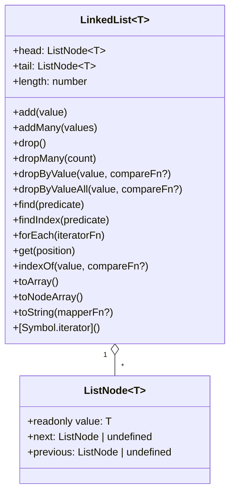
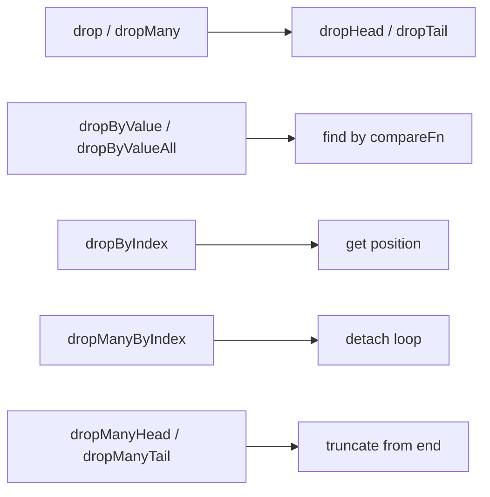
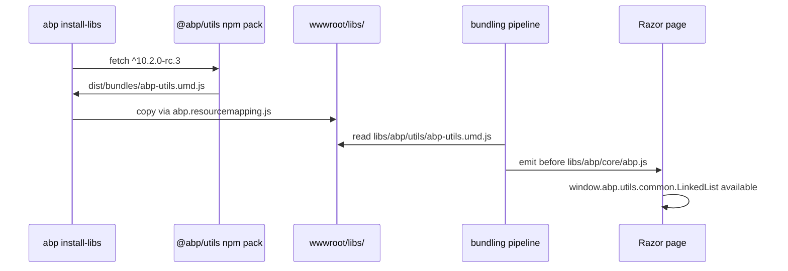

The `@abp/utils` package is the lowest layer of ABP Framework's client-side stack. Unlike every other pack in `npm/packs/`, this one is a full Angular library project — it ships TypeScript source, builds with `ng-packagr` into UMD plus FESM2015 bundles, and is consumed both by the Angular UI (`@abp/ng.core`) and by the Razor Pages runtime (via `abp.utils.common.LinkedList`). This page covers the `npm/packs/utils/` directory: the ng-packagr build setup, the public `LinkedList<T>` / `ListNode<T>` API exposed from `projects/utils/src/lib/linked-list.ts`, and how the UMD bundle is mapped into `wwwroot/libs/abp/utils/` for downstream MVC consumers.

The package is the single declared dependency of `@abp/core`, which means every ABP client — Razor Pages, Blazor Server, Angular — pulls it in transitively. The exposed surface is intentionally small: one class plus three type aliases. That class is heavily used by `abp.ui.extensions` (for tableColumns and entityActions contribution lists), by the Angular routing/permission registries, and by the CMS Kit widget pipeline.

## Package layout

```text
npm/packs/utils/
├── README.md
├── abp.resourcemapping.js
├── angular.json
├── jest.config.js
├── ngcc.config.js
├── package.json
├── prepublish.js
├── projects/utils/
│   ├── jest.config.js
│   ├── ng-package.json
│   ├── src/
│   │   ├── lib/
│   │   │   ├── linked-list.spec.ts
│   │   │   └── linked-list.ts        ← 407 lines of source
│   │   └── public-api.ts
│   ├── tsconfig.lib.json
│   └── tsconfig.spec.json
├── test-setup.ts
├── tsconfig.base.json
└── tslint.json
```

The `projects/utils/src/public-api.ts` file is a single line:

```ts
/*
 * Public API Surface of utils
 */

export * from './lib/linked-list';
```

So every published symbol comes from `linked-list.ts`.

## Build pipeline

`npm/packs/utils/projects/utils/ng-package.json` configures `ng-packagr`:

```json
{
  "$schema": "../../node_modules/ng-packagr/ng-package.schema.json",
  "dest": "../../dist",
  "deleteDestPath": true,
  "lib": {
    "entryFile": "src/public-api.ts",
    "umdId": "abp.utils.common"
  },
  "whitelistedNonPeerDependencies": ["just-compare"]
}
```

Two facts matter:

1. The `umdId` is **`abp.utils.common`** — that is the global property the UMD bundle attaches itself to when loaded into a Razor Page. Inside `Volo.Abp.AspNetCore.Mvc.UI.Theme.Shared/wwwroot/libs/abp/aspnetcore-mvc-ui-theme-shared/ui-extensions.js` you can see the call: `new abp.utils.common.LinkedList()`.
2. `just-compare` is whitelisted as a non-peer dependency, so it ends up bundled into the UMD distribution rather than declared as a peer requirement.

The `npm/packs/utils/package.json` `main` / `module` / `typings` triplet exposes the build outputs to npm consumers:

```json
{
  "main":     "dist/bundles/abp-utils.umd.js",
  "module":   "dist/fesm2015/abp-utils.js",
  "es2015":   "dist/fesm2015/abp-utils.js",
  "esm2015":  "dist/esm2015/abp-utils.js",
  "fesm2015": "dist/fesm2015/abp-utils.js",
  "typings":  "dist/abp-utils.d.ts",
  "metadata": "dist/abp-utils.metadata.json",
  "sideEffects": false
}
```

The `prepublish.js` script copies the root `package.json` and `README.md` into `projects/utils/` and triggers `yarn build`:

```js
const fse   = require('fs-extra');
const execa = require('execa');

fse.copyFileSync('./package.json', './projects/utils/package.json');
fse.copyFileSync('./README.md',   './projects/utils/README.md');

try {
  execa.sync('yarn', ['build'], { stdout: 'inherit' });
  process.exit(0);
} catch (error) {
  console.error(error);
  process.exit(1);
}
```

That `package.json` also wires `prepublishOnly` to `yarn install --ignore-scripts && node prepublish.js`, so `npm publish` from the root automatically runs the Angular build.

## Resource mapping for MVC consumers

`npm/packs/utils/abp.resourcemapping.js` ships only the UMD bundles, not the FESM tree — Razor pages never call them through ES module syntax:

```js
module.exports = {
  mappings: {
    '@node_modules/@abp/utils/dist/bundles/*.*': '@libs/abp/utils/',
  },
};
```

After `abp install-libs` the Razor host has `wwwroot/libs/abp/utils/abp-utils.umd.js` and its source map; the bundling pipeline (see [`/ui-mvc/bundling`](/ui-mvc/bundling)) then concatenates it before `abp.js` so that `abp.utils.common.LinkedList` is available when `abp.js` runs.

## LinkedList\<T\>: the entire public surface



`ListNode<T>` is a four-line class:

```ts
export class ListNode<T = any> {
  next: ListNode | undefined;
  previous: ListNode | undefined;
  constructor(public readonly value: T) {}
}
```

`LinkedList<T>` itself maintains `first`, `last` and `size` privates plus three getters: `head`, `tail`, `length`. The class implements iterator protocol so you can write `for (const value of list)`:

```ts
*[Symbol.iterator](): any {
  for (let node = this.first, position = 0; node; position++, node = node.next) {
    yield node.value;
  }
}
```

## Add semantics: fluent builder

`add(value)` and `addMany(values)` return a fluent object with five terminal methods:

```ts
add(value: T) {
  return {
    after:   (...params: [T] | [any, ListComparisonFn<T>]) => this.addAfter.call(this, value, ...params),
    before:  (...params: [T] | [any, ListComparisonFn<T>]) => this.addBefore.call(this, value, ...params),
    byIndex: (position: number) => this.addByIndex(value, position),
    head:    () => this.addHead(value),
    tail:    () => this.addTail(value),
  };
}
```

So contributor lists in `abp.ui.extensions` build with `list.add({name:'edit', order:10}).tail();`. The overloads of `addAfter` / `addBefore` accept either an exact value (compared with `just-compare`) or a custom `ListComparisonFn<T>`:

```ts
addAfter(value: T, previousValue: T): ListNode<T>;
addAfter(value: T, previousValue: any, compareFn: ListComparisonFn<T>): ListNode<T>;
addAfter(value: T, previousValue: any, compareFn: ListComparisonFn<T> = compare): ListNode<T> {
  const previous = this.find(node => compareFn(node.value, previousValue));

  return previous ? this.attach(value, previous, previous.next) : this.addTail(value);
}
```

Falling back to `addTail` when the anchor value is not found keeps `addAfter` safe to call on contributor lists that may or may not contain the reference item — a common situation when ordering UI extension callbacks.

| Method | Behaviour |
| --- | --- |
| `addHead(value)` | Insert at the front. O(1). |
| `addTail(value)` | Insert at the back. O(1). |
| `addAfter(value, previousValue, compareFn?)` | Find a node whose value matches `previousValue`; insert after it; fall back to tail. |
| `addBefore(value, nextValue, compareFn?)` | Symmetric — fall back to head. |
| `addByIndex(value, position)` | Clamp negative `position` by adding `size`; clamp overflow to tail. |
| `addMany*` | Bulk variants that wire the inserted block in O(values.length). |

The bulk insert via `attachMany` builds a transient `LinkedList<T>`, then splices it in two pointer-fixups rather than re-attaching item-by-item:

```ts
const list = new LinkedList<T>();
list.addManyTail(values);
list.first!.previous = previousNode;
previousNode.next     = list.first;
list.last!.next       = nextNode;
nextNode.previous     = list.last;
this.size += values.length;
return list.toNodeArray();
```

## Removal semantics



| Method | Returns | Notes |
| --- | --- | --- |
| `drop()` | `ListNode<T>` removed | Defaults to tail. |
| `dropMany(count)` | `ListNode<T>[]` | Removes `count` tail nodes. |
| `dropHead()` / `dropTail()` | Single node | O(1). |
| `dropByIndex(position)` | Single node | `undefined` if out of range. |
| `dropByValue(value, compareFn?)` | First match | Falls through using `compareFn`. |
| `dropByValueAll(value, compareFn?)` | All matches | Returns the array of removed nodes. |
| `dropManyByIndex(count, position)` | Node array | Removes `count` nodes starting at `position`. |
| `dropManyHead(count)` / `dropManyTail(count)` | Node array | The signatures use `Exclude<number, 0>` to reject `0`. |

The `Exclude<number, 0>` constraint on `dropManyHead` / `dropManyTail` is a compile-time guard: TypeScript will reject `list.dropManyHead(0 as 0)` because removing zero nodes is meaningless — callers must either not call or pass a positive count.

## Traversal: find, findIndex, forEach

The traversal helpers all share the same loop shape:

```ts
forEach<R = boolean>(iteratorFn: ListIteratorFn<T, R>) {
  for (let node = this.first, position = 0; node; position++, node = node.next) {
    iteratorFn(node, position, this);
  }
}
```

`find(predicate)` and `findIndex(predicate)` short-circuit when the predicate returns truthy. `get(position)` reuses `find`:

```ts
get(position: number): ListNode<T> | undefined {
  return this.find((_, index) => position === index);
}
```

So `list.get(2)` is O(n) — `LinkedList` is not optimised for random access. For ordered contributor lists that is acceptable because additions happen at build time and reads happen rarely.

## Conversions and string formatting

| Method | Output |
| --- | --- |
| `toArray(): T[]` | `Array(size)` then `forEach` writes `array[index!] = node.value` |
| `toNodeArray(): ListNode<T>[]` | Same shape, but with the wrapping nodes |
| `toString(mapperFn?)` | Joins with `' <-> '` so debug output reads like `a <-> b <-> c` |
| `[Symbol.iterator]` | Generator that yields raw values |

`toString` is useful in Jest tests — `linked-list.spec.ts` uses it for snapshot comparisons.

## Type aliases

The three type aliases at the bottom of `linked-list.ts` are the only other published symbols:

```ts
export type ListMapperFn<T = any>     = (value: T) => any;
export type ListComparisonFn<T = any> = (value1: T, value2: any) => boolean;
export type ListIteratorFn<T = any, R = boolean> = (
  node: ListNode<T>,
  index?: number,
  list?: LinkedList,
) => R;
```

`ListComparisonFn` is the contract for the optional `compareFn` parameter on `addAfter`, `addBefore`, `dropByValue`, `dropByValueAll`, and `indexOf`. When omitted the implementation uses the default deep-equality from `just-compare` (the only runtime dependency of the pack):

```ts
import compare from 'just-compare';
// …
addAfter(value: T, previousValue: any, compareFn: ListComparisonFn<T> = compare): ListNode<T> { … }
```

## How abp.ui.extensions consumes it

`framework/src/Volo.Abp.AspNetCore.Mvc.UI.Theme.Shared/wwwroot/libs/abp/aspnetcore-mvc-ui-theme-shared/ui-extensions.js` exposes two factory helpers that hand back a `LinkedList`:

```js
abp.ui.extensions.ActionList = function () {
    return new abp.utils.common.LinkedList();
};

abp.ui.extensions.ColumnList = function () {
    return new abp.utils.common.LinkedList();
};
```

The `entityActions` registry then asks contributors to append onto that list:

```js
abp.ui.extensions.entityActions = (function () {
    var _callbackLists = {};

    function _get(name) {
        var callbackList = _callbackLists[name];
        if (!callbackList) { callbackList = _callbackLists[name] = []; }
        // …
        function _getActions() {
            var actionList = new abp.ui.extensions.ActionList();
            callbackList.forEach(function (callback) { callback(actionList); });
            return actionList;
        }
    }
})();
```

Each contributor receives the `actionList` and calls `actionList.add({...}).tail()` or `actionList.addByIndex({...}, 0)` to position itself. The default deep-comparison from `just-compare` means a contributor can ask to be inserted after a previously declared action by passing the same object shape — without needing a reference to the actual node.

## Test surface

`projects/utils/src/lib/linked-list.spec.ts` is configured to run under `jest-preset-angular` (see `npm/packs/utils/jest.config.js`). The `package.json` exposes the standard Angular CLI scripts:

```json
"scripts": {
  "prepublishOnly": "yarn install --ignore-scripts && node prepublish.js",
  "ng":     "ng",
  "start":  "ng serve",
  "build":  "ng build",
  "test":   "ng test",
  "lint":   "ng lint"
}
```

The `test-setup.ts` at the repo root configures `jest-preset-angular` and is referenced by `tsconfig.spec.json`. Although the Angular tooling is somewhat dated (`@angular/cli ~10.0.0`, `typescript ~3.9.5`), the published `.d.ts` from `dist/` are forward-compatible with later Angular versions consumed by `@abp/ng.core`.

<Note>
Although `@abp/utils` ships as an Angular library, no Angular runtime is required to consume it. The UMD bundle is plain JavaScript — Razor Pages and Blazor Server load it as a script tag and get the `LinkedList` via `abp.utils.common.LinkedList`.
</Note>

## Loading order on a Razor page



The ordering matters: `abp.js` from `@abp/core` does not import `LinkedList` directly, but downstream packs (`ui-extensions.js`) call `new abp.utils.common.LinkedList()` synchronously on page load. The bundling configuration in `Volo.Abp.AspNetCore.Mvc.UI.Theme.Shared/AbpAspNetCoreMvcUiThemeSharedBundleContributor.cs` therefore lists `libs/abp/utils/abp-utils.umd.js` before `libs/abp/core/abp.js`.

## Why a doubly-linked list?

The choice is pragmatic. ABP needs ordered contribution lists with three properties:

1. **Stable insertion order** by an ordinal `add(...).after(otherItem)` or `add(...).byIndex(n)` API.
2. **O(1) head / tail insertion** — the dominant case is "append a column at the end".
3. **In-place mutation during iteration** — contributors sometimes splice siblings while the registry is being built.

A doubly-linked list gives all three trivially. Random-access reads cost O(n), but those happen once at registry construction time, not on every UI render.

## Related references

- [`@abp/core`](/js-packs/core) — depends on this pack to expose `abp.utils.common.LinkedList`.
- [`@abp/aspnetcore.mvc.ui.theme.shared`](/js-packs/theme-shared-pack) — the primary consumer through `abp.ui.extensions`.
- [`/ui-mvc/bundling`](/ui-mvc/bundling) — bundle ordering that loads UMD first.
- [`/ui-mvc/overview`](/ui-mvc/overview) — entity action / table column extension model on the server side.
- [`/blazor/overview`](/blazor/overview) — Blazor Server hosts that also rely on the UMD bundle.
