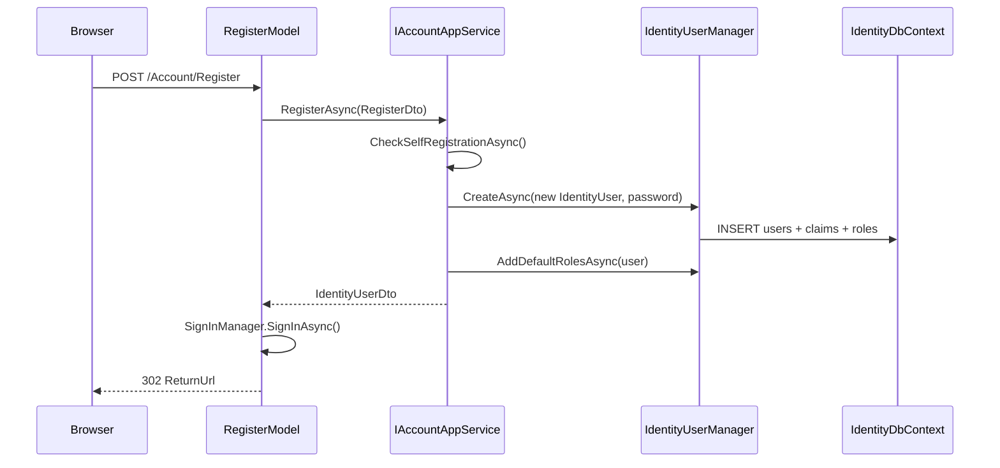
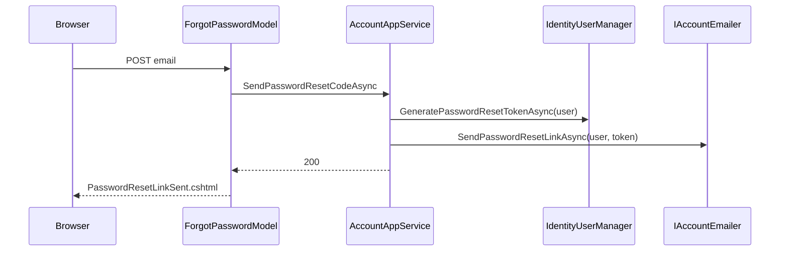

The Account module under `modules/account/src/` is ABP Framework's user-facing authentication UI. While the [Identity module](/modules/identity) owns the persistent user/role/OU model, Account owns the *interactive* journey: the login screen, the registration screen, the password-reset email flow, the profile-management page, and the external/social-login dance. It ships in three flavours — a base `Volo.Abp.Account.Web` Razor-pages package that knows nothing about which OIDC server is in front of it, and two add-on packages that integrate with IdentityServer4 (`Volo.Abp.Account.Web.IdentityServer`) and OpenIddict (`Volo.Abp.Account.Web.OpenIddict`).

This page walks the project layout under `modules/account/src/`, the `IAccountAppService` / `IProfileAppService` contracts and DTOs, the Razor page models that drive the UI, and the differences between the IdentityServer and OpenIddict variants. The Blazor twin (`Volo.Abp.Account.Blazor`) is also covered.

## Project layout

```
modules/account/src/
├── Volo.Abp.Account.Application.Contracts/   IAccountAppService, IProfileAppService, DTOs
├── Volo.Abp.Account.Application/             AccountAppService, ProfileAppService, emailing
├── Volo.Abp.Account.HttpApi/                 AccountController, ProfileController
├── Volo.Abp.Account.HttpApi.Client/          Dynamic proxies
├── Volo.Abp.Account.Web/                     Razor Pages (Login, Register, Manage, …)
├── Volo.Abp.Account.Web.IdentityServer/      IS4 variant — Consent.cshtml, error pages
├── Volo.Abp.Account.Web.OpenIddict/          OpenIddict variant — OpenIddictSupportedLoginModel
├── Volo.Abp.Account.Blazor/                  Blazor login/register/profile components
└── Volo.Abp.Account.Installer/               NuGet meta-package
```

There is no `Domain` project: Account is *pure* application + UI on top of `Volo.Abp.Identity`. Every aggregate it touches (`IdentityUser`, `IdentityRole`, `IdentityUserDelegation`) lives in the Identity module, and Account injects `IdentityUserManager` directly from the [Identity domain layer](/modules/identity).

## Application contracts and DTOs

`Volo.Abp.Account.Application.Contracts/Volo/Abp/Account/` exposes the surface that everything else consumes.

| Contract | File | Operations |
| --- | --- | --- |
| `IAccountAppService` | `IAccountAppService.cs` | Register, send/verify reset code, reset password |
| `IProfileAppService` | `IProfileAppService.cs` | Get / update profile, change password |
| `IDynamicClaimsAppService` | `IDynamicClaimsAppService.cs` | Refresh dynamic claims on demand |

```csharp
// modules/account/src/Volo.Abp.Account.Application.Contracts/Volo/Abp/Account/IAccountAppService.cs
public interface IAccountAppService : IApplicationService
{
    Task<IdentityUserDto> RegisterAsync(RegisterDto input);
    Task SendPasswordResetCodeAsync(SendPasswordResetCodeDto input);
    Task<bool> VerifyPasswordResetTokenAsync(VerifyPasswordResetTokenInput input);
    Task ResetPasswordAsync(ResetPasswordDto input);
}

// IProfileAppService.cs
public interface IProfileAppService : IApplicationService
{
    Task<ProfileDto> GetAsync();
    Task<ProfileDto> UpdateAsync(UpdateProfileDto input);
    Task ChangePasswordAsync(ChangePasswordInput input);
}
```

The DTOs derive from `ExtensibleObject` so consumers can attach extra properties through ABP's [object extending](/ddd/object-extending) system:

```csharp
// RegisterDto.cs
public class RegisterDto : ExtensibleObject
{
    [Required, DynamicStringLength(typeof(IdentityUserConsts), nameof(IdentityUserConsts.MaxUserNameLength))]
    public string UserName { get; set; }

    [Required, EmailAddress]
    [DynamicStringLength(typeof(IdentityUserConsts), nameof(IdentityUserConsts.MaxEmailLength))]
    public string EmailAddress { get; set; }

    [Required, DataType(DataType.Password), DisableAuditing]
    [DynamicStringLength(typeof(IdentityUserConsts), nameof(IdentityUserConsts.MaxPasswordLength))]
    public string Password { get; set; }

    [Required] public string AppName { get; set; }
}

// ProfileDto.cs
public class ProfileDto : ExtensibleObject, IHasConcurrencyStamp
{
    public string UserName { get; set; }
    public string Email { get; set; }
    public string Name { get; set; }
    public string Surname { get; set; }
    public string PhoneNumber { get; set; }
    public bool IsExternal { get; set; }
    public bool HasPassword { get; set; }
    public string ConcurrencyStamp { get; set; }
}
```

`[DisableAuditing]` on `Password` blocks the value from being captured by the audit-log pipeline; see [Audit Logging](/modules/audit-logging).

## Application services

### AccountAppService

```csharp
// modules/account/src/Volo.Abp.Account.Application/Volo/Abp/Account/AccountAppService.cs
public class AccountAppService : ApplicationService, IAccountAppService
{
    protected IIdentityRoleRepository RoleRepository { get; }
    protected IdentityUserManager UserManager { get; }
    protected IAccountEmailer AccountEmailer { get; }
    protected IdentitySecurityLogManager IdentitySecurityLogManager { get; }
    protected IOptions<IdentityOptions> IdentityOptions { get; }

    public virtual async Task<IdentityUserDto> RegisterAsync(RegisterDto input)
    {
        await CheckSelfRegistrationAsync();
        await IdentityOptions.SetAsync();

        var user = new IdentityUser(GuidGenerator.Create(),
                                    input.UserName, input.EmailAddress, CurrentTenant.Id);
        input.MapExtraPropertiesTo(user);

        (await UserManager.CreateAsync(user, input.Password)).CheckErrors();
        await UserManager.SetEmailAsync(user, input.EmailAddress);
        await UserManager.AddDefaultRolesAsync(user);

        return ObjectMapper.Map<IdentityUser, IdentityUserDto>(user);
    }
}
```

`CheckSelfRegistrationAsync()` reads `AccountSettingNames.IsSelfRegistrationEnabled` from the [Setting Management](/modules/setting-management) store and throws a `BusinessException` (see [Business Exceptions](/core/business-exceptions)) when registration is disabled — for example on internal tenant hosts.

`SendPasswordResetCodeAsync()` calls `UserManager.GeneratePasswordResetTokenAsync()` and then `IAccountEmailer.SendPasswordResetLinkAsync()`. The emailer abstraction is implemented in `Volo.Abp.Account.Application/Volo/Abp/Account/Emailing/AccountEmailer.cs` and uses the `IEmailSender` pipeline.

### ProfileAppService

```csharp
// modules/account/src/Volo.Abp.Account.Application/Volo/Abp/Account/ProfileAppService.cs
[Authorize]
public class ProfileAppService : IdentityAppServiceBase, IProfileAppService
{
    public virtual async Task<ProfileDto> GetAsync()
    {
        var currentUser = await UserManager.GetByIdAsync(CurrentUser.GetId());
        return ObjectMapper.Map<IdentityUser, ProfileDto>(currentUser);
    }

    public virtual async Task<ProfileDto> UpdateAsync(UpdateProfileDto input)
    {
        await IdentityOptions.SetAsync();
        var user = await UserManager.GetByIdAsync(CurrentUser.GetId());
        user.SetConcurrencyStampIfNotNull(input.ConcurrencyStamp);

        if (!string.Equals(user.UserName, input.UserName, StringComparison.InvariantCultureIgnoreCase))
        {
            if (await SettingProvider.IsTrueAsync(IdentitySettingNames.User.IsUserNameUpdateEnabled))
            {
                (await UserManager.SetUserNameAsync(user, input.UserName)).CheckErrors();
            }
        }
        // …name, surname, phone…
    }
}
```

The [Authorize] attribute without a permission name only requires authentication — any signed-in user can read and update their own profile.

## HTTP API controllers

```csharp
// modules/account/src/Volo.Abp.Account.HttpApi/Volo/Abp/Account/AccountController.cs
[RemoteService(Name = AccountRemoteServiceConsts.RemoteServiceName)]
[Area(AccountRemoteServiceConsts.ModuleName)]
[Route("api/account")]
public class AccountController : AbpControllerBase, IAccountAppService
{
    [HttpPost, Route("register")]
    public virtual Task<IdentityUserDto> RegisterAsync(RegisterDto input) => AccountAppService.RegisterAsync(input);

    [HttpPost, Route("send-password-reset-code")]
    public virtual Task SendPasswordResetCodeAsync(SendPasswordResetCodeDto input)
        => AccountAppService.SendPasswordResetCodeAsync(input);

    [HttpPost, Route("verify-password-reset-token")]
    public virtual Task<bool> VerifyPasswordResetTokenAsync(VerifyPasswordResetTokenInput input)
        => AccountAppService.VerifyPasswordResetTokenAsync(input);

    [HttpPost, Route("reset-password")]
    public virtual Task ResetPasswordAsync(ResetPasswordDto input) => AccountAppService.ResetPasswordAsync(input);
}
```

```csharp
// ProfileController.cs
[Route("/api/account/my-profile")]
public class ProfileController : AbpControllerBase, IProfileAppService
{
    [HttpGet]                   public virtual Task<ProfileDto>  GetAsync()    => ProfileAppService.GetAsync();
    [HttpPut]                   public virtual Task<ProfileDto>  UpdateAsync(UpdateProfileDto input)
                                                                               => ProfileAppService.UpdateAsync(input);
    [HttpPost, Route("change-password")]
    public virtual Task ChangePasswordAsync(ChangePasswordInput input)         => ProfileAppService.ChangePasswordAsync(input);
}
```

Because both controllers *implement* the matching app-service interface, dynamic C# proxies in `Volo.Abp.Account.HttpApi.Client` are usable from Blazor WASM, MAUI, and the Identity admin UI without hand-written HTTP code — see [MVC Integration](/aspnetcore/mvc).

## Razor Pages

The `Volo.Abp.Account.Web/Pages/Account/` folder contains the user-facing UI:

| Page | File | Page Model | Purpose |
| --- | --- | --- | --- |
| Login | `Login.cshtml` | `LoginModel` | Local credentials + external provider buttons |
| Register | `Register.cshtml` | `RegisterModel` | Self-registration form |
| ForgotPassword | `ForgotPassword.cshtml` | `ForgotPasswordModel` | Captures email, sends reset link |
| ResetPassword | `ResetPassword.cshtml` | `ResetPasswordModel` | Consumes reset code |
| PasswordResetLinkSent | `PasswordResetLinkSent.cshtml` | `PasswordResetLinkSentModel` | Confirmation screen |
| Manage | `Manage.cshtml` | `ManageModel` | Tabbed profile page hosting view-components |
| Logout / LoggedOut | `Logout.cshtml.cs` | `LogoutModel` | Sign-out + post-logout redirect |
| AccessDenied | `AccessDenied.cshtml` | `AccessDeniedModel` | Forbidden landing |

### LoginModel

```csharp
// modules/account/src/Volo.Abp.Account.Web/Pages/Account/Login.cshtml.cs
public class LoginModel : AccountPageModel
{
    [HiddenInput, BindProperty(SupportsGet = true)] public string ReturnUrl { get; set; }
    [HiddenInput, BindProperty(SupportsGet = true)] public string ReturnUrlHash { get; set; }
    [BindProperty]                                  public LoginInputModel LoginInput { get; set; }

    public bool EnableLocalLogin { get; set; }
    public IEnumerable<ExternalProviderModel> ExternalProviders { get; set; }
    public IEnumerable<ExternalProviderModel> VisibleExternalProviders
        => ExternalProviders.Where(x => !String.IsNullOrWhiteSpace(x.DisplayName));

    public bool IsExternalLoginOnly => EnableLocalLogin == false && ExternalProviders?.Count() == 1;
    public string ExternalLoginScheme => IsExternalLoginOnly
        ? ExternalProviders?.SingleOrDefault()?.AuthenticationScheme : null;
}
```

`AccountPageModel` (in `AccountPageModel.cs`) is the shared base — it pulls in `SignInManager`, `IdentityUserManager`, `ISettingProvider`, the dynamic-claim cache, and `AbpAccountOptions`. The page handles both `OnPostAsync` (local credentials) and `OnPostExternalLogin` (kicks off the OAuth challenge).

### RegisterModel

```csharp
// modules/account/src/Volo.Abp.Account.Web/Pages/Account/Register.cshtml.cs
public class RegisterModel : AccountPageModel
{
    [BindProperty] public PostInput Input { get; set; }
    [BindProperty(SupportsGet = true)] public bool IsExternalLogin { get; set; }
    [BindProperty(SupportsGet = true)] public string ExternalLoginAuthSchema { get; set; }

    public IEnumerable<ExternalProviderModel> ExternalProviders { get; set; }
    public bool EnableLocalRegister { get; set; }
}
```

When `IsExternalLogin` is true, the page only collects display name + email and binds the user to an `ExternalLoginInfo` instead of creating a password.

### Profile Manage page and contributors

`Manage.cshtml` is an *extensible* page composed of view components registered by a `ProfileManagementPageContributor`:

```csharp
// modules/account/src/Volo.Abp.Account.Web/ProfileManagement/ProfileManagementPageOptions.cs
public class ProfileManagementPageOptions
{
    public List<ProfileManagementPageGroup> Contributors { get; }
}
```

Out of the box `AccountProfileManagementPageContributor` registers two view components — `PersonalInfo` and `Password` (under `Pages/Account/Components/ProfileManagementGroup/`). Other modules (such as `cms-kit`'s blogger settings, or a custom *Profile Picture* contributor) plug their own components into the same options class.

## IdentityServer vs OpenIddict variants

The base `Volo.Abp.Account.Web` package is OIDC-server-agnostic. Two thin sibling packages add the protocol-specific glue.

| Variant | Module class | Pages added | Key dependency |
| --- | --- | --- | --- |
| IdentityServer4 | `AbpAccountWebIdentityServerModule` | `Consent.cshtml`, `IdentityServerSupportedLoginModel`, `IdentityServerSupportedLogoutModel`, `Error.cshtml` controller | `AbpIdentityServerDomainModule` |
| OpenIddict | `AbpAccountWebOpenIddictModule` | `OpenIddictSupportedLoginModel` | `AbpOpenIddictAspNetCoreModule` |

### IdentityServer variant

```csharp
// modules/account/src/Volo.Abp.Account.Web.IdentityServer/AbpAccountWebIdentityServerModule.cs
[DependsOn(typeof(AbpAccountWebModule), typeof(AbpIdentityServerDomainModule))]
public class AbpAccountWebIdentityServerModule : AbpModule
{
    public override void PreConfigureServices(ServiceConfigurationContext context)
    {
        context.Services.PreConfigure<AbpIdentityAspNetCoreOptions>(options =>
            options.ConfigureAuthentication = false);
    }

    public override void ConfigureServices(ServiceConfigurationContext context)
    {
        Configure<IdentityServerOptions>(options =>
        {
            options.UserInteraction.ConsentUrl = "/Consent";
            options.UserInteraction.ErrorUrl   = "/Account/Error";
            // …
        });
    }
}
```

The variant *replaces* `LoginModel`/`LogoutModel` with subclasses that read the `returnUrl` query string, resolve the IdentityServer interaction context, populate `LoginInput.UserNameOrEmailAddress` from the `login_hint`, and after a successful sign-in either short-circuit back to the client (single-client SSO) or render the consent screen at `Pages/Consent.cshtml`.

### OpenIddict variant

```csharp
// modules/account/src/Volo.Abp.Account.Web.OpenIddict/AbpAccountWebOpenIddictModule.cs
[DependsOn(typeof(AbpAccountWebModule), typeof(AbpOpenIddictAspNetCoreModule))]
public class AbpAccountWebOpenIddictModule : AbpModule { /* embedded files + MVC app-part */ }

// Pages/Account/OpenIddictSupportedLoginModel.cs
[ExposeServices(typeof(LoginModel))]
public class OpenIddictSupportedLoginModel : LoginModel
{
    protected AbpOpenIddictRequestHelper OpenIddictRequestHelper { get; }

    public async override Task<IActionResult> OnGetAsync()
    {
        LoginInput = new LoginInputModel();
        var request = await OpenIddictRequestHelper.GetFromReturnUrlAsync(ReturnUrl);
        if (request?.ClientId != null)
        {
            LoginInput.UserNameOrEmailAddress = request.LoginHint;
            var tenant = request.GetParameter(TenantResolverConsts.DefaultTenantKey)?.ToString();
            if (!string.IsNullOrEmpty(tenant)) { /* switch CurrentTenant */ }
        }
        // …
    }
}
```

`[ExposeServices(typeof(LoginModel))]` causes the DI container to register this class as the implementation of the base `LoginModel`. The rest of the Razor-page infrastructure picks it up transparently. See [Multi-Tenancy](/multi-tenancy/overview) for how `TenantResolverConsts.DefaultTenantKey` is propagated.

## Blazor variant

```csharp
// modules/account/src/Volo.Abp.Account.Blazor/AbpAccountBlazorModule.cs
[DependsOn(
    typeof(AbpAspNetCoreComponentsWebThemingModule),
    typeof(AbpMapperlyModule),
    typeof(AbpAccountApplicationContractsModule))]
public class AbpAccountBlazorModule : AbpModule
{
    public override void ConfigureServices(ServiceConfigurationContext context)
    {
        context.Services.AddMapperlyObjectMapper<AbpAccountBlazorModule>();

        Configure<AbpNavigationOptions>(options =>
            options.MenuContributors.Add(new AbpAccountBlazorUserMenuContributor()));

        Configure<AbpRouterOptions>(options =>
            options.AdditionalAssemblies.Add(typeof(AbpAccountBlazorModule).Assembly));
    }
}
```

The Blazor package ships a `Manage` Razor component that calls `IProfileAppService` over HTTP — the same DTOs flow, but the UI is rendered on the client. `AbpAccountBlazorUserMenuContributor` adds the "My Profile" entry to the top-right menu.

## Flow diagrams

### Registration



### Forgot-password



## Related pages

<CardGroup cols={2}>
  <Card title="Identity" icon="user-shield" href="/modules/identity">
    The user/role/OU model that Account consumes through `IdentityUserManager`.
  </Card>
  <Card title="OpenIddict module" icon="lock" href="/modules/openiddict-module">
    Stores OIDC applications, scopes, authorizations and tokens for the OpenIddict variant.
  </Card>
  <Card title="Permissions" icon="key" href="/security/permissions">
    `[Authorize]` enforcement on `ProfileAppService` and admin endpoints.
  </Card>
  <Card title="Multi-Tenancy" icon="building" href="/multi-tenancy/overview">
    How `CurrentTenant` is selected from `__tenant` query, host header, or OIDC parameter.
  </Card>
</CardGroup>
