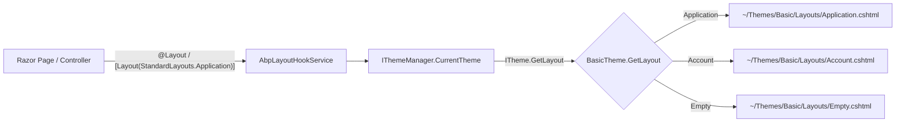
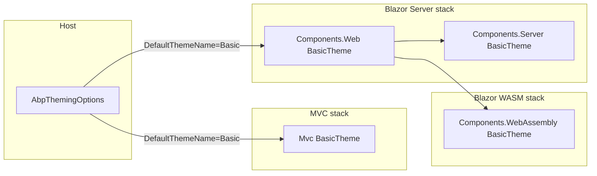

The **Basic Theme** is ABP Framework's reference theme — a clean Bootstrap 5 implementation that demonstrates the contracts every theme must satisfy. It is what `abp new` generates by default, and it doubles as the canonical example for anyone writing a custom theme. The module ships in three flavours under `modules/basic-theme/src/`: an **MVC / Razor Pages** theme, a **Blazor Server** theme, and a **Blazor WebAssembly** theme. All three implement the same `ITheme` contract from `Volo.Abp.AspNetCore.Mvc.UI.Theming` (or its Components variant), so a host can switch between them without rewriting its layouts. This page documents each package, the layout resolution, view components, bundles and toolbar contributors.

## Package map

| Project | Stack | Role |
| --- | --- | --- |
| `Volo.Abp.AspNetCore.Mvc.UI.Theme.Basic` | MVC / Razor Pages | Theme + view components + bundling |
| `Volo.Abp.AspNetCore.Mvc.UI.Theme.Basic.Installer` | MVC | NuGet installer |
| `Volo.Abp.AspNetCore.Components.Web.BasicTheme` | Blazor (shared) | Razor components, MainLayout |
| `Volo.Abp.AspNetCore.Components.Server.BasicTheme` | Blazor Server | Toolbar contributor + bundling |
| `Volo.Abp.AspNetCore.Components.WebAssembly.BasicTheme` | Blazor WebAssembly | Bundle contributor + LoginDisplay |
| `Volo.Abp.AspNetCore.Components.WebAssembly.BasicTheme.Bundling` | Blazor WASM | Bundle helpers (used during publishing) |
| `Volo.Abp.BasicTheme.Installer` | meta | Combined installer |

The shared MVC starting point is `modules/basic-theme/src/Volo.Abp.AspNetCore.Mvc.UI.Theme.Basic/BasicTheme.cs`:

```csharp
[ThemeName(Name)]
public class BasicTheme : ITheme, ITransientDependency
{
    public const string Name = "Basic";

    public virtual string GetLayout(string name, bool fallbackToDefault = true)
    {
        switch (name)
        {
            case StandardLayouts.Application: return "~/Themes/Basic/Layouts/Application.cshtml";
            case StandardLayouts.Account:     return "~/Themes/Basic/Layouts/Account.cshtml";
            case StandardLayouts.Empty:       return "~/Themes/Basic/Layouts/Empty.cshtml";
            default:
                return fallbackToDefault ? "~/Themes/Basic/Layouts/Application.cshtml" : null;
        }
    }
}
```

Three layouts: **Application** (main authenticated chrome), **Account** (the login UI surface used by the [Account module](/modules/account)) and **Empty** (no chrome). Standardising on these three names lets every ABP module pick the right shell at render time without knowing which theme is active.

## MVC module bootstrap

`modules/basic-theme/src/Volo.Abp.AspNetCore.Mvc.UI.Theme.Basic/AbpAspNetCoreMvcUIBasicThemeModule.cs` registers the theme into the host:

```csharp
[DependsOn(
    typeof(AbpAspNetCoreMvcUiThemeSharedModule),
    typeof(AbpAspNetCoreMvcUiMultiTenancyModule)
)]
public class AbpAspNetCoreMvcUiBasicThemeModule : AbpModule
{
    public override void ConfigureServices(ServiceConfigurationContext context)
    {
        Configure<AbpThemingOptions>(options =>
        {
            options.Themes.Add<BasicTheme>();
            if (options.DefaultThemeName == null)
                options.DefaultThemeName = BasicTheme.Name;
        });
        // bundle contributors + toolbar contributors registered below
    }
}
```

The dependency on `AbpAspNetCoreMvcUiMultiTenancyModule` brings in the tenant switch view component used in the toolbar. `AbpThemingOptions.Themes` is the collection ABP scans at runtime to materialise an `ITheme` instance for the current request.

## Layout resolution



`ThemeName` attribute on `BasicTheme` is what `IThemeManager` keys off when the host's `AbpThemingOptions.DefaultThemeName` is `"Basic"`. Switching themes is a one-line change in a host module.

## Bundles

The theme uses ABP's bundle pipeline (`Volo.Abp.AspNetCore.Mvc.UI.Bundling`) — see [the MVC overview](/aspnetcore/mvc) for how bundles are declared and rendered. The Basic theme contributes two bundles via constants in `Bundling/BasicThemeBundles.cs`:

```csharp
public static class BasicThemeBundles
{
    public static class Styles  { public const string Global = "Basic.Global"; }
    public static class Scripts { public const string Global = "Basic.Global"; }
}
```

`BasicThemeGlobalStyleContributor` adds the actual CSS files to the global stylesheet bundle:

```csharp
public class BasicThemeGlobalStyleContributor : BundleContributor
{
    public override void ConfigureBundle(BundleConfigurationContext context)
    {
        context.Files.Add(new BundleFile("/themes/basic/googlefonts.css", true));
        context.Files.Add("/themes/basic/layout.css");
    }
}
```

The `true` flag on `googlefonts.css` marks it as *external* — the bundler emits a separate `<link>` tag rather than concatenating the file, which is important because the URL points to a Google CDN at runtime. `BasicThemeGlobalScriptContributor` handles the script bundle in a similar manner.

## View components

The theme's chrome is composed out of view components under `Themes/Basic/Components/`. Each component has a Razor view alongside it. The set is small and intentional:

| View component | Location | Purpose |
| --- | --- | --- |
| `MainNavbarViewComponent` | `Themes/Basic/Components/MainNavbar/` | Top navigation bar |
| `MainNavbarBrandViewComponent` | `Themes/Basic/Components/Brand/` | Logo / product name |
| `MainNavbarMenuViewComponent` | `Themes/Basic/Components/Menu/` | Renders the main menu |
| `MainNavbarToolbarViewComponent` | `Themes/Basic/Components/Toolbar/` | Houses toolbar items |
| `LanguageSwitchViewComponent` | `Themes/Basic/Components/Toolbar/LanguageSwitch/` | Locale dropdown |
| `UserMenuViewComponent` | `Themes/Basic/Components/Toolbar/UserMenu/` | Logged-in user menu |
| `ContentTitleViewComponent` | `Themes/Basic/Components/ContentTitle/` | Page title + breadcrumb |
| `PageAlertsViewComponent` | `Themes/Basic/Components/PageAlerts/` | Renders queued alerts |

Each component is a thin shell, e.g. `MainNavbarViewComponent.cs`:

```csharp
public class MainNavbarViewComponent : AbpViewComponent
{
    public virtual IViewComponentResult Invoke()
    {
        return View("~/Themes/Basic/Components/MainNavbar/Default.cshtml");
    }
}
```

The interesting logic lives inside the `.cshtml` files, which iterate over the menu tree (from `IMenuManager`), the toolbar items (from `IToolbarManager`) and the current user (from `ICurrentUser`).

## Toolbar contributor

`Toolbars/BasicThemeMainTopToolbarContributor.cs` is the per-theme contributor that builds the top toolbar:

```csharp
public class BasicThemeMainTopToolbarContributor : IToolbarContributor
{
    public async Task ConfigureToolbarAsync(IToolbarConfigurationContext context)
    {
        if (context.Toolbar.Name != StandardToolbars.Main) return;
        if (!(context.Theme is BasicTheme)) return;

        var languageProvider = context.ServiceProvider.GetService<ILanguageProvider>();
        var languages = await languageProvider.GetLanguagesAsync();
        if (languages.Count > 1)
            context.Toolbar.Items.Add(new ToolbarItem(typeof(LanguageSwitchViewComponent)));

        if (context.ServiceProvider.GetRequiredService<ICurrentUser>().IsAuthenticated)
            context.Toolbar.Items.Add(new ToolbarItem(typeof(UserMenuViewComponent)));
    }
}
```

Two important behaviours:

- **Theme-aware short-circuit.** `if (!(context.Theme is BasicTheme)) return;` ensures that when a host registers multiple themes, only the active one wins.
- **Conditional items.** The language switcher appears only when more than one language is registered; the user menu appears only when the user is authenticated (via `ICurrentUser` from [Security overview](/security/overview)).

## Language switch

`LanguageSwitchViewComponent.cs` reads the languages from `ILanguageProvider`, identifies the current culture via `CultureInfo.CurrentCulture.Name`, and falls back to `IAbpRequestLocalizationOptionsProvider.GetLocalizationOptionsAsync()` if the current language is unknown — useful when the user hits the site for the first time and only has an `Accept-Language` header.

## Blazor (Components.Web.BasicTheme)

The shared Blazor part is in `modules/basic-theme/src/Volo.Abp.AspNetCore.Components.Web.BasicTheme/`. The `BasicTheme.cs` mirrors the MVC variant but returns Razor component types instead of layout paths:

```csharp
[ThemeName(Name)]
public class BasicTheme : ITheme, ITransientDependency
{
    public const string Name = "Basic";

    public virtual Type GetLayout(string name, bool fallbackToDefault = true)
    {
        switch (name)
        {
            case StandardLayouts.Application:
            case StandardLayouts.Account:
            case StandardLayouts.Empty:
                return typeof(MainLayout);
            default:
                return fallbackToDefault ? typeof(MainLayout) : typeof(NullLayout);
        }
    }
}
```

The Blazor theme reuses a single `MainLayout.razor` for all three standard layouts because the Razor component system handles cases such as "no chrome" via `CascadingValue`/conditional rendering inside the layout itself rather than via separate files.

The Razor components under `Themes/Basic/` include:

- `MainLayout.razor[.cs]` — top-level shell
- `NavMenu.razor[.cs]` — main menu tree
- `NavToolbar.razor[.cs]` — toolbar
- `FirstLevelNavMenuItem.razor[.cs]` and `SecondLevelNavMenuItem.razor[.cs]` — recursive menu rendering

See the [Blazor overview](/blazor/overview) for how `IThemeManager` integrates with the Blazor renderer.

## Blazor Server specifics

`modules/basic-theme/src/Volo.Abp.AspNetCore.Components.Server.BasicTheme/` adds the server-only bits:

- `BlazorBasicThemeBundles.cs`, `BlazorBasicThemeStyleContributor.cs`, `BlazorBasicThemeScriptContributor.cs` register the server-side bundles (loaded via a `<script>` tag from `_Host.cshtml`).
- `BasicThemeToolbarContributor.cs` is the Blazor-Server-side analog of the MVC toolbar contributor.
- `LoginDisplay.razor[.cs]` is the login/logout button rendered in the toolbar — Server uses cookie auth so the button hits `/Account/Logout`.

## Blazor WebAssembly specifics

`modules/basic-theme/src/Volo.Abp.AspNetCore.Components.WebAssembly.BasicTheme/` is the WASM-only build:

- `BasicThemeBundleContributor.cs` registers the bundle manifest used when the static site is published.
- `AuthenticationOptions.cs` is a small class holding OIDC settings used by the WASM authentication state provider.
- `BasicThemeToolbarContributor.cs` mirrors the server version but issues authorize challenges through the WebAssembly `OidcAuthenticationStateProvider`.
- `LoginDisplay.razor[.cs]` calls `NavigationManager.NavigateToLogin(...)` rather than redirecting through a controller — because WASM lacks server-side cookie middleware.

The companion bundling package `Volo.Abp.AspNetCore.Components.WebAssembly.BasicTheme.Bundling` is used at *publish time* to compose the static CSS/JS shipped with the WASM artifact.

## Theme selection diagram



## Customising the theme

Three layered overrides exist:

| What you want to change | How |
| --- | --- |
| Logo / colors | Override `MainNavbarBrandViewComponent` or its view, replace `wwwroot/themes/basic/layout.css` |
| Menu | Implement `IMenuContributor` in your module |
| Toolbar items | Implement `IToolbarContributor` |
| Layout HTML | Place a Razor view at the same virtual path in your host project (the host wins per VFS resolution) |
| Theme entirely | Write a new `ITheme` and set `AbpThemingOptions.DefaultThemeName` |

ABP's commercial themes (Lepton, LeptonX) follow the exact same contract — Basic is the reference that any theme can be cloned from.

## Installer

`modules/basic-theme/src/Volo.Abp.BasicTheme.Installer/` is purely metadata for the `abp install-module` tooling. It points at the NuGet packages above so a host can add the right combination with one command.

## Standard layouts contract

`StandardLayouts` (declared in `Volo.Abp.AspNetCore.Mvc.UI.Theming`) is a tiny class of string constants — `Application`, `Account`, `Empty` — that every theme must support. The contract makes module composition possible: the [Account module](/modules/account) calls `[Layout(StandardLayouts.Account)]` on its login pages, and *whatever theme is active* returns the right shell. Without this discipline a host could not swap themes without rewriting Razor.

| Constant | Used by | Renders |
| --- | --- | --- |
| `StandardLayouts.Application` | Most module pages | Full chrome (navbar + menu + content) |
| `StandardLayouts.Account` | Login, register, password reset | Centered card layout with branding |
| `StandardLayouts.Empty` | Error pages, popups, OIDC callbacks | No chrome at all |

A custom theme that returned `null` or an arbitrary string for an unknown layout would break the contract; `fallbackToDefault: true` is therefore the safe default behaviour.

## How alerts surface

`PageAlertsViewComponent` is worth a closer look because it is the bridge between ABP's `IAlertManager` and the Bootstrap 5 alert HTML. Application services can call `AlertManager.Alerts.Add(AlertType.Success, "Item saved")` from anywhere in the pipeline; the view component pulls the queue at render time, renders the alerts, and clears them. Because the call site is layout-agnostic, the same code works whether the host is using the Basic Theme, the commercial LeptonX theme, or a custom theme — each theme implements its own `PageAlertsViewComponent` view but the *view component class itself can be shared* across themes via `Volo.Abp.AspNetCore.Mvc.UI.Theme.Shared`.

## Per-theme HTML overrides

The virtual file system rule "later registrations win" lets a host swap any of the theme's Razor views without rebuilding the package. If a host project drops a file at `Themes/Basic/Components/Brand/Default.cshtml`, it overrides the embedded one in the Basic Theme assembly. This is the supported route for branding — touch the logo, keep the toolbar contributor untouched, and you get a custom theme in five minutes. See the [Virtual File Explorer](/modules/virtual-file-explorer) for inspecting which file actually wins for a given path.

## Recap

The Basic Theme is the smallest theme that demonstrates every ABP theming contract. It implements `ITheme.GetLayout` with three named layouts, contributes view components for navbar, brand, menu and toolbar, registers two global bundles for styles and scripts, and adds an `IToolbarContributor` that conditionally shows the language switcher and user menu. It is delivered in three flavours — MVC, Blazor Server, Blazor WASM — that share a single name (`Basic`) so a host can switch UI stacks without touching its theming code. Pair it with [the MVC overview](/aspnetcore/mvc), [the UI-MVC stack](/ui-mvc/overview) and [Blazor overview](/blazor/overview) for the surrounding infrastructure, and with [Identity](/modules/identity)/[Account](/modules/account) for the login UI the theme renders inside its `Account` layout.
