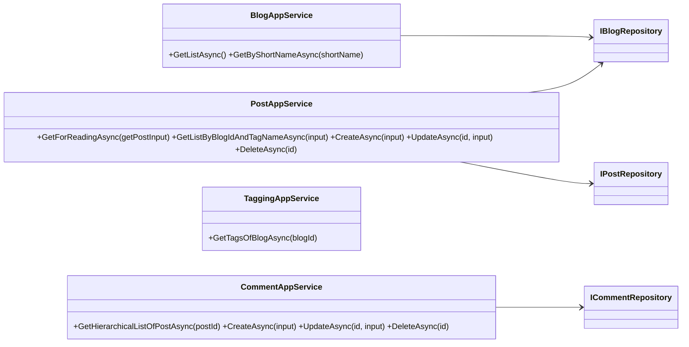
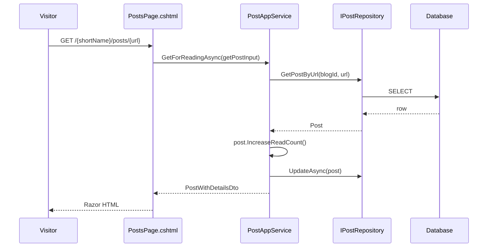

The **Blogging** module is ABP Framework's original blog engine, predating the more flexible blog inside [CMS Kit](/modules/cms-kit). It is intentionally narrow: a single blog hierarchy with `Blog` → `Post` → `Comment`, a tagging system, and a Razor-pages front-end that can be mounted at any URL prefix. Although CMS Kit is the recommended choice for new applications, the Blogging module is still maintained for existing sites and has a meaningfully different API surface — a separate REST entry point, an Admin/Web pair, and a Mapperly-based object mapper. This page documents every project under `modules/blogging/src/`, the aggregates, services, permissions and the integration model.

## Project layout

`modules/blogging/src/` follows the classic ABP onion split, plus an `Admin` lobe that hosts the back-office surface and an `Application.Contracts.Shared` package used by external integrations:

| Project | Notes |
| --- | --- |
| `Volo.Blogging.Domain.Shared` | Localization, constants, permissions |
| `Volo.Blogging.Domain` | `Blog`, `Post`, `Comment`, `PostTag`, repositories, caching |
| `Volo.Blogging.Application.Contracts` | DTOs and app-service interfaces for the public site |
| `Volo.Blogging.Application.Contracts.Shared` | Truly shared contracts (e.g. for distributed clients) |
| `Volo.Blogging.Application` | Public app-service implementations |
| `Volo.Blogging.HttpApi(.Client)` | REST controllers + dynamic C# clients |
| `Volo.Blogging.Web` | Razor pages, view components, Mapperly mapper |
| `Volo.Blogging.EntityFrameworkCore` | EF Core mapping for relational stores |
| `Volo.Blogging.MongoDB` | MongoDB collections + repositories |
| `Volo.Blogging.Admin.Application(.Contracts)` | Back-office services |
| `Volo.Blogging.Admin.HttpApi(.Client)` | Back-office REST + proxies |
| `Volo.Blogging.Admin.Web` | Back-office Razor pages |
| `Volo.Blogging.Installer` | NuGet installer package |

The shared module is declared in `modules/blogging/src/Volo.Blogging.Domain.Shared/Volo/Blogging/BloggingDomainSharedModule.cs` and registers `BloggingResource` for localization plus the embedded virtual file set:

```csharp
[DependsOn(typeof(AbpValidationModule))]
public class BloggingDomainSharedModule : AbpModule
{
    public override void ConfigureServices(ServiceConfigurationContext context)
    {
        Configure<AbpVirtualFileSystemOptions>(options =>
        {
            options.FileSets.AddEmbedded<BloggingDomainSharedModule>();
        });
        Configure<AbpLocalizationOptions>(options =>
        {
            options.Resources
                .Add<BloggingResource>("en")
                .AddBaseTypes(typeof(AbpValidationResource))
                .AddVirtualJson("Volo/Blogging/Localization/Resources");
        });
    }
}
```

## Aggregates

### Blog

`modules/blogging/src/Volo.Blogging.Domain/Volo/Blogging/Blogs/Blog.cs` defines a top-level container — a tenant typically has 1–N `Blog` instances, each addressed by `ShortName` in the URL:

```csharp
public class Blog : FullAuditedAggregateRoot<Guid>
{
    [NotNull] public virtual string Name { get; protected set; }
    [NotNull] public virtual string ShortName { get; protected set; }
    [CanBeNull] public virtual string Description { get; set; }

    public Blog(Guid id, [NotNull] string name, [NotNull] string shortName)
    {
        Id = id;
        Name = Check.NotNullOrWhiteSpace(name, nameof(name));
        ShortName = Check.NotNullOrWhiteSpace(shortName, nameof(shortName));
    }
}
```

The `IBlogRepository` interface (same folder) exposes `FindByShortNameAsync` so the front controller can route `/blog/{shortName}/...` to the right aggregate. Unlike the CMS Kit `Blog`, this aggregate is *not multi-tenant aware at the aggregate level* — multi-tenancy is implemented at the `Volo.Blogging` module level via the host's `DbContext` filter.

### Post

`modules/blogging/src/Volo.Blogging.Domain/Volo/Blogging/Posts/Post.cs` is the workhorse aggregate:

```csharp
public class Post : FullAuditedAggregateRoot<Guid>
{
    public virtual Guid BlogId { get; protected set; }
    [NotNull] public virtual string Url { get; protected set; }
    [NotNull] public virtual string CoverImage { get; set; }
    [NotNull] public virtual string Title { get; protected set; }
    [CanBeNull] public virtual string Content { get; set; }
    [CanBeNull] public virtual string Description { get; set; }
    public virtual int ReadCount { get; protected set; }
    public virtual Collection<PostTag> Tags { get; protected set; }

    public Post(Guid id, Guid blogId, string title, string coverImage, string url)
    {
        Id = id;
        BlogId = blogId;
        Title = Check.NotNullOrWhiteSpace(title, nameof(title));
        Url   = Check.NotNullOrWhiteSpace(url, nameof(url));
        CoverImage = Check.NotNullOrWhiteSpace(coverImage, nameof(coverImage));
        Tags = new Collection<PostTag>();
    }

    public virtual Post IncreaseReadCount() { ReadCount++; return this; }
    public virtual void AddTag(Guid tagId) => Tags.Add(new PostTag(Id, tagId));
    public virtual void RemoveTag(Guid tagId) => Tags.RemoveAll(t => t.TagId == tagId);
}
```

Several behaviours are worth highlighting:

- **Tag management is encapsulated.** `Tags` is exposed as a `Collection<PostTag>` (an internal join entity in `Posts/PostTag.cs`) but consumers must use `AddTag`/`RemoveTag` — they cannot mutate the collection directly.
- **Read counter mutates aggregate state.** Calling `IncreaseReadCount()` returns `this` for fluent chaining, similar to the builder style used in CMS Kit slug setters.
- **`Url` is the slug.** It is `protected set` and updated via `SetUrl(...)` to keep validation centralised.

### Comment

`modules/blogging/src/Volo.Blogging.Domain/Volo/Blogging/Comments/Comment.cs` is a flat `Post`-scoped aggregate with self-referential threading:

```csharp
public class Comment : FullAuditedAggregateRoot<Guid>
{
    public virtual Guid PostId { get; protected set; }
    public virtual Guid? RepliedCommentId { get; protected set; }
    public virtual string Text { get; protected set; }

    public Comment(Guid id, Guid postId, Guid? repliedCommentId, [NotNull] string text)
    {
        Id = id;
        PostId = postId;
        RepliedCommentId = repliedCommentId;
        Text = Check.NotNullOrWhiteSpace(text, nameof(text));
    }
}
```

Unlike CMS Kit's polymorphic `Comment` (which uses `EntityType`/`EntityId`), Blogging's `Comment` is hard-wired to `PostId` — it cannot be reused for other entity types.

## Caching

`modules/blogging/src/Volo.Blogging.Domain/Volo/Blogging/Posts/PostCacheItem.cs` defines a cache record and `PostCacheInvalidator` listens for `PostChangedEvent` to evict stale entries — illustrating the standard pattern of pairing a `DistributedCache` lookup with a domain event for invalidation. Permission `Blogging.Blog.ClearCache` (declared below) lets administrators force a cache wipe.

## Permissions

The permission tree from `modules/blogging/src/Volo.Blogging.Domain.Shared/Volo/Blogging/BloggingPermissions.cs` is concise:

```csharp
public class BloggingPermissions
{
    public const string GroupName = "Blogging";

    public static class Blogs
    {
        public const string Default     = GroupName + ".Blog";
        public const string Management  = Default + ".Management";
        public const string Delete      = Default + ".Delete";
        public const string Update      = Default + ".Update";
        public const string Create      = Default + ".Create";
        public const string ClearCache  = Default + ".ClearCache";
    }
    public static class Posts    { /* Create / Update / Delete */ }
    public static class Tags     { /* Create / Update / Delete */ }
    public static class Comments { /* Create / Update / Delete */ }
}
```

The grouping is **Blogging**, distinct from CMS Kit's **CmsKit** group, so the two can coexist without colliding in [permission management](/security/overview).

| Permission | Typical caller |
| --- | --- |
| `Blogging.Blog.Management` | Admin UI guard |
| `Blogging.Blog.ClearCache` | Cache invalidation endpoint |
| `Blogging.Post.Create` | `PostAppService.CreateAsync` |
| `Blogging.Comment.Delete` | Moderation panel |
| `Blogging.Tag.Update` | Admin tag editor |

## Public application services

`modules/blogging/src/Volo.Blogging.Application/Volo/Blogging/` (and the matching contracts package) ship the public-facing API:



`PostAppService.GetForReadingAsync` is responsible for atomically incrementing `ReadCount` while returning the post DTO — it uses the aggregate's `IncreaseReadCount()` rather than an `UPDATE` statement so audit fields stay consistent.

The contracts package additionally has `Volo.Blogging.Application.Contracts.Shared`, which is purposely free of EF/Mongo references so external clients can take a hard dependency on the DTOs without dragging in the full module.

## Admin application services

`modules/blogging/src/Volo.Blogging.Admin.Application/` mirrors the public side but with elevated permissions and write-heavy operations: `BlogAdminAppService`, `PostAdminAppService`, `TagAdminAppService`, `CommentAdminAppService`. The Admin contracts re-declare the input DTOs (e.g. `CreateBlogDto`, `UpdateBlogDto`) — they are not shared with the public DTOs deliberately, so admin payload shape can evolve independently.

## HTTP API surface

`modules/blogging/src/Volo.Blogging.HttpApi/` registers conventional dynamic controllers via `ConventionalControllers.Create(typeof(BloggingApplicationModule).Assembly)` in `BloggingHttpApiModule.ConfigureServices`. The HTTP routes follow ABP defaults:

| Route | Service method |
| --- | --- |
| `GET /api/blogging/blogs` | `BlogAppService.GetListAsync` |
| `GET /api/blogging/posts/{id}` | `PostAppService.GetAsync(id)` |
| `POST /api/blogging/posts` | `PostAppService.CreateAsync(input)` |
| `GET /api/blogging/comments/post/{postId}` | `CommentAppService.GetHierarchicalListOfPostAsync` |
| `POST /api/blogging/admin/blogs` | `BlogAdminAppService.CreateAsync` |

The `Admin.HttpApi.Client` and `HttpApi.Client` packages generate strongly-typed proxies via ABP's dynamic HTTP client system, so a separate client app can take a NuGet dependency and call the services as if they were local.

## Web UI

`modules/blogging/src/Volo.Blogging.Web/BloggingWebModule.cs` wires the Razor Pages site:

```csharp
[DependsOn(
    typeof(BloggingApplicationContractsModule),
    typeof(AbpAspNetCoreMvcUiBootstrapModule),
    typeof(AbpAspNetCoreMvcUiBundlingModule),
    typeof(AbpMapperlyModule)
)]
public class BloggingWebModule : AbpModule
{
    public override void ConfigureServices(ServiceConfigurationContext context)
    {
        context.Services.AddMapperlyObjectMapper<BloggingWebModule>();
        // ...
    }
}
```

Three things to note: the module **only depends on the application contracts** (not the implementation), so the Web project can be deployed in a separate process talking to a remote API; it brings in **Mapperly** for compile-time mappings — the source-generated mapper is faster than reflective AutoMapper; and it pulls **Prismjs** via the bundling system for syntax-highlighted code blocks. Pages live under `modules/blogging/src/Volo.Blogging.Web/Pages/Blog/` with routes such as `/{blogShortName}` (post list), `/{blogShortName}/posts/{url}` (read), `/Blogs/{blogShortName}/Posts/Edit/{postId}` (compose), `/Blogs/{blogShortName}/Posts/New` (compose), and `/Blogs/{blogShortName}/Posts/Delete/{postId}`.



## EF Core and MongoDB providers

The EF Core mapping under `modules/blogging/src/Volo.Blogging.EntityFrameworkCore/` exposes `BloggingDbContext` with `DbSet<Blog>`, `DbSet<Post>`, `DbSet<Tag>`, `DbSet<PostTag>` and `DbSet<Comment>`. Table names use the `AbpBloggingDbProperties.DbTablePrefix` ("Blg" by default). The MongoDB provider under `modules/blogging/src/Volo.Blogging.MongoDB/` mirrors with `BloggingMongoDbContext`. Both providers register `IBlogRepository`, `IPostRepository`, `ITagRepository` and `ICommentRepository` implementations.

## Blogging vs CMS Kit

The two blog implementations differ in important ways — see the table to decide which to use for a new project:

| Aspect | Blogging | CMS Kit Blogs |
| --- | --- | --- |
| Aggregate identifier | `ShortName` on `Blog` | `Slug` on `Blog` |
| Tag scope | Per blog (`Tag` has `BlogId`) | Per entity type (`Tag.EntityType`) |
| Comment polymorphism | Post-only | Polymorphic (`EntityType`/`EntityId`) |
| Reactions | Not built-in | First-class |
| Markdown rendering | Web layer Prismjs | Configurable, integrates with CMS pages |
| Feature flags | None | Global feature + tenant feature |
| Suggested use | Existing sites | New projects |

For new applications targeting modern features (reactions, ratings, polymorphic comments), the [CMS Kit](/modules/cms-kit) blog API is the better choice. Blogging remains useful when migrating older deployments where post URLs and table layouts must stay stable.

## Integration with identity

Blogging consumes the host's identity stack indirectly. `Post.CreatorId` and `Comment.CreatorId` come from `ICurrentUser.Id`, supplied by the [Identity module](/modules/identity) (via the [Account module](/modules/account) for the login UI). For background reading on how `ICurrentUser` is populated by claims, see [Security overview](/security/overview). Because Blogging itself doesn't ship a local user replica (unlike CMS Kit's `CmsUser`), display names must be looked up at render time via `IUserLookupService` from the [Users module](/modules/users).

## Mounting blogging into a host

A typical host wires Blogging by depending on `BloggingWebModule` from its top-level web project and `BloggingApplicationModule` + `BloggingEntityFrameworkCoreModule` from its API/DB project. The Razor pages bind to a URL prefix configurable via `AbpRouteOptions` so the blog can live at `/blog` while the rest of the app handles other paths — see [ASP.NET Core MVC](/aspnetcore/mvc) for routing fundamentals, and [UI-MVC overview](/ui-mvc/overview) for theming notes. Blazor hosts can also consume the HTTP API client; details in [Blazor overview](/blazor/overview).

## Caching deep dive

`PostCacheItem` and `PostCacheInvalidator` deserve a closer look because they show the standard ABP pattern of cache-by-domain-event in 50 lines. `PostCacheItem` is a `[CacheName]`-attributed POCO that mirrors a `Post` projection — `Title`, `Url`, `Description`, `CoverImage`, the resolved tag names. The `PostAppService.GetForReadingAsync` method checks this cache first via `IDistributedCache<PostCacheItem>`; on a hit, the post body is served without touching the database. The invalidator subscribes to `PostChangedEvent` (raised by the aggregate via `AddLocalEvent`) and removes the matching entry by key on every modification, so cache freshness is always one event away.

`Blogging.Blog.ClearCache` is the explicit fallback for that pattern — admins can clear all post caches when subscribers don't see an event (for example after a manual data fix in SQL).

## Mapping with Mapperly

`BloggingWebModule.ConfigureServices` registers `AddMapperlyObjectMapper<BloggingWebModule>()`. Mapperly is a source-generator-based `IObjectMapper` implementation: at build time it walks every `[Mapper]`-attributed class and emits a hand-written-quality copy method. The Domain project's `BloggingDomainMappers.cs` lists every supported pair (e.g. `Post` ↔ `PostWithDetailsDto`) and the generator handles the rest. The runtime cost is therefore near-zero — there is no reflection cache, no `Expression` compilation, just direct assignments. This matters for blog list pages that map dozens of posts per request.

## Recap

The Blogging module is a focused, opinionated blog engine bundled with ABP. It exposes a small surface — `Blog`, `Post`, `Comment`, `Tag` — and a Razor UI ready to mount. Its permission tree is the `Blogging` group, its Web layer uses Mapperly for low-overhead mapping, and it intentionally avoids the polymorphic comment/reaction story that [CMS Kit](/modules/cms-kit) introduced later. For an end-to-end stack tour, the canonical pairing is **Blogging + [Identity](/modules/identity) + [Account](/modules/account)** behind the [Basic Theme](/modules/basic-theme).
