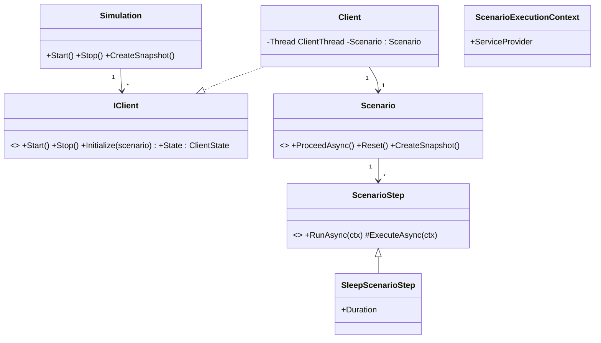
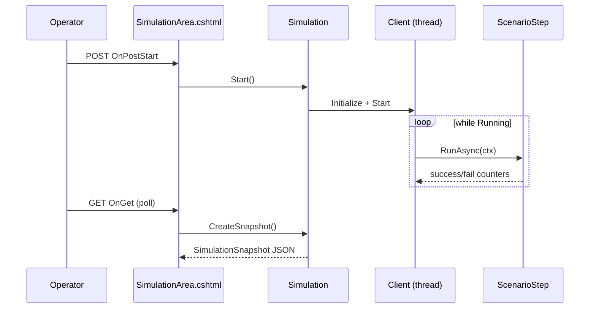

The **Client Simulation** module is a small but powerful in-process load generator that ABP Framework ships for stress-testing and demoing. Each "client" runs on its own thread, executes a scripted **Scenario** consisting of one or more **ScenarioSteps**, and reports per-step statistics — execution count, success/fail rate, min/max/total/last duration. A Razor admin page lets an operator start and stop the simulation and watch live snapshots. The whole thing lives at `modules/client-simulation/src/` in two assemblies (`Volo.ClientSimulation` and `Volo.ClientSimulation.Web`) and intentionally has no database, HTTP API or persistence — when the host restarts, the simulation resets.

## Why an in-process simulator?

Most load testing tools are external (k6, JMeter, NBomber). The ABP simulator's value is different: because it runs *inside* the ABP host, scenarios can resolve services from the container, reuse the host's `IHttpClientFactory`, authenticate with the host's IdentityModel client, and read configuration the way the rest of the app does. It is therefore ideal for:

- Reproducing tenant-aware behaviour with `ICurrentTenant.Change(...)` in the scenario steps.
- Driving authenticated traffic through the [Identity module](/modules/identity) / [Account module](/modules/account) stack.
- Demoing a long-running flow during architecture reviews.

It is *not* meant to replace cluster-scale load tools — there is no IPC, no clustering, no result export, no detailed percentile telemetry beyond min/max/total.

## Layout

| Project | Role |
| --- | --- |
| `Volo.ClientSimulation` | Core types: `Simulation`, `IClient`/`Client`, `Scenario`, `ScenarioStep`, `ClientSimulationOptions`, snapshot DTOs |
| `Volo.ClientSimulation.Web` | Razor admin page (`Index`, `SimulationArea`) and bundled JS for live polling |

The core module is declared in `modules/client-simulation/src/Volo.ClientSimulation/Volo/ClientSimulation/ClientSimulationModule.cs`:

```csharp
[DependsOn(typeof(AbpHttpClientIdentityModelModule))]
public class ClientSimulationModule : AbpModule { }
```

The single dependency on `AbpHttpClientIdentityModelModule` is meaningful — scenarios can authenticate via OIDC client credentials or password grants out of the box, so steps that call protected APIs work without extra wiring.

The Web module:

```csharp
[DependsOn(
    typeof(ClientSimulationModule),
    typeof(AbpHttpClientIdentityModelWebModule),
    typeof(AbpAspNetCoreMvcUiThemeSharedModule)
)]
public class ClientSimulationWebModule : AbpModule
{
    public override void ConfigureServices(ServiceConfigurationContext context)
    {
        Configure<AbpVirtualFileSystemOptions>(options =>
        {
            options.FileSets.AddEmbedded<ClientSimulationWebModule>("Volo.ClientSimulation");
        });
    }
}
```

## Core domain



### Simulation singleton

`modules/client-simulation/src/Volo.ClientSimulation/Volo/ClientSimulation/Simulation.cs` is the orchestrator, registered as `ISingletonDependency`:

```csharp
public class Simulation : ISingletonDependency, IDisposable
{
    public SimulationState State { get; private set; }
    public List<IClient> Clients { get; }
    protected ClientSimulationOptions Options { get; }
    protected IServiceScopeFactory ServiceScopeFactory { get; }
    protected IServiceScope ServiceScope { get; private set; }

    public virtual void Start()
    {
        lock (SyncObj)
        {
            if (State != SimulationState.Stopped)
                throw new UserFriendlyException($"Simulation should be stopped to be able to start. Current state is '{State}'.");

            State = SimulationState.Starting;
            DisposeResources();
            ServiceScope = ServiceScopeFactory.CreateScope();

            foreach (var scenarioConfiguration in Options.Scenarios)
            {
                for (int i = 0; i < scenarioConfiguration.ClientCount; i++)
                {
                    var scenario = (Scenario)ServiceScope.ServiceProvider
                        .GetRequiredService(scenarioConfiguration.ScenarioType);
                    var client = ServiceScope.ServiceProvider.GetRequiredService<IClient>();
                    client.Stopped += Client_OnStopped;
                    client.Initialize(scenario);
                    Clients.Add(client);
                }
            }
            foreach (var client in Clients) client.Start();
        }
    }
}
```

Two design points worth noting:

- **Fresh service scope per run.** Each `Start()` creates a new `IServiceScope`, so scoped services (DbContext, `ICurrentUser`) start with clean state. Stopping disposes the scope.
- **Lock around state transitions.** `SyncObj` guards `State` mutation so a panicked operator clicking Start twice can't double-allocate clients.

`SimulationState` (from `SimulationState.cs`) has four values:

```csharp
public enum SimulationState { Stopped, Starting, Started, Stopping }
```

### ClientSimulationOptions

`modules/client-simulation/src/Volo.ClientSimulation/Volo/ClientSimulation/ClientSimulationOptions.cs`:

```csharp
public class ClientSimulationOptions
{
    public List<ScenarioConfiguration> Scenarios { get; }
    public ClientSimulationOptions() { Scenarios = new List<ScenarioConfiguration>(); }
}
```

A host registers scenarios by `Configure<ClientSimulationOptions>` in its module:

```csharp
Configure<ClientSimulationOptions>(options =>
{
    options.Scenarios.Add(new ScenarioConfiguration(typeof(BookListingScenario), clientCount: 50));
    options.Scenarios.Add(new ScenarioConfiguration(typeof(CheckoutScenario), clientCount: 10));
});
```

`ScenarioConfiguration` (`ScenarioConfiguration.cs`) is a simple immutable record:

```csharp
public class ScenarioConfiguration
{
    public Type ScenarioType { get; }
    public int ClientCount { get; }
    public ScenarioConfiguration(Type scenarioType, int clientCount = 1)
    { ScenarioType = scenarioType; ClientCount = clientCount; }
}
```

### Client

`modules/client-simulation/src/Volo.ClientSimulation/Volo/ClientSimulation/Clients/Client.cs` is the per-thread worker. It implements `IClient` and is registered as `ITransientDependency`:

```csharp
public class Client : IClient, ITransientDependency
{
    public event EventHandler Stopped;
    public ClientState State { get; private set; }
    protected Scenario Scenario { get; private set; }
    protected Thread ClientThread;

    public void Initialize(Scenario scenario) { /* assigns Scenario */ }

    public void Start()
    {
        lock (SyncLock)
        {
            if (State != ClientState.Stopped)
                throw new UserFriendlyException("…");
            State = ClientState.Running;
            Scenario.Reset();
            ClientThread = new Thread(Run);
            ClientThread.Start();
        }
    }
}
```

The thread loops `await Scenario.ProceedAsync()` until `State` transitions out of `Running`. Using a dedicated thread (rather than `Task.Run`) ensures one CPU thread per simulated client — important when scenarios are CPU-bound rather than IO-bound.

### Scenario

`modules/client-simulation/src/Volo.ClientSimulation/Volo/ClientSimulation/Scenarios/Scenario.cs` is the abstract base every concrete scenario derives from. The `Steps` list is populated in the derived class's constructor; the engine then cycles through them:

```csharp
public abstract class Scenario : ITransientDependency
{
    protected List<ScenarioStep> Steps { get; }
    protected int CurrentStepIndex { get; set; }
    protected ScenarioExecutionContext ExecutionContext { get; }

    protected Scenario(IServiceProvider serviceProvider)
    {
        ExecutionContext = new ScenarioExecutionContext(serviceProvider);
        Steps = new List<ScenarioStep>();
    }

    public virtual async Task ProceedAsync()
    {
        CheckStepCount();
        await Steps[CurrentStepIndex].RunAsync(ExecutionContext);
        CurrentStepIndex++;
        if (CurrentStepIndex >= Steps.Count) CurrentStepIndex = 0;
    }

    public virtual string GetDisplayText()
    {
        var displayNameAttr = GetType().GetCustomAttributes(true)
            .OfType<DisplayNameAttribute>().FirstOrDefault();
        if (displayNameAttr != null) return displayNameAttr.DisplayName;
        return GetType().Name.RemovePostFix(nameof(Scenario));
    }
}
```

A typical concrete subclass looks like:

```csharp
[DisplayName("Browse book catalog")]
public class BookListingScenario : Scenario
{
    public BookListingScenario(IServiceProvider sp) : base(sp)
    {
        Steps.Add(new LoginScenarioStep());
        Steps.Add(new ListBooksScenarioStep());
        Steps.Add(new SleepScenarioStep("think-time", 1500));
        Steps.Add(new GetOneBookScenarioStep());
    }
}
```

### ScenarioStep

`modules/client-simulation/src/Volo.ClientSimulation/Volo/ClientSimulation/Scenarios/ScenarioStep.cs` is where the timing measurements live:

```csharp
public abstract class ScenarioStep
{
    protected int ExecutionCount;
    protected int SuccessCount;
    protected int FailCount;
    protected double TotalExecutionDuration;
    protected double MinExecutionDuration;
    protected double MaxExecutionDuration;
    protected double LastExecutionDuration;

    public async Task RunAsync(ScenarioExecutionContext context)
    {
        await BeforeExecuteAsync(context);
        var stopwatch = Stopwatch.StartNew();
        try
        {
            await ExecuteAsync(context);
            SuccessCount++;
            LastExecutionDuration = stopwatch.Elapsed.TotalMilliseconds;
            TotalExecutionDuration += LastExecutionDuration;
            if (MinExecutionDuration > LastExecutionDuration) MinExecutionDuration = LastExecutionDuration;
            if (MaxExecutionDuration < LastExecutionDuration) MaxExecutionDuration = LastExecutionDuration;
        }
        catch (Exception ex)
        {
            FailCount++;
            // logged but not rethrown -- simulation continues
        }
    }
}
```

Subclasses only override the abstract `ExecuteAsync` to define behaviour. The bookkeeping is automatic and surfaces in the snapshot.

### Built-in steps

The only concrete step shipped by the module is `SleepScenarioStep` (`SleepScenarioStep.cs`):

```csharp
public class SleepScenarioStep : ScenarioStep
{
    public string Name { get; }
    public int Duration { get; }
    public SleepScenarioStep(string name, int duration = 1000) { Name = name; Duration = duration; }
    protected override Task ExecuteAsync(ScenarioExecutionContext context) => Task.Delay(Duration);
    public override string GetDisplayText() => base.GetDisplayText() + $" ({Name})";
}
```

That's it — the rest of the steps are written by the host. The `Sleep` step is used to insert "think time" between user actions so the load profile looks realistic.

### ScenarioExecutionContext

`ScenarioExecutionContext.cs` carries an `IServiceProvider` per scenario instance plus a `Reset()` method called at the start of each loop. It is the canonical way for a step to resolve scoped services:

```csharp
protected override async Task ExecuteAsync(ScenarioExecutionContext context)
{
    var http = context.ServiceProvider.GetRequiredService<IHttpClientFactory>().CreateClient("BookStore");
    var response = await http.GetAsync("/api/books");
    response.EnsureSuccessStatusCode();
}
```

## Snapshots

`modules/client-simulation/src/Volo.ClientSimulation/Volo/ClientSimulation/Snapshot/SimulationSnapshot.cs` is the marshallable view of simulation state. It contains `Clients`, `Scenarios` (a per-scenario summary), and the current `State`. Summaries are computed by aggregating client snapshots:

```csharp
public void CreateSummaries()
{
    var scenarioDictionary = new Dictionary<string, ScenarioSummarySnapshot>();
    foreach (var client in Clients)
    {
        var scenarioSummary = scenarioDictionary.GetOrAdd(
            client.Scenario.DisplayText,
            () => new ScenarioSummarySnapshot
            {
                DisplayText = client.Scenario.DisplayText,
                Steps = new List<ScenarioStepSummarySnapshot>()
            });
        foreach (var scenarioStep in client.Scenario.Steps) { /* aggregate step counters */ }
    }
}
```

`ClientSnapshot`, `ScenarioSnapshot`, `ScenarioStepSnapshot`, `ScenarioSummarySnapshot` and `ScenarioStepSummarySnapshot` round out the projection types. Because the snapshot is `[Serializable]`, it can be JSON-encoded for the Razor page's AJAX polling.

## Web UI

The Web project at `modules/client-simulation/src/Volo.ClientSimulation.Web/` ships two Razor pages.

`Pages/ClientSimulation/Index.cshtml.cs` is the page shell:

```csharp
public class IndexModel : PageModel
{
    public virtual Task<IActionResult> OnGetAsync() => Task.FromResult<IActionResult>(Page());
}
```

`Pages/ClientSimulation/SimulationArea.cshtml.cs` is the partial that exposes the start/stop POST handlers and the snapshot read handler:

```csharp
public class SimulationAreaModel : PageModel
{
    public SimulationSnapshot Snapshot { get; private set; }
    protected Simulation Simulation { get; }

    public SimulationAreaModel(Simulation simulation) => Simulation = simulation;

    public virtual Task<IActionResult> OnGetAsync()
    {
        Snapshot = Simulation.CreateSnapshot();
        return Task.FromResult<IActionResult>(Page());
    }

    public virtual async Task<IActionResult> OnPostStartAsync() { Simulation.Start(); return new NoContentResult(); }
    public virtual async Task<IActionResult> OnPostStopAsync()  { Simulation.Stop();  return new NoContentResult(); }
}
```

The accompanying JavaScript in the page polls the GET handler every second to refresh the live table of running clients.



## End-to-end usage

1. Write a `Scenario` per user journey, optionally annotated with `[DisplayName("...")]`.
2. Write the `ScenarioStep`s the scenario uses (subclass `ScenarioStep` and override `ExecuteAsync`).
3. Register them in `Configure<ClientSimulationOptions>` with the desired `ClientCount`.
4. Add `ClientSimulationWebModule` as a dependency so the admin page is mounted.
5. Sign in with a permitted user, open `/ClientSimulation`, click Start.

## Authentication for scenario steps

Because `ClientSimulationModule` depends on `AbpHttpClientIdentityModelModule`, scenario steps can declare typed HTTP clients secured via OIDC. A common pattern is:

```csharp
public class LoginScenarioStep : ScenarioStep
{
    protected override async Task ExecuteAsync(ScenarioExecutionContext ctx)
    {
        // forces token acquisition through the IdentityModel client handler
        var http = ctx.ServiceProvider.GetRequiredService<IHttpClientFactory>().CreateClient("BookStore");
        await http.GetAsync("/api/identity/my-profile");
    }
}
```

For server-side token acquisition specifics, see [Security overview](/security/overview); for the host's MVC pipeline, [ASP.NET Core MVC](/aspnetcore/mvc); for the theme that wraps the admin page, [UI-MVC overview](/ui-mvc/overview) or — if you mounted the host in Blazor — [Blazor overview](/blazor/overview).

## Limits

| Concern | Limit |
| --- | --- |
| Persistence | None — results lost on restart |
| Distributed runs | Single host only |
| Percentiles | None (only min/max/total/last) |
| Cancellation | Cooperative — depends on the step `Task.Delay`/`HttpClient` honouring `CancellationToken` |
| Auth | Whatever the host's IdentityModel client supports |

If you need clustered load generation, exportable metrics, or true percentile reporting, run an external tool (NBomber, k6) against the same host. The Client Simulation module is intended for in-process load that is easy to start, demoable, and tightly integrated with your DI graph.

## Recap

Client Simulation is a 20-class module that turns ABP's DI container into a synthetic load generator: a `Simulation` singleton spawns N `Client` threads per `Scenario`, each `Scenario` walks through `ScenarioStep`s with built-in timing/counters, and a Razor page lets you start/stop and watch live snapshots. Combine it with [Identity](/modules/identity), [Account](/modules/account) and the [OpenIddict module](/modules/openiddict-module) to drive authenticated load through a realistic auth stack — without leaving the host process.
