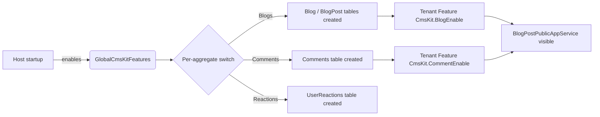
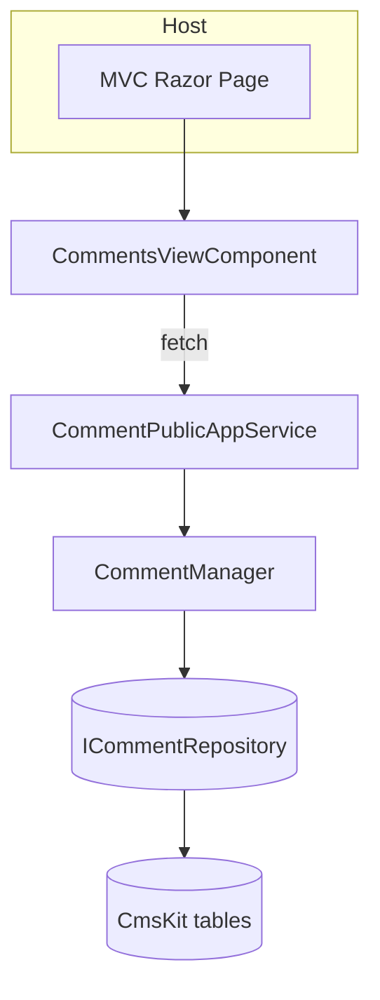

The **CMS Kit** module ships with the ABP Framework as a toolbox of reusable content building blocks rather than a single monolithic CMS application. Each capability — pages, blogs, comments, ratings, reactions, tags, marked items, menus, media descriptors and global resources — is wrapped behind a *global feature* so a host can opt into only the parts it needs and keep its database schema minimal. The pieces live under `modules/cms-kit/src/` and are split into the conventional ABP layering: `Volo.CmsKit.Domain.Shared`, `Volo.CmsKit.Domain`, `Volo.CmsKit.Application(.Contracts)`, `Volo.CmsKit.HttpApi`, separate `Admin` and `Public` sibling packages, `Volo.CmsKit.EntityFrameworkCore` and `Volo.CmsKit.MongoDB` providers, and a `Volo.CmsKit.Web` Razor UI. This page walks through every aggregate, every domain service, every feature switch and the cross-module wiring that makes the package work.

## Package map

CMS Kit is one of the larger modules in the repository because it deliberately separates *admin* surfaces (CRUD over content) from *public* surfaces (read-only display, end-user comments). The folder tree under `modules/cms-kit/src/` is grouped by layer first, then by audience:

| Project | Purpose |
| --- | --- |
| `Volo.CmsKit.Domain.Shared` | Constants, enums, exception codes, localization, global feature definitions |
| `Volo.CmsKit.Domain` | Aggregates, repositories, `BlogManager`, `PageManager`, `CommentManager` etc. |
| `Volo.CmsKit.Application.Contracts` | Empty shell module that links admin + public contract packages |
| `Volo.CmsKit.Application` | Same shell, re-exporting admin + public application modules |
| `Volo.CmsKit.Admin.Application(.Contracts)` | `BlogAdminAppService`, `PageAdminAppService`, `MenuItemAdminAppService`, … |
| `Volo.CmsKit.Public.Application(.Contracts)` | `BlogPostPublicAppService`, `CommentPublicAppService`, `RatingPublicAppService`, … |
| `Volo.CmsKit.Common.Application(.Contracts)` | Cross-cutting services like `TagAppService` used by both surfaces |
| `Volo.CmsKit.HttpApi(.Client)` | REST controllers + dynamic C# proxies |
| `Volo.CmsKit.Admin.HttpApi(.Client)` | Admin REST controllers + proxies |
| `Volo.CmsKit.Public.HttpApi(.Client)` | Public REST controllers + proxies |
| `Volo.CmsKit.EntityFrameworkCore` | EF Core mappings via `CmsKitDbContextModelCreatingExtensions` |
| `Volo.CmsKit.MongoDB` | Mongo collections + repository implementations |
| `Volo.CmsKit.Web` | Razor pages, view components, navigation, bundling |

The umbrella `CmsKitDomainSharedModule` defined in `modules/cms-kit/src/Volo.CmsKit.Domain.Shared/Volo/CmsKit/CmsKitDomainSharedModule.cs` only depends on `AbpValidationModule`, `AbpGlobalFeaturesModule` and `AbpFeaturesModule`, which means *the shared layer never pulls in EF Core, Mongo, ASP.NET or any UI assembly* — perfect for hosting the feature-flag definitions used everywhere else.

## Global features and tenant features

CMS Kit uses two orthogonal levers to turn each sub-module on or off:

1. **Global features** (`GlobalFeatureManager`) decide whether the *entity* is registered in the database at all.
2. **Tenant features** (`IFeatureChecker`) decide whether a tenant can *use* that entity at runtime.

`modules/cms-kit/src/Volo.CmsKit.Domain.Shared/Volo/CmsKit/Features/CmsKitFeatures.cs` declares the tenant-level switches:

```csharp
namespace Volo.CmsKit.Features;
public static class CmsKitFeatures
{
    public const string GroupName = "CmsKit";
    public const string BlogEnable = GroupName + ".BlogEnable";
    public const string CommentEnable = GroupName + ".CommentEnable";
    public const string GlobalResourceEnable = GroupName + ".GlobalResourceEnable";
    public const string MenuEnable = GroupName + ".MenuEnable";
    public const string PageEnable = GroupName + ".PageEnable";
    public const string RatingEnable = GroupName + ".RatingEnable";
    public const string ReactionEnable = GroupName + ".ReactionEnable";
    public const string TagEnable = GroupName + ".TagEnable";
    public const string MarkedItemEnable = GroupName + ".MarkedItemEnable";
}
```

`modules/cms-kit/src/Volo.CmsKit.Domain.Shared/Volo/CmsKit/GlobalFeatures/GlobalCmsKitFeatures.cs` then aggregates the per-feature classes (`BlogsFeature`, `CommentsFeature`, `ReactionsFeature`, `RatingsFeature`, `TagsFeature`, `PagesFeature`, `MenuFeature`, `GlobalResourcesFeature`, `MediaFeature`, `MarkedItemsFeature`, `CmsUserFeature`, `BlogPostScrollIndexFeature`) so that an app can call `GlobalFeatureManager.Instance.Modules.CmsKit().Blogs.Enable()` during bootstrap to opt-in.



The conditional table registration lives in `modules/cms-kit/src/Volo.CmsKit.EntityFrameworkCore/Volo/CmsKit/EntityFrameworkCore/CmsKitDbContextModelCreatingExtensions.cs`. For example, the `CmsUser` table is only created if `GlobalFeatureManager.Instance.IsEnabled<CmsUserFeature>()` returns true, otherwise EF is told to `Ignore<CmsUser>()`.

## CmsUser — the local user replica

`CmsUser` is an internal copy of the *identity* user inside the CMS Kit schema, used so the public site can render comment authors, post authors, etc., without having to join across modules at query time. It is declared in `modules/cms-kit/src/Volo.CmsKit.Domain/Volo/CmsKit/Users/CmsUser.cs`:

```csharp
public class CmsUser : AggregateRoot<Guid>, IUser, IUpdateUserData
{
    public virtual Guid? TenantId { get; protected set; }
    public virtual string UserName { get; protected set; }
    public virtual string Email { get; protected set; }
    public virtual string Name { get; set; }
    public virtual string Surname { get; set; }
    public virtual bool IsActive { get; set; }
    public virtual bool EmailConfirmed { get; protected set; }
    public virtual string PhoneNumber { get; protected set; }
    public virtual bool PhoneNumberConfirmed { get; protected set; }

    public CmsUser(IUserData user) : base(user.Id) { /* copies fields */ }
}
```

It implements `IUser` (so other modules see it as a user) and `IUpdateUserData` (so the [Users module](/modules/users) lookup service can keep it in sync). The synchronization is driven by `UserLookupService<TUser, TUserRepository>` from the Users package — the same pattern used in the [Identity module](/modules/identity).

## Blog and BlogPost

`Blog` and `BlogPost` (under `modules/cms-kit/src/Volo.CmsKit.Domain/Volo/CmsKit/Blogs/`) are the two aggregate roots of the blogging sub-module. They are distinct from the older [Blogging module](/modules/blogging) — CMS Kit blogs use slugs as a first-class field and support feature flags per blog.

```csharp
public class BlogPost : FullAuditedAggregateRoot<Guid>, IMultiTenant, IHasEntityVersion
{
    public virtual Guid BlogId { get; protected set; }
    [NotNull] public virtual string Title { get; protected set; }
    [NotNull] public virtual string Slug { get; protected set; }
    [NotNull] public virtual string ShortDescription { get; protected set; }
    public virtual string Content { get; protected set; }
    public Guid? CoverImageMediaId { get; set; }
    public Guid AuthorId { get; set; }
    public virtual CmsUser Author { get; set; }
    public virtual BlogPostStatus Status { get; set; }
    public virtual int EntityVersion { get; protected set; }
}
```

`Blog` is simpler — it carries `Name`, `Slug` and `TenantId`. Both use `SlugNormalizer.Normalize(slug)` (in `modules/cms-kit/src/Volo.CmsKit.Domain/Volo/CmsKit/SlugNormalizer.cs`) to enforce a consistent URL-safe representation. The domain services live alongside:

| Service | File | Responsibilities |
| --- | --- | --- |
| `BlogManager` | `Blogs/BlogManager.cs` | Creates/updates a `Blog`, validating slug uniqueness via `IBlogRepository.SlugExistsAsync` |
| `BlogPostManager` | `Blogs/BlogPostManager.cs` | Creates posts, checks slug uniqueness per blog, cascades comment deletion |
| `BlogFeatureManager` | `Blogs/BlogFeatureManager.cs` | Toggles per-blog features stored in `BlogFeature` |

`BlogPostManager.CreateAsync` is a good example of the consistent domain-service contract:

```csharp
public virtual async Task<BlogPost> CreateAsync(
    [NotNull] CmsUser author, [NotNull] Blog blog,
    [NotNull] string title, [NotNull] string slug, [NotNull] BlogPostStatus status,
    [CanBeNull] string shortDescription = null, [CanBeNull] string content = null,
    [CanBeNull] Guid? coverImageMediaId = null)
{
    Check.NotNull(author, nameof(author));
    Check.NotNull(blog, nameof(blog));
    var blogPost = new BlogPost(GuidGenerator.Create(), blog.Id, author.Id, title, slug,
        shortDescription, content, coverImageMediaId, CurrentTenant.Id, status);
    await CheckSlugExistenceAsync(blog.Id, blogPost.Slug);
    return blogPost;
}
```

When the slug clashes, `BlogPostSlugAlreadyExistException` (under the same folder) is thrown — the `ExceptionLocalizationOptions.MapCodeNamespace("CmsKit", typeof(CmsKitResource))` registration in the shared module turns the code into a localized error.

### Public read API for blogs

The `Volo.CmsKit.Public.Application` project hosts `BlogPostPublicAppService` (under `Volo/CmsKit/Public/Blogs/`). It is decorated with `[RequiresFeature(CmsKitFeatures.BlogEnable)]` *and* `[RequiresGlobalFeature(typeof(BlogsFeature))]` so the endpoint is invisible unless both gates are on:

```csharp
[RequiresFeature(CmsKitFeatures.BlogEnable)]
[RequiresGlobalFeature(typeof(BlogsFeature))]
public class BlogPostPublicAppService : CmsKitPublicAppServiceBase, IBlogPostPublicAppService
{
    public virtual async Task<BlogPostCommonDto> GetAsync(
        [NotNull] string blogSlug, [NotNull] string blogPostSlug)
    {
        var blog = await BlogRepository.GetBySlugAsync(blogSlug);
        var blogPost = await BlogPostRepository.GetBySlugAsync(blog.Id, blogPostSlug);
        return ObjectMapper.Map<BlogPost, BlogPostCommonDto>(blogPost);
    }
}
```

## Pages aggregate

`Page` (in `modules/cms-kit/src/Volo.CmsKit.Domain/Volo/CmsKit/Pages/Page.cs`) is a `FullAuditedAggregateRoot<Guid>` carrying `Title`, `Slug`, `Content`, `Script`, `Style`, `LayoutName`, `IsHomePage` and `PageStatus`:

```csharp
public class Page : FullAuditedAggregateRoot<Guid>, IMultiTenant, IHasEntityVersion
{
    public virtual Guid? TenantId { get; protected set; }
    public virtual string Title { get; protected set; }
    public virtual string Slug { get; protected set; }
    public virtual string Content { get; protected set; }
    public virtual string Script { get; protected set; }
    public virtual string Style { get; protected set; }
    public virtual bool IsHomePage { get; protected set; }
    public virtual string LayoutName { get; protected set; }
    public virtual PageStatus Status { get; protected set; }
}
```

`PageManager` (under the same folder) enforces invariants that the aggregate alone cannot — most importantly the *only one home page per tenant* rule, which throws `MultipleHomePageException` when violated, and slug uniqueness via `PageSlugAlreadyExistsException`.

## Menu items

`MenuItem` is defined in `modules/cms-kit/src/Volo.CmsKit.Domain/Volo/CmsKit/Menus/MenuItem.cs`. It is a self-referencing tree (`ParentId` points back at another `MenuItem` or `null` for root nodes), each carrying `DisplayName`, `Url`, `Icon`, `Order`, `Target`, `ElementId`, `CssClass`, `PageId` and `RequiredPermissionName`:

```csharp
public class MenuItem : AuditedAggregateRoot<Guid>, IMultiTenant
{
    public virtual Guid? ParentId { get; set; }
    [NotNull] public virtual string DisplayName { get; protected set; }
    public virtual bool IsActive { get; set; }
    [NotNull] public virtual string Url { get; protected set; }
    public virtual string Icon { get; set; }
    public virtual int Order { get; set; }
    public virtual Guid? PageId { get; protected set; }
    public virtual string RequiredPermissionName { get; set; }
}
```

`MenuItemManager` ensures ordering and parent integrity. A `PageChangedHandler` in the same folder listens for page slug changes and updates any menu item whose `Url` referenced the old slug.

## Comments

`Comment` lives in `modules/cms-kit/src/Volo.CmsKit.Domain/Volo/CmsKit/Comments/Comment.cs`. It is an `AggregateRoot<Guid>` that is *generic over the commented entity* via two string columns `EntityType` and `EntityId`:

```csharp
public class Comment : AggregateRoot<Guid>, IHasCreationTime, IMustHaveCreator, IMultiTenant
{
    public virtual string EntityType { get; protected set; }
    public virtual string EntityId   { get; protected set; }
    public virtual string Text       { get; protected set; }
    public virtual Guid?  RepliedCommentId { get; protected set; }
    public virtual Guid   CreatorId { get; set; }
    public virtual string Url { get; set; }
    public virtual string IdempotencyToken { get; set; }
    public virtual bool?  IsApproved { get; private set; }
}
```

`CommentManager` validates that the target entity type is registered via `ICommentEntityTypeDefinitionStore` — defaulting to `DefaultCommentEntityTypeDefinitionStore`. If the consumer attempts to comment on an unregistered type, `EntityNotCommentableException` is raised. Threading is supported by `RepliedCommentId`, idempotency by `IdempotencyToken`, and moderation by `IsApproved`.

## Reactions

`UserReaction` (in `modules/cms-kit/src/Volo.CmsKit.Domain/Volo/CmsKit/Reactions/UserReaction.cs`) tracks one reaction per (user, entityType, entityId, reactionName):

```csharp
public class UserReaction : BasicAggregateRoot<Guid>, IHasCreationTime, IMustHaveCreator, IMultiTenant
{
    public virtual string EntityType { get; protected set; }
    public virtual string EntityId { get; protected set; }
    public virtual string ReactionName { get; protected set; }
    public virtual Guid CreatorId { get; set; }
}
```

`ReactionManager` interacts with `IReactionDefinitionStore` — a configurable store backed by `CmsKitReactionOptions` — to decide which reactions (`smile`, `heart`, `confused`, etc.) are valid for which entity types. `EntityCantHaveReactionException` is thrown for unregistered targets. A `ReactionSummary` projection materialises counts per reaction for display.

## Ratings

`Rating` (in `modules/cms-kit/src/Volo.CmsKit.Domain/Volo/CmsKit/Ratings/Rating.cs`) is a `BasicAggregateRoot<Guid>` storing a `short StarCount` for a `(EntityType, EntityId, CreatorId)` tuple. Bounds are enforced in `SetStarCount` using constants from `RatingConsts`:

```csharp
public virtual void SetStarCount(short starCount)
{
    if (starCount <= RatingConsts.MaxStarCount && starCount >= RatingConsts.MinStarCount)
        StarCount = starCount;
}
```

`RatingManager` performs upserts — a user re-rating the same entity overwrites the existing row rather than inserting a duplicate.

## Tags

`Tag` is a `FullAuditedAggregateRoot<Guid>` from `modules/cms-kit/src/Volo.CmsKit.Domain/Volo/CmsKit/Tags/Tag.cs`. Tags are scoped per `EntityType` so that a “release” tag on a blog post is independent from a “release” tag on a page:

```csharp
public class Tag : FullAuditedAggregateRoot<Guid>, IMultiTenant
{
    [NotNull] public virtual string EntityType { get; protected set; }
    [NotNull] public virtual string Name { get; protected set; }
}
```

`TagManager` and `EntityTagManager` (Common project) handle creation and join-table maintenance against `EntityTag` rows.

## Marked items (favourites / bookmarks)

`UserMarkedItem` from `modules/cms-kit/src/Volo.CmsKit.Domain/Volo/CmsKit/MarkedItems/UserMarkedItem.cs` is a per-user bookmark. The aggregate is intentionally minimal:

```csharp
public class UserMarkedItem : BasicAggregateRoot<Guid>, IHasCreationTime, IMustHaveCreator, IMultiTenant
{
    public virtual Guid CreatorId { get; set; }
    public virtual string EntityId   { get; protected set; }
    public virtual string EntityType { get; protected set; }
}
```

`MarkedItemManager` calls `IMarkedItemDefinitionStore` to verify that the target entity type has registered a `MarkedItemEntityTypeDefinition`, otherwise `EntityCannotBeMarkedException` is thrown. The store catches duplicate registrations with `DuplicateMarkedItemDefinitionException`. The public `MarkedItemPublicAppService` exposes "favourite" lists; `BlogPostPublicAppService.GetListAsync` even accepts a `FilterOnFavorites` flag that joins against this table:

```csharp
Guid? favoriteUserId = await GetFavoriteUserIdAsync(input.FilterOnFavorites);
var blogPosts = await BlogPostRepository.GetListAsync(null, blog.Id, input.AuthorId, input.TagId,
    favoriteUserId, /* … */);
```

## Media descriptors

`MediaDescriptor` (in `modules/cms-kit/src/Volo.CmsKit.Domain/Volo/CmsKit/MediaDescriptors/MediaDescriptor.cs`) is a *metadata-only* row pointing at content stored by the Abp Blob Storage system. Each row is scoped by `EntityType` so different content domains can share the table without colliding:

```csharp
public class MediaDescriptor : FullAuditedAggregateRoot<Guid>, IMultiTenant
{
    public virtual string EntityType { get; protected set; }
    public virtual string Name { get; protected set; }
    public virtual string MimeType { get; protected set; }
    public virtual long Size { get; protected set; }
}
```

`MediaDescriptorChecks.IsValidMediaFileName` validates the filename, raising `InvalidMediaDescriptorNameException` for path-traversal attempts.

## Global resources

`GlobalResource` from `modules/cms-kit/src/Volo.CmsKit.Domain/Volo/CmsKit/GlobalResources/GlobalResource.cs` is a key/value store for site-wide assets such as a custom `<head>` script, a robots.txt body or a privacy policy. The aggregate caps name length to `GlobalResourceConsts.MaxNameLength` and value length to `GlobalResourceConsts.MaxValueLength`.

## EF Core mapping topology

`CmsKitDbContextModelCreatingExtensions.ConfigureCmsKit(this ModelBuilder builder)` (under `modules/cms-kit/src/Volo.CmsKit.EntityFrameworkCore/Volo/CmsKit/EntityFrameworkCore/`) wraps every entity registration in an `if (GlobalFeatureManager.Instance.IsEnabled<XxxFeature>())` block. Example:

```csharp
if (GlobalFeatureManager.Instance.IsEnabled<ReactionsFeature>())
{
    builder.Entity<UserReaction>(b =>
    {
        b.ToTable(AbpCmsKitDbProperties.DbTablePrefix + "UserReactions", AbpCmsKitDbProperties.DbSchema);
        b.ConfigureByConvention();
        b.Property(x => x.EntityType).IsRequired().HasMaxLength(UserReactionConsts.MaxEntityTypeLength);
        b.Property(x => x.EntityId).IsRequired().HasMaxLength(UserReactionConsts.MaxEntityIdLength);
        b.Property(x => x.ReactionName).IsRequired().HasMaxLength(UserReactionConsts.MaxReactionNameLength);
        b.HasIndex(x => new { x.TenantId, x.EntityType, x.EntityId, x.ReactionName });
    });
}
```

The table prefix is `AbpCmsKitDbProperties.DbTablePrefix`. The MongoDB provider in `modules/cms-kit/src/Volo.CmsKit.MongoDB/` mirrors this layout with `CmsKitMongoDbContext` and collection-per-aggregate mappings.

## Admin permissions and contracts

`modules/cms-kit/src/Volo.CmsKit.Admin.Application.Contracts/Volo/CmsKit/Permissions/CmsKitAdminPermissions.cs` declares the whole admin permission tree under the `"CmsKit"` group:

```csharp
public static class Pages
{
    public const string Default = GroupName + ".Pages";
    public const string Create  = Default + ".Create";
    public const string Update  = Default + ".Update";
    public const string Delete  = Default + ".Delete";
    public const string SetAsHomePage = Default + ".SetAsHomePage";
}
public static class BlogPosts
{
    public const string Default = GroupName + ".BlogPosts";
    public const string Publish = Default + ".Publish";
    /* … */
}
```

The public-side `CmsKitPermissions` (in `Volo.CmsKit.Common.Application.Contracts/Volo/CmsKit/Permissions/CmsKitPermissions.cs`) uses the group `"CmsKit.Public"` and is intentionally empty by default — public reads do not require permissions, while writes (commenting, rating) check tenant features rather than permissions. See [Security overview](/security/overview) for how groups feed into `IPermissionDefinitionContext`.

## Application services overview

```mermaid
classDiagram
    class BlogAdminAppService { +CreateAsync(input) +UpdateAsync(id, input) +DeleteAsync(id) }
    class BlogPostAdminAppService { +CreateAsync(input) +PublishAsync(id) +DeleteAsync(id) }
    class PageAdminAppService { +SetAsHomePageAsync(id) }
    class MenuItemAdminAppService { +MoveAsync(id, parent, order) }
    class BlogPostPublicAppService { +GetAsync(blogSlug, postSlug) +GetListAsync(blogSlug, input) }
    class CommentPublicAppService { +CreateAsync(input) +UpdateAsync(id, input) }
    class RatingPublicAppService { +CreateOrUpdateAsync(input) }
    class ReactionPublicAppService { +CreateAsync(input) +DeleteAsync(input) }
    class MarkedItemPublicAppService { +ToggleAsync(input) }
    class TagAppService { +GetAllRelatedTagsAsync(entityType) }
```



The admin services live under `modules/cms-kit/src/Volo.CmsKit.Admin.Application/Volo/CmsKit/Admin/` — one folder per aggregate. The public services are mirrored under `modules/cms-kit/src/Volo.CmsKit.Public.Application/Volo/CmsKit/Public/`. The two trees never cross-reference each other; both depend on the shared `Volo.CmsKit.Domain` package.

## Web UI

`modules/cms-kit/src/Volo.CmsKit.Web/` is a Razor Pages library that registers view components (`ReactionsViewComponent`, `RatingsViewComponent`, `CommentsViewComponent`, `TagListViewComponent`) the host can drop into any page. The view components issue normal HTTP calls back to the public app services, so they work uniformly across [MVC](/aspnetcore/mvc), [the UI-MVC theme](/ui-mvc/overview) and even (with adjustments) [Blazor hosts](/blazor/overview). The admin UI lives in `Volo.CmsKit.Admin.Web` and `Volo.CmsKit.Public.Web`.



## Cross-module usage

CMS Kit is a *consumer* of the Users module — `CmsUser` implements `IUser`/`IUpdateUserData` from `Volo.Abp.Users.Abstractions`, and the lookup service from the [Users module](/modules/users) keeps the local replica current. Authentication is delegated entirely to whichever identity stack the host wires up: typically the [Identity module](/modules/identity) plus the [Account module](/modules/account) for login UI. The admin services rely on the permission management subsystem documented under [Security overview](/security/overview).

## Recap

CMS Kit is the most feature-flag-heavy module in the framework. The two key takeaways are: (a) every aggregate lives behind a `GlobalCmsKitFeatures.*Feature` switch that toggles its physical table, and (b) every public app service further requires a tenant-level `CmsKitFeatures.*Enable` flag. Combine this with `[RequiresGlobalFeature]` on the public services and you get a CMS that is both compile-time modular (you can omit packages) and runtime modular (the same binary can host vastly different feature sets per tenant). For an end-to-end MVC integration walkthrough, see [UI-MVC overview](/ui-mvc/overview); for the account UI that pairs with CMS Kit comments, see the [Account module](/modules/account).
