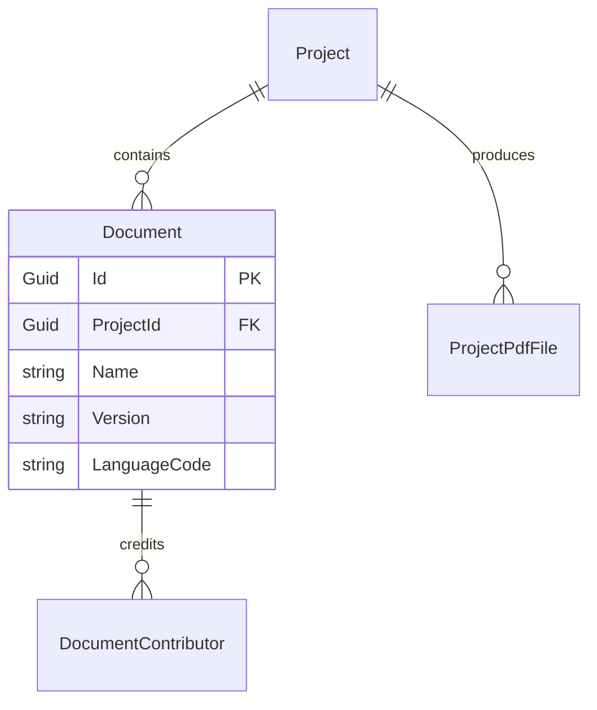
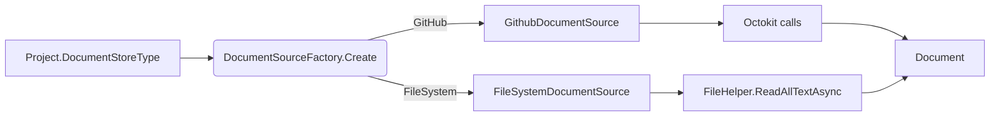
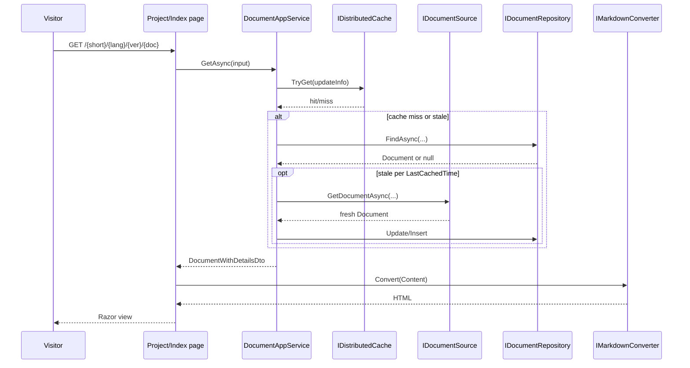
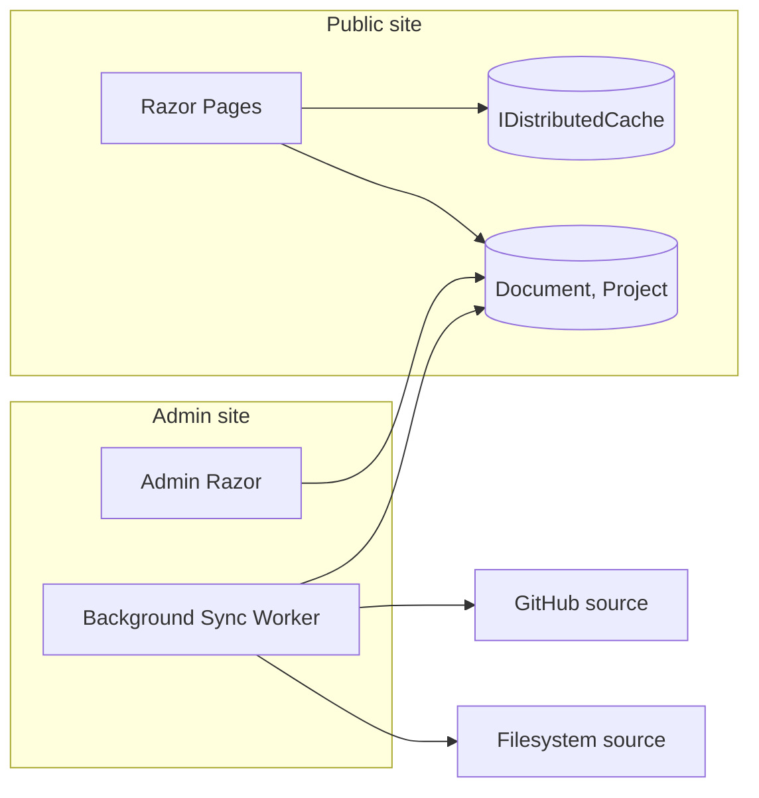

The **Docs** module is the documentation engine that powers the ABP Framework documentation website itself. It is a fully fledged ABP module — domain, application, HTTP API, admin layer, EF Core and MongoDB providers, and a Razor UI — designed around the idea that documentation is a *collection of Projects*, each Project is *versioned and multi-language*, and each version contains many *Documents* (Markdown or HTML files). Sources can be remote GitHub repositories or local file system folders, and a background worker periodically pulls content into the database so the public site serves cached, indexed copies rather than hitting GitHub on every request. The whole stack lives under `modules/docs/src/`. This page walks through every aggregate, the `IDocumentSource` provider pattern, the rendering pipeline, the admin permissions, and how the Razor pages consume the result.

## Solution layout

| Project | Purpose |
| --- | --- |
| `Volo.Docs.Domain.Shared` | Localization, constants (`DocsDomainConsts`) |
| `Volo.Docs.Domain` | `Document`, `Project`, source providers (`FileSystem`, `GitHub`), repositories, full-search abstractions |
| `Volo.Docs.Application(.Contracts)` | Public `DocumentAppService`, `ProjectAppService`, table-of-contents app service |
| `Volo.Docs.Common.Application(.Contracts)` | DTOs and services shared with admin |
| `Volo.Docs.Admin.Application(.Contracts)` | Admin services (project CRUD, manual document pulls, background sync) |
| `Volo.Docs.HttpApi(.Client)` | Public REST controllers + dynamic clients |
| `Volo.Docs.Admin.HttpApi(.Client)` | Admin REST controllers + clients |
| `Volo.Docs.Common.HttpApi(.Client)` | Shared HTTP endpoints (full-text search proxy) |
| `Volo.Docs.Web` | Razor pages, Markdown pipeline, navigation, Prismjs bundling |
| `Volo.Docs.Admin.Web` | Razor admin pages for projects |
| `Volo.Docs.EntityFrameworkCore` | EF Core mapping for relational stores |
| `Volo.Docs.MongoDB` | Mongo collections + repositories |
| `Volo.Docs.Installer` | NuGet installer |

`modules/docs/src/Volo.Docs.Domain.Shared/Volo/Docs/DocsDomainSharedModule.cs` is the small entry point that registers the localization resource:

```csharp
[DependsOn(typeof(AbpLocalizationModule))]
public class DocsDomainSharedModule : AbpModule
{
    public override void ConfigureServices(ServiceConfigurationContext context)
    {
        Configure<AbpLocalizationOptions>(options =>
        {
            options.Resources.Add<DocsResource>("en");
        });
        Configure<AbpExceptionLocalizationOptions>(options =>
        {
            options.MapCodeNamespace("Volo.Docs.Domain", typeof(DocsResource));
        });
    }
}
```

## Project aggregate

`modules/docs/src/Volo.Docs.Domain/Volo/Docs/Projects/Project.cs` defines the top-level container for a documentation set. A project might be "ABP", "MyOpenSourceLib", "Acme.Wiki" — each lives at its own URL prefix and has its own version list:

```csharp
public class Project : AggregateRoot<Guid>
{
    public virtual string Name { get; protected set; }
    public virtual string ShortName { get; protected set; }      // URL segment
    public virtual string Format { get; protected set; }         // "md" or "html"
    public virtual string DefaultDocumentName { get; protected set; }
    public virtual string NavigationDocumentName { get; protected set; }
    public virtual string ParametersDocumentName { get; protected set; }
    public virtual string MinimumVersion { get; set; }
    public virtual string DocumentStoreType { get; protected set; } // "GitHub" | "FileSystem" | custom
    public virtual string MainWebsiteUrl { get; set; }
    public virtual string LatestVersionBranchName { get; set; }
    public virtual List<ProjectPdfFile> PdfFiles { get; set; }
}
```

Several fields are *content-addressing* fields:

- `DefaultDocumentName` — the page shown when a visitor lands on `/{ShortName}/` with no specific document.
- `NavigationDocumentName` — the JSON or Markdown file that drives the left sidebar tree.
- `ParametersDocumentName` — the JSON file containing variable substitutions used during rendering (versions, branding strings).

`ProjectShortNameAlreadyExistsException` (same folder) is thrown when the admin tries to create a second project with the same `ShortName`. The Project also stores a list of `ProjectPdfFile` rows for downloadable manuals.

## Document aggregate

`modules/docs/src/Volo.Docs.Domain/Volo/Docs/Documents/Document.cs`:

```csharp
public class Document : AggregateRoot<Guid>
{
    public virtual Guid ProjectId { get; protected set; }
    public virtual string Name { get; protected set; }
    public virtual string Version { get; protected set; }
    public virtual string LanguageCode { get; protected set; }
    public virtual string FileName { get; set; }
    public virtual string Content { get; set; }
    public virtual string Format { get; set; }
    public virtual string EditLink { get; set; }
    public virtual string RootUrl { get; set; }
    public virtual string RawRootUrl { get; set; }
    public virtual string LocalDirectory { get; set; }
    public virtual DateTime CreationTime { get; set; }
    public virtual DateTime LastUpdatedTime { get; set; }
    public virtual DateTime? LastSignificantUpdateTime { get; set; }
    public virtual DateTime LastCachedTime { get; set; }
    public virtual List<DocumentContributor> Contributors { get; set; }
}
```

A `Document` row is *physical content for a specific (project, name, languageCode, version)*. The same logical "API Reference" page can therefore exist many times in the table — once per (language, version) combination. The `Contributors` list is populated from GitHub commit history when the source is a GitHub repository.

`DocumentWithoutDetails` and `DocumentWithoutContent` (same folder) are projection types used to keep navigation queries lean — pulling thousands of full Markdown bodies just to render a tree is wasteful.



## IDocumentSource — the provider pattern

`modules/docs/src/Volo.Docs.Domain/Volo/Docs/Documents/IDocumentSource.cs`:

```csharp
public interface IDocumentSource : IDomainService
{
    Task<Document> GetDocumentAsync(Project project, string documentName, string languageCode,
        string version, DateTime? lastKnownSignificantUpdateTime = null);
    Task<List<VersionInfo>> GetVersionsAsync(Project project);
    Task<DocumentResource> GetResource(Project project, string resourceName,
        string languageCode, string version);
    Task<LanguageConfig> GetLanguageListAsync(Project project, string version);
}
```

A source is whatever can answer those four questions. Two ship in-box:

| Source | File | Identifier (`Project.DocumentStoreType`) |
| --- | --- | --- |
| GitHub | `GitHub/Documents/GithubDocumentSource.cs` | `"GitHub"` |
| File system | `FileSystem/Documents/FileSystemDocumentSource.cs` | `"FileSystem"` |

`DocumentSourceFactory` (in `Documents/DocumentSourceFactory.cs`) resolves the right source per project at runtime:

```csharp
public class DocumentSourceFactory : IDocumentSourceFactory, ITransientDependency
{
    protected DocumentSourceOptions Options { get; }
    protected IServiceProvider ServiceProvider { get; }

    public virtual IDocumentSource Create(string sourceType)
    {
        var serviceType = Options.Sources.GetOrDefault(sourceType);
        if (serviceType == null)
            throw new ApplicationException($"Unknown document store: {sourceType}");
        return (IDocumentSource)ServiceProvider.GetRequiredService(serviceType);
    }
}
```

Adding a new source is as easy as implementing `IDocumentSource` and registering it:

```csharp
Configure<DocumentSourceOptions>(options =>
{
    options.Sources["Confluence"] = typeof(ConfluenceDocumentSource);
});
```

### GitHub source

`modules/docs/src/Volo.Docs.Domain/Volo/Docs/GitHub/Documents/GithubDocumentSource.cs` carries the `public const string Type = "GitHub";` identifier and uses the Octokit `IGithubRepositoryManager`:

```csharp
public class GithubDocumentSource : DomainService, IDocumentSource
{
    public const string Type = "GitHub";
    private readonly IGithubRepositoryManager _githubRepositoryManager;
    private readonly IGithubPatchAnalyzer _githubPatchAnalyzer;

    public virtual async Task<Document> GetDocumentAsync(Project project, string documentName,
        string languageCode, string version, DateTime? lastKnownSignificantUpdateTime = null)
    {
        var rootUrl = project.GetGitHubUrl(version);
        var rawRootUrl = CalculateRawRootUrlWithLanguageCode(rootUrl, languageCode);
        var editLink = rootUrl.ReplaceFirst("/tree/", "/blob/").EnsureEndsWith('/') + languageCode + "/" + documentName;
        // ... downloads file, parses commits via Octokit, builds Document
    }
}
```

`IGithubPatchAnalyzer` decides whether a commit is *significant* (real content change) vs trivial (whitespace) by inspecting the diff. The result drives `LastSignificantUpdateTime`, which the UI displays as "Last updated" — typo fixes don't reset that timestamp.

### File-system source

`modules/docs/src/Volo.Docs.Domain/Volo/Docs/FileSystem/Documents/FileSystemDocumentSource.cs`:

```csharp
public class FileSystemDocumentSource : DomainService, IDocumentSource
{
    public const string Type = "FileSystem";

    public async Task<Document> GetDocumentAsync(Project project, string documentName, string languageCode,
        string version, DateTime? lastKnownSignificantUpdateTime = null)
    {
        var projectFolder = project.GetFileSystemPath();
        var path = Path.Combine(projectFolder, languageCode, documentName);
        CheckDirectorySecurity(projectFolder, path);
        var content = await FileHelper.ReadAllTextAsync(path);
        // version is forced to "1.0.0" for file-system sources
        return new Document(GuidGenerator.Create(), project.Id, documentName, "1.0.0",
            languageCode, Path.GetFileName(path), content, project.Format, /* ... */);
    }
}
```

`CheckDirectorySecurity` prevents path-traversal — a request for `../../etc/passwd` is rejected before the file is opened. File-system sources don't have a real version concept; the source pins everything to `1.0.0`.



## Application services

`modules/docs/src/Volo.Docs.Application/Volo/Docs/Documents/DocumentAppService.cs` is the public-side workhorse. It composes the repository, the source factory and two distributed caches (`IDistributedCache<DocumentResource>`, `IDistributedCache<DocumentUpdateInfo>`):

```csharp
public class DocumentAppService : DocsAppServiceBase, IDocumentAppService
{
    public INavigationTreePostProcessor NavigationTreePostProcessor { get; set; }
    private readonly IProjectRepository _projectRepository;
    private readonly IDocumentRepository _documentRepository;
    private readonly IDocumentSourceFactory _documentStoreFactory;
    protected IDistributedCache<DocumentResource> ResourceCache { get; }
    protected IDistributedCache<DocumentUpdateInfo> DocumentUpdateCache { get; }
    protected IHostEnvironment HostEnvironment { get; }
    private readonly IDocumentFullSearch _documentFullSearch;
    private readonly DocsElasticSearchOptions _docsElasticSearchOptions;

    public virtual async Task<DocumentWithDetailsDto> GetAsync(GetDocumentInput input) { /* ... */ }
}
```

Three integration points are visible:

- **NavigationTreePostProcessor** — defaults to `NullNavigationTreePostProcessor.Instance` but lets a host inject custom navigation transforms (e.g. drop entries the current user lacks permission to read).
- **Elasticsearch** — `IDocumentFullSearch` and `DocsElasticSearchOptions` plug in full-text search if the host opts in.
- **Cache durations** — `_cacheTimeout`, `_documentResourceAbsoluteExpiration` and `_documentResourceSlidingExpiration` are read from `IConfiguration` so admins can tune cache TTLs without redeploying.

### IDocumentRepository

`modules/docs/src/Volo.Docs.Domain/Volo/Docs/Documents/IDocumentRepository.cs` exposes the typed queries the app service needs. Notable methods:

```csharp
Task<List<DocumentWithoutDetails>> GetListWithoutDetailsByProjectId(Guid projectId, …);
Task<List<DocumentInfo>> GetUniqueListDocumentInfoAsync(…);
Task UpdateProjectLastCachedTimeAsync(Guid projectId, DateTime cachedTime, …);
Task<Document> FindAsync(Guid projectId, string name, string languageCode, string version, …);
Task<Document> FindAsync(Guid projectId, List<string> possibleNames, string languageCode, string version, …);
Task DeleteAsync(Guid projectId, string name, string languageCode, string version, bool autoSave = false, …);
```

The `List<string> possibleNames` overload exists because many doc sets use slightly different file names for the same logical page across versions; the repository tries each candidate in turn.

## Admin layer

`modules/docs/src/Volo.Docs.Admin.Application/Volo/Docs/Admin/` ships `ProjectAdminAppService`, `DocumentAdminAppService` and `BackgroundJobs/` containing the periodic sync workers. Permissions are declared in `modules/docs/src/Volo.Docs.Admin.Application.Contracts/Volo/Docs/Admin/DocsAdminPermissions.cs`:

```csharp
public class DocsAdminPermissions
{
    public const string GroupName = "Docs.Admin";

    public static class Projects
    {
        public const string Default = GroupName + ".Projects";
        public const string Delete  = Default + ".Delete";
        public const string Update  = Default + ".Update";
        public const string Create  = Default + ".Create";
        public const string ManagePdfFiles = Default + ".ManagePdfFiles";
    }

    public static class Documents
    {
        public const string Default = GroupName + ".Documents";
    }
}
```

The admin app services run inside the `Docs.Admin` permission group, distinct from the (largely anonymous) public app services. The permission system is the same one introduced in [Security overview](/security/overview).

### Background jobs

`Volo.Docs.Admin.Application/Volo/Docs/Admin/BackgroundJobs/` contains workers that periodically iterate over each `Project`, call `IDocumentSource.GetVersionsAsync` to update the version list, and refresh documents whose `LastCachedTime` is older than the configured TTL. The job calls into `DocumentAdminAppService` to perform the upsert, so the same code path that an admin uses for "Force refresh" is exercised on schedule.

## Web layer

`modules/docs/src/Volo.Docs.Web/DocsWebModule.cs` wires the Razor pages:

```csharp
[DependsOn(
    typeof(DocsApplicationContractsModule),
    typeof(AbpMapperlyModule),
    typeof(AbpAspNetCoreMvcUiBootstrapModule),
    typeof(AbpAspNetCoreMvcUiThemeSharedModule),
    typeof(AbpAspNetCoreMvcUiPackagesModule),
    typeof(AbpAspNetCoreMvcUiBundlingModule)
)]
public class DocsWebModule : AbpModule { /* ... */ }
```

Because it depends only on `DocsApplicationContractsModule` (not the implementation), the Web project can be split into its own process talking to a remote API.

### Pages

The Razor pages live under `modules/docs/src/Volo.Docs.Web/Pages/Documents/`:

| Page | Role |
| --- | --- |
| `Index.cshtml.cs` | Project picker / landing |
| `Project/Index.cshtml.cs` | The actual document viewer (`/{shortName}/{language}/{version}/{document}`) |
| `Search.cshtml.cs` | Full-text search page |
| `Shared/ErrorComponent/ErrorPageModel.cs` | 404 / error view component |

`Project/Index.cshtml.cs` is the largest — it composes the navigation tree, resolves the document via `DocumentAppService.GetAsync`, runs Markdown-to-HTML conversion, then renders Prism-highlighted code. It uses `ILocalEventBus` to emit "document viewed" events that hosts can subscribe to for analytics.

### Markdown rendering

`modules/docs/src/Volo.Docs.Web/Markdown/` hosts the Markdig pipeline. `IMarkdownConverter` is the abstraction; `HighlightedCodeBlockExtension` extends Markdig to emit `<pre><code class="language-xxx">` blocks that Prismjs hydrates client-side. `MarkdownPipelineBuilderExtensions` registers the built-in extensions (tables, footnotes, auto-identifiers, ABP code-tab syntax).

### HTML normalisation

`modules/docs/src/Volo.Docs.Web/HtmlConverting/` contains `HtmlNormalizer`, `IWebDocumentSectionRenderer` and `ScribanWebDocumentSectionRenderer`. The Scriban renderer interprets templating expressions inside documents — useful for things like `<%= version.major %>` — using the Scriban templating engine. `DocumentToHtmlConverterContext` carries the current project/version/language so the renderer can substitute the right values.



## Searching and table of contents

`modules/docs/src/Volo.Docs.Application/Volo/Docs/TableOfContents/` ships an app service that fetches the navigation document (per project setting `NavigationDocumentName`), parses it, applies `INavigationTreePostProcessor` and returns a typed tree. The Web page renders this with `TreeTagHelper` (`modules/docs/src/Volo.Docs.Web/Areas/Documents/TagHelpers/TreeTagHelper.cs`).

Full-text search depends on the `IDocumentFullSearch` abstraction. The default no-op implementation just queries the database with `LIKE`; an Elasticsearch implementation exists for hosts that enable `DocsElasticSearchOptions`.

## Caching strategy

Two distributed caches operate in parallel:

1. **`IDistributedCache<DocumentUpdateInfo>`** — small markers storing "last cached time per (project, version, language)". Checking this is cheap and avoids querying the source on every read.
2. **`IDistributedCache<DocumentResource>`** — non-document binary assets (images, attachments) cached as bytes.

When a request hits and the first cache says "still fresh", the rendered HTML can be served straight from the DB Document row. When the marker is stale, the app service kicks off a refresh through `IDocumentSourceFactory`.

## Permissions and access

The public viewer is largely anonymous, but a host can layer `INavigationTreePostProcessor` to remove entries the visitor lacks permission to read — useful for partial private docs. The admin pages require the `Docs.Admin.*` permissions documented above, which are managed through the standard ABP permission management system (see [Security overview](/security/overview)).

## Deployment topology



A common deployment is to run the public site horizontally scaled (read-only), with admin + background sync on a separate pod.

## Recap

The Docs module is a complete documentation engine modelled around two aggregates (`Project`, `Document`), a pluggable `IDocumentSource` interface with `GitHub` and `FileSystem` implementations out of the box, a Razor viewer with Markdig + Scriban + Prismjs in the rendering pipeline, an admin layer for CRUD and manual refresh, background workers for periodic sync, and a two-tier distributed cache for hot-path reads. It composes naturally with the [Basic Theme](/modules/basic-theme), the [MVC stack](/aspnetcore/mvc), [the UI-MVC theme](/ui-mvc/overview), and — for authenticated admin views — the [Identity](/modules/identity) and [Account](/modules/account) modules whose permission tree is documented under [Security overview](/security/overview). For a Blazor-based admin UI, see [Blazor overview](/blazor/overview).
