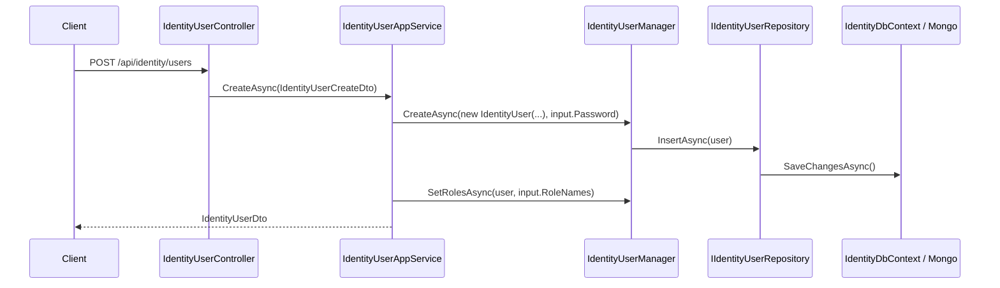

The Identity module under `modules/identity/src/` is ABP Framework's reference implementation of identity management. It builds on top of `Microsoft.AspNetCore.Identity`'s `UserManager<TUser>` / `RoleManager<TRole>` abstractions, adds aggregate roots for organization units, claim types, sessions, delegations, security logs, link-users and passkeys, and exposes them through application services, an HTTP API, and EF Core + MongoDB persistence. This page walks through the source layout under `modules/identity/src/`, the aggregate roots in `Volo.Abp.Identity.Domain`, the contracts and DTOs in `Volo.Abp.Identity.Application.Contracts`, and the EF Core / MongoDB layers that hydrate them.

The module is also the integration point for everything in the rest of the application module catalog: `account` consumes `IdentityUserManager` to register users and run profile updates; `permission-management` and `feature-management` use the user/role identifiers as `ProviderKey`s on their grants; `tenant-management` cross-references `IdentityUser.TenantId`. See [Permission Management](/modules/permission-management) and [Tenant Management](/modules/tenant-management) for those interactions.

## Project layout

```
modules/identity/src/
├── Volo.Abp.Identity.Domain.Shared/        Enums, error codes, AbpIdentityDbProperties
├── Volo.Abp.Identity.Domain/               Aggregates, managers, repository interfaces
├── Volo.Abp.Identity.Application.Contracts/  IIdentity*AppService + DTOs + IdentityPermissions
├── Volo.Abp.Identity.Application/          IdentityUserAppService, IdentityRoleAppService, …
├── Volo.Abp.Identity.HttpApi/              ASP.NET Core controllers
├── Volo.Abp.Identity.HttpApi.Client/       Dynamic C# proxies
├── Volo.Abp.Identity.AspNetCore/           SignInManager glue, claims principal contributors
├── Volo.Abp.Identity.EntityFrameworkCore/  IdentityDbContext + EF repositories
├── Volo.Abp.Identity.MongoDB/              AbpIdentityMongoDbContext + Mongo repositories
├── Volo.Abp.Identity.Web/                  Razor Pages admin UI
├── Volo.Abp.Identity.Blazor[/Server/WebAssembly]/  Blazor admin UI
└── Volo.Abp.Identity.Installer/            NuGet meta-package
```

## Aggregate roots

The domain layer in `Volo.Abp.Identity.Domain/Volo/Abp/Identity/` exposes eight aggregate roots. They are listed here with their entity files and salient state.

| Aggregate root | File | Base type | Purpose |
| --- | --- | --- | --- |
| `IdentityUser` | `IdentityUser.cs` | `FullAuditedAggregateRoot<Guid>` | Authenticatable user — credentials, claims, roles, OUs, tokens, sessions, passkeys |
| `IdentityRole` | `IdentityRole.cs` | `AggregateRoot<Guid>` | Named role with claims; `IsDefault`, `IsStatic`, `IsPublic` flags |
| `OrganizationUnit` | `OrganizationUnit.cs` | `FullAuditedAggregateRoot<Guid>` | Hierarchical OU with materialised `Code` like `00001.00042.00005` |
| `IdentityClaimType` | `IdentityClaimType.cs` | `AggregateRoot<Guid>` | Dynamic claim type definition (name, regex, type, default value) |
| `IdentityUserDelegation` | `IdentityUserDelegation.cs` | `BasicAggregateRoot<Guid>` | Time-boxed `SourceUserId → TargetUserId` impersonation grant |
| `IdentitySession` | `IdentitySession.cs` | `BasicAggregateRoot<Guid>` | Active session row used for forced sign-out and listing |
| `IdentitySecurityLog` | `IdentitySecurityLog.cs` | `AggregateRoot<Guid>` | Append-only security event log (login, logout, lockout…) |
| `IdentityLinkUser` | `IdentityLinkUser.cs` | `BasicAggregateRoot<Guid>` | Cross-tenant account linking for "switch account" UX |

### IdentityUser

`IdentityUser` is the largest aggregate. The class signature pulls in three ABP concerns alongside ASP.NET Identity:

```csharp
// modules/identity/src/Volo.Abp.Identity.Domain/Volo/Abp/Identity/IdentityUser.cs
public class IdentityUser : FullAuditedAggregateRoot<Guid>, IUser, IHasEntityVersion
{
    public virtual Guid? TenantId { get; protected set; }
    public virtual string UserName { get; protected internal set; }
    [DisableAuditing] public virtual string NormalizedUserName { get; protected internal set; }
    public virtual string Email { get; protected internal set; }
    public virtual bool EmailConfirmed { get; protected internal set; }
    // PhoneNumber, PasswordHash, SecurityStamp, ConcurrencyStamp, LockoutEnd…
    public virtual ICollection<IdentityUserRole> Roles { get; protected set; }
    public virtual ICollection<IdentityUserClaim> Claims { get; protected set; }
    public virtual ICollection<IdentityUserLogin> Logins { get; protected set; }
    public virtual ICollection<IdentityUserToken> Tokens { get; protected set; }
    public virtual ICollection<IdentityUserOrganizationUnit> OrganizationUnits { get; protected set; }
    public virtual ICollection<IdentityUserPasskey> Passkeys { get; protected set; }
    public virtual ICollection<IdentityUserPasswordHistory> PasswordHistories { get; protected set; }
}
```

The `[DisableAuditing]` attribute on the normalised columns prevents them from leaking into audit logs (see [Audit Logging](/modules/audit-logging)). `IUser` is the framework-wide contract used by `ICurrentUser` and the [Users abstractions](https://github.com/abpframework/abp/tree/dev/modules/users).

Collections are kept as `ICollection<>` with `protected set` to enforce mutation through manager methods such as `AddRole`, `AddLogin`, `AddClaim`. Convenience extensions live in `IdentityUserPasskeyExtensions.cs`.

### IdentityRole, OrganizationUnit, IdentityClaimType

```csharp
// IdentityRole.cs
public class IdentityRole : AggregateRoot<Guid>, IMultiTenant, IHasEntityVersion, IHasCreationTime
{
    public virtual Guid? TenantId { get; protected set; }
    public virtual string Name { get; protected internal set; }
    public virtual ICollection<IdentityRoleClaim> Claims { get; protected set; }
    public virtual bool IsDefault { get; set; }
    public virtual bool IsStatic { get; set; }
    public virtual bool IsPublic { get; set; }
}
```

```csharp
// OrganizationUnit.cs
public class OrganizationUnit : FullAuditedAggregateRoot<Guid>, IMultiTenant, IHasEntityVersion
{
    public virtual Guid? ParentId { get; internal set; }
    public virtual string Code { get; internal set; } // "00001.00042.00005"
    public virtual string DisplayName { get; set; }
    public virtual ICollection<OrganizationUnitRole> Roles { get; protected set; }
}
```

The hierarchical `Code` is generated by `OrganizationUnitManager` (see below) so siblings sort lexically and parents can be matched with `Code.StartsWith(parentCode)`.

```csharp
// IdentityClaimType.cs
public class IdentityClaimType : AggregateRoot<Guid>, IHasCreationTime
{
    public virtual string Name { get; protected set; }
    public virtual bool Required { get; set; }
    public virtual bool IsStatic { get; protected set; }
    public virtual string Regex { get; set; }
    public virtual string Description { get; set; }
}
```

### IdentitySession, IdentitySecurityLog, IdentityUserDelegation, IdentityLinkUser

```csharp
// IdentitySession.cs
public class IdentitySession : BasicAggregateRoot<Guid>, IHasExtraProperties, IMultiTenant
{
    public virtual string SessionId { get; protected set; }
    public virtual string Device { get; protected set; }  // "Web", "Mobile" …
    public virtual string DeviceInfo { get; protected set; }
}

// IdentitySecurityLog.cs
public class IdentitySecurityLog : AggregateRoot<Guid>, IMultiTenant
{
    public virtual string ApplicationName { get; protected set; }
    public virtual string Identity { get; protected set; }
    public virtual string Action { get; protected set; }
    public virtual Guid? UserId { get; protected set; }
}

// IdentityUserDelegation.cs — time-boxed impersonation
public class IdentityUserDelegation : BasicAggregateRoot<Guid>, IMultiTenant
{
    public virtual Guid SourceUserId { get; protected set; }
    public virtual Guid TargetUserId { get; protected set; }
    public virtual DateTime StartTime { get; protected set; }
    public virtual DateTime EndTime { get; protected set; }
}

// IdentityLinkUser.cs — cross-tenant "linked accounts"
public class IdentityLinkUser : BasicAggregateRoot<Guid>
{
    public virtual Guid SourceUserId { get; protected set; }
    public virtual Guid? SourceTenantId { get; protected set; }
    public virtual Guid TargetUserId { get; protected set; }
    public virtual Guid? TargetTenantId { get; protected set; }
}
```

`IdentityPasskeyData` (in `IdentityPasskeyData.cs`) is a *value object* embedded inside `IdentityUserPasskey`, not an aggregate root; it stores the WebAuthn public key, friendly name, transports, and credential ID.

## Domain services (managers)

`Volo.Abp.Identity.Domain` contains three domain service base classes that each extend the matching ASP.NET Identity manager and add ABP plumbing.

| Manager | File | Extends | Adds |
| --- | --- | --- | --- |
| `IdentityUserManager` | `IdentityUserManager.cs` | `UserManager<IdentityUser>` | `IDistributedEventBus`, `ISettingProvider`, OU helpers, dynamic claim cache |
| `IdentityRoleManager` | `IdentityRoleManager.cs` | `RoleManager<IdentityRole>` | Localised errors, OU role validation, claim cache invalidation |
| `OrganizationUnitManager` | `OrganizationUnitManager.cs` | `DomainService` | Hierarchical `Code` generation, move + delete cascade |
| `IdentityClaimTypeManager` | `IdentityClaimTypeManager.cs` | `DomainService` | Duplicate-name validation and static claim guard |
| `IdentityUserDelegationManager` | `IdentityUserDelegationManager.cs` | `DomainService` | Validates delegation overlap and target/source tenancy |
| `IdentityLinkUserManager` | `IdentityLinkUserManager.cs` | `DomainService` | Linking, finding, and revoking cross-tenant links |
| `IdentitySecurityLogManager` | `IdentitySecurityLogManager.cs` | `DomainService` | Captures contextual data and writes via repository |

```csharp
// IdentityUserManager.cs — constructor signature
public IdentityUserManager(
    IdentityUserStore store,
    IIdentityRoleRepository roleRepository,
    IIdentityUserRepository userRepository,
    IOptions<IdentityOptions> optionsAccessor,
    IPasswordHasher<IdentityUser> passwordHasher,
    IEnumerable<IUserValidator<IdentityUser>> userValidators,
    IEnumerable<IPasswordValidator<IdentityUser>> passwordValidators,
    ILookupNormalizer keyNormalizer,
    IdentityErrorDescriber errors,
    IServiceProvider services,
    ILogger<IdentityUserManager> logger,
    ICancellationTokenProvider cancellationTokenProvider,
    IOrganizationUnitRepository organizationUnitRepository,
    ISettingProvider settingProvider,
    IDistributedEventBus distributedEventBus,
    IIdentityLinkUserRepository identityLinkUserRepository,
    IDistributedCache<AbpDynamicClaimCacheItem> dynamicClaimCache,
    IOptions<AbpMultiTenancyOptions> multiTenancyOptions,
    ICurrentTenant currentTenant,
    IDataFilter dataFilter) : base(store, …)
```

`IdentityUserStore` (in `IdentityUserStore.cs`) is the bridge between the ASP.NET Identity store API and ABP's repository pattern — it converts the framework calls into `IIdentityUserRepository` operations.

### External login providers

The module abstracts third-party authentication sources via `IExternalLoginProvider`:

```csharp
// modules/identity/src/Volo.Abp.Identity.Domain/Volo/Abp/Identity/IExternalLoginProvider.cs
public interface IExternalLoginProvider
{
    Task<bool> TryAuthenticateAsync(string userName, string plainPassword);
    Task<IdentityUser> CreateUserAsync(string userName, string providerName);
    Task UpdateUserAsync(IdentityUser user, string providerName);
    Task<bool> IsEnabledAsync();
}
```

The matching base classes (`ExternalLoginProviderBase`, `ExternalLoginProviderWithPasswordBase`) and the `ExternalLoginProviderDictionary` are used by LDAP, Active Directory, and bespoke connectors to register themselves. The default password-based fall-back is `IdentityUserRepositoryExternalUserLookupServiceProvider` which implements `IExternalUserLookupServiceProvider` from the [Users module](https://github.com/abpframework/abp/tree/dev/modules/users).

## Repositories

Repository interfaces live next to the aggregates in `Volo.Abp.Identity.Domain`:

| Interface | File | Notes |
| --- | --- | --- |
| `IIdentityUserRepository` | `IIdentityUserRepository.cs` | `FindByNormalizedUserName`, `GetListAsync`, `GetRolesAsync`, `GetOrganizationUnitsAsync` |
| `IIdentityRoleRepository` | `IIdentityRoleRepository.cs` | `FindByNormalizedNameAsync`, `GetListAsync` |
| `IOrganizationUnitRepository` | `IOrganizationUnitRepository.cs` | `GetChildrenAsync`, `GetUsersAsync` |
| `IIdentityClaimTypeRepository` | `IIDentityClaimTypeRepository.cs` | `AnyAsync(name)` for duplicate detection |
| `IIdentitySecurityLogRepository` | `IIdentitySecurityLogRepository.cs` | Time-range filtering |
| `IIdentitySessionRepository` | `IIdentitySessionRepository.cs` | List sessions per user |
| `IIdentityUserDelegationRepository` | `IIdentityUserDelegationRepository.cs` | Active delegations by `TargetUserId` |
| `IIdentityLinkUserRepository` | `IIdentityLinkUserRepository.cs` | `FindAsync(source, target)` |

The EF Core implementations under `Volo.Abp.Identity.EntityFrameworkCore` mirror these names with an `EfCore` prefix — `EfCoreIdentityUserRepository`, `EfCoreOrganizationUnitRepository`, etc. The MongoDB versions use `Mongo` prefix.

## EF Core layer

```csharp
// modules/identity/src/Volo.Abp.Identity.EntityFrameworkCore/Volo/Abp/Identity/EntityFrameworkCore/IdentityDbContext.cs
[ConnectionStringName(AbpIdentityDbProperties.ConnectionStringName)]
public class IdentityDbContext : AbpDbContext<IdentityDbContext>, IIdentityDbContext
{
    public DbSet<IdentityUser> Users { get; set; }
    public DbSet<IdentityRole> Roles { get; set; }
    public DbSet<IdentityClaimType> ClaimTypes { get; set; }
    public DbSet<OrganizationUnit> OrganizationUnits { get; set; }
    public DbSet<IdentitySecurityLog> SecurityLogs { get; set; }
    public DbSet<IdentityLinkUser> LinkUsers { get; set; }
    public DbSet<IdentityUserDelegation> UserDelegations { get; set; }
    public DbSet<IdentitySession> Sessions { get; set; }

    protected override void OnModelCreating(ModelBuilder builder)
    {
        base.OnModelCreating(builder);
        builder.ConfigureIdentity();
    }
}
```

`builder.ConfigureIdentity()` is the extension defined in `IdentityDbContextModelBuilderExtensions.cs` — it sets up table prefixes via `AbpIdentityDbProperties.DbTablePrefix`, owned-entity navigations for claims/logins/tokens, and value-comparers for collections. The connection-string name resolves through ABP's [connection strings](/data/connection-strings) infrastructure, so this DbContext can live in its own database.

The module is registered in a host like this:

```csharp
context.Services.AddAbpDbContext<IdentityDbContext>(options =>
{
    options.AddDefaultRepositories<IIdentityDbContext>();
});
```

See [EF Core integration](/data/entity-framework-core) for the mechanics of `AddAbpDbContext`.

## MongoDB layer

```csharp
// modules/identity/src/Volo.Abp.Identity.MongoDB/Volo/Abp/Identity/MongoDB/AbpIdentityMongoDbContext.cs
[ConnectionStringName(AbpIdentityDbProperties.ConnectionStringName)]
public class AbpIdentityMongoDbContext : AbpMongoDbContext, IAbpIdentityMongoDbContext
{
    public IMongoCollection<IdentityUser> Users => Collection<IdentityUser>();
    public IMongoCollection<IdentityRole> Roles => Collection<IdentityRole>();
    public IMongoCollection<IdentityClaimType> ClaimTypes => Collection<IdentityClaimType>();
    public IMongoCollection<OrganizationUnit> OrganizationUnits => Collection<OrganizationUnit>();
    public IMongoCollection<IdentitySecurityLog> SecurityLogs => Collection<IdentitySecurityLog>();
    public IMongoCollection<IdentityLinkUser> LinkUsers => Collection<IdentityLinkUser>();
    public IMongoCollection<IdentityUserDelegation> UserDelegations => Collection<IdentityUserDelegation>();
    public IMongoCollection<IdentitySession> Sessions => Collection<IdentitySession>();

    protected override void CreateModel(IMongoModelBuilder modelBuilder)
    {
        base.CreateModel(modelBuilder);
        modelBuilder.ConfigureIdentity();
    }
}
```

The Mongo flavour stores the role/claim/login collections *inside* each `IdentityUser` document (denormalised). See [MongoDB integration](/data/mongodb-integration) for how `AbpMongoDbContext` and `ConfigureIdentity()` model these embedded collections.

## Application services

`Volo.Abp.Identity.Application` contains three application service implementations, all decorated with `[Authorize(IdentityPermissions.…)]`.

### IdentityUserAppService

```csharp
// modules/identity/src/Volo.Abp.Identity.Application/Volo/Abp/Identity/IdentityUserAppService.cs
public class IdentityUserAppService : IdentityAppServiceBase, IIdentityUserAppService
{
    [Authorize(IdentityPermissions.Users.Default)]
    public virtual async Task<IdentityUserDto> GetAsync(Guid id)
        => ObjectMapper.Map<IdentityUser, IdentityUserDto>(await UserManager.GetByIdAsync(id));

    [Authorize(IdentityPermissions.Users.Default)]
    public virtual async Task<PagedResultDto<IdentityUserDto>> GetListAsync(GetIdentityUsersInput input)
    {
        var count = await UserRepository.GetCountAsync(input.Filter);
        var list = await UserRepository.GetListAsync(
            input.Sorting, input.MaxResultCount, input.SkipCount, input.Filter);
        return new PagedResultDto<IdentityUserDto>(count,
            ObjectMapper.Map<List<IdentityUser>, List<IdentityUserDto>>(list));
    }
}
```

The contract is `ICrudAppService` with an additional role-management surface:

```csharp
// IIdentityUserAppService.cs
public interface IIdentityUserAppService
    : ICrudAppService<IdentityUserDto, Guid, GetIdentityUsersInput,
                      IdentityUserCreateDto, IdentityUserUpdateDto>
{
    Task<ListResultDto<IdentityRoleDto>> GetRolesAsync(Guid id);
    Task<ListResultDto<IdentityRoleDto>> GetAssignableRolesAsync();
    Task UpdateRolesAsync(Guid id, IdentityUserUpdateRolesDto input);
    Task<IdentityUserDto> FindByUsernameAsync(string userName);
    Task<IdentityUserDto> FindByEmailAsync(string email);
}
```

DTOs (`IdentityUserDto`, `IdentityUserCreateDto`, `IdentityUserUpdateDto`) all derive from `Extensible…Dto` base types so module consumers can add custom properties through the [object-extending system](/ddd/object-extending).

### IdentityRoleAppService and IdentityUserLookupAppService

`IdentityRoleAppService` is the role admin surface — create / update / delete / list — gated by `IdentityPermissions.Roles.*`. `IdentityUserLookupAppService` is a thin, integration-oriented surface used by other modules (such as `permission-management` when resolving user provider keys to display names); it is permission-gated by `IdentityPermissions.UserLookup.Default`.

## Permissions

The full permission tree is declared in `IdentityPermissions.cs`:

```csharp
public static class IdentityPermissions
{
    public const string GroupName = "AbpIdentity";

    public static class Roles { /* Default, Create, Update, Delete, ManagePermissions */ }
    public static class Users { /* Default, Create, Update, Delete, ManagePermissions, ManageRoles */ }
    public static class UserLookup { /* Default */ }
}
```

Each constant is materialised at startup by `IdentityPermissionDefinitionProvider` (same folder) and surfaced through the [Permissions infrastructure](/security/permissions). The `Update.ManageRoles` permission is a *child* permission underneath `Update`, which the permission UI renders as a nested checkbox.

## HTTP API controllers

```csharp
// modules/identity/src/Volo.Abp.Identity.HttpApi/Volo/Abp/Identity/IdentityUserController.cs
[RemoteService(Name = IdentityRemoteServiceConsts.RemoteServiceName)]
[Area(IdentityRemoteServiceConsts.ModuleName)]
[ControllerName("User")]
[Route("api/identity/users")]
public class IdentityUserController : AbpControllerBase, IIdentityUserAppService
{
    [HttpGet, Route("{id}")]
    public virtual Task<IdentityUserDto> GetAsync(Guid id)
        => UserAppService.GetAsync(id);

    [HttpGet]
    public virtual Task<PagedResultDto<IdentityUserDto>> GetListAsync(GetIdentityUsersInput input)
        => UserAppService.GetListAsync(input);

    [HttpPost]
    public virtual Task<IdentityUserDto> CreateAsync(IdentityUserCreateDto input)
        => UserAppService.CreateAsync(input);

    [HttpPut, Route("{id}")]
    public virtual Task<IdentityUserDto> UpdateAsync(Guid id, IdentityUserUpdateDto input)
        => UserAppService.UpdateAsync(id, input);
}
```

`IdentityRoleController` and `IdentityUserLookupController` follow the same pattern, mounting at `api/identity/roles` and `api/identity/users/lookup`. The controllers *implement* the matching `I…AppService` so dynamic C# proxies in `HttpApi.Client` can be consumed by Blazor / MAUI clients — see [MVC integration](/aspnetcore/mvc).

## Settings, options, dynamic claims

`AbpIdentitySettingDefinitionProvider.cs` declares user / lockout / sign-in settings (e.g. `IdentitySettingNames.Password.RequiredLength`, `IdentitySettingNames.Lockout.AllowedForNewUsers`). Together with `AbpIdentityOptions` and the `AbpIdentityOptionsManager`, ABP turns those persisted settings into a live `IdentityOptions` snapshot used by the ASP.NET Identity stack.

Dynamic claims are populated by `IdentityDynamicClaimsPrincipalContributor` and cached per-user through `IdentityDynamicClaimsPrincipalContributorCache` so that changes to roles, OU memberships, or claim values get pushed onto the next request without re-issuing tokens.

## Request flow



`IdentityUserAppService` also emits domain events (`IdentityUserCreatedEto`) through `IDistributedEventBus` so subscribers — such as a search-index updater or the `users` lookup module — can react.

## Data seeding

`IdentityDataSeeder` in the domain layer is the canonical reference implementation of an `IIdentityDataSeeder`: it bootstraps the `admin` role and `admin` user with a configurable email + password (`IdentityDataSeedContributor` wires it into the [data seeding](/data/data-seeding) pipeline). Hosts override the default admin email via `IdentityDataSeedContributorOptions`.

## Related modules

<CardGroup cols={2}>
  <Card title="Account" icon="right-to-bracket" href="/modules/account">
    Razor pages and Blazor screens that call `IdentityUserManager` to register users and update profiles.
  </Card>
  <Card title="Permission Management" icon="key" href="/modules/permission-management">
    Stores role / user grants whose `ProviderKey` is the role name or user id from this module.
  </Card>
  <Card title="Tenant Management" icon="building" href="/modules/tenant-management">
    Holds the `Tenant` aggregate referenced by `IdentityUser.TenantId`.
  </Card>
  <Card title="Audit Logging" icon="clipboard-list" href="/modules/audit-logging">
    Records sign-in attempts and `[Audited]` operations on user/role mutations.
  </Card>
</CardGroup>
