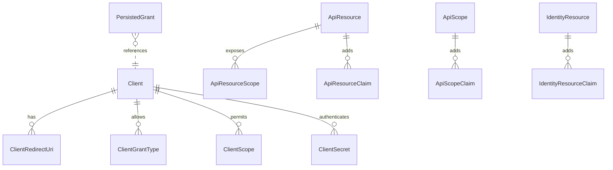
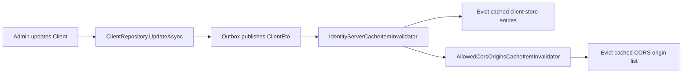

The **IdentityServer** module integrates the (now end-of-life) [IdentityServer4](https://github.com/IdentityServer/IdentityServer4) library with the ABP Framework. While [OpenIddict](/modules/openiddict-module) is the recommended choice for new applications, IdentityServer remains in the repository to support upgrades and existing deployments. The code lives at `modules/identityserver/src/` and maps every IdentityServer concept — clients, API resources, API scopes, identity resources and persisted grants — to ABP aggregate roots, so that they can be administered through ABP repositories, audited, and exposed through ABP's permission system. This page is a tour through every aggregate, the validators and CORS extensions ABP adds on top, and the AspNetIdentity bridge that ties it to the [Identity module](/modules/identity).

## Solution structure

| Project | Role |
| --- | --- |
| `Volo.Abp.IdentityServer.Domain.Shared` | Constants, error codes, distributed-event payloads (`ClientEto`, `ApiResourceEto` …) |
| `Volo.Abp.IdentityServer.Domain` | Aggregates, repositories, IdentityServer extension classes, claims service |
| `Volo.Abp.IdentityServer.EntityFrameworkCore` | EF Core mappings + `IdentityServerDbContext` |
| `Volo.Abp.IdentityServer.MongoDB` | MongoDB collections + repositories |
| `Volo.Abp.PermissionManagement.Domain.IdentityServer` | Bridges OIDC client permissions into ABP's permission tree |
| `Volo.Abp.IdentityServer.Installer` | Installer for the older `abp add-module` flow |

There is no separate `AspNetCore` host project (unlike OpenIddict). IdentityServer4's own middleware is registered directly from a host project through `AddIdentityServer()` — the ABP module's contribution lives entirely in the domain layer, plus EF Core/MongoDB persistence.

The domain module is bootstrapped by `modules/identityserver/src/Volo.Abp.IdentityServer.Domain/Volo/Abp/IdentityServer/AbpIdentityServerDomainModule.cs`:

```csharp
[DependsOn(
    typeof(AbpIdentityServerDomainSharedModule),
    typeof(AbpMapperlyModule),
    typeof(AbpIdentityDomainModule),
    typeof(AbpSecurityModule),
    typeof(AbpCachingModule),
    typeof(AbpValidationModule),
    typeof(AbpBackgroundWorkersModule)
)]
public class AbpIdentityServerDomainModule : AbpModule
{
    public override void ConfigureServices(ServiceConfigurationContext context)
    {
        context.Services.AddMapperlyObjectMapper<AbpIdentityServerDomainModule>();

        Configure<AbpDistributedEntityEventOptions>(options =>
        {
            options.EtoMappings.Add<ApiResource, ApiResourceEto>(typeof(AbpIdentityServerDomainModule));
            options.EtoMappings.Add<Client, ClientEto>(typeof(AbpIdentityServerDomainModule));
            options.EtoMappings.Add<DeviceFlowCodes, DeviceFlowCodesEto>(typeof(AbpIdentityServerDomainModule));
            options.EtoMappings.Add<IdentityResource, IdentityResourceEto>(typeof(AbpIdentityServerDomainModule));
        });

        Configure<AbpClaimsServiceOptions>(options =>
        {
            options.RequestedClaims.AddRange(new[]{ AbpClaimTypes.TenantId, AbpClaimTypes.EditionId });
        });
    }
}
```

Two registrations are critical: the **distributed entity-event Eto mappings** ensure that updates to clients / API resources broadcast cache-invalidation events across nodes, and `AbpClaimsServiceOptions.RequestedClaims` adds the ABP-specific `TenantId` and `EditionId` to every issued token.

## The five aggregates

| Aggregate | File | Cardinality |
| --- | --- | --- |
| `Client` | `Clients/Client.cs` | One per OAuth client |
| `ApiResource` | `ApiResources/ApiResource.cs` | One per protected API |
| `ApiScope` | `ApiScopes/ApiScope.cs` | One per declarable scope name |
| `IdentityResource` | `IdentityResources/IdentityResource.cs` | One per OIDC identity scope (e.g. `profile`) |
| `PersistedGrant` | `Grants/PersistedGrant.cs` | Issued grant artifacts |

### Client

The largest aggregate by field count. `modules/identityserver/src/Volo.Abp.IdentityServer.Domain/Volo/Abp/IdentityServer/Clients/Client.cs`:

```csharp
public class Client : FullAuditedAggregateRoot<Guid>
{
    public virtual string ClientId { get; set; }
    public virtual string ClientName { get; set; }
    public virtual string Description { get; set; }
    public virtual string ClientUri { get; set; }
    public virtual string LogoUri { get; set; }
    public virtual bool Enabled { get; set; } = true;
    public virtual string ProtocolType { get; set; }
    public virtual bool RequireClientSecret { get; set; }
    public virtual bool RequireConsent { get; set; }
    public virtual bool AllowRememberConsent { get; set; }
    public virtual bool AlwaysIncludeUserClaimsInIdToken { get; set; }
    public virtual bool RequirePkce { get; set; }
    public virtual bool AllowPlainTextPkce { get; set; }
    public virtual bool AllowAccessTokensViaBrowser { get; set; }
    public virtual string FrontChannelLogoutUri { get; set; }
    public virtual bool FrontChannelLogoutSessionRequired { get; set; }
    public virtual string BackChannelLogoutUri { get; set; }
    public virtual bool BackChannelLogoutSessionRequired { get; set; }
    public virtual bool AllowOfflineAccess { get; set; }
    public virtual int IdentityTokenLifetime { get; set; }
    public virtual string AllowedIdentityTokenSigningAlgorithms { get; set; }
    public virtual int AccessTokenLifetime { get; set; }
    public virtual int AuthorizationCodeLifetime { get; set; }
    // ...
}
```

The aggregate has many *child collections* — they are real navigation properties (unlike OpenIddict's JSON blobs):

- `ClientGrantType` (allowed grant types like `authorization_code`)
- `ClientRedirectUri` and `ClientPostLogoutRedirectUri`
- `ClientScope` (allowed scopes)
- `ClientSecret`
- `ClientCorsOrigin`
- `ClientIdPRestriction`
- `ClientClaim`
- `ClientProperty`

This structural choice is exactly the opposite of OpenIddict — IdentityServer relies on relational joins instead of JSON-array string columns. EF Core takes care of cascade behaviour through `IdentityServerDbContextModelCreatingExtensions.ConfigureIdentityServer()`.

### ApiResource and ApiScope

In IdentityServer4 these are different concepts: `ApiResource` represents a logical API (e.g. `BookStore.Reports`), while `ApiScope` is a permission scope (e.g. `reports.read`). The same API can expose multiple scopes.

```csharp
public class ApiResource : FullAuditedAggregateRoot<Guid>
{
    [NotNull] public virtual string Name { get; protected set; }
    public virtual string DisplayName { get; set; }
    public virtual string Description { get; set; }
    public virtual bool Enabled { get; set; }
    public virtual string AllowedAccessTokenSigningAlgorithms { get; set; }
    public virtual bool ShowInDiscoveryDocument { get; set; } = true;
    public virtual List<ApiResourceSecret> Secrets { get; protected set; }
    public virtual List<ApiResourceScope> Scopes { get; protected set; }
    public virtual List<ApiResourceClaim> UserClaims { get; protected set; }
    public virtual List<ApiResourceProperty> Properties { get; protected set; }
}
```

```csharp
public class ApiScope : FullAuditedAggregateRoot<Guid>
{
    public virtual bool Enabled { get; set; }
    [NotNull] public virtual string Name { get; protected set; }
    public virtual string DisplayName { get; set; }
    public virtual string Description { get; set; }
    public virtual bool Required { get; set; }
    public virtual bool Emphasize { get; set; }
    public virtual bool ShowInDiscoveryDocument { get; set; }
    public virtual List<ApiScopeClaim> UserClaims { get; protected set; }
    public virtual List<ApiScopeProperty> Properties { get; protected set; }
}
```

The `Emphasize` flag on `ApiScope` tells the consent screen to highlight the scope — useful for "sensitive" permissions.

### IdentityResource

From `modules/identityserver/src/Volo.Abp.IdentityServer.Domain/Volo/Abp/IdentityServer/IdentityResources/IdentityResource.cs`:

```csharp
public class IdentityResource : FullAuditedAggregateRoot<Guid>
{
    public virtual string Name { get; set; }
    public virtual string DisplayName { get; set; }
    public virtual string Description { get; set; }
    public virtual bool Enabled { get; set; }
    public virtual bool Required { get; set; }
    public virtual bool Emphasize { get; set; }
    public virtual bool ShowInDiscoveryDocument { get; set; }
    public virtual List<IdentityResourceClaim> UserClaims { get; set; }
    public virtual List<IdentityResourceProperty> Properties { get; set; }
}
```

`IIdentityResourceDataSeeder` and its default implementation `IdentityResourceDataSeeder` (same folder) create the standard OIDC scopes (`openid`, `profile`, `email`, `address`, `phone`, `role`) and their claim mappings during application startup.

### PersistedGrant

The runtime artifact store. From `modules/identityserver/src/Volo.Abp.IdentityServer.Domain/Volo/Abp/IdentityServer/Grants/PersistedGrant.cs`:

```csharp
public class PersistedGrant : AggregateRoot<Guid>
{
    public virtual string Key { get; set; }
    public virtual string Type { get; set; }
    public virtual string SubjectId { get; set; }
    public virtual string SessionId { get; set; }
    public virtual string ClientId { get; set; }
    public virtual string Description { get; set; }
    public virtual DateTime CreationTime { get; set; }
    public virtual DateTime? Expiration { get; set; }
    public virtual DateTime? ConsumedTime { get; set; }
    public virtual string Data { get; set; }
}
```

`PersistedGrantStore` (same folder) implements IdentityServer's `IPersistedGrantStore` by delegating to `IPersistentGrantRepository`. Refresh tokens, reference tokens, device codes and consent grants all share this single table.



## ABP customisations

The Domain folder hosts several override classes that replace the default IdentityServer4 services with ABP-aware variants. They are registered via `IdentityServerBuilderExtensions` / `AbpIdentityServerBuilderExtensions`.

| Service | File | Purpose |
| --- | --- | --- |
| `AbpClaimsService` | `AbpClaimsService.cs` | Adds ABP-specific claims (tenant/edition) on token issuance |
| `AbpCorsPolicyService` | `AbpCorsPolicyService.cs` | Reads `ClientCorsOrigin` rows from the database |
| `AbpWildcardSubdomainCorsPolicyService` | `AbpWildcardSubdomainCorsPolicyService.cs` | Adds wildcard subdomain CORS for multi-tenant SaaS |
| `AbpStrictRedirectUriValidator` | `AbpStrictRedirectUriValidator.cs` | Strict redirect URI matching that still supports wildcards |
| `AbpClientConfigurationValidator` | `AbpClientConfigurationValidator.cs` | Validates client config on load |
| `AllowedSigningAlgorithmsConverter` | `AllowedSigningAlgorithmsConverter.cs` | Encodes algorithm list as a delimited string |

### AspNetIdentity bridge

`modules/identityserver/src/Volo.Abp.IdentityServer.Domain/Volo/Abp/IdentityServer/AspNetIdentity/` contains the integration layer between IdentityServer4 and ABP's `IdentityUser` (from the [Identity module](/modules/identity)). It registers `AbpUserClaimsFactory`, `AbpResourceOwnerPasswordValidator`, `AbpProfileService` so that all user lookups and password grants route through ABP repositories rather than the upstream ASP.NET Core Identity defaults. This is the linchpin that makes "ABP user database + IdentityServer4 issuer" work as a unit.

## Caching and event-driven invalidation

`AllowedCorsOriginsCacheItem` and `AllowedCorsOriginsCacheItemInvalidator` (Domain root) demonstrate the standard pattern. The cache item caches the result of "give me all CORS origins for all enabled clients" — an expensive query that the CORS middleware runs on every cross-origin request. The invalidator listens for `ClientEto` change events and evicts the entry when any client is mutated. The companion `IdentityServerCacheItemInvalidator` does the same for the broader IdentityServer client store.



## EF Core layout

`modules/identityserver/src/Volo.Abp.IdentityServer.EntityFrameworkCore/Volo/Abp/IdentityServer/EntityFrameworkCore/IdentityServerDbContextModelCreatingExtensions.cs` configures every aggregate. Tables use the `AbpIdentityServerDbProperties.DbTablePrefix` prefix. Child collections — for instance `ClientRedirectUri` — are mapped as owned relations under the parent `Client` with cascade delete, so removing a client wipes its redirect URIs in a single SQL DELETE chain.

The `IdentityServerDbContext` exposes these `DbSet`s:

- `Clients`, `ApiResources`, `ApiScopes`, `IdentityResources`, `PersistedGrants`, `DeviceFlowCodes`

…plus a separate `IIdentityServerDbContext` interface so consumer DbContexts can compose the schemas via `ReplaceDbContext` if they want the IdentityServer entities inside their own DbContext file.

## MongoDB provider

`modules/identityserver/src/Volo.Abp.IdentityServer.MongoDB/` mirrors the EF layout with a `IdentityServerMongoDbContext` and one collection per aggregate. Because Mongo does not enforce FKs, child collections (e.g. `Client.RedirectUris`) are serialized inline as part of the parent document, which makes Mongo persistence slightly faster for reads but requires consumers to be careful about document size if a single client has thousands of redirect URIs.

## Comparison with the OpenIddict module

| Concern | IdentityServer module | [OpenIddict module](/modules/openiddict-module) |
| --- | --- | --- |
| Upstream library status | EOL | Actively maintained |
| Aggregate count | 5 (Client, ApiResource, ApiScope, IdentityResource, PersistedGrant) | 4 (Application, Scope, Authorization, Token) |
| Child collections | Real EF child tables | JSON arrays in parent row |
| ApiResource vs ApiScope | Two separate aggregates | Combined into `OpenIddictScope.Resources` |
| Wildcard redirect support | `AbpStrictRedirectUriValidator` | `AbpOpenIddictOptions.IsWildcardDomainsEnabled` |
| Recommendation | Legacy / upgrades only | New projects |

## Security model

Every token issued by IdentityServer4 ultimately runs through `AbpClaimsService`, which appends ABP's claim types so that downstream APIs see `tenantId`, `editionId`, and so on. The user is authenticated through ASP.NET Core Identity — the [Identity module](/modules/identity) supplies the `UserManager<IdentityUser>` that the AspNetIdentity bridge classes consume. The login UI itself is contributed by the [Account module](/modules/account). For an overall threat model of how IdentityServer integrates with ABP's permission system, see [Security overview](/security/overview).

## Devices and grants

`modules/identityserver/src/Volo.Abp.IdentityServer.Domain/Volo/Abp/IdentityServer/Devices/` ships `DeviceFlowCodes`, the aggregate behind the OAuth device authorization grant (RFC 8628) — the flow used by TVs, CLI tools and IoT devices that cannot host a browser. Each row carries a `UserCode`, a `DeviceCode`, a `Subject` (once the user authorises) and an `Expiration`. `DeviceFlowStore` adapts the IdentityServer4 `IDeviceFlowStore` contract to the ABP repository.

`Tokens/` and `Grants/PersistedGrantStore.cs` round out the persistence surface — the `Tokens` folder hosts `TokenCleanupBackgroundWorker` and `TokenCleanupService` (named identically to OpenIddict's variants but operating on `PersistedGrant`).

## Building the host

A typical host that uses this module calls `services.AddIdentityServer(...)` and then chains `.AddAbpIdentityServer()` (extension defined in `IdentityServerBuilderExtensions.cs`) to register the ABP stores, the CORS policy, the `AbpClaimsService` override, and the `AbpStrictRedirectUriValidator`. The default ASP.NET Core Identity stores are not used — the AspNetIdentity bridge in this module replaces them so the IdentityServer4 flows hit the same user table as the rest of the ABP application.

## Recap

The IdentityServer module is ABP's persisted-store implementation for IdentityServer4. It models five aggregates (`Client`, `ApiResource`, `ApiScope`, `IdentityResource`, `PersistedGrant`), bridges them to ABP repositories, replaces several IdentityServer services with ABP-aware variants (claims, CORS, redirect validation), and adds caches that listen to distributed events for invalidation. It is still maintained but should be considered the legacy choice — new applications should pick [OpenIddict](/modules/openiddict-module). When you do need it, pair it with the [Identity module](/modules/identity) for the user store and the [Account module](/modules/account) for the consent and login UI, and read [ASP.NET Core MVC](/aspnetcore/mvc) for the host pipeline conventions.
