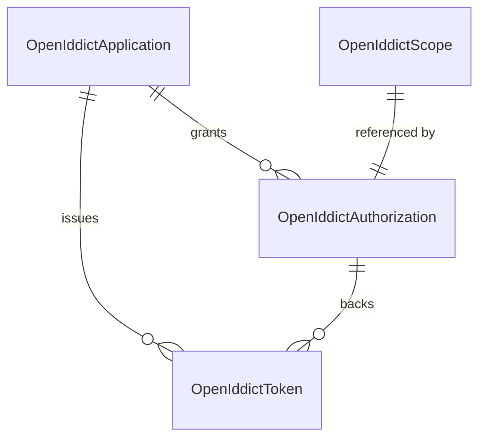
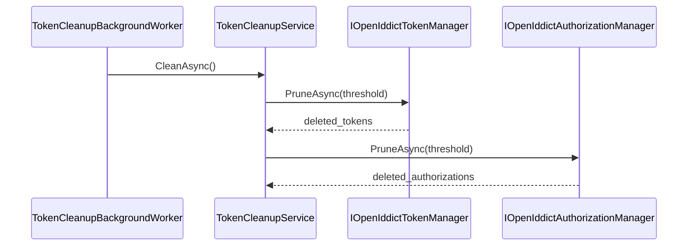
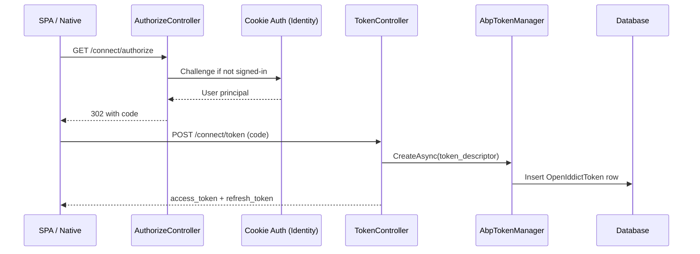

The **OpenIddict** module is ABP Framework's preferred OpenID Connect / OAuth 2.0 authorization-server stack. It wraps the upstream [OpenIddict](https://documentation.openiddict.com/) library so that its application, authorization, scope and token entities are persisted through ABP repositories (EF Core or MongoDB), benefit from ABP's distributed eventing, and integrate cleanly with the [Identity module](/modules/identity) for user authentication. The code lives under `modules/openiddict/src/`. This page walks through every aggregate, the manager classes, the AspNetCore controller surface that exposes `/connect/...` endpoints, the token cleanup background worker, and the wildcard-domain customisations ABP adds on top of vanilla OpenIddict.

## Solution layout

| Project | Role |
| --- | --- |
| `Volo.Abp.OpenIddict.Domain.Shared` | Constants, error codes, localization, security-log identifiers |
| `Volo.Abp.OpenIddict.Domain` | `OpenIddictApplication`, `OpenIddictScope`, `OpenIddictAuthorization`, `OpenIddictToken`, managers, stores, cleanup |
| `Volo.Abp.OpenIddict.AspNetCore` | OIDC server controllers (`AuthorizeController`, `TokenController`, `UserInfoController`, `EndSessionController`) |
| `Volo.Abp.OpenIddict.EntityFrameworkCore` | EF Core mappings for the four aggregates |
| `Volo.Abp.OpenIddict.MongoDB` | MongoDB collections + repositories |
| `Volo.Abp.PermissionManagement.Domain.OpenIddict` | Bridges OpenIddict claims/permissions into ABP's permission system |
| `Volo.Abp.OpenIddict.Installer` | NuGet installer package |

The shared module under `modules/openiddict/src/Volo.Abp.OpenIddict.Domain.Shared/Volo/Abp/OpenIddict/AbpOpenIddictDomainSharedModule.cs` ships the error code constants (`OpenIddictErrorCodes`) and security-log identifier enum (`OpenIddictSecurityLogActionConsts`). These are consumed both server-side (for emitting audit log entries) and client-side (for displaying user-friendly messages).

## The four aggregates

OpenIddict models the OIDC universe with four top-level entities. ABP wraps each as a `FullAuditedAggregateRoot<Guid>` (for `OpenIddictApplication` and `OpenIddictScope`) or plain `AggregateRoot<Guid>` (for `OpenIddictAuthorization` and `OpenIddictToken`).

### OpenIddictApplication

Found in `modules/openiddict/src/Volo.Abp.OpenIddict.Domain/Volo/Abp/OpenIddict/Applications/OpenIddictApplication.cs`. This represents a *client* in OAuth terminology — your SPA, mobile app, server-to-server worker etc.:

```csharp
public class OpenIddictApplication : FullAuditedAggregateRoot<Guid>
{
    public virtual string ApplicationType { get; set; }   // web | native
    public virtual string ClientId { get; set; }
    public virtual string ClientSecret { get; set; }      // may be hashed
    public string ClientType { get; set; }                // confidential | public
    public virtual string ConsentType { get; set; }
    public virtual string DisplayName { get; set; }
    public virtual string DisplayNames { get; set; }      // JSON object
    public virtual string JsonWebKeySet { get; set; }
    public virtual string Permissions { get; set; }       // JSON array
    public virtual string PostLogoutRedirectUris { get; set; }
    public virtual string Properties { get; set; }
    // ... RedirectUris, Requirements, Settings, ClientUri, LogoUri ...
}
```

Most fields are serialized JSON because OpenIddict stores collections as serialized blobs rather than child tables — this keeps writes atomic and avoids extra joins for the hot path.

### OpenIddictScope

From `modules/openiddict/src/Volo.Abp.OpenIddict.Domain/Volo/Abp/OpenIddict/Scopes/OpenIddictScope.cs`:

```csharp
public class OpenIddictScope : FullAuditedAggregateRoot<Guid>
{
    public virtual string Description { get; set; }
    public virtual string Descriptions { get; set; } // localized JSON
    public virtual string DisplayName { get; set; }
    public virtual string DisplayNames { get; set; }
    public virtual string Name { get; set; }
    public virtual string Properties { get; set; }
    public virtual string Resources { get; set; }    // JSON array
}
```

`Resources` is the list of audience names the scope grants access to — used by the token issuer to drive the `aud` claim.

### OpenIddictAuthorization

From `modules/openiddict/src/Volo.Abp.OpenIddict.Domain/Volo/Abp/OpenIddict/Authorizations/OpenIddictAuthorization.cs`. An authorization is a *consent* record granted by a user to an application:

```csharp
public class OpenIddictAuthorization : AggregateRoot<Guid>
{
    public virtual Guid? ApplicationId { get; set; }
    [DisableDateTimeNormalization] public virtual DateTime? CreationDate { get; set; }
    public virtual string Properties { get; set; }
    public virtual string Scopes  { get; set; } // JSON array
    public virtual string Status  { get; set; } // valid | revoked
    public virtual string Subject { get; set; } // user id
    public virtual string Type    { get; set; } // ad-hoc | permanent
}
```

Note the `[DisableDateTimeNormalization]` attribute — date columns are deliberately *not* run through ABP's normalisation pipeline because OpenIddict expects UTC `DateTime` values without time-zone shifts.

### OpenIddictToken

From `modules/openiddict/src/Volo.Abp.OpenIddict.Domain/Volo/Abp/OpenIddict/Tokens/OpenIddictToken.cs`. Tokens are physical issued artifacts — access tokens, refresh tokens, ID tokens, device codes:

```csharp
public class OpenIddictToken : AggregateRoot<Guid>
{
    public virtual Guid? ApplicationId { get; set; }
    public virtual Guid? AuthorizationId { get; set; }
    [DisableDateTimeNormalization] public virtual DateTime? CreationDate { get; set; }
    [DisableDateTimeNormalization] public virtual DateTime? ExpirationDate { get; set; }
    public virtual string Payload { get; set; }   // encrypted reference tokens
    public virtual string Properties { get; set; }
    [DisableDateTimeNormalization] public virtual DateTime? RedemptionDate { get; set; }
    public virtual string ReferenceId { get; set; }
    public virtual string Status { get; set; }    // valid | redeemed | revoked
    public virtual string Subject { get; set; }
    public virtual string Type    { get; set; }   // access_token | refresh_token | id_token | ...
}
```

`AuthorizationId` references the consent that backs the token, so revoking an authorization cascades to all derived tokens.



## Managers and stores

Each aggregate has a paired *store* (low-level repository wrapper) and *manager* (high-level façade implementing `IOpenIddict*Manager` from the upstream library). Files live alongside the entities:

| Manager | File | Notes |
| --- | --- | --- |
| `AbpApplicationManager` | `Applications/AbpApplicationManager.cs` | Adds distributed-event publishing on update |
| `AbpAuthorizationManager` | `Authorizations/AbpAuthorizationManager.cs` | Filters by subject/client |
| `AbpScopeManager` | `Scopes/AbpScopeManager.cs` | Caches scope lookups |
| `AbpTokenManager` | `Tokens/AbpTokenManager.cs` | Drives revocation + reuse |

`AbpApplicationManager` is the most extended of the four because client identifiers can change at runtime; ABP must invalidate caches and publish events when that happens. The override of `UpdateAsync` is shown below:

```csharp
public override async ValueTask UpdateAsync(OpenIddictApplicationModel application,
    CancellationToken cancellationToken = default)
{
    var entity = await Store.FindByIdAsync(IdentifierConverter.ToString(application.Id), cancellationToken);
    var oldClientId = entity?.ClientId;

    if (!Options.CurrentValue.DisableEntityCaching)
    {
        if (entity != null)
            await Cache.RemoveAsync(entity, cancellationToken);
    }
    // ... continues to call base.UpdateAsync and publish ApplicationChangedEto
}
```

Each store inherits from `AbpOpenIddictStoreBase<TRepository, TEntity, TModel>` (in `AbpOpenIddictStoreBase.cs`) which handles the model/entity translation and the `AbpOpenIddictIdentifierConverter` Guid↔string conversion required by the upstream contract.

## Token cleanup

OpenIddict accumulates expired tokens fast. `TokenCleanupService` (in `modules/openiddict/src/Volo.Abp.OpenIddict.Domain/Volo/Abp/OpenIddict/Tokens/TokenCleanupService.cs`) implements `ITransientDependency` and is driven by `TokenCleanupBackgroundWorker` on a schedule controlled by `TokenCleanupOptions`:

```csharp
public class TokenCleanupService : ITransientDependency
{
    public virtual async Task CleanAsync()
    {
        Logger.LogInformation("Start cleanup.");
        if (!CleanupOptions.DisableTokenPruning)
        {
            Logger.LogInformation("Start cleanup tokens.");
            // calls TokenManager.PruneAsync internally
        }
    }
}
```

The flag `CleanupOptions.DisableAuthorizationPruning` is also honoured. Pruning *tokens before authorizations* is essential — orphaned ad-hoc authorizations are deleted only after the tokens that reference them are gone, otherwise FK constraints would fire.



## AspNetCore server pipeline

`modules/openiddict/src/Volo.Abp.OpenIddict.AspNetCore/Volo/Abp/OpenIddict/AbpOpenIddictAspNetCoreModule.cs` wires the OIDC endpoints into the ASP.NET Core request pipeline. The module pre-registers Razor view locations under `/Volo/Abp/OpenIddict/Views/{1}/{0}.cshtml` and mutates `AbpClaimTypes` so that ABP's `ICurrentUser` uses OpenIddict's claim names:

```csharp
if (builderOptions.UpdateAbpClaimTypes)
{
    AbpClaimTypes.UserId   = OpenIddictConstants.Claims.Subject;
    AbpClaimTypes.Role     = OpenIddictConstants.Claims.Role;
    AbpClaimTypes.UserName = OpenIddictConstants.Claims.PreferredUsername;
    AbpClaimTypes.Name     = OpenIddictConstants.Claims.GivenName;
    AbpClaimTypes.SurName  = OpenIddictConstants.Claims.FamilyName;
    AbpClaimTypes.PhoneNumber = OpenIddictConstants.Claims.PhoneNumber;
    AbpClaimTypes.Email    = OpenIddictConstants.Claims.Email;
    AbpClaimTypes.ClientId = OpenIddictConstants.Claims.ClientId;
}
```

The server endpoint URIs are set inline:

```csharp
builder.SetAuthorizationEndpointUris("connect/authorize", "connect/authorize/callback");
```

### Controllers

The HTTP endpoints are implemented as MVC controllers under `modules/openiddict/src/Volo.Abp.OpenIddict.AspNetCore/Volo/Abp/OpenIddict/Controllers/`:

| Controller | Endpoint | Purpose |
| --- | --- | --- |
| `AuthorizeController` | `/connect/authorize` | Authorization Code flow entry point |
| `TokenController` | `/connect/token` | Token endpoint (split across partial classes per grant type) |
| `UserInfoController` | `/connect/userinfo` | OIDC userinfo |
| `EndSessionController` | `/connect/endsession` | OIDC logout |

`TokenController` is interesting because it is split per *grant type* into partial classes:

- `TokenController.AuthorizationCode.cs`
- `TokenController.ClientCredentials.cs`
- `TokenController.DeviceCode.cs`
- `TokenController.Password.cs`
- `TokenController.RefreshToken.cs`
- `TokenController.TokenExchange.cs`

Each partial handles one OIDC grant. The base `TokenController.cs` inspects `OpenIddictRequest.GrantType` and dispatches to the right partial method.

## Wildcard domains

A unique ABP addition is `WildcardDomains` (under `modules/openiddict/src/Volo.Abp.OpenIddict.AspNetCore/Volo/Abp/OpenIddict/WildcardDomains/`). Multi-tenant SaaS apps frequently issue subdomains per tenant (e.g. `acme.app.com`, `globex.app.com`). Vanilla OpenIddict validates redirect URIs against exact strings; the ABP extension allows wildcards via `AbpOpenIddictOptions.IsWildcardDomainsEnabled` and pattern strings like `https://*.app.com/auth/callback`. The match is performed before OpenIddict commits to the redirect, preserving CSRF and open-redirect protections.

## Extension grant types

`modules/openiddict/src/Volo.Abp.OpenIddict.AspNetCore/Volo/Abp/OpenIddict/ExtensionGrantTypes/` registers `LinkLogin` and `Impersonation` grants — useful for SaaS where an admin impersonates a tenant user, or where one identity links a new external login. They plug in via `OpenIddictServerBuilder.AllowCustomFlow(grantTypeName)`.

## Claims principal contributors

`OpenIddictClaimsPrincipalContributor` (declared at module configuration time as `AbpDefaultOpenIddictClaimsPrincipalHandler`) adds ABP-specific claims to the issued principal. The default contributor injects tenant id, edition id and standard ABP claim types so that downstream APIs that depend on `ICurrentTenant` get accurate values without extra discovery hops. Configuration happens via:

```csharp
Configure<AbpOpenIddictClaimsPrincipalOptions>(options =>
{
    options.ClaimsPrincipalHandlers.Add<AbpDefaultOpenIddictClaimsPrincipalHandler>();
});
```

The `RemoveClaimsFromClientCredentialsGrantType` handler strips user-bound claims when the request is a `client_credentials` grant — those tokens have no user behind them.

## Data seeding

`OpenIddictDataSeedContributorBase` in the Domain project is the recommended base class for app-specific seeders. Hosts typically derive from it to register their default applications and scopes during `OnApplicationInitialization`. The base ensures idempotent inserts by checking for an existing `ClientId`/`Name` before calling `CreateAsync` on the corresponding manager.

## EF Core mapping

The mapping under `modules/openiddict/src/Volo.Abp.OpenIddict.EntityFrameworkCore/` declares the four tables with names from `AbpOpenIddictDbProperties.DbTablePrefix` (defaults to `"AbpOpenIddict"`). Indexes are created for `ClientId`, `Name`, `Subject`, `ReferenceId` and `ApplicationId` to keep token lookups O(log n). The MongoDB provider mirrors the layout with collections under the database properties prefix.

## Permission integration

`Volo.Abp.PermissionManagement.Domain.OpenIddict` bridges OpenIddict application *permissions* (the JSON array per application) with ABP's `IPermissionManagementProvider`. This lets you grant ABP application permissions to a specific OAuth client, enabling fine-grained delegated access — for example a worker `client_credentials` token may carry only the `Reports.Export` ABP permission, even if the same target API exposes many more. See [Security overview](/security/overview) for how providers are composed.

## End-to-end token flow



The cookie sign-in is provided by the [Identity module](/modules/identity); the consent UI is contributed by the [Account module](/modules/account). OpenIddict itself does not own user data.

## Mongo provider

`modules/openiddict/src/Volo.Abp.OpenIddict.MongoDB/` mirrors the EF layout with one collection per aggregate, registered in `OpenIddictMongoDbContext`. Because Mongo lacks foreign keys, cascading deletes are implemented at the manager level — `AbpAuthorizationManager.DeleteAsync` first deletes all tokens that reference the authorization, then deletes the authorization itself. The same logic exists in EF, but EF leans on database-level cascade behaviour while Mongo enforces it from C#.

## Distributed events

The Domain module registers `OpenIddictApplicationCacheItemInvalidator` and friends as distributed event subscribers. When `AbpApplicationManager.UpdateAsync` removes the local cache entry and publishes an `EntityUpdatedEto<OpenIddictApplicationEto>`, other nodes in a load-balanced deployment receive the event and evict their own cache entries. This is essential for OIDC because a stale cached client (e.g. with an old `RedirectUris` JSON) would cause inexplicable `invalid_redirect_uri` errors on the next request.

## Error codes and security log

`OpenIddictErrorCodes` and `OpenIddictSecurityLogActionConsts` in the Shared project standardise the strings written to ABP's audit/security log when something interesting happens — token revoked, application credentials rotated, authorization denied. Hosts can build SIEM dashboards on top of these constants without parsing free-form messages.

## Recap

The OpenIddict module is a thin, ABP-flavoured wrapper around the upstream OIDC server. Its surface area is the four aggregate roots plus a manager per aggregate, an MVC controller per OIDC endpoint, a background worker for token housekeeping, a wildcard-redirect extension for SaaS, and a claims-principal contributor pipeline that integrates with ABP's `ICurrentUser`/`ICurrentTenant`. When you need an authorization server in front of an ABP app — and most newer ABP solutions do — this is the module you depend on, paired with the [Identity module](/modules/identity) for user storage and the [Account module](/modules/account) for the login UI. If you are migrating from the older IdentityServer integration, see the [IdentityServer module](/modules/identityserver-module) page for the differences.
