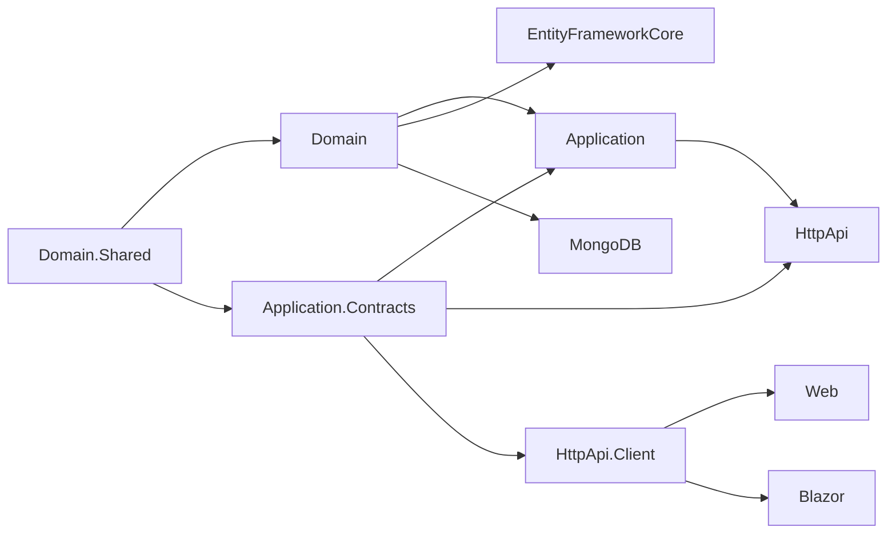

The `modules/` folder at the root of the [abpframework/abp](https://github.com/abpframework/abp) repository ships the official set of *application modules* that come with the ABP Framework. Where the `framework/` tree provides the runtime, DDD building blocks, and infrastructure packages (covered in [Domain Entities and Aggregates](/ddd/domain-entities-and-aggregates) and [Entity Framework Core integration](/data/entity-framework-core)), `modules/` provides end-to-end vertical slices — domain layer, application services, HTTP API, EF Core + MongoDB persistence, MVC pages, Blazor components, Angular packages, installer NuGet meta-packages, and localization. Each module is a self-contained NuGet/NPM family that you reference from your solution and that auto-wires itself through the ABP module system.

This page is a directory of every module folder under `modules/` and what it ships. The detail pages that follow this one drill into the most heavily used modules — `identity`, `account`, `permission-management`, `setting-management`, `feature-management`, `tenant-management`, `audit-logging`, `background-jobs`, and `blob-storing-database`. Modules such as `openiddict`, `identityserver`, `cms-kit`, `blogging`, `users`, `virtual-file-explorer`, `basic-theme`, `client-simulation`, and `docs` have their own dedicated wiki pages alongside this one in the *Application Modules* group.

## Top-level folder layout

The `modules/README.md` and a directory listing of `modules/` show 18 module roots (plus a README):

```
modules/
├── account/                       OAuth/OIDC login UI, register, profile, IS4/OpenIddict variants
├── audit-logging/                 AuditLog aggregate + IAuditingStore implementation
├── background-jobs/               BackgroundJobRecord aggregate + persistent IBackgroundJobStore
├── basic-theme/                   MVC + Blazor "Basic" theme packages and bundling
├── blob-storing-database/         IBlobProvider backed by a SQL/Mongo table
├── blogging/                      Multi-tenant blog (legacy, separate from CMS Kit)
├── client-simulation/             Load-test simulation harness with a Web dashboard
├── cms-kit/                       Pages, blogs, comments, reactions, tags, media — modern CMS toolkit
├── docs/                          Self-hosted documentation engine (markdown + versioning)
├── feature-management/            FeatureValue store + REST API for ABP Features
├── identity/                      Volo.Abp.Identity user/role/OU/session/claim type model
├── identityserver/                Duende IdentityServer4 persistence + admin API (legacy)
├── openiddict/                    OpenIddict-based OIDC application/scope/token persistence
├── permission-management/         PermissionGrant store + REST API for ABP Permissions
├── setting-management/            Setting store + REST API for ABP Settings
├── tenant-management/             Tenant aggregate + admin app service + ITenantStore impl
├── users/                         Lightweight cross-module user lookup abstractions
├── virtual-file-explorer/         Dev-time MVC explorer of the embedded virtual file system
└── README.md
```

Every module folder has the same internal shape: a `src/` tree holding the layered NuGet projects, plus `test/` and `host/` siblings used for unit and integration testing. The `Installer` project of each module embeds module metadata (icon, packages, dependencies) consumed by ABP Suite and the `abp` CLI when wiring the module into a target solution.

## Module capability matrix

The table below summarises which UI stacks and database providers each module ships out of the box. `Domain` and `Domain.Shared` always exist; `HttpApi.Client` is generated for every module that exposes a `HttpApi`.

| Module | Path | Purpose | EF Core | MongoDB | MVC Web | Blazor | Angular |
| --- | --- | --- | :---: | :---: | :---: | :---: | :---: |
| Identity | `modules/identity/` | Users, roles, organization units, claim types, sessions, security logs | ✅ | ✅ | ✅ | ✅ | ✅ |
| Account | `modules/account/` | Login / register / profile / external login Razor pages and Blazor | — | — | ✅ | ✅ | ✅ |
| Permission Management | `modules/permission-management/` | Stores `PermissionGrant` rows and exposes `IPermissionAppService` | ✅ | ✅ | ✅ | ✅ | ✅ |
| Setting Management | `modules/setting-management/` | Stores `Setting` rows + REST API for ABP Settings | ✅ | ✅ | ✅ | ✅ | ✅ |
| Feature Management | `modules/feature-management/` | Stores `FeatureValue` rows + REST API for ABP Features | ✅ | ✅ | ✅ | ✅ | ✅ |
| Tenant Management | `modules/tenant-management/` | `Tenant` aggregate + `ITenantStore` + admin UI | ✅ | ✅ | ✅ | ✅ | ✅ |
| Audit Logging | `modules/audit-logging/` | `AuditLog` aggregate + `IAuditingStore` implementation | ✅ | ✅ | — | — | — |
| Background Jobs | `modules/background-jobs/` | `BackgroundJobRecord` aggregate + persistent `IBackgroundJobStore` | ✅ | ✅ | — | — | — |
| BLOB Storing Database | `modules/blob-storing-database/` | `IBlobProvider` backed by a relational/Mongo table | ✅ | ✅ | — | — | — |
| OpenIddict | `modules/openiddict/` | OIDC application/scope/authorization/token persistence | ✅ | ✅ | — | — | — |
| IdentityServer (legacy) | `modules/identityserver/` | IdentityServer4 entity persistence + admin services | ✅ | ✅ | — | — | — |
| Users | `modules/users/` | Cross-module `IUserData` lookup abstractions | ✅ | ✅ | — | — | — |
| CMS Kit | `modules/cms-kit/` | Pages, blogs, comments, reactions, ratings, tags, media | ✅ | ✅ | ✅ | ✅ | ✅ |
| Blogging | `modules/blogging/` | Original blogging module (`Volo.Blogging.*`) | ✅ | ✅ | ✅ | — | — |
| Docs | `modules/docs/` | Self-hosted documentation engine | ✅ | ✅ | ✅ | ✅ | ✅ |
| Virtual File Explorer | `modules/virtual-file-explorer/` | Dev-time browser of the embedded VFS | — | — | ✅ | — | — |
| Basic Theme | `modules/basic-theme/` | "Basic" theme for MVC and Blazor | — | — | ✅ | ✅ | — |
| Client Simulation | `modules/client-simulation/` | Load-simulation harness with web dashboard | — | — | ✅ | — | — |

A ✅ means the module ships a dedicated package for that stack (for example `Volo.Abp.Identity.Blazor` for Identity's Blazor admin, or `Volo.Abp.Identity.EntityFrameworkCore` for its EF Core mappings).

## Anatomy of a module folder

Every module under `modules/` follows the layered DDD structure described in the [DDD Overview](/ddd/domain-entities-and-aggregates). Taking `modules/identity/src/` as the canonical example:

```
modules/identity/src/
├── Volo.Abp.Identity.Domain.Shared/        Constants, enums, error codes, localization keys
├── Volo.Abp.Identity.Domain/               Aggregates, managers, repositories interfaces, settings
├── Volo.Abp.Identity.Application.Contracts/  Interfaces, DTOs, permission definitions, remote consts
├── Volo.Abp.Identity.Application/          Implementations of the contracts (app services)
├── Volo.Abp.Identity.HttpApi/              ASP.NET Core controllers re-exposing app services
├── Volo.Abp.Identity.HttpApi.Client/       Dynamic C# proxies generated for HTTP clients
├── Volo.Abp.Identity.EntityFrameworkCore/  DbContext + Fluent API + EF repository implementations
├── Volo.Abp.Identity.MongoDB/              Mongo DbContext + repositories
├── Volo.Abp.Identity.AspNetCore/           ASP.NET Core integration helpers (sign-in manager etc.)
├── Volo.Abp.Identity.Web/                  Razor Pages admin UI
├── Volo.Abp.Identity.Blazor/               Blazor (Server + WASM shared) admin UI
├── Volo.Abp.Identity.Blazor.Server/        Blazor Server bundling project
├── Volo.Abp.Identity.Blazor.WebAssembly/   Blazor WASM bundling project
└── Volo.Abp.Identity.Installer/            NuGet meta-package consumed by ABP CLI / Suite
```

The layering rule is unidirectional: `Application` references `Application.Contracts` and `Domain`; `EntityFrameworkCore` references `Domain`; `HttpApi` references `Application.Contracts`; `Web` references `HttpApi.Client` (or `HttpApi` when running monolithically). This matches the dependency rules described in [Application Services](/ddd/domain-entities-and-aggregates).



## How a module is wired into a host

Each module exposes an installer NuGet (e.g. `Volo.Abp.Identity.Installer`) plus per-layer modules — class names like `AbpIdentityDomainModule`, `AbpIdentityApplicationModule`, `AbpIdentityHttpApiModule`, `AbpIdentityEntityFrameworkCoreModule`, `AbpIdentityWebModule`. Hosts depend on a module class via `[DependsOn(typeof(AbpIdentityWebModule))]` and the [ABP module bootstrap](/core/modularity-and-modules) discovers and starts them in dependency order. The EF Core layer registers its `DbContext` through `context.Services.AddAbpDbContext<IdentityDbContext>` and surfaces interfaces via `.AddDefaultRepositories(includeAllEntities: true)`, while the MongoDB layer does the same with `AddMongoDbContext<AbpIdentityMongoDbContext>` — see [MongoDB integration](/data/mongodb-integration) for the mechanics.

<Card title="Suite / CLI module catalog" icon="cube" href="https://github.com/abpframework/abp/tree/dev/modules">
  The official module catalog is sourced from this folder. The `abp add-module` CLI command resolves the installer NuGet, injects `[DependsOn]` attributes, and registers `DbContext`s into the host's data layer module.
</Card>

## Cross-cutting concerns shared by every module

<AccordionGroup>
  <Accordion title="Multi-tenancy">
    Aggregates that participate in tenancy implement `IMultiTenant` (e.g. `IdentityUser`, `IdentityRole`, `Tenant` is the *non*-tenant container). `DbContext`s that hold only host-level data are decorated with `[IgnoreMultiTenancy]` — for example `SettingManagementDbContext`, `FeatureManagementDbContext`, `TenantManagementDbContext`, and `BackgroundJobsDbContext`. See [Multi-Tenancy Overview](/multi-tenancy/overview).
  </Accordion>
  <Accordion title="Permissions">
    Each module's `Application.Contracts` project declares an `IPermissionDefinitionProvider` (e.g. `IdentityPermissionDefinitionProvider`) and a constants class (e.g. `IdentityPermissions`). Controllers and app services are decorated with `[Authorize(IdentityPermissions.Users.Create)]` — wired by the [Permissions infrastructure](/security/permissions).
  </Accordion>
  <Accordion title="Localization">
    All `Domain.Shared` projects embed `Localization/Resources/*.json` files and a resource class (e.g. `IdentityResource`). The MVC/Blazor packages reference those resources via `[LocalizationResource(typeof(IdentityResource))]`.
  </Accordion>
  <Accordion title="Connection-string isolation">
    Each `DbContext` is decorated with `[ConnectionStringName(AbpIdentityDbProperties.ConnectionStringName)]`. Hosts can map each module to a different physical database without code changes — see [Connection Strings](/data/connection-strings).
  </Accordion>
</AccordionGroup>

## Where to go next

<CardGroup cols={2}>
  <Card title="Identity" icon="user-shield" href="/modules/identity">
    Users, roles, organization units, sessions, claim types — the largest module in the catalog.
  </Card>
  <Card title="Account" icon="right-to-bracket" href="/modules/account">
    Login, register, profile, external/social login UI for MVC and Blazor.
  </Card>
  <Card title="Permission Management" icon="key" href="/modules/permission-management">
    Persists `PermissionGrant` rows and exposes `/api/permission-management/permissions`.
  </Card>
  <Card title="Setting Management" icon="sliders" href="/modules/setting-management">
    Persists `Setting` rows and exposes `/api/setting-management/*` endpoints.
  </Card>
  <Card title="Feature Management" icon="toggle-on" href="/modules/feature-management">
    Persists `FeatureValue` rows for tenant / edition feature toggles.
  </Card>
  <Card title="Tenant Management" icon="building" href="/modules/tenant-management">
    `Tenant` aggregate, admin app service, and `ITenantStore` implementation.
  </Card>
  <Card title="Audit Logging" icon="clipboard-list" href="/modules/audit-logging">
    `AuditLog`, `AuditLogAction`, `EntityChange` and the `IAuditingStore` writer.
  </Card>
  <Card title="Background Jobs" icon="gears" href="/modules/background-jobs-module">
    `BackgroundJobRecord` aggregate + EF/Mongo persistence for the job queue.
  </Card>
  <Card title="BLOB Storing Database" icon="database" href="/modules/blob-storing-database">
    `IBlobProvider` backed by `DatabaseBlobContainer` / `DatabaseBlob` tables.
  </Card>
</CardGroup>
