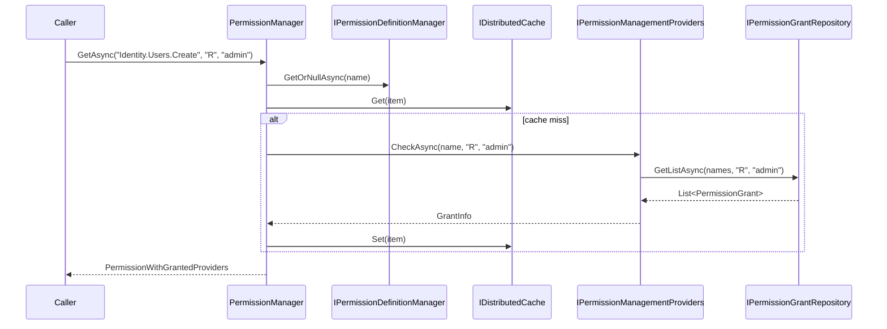
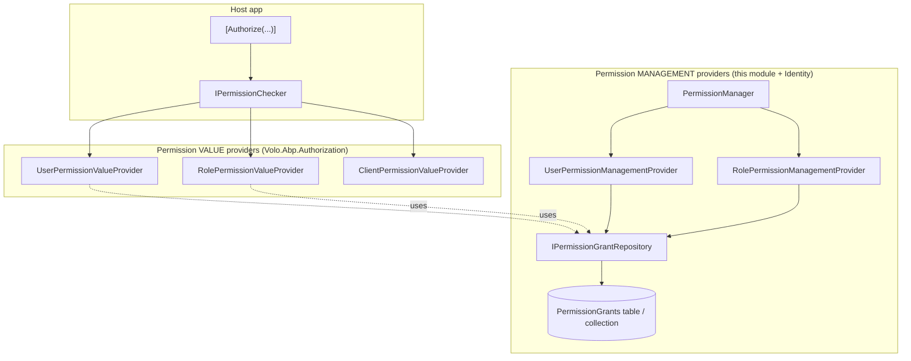

The Permission Management module under `modules/permission-management/src/` is the *persistence and administration* counterpart to the permission infrastructure described in [Security — Permissions](/security/permissions). Where the core framework defines `PermissionDefinition`, `IPermissionValueProvider`, and the `IPermissionChecker` runtime, this module wires those abstractions to a concrete database table (`PermissionGrant`), surfaces a REST API (`/api/permission-management/permissions`) for admins to toggle grants, and ships the `User`, `Role`, `Client`, and `Resource` provider implementations consumed when checking authorisation.

The module is deliberately storage-aware: it ships dedicated `EntityFrameworkCore` and `MongoDB` layers, both targeting the same `IPermissionGrantRepository` contract. Tenants get isolated rows via `IMultiTenant`, while role-bound permissions on a host-level role apply globally. This page covers the project layout, the `PermissionGrant` aggregate, the `PermissionManagementProvider` extension point, the `PermissionAppService` admin surface, and the EF Core + Mongo persistence wiring.

## Project layout

```
modules/permission-management/src/
├── Volo.Abp.PermissionManagement.Domain.Shared/   Constants, error keys, integration events
├── Volo.Abp.PermissionManagement.Domain/          PermissionGrant, PermissionManager, providers
├── Volo.Abp.PermissionManagement.Application.Contracts/  IPermissionAppService + DTOs
├── Volo.Abp.PermissionManagement.Application/     PermissionAppService implementation
├── Volo.Abp.PermissionManagement.HttpApi/         PermissionsController + integration controller
├── Volo.Abp.PermissionManagement.HttpApi.Client/  Dynamic proxies
├── Volo.Abp.PermissionManagement.EntityFrameworkCore/  PermissionManagementDbContext + EF repos
├── Volo.Abp.PermissionManagement.MongoDB/         PermissionManagementMongoDbContext + Mongo repos
├── Volo.Abp.PermissionManagement.Web/             Razor view-components for the permission tree
├── Volo.Abp.PermissionManagement.Blazor[/Server/WebAssembly]/  Blazor permission dialog
└── Volo.Abp.PermissionManagement.Installer/       NuGet meta-package
```

A separate sibling project `modules/identity/src/Volo.Abp.PermissionManagement.Domain.Identity` adds the `User` and `Role` providers that key grants by `IdentityUser.Id` / `IdentityRole.Name`. Equivalent sibling projects exist for `IdentityServer`, `OpenIddict`, and (in some templates) custom resources.

## Aggregate root — `PermissionGrant`

The persisted state is a single, deceptively small entity in `Volo.Abp.PermissionManagement.Domain`:

```csharp
// modules/permission-management/src/Volo.Abp.PermissionManagement.Domain/Volo/Abp/PermissionManagement/PermissionGrant.cs
//TODO: To aggregate root?
public class PermissionGrant : Entity<Guid>, IMultiTenant
{
    public virtual Guid? TenantId { get; protected set; }

    [NotNull] public virtual string Name { get; protected set; }          // permission name e.g. "AbpIdentity.Users.Create"
    [NotNull] public virtual string ProviderName { get; protected set; }  // "U", "R", "C", "RR" …
    [CanBeNull] public virtual string ProviderKey { get; protected internal set; }

    public PermissionGrant(Guid id, string name, string providerName, string providerKey, Guid? tenantId = null)
    {
        Id = id;
        Name = Check.NotNullOrWhiteSpace(name, nameof(name));
        ProviderName = Check.NotNullOrWhiteSpace(providerName, nameof(providerName));
        ProviderKey = providerKey;
        TenantId = tenantId;
    }
}
```

A "grant" is the *positive* statement: this `(Name, ProviderName, ProviderKey, TenantId)` tuple is allowed. The absence of a row means the permission is not granted by that provider. There is no "deny" row — denial is implicit. The single TODO in the source explicitly suggests promoting this to `AggregateRoot<Guid>`; today it implements only `IMultiTenant`.

### Provider naming

`ProviderName` is a *short* code, defined in the core `Volo.Abp.Authorization` package and reused here:

| Code | Class (in `Volo.Abp.Authorization.Permissions`) | Provider key |
| --- | --- | --- |
| `U` | `UserPermissionValueProvider` | `IdentityUser.Id.ToString()` |
| `R` | `RolePermissionValueProvider` | `IdentityRole.Name` |
| `C` | `ClientPermissionValueProvider` | OAuth `client_id` |
| `RR` | `RoleResourcePermissionValueProvider` | role/resource combo |
| `UR` | `UserResourcePermissionValueProvider` | user/resource combo |

The `Domain.Shared` package's `PermissionGrantConsts` defines the maximum column lengths used by EF Core / Mongo configurations.

## Repository contract

```csharp
// modules/permission-management/src/Volo.Abp.PermissionManagement.Domain/Volo/Abp/PermissionManagement/IPermissionGrantRepository.cs
public interface IPermissionGrantRepository : IBasicRepository<PermissionGrant, Guid>
{
    Task<PermissionGrant> FindAsync(string name, string providerName, string providerKey, CancellationToken ct = default);
    Task<List<PermissionGrant>> GetListAsync(string providerName, string providerKey, CancellationToken ct = default);
    Task<List<PermissionGrant>> GetListAsync(string[] names, string providerName, string providerKey, CancellationToken ct = default);
}
```

`IResourcePermissionGrantRepository` (`IResourcePermissionGrantRepository.cs`) adds equivalents keyed by a `(ResourceName, ProviderName, ProviderKey)` tuple for hierarchical / per-instance permissions. Both contracts are implemented by `EfCorePermissionGrantRepository` and `MongoPermissionGrantRepository`.

## `IPermissionManagementProvider`

The pluggable contract that lets `PermissionManager` know which providers it can read from and write to:

```csharp
// modules/permission-management/src/Volo.Abp.PermissionManagement.Domain/Volo/Abp/PermissionManagement/IPermissionManagementProvider.cs
public interface IPermissionManagementProvider : ISingletonDependency
{
    string Name { get; }

    Task<PermissionValueProviderGrantInfo> CheckAsync(string name, string providerName, string providerKey);
    Task<MultiplePermissionValueProviderGrantInfo> CheckAsync(string[] names, string providerName, string providerKey);
    Task SetAsync(string name, string providerKey, bool isGranted);
}
```

The abstract base `PermissionManagementProvider` (in `PermissionManagementProvider.cs`) implements the common path — read/write via `IPermissionGrantRepository`, scoped by `ICurrentTenant`:

```csharp
public abstract class PermissionManagementProvider : IPermissionManagementProvider
{
    public abstract string Name { get; }
    protected IPermissionGrantRepository PermissionGrantRepository { get; }
    protected IGuidGenerator GuidGenerator { get; }
    protected ICurrentTenant CurrentTenant { get; }

    public virtual async Task<MultiplePermissionValueProviderGrantInfo> CheckAsync(
        string[] names, string providerName, string providerKey)
    {
        using (PermissionGrantRepository.DisableTracking())
        {
            var info = new MultiplePermissionValueProviderGrantInfo(names);
            if (providerName != Name) return info;

            var grants = await PermissionGrantRepository.GetListAsync(names, providerName, providerKey);
            foreach (var permissionName in names)
            {
                var isGrant = grants.Any(x => x.Name == permissionName);
                info.Result[permissionName] = new PermissionValueProviderGrantInfo(isGrant, providerKey);
            }
            return info;
        }
    }
}
```

### Concrete providers

These live next to Identity in `modules/identity/src/Volo.Abp.PermissionManagement.Domain.Identity/`:

| Provider class | Name | Provider key |
| --- | --- | --- |
| `UserPermissionManagementProvider` | `U` | `IdentityUser.Id` |
| `RolePermissionManagementProvider` | `R` | `IdentityRole.Name` |
| `UserResourcePermissionManagementProvider` | `UR` | `IdentityUser.Id` |
| `RoleResourcePermissionManagementProvider` | `RR` | `IdentityRole.Name` |

```csharp
// UserPermissionManagementProvider.cs
public class UserPermissionManagementProvider : PermissionManagementProvider
{
    public override string Name => UserPermissionValueProvider.ProviderName;
    public UserPermissionManagementProvider(IPermissionGrantRepository repo,
        IGuidGenerator g, ICurrentTenant t) : base(repo, g, t) { }
}
```

The Role provider is more interesting — it overrides `CheckAsync` to walk through transitive roles (a user's roles + inherited OU roles) using `IUserRoleFinder`:

```csharp
// RolePermissionManagementProvider.cs
public class RolePermissionManagementProvider : PermissionManagementProvider
{
    public override string Name => RolePermissionValueProvider.ProviderName;
    protected IUserRoleFinder UserRoleFinder { get; }
    // CheckAsync(...) walks transitive roles and aggregates grants
}
```

The OpenIddict and IdentityServer modules provide a corresponding `ClientPermissionManagementProvider` whose key is the OAuth client id.

### Provider registration

Providers are registered via `PermissionManagementOptions.ManagementProviders` (declared in `PermissionManagementOptions.cs`). Each sibling project's module class adds itself:

```csharp
// AbpPermissionManagementDomainIdentityModule.cs (excerpt)
Configure<PermissionManagementOptions>(options =>
{
    options.ManagementProviders.Add<UserPermissionManagementProvider>();
    options.ManagementProviders.Add<RolePermissionManagementProvider>();
    // …Resource variants
});
```

## Orchestrator — `PermissionManager`

`PermissionManager.cs` is the singleton that fans out to all registered providers:

```csharp
public class PermissionManager : IPermissionManager, ISingletonDependency
{
    protected IPermissionGrantRepository PermissionGrantRepository { get; }
    protected IPermissionDefinitionManager PermissionDefinitionManager { get; }
    protected ISimpleStateCheckerManager<PermissionDefinition> SimpleStateCheckerManager { get; }
    protected IReadOnlyList<IPermissionManagementProvider> ManagementProviders => _lazyProviders.Value;
    protected IDistributedCache<PermissionGrantCacheItem> Cache { get; }

    public virtual async Task<PermissionWithGrantedProviders> GetAsync(
        string permissionName, string providerName, string providerKey)
    {
        var permission = await PermissionDefinitionManager.GetOrNullAsync(permissionName);
        if (permission == null)
            return new PermissionWithGrantedProviders(permissionName, false);
        return await GetInternalAsync(permission, providerName, providerKey);
    }
}
```

The result type `PermissionWithGrantedProviders` lists *which* providers grant a permission for a target, enabling the UI to display "granted via role X" badges. The cache key is `PermissionGrantCacheItem` invalidated by `PermissionGrantCacheItemInvalidator` whenever `SetAsync` writes a row.

### Read path (permission check)



## DbContext (EF Core)

```csharp
// modules/permission-management/src/Volo.Abp.PermissionManagement.EntityFrameworkCore/Volo/Abp/PermissionManagement/EntityFrameworkCore/PermissionManagementDbContext.cs
[ConnectionStringName(AbpPermissionManagementDbProperties.ConnectionStringName)]
public class PermissionManagementDbContext
    : AbpDbContext<PermissionManagementDbContext>, IPermissionManagementDbContext
{
    public DbSet<PermissionGroupDefinitionRecord> PermissionGroups { get; set; }
    public DbSet<PermissionDefinitionRecord>      Permissions       { get; set; }
    public DbSet<PermissionGrant>                 PermissionGrants  { get; set; }
    public DbSet<ResourcePermissionGrant>         ResourcePermissionGrants { get; set; }

    protected override void OnModelCreating(ModelBuilder builder)
    {
        base.OnModelCreating(builder);
        builder.ConfigurePermissionManagement();
    }
}
```

The Fluent-API configuration in `AbpPermissionManagementDbContextModelBuilderExtensions.cs` creates a composite unique index on `(TenantId, Name, ProviderName, ProviderKey)` — that index is what makes `FindAsync(name, provider, key)` an O(log n) lookup. See [EF Core integration](/data/entity-framework-core) for the underlying `AbpDbContext` plumbing.

The `Permissions` and `PermissionGroups` tables persist *definitions* — they are populated by `PermissionDataSeedContributor` (and refreshed by `DynamicPermissionDefinitionStore`) so dynamic, per-tenant permissions discovered at runtime survive restarts.

## MongoDB layer

```csharp
// modules/permission-management/src/Volo.Abp.PermissionManagement.MongoDB/Volo/Abp/PermissionManagement/MongoDb/PermissionManagementMongoDbContext.cs
[ConnectionStringName(AbpPermissionManagementDbProperties.ConnectionStringName)]
public class PermissionManagementMongoDbContext : AbpMongoDbContext, IPermissionManagementMongoDbContext
{
    public IMongoCollection<PermissionGrant>                 PermissionGrants          => Collection<PermissionGrant>();
    public IMongoCollection<ResourcePermissionGrant>         ResourcePermissionGrants  => Collection<ResourcePermissionGrant>();
    public IMongoCollection<PermissionDefinitionRecord>      Permissions               => Collection<PermissionDefinitionRecord>();
    public IMongoCollection<PermissionGroupDefinitionRecord> PermissionGroups          => Collection<PermissionGroupDefinitionRecord>();
}
```

The `MongoPermissionGrantRepository` translates the same repository contract to `Find/InsertOne/DeleteOne`. See [MongoDB integration](/data/mongodb-integration).

## Application service

```csharp
// modules/permission-management/src/Volo.Abp.PermissionManagement.Application/Volo/Abp/PermissionManagement/PermissionAppService.cs
[Authorize]
public class PermissionAppService : ApplicationService, IPermissionAppService
{
    protected PermissionManagementOptions Options { get; }
    protected IPermissionManager PermissionManager { get; }
    protected IPermissionChecker PermissionChecker { get; }
    protected IResourcePermissionManager ResourcePermissionManager { get; }
    protected IPermissionDefinitionManager PermissionDefinitionManager { get; }
    protected ISimpleStateCheckerManager<PermissionDefinition> SimpleStateCheckerManager { get; }
    // GetAsync, GetByGroupAsync, UpdateAsync(...) build a tree of PermissionGroupDto → PermissionGrantInfoDto
}
```

The contract surface (`IPermissionAppService` in `Application.Contracts/IPermissionAppService.cs`) exposes:

| Method | Purpose |
| --- | --- |
| `GetAsync(providerName, providerKey)` | Returns the full permission tree, marking each leaf as granted / inherited |
| `GetByGroupAsync(groupName, ...)` | Same, scoped to a single permission group |
| `UpdateAsync(providerName, providerKey, UpdatePermissionsDto)` | Bulk-set grants for a target |
| `GetResourceProviderKeyLookupServicesAsync(resourceName)` | Lists possible *resource* provider keys for resource permissions |

Authorisation: the class-level `[Authorize]` requires an authenticated caller; `UpdateAsync` additionally guards with `IdentityPermissions.{Users,Roles}.ManagePermissions` via the `Options.ProviderPolicies` map (configured in `PermissionManagementOptions`).

## HTTP API

```csharp
// modules/permission-management/src/Volo.Abp.PermissionManagement.HttpApi/Volo/Abp/PermissionManagement/PermissionsController.cs
[RemoteService(Name = PermissionManagementRemoteServiceConsts.RemoteServiceName)]
[Area(PermissionManagementRemoteServiceConsts.ModuleName)]
[Route("api/permission-management/permissions")]
public class PermissionsController : AbpControllerBase, IPermissionAppService
{
    [HttpGet]
    public virtual Task<GetPermissionListResultDto> GetAsync(string providerName, string providerKey)
        => PermissionAppService.GetAsync(providerName, providerKey);

    [HttpGet, Route("by-group")]
    public virtual Task<GetPermissionListResultDto> GetByGroupAsync(string groupName, string providerName, string providerKey)
        => PermissionAppService.GetByGroupAsync(groupName, providerName, providerKey);

    [HttpPut]
    public virtual Task UpdateAsync(string providerName, string providerKey, UpdatePermissionsDto input)
        => PermissionAppService.UpdateAsync(providerName, providerKey, input);
}
```

Example request from the Identity admin UI when toggling a role's permission:

```
PUT /api/permission-management/permissions?providerName=R&providerKey=admin
Content-Type: application/json

{
  "permissions": [
    { "name": "AbpIdentity.Roles.Create",  "isGranted": true  },
    { "name": "AbpIdentity.Roles.Delete",  "isGranted": false }
  ]
}
```

The companion `PermissionIntegrationController` under `Integration/` exposes the same data shape with a fixed-secret API key for service-to-service calls.

## Cross-module wiring



The *value* providers read grants directly through the cache + repository; the *management* providers exist to write grants (and surface inheritance metadata). Both ultimately hit the same `PermissionGrants` table.

## Related pages

<CardGroup cols={2}>
  <Card title="Permissions" icon="key" href="/security/permissions">
    `IPermissionDefinitionProvider`, `IPermissionValueProvider`, and `[Authorize]` enforcement.
  </Card>
  <Card title="Identity" icon="user-shield" href="/modules/identity">
    Source of provider keys for `U`/`R` grants and home of the matching `Domain.Identity` providers.
  </Card>
  <Card title="EF Core integration" icon="database" href="/data/entity-framework-core">
    How `PermissionManagementDbContext` is wired and migrated.
  </Card>
  <Card title="MongoDB integration" icon="leaf" href="/data/mongodb-integration">
    How `PermissionManagementMongoDbContext` is registered and queried.
  </Card>
</CardGroup>
