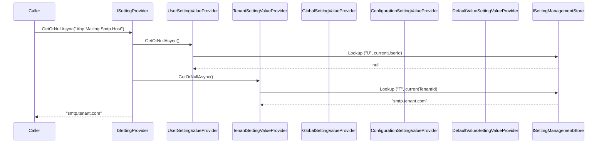

The Setting Management module under `modules/setting-management/src/` is the persistence + administration layer for ABP Framework's Settings infrastructure. The framework's `ISettingProvider` / `ISettingDefinitionProvider` abstractions describe *what* a setting is and how to resolve its value through a fallback chain (default → global → tenant → user); Setting Management adds the database table that backs the global, tenant, and user layers, plus a `SettingManager` orchestrator, `ISettingManagementProvider` extension points, and concrete app services like `EmailSettingsAppService` and `TimeZoneSettingsAppService`.

This page walks through the project layout, the `Setting` aggregate and its `SettingDefinitionRecord` companion, the four shipped `SettingManagementProvider` subclasses (`DefaultValue`, `Configuration`, `Global`, `Tenant`, `User`), the `EmailSettingsAppService` admin surface, and the EF Core + MongoDB stores.

## Project layout

```text
modules/setting-management/src/
├── Volo.Abp.SettingManagement.Domain.Shared/   AbpSettingManagementDbProperties, error keys
├── Volo.Abp.SettingManagement.Domain/          Setting, SettingDefinitionRecord, SettingManager,
│                                                SettingManagementProvider hierarchy, stores
├── Volo.Abp.SettingManagement.Application.Contracts/  IEmailSettingsAppService, ITimeZoneSettingsAppService,
│                                                       DTOs, SettingManagementPermissions
├── Volo.Abp.SettingManagement.Application/     EmailSettingsAppService, TimeZoneSettingsAppService
├── Volo.Abp.SettingManagement.HttpApi/         EmailSettingsController, TimeZoneSettingsController
├── Volo.Abp.SettingManagement.HttpApi.Client/  Dynamic proxies
├── Volo.Abp.SettingManagement.EntityFrameworkCore/  SettingManagementDbContext + EF repos
├── Volo.Abp.SettingManagement.MongoDB/         SettingManagementMongoDbContext + Mongo repos
├── Volo.Abp.SettingManagement.Web/             Razor pages — "Settings" admin tabbed UI
├── Volo.Abp.SettingManagement.Blazor[/Server/WebAssembly]/  Blazor admin
└── Volo.Abp.SettingManagement.Installer/       NuGet meta-package
```

## Aggregate roots — `Setting` and `SettingDefinitionRecord`

The persisted state is two small aggregates in `Volo.Abp.SettingManagement.Domain/Volo/Abp/SettingManagement/`.

### Setting

```csharp
// modules/setting-management/src/Volo.Abp.SettingManagement.Domain/Volo/Abp/SettingManagement/Setting.cs
public class Setting : Entity<Guid>, IAggregateRoot<Guid>
{
    [NotNull]  public virtual string Name         { get; protected set; }
    [NotNull]  public virtual string Value        { get; internal set; }
    [CanBeNull]public virtual string ProviderName { get; protected set; }   // "U", "T", or null for Global
    [CanBeNull]public virtual string ProviderKey  { get; protected set; }   // user id / tenant id

    public Setting(Guid id, string name, string value,
                   string providerName = null, string providerKey = null)
    {
        Id = id;
        Name = Check.NotNull(name, nameof(name));
        Value = Check.NotNull(value, nameof(value));
        ProviderName = providerName;
        ProviderKey  = providerKey;
    }
}
```

The `(Name, ProviderName, ProviderKey)` triple is the addressing scheme. A row with `ProviderName = null` (or matched by the global provider) is the host-level value; `"T"` + tenantId is the tenant override; `"U"` + userId is the per-user override.

### SettingDefinitionRecord

```csharp
// SettingDefinitionRecord.cs
public class SettingDefinitionRecord : BasicAggregateRoot<Guid>, IHasExtraProperties
{
    public string Name { get; set; }
    public string DisplayName { get; set; }
    public string Description { get; set; }
    public string DefaultValue { get; set; }
    public bool IsVisibleToClients { get; set; }
    public string Providers { get; set; }    // comma-separated provider names
    public bool IsInherited { get; set; }
    public bool IsEncrypted { get; set; }
    public ExtraPropertyDictionary ExtraProperties { get; protected set; }

    public bool HasSameData(SettingDefinitionRecord otherRecord) { /* deep equality */ }
    public void Patch(SettingDefinitionRecord otherRecord)       { /* field-by-field copy */ }
}
```

These rows persist the **definitions** discovered at runtime by `DynamicSettingDefinitionStore` — they let a tenant or plugin add new settings without redeploying the host, and they survive restarts. `Patch()` and `HasSameData()` underpin the diff that `StaticSettingSaver` runs on every startup to keep the in-memory definitions and the database in sync.

## Repository contracts

```csharp
// ISettingRepository.cs / ISettingDefinitionRecordRepository.cs
public interface ISettingRepository : IBasicRepository<Setting, Guid>
{
    Task<Setting> FindAsync(string name, string providerName, string providerKey, …);
    Task<List<Setting>> GetListAsync(string providerName, string providerKey, …);
    Task<List<Setting>> GetListAsync(string[] names, string providerName, string providerKey, …);
}

public interface ISettingDefinitionRecordRepository : IBasicRepository<SettingDefinitionRecord, Guid>
{
    Task<SettingDefinitionRecord> FindByNameAsync(string name, …);
    Task<List<SettingDefinitionRecord>> GetListAsync(…);
}
```

The EF Core (`EfCoreSettingRepository`) and Mongo (`MongoSettingRepository`) implementations live in the `EntityFrameworkCore` / `MongoDB` projects and follow the standard ABP repository pattern — see [EF Core integration](/data/entity-framework-core) and [MongoDB integration](/data/mongodb-integration).

## `ISettingManagementProvider` and the layered fallback chain

```csharp
// modules/setting-management/src/Volo.Abp.SettingManagement.Domain/Volo/Abp/SettingManagement/SettingManagementProvider.cs
public abstract class SettingManagementProvider : ISettingManagementProvider
{
    public abstract string Name { get; }
    protected ISettingManagementStore SettingManagementStore { get; }

    public virtual async Task<string> GetOrNullAsync(SettingDefinition setting, string providerKey)
        => await SettingManagementStore.GetOrNullAsync(setting.Name, Name, NormalizeProviderKey(providerKey));

    public virtual async Task SetAsync(SettingDefinition setting, string value, string providerKey)
        => await SettingManagementStore.SetAsync(setting.Name, value, Name, NormalizeProviderKey(providerKey));

    public virtual async Task ClearAsync(SettingDefinition setting, string providerKey)
        => await SettingManagementStore.DeleteAsync(setting.Name, Name, NormalizeProviderKey(providerKey));

    protected virtual string NormalizeProviderKey(string providerKey) => providerKey;
}
```

The module ships five concrete subclasses:

| Provider | File | `Name` | Notes |
| --- | --- | --- | --- |
| `DefaultValueSettingManagementProvider` | `DefaultValueSettingManagementProvider.cs` | `D` | Returns `SettingDefinition.DefaultValue` — terminal fallback |
| `ConfigurationSettingManagementProvider` | `ConfigurationSettingManagementProvider.cs` | `C` | Reads `IConfiguration` (`appsettings.json` etc.) |
| `GlobalSettingManagementProvider` | `GlobalSettingManagementProvider.cs` | `G` | Host-wide row, `ProviderKey = null` |
| `TenantSettingManagementProvider` | `TenantSettingManagementProvider.cs` | `T` | Resolves `CurrentTenant.Id` as key |
| `UserSettingManagementProvider` | `UserSettingManagementProvider.cs` | `U` | Resolves `CurrentUser.Id` as key |

```csharp
// TenantSettingManagementProvider.cs
public class TenantSettingManagementProvider : SettingManagementProvider, ITransientDependency
{
    public override string Name => TenantSettingValueProvider.ProviderName;   // "T"
    protected ICurrentTenant CurrentTenant { get; }

    protected override string NormalizeProviderKey(string providerKey)
        => providerKey ?? CurrentTenant.Id?.ToString();
}
```

```csharp
// UserSettingManagementProvider.cs
public class UserSettingManagementProvider : SettingManagementProvider, ITransientDependency
{
    public override string Name => UserSettingValueProvider.ProviderName;     // "U"
    protected ICurrentUser CurrentUser { get; }

    protected override string NormalizeProviderKey(string providerKey)
        => providerKey ?? CurrentUser.Id?.ToString();
}
```

Providers are registered in priority order via `SettingManagementOptions.Providers`:

```csharp
Configure<SettingManagementOptions>(options =>
{
    options.Providers.Add<DefaultValueSettingManagementProvider>();
    options.Providers.Add<ConfigurationSettingManagementProvider>();
    options.Providers.Add<GlobalSettingManagementProvider>();
    options.Providers.Add<TenantSettingManagementProvider>();
    options.Providers.Add<UserSettingManagementProvider>();
});
```

The chain is walked from **highest** (`UserSettingValueProvider`) to **lowest** (`DefaultValueSettingManagementProvider`); the first non-null value wins, mirroring the read path in the framework's `ISettingProvider`.

## `SettingManager` orchestrator

```csharp
// modules/setting-management/src/Volo.Abp.SettingManagement.Domain/Volo/Abp/SettingManagement/SettingManager.cs
public class SettingManager : ISettingManager, ISingletonDependency
{
    protected ISettingDefinitionManager SettingDefinitionManager { get; }
    protected ISettingEncryptionService SettingEncryptionService { get; }
    protected ISettingManagementStore SettingManagementStore { get; }
    protected List<ISettingManagementProvider> Providers => _lazyProviders.Value;
    protected SettingManagementOptions Options { get; }
}
```

Extension methods in `GlobalSettingManagerExtensions.cs`, `TenantSettingManagerExtensions.cs`, and `UserSettingManagerExtensions.cs` add the per-scope helpers callers use day-to-day — `GetOrNullGlobalAsync`, `GetOrNullForTenantAsync(name, tenantId)`, `SetForCurrentUserAsync(name, value)`, and so on.

### Read path



## DbContext (EF Core)

```csharp
// modules/setting-management/src/Volo.Abp.SettingManagement.EntityFrameworkCore/Volo/Abp/SettingManagement/EntityFrameworkCore/SettingManagementDbContext.cs
[IgnoreMultiTenancy]
[ConnectionStringName(AbpSettingManagementDbProperties.ConnectionStringName)]
public class SettingManagementDbContext : AbpDbContext<SettingManagementDbContext>, ISettingManagementDbContext
{
    public DbSet<Setting> Settings { get; set; }
    public DbSet<SettingDefinitionRecord> SettingDefinitionRecords { get; set; }

    protected override void OnModelCreating(ModelBuilder builder)
    {
        base.OnModelCreating(builder);
        builder.ConfigureSettingManagement();
    }
}
```

`[IgnoreMultiTenancy]` is critical: tenant scoping is handled by the `ProviderName = "T"` rows themselves, not by the global `IMultiTenant` filter. The Fluent-API in `ConfigureSettingManagement()` creates a unique composite index on `(Name, ProviderName, ProviderKey)` so the store-level `FindAsync` is O(log n).

## MongoDB layer

```csharp
// SettingManagementMongoDbContext.cs
[ConnectionStringName(AbpSettingManagementDbProperties.ConnectionStringName)]
public class SettingManagementMongoDbContext : AbpMongoDbContext, ISettingManagementMongoDbContext
{
    public IMongoCollection<Setting>                  Settings                 => Collection<Setting>();
    public IMongoCollection<SettingDefinitionRecord>  SettingDefinitionRecords => Collection<SettingDefinitionRecord>();
}
```

`MongoSettingRepository` translates the contract to `Find/InsertOne/DeleteOne` calls. The collection names default to `AbpSettings` and `AbpSettingDefinitionRecords` (controlled by `AbpSettingManagementDbProperties.DbTablePrefix`).

## Application services

The Setting Management application layer is *thin* — it doesn't expose a generic "set any setting" CRUD endpoint. Instead it ships two domain-specific app services that bundle related settings into typed DTOs.

### EmailSettingsAppService

```csharp
// modules/setting-management/src/Volo.Abp.SettingManagement.Application/Volo/Abp/SettingManagement/EmailSettingsAppService.cs
[Authorize(SettingManagementPermissions.Emailing)]
public class EmailSettingsAppService : SettingManagementAppServiceBase, IEmailSettingsAppService
{
    protected ISettingManager SettingManager { get; }
    protected IEmailSender EmailSender { get; }

    public virtual async Task<EmailSettingsDto> GetAsync()
    {
        await CheckFeatureAsync();
        var dto = new EmailSettingsDto
        {
            SmtpHost = await SettingProvider.GetOrNullAsync(EmailSettingNames.Smtp.Host),
            SmtpPort = Convert.ToInt32(await SettingProvider.GetOrNullAsync(EmailSettingNames.Smtp.Port)),
            // …
        };

        if (CurrentTenant.IsAvailable)
        {
            dto.SmtpHost     = await SettingManager.GetOrNullForTenantAsync(EmailSettingNames.Smtp.Host, CurrentTenant.GetId(), false);
            dto.SmtpUserName = await SettingManager.GetOrNullForTenantAsync(EmailSettingNames.Smtp.UserName, CurrentTenant.GetId(), false);
            // …
        }
        return dto;
    }
}
```

`SettingProvider` (the framework abstraction) walks the fallback chain transparently; the tenant-scoped overrides are read directly off `SettingManager` to surface "what is set *at* this tenant" vs. "what is inherited". `CheckFeatureAsync()` invokes `AllowChangingEmailSettingsFeatureSimpleStateChecker` from the contracts package — see [Feature Management](/modules/feature-management).

### TimeZoneSettingsAppService

`TimeZoneSettingsAppService.cs` exposes get/set for the user's preferred IANA timezone, defaulting to host configuration when the user setting is absent.

## HTTP API

```csharp
// modules/setting-management/src/Volo.Abp.SettingManagement.HttpApi/Volo/Abp/SettingManagement/EmailSettingsController.cs
[RemoteService(Name = SettingManagementRemoteServiceConsts.RemoteServiceName)]
[Area(SettingManagementRemoteServiceConsts.ModuleName)]
[Route("api/setting-management/emailing")]
public class EmailSettingsController : AbpControllerBase, IEmailSettingsAppService { /* GET / PUT / send-test */ }

// TimeZoneSettingsController.cs  →  api/setting-management/timezone
```

Both controllers implement the matching app-service interface so the dynamic C# proxy generator produces ready-to-use clients in `Volo.Abp.SettingManagement.HttpApi.Client`. The Setting Management Web (Razor / Blazor) admin renders these as tabs inside a single "Settings" page.

## Permissions

```csharp
// SettingManagementPermissions.cs
public static class SettingManagementPermissions
{
    public const string GroupName = "AbpSettingManagement";
    public const string Emailing  = GroupName + ".Emailing";
    public const string TimeZone  = GroupName + ".TimeZone";
}
```

The provider class `SettingManagementPermissionDefinitionProvider` lifts those constants into the [Permissions](/security/permissions) registry, and the controllers / app services use them via `[Authorize(SettingManagementPermissions.Emailing)]`.

## Dynamic + static definitions

Two collaborators keep the in-memory `ISettingDefinitionManager` aligned with the database:

| Class | Purpose |
| --- | --- |
| `StaticSettingSaver` | On host startup, diffs all `ISettingDefinitionProvider`-supplied definitions against `SettingDefinitionRecords` and patches deltas |
| `DynamicSettingDefinitionStore` | Lazily loads tenant- or plugin-added records into memory and listens to `StaticSettingDefinitionChangedEventHandler` for hot reload |
| `SettingDynamicInitializer` | Wires the above into the application lifecycle |

This is the same pattern used by [Permission Management](/modules/permission-management) and [Feature Management](/modules/feature-management) — see those pages for the matching diff/seeder pieces.

## Related pages

<CardGroup cols={2}>
  <Card title="Permissions" icon="key" href="/security/permissions">
    Permission infrastructure that gates `EmailSettingsController` and friends.
  </Card>
  <Card title="Multi-Tenancy" icon="building" href="/multi-tenancy/overview">
    How `ICurrentTenant` produces the tenant key used by `TenantSettingManagementProvider`.
  </Card>
  <Card title="EF Core" icon="database" href="/data/entity-framework-core">
    Mechanics of `AbpDbContext` and migrations behind `SettingManagementDbContext`.
  </Card>
  <Card title="Feature Management" icon="toggle-on" href="/modules/feature-management">
    Sibling module with the same shape — `FeatureValue` ↔ `Setting`, `FeatureManager` ↔ `SettingManager`.
  </Card>
</CardGroup>
