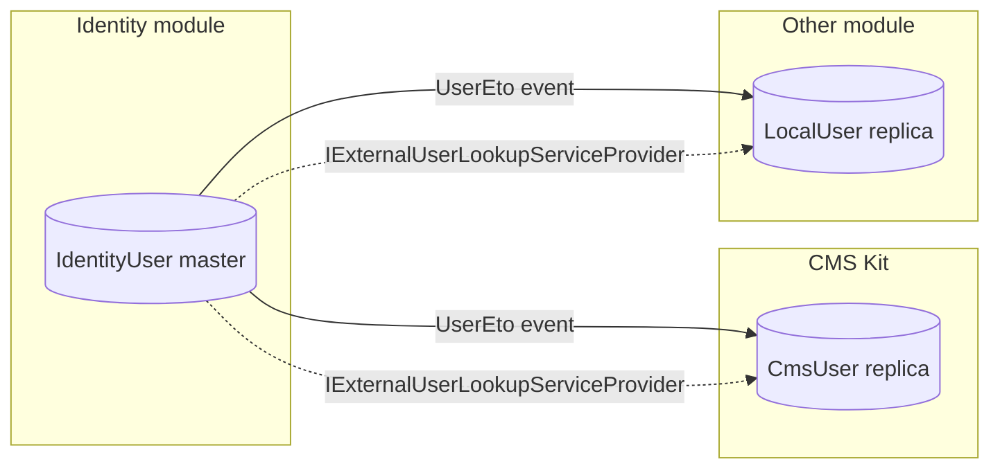
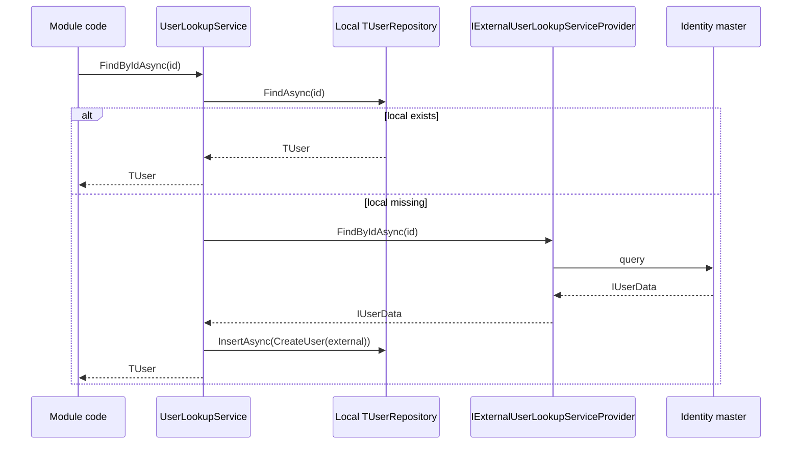

The **Users** module is one of the smallest but most pervasive packages in the ABP Framework. It defines the cross-module *abstractions* every other module uses to talk about a user without taking a hard dependency on the [Identity module](/modules/identity). When the CMS Kit blog renders an author name, when the [Blogging module](/modules/blogging) joins post creators, or when the [OpenIddict module](/modules/openiddict-module) emits claims, none of them call `UserManager<IdentityUser>` directly — they all go through interfaces defined here. This page documents every contract under `modules/users/src/`, the local *user replica* pattern, the `UserLookupService<TUser, TUserRepository>` base class, and how an external identity provider is wired up.

## Layout

| Project | Purpose |
| --- | --- |
| `Volo.Abp.Users.Abstractions` | Interfaces and DTOs (`IUserData`, `IExternalUserLookupServiceProvider`, `UserEto`, …) |
| `Volo.Abp.Users.Domain.Shared` | Constants, distributed event topic names |
| `Volo.Abp.Users.Domain` | `IUser`, `IUserRepository<TUser>`, `IUserLookupService<TUser>`, `UserLookupService<,>` base |
| `Volo.Abp.Users.EntityFrameworkCore` | EF Core base for user-replica tables |
| `Volo.Abp.Users.MongoDB` | MongoDB base for user-replica collections |
| `Volo.Abp.Users.Installer` | NuGet installer |

There is **no application, HTTP API or Web layer**. The Users module is purely a contract carrier — it never exposes user CRUD over HTTP itself. CRUD belongs to the [Identity module](/modules/identity), which owns the *master* user table.

## IUserData — the cross-module DTO

`modules/users/src/Volo.Abp.Users.Abstractions/Volo/Abp/Users/IUserData.cs` is the contract every consumer uses for read-only access to a user:

```csharp
public interface IUserData : IHasExtraProperties
{
    Guid Id { get; }
    Guid? TenantId { get; }
    string UserName { get; }
    string Name { get; }
    string Surname { get; }
    bool IsActive { get; }
    [CanBeNull] string Email { get; }
    bool EmailConfirmed { get; }
    [CanBeNull] string PhoneNumber { get; }
    bool PhoneNumberConfirmed { get; }
}
```

Three points are worth highlighting:

- It extends `IHasExtraProperties`, so custom fields contributed by other modules (e.g. an `EmployeeId` claim) travel alongside the user.
- `TenantId` is nullable, supporting *host users* (no tenant) and *tenant users*.
- The interface intentionally does **not** include password material, security stamps, or login providers — those are private to the identity store.

`UserData` (concrete class in the same folder) implements `IUserData` so consumers that need a serialisable DTO can use it directly:

```csharp
public class UserData : IUserData
{
    public Guid Id { get; set; }
    public Guid? TenantId { get; set; }
    public string UserName { get; set; }
    public string Name { get; set; }
    public string Surname { get; set; }
    public bool IsActive { get; set; }
    public string Email { get; set; }
    public bool EmailConfirmed { get; set; }
    public string PhoneNumber { get; set; }
    public bool PhoneNumberConfirmed { get; set; }
    public ExtraPropertyDictionary ExtraProperties { get; }

    public UserData(IUserData userData) { /* copy ctor */ }
}
```

`UserEto` (also in the abstractions package) is the *event transfer object* shape published over the distributed event bus when a user is created, updated or deleted in the identity master. Subscribers (CMS Kit, Blogging, custom modules) consume `UserEto` to keep their replicas current.

## IUser — the aggregate-side contract

`modules/users/src/Volo.Abp.Users.Domain/Volo/Abp/Users/IUser.cs` is the **read-write counterpart** used by modules that maintain a *local user table*:

```csharp
public interface IUser : IAggregateRoot<Guid>, IMultiTenant, IHasExtraProperties
{
    string UserName { get; }
    [CanBeNull] string Email { get; }
    [CanBeNull] string Name { get; }
    [CanBeNull] string Surname { get; }
    bool IsActive { get; }
    bool EmailConfirmed { get; }
    [CanBeNull] string PhoneNumber { get; }
    bool PhoneNumberConfirmed { get; }
}
```

Aggregates implementing `IUser` typically also implement `IUpdateUserData` (in the same folder), which exposes a single `bool Update(IUserData user)` method used to mutate the replica from a master DTO. The CMS Kit `CmsUser` documented in [CMS Kit](/modules/cms-kit) is the canonical example:

```csharp
// from modules/cms-kit/src/Volo.CmsKit.Domain/Volo/CmsKit/Users/CmsUser.cs
public class CmsUser : AggregateRoot<Guid>, IUser, IUpdateUserData
{
    public CmsUser(IUserData user) : base(user.Id) { /* copy */ }
    public virtual bool Update(IUserData user) { /* mutate */ }
}
```

## The replica pattern

Why do other modules carry a copy of the user? Three reasons:

1. **Performance.** A blog post listing renders the author name for every row. Joining against the master user table at query time would either tie the modules into a single DbContext or force a roundtrip per row.
2. **Decoupling.** Modules must work even when the master identity store is in a different process — e.g. when the [Identity module](/modules/identity) runs in a separate microservice.
3. **Extra properties.** A module-local replica can hold its own `ExtraProperties` independent of the identity master.

The replica is kept current by `UserLookupService<TUser, TUserRepository>` (described next) and by listening for `EntityCreatedEto<UserEto>`, `EntityUpdatedEto<UserEto>` and `EntityDeletedEto<UserEto>` on the distributed event bus.



## UserLookupService — the on-demand resync

`modules/users/src/Volo.Abp.Users.Domain/Volo/Abp/Users/UserLookupService.cs` is the abstract base every replica-owning module extends. It implements `IUserLookupService<TUser>` (declared in the same folder):

```csharp
public interface IUserLookupService<TUser> where TUser : class, IUser
{
    Task<TUser> FindByIdAsync(Guid id, CancellationToken cancellationToken = default);
    Task<TUser> FindByUserNameAsync(string userName, CancellationToken cancellationToken = default);
    Task<List<IUserData>> SearchAsync(string sorting = null, string filter = null,
        int maxResultCount = int.MaxValue, int skipCount = 0,
        CancellationToken cancellationToken = default);
    Task<long> GetCountAsync(string filter = null, CancellationToken cancellationToken = default);
}
```

The default implementation handles four scenarios in `FindByIdAsync`:

```csharp
public abstract class UserLookupService<TUser, TUserRepository> : IUserLookupService<TUser>, ITransientDependency
    where TUser : class, IUser
    where TUserRepository : IUserRepository<TUser>
{
    protected bool SkipExternalLookupIfLocalUserExists { get; set; } = true;
    public IExternalUserLookupServiceProvider ExternalUserLookupServiceProvider { get; set; }

    public async Task<TUser> FindByIdAsync(Guid id, CancellationToken cancellationToken = default)
    {
        var localUser = await _userRepository.FindAsync(id, cancellationToken: cancellationToken);

        if (ExternalUserLookupServiceProvider == null)
            return localUser;

        if (SkipExternalLookupIfLocalUserExists && localUser != null)
            return localUser;

        IUserData externalUser;
        try { externalUser = await ExternalUserLookupServiceProvider.FindByIdAsync(id, cancellationToken); }
        catch (Exception ex) { Logger.LogException(ex); return localUser; }

        if (externalUser == null)
        {
            if (localUser != null)
            {
                //TODO: Instead of deleting, should we make it inactive?
                await WithNewUowAsync(() => _userRepository.DeleteAsync(localUser, cancellationToken: cancellationToken));
            }
            return null;
        }

        if (localUser == null)
        {
            await WithNewUowAsync(() => _userRepository.InsertAsync(CreateUser(externalUser), cancellationToken: cancellationToken));
            return await _userRepository.FindAsync(id, cancellationToken: cancellationToken);
        }

        if (localUser is IUpdateUserData && ((IUpdateUserData)localUser).Update(externalUser))
            await WithNewUowAsync(() => _userRepository.UpdateAsync(localUser, cancellationToken: cancellationToken));

        return await _userRepository.FindAsync(id, cancellationToken: cancellationToken);
    }
}
```

The branches are:

| Local | External | Outcome |
| --- | --- | --- |
| Found | (skipped) | Return local — most common case |
| Not found | Found | Insert local replica, then return |
| Found | Not found | Delete local replica (the master removed the user) |
| Found | Found, different | Apply `IUpdateUserData.Update` and re-save |
| Not found | Not found | Return null |

The `WithNewUowAsync` helper ensures each side-effect runs in its own unit of work so a `SaveChanges` failure in the consumer's transaction does not roll back the replica sync.



## IExternalUserLookupServiceProvider

`modules/users/src/Volo.Abp.Users.Abstractions/Volo/Abp/Users/IExternalUserLookupServiceProvider.cs` is the contract the consumer (typically the [Identity module](/modules/identity)) implements to give other modules a way to ask "is this user real?":

```csharp
public interface IExternalUserLookupServiceProvider
{
    Task<IUserData> FindByIdAsync(Guid id, CancellationToken cancellationToken = default);
    Task<IUserData> FindByUserNameAsync(string userName, CancellationToken cancellationToken = default);
    Task<List<IUserData>> SearchAsync(string sorting = null, string filter = null,
        int maxResultCount = int.MaxValue, int skipCount = 0,
        CancellationToken cancellationToken = default);
    Task<long> GetCountAsync(string filter = null, CancellationToken cancellationToken = default);
}
```

The Identity module ships `IdentityUserLookupServiceProvider` that adapts `IdentityUserManager` to this contract. In a microservice deployment, you can ship an HTTP-based provider that calls the remote identity service — without changing any consumer module.

## UserEto and distributed events

`modules/users/src/Volo.Abp.Users.Abstractions/Volo/Abp/Users/UserEto.cs` is the event payload shape. It carries the same fields as `UserData` but is *serialisable* by the distributed event bus. Subscribers register handlers like:

```csharp
public class CmsUserCreatedEventHandler : IDistributedEventHandler<EntityCreatedEto<UserEto>>, ITransientDependency
{
    public async Task HandleEventAsync(EntityCreatedEto<UserEto> eventData) { /* insert CmsUser */ }
}
```

The Identity module publishes these events from its `IdentityUserCreatedEventHandler` (and friends). Together with the on-demand pull via `IExternalUserLookupServiceProvider`, this gives a *push + pull* sync model that is resilient to dropped messages — the next `FindByIdAsync` reconciles whatever the event missed.

## Tenant invitation event

`InviteUserToTenantRequestedEto` in `modules/users/src/Volo.Abp.Users.Abstractions/Volo/Abp/Users/InviteUserToTenantRequestedEto.cs` is a request to invite an existing user to a tenant. The tenant management module raises it; the identity module subscribes and acts on it. The flow is intentionally event-driven so it can cross process boundaries.

`UserPasswordChangeRequestedEto` (same folder) carries password-reset intents — useful for systems where reset links are produced by the account service but emailed by a separate notification microservice.

## EF Core and MongoDB bases

`Volo.Abp.Users.EntityFrameworkCore` and `Volo.Abp.Users.MongoDB` do not define entities — instead they provide *extension helpers* a consumer's replica `DbContext` calls. The canonical example is `b.ConfigureAbpUser()`, used by CMS Kit:

```csharp
// CMS Kit consumes the helper to map CmsUser
builder.Entity<CmsUser>(b =>
{
    b.ToTable(AbpCmsKitDbProperties.DbTablePrefix + "Users", AbpCmsKitDbProperties.DbSchema);
    b.ConfigureByConvention();
    b.ConfigureAbpUser();             // <-- helper from Volo.Abp.Users.EntityFrameworkCore
    b.HasIndex(x => new { x.TenantId, x.UserName });
    b.HasIndex(x => new { x.TenantId, x.Email });
    b.ApplyObjectExtensionMappings();
});
```

`ConfigureAbpUser` sets max lengths, configures the columns for `UserName`/`Email`/`PhoneNumber` etc. consistently with the master Identity user table. The Mongo helper performs equivalent BSON registration.

## Consuming the module

For an application that only *reads* user names (e.g. a custom report module), the integration is:

1. Add a `LocalUser : IUser, IUpdateUserData` aggregate.
2. Add `ILocalUserRepository : IUserRepository<LocalUser>` plus an implementation.
3. Add `LocalUserLookupService : UserLookupService<LocalUser, ILocalUserRepository>`.
4. Subscribe to `EntityCreatedEto<UserEto>` etc. to keep the table fresh.

Once `LocalUserLookupService` is in the container, the application code just calls `await _userLookupService.FindByIdAsync(creatorId)` and gets either a cached local row, an on-the-fly insert from the master, or `null`.

## Threats and pitfalls

- **Sync drift.** If events are dropped *and* `FindByIdAsync` is never called for a given user, the replica goes stale. Mitigation: run a background reconciler that calls `IExternalUserLookupServiceProvider.SearchAsync` periodically.
- **Tenant isolation.** Replicas must include `TenantId` in their indexes (as CMS Kit does) so that `IDataFilter<IMultiTenant>` works correctly. Forgetting this leaks cross-tenant rows in admin tools.
- **Deletion semantics.** The default `FindByIdAsync` *deletes* a local row when the master returns null. The source even has a `TODO` suggesting making the user inactive instead — override `WithNewUowAsync` and add custom logic if your domain prefers soft-delete.

## Recap

The Users module exists so that no module has to depend on the [Identity module](/modules/identity) just to render a user name. It provides four interfaces (`IUserData`, `IUser`, `IUserLookupService<TUser>`, `IExternalUserLookupServiceProvider`), an `UserEto` event payload for distributed sync, and an abstract `UserLookupService<,>` that captures the standard replica-sync algorithm. Modules like [CMS Kit](/modules/cms-kit), [Blogging](/modules/blogging) and any custom module that needs an author field implement these in a few lines and gain consistent behaviour across monolith and microservice deployments. Pair this with the [Identity module](/modules/identity) for the master store, the [Account module](/modules/account) for self-service flows, and [Security overview](/security/overview) for how the resulting claims feed `ICurrentUser` throughout an [MVC](/aspnetcore/mvc) or [Blazor](/blazor/overview) host.
