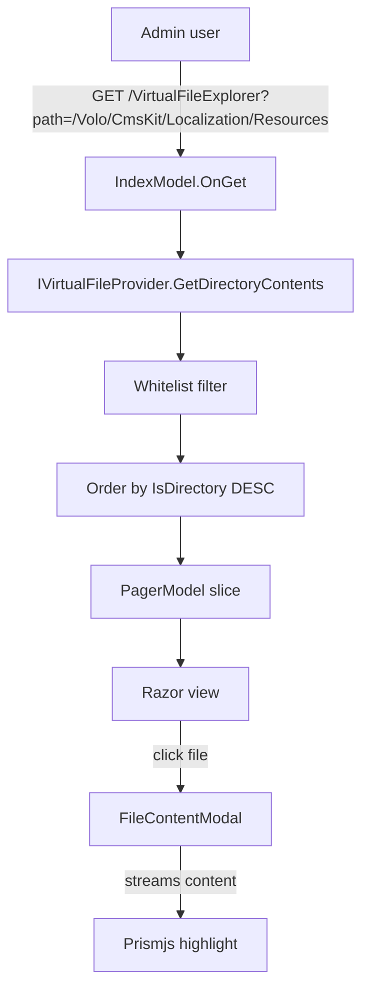

The **Virtual File Explorer** module is a small but invaluable diagnostic tool that exposes ABP Framework's *virtual file system* (VFS) through a Razor-pages admin UI. Every module in ABP ships its localization JSON, view templates, JavaScript bundles and the like as embedded resources inside the assembly; once a host application bootstraps, those files appear inside the in-memory virtual file tree. The Virtual File Explorer lets a developer or operator browse that tree, paginate through directories, and view file contents — without unpacking DLLs, without restarting the host. The code lives at `modules/virtual-file-explorer/src/` and is intentionally minimal: a contracts assembly, an installer, and a Web assembly that ships the Razor pages and bundling.

## Layout

| Project | Purpose |
| --- | --- |
| `Volo.Abp.VirtualFileExplorer.Contracts` | Permissions, localization resource, contracts module |
| `Volo.Abp.VirtualFileExplorer.Web` | Razor pages, view models, menu contributor, bundling |
| `Volo.Abp.VirtualFileExplorer.Installer` | NuGet installer package |

There is no application service layer, no HTTP API, no EF Core or MongoDB provider. The module deliberately keeps the read path **in-process only** — it queries `IVirtualFileProvider` directly. There is no remote API for security reasons (exposing the file tree over HTTP would leak embedded resource layout to unauthenticated callers).

## Permissions and contracts

`modules/virtual-file-explorer/src/Volo.Abp.VirtualFileExplorer.Contracts/Volo/Abp/VirtualFileExplorer/VirtualFileExplorerPermissions.cs` defines a single permission used to guard the page:

```csharp
public class VirtualFileExplorerPermissions
{
    public const string GroupName = "VirtualFileExplorer";
    public const string View = GroupName + ".View";
}
```

`AbpVirtualFileExplorerPermissionDefinitionProvider` registers it with the [Security overview](/security/overview) permission management subsystem. The view page itself is decorated with `[Authorize(VirtualFileExplorerPermissions.View)]` so an unauthorised user gets a 403 instead of access.

`VirtualFileExplorerResource` (in `Localization/`) and the JSON files under `Localization/Resources/` provide multi-language strings. The contracts module is referenced by the Web project so that translations are available at runtime.

## Web module bootstrap

`modules/virtual-file-explorer/src/Volo.Abp.VirtualFileExplorer.Web/AbpVirtualFileExplorerWebModule.cs` is the entry point:

```csharp
[DependsOn(typeof(AbpAspNetCoreMvcUiBootstrapModule))]
[DependsOn(typeof(AbpAspNetCoreMvcUiThemeSharedModule))]
[DependsOn(typeof(AbpVirtualFileExplorerContractsModule))]
public class AbpVirtualFileExplorerWebModule : AbpModule
{
    public override void ConfigureServices(ServiceConfigurationContext context)
    {
        var virtualFileExplorerOptions = context.Services
            .ExecutePreConfiguredActions<AbpVirtualFileExplorerOptions>();

        if (virtualFileExplorerOptions.IsEnabled)
        {
            Configure<AbpNavigationOptions>(options =>
            {
                options.MenuContributors.Add(new VirtualFileExplorerMenuContributor());
            });

            Configure<AbpVirtualFileSystemOptions>(options =>
            {
                options.FileSets.AddEmbedded<AbpVirtualFileExplorerWebModule>(
                    "Volo.Abp.VirtualFileExplorer.Web");
            });

            Configure<AbpBundleContributorOptions>(options =>
            {
                options.Extensions<PrismjsStyleBundleContributor>()
                       .Add<PrismjsStyleBundleContributorDocsExtension>();
                options.Extensions<PrismjsScriptBundleContributor>()
                       .Add<PrismjsScriptBundleContributorDocsExtension>();
            });
        }
    }
}
```

Three things happen:

1. **Feature flag.** The whole module is conditional on `AbpVirtualFileExplorerOptions.IsEnabled`. A host can keep the package installed for development and turn it off for production by setting the flag to `false` in `PreConfigureServices`.
2. **Menu contribution.** `VirtualFileExplorerMenuContributor` adds an item to the admin navigation tree (configured under `Navigation/`).
3. **Bundle extensions.** Prismjs (used for syntax highlighting in the file viewer) is augmented with `PrismjsStyleBundleContributorDocsExtension` and `PrismjsScriptBundleContributorDocsExtension` so that the explorer can render colored Markdown / JSON / C# files.

## AbpVirtualFileExplorerOptions

`modules/virtual-file-explorer/src/Volo.Abp.VirtualFileExplorer.Web/AbpVirtualFileExplorerOptions.cs` exposes the boolean toggle. The pattern is `services.PreConfigure<AbpVirtualFileExplorerOptions>(o => o.IsEnabled = false)` in the host module, called *before* `ConfigureServices` runs. The module's own `ConfigureServices` reads the pre-configured value via `ExecutePreConfiguredActions<AbpVirtualFileExplorerOptions>()`.

## VirtualFileExplorerConsts

`VirtualFileExplorerConsts.cs` declares the `AllowFileInfoTypes` whitelist used by the index page to filter file types — by default it lists `PhysicalFileInfo`, `EmbeddedResourceFileInfo`, `InMemoryFileInfo` and the directory equivalents. This is a defensive measure to skip unexpected provider types so the listing never crashes.

## The Index page

`modules/virtual-file-explorer/src/Volo.Abp.VirtualFileExplorer.Web/Pages/VirtualFileExplorer/Index.cshtml.cs` is the heart of the module. It is annotated with the view permission and accepts a path query string plus pagination:

```csharp
[Authorize(VirtualFileExplorerPermissions.View)]
public class IndexModel : VirtualFileExplorerPageModel
{
    [BindProperty(SupportsGet = true)] public string Path { get; set; } = "/";
    [BindProperty(SupportsGet = true)] public int CurrentPage { get; set; } = 1;
    [BindProperty(SupportsGet = true)] public int PageSize { get; set; } = 10;

    public List<FileInfoViewModel> FileInfoList { get; set; }
    public PagerModel PagerModel { get; set; }
    public string PathNavigation { get; set; }

    protected IVirtualFileProvider VirtualFileProvider { get; }

    public IndexModel(IVirtualFileProvider virtualFileProvider)
    {
        VirtualFileProvider = virtualFileProvider;
    }

    public virtual IActionResult OnGet()
    {
        var query = VirtualFileProvider.GetDirectoryContents(Path)
            .Where(d => VirtualFileExplorerConsts.AllowFileInfoTypes.Contains(d.GetType().Name))
            .OrderByDescending(f => f.IsDirectory).ToList();

        PagerModel = new PagerModel(query.Count, PageSize, CurrentPage, PageSize,
            $"{Url.Content("~/")}VirtualFileExplorer?Path={Path}&PageSize={PageSize}");

        SetViewModel(query.Skip((CurrentPage - 1) * PageSize).Take(PageSize));
        SetPathNavigation();
        return Page();
    }
}
```

`IVirtualFileProvider` is the framework abstraction over the merged file tree (embedded + physical + in-memory). `GetDirectoryContents(Path)` returns whatever lives at that path across all registered providers, deduplicated by name. The page model then projects them to `FileInfoViewModel`:

```csharp
public class FileInfoViewModel
{
    public string FilePath { get; set; }
    public string Icon { get; set; }
    public string FileType { get; set; }
    public string Length { get; set; }
    public string FileName { get; set; }
    public DateTime LastUpdateTime { get; set; }
    public bool IsDirectory { get; set; }
}
```

Directories are rendered as breadcrumb links; files render a link to the FileContentModal page. The icon defaults to `fas fa-file` for files and `fas fa-folder` for directories.

### Embedded vs physical paths

Inside `SetViewModel`, the path resolution differs by file kind:

```csharp
var filePath = fileInfo.PhysicalPath ?? $"{Path.EnsureEndsWith('/')}{fileInfo.Name}";

if (fileInfo is EmbeddedResourceFileInfo embeddedResourceFileInfo)
{
    fileInfoViewModel.FilePath = embeddedResourceFileInfo.VirtualPath;
}
else
{
    fileInfoViewModel.FilePath = filePath;
}
```

`EmbeddedResourceFileInfo.VirtualPath` is the path *inside the virtual tree* (e.g. `/Volo/CmsKit/Localization/Resources/en.json`), independent of where the underlying DLL lives on disk. This is exactly what an operator needs in order to file a bug like "the German translation in CMS Kit shows `Foo` instead of `Bar` for key X".

## FileContentModal

`modules/virtual-file-explorer/src/Volo.Abp.VirtualFileExplorer.Web/Pages/VirtualFileExplorer/FileContentModal.cshtml.cs` renders the actual file contents. It reads the file through `IVirtualFileProvider.GetFileInfo(path).CreateReadStream()`, decides the language for Prismjs by the extension, and outputs a syntax-highlighted `<pre>` block in the modal body. The decision about which language hint to apply is based on the file extension (`.cs`, `.json`, `.cshtml`, `.js`, `.css`, `.md`, etc.).

## Breadcrumb navigation

The `SetPathNavigation()` method builds a Bootstrap breadcrumb fragment as raw HTML:

```csharp
private void SetPathNavigation()
{
    var navigationBuild = new StringBuilder();
    var pathArray = Path.Split('/').Where(p => !p.IsNullOrWhiteSpace());
    var href = $"{Url.Content("~/")}VirtualFileExplorer?path=";

    navigationBuild.Append("<nav aria-label='breadcrumb'><ol class='breadcrumb'>" +
        $"<li class='breadcrumb-item'><a href='{href}/'>{L["BackToRoot"]}</a></li>");

    foreach (var item in pathArray)
    {
        href += "/" + item;
        navigationBuild.Append($"<li class='breadcrumb-item'><a href='{href}'>{item}</a></li>");
    }
    navigationBuild.Append("</ol></nav>");
    PathNavigation = navigationBuild.ToString();
}
```

The `L["BackToRoot"]` accessor pulls the translation from `VirtualFileExplorerResource`. While this string-concatenation style is a little dated, the inputs (path segments) come from server-side query parsing rather than direct user payload, so XSS exposure is minimal. The page is also behind the permission check.

## Routing diagram



## Navigation contribution

`Navigation/VirtualFileExplorerMenuContributor.cs` adds the menu item to the admin sidebar of [the UI-MVC theme stack](/ui-mvc/overview):

```csharp
public class VirtualFileExplorerMenuContributor : IMenuContributor
{
    public Task ConfigureMenuAsync(MenuConfigurationContext context)
    {
        if (context.Menu.Name != StandardMenus.Main) return Task.CompletedTask;
        // adds ApplicationMenuItem under Administration with permission check
        return Task.CompletedTask;
    }
}
```

The item is gated by `VirtualFileExplorerPermissions.View`, so anonymous or non-admin users do not see the menu entry at all.

## When to use it

| Scenario | Useful? |
| --- | --- |
| Diagnosing a missing JSON translation key | Yes — open the resource path, see what's actually embedded |
| Verifying a custom bundle contributor's CSS made it into the assembly | Yes — browse `/wwwroot/...` |
| Reading template files generated by `abp generate-proxy` | Yes |
| Editing files | No — read-only |
| Browsing a remote service's files | No — in-process only |

## Security considerations

Because the page sits behind `[Authorize]` and a dedicated permission, it is safe for development and authenticated staging environments. For production, leave `AbpVirtualFileExplorerOptions.IsEnabled = false` to omit the page entirely — the assembly is still loaded but no endpoints are exposed.

The breadcrumb HTML is sanitised by ASP.NET Core when rendered (the StringBuilder output is wrapped in `@Html.Raw` only after the contributor builds it). Even so, if you derive a custom page that accepts user-controlled segments, encode them before concatenation.

## Underlying virtual file system

ABP's virtual file system (`Volo.Abp.VirtualFileSystem`) is the foundation the explorer queries. Every module contributes file sets via `AbpVirtualFileSystemOptions.FileSets.AddEmbedded<TModule>(...)`, and ABP merges them into a single composite `IVirtualFileProvider`. The same file path can be supplied by multiple modules — the most recently added wins, which is exactly how the Basic Theme's CSS overrides defaults shipped by the framework. The explorer therefore shows a *flattened* tree: when two modules both contribute `/Themes/Basic/Layouts/Application.cshtml`, only the winning copy is displayed.

Three file-info subtypes appear in practice:

| Type | Origin | What you see |
| --- | --- | --- |
| `EmbeddedResourceFileInfo` | Compiled into an assembly via `<EmbeddedResource>` | Most module files (localization, views, JS) |
| `PhysicalFileInfo` | Disk under `wwwroot` or extension folders | Customisations the host added on disk |
| `InMemoryFileInfo` | Dynamically generated at runtime | Less common; used by some bundlers |

`VirtualFileExplorerConsts.AllowFileInfoTypes` whitelists the three so the page can render them — exotic providers (for example a custom encrypted resource) are silently skipped unless added to the list.

## Operational examples

Three concrete examples illustrate when the explorer pays off:

1. **A missing localization key.** Browse to `/Volo/Abp/Localization/Resources/AbpUi/en.json` to confirm the JSON file was embedded. If it is missing, the module reference is wrong or the `.csproj` lost the `<EmbeddedResource Include="...\*.json" />` glob.
2. **Wrong icon in a menu.** Navigate to `/wwwroot/themes/basic/` and confirm the icon font file is bundled in.
3. **Tenant-specific override.** When a multi-tenant host injects per-tenant assets, the explorer shows whether the override file beat the default for the current request — handy when debugging "why doesn't my custom logo appear for tenant X".

## Disabling for production

To omit the page entirely without removing the NuGet reference, set the toggle in a host module's `PreConfigureServices`:

```csharp
PreConfigureServices(ServiceConfigurationContext context)
{
    context.Services.PreConfigure<AbpVirtualFileExplorerOptions>(options =>
    {
        options.IsEnabled = false;
    });
}
```

Because the Web module checks `IsEnabled` before adding navigation and bundling, the operator-facing surface (menu, page, permission) disappears completely. The contracts package still loads its permission definition, but the absence of the page means it cannot be reached.

## Recap

The Virtual File Explorer is a small Razor admin tool that exposes ABP Framework's virtual file system via `IVirtualFileProvider`. Its surface area is exactly: a permission, an options class, a menu contributor, an Index page, a FileContentModal page, a view model, and a constants whitelist. It is invaluable when you need to know *what was actually embedded* in a module's assembly without unpacking DLLs. Pair it with [the basic theme](/modules/basic-theme) to get the standard look, or theme it into your own [MVC](/aspnetcore/mvc) host. For end-user authentication on top of this admin page, plug in the [Identity module](/modules/identity) and the [Account module](/modules/account); permission checks come from the [Security overview](/security/overview) pipeline.
