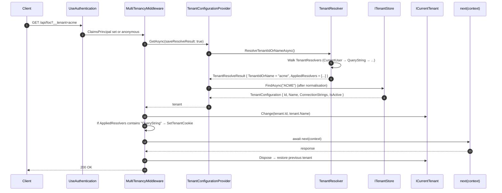

The `Volo.Abp.AspNetCore.MultiTenancy` module of the ABP Framework adapts the framework-agnostic resolution pipeline to an ASP.NET Core request. It contributes the `MultiTenancyMiddleware`, the `app.UseMultiTenancy()` extension, the four HTTP `ITenantResolveContributor`s, the error page, the cookie helper, and `HttpContextTenantResolveResultAccessor`. This page walks every public surface and the exact wiring sequence inside an ABP application.

<Info>
For the framework-agnostic core (resolver, current tenant, default store), see [Volo.Abp.MultiTenancy](/multi-tenancy/volo-abp-multitenancy). For an in-depth tour of each `ITenantResolveContributor` see [Tenant Resolvers](/multi-tenancy/tenant-resolvers).
</Info>

## Package layout

Every file under `framework/src/Volo.Abp.AspNetCore.MultiTenancy/`:

```
Microsoft/AspNetCore/Builder/
└── AbpAspNetCoreMultiTenancyApplicationBuilderExtensions.cs

Volo/Abp/AspNetCore/MultiTenancy/
├── AbpAspNetCoreMultiTenancyModule.cs
├── AbpAspNetCoreMultiTenancyOptions.cs
├── AbpMultiTenancyCookieHelper.cs
├── CookieTenantResolveContributor.cs
├── DomainTenantResolveContributor.cs
├── FormTenantResolveContributor.cs            (obsolete)
├── HeaderTenantResolveContributor.cs
├── HttpContextTenantResolveResultAccessor.cs
├── HttpTenantResolveContributorBase.cs
├── MultiTenancyMiddleware.cs
├── QueryStringTenantResolveContributor.cs
├── RouteTenantResolveContributor.cs
├── TenantResolveContextExtensions.cs
└── Views/
    ├── MultiTenancyMiddlewareErrorPage.Designer.cs
    ├── MultiTenancyMiddlewareErrorPage.cshtml
    └── MultiTenancyMiddlewareErrorPageModel.cs

Volo/Abp/MultiTenancy/
└── AbpMultiTenancyOptionsExtensions.cs        (AddDomainTenantResolver)
```

## `AbpAspNetCoreMultiTenancyModule`

File: `Volo.Abp.AspNetCore.MultiTenancy/Volo/Abp/AspNetCore/MultiTenancy/AbpAspNetCoreMultiTenancyModule.cs`. The module's only job is to register the four HTTP-based contributors at the end of the chain:

```csharp
[DependsOn(
    typeof(AbpMultiTenancyModule),
    typeof(AbpAspNetCoreModule)
    )]
public class AbpAspNetCoreMultiTenancyModule : AbpModule
{
    public override void ConfigureServices(ServiceConfigurationContext context)
    {
        Configure<AbpTenantResolveOptions>(options =>
        {
            options.TenantResolvers.Add(new QueryStringTenantResolveContributor());
            options.TenantResolvers.Add(new RouteTenantResolveContributor());
            options.TenantResolvers.Add(new HeaderTenantResolveContributor());
            options.TenantResolvers.Add(new CookieTenantResolveContributor());
        });
    }
}
```

Because `AbpMultiTenancyModule` already inserted `CurrentUserTenantResolveContributor` at index 0, the **composed default order** in an ASP.NET Core app is:

| Index | Contributor | Source |
| --- | --- | --- |
| 0 | `CurrentUserTenantResolveContributor` | `AbpMultiTenancyModule` |
| 1 | `QueryStringTenantResolveContributor` | this module |
| 2 | `RouteTenantResolveContributor` | this module |
| 3 | `HeaderTenantResolveContributor` | this module |
| 4 | `CookieTenantResolveContributor` | this module |

The `DomainTenantResolveContributor` is **not** added by default — you opt in by calling `options.AddDomainTenantResolver("{0}.app.example.com")` (see below).

## `MultiTenancyMiddleware`

File: `Volo.Abp.AspNetCore.MultiTenancy/Volo/Abp/AspNetCore/MultiTenancy/MultiTenancyMiddleware.cs`. The full implementation — derived from `AbpMiddlewareBase` and registered as transient via `ITransientDependency`:

```csharp
public class MultiTenancyMiddleware : AbpMiddlewareBase, ITransientDependency
{
    public ILogger<MultiTenancyMiddleware> Logger { get; set; }

    private readonly ITenantConfigurationProvider _tenantConfigurationProvider;
    private readonly ICurrentTenant _currentTenant;
    private readonly AbpAspNetCoreMultiTenancyOptions _options;
    private readonly ITenantResolveResultAccessor _tenantResolveResultAccessor;

    public MultiTenancyMiddleware(
        ITenantConfigurationProvider tenantConfigurationProvider,
        ICurrentTenant currentTenant,
        IOptions<AbpAspNetCoreMultiTenancyOptions> options,
        ITenantResolveResultAccessor tenantResolveResultAccessor)
    {
        Logger = NullLogger<MultiTenancyMiddleware>.Instance;

        _tenantConfigurationProvider = tenantConfigurationProvider;
        _currentTenant = currentTenant;
        _tenantResolveResultAccessor = tenantResolveResultAccessor;
        _options = options.Value;
    }

    public async override Task InvokeAsync(HttpContext context, RequestDelegate next)
    {
        TenantConfiguration? tenant = null;
        try
        {
            tenant = await _tenantConfigurationProvider.GetAsync(saveResolveResult: true);
        }
        catch (Exception e)
        {
            Logger.LogException(e);

            if (await _options.MultiTenancyMiddlewareErrorPageBuilder(context, e))
            {
                return;
            }
        }

        if (tenant?.Id != _currentTenant.Id)
        {
            using (_currentTenant.Change(tenant?.Id, tenant?.Name))
            {
                if (_tenantResolveResultAccessor.Result != null &&
                    _tenantResolveResultAccessor.Result.AppliedResolvers.Contains(QueryStringTenantResolveContributor.ContributorName))
                {
                    AbpMultiTenancyCookieHelper.SetTenantCookie(context, _currentTenant.Id, _options.TenantKey);
                }

                var requestCulture = await TryGetRequestCultureAsync(context);
                if (requestCulture != null)
                {
                    CultureInfo.CurrentCulture = requestCulture.Culture;
                    CultureInfo.CurrentUICulture = requestCulture.UICulture;
                    AbpRequestCultureCookieHelper.SetCultureCookie(context, requestCulture);
                    context.Items[AbpRequestLocalizationMiddleware.HttpContextItemName] = true;
                }

                await next(context);
            }
        }
        else
        {
            await next(context);
        }
    }
    // ...TryGetRequestCultureAsync...
}
```

Five behaviours to note:

1. **`saveResolveResult: true`** — the `TenantResolveResult` ends up in `HttpContext.Items["__AbpTenantResolveResult"]` (via the HTTP accessor below), so error pages and diagnostics can inspect which contributor handled the request.
2. **Catch + `MultiTenancyMiddlewareErrorPageBuilder`** — if `TenantConfigurationProvider.GetAsync` throws (`BusinessException 010001` not found, `010002` not active), the error page builder runs and may short-circuit by returning `true`.
3. **Equality short-circuit** — `if (tenant?.Id != _currentTenant.Id)`. If the resolved tenant matches the already-current value, the middleware avoids the `Change` block and the AsyncLocal write.
4. **Sticky query-string** — when `QueryStringTenantResolveContributor` ran, the resolved tenant id is written to a cookie via `AbpMultiTenancyCookieHelper.SetTenantCookie`. Subsequent requests then resolve via the cookie even without the `?__tenant=` query.
5. **Tenant-side culture fallback** — if `RequestLocalizationMiddleware` saw no provider, the middleware reads the `LocalizationSettingNames.DefaultLanguage` *tenant* setting and applies it. This is how a tenant can override the host default language.

## `app.UseMultiTenancy()` and middleware ordering

File: `Volo.Abp.AspNetCore.MultiTenancy/Microsoft/AspNetCore/Builder/AbpAspNetCoreMultiTenancyApplicationBuilderExtensions.cs`. This is one of the most important little extension methods in the framework because of a subtle ordering check:

```csharp
public static IApplicationBuilder UseMultiTenancy(this IApplicationBuilder app)
{
    var multiTenancyOptions = app.ApplicationServices.GetRequiredService<IOptions<AbpTenantResolveOptions>>();
    var hasCurrentUserTenantResolveContributor = multiTenancyOptions.Value.TenantResolvers.Any(r => r is CurrentUserTenantResolveContributor);
    if (hasCurrentUserTenantResolveContributor)
    {
        var authenticationMiddlewareSet = app.Properties.TryGetValue(AuthenticationMiddlewareSetKey, out var value) && value is true;
        if (!authenticationMiddlewareSet)
        {
            var logger = app.ApplicationServices.GetService<ILogger<MultiTenancyMiddleware>>();
            logger?.LogWarning(
                "MultiTenancyMiddleware is being registered before the authentication middleware. " +
                "This may lead to incorrect tenant resolution if the resolution depends on the authenticated user. " +
                "Ensure app.UseAuthentication() is called before app.UseMultiTenancy()."
            );
        }
    }

    return app.UseMiddleware<MultiTenancyMiddleware>();
}
```

The constant key `__AuthenticationMiddlewareSet` is the ASP.NET Core marker that `app.UseAuthentication()` writes. So the canonical pipeline order — for templates and recommended for custom apps — is:


| Pipeline slot | Why |
| --- | --- |
| Before `UseAuthentication()` | `CurrentUserTenantResolveContributor` reads `ICurrentUser.TenantId` from claims — needs authentication done |
| Before `UseAuthorization()` | Authorisation policies that look at host/tenant side via `MultiTenancySides` need `ICurrentTenant` to be set |
| After `UseRouting()` | `RouteTenantResolveContributor` uses `httpContext.GetRouteValue(...)` which requires the routing middleware |

<Warning>
Calling `app.UseMultiTenancy()` **before** `app.UseAuthentication()` produces the warning above but does not throw. In that configuration `CurrentUserTenantResolveContributor` always sees `ICurrentUser.IsAuthenticated == false` and falls through, so HTTP-based contributors take over. That may be intentional in API-gateway scenarios.
</Warning>

## `AbpAspNetCoreMultiTenancyOptions`

File: `Volo.Abp.AspNetCore.MultiTenancy/Volo/Abp/AspNetCore/MultiTenancy/AbpAspNetCoreMultiTenancyOptions.cs`. Two properties:

```csharp
public class AbpAspNetCoreMultiTenancyOptions
{
    /// <summary>Default: <see cref="TenantResolverConsts.DefaultTenantKey"/>.</summary>
    public string TenantKey { get; set; }

    /// <summary>Return true to stop the pipeline, false to continue.</summary>
    public Func<HttpContext, Exception, Task<bool>> MultiTenancyMiddlewareErrorPageBuilder { get; set; }

    public AbpAspNetCoreMultiTenancyOptions()
    {
        TenantKey = TenantResolverConsts.DefaultTenantKey;
        MultiTenancyMiddlewareErrorPageBuilder = async (context, exception) =>
        {
            // ...default implementation, see below...
        };
    }
}
```

`TenantKey` defaults to `"__tenant"` (the value of `TenantResolverConsts.DefaultTenantKey`). It is the single string used by **all four** HTTP contributors — query-string key, route token, header name, and cookie name.

| Customisation | Code |
| --- | --- |
| Change the key everywhere | `Configure<AbpAspNetCoreMultiTenancyOptions>(o => o.TenantKey = "x-tenant-id")` |
| Replace the error response | Assign a new `Func<HttpContext, Exception, Task<bool>>` to `MultiTenancyMiddlewareErrorPageBuilder` |

### Default error-page builder behaviour

The default `MultiTenancyMiddlewareErrorPageBuilder` (also in `AbpAspNetCoreMultiTenancyOptions.cs`) implements three branches:

1. **Cookie auth + GET + not Ajax** — signs the user out (via the active `CookieAuthenticationHandler`) and `Response.Redirect(currentUrl)`. This is what makes the experience of a stale cookie self-healing.
2. **Ajax** — serialises a `RemoteServiceErrorResponse` to JSON with HTTP 404.
3. **Otherwise** — renders the embedded `MultiTenancyMiddlewareErrorPage.cshtml` via the `RazorViews` infrastructure.

The header `Abp-Tenant-Resolve-Error` is always appended with the encoded exception message so SPAs can show it.

It also opportunistically deletes the tenant cookie:

```csharp
if (tenantResolveResult.AppliedResolvers.Contains(CookieTenantResolveContributor.ContributorName) ||
    context.Request.Cookies.ContainsKey(options.TenantKey))
{
    AbpMultiTenancyCookieHelper.SetTenantCookie(context, null, options.TenantKey);
}
```

A `null` tenant id triggers `context.Response.Cookies.Delete(tenantKey)` inside the helper.

## `AbpMultiTenancyCookieHelper`

File: `Volo.Abp.AspNetCore.MultiTenancy/Volo/Abp/AspNetCore/MultiTenancy/AbpMultiTenancyCookieHelper.cs`. A single static method:

```csharp
public static void SetTenantCookie(
    HttpContext context,
    Guid? tenantId,
    string tenantKey)
{
    if (tenantId != null)
    {
        context.Response.Cookies.Append(
            tenantKey,
            tenantId.ToString()!,
            new CookieOptions
            {
                Path = "/",
                HttpOnly = false,
                IsEssential = true,
                Expires = DateTimeOffset.Now.AddYears(10)
            }
        );
    }
    else
    {
        context.Response.Cookies.Delete(tenantKey);
    }
}
```

Notable defaults:

| Cookie attribute | Value | Rationale |
| --- | --- | --- |
| `Path` | `/` | Available to every request |
| `HttpOnly` | `false` | Client JS can read it for SPAs that thread the tenant id into XHR headers |
| `IsEssential` | `true` | Skips GDPR consent (tenant resolution is operationally required) |
| `Expires` | `+10 years` | Effectively persistent |

## `HttpTenantResolveContributorBase`

File: `Volo.Abp.AspNetCore.MultiTenancy/Volo/Abp/AspNetCore/MultiTenancy/HttpTenantResolveContributorBase.cs`. All four HTTP resolvers share this base:

```csharp
public abstract class HttpTenantResolveContributorBase : TenantResolveContributorBase
{
    public override async Task ResolveAsync(ITenantResolveContext context)
    {
        var httpContext = context.GetHttpContext();
        if (httpContext == null)
        {
            return;
        }

        try
        {
            await ResolveFromHttpContextAsync(context, httpContext);
        }
        catch (Exception e)
        {
            context.ServiceProvider
                .GetRequiredService<ILogger<HttpTenantResolveContributorBase>>()
                .LogWarning(e.ToString());
        }
    }

    protected virtual async Task ResolveFromHttpContextAsync(ITenantResolveContext context, HttpContext httpContext)
    {
        var tenantIdOrName = await GetTenantIdOrNameFromHttpContextOrNullAsync(context, httpContext);
        if (!tenantIdOrName.IsNullOrEmpty())
        {
            context.TenantIdOrName = tenantIdOrName;
        }
    }

    protected abstract Task<string?> GetTenantIdOrNameFromHttpContextOrNullAsync(
        ITenantResolveContext context, HttpContext httpContext);
}
```

The base safely returns early when there is no `HttpContext` — that is what lets the same `ITenantResolveContributor` list be reused outside HTTP without throwing.

## `TenantResolveContextExtensions`

File: `Volo.Abp.AspNetCore.MultiTenancy/Volo/Abp/AspNetCore/MultiTenancy/TenantResolveContextExtensions.cs`. A single helper used by all four HTTP contributors to read the tenant key:

```csharp
public static class TenantResolveContextExtensions
{
    public static AbpAspNetCoreMultiTenancyOptions GetAbpAspNetCoreMultiTenancyOptions(this ITenantResolveContext context)
    {
        return context.ServiceProvider.GetRequiredService<IOptions<AbpAspNetCoreMultiTenancyOptions>>().Value;
    }
}
```

## `HttpContextTenantResolveResultAccessor`

File: `Volo.Abp.AspNetCore.MultiTenancy/Volo/Abp/AspNetCore/MultiTenancy/HttpContextTenantResolveResultAccessor.cs`. Replaces the `NullTenantResolveResultAccessor` from the core package:

```csharp
[Dependency(ReplaceServices = true)]
public class HttpContextTenantResolveResultAccessor : ITenantResolveResultAccessor, ITransientDependency
{
    public const string HttpContextItemName = "__AbpTenantResolveResult";

    public TenantResolveResult? Result {
        get => _httpContextAccessor.HttpContext?.Items[HttpContextItemName] as TenantResolveResult;
        set {
            if (_httpContextAccessor.HttpContext == null)
            {
                return;
            }

            _httpContextAccessor.HttpContext.Items[HttpContextItemName] = value;
        }
    }

    private readonly IHttpContextAccessor _httpContextAccessor;

    public HttpContextTenantResolveResultAccessor(IHttpContextAccessor httpContextAccessor)
    {
        _httpContextAccessor = httpContextAccessor;
    }
}
```

Once the request is handled, the resolve result is available to any downstream service via `ITenantResolveResultAccessor`. Two consumers in the framework:

- The default error-page builder (above).
- `MultiTenancyMiddleware` itself, to decide whether to write the sticky cookie after a query-string resolve.

## `AbpMultiTenancyOptionsExtensions.AddDomainTenantResolver`

File: `Volo.Abp.AspNetCore.MultiTenancy/Volo/Abp/MultiTenancy/AbpMultiTenancyOptionsExtensions.cs`. The standard way to enable the domain-based resolver:

```csharp
public static void AddDomainTenantResolver(this AbpTenantResolveOptions options, string domainFormat)
{
    options.TenantResolvers.InsertAfter(
        r => r is CurrentUserTenantResolveContributor,
        new DomainTenantResolveContributor(domainFormat)
    );
}
```

Critical detail: it inserts **after** `CurrentUserTenantResolveContributor`, so authenticated users keep priority — domain is consulted only for anonymous traffic and for cases where the user has no `tenantid` claim. The test in `framework/test/Volo.Abp.AspNetCore.MultiTenancy.Tests/Volo/Abp/AspNetCore/MultiTenancy/AspNetCoreMultiTenancy_WithDomainResolver_Tests.cs` demonstrates the usage:

```csharp
services.Configure<AbpTenantResolveOptions>(options =>
{
    options.AddDomainTenantResolver("{0}.abp.io:8080");
});
```

…and asserts:

```csharp
[Fact]
public async Task Should_Use_Domain_If_Specified()
{
    var result = await GetResponseAsObjectAsync<Dictionary<string, string>>("http://acme.abp.io:8080");
    result["TenantId"].ShouldBe(_testTenantId.ToString());
}
```

The same test class verifies the host fallback:

```csharp
[Fact]
public async Task Should_Use_Host_If_Tenant_Is_Not_Specified()
{
    var result = await GetResponseAsObjectAsync<Dictionary<string, string>>("http://abp.io:8080");
    result["TenantId"].ShouldBe("");
}
```

## Error page (`MultiTenancyMiddlewareErrorPage`)

The Razor view at `Views/MultiTenancyMiddlewareErrorPage.cshtml` consumes a tiny model:

```csharp
public class MultiTenancyMiddlewareErrorPageModel
{
    public string Message { get; set; }
    public string Details { get; set; }

    public MultiTenancyMiddlewareErrorPageModel(string message, string details)
    {
        Message = message;
        Details = details;
    }
}
```

Inside the default builder it is constructed from the exception:

```csharp
var message = exception.Message;
var details = exception is BusinessException businessException ? businessException.Details : string.Empty;

var errorPage = new MultiTenancyMiddlewareErrorPage(new MultiTenancyMiddlewareErrorPageModel(message, details!));
await errorPage.ExecuteAsync(context);
```

So the message is the localised "tenant not found / not active" string from `AbpMultiTenancyResource`, and `Details` is the *details* of the `BusinessException` thrown by `TenantConfigurationProvider`.

## End-to-end flow inside an ASP.NET Core app



## Sample app wiring (from the test project)

`framework/test/Volo.Abp.AspNetCore.MultiTenancy.Tests/Volo/Abp/AspNetCore/App/AppModule.cs`:

```csharp
[DependsOn(
    typeof(AbpAspNetCoreMultiTenancyModule),
    typeof(AbpAspNetCoreTestBaseModule)
    )]
public class AppModule : AbpModule
{
    public override void ConfigureServices(ServiceConfigurationContext context)
    {
        Configure<AbpMultiTenancyOptions>(options =>
        {
            options.IsEnabled = true;
        });
    }

    public override void OnApplicationInitialization(ApplicationInitializationContext context)
    {
        var app = context.GetApplicationBuilder();

        app.UseMultiTenancy();

        app.Run(async (ctx) =>
        {
            var currentTenant = ctx.RequestServices.GetRequiredService<ICurrentTenant>();
            // ...write ICurrentTenant.Id to response...
        });
    }
}
```

This is the minimal possible app: flip `IsEnabled`, call `UseMultiTenancy`, and `ICurrentTenant` will be set by the middleware.

## Recommended customisation patterns

<AccordionGroup>
  <Accordion title="Change the tenant key to a different header name">
    ```csharp
    Configure<AbpAspNetCoreMultiTenancyOptions>(options =>
    {
        options.TenantKey = "X-Tenant-Id";
    });
    ```
    All four HTTP contributors automatically pick up the new key — they read `context.GetAbpAspNetCoreMultiTenancyOptions().TenantKey` per request.
  </Accordion>

  <Accordion title="Add a domain-based resolver">
    ```csharp
    Configure<AbpTenantResolveOptions>(options =>
    {
        options.AddDomainTenantResolver("{0}.app.example.com");
    });
    ```
    The format string follows `Volo.Abp.Text.Formatting.FormattedStringValueExtracter` — the `{0}` placeholder captures the tenant name out of the request host.
  </Accordion>

  <Accordion title="Replace the error page with a JSON-only response">
    ```csharp
    Configure<AbpAspNetCoreMultiTenancyOptions>(options =>
    {
        options.MultiTenancyMiddlewareErrorPageBuilder = async (ctx, ex) =>
        {
            ctx.Response.StatusCode = 404;
            await ctx.Response.WriteAsJsonAsync(new { error = ex.Message });
            return true;   // stop the pipeline
        };
    });
    ```
    Return `false` to let the middleware continue with `await next(context)` despite the exception.
  </Accordion>

  <Accordion title="Use a static fallback tenant">
    ```csharp
    Configure<AbpTenantResolveOptions>(options =>
    {
        options.FallbackTenant = "default-tenant";  // GUID or normalised name
    });
    ```
    Applied by `TenantResolver` only when every contributor declined and the result is empty (`AppliedResolvers` will then include `"FallbackTenant"`).
  </Accordion>
</AccordionGroup>

## Cross-references

<CardGroup cols={2}>
  <Card title="Resolution overview" icon="diagram-project" href="/multi-tenancy/overview">
    The pipeline diagram with all packages on one page.
  </Card>
  <Card title="Core package" icon="cube" href="/multi-tenancy/volo-abp-multitenancy">
    `CurrentTenant`, `TenantResolver`, `MultiTenantConnectionStringResolver`.
  </Card>
  <Card title="Tenant resolvers" icon="route" href="/multi-tenancy/tenant-resolvers">
    Each HTTP contributor in detail.
  </Card>
  <Card title="Tenant store" icon="database" href="/multi-tenancy/tenant-configuration-store">
    `ITenantStore` and `TenantConfiguration`.
  </Card>
  <Card title="Resolution flow" icon="route" href="/flows/multi-tenancy-resolution">
    Step-by-step sequence-diagram trace.
  </Card>
  <Card title="Tenant Management module" icon="building" href="/modules/tenant-management">
    The pro module that replaces the default store.
  </Card>
</CardGroup>
