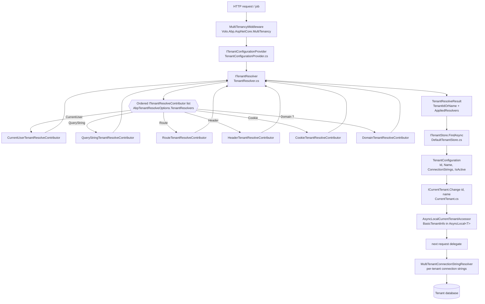

The multi-tenancy subsystem in the ABP Framework spans three NuGet packages — `Volo.Abp.MultiTenancy.Abstractions`, `Volo.Abp.MultiTenancy`, and `Volo.Abp.AspNetCore.MultiTenancy` — that together turn an HTTP request, a hosted job, or a background worker into a tenant-scoped execution context. This page walks the full chain: a request enters `MultiTenancyMiddleware`, the `ITenantResolver` runs an ordered list of `ITenantResolveContributor`s, the resolved id/name is looked up in `ITenantStore` to obtain a `TenantConfiguration`, `ICurrentTenant.Change(...)` flows it into an `AsyncLocal`, and `MultiTenantConnectionStringResolver` then chooses the per-tenant database connection string for `Volo.Abp.Data`.

<Info>
The three deep-dive companion pages — [Volo.Abp.MultiTenancy](/multi-tenancy/volo-abp-multitenancy), [Volo.Abp.AspNetCore.MultiTenancy](/multi-tenancy/aspnetcore-multitenancy), and [Tenant Resolvers](/multi-tenancy/tenant-resolvers) — drill into each layer. The [Tenant Configuration Store](/multi-tenancy/tenant-configuration-store) page covers `ITenantStore` and `TenantConfiguration`.
</Info>

## The big picture

A single request flows through a strict pipeline. The framework deliberately separates *resolution* (turning a request into an id or name string) from *configuration lookup* (loading the `TenantConfiguration` row) from *ambient state* (`ICurrentTenant`). Each layer is replaceable.



## The three packages at a glance

The split between the abstraction package and the implementation package is the same pattern used throughout the framework — keep contracts tiny and embeddable. Source files for each layer live at the paths below.

| Package | Folder under `framework/src/` | Role |
| --- | --- | --- |
| `Volo.Abp.MultiTenancy.Abstractions` | `Volo.Abp.MultiTenancy.Abstractions/Volo/Abp/MultiTenancy/` | Pure interfaces, DTOs, enums, options |
| `Volo.Abp.MultiTenancy` | `Volo.Abp.MultiTenancy/Volo/Abp/MultiTenancy/` | Resolver, current tenant, default store, connection-string resolver |
| `Volo.Abp.AspNetCore.MultiTenancy` | `Volo.Abp.AspNetCore.MultiTenancy/Volo/Abp/AspNetCore/MultiTenancy/` | Middleware, HTTP-based resolvers, error page, cookie helper |

The dependency chain is enforced by `[DependsOn(...)]` on each module:

- `AbpMultiTenancyAbstractionsModule` — depends on `AbpVirtualFileSystemModule` and `AbpLocalizationModule` (it only contributes localization resources).
- `AbpMultiTenancyModule` — depends on `AbpDataModule`, `AbpSecurityModule`, `AbpSettingsModule`, `AbpEventBusAbstractionsModule`, and `AbpMultiTenancyAbstractionsModule`.
- `AbpAspNetCoreMultiTenancyModule` — depends on `AbpMultiTenancyModule` and `AbpAspNetCoreModule`.

## Key abstractions

These contracts live in `Volo.Abp.MultiTenancy.Abstractions` and are everything a consuming module needs to be tenant-aware without taking a hard dependency on the implementation package.

### `ICurrentTenant` — the ambient state

`ICurrentTenant` is the small, intentionally minimal contract you inject anywhere you need to know "which tenant am I running for?". Defined in `Volo.Abp.MultiTenancy.Abstractions/Volo/Abp/MultiTenancy/ICurrentTenant.cs`:

```csharp
public interface ICurrentTenant
{
    bool IsAvailable { get; }
    Guid? Id { get; }
    string? Name { get; }
    IDisposable Change(Guid? id, string? name = null);
}
```

A `null` `Id` means the **Host** side; a non-null value is a tenant. The disposable returned by `Change(...)` restores the previous scope when disposed — that is what enables tenant-bracketed code blocks.

### `ICurrentTenantAccessor` — the storage slot

The default implementation lives in `Volo.Abp.MultiTenancy/Volo/Abp/MultiTenancy/AsyncLocalCurrentTenantAccessor.cs` and uses `AsyncLocal<BasicTenantInfo?>`. It is registered as a singleton in `AbpMultiTenancyModule.ConfigureServices`:

```csharp
context.Services.AddSingleton<ICurrentTenantAccessor>(AsyncLocalCurrentTenantAccessor.Instance);
```

This is what makes `ICurrentTenant` survive `await` boundaries inside the same logical flow.

### `ITenantResolver` and `ITenantResolveContributor`

`ITenantResolver` (in `ITenantResolver.cs`) returns a `TenantResolveResult` which carries a `TenantIdOrName` plus the ordered list of contributor names that ran. The default implementation, `TenantResolver` in `Volo.Abp.MultiTenancy/Volo/Abp/MultiTenancy/TenantResolver.cs`, iterates `AbpTenantResolveOptions.TenantResolvers` and stops at the first contributor that sets `context.Handled = true` or fills `context.TenantIdOrName`.

### `ITenantStore` and `TenantConfiguration`

`ITenantStore` (in `Volo.Abp.MultiTenancy.Abstractions/Volo/Abp/MultiTenancy/ITenantStore.cs`) is the lookup contract:

```csharp
public interface ITenantStore
{
    Task<TenantConfiguration?> FindAsync(string normalizedName);
    Task<TenantConfiguration?> FindAsync(Guid id);
    Task<IReadOnlyList<TenantConfiguration>> GetListAsync(bool includeDetails = false);
    // ...obsolete sync overloads...
}
```

The shipped default implementation is `DefaultTenantStore` in `Volo.Abp.MultiTenancy/Volo/Abp/MultiTenancy/ConfigurationStore/DefaultTenantStore.cs`, backed by `AbpDefaultTenantStoreOptions.Tenants` (an array). The optional `Volo.Abp.TenantManagement` module replaces this with a database-backed store via `[Dependency(TryRegister = true)]`. See [tenant-configuration-store](/multi-tenancy/tenant-configuration-store) for a full breakdown.

## End-to-end resolution walkthrough

The following walkthrough cross-references the actual middleware code in `Volo.Abp.AspNetCore.MultiTenancy/Volo/Abp/AspNetCore/MultiTenancy/MultiTenancyMiddleware.cs`.

<Steps>
  <Step title="Request hits MultiTenancyMiddleware">
    `MultiTenancyMiddleware.InvokeAsync` is called after authentication. It receives `ITenantConfigurationProvider`, `ICurrentTenant`, `IOptions<AbpAspNetCoreMultiTenancyOptions>`, and `ITenantResolveResultAccessor`.
  </Step>
  <Step title="ITenantConfigurationProvider runs the resolver">
    `TenantConfigurationProvider.GetAsync(saveResolveResult: true)` calls `ITenantResolver.ResolveTenantIdOrNameAsync()`. The contributor chain is walked in `TenantResolver.cs`.
  </Step>
  <Step title="Contributors fire in registered order">
    `CurrentUserTenantResolveContributor` runs first (inserted at index 0 by `AbpMultiTenancyModule`). For HTTP apps `AbpAspNetCoreMultiTenancyModule` appends `QueryString`, `Route`, `Header`, and `Cookie`. The first one to set `context.Handled = true` or `context.TenantIdOrName` wins.
  </Step>
  <Step title="Result is looked up in ITenantStore">
    Back in `TenantConfigurationProvider.GetAsync`, the string is parsed: `Guid.TryParse` calls `TenantStore.FindAsync(Guid)`; otherwise the name is normalised via `ITenantNormalizer` (default `UpperInvariantTenantNormalizer`) and `FindAsync(string normalizedName)` is called.
  </Step>
  <Step title="Validation throws BusinessException on failure">
    If the resolved id/name does not exist, `Volo.AbpIo.MultiTenancy:010001` is thrown. If `TenantConfiguration.IsActive` is `false`, `Volo.AbpIo.MultiTenancy:010002` is thrown. Both messages are taken from `AbpMultiTenancyResource`.
  </Step>
  <Step title="ICurrentTenant.Change flows the value">
    `MultiTenancyMiddleware` opens a `using (_currentTenant.Change(tenant?.Id, tenant?.Name))` block around `next(context)`. The disposable restores the previous `AsyncLocal` value when the request unwinds.
  </Step>
  <Step title="QueryString resolution persists a cookie">
    If `TenantResolveResult.AppliedResolvers` contains `QueryStringTenantResolveContributor.ContributorName`, the middleware calls `AbpMultiTenancyCookieHelper.SetTenantCookie(context, _currentTenant.Id, _options.TenantKey)` so subsequent requests keep the choice sticky.
  </Step>
</Steps>

## Where `ICurrentTenant.Id` is read

Other framework subsystems read `ICurrentTenant.Id` to bend their behaviour. The most important consumer is `MultiTenantConnectionStringResolver` in `Volo.Abp.MultiTenancy/Volo/Abp/MultiTenancy/MultiTenantConnectionStringResolver.cs`, which overrides `DefaultConnectionStringResolver.ResolveAsync` (from `Volo.Abp.Data`):

```csharp
public override async Task<string> ResolveAsync(string? connectionStringName = null)
{
    if (_currentTenant.Id == null)
    {
        //No current tenant, fallback to default logic
        return await base.ResolveAsync(connectionStringName);
    }

    var tenant = await FindTenantConfigurationAsync(_currentTenant.Id.Value);
    if (tenant == null || tenant.ConnectionStrings.IsNullOrEmpty())
    {
        return await base.ResolveAsync(connectionStringName);
    }
    // ...try tenant.ConnectionStrings, then mapped database, then tenant default, then base...
}
```

This is the linkage point with `Volo.Abp.Data` and is documented in detail in [/data/connection-strings](/data/connection-strings) and again on the [Tenant Configuration Store](/multi-tenancy/tenant-configuration-store) page.

Other consumers in the framework that read `ICurrentTenant.Id`:

| Consumer | File | Purpose |
| --- | --- | --- |
| `TenantSettingValueProvider` | `Volo.Abp.MultiTenancy/Volo/Abp/MultiTenancy/TenantSettingValueProvider.cs` | Reads per-tenant settings, provider name `"T"` |
| `MultiTenantUrlProvider` | `Volo.Abp.MultiTenancy/Volo/Abp/MultiTenancy/MultiTenantUrlProvider.cs` | Replaces `{0}`, `{{tenantId}}`, `{{tenantName}}` in URLs |
| Data filter `IMultiTenant` | EF Core / MongoDB module | Auto-filters queries by `TenantId` |
| `AbpDistributedEntityEventOptions` | event bus | Adds `TenantId` to distributed ETOs |

## `AbpMultiTenancyOptions` — the master switch

The global on/off switch lives in `Volo.Abp.MultiTenancy.Abstractions/Volo/Abp/MultiTenancy/AbpMultiTenancyOptions.cs`:

```csharp
public class AbpMultiTenancyOptions
{
    public bool IsEnabled { get; set; }
    public MultiTenancyDatabaseStyle DatabaseStyle { get; set; } = MultiTenancyDatabaseStyle.Hybrid;
    public TenantUserSharingStrategy UserSharingStrategy { get; set; } = TenantUserSharingStrategy.Isolated;
}
```

| Property | Default | Effect |
| --- | --- | --- |
| `IsEnabled` | `false` | Central switch; data filters and permission `MultiTenancySides` checks honour it |
| `DatabaseStyle` | `Hybrid` (= `Shared \| PerTenant`) | Declares whether tenants share the host DB, get their own, or either |
| `UserSharingStrategy` | `Isolated` | Whether identity users may be shared across tenants |

Test setup in `framework/test/Volo.Abp.AspNetCore.MultiTenancy.Tests/Volo/Abp/AspNetCore/App/AppModule.cs`:

```csharp
Configure<AbpMultiTenancyOptions>(options =>
{
    options.IsEnabled = true;
});
```

## `MultiTenancySides` and the host/tenant split

The framework expresses the host/tenant distinction with the `MultiTenancySides` flags enum in `MultiTenancySides.cs`:

```csharp
[Flags]
public enum MultiTenancySides : byte
{
    Tenant = 1,
    Host = 2,
    Both = Tenant | Host
}
```

This enum is consumed by:

- `PermissionDefinition.MultiTenancySide` — restricts permissions to host-only, tenant-only, or both (see [/security/permissions](/security/permissions)).
- `FeatureDefinition.MultiTenancySide` — same idea for features.
- `CurrentTenantExtensions.GetMultiTenancySide(ICurrentTenant)` — returns `Tenant` if `Id.HasValue`, `Host` otherwise.

## Tenant-scoped code blocks

Outside the middleware, anywhere you have an `ICurrentTenant` you can pivot to a tenant explicitly. The pattern is used heavily by background jobs, data seeders, and tests:

```csharp
using (_currentTenant.Change(tenantId))
{
    // Any code here sees ICurrentTenant.Id == tenantId.
    // Data filters, connection-string resolution, settings,
    // and event publishing all switch accordingly.
}
```

Pass `null` to drop into the host scope:

```csharp
using (_currentTenant.Change(null))
{
    // Host-side code, e.g. iterating tenants for seeding.
}
```

`CurrentTenant.Change` is implemented in `Volo.Abp.MultiTenancy/Volo/Abp/MultiTenancy/CurrentTenant.cs` and uses `DisposeAction<T>` with a captured tuple to restore the previous `BasicTenantInfo` from `ICurrentTenantAccessor.Current`.

## Disabling multi-tenancy locally

The `[IgnoreMultiTenancy]` attribute in `Volo.Abp.MultiTenancy.Abstractions/Volo/Abp/MultiTenancy/IgnoreMultiTenancyAttribute.cs` is recognised by the data-filter layer to *exclude* a specific entity, DTO, or class from tenant filtering even when `AbpMultiTenancyOptions.IsEnabled` is true. It is itself decorated on `TenantConfigurationCacheItem` so the cache is global, not per-tenant.

## Cross-references

<CardGroup cols={2}>
  <Card title="Volo.Abp.MultiTenancy package" icon="cube" href="/multi-tenancy/volo-abp-multitenancy">
    Every file in the core package: `CurrentTenant`, `TenantResolver`, `MultiTenantConnectionStringResolver`, `TenantConfigurationProvider`.
  </Card>
  <Card title="AspNetCore.MultiTenancy package" icon="globe" href="/multi-tenancy/aspnetcore-multitenancy">
    `MultiTenancyMiddleware`, `app.UseMultiTenancy()`, the error page, and how middleware order interacts with authentication.
  </Card>
  <Card title="Tenant resolvers" icon="route" href="/multi-tenancy/tenant-resolvers">
    Every `ITenantResolveContributor` shipped, its default order in `AbpTenantResolveOptions`, and how the chain short-circuits.
  </Card>
  <Card title="Tenant store" icon="database" href="/multi-tenancy/tenant-configuration-store">
    `ITenantStore`, `DefaultTenantStore`, `AbpDefaultTenantStoreOptions`, and the `TenantConfiguration.ConnectionStrings` shape.
  </Card>
  <Card title="Connection strings" icon="plug" href="/data/connection-strings">
    How `MultiTenantConnectionStringResolver` plugs into the generic `IConnectionStringResolver`.
  </Card>
  <Card title="Tenant Management module" icon="building" href="/modules/tenant-management">
    The database-backed `ITenantStore` and admin UI shipped as a pro module.
  </Card>
</CardGroup>

<Tip>
For a deeper, step-numbered narrative of the resolution flow with sequence-diagram framing see [/flows/multi-tenancy-resolution](/flows/multi-tenancy-resolution).
</Tip>

## What changes when `IsEnabled` is false

`AbpMultiTenancyOptions.IsEnabled` is the master switch. When `false` the framework still installs `ICurrentTenant`, `ITenantResolver`, and `ITenantStore` — but downstream consumers gate their behaviour on this flag, so the practical effect is that data filters and side-aware permissions/features behave as if everything ran "host-side":

- The EF Core and MongoDB **`MultiTenant`** filters skip the `TenantId` predicate.
- `PermissionDefinitionContext` treats `MultiTenancySide.Host`-restricted permissions as available to all users.
- `MultiTenantConnectionStringResolver` still runs but routinely falls into the `_currentTenant.Id == null` branch and delegates to the host's `DefaultConnectionStringResolver`.

You typically only set `IsEnabled = false` in single-tenant deployments where you still want to share modules with multi-tenant siblings. The integration test fixture in `framework/test/Volo.Abp.AspNetCore.MultiTenancy.Tests/Volo/Abp/AspNetCore/App/AppModule.cs` flips it to `true` explicitly.

## How the host is represented

The framework deliberately encodes "host" as the absence of a tenant id. There is no `Guid.Empty` placeholder. `BasicTenantInfo.TenantId == null` and `ICurrentTenant.Id == null` both mean "we are in the host scope". A few practical consequences:

| Question | Answer |
| --- | --- |
| How do I switch to host explicitly? | `using (currentTenant.Change(null))` |
| How do I tell whether code is host-side? | `if (!currentTenant.IsAvailable)` or `currentTenant.GetMultiTenancySide() == MultiTenancySides.Host` |
| How does the middleware represent "host"? | `TenantResolveResult.TenantIdOrName == null` after the chain, with the contributor optionally having set `Handled = true` |
| What does a "host user" look like? | An authenticated `ClaimsPrincipal` without a `tenantid` claim (`ICurrentUser.TenantId == null`) |

The `[IgnoreMultiTenancy]` attribute (in `Volo.Abp.MultiTenancy.Abstractions/Volo/Abp/MultiTenancy/IgnoreMultiTenancyAttribute.cs`) is the way classes opt **out** of tenant scoping individually — for example, `TenantConfigurationCacheItem` is decorated with it so the cache is host-global.

## Diagnostic checklist

When tenant resolution misbehaves, walk this list in order:

1. Is `AbpMultiTenancyOptions.IsEnabled == true`? (Check `appsettings.json` and any `Configure<AbpMultiTenancyOptions>` call.)
2. Is `app.UseAuthentication()` invoked **before** `app.UseMultiTenancy()`? The `UseMultiTenancy` extension logs a warning otherwise; see [ASP.NET Core](/multi-tenancy/aspnetcore-multitenancy).
3. Inspect `ITenantResolveResultAccessor.Result.AppliedResolvers` to see which contributor handled the request — it is set by the middleware on `HttpContext.Items["__AbpTenantResolveResult"]`.
4. If a contributor handled but `TenantConfigurationProvider` threw `Volo.AbpIo.MultiTenancy:010001`, the resolved id/name is not in `ITenantStore` — check the store and (if using `DefaultTenantStore`) `appsettings.json`'s `Tenants` array.
5. If `010002` was thrown, the tenant is `IsActive == false`.
6. If everything passes but the database is wrong, check `MultiTenantConnectionStringResolver`'s fallback ladder against `tenant.ConnectionStrings` and the host `AbpDbConnectionOptions.Databases` map.
