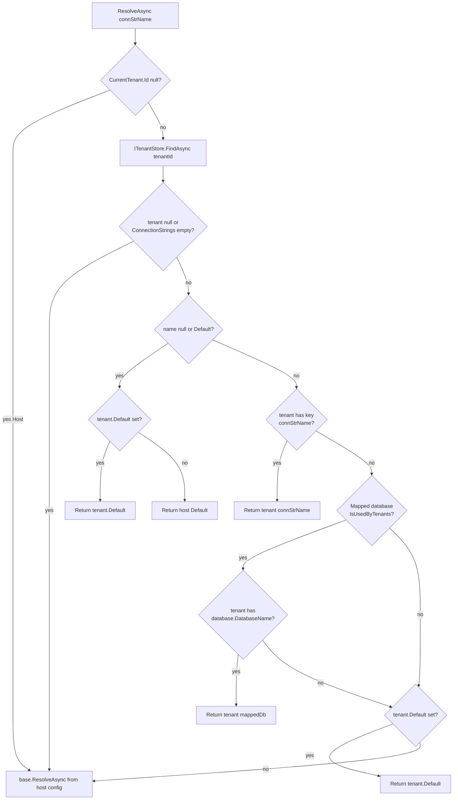

After the resolver chain produces an id or name, the ABP Framework looks the tenant up in an `ITenantStore`. The store returns a `TenantConfiguration` — the record that holds the tenant's id, name, normalized name, active flag, edition id, and (crucially) per-tenant `ConnectionStrings`. This page walks the store contract, the configuration-bound `DefaultTenantStore`, the `TenantConfiguration` shape, the normalisation rules, and how `MultiTenantConnectionStringResolver` turns the result into the right database.

<Info>
The resolver chain that produces the id/name is documented on [Tenant Resolvers](/multi-tenancy/tenant-resolvers). For the surrounding pipeline see [Overview](/multi-tenancy/overview), and for the data-layer side see [/data/connection-strings](/data/connection-strings).
</Info>

## `ITenantStore`

File: `Volo.Abp.MultiTenancy.Abstractions/Volo/Abp/MultiTenancy/ITenantStore.cs`. The lookup contract is small and async-first:

```csharp
public interface ITenantStore
{
    Task<TenantConfiguration?> FindAsync(string normalizedName);
    Task<TenantConfiguration?> FindAsync(Guid id);
    Task<IReadOnlyList<TenantConfiguration>> GetListAsync(bool includeDetails = false);

    [Obsolete("Use FindAsync method.")]
    TenantConfiguration? Find(string normalizedName);

    [Obsolete("Use FindAsync method.")]
    TenantConfiguration? Find(Guid id);
}
```

Two find overloads correspond to the two kinds of input the resolver can produce: a GUID parsed from a query string or claim, or a normalised name from a route token or host header. `GetListAsync` is what the host-side admin UI uses to enumerate tenants.

| Method | Used by | Notes |
| --- | --- | --- |
| `FindAsync(string normalizedName)` | `TenantConfigurationProvider.FindTenantAsync` non-GUID path | Argument is *already* normalised |
| `FindAsync(Guid id)` | `TenantConfigurationProvider.FindTenantAsync` GUID path | The common case for cookies/headers |
| `GetListAsync(bool includeDetails)` | Admin UIs, seeders, tenant iteration | `includeDetails` is implementation-defined |
| `Find` (sync) | Obsolete | Only used by the obsolete sync `MultiTenantConnectionStringResolver.Resolve` |

## `TenantConfiguration`

File: `Volo.Abp.MultiTenancy.Abstractions/Volo/Abp/MultiTenancy/TenantConfiguration.cs`. The serialisable record returned by the store:

```csharp
[Serializable]
public class TenantConfiguration
{
    public Guid Id { get; set; }
    public string Name { get; set; } = default!;
    public string NormalizedName { get; set; } = default!;

    public ConnectionStrings? ConnectionStrings { get; set; }

    public bool IsActive { get; set; }
    public Guid? EditionId { get; set; }

    public TenantConfiguration()
    {
        IsActive = true;
    }

    public TenantConfiguration(Guid id, string name) : this()
    {
        Check.NotNull(name, nameof(name));
        Id = id;
        Name = name;
        ConnectionStrings = new ConnectionStrings();
    }

    public TenantConfiguration(Guid id, string name, string normalizedName, Guid? editionId = null)
        : this(id, name)
    {
        Check.NotNull(normalizedName, nameof(normalizedName));
        NormalizedName = normalizedName;
        EditionId = editionId;
    }
}
```

| Property | Type | Used by |
| --- | --- | --- |
| `Id` | `Guid` | The canonical identity, written to `ICurrentTenant.Id` |
| `Name` | `string` | Display, written to `ICurrentTenant.Name`, and used in `MultiTenantUrlProvider` |
| `NormalizedName` | `string` | Index key for `FindAsync(string)`; produced by `ITenantNormalizer` |
| `ConnectionStrings` | `ConnectionStrings?` | Per-tenant database routing |
| `IsActive` | `bool` | If `false`, `TenantConfigurationProvider` throws `010002` |
| `EditionId` | `Guid?` | Pro feature management — controls which features the tenant has |

The constructors set sensible defaults: `IsActive = true`, an empty `ConnectionStrings` dictionary, and a normalised name when supplied. The zero-arg constructor exists for serialisation (the type is `[Serializable]`).

## `DefaultTenantStore` and `AbpDefaultTenantStoreOptions`

The shipped store is configuration-bound. File: `Volo.Abp.MultiTenancy/Volo/Abp/MultiTenancy/ConfigurationStore/DefaultTenantStore.cs`:

```csharp
[Dependency(TryRegister = true)]
public class DefaultTenantStore : ITenantStore, ITransientDependency
{
    private readonly AbpDefaultTenantStoreOptions _options;

    public DefaultTenantStore(IOptionsMonitor<AbpDefaultTenantStoreOptions> options)
    {
        _options = options.CurrentValue;
    }

    public Task<TenantConfiguration?> FindAsync(string normalizedName)
        => Task.FromResult(Find(normalizedName));

    public Task<TenantConfiguration?> FindAsync(Guid id)
        => Task.FromResult(Find(id));

    public Task<IReadOnlyList<TenantConfiguration>> GetListAsync(bool includeDetails = false)
        => Task.FromResult<IReadOnlyList<TenantConfiguration>>(_options.Tenants);

    public TenantConfiguration? Find(string normalizedName)
        => _options.Tenants?.FirstOrDefault(t => t.NormalizedName == normalizedName);

    public TenantConfiguration? Find(Guid id)
        => _options.Tenants?.FirstOrDefault(t => t.Id == id);
}
```

Three behaviours to highlight:

- `[Dependency(TryRegister = true)]` — only registered if no other `ITenantStore` is already in DI. The Tenant Management module overrides this with a DB-backed store.
- `IOptionsMonitor<AbpDefaultTenantStoreOptions>` — captures `CurrentValue` once at construction. Because the contributor is `ITransientDependency`, the snapshot is per request.
- Lookups are linear (`FirstOrDefault`) — fine for "a handful of tenants in appsettings" but not appropriate for hundreds.

The options class lives in the abstractions package. File: `Volo.Abp.MultiTenancy.Abstractions/Volo/Abp/MultiTenancy/ConfigurationStore/AbpDefaultTenantStoreOptions.cs`:

```csharp
public class AbpDefaultTenantStoreOptions
{
    public TenantConfiguration[] Tenants { get; set; }

    public AbpDefaultTenantStoreOptions()
    {
        Tenants = Array.Empty<TenantConfiguration>();
    }
}
```

`AbpMultiTenancyModule` binds the root configuration into it:

```csharp
var configuration = context.Services.GetConfiguration();
Configure<AbpDefaultTenantStoreOptions>(configuration);
```

That means an `appsettings.json` like:

```json
{
  "Tenants": [
    {
      "Id": "446a5211-3d72-4339-9783-3f4b3d76d7d7",
      "Name": "acme",
      "NormalizedName": "ACME",
      "IsActive": true,
      "ConnectionStrings": {
        "Default": "Server=db;Database=Acme;..."
      }
    }
  ]
}
```

…is enough to bootstrap a multi-tenant app without any database or admin UI. The integration test setup in `framework/test/Volo.Abp.AspNetCore.MultiTenancy.Tests/Volo/Abp/AspNetCore/MultiTenancy/AspNetCoreMultiTenancy_WithDomainResolver_Tests.cs` exercises the same shape programmatically:

```csharp
services.Configure<AbpDefaultTenantStoreOptions>(options =>
{
    options.Tenants = new[]
    {
        new TenantConfiguration(_testTenantId, _testTenantName, _testTenantNormalizedName)
    };
});
```

## Name normalisation

`ITenantNormalizer.cs`:

```csharp
public interface ITenantNormalizer
{
    string? NormalizeName(string? name);
}
```

Default implementation in `UpperInvariantTenantNormalizer.cs`:

```csharp
public class UpperInvariantTenantNormalizer : ITenantNormalizer, ITransientDependency
{
    public virtual string? NormalizeName(string? name)
    {
        return name?.Normalize().ToUpperInvariant();
    }
}
```

So `acme` becomes `ACME`, `Müller` becomes `MÜLLER` (after Unicode normalisation). `TenantConfigurationProvider.FindTenantAsync` calls this immediately before `FindAsync(string)`:

```csharp
protected virtual async Task<TenantConfiguration?> FindTenantAsync(string tenantIdOrName)
{
    if (Guid.TryParse(tenantIdOrName, out var parsedTenantId))
    {
        return await TenantStore.FindAsync(parsedTenantId);
    }
    else
    {
        return await TenantStore.FindAsync(TenantNormalizer.NormalizeName(tenantIdOrName)!);
    }
}
```

Stores **must** key their string-based lookup on the normalised form. The default store relies on `TenantConfiguration.NormalizedName`; the Tenant Management module persists a `NormalizedName` column with a unique index.

## `ConnectionStrings`

`TenantConfiguration.ConnectionStrings` is the standard `Volo.Abp.Data.ConnectionStrings` dictionary. File: `Volo.Abp.Data/Volo/Abp/Data/ConnectionStrings.cs`:

```csharp
[Serializable]
public class ConnectionStrings : Dictionary<string, string?>
{
    public const string DefaultConnectionStringName = "Default";

    public string? Default {
        get => this.GetOrDefault(DefaultConnectionStringName);
        set => this[DefaultConnectionStringName] = value;
    }
}
```

Two keys are special: `"Default"` (the catch-all) and any named connection string that matches an `AbpDbConnectionOptions` mapping. Tenants can supply per-database connection strings — for example, a tenant may share the `Identity` database with the host but have its own `Saas` database. See [/data/connection-strings](/data/connection-strings) for the full host-side options.

## Connection-string resolution per tenant

`MultiTenantConnectionStringResolver.cs` is the bridge between the multi-tenancy data and the `IConnectionStringResolver` contract from `Volo.Abp.Data`. The full method:

```csharp
public override async Task<string> ResolveAsync(string? connectionStringName = null)
{
    if (_currentTenant.Id == null)
        return await base.ResolveAsync(connectionStringName);

    var tenant = await FindTenantConfigurationAsync(_currentTenant.Id.Value);

    if (tenant == null || tenant.ConnectionStrings.IsNullOrEmpty())
        return await base.ResolveAsync(connectionStringName);

    var tenantDefaultConnectionString = tenant.ConnectionStrings?.Default;

    if (connectionStringName == null ||
        connectionStringName == ConnectionStrings.DefaultConnectionStringName)
    {
        return !tenantDefaultConnectionString.IsNullOrWhiteSpace()
            ? tenantDefaultConnectionString!
            : Options.ConnectionStrings.Default!;
    }

    var connString = tenant.ConnectionStrings?.GetOrDefault(connectionStringName);
    if (!connString.IsNullOrWhiteSpace())
        return connString!;

    var database = Options.Databases.GetMappedDatabaseOrNull(connectionStringName);
    if (database != null && database.IsUsedByTenants)
    {
        connString = tenant.ConnectionStrings?.GetOrDefault(database.DatabaseName);
        if (!connString.IsNullOrWhiteSpace())
            return connString!;
    }

    if (!tenantDefaultConnectionString.IsNullOrWhiteSpace())
        return tenantDefaultConnectionString!;

    return await base.ResolveAsync(connectionStringName);
}
```



### Worked example

Given:

```json
{
  "ConnectionStrings": {
    "Default": "Server=host-db;Database=Host;...",
    "AbpIdentity": "Server=host-db;Database=HostIdentity;..."
  },
  "Tenants": [
    {
      "Id": "446a5211-3d72-4339-9783-3f4b3d76d7d7",
      "Name": "acme",
      "NormalizedName": "ACME",
      "ConnectionStrings": {
        "Default": "Server=acme-db;Database=Acme;..."
      }
    }
  ]
}
```

And a request resolved to tenant `acme`:

| Call | Output | Rationale |
| --- | --- | --- |
| `ResolveAsync(null)` | `Server=acme-db;Database=Acme;...` | Tenant default present |
| `ResolveAsync("Default")` | `Server=acme-db;Database=Acme;...` | Same as above |
| `ResolveAsync("AbpIdentity")` | `Server=host-db;Database=HostIdentity;...` | Tenant has no `AbpIdentity` entry and falls back to tenant default which is empty for this key, then base `Options.ConnectionStrings.Default!` if the mapped DB is not marked `IsUsedByTenants` — the actual ladder includes the host's `AbpIdentity` via `base.ResolveAsync` |

The exact fallback order (see ladder above) is:

1. Tenant `ConnectionStrings[name]`
2. Tenant `ConnectionStrings[mappedDatabaseName]` (only if that mapped database has `IsUsedByTenants = true`)
3. Tenant `ConnectionStrings.Default`
4. Host `IConnectionStringResolver` (i.e. `DefaultConnectionStringResolver` reading `AbpDbConnectionOptions`)

## Pluggable stores

The default store is sufficient for static configurations. Real deployments use one of:

| Store implementation | Source | When |
| --- | --- | --- |
| `DefaultTenantStore` | `Volo.Abp.MultiTenancy/Volo/Abp/MultiTenancy/ConfigurationStore/DefaultTenantStore.cs` | Dev, demos, small fixed tenant count |
| `TenantStore` (Tenant Management module) | `Volo.Saas.Host` (pro) — see [/modules/tenant-management](/modules/tenant-management) | Production, dynamic tenant onboarding |
| Custom | Your code | When tenants live in an external SaaS/Billing system |

Replacing the store is a one-liner. The marker `[Dependency(TryRegister = true)]` on `DefaultTenantStore` means *any* `ITenantStore` registration wins:

```csharp
public override void ConfigureServices(ServiceConfigurationContext context)
{
    context.Services.AddTransient<ITenantStore, MyExternalTenantStore>();
}
```

…or replace the existing registration:

```csharp
context.Services.Replace(
    ServiceDescriptor.Transient<ITenantStore, MyExternalTenantStore>());
```

## Validation: not-found and inactive

`TenantConfigurationProvider.GetAsync` enforces two business rules on whatever the store returns:

```csharp
if (tenant == null)
{
    throw new BusinessException(
        code: "Volo.AbpIo.MultiTenancy:010001",
        message: StringLocalizer["TenantNotFoundMessage"],
        details: StringLocalizer["TenantNotFoundDetails", resolveResult.TenantIdOrName]
    );
}

if (!tenant.IsActive)
{
    throw new BusinessException(
        code: "Volo.AbpIo.MultiTenancy:010002",
        message: StringLocalizer["TenantNotActiveMessage"],
        details: StringLocalizer["TenantNotActiveDetails", resolveResult.TenantIdOrName]
    );
}
```

| Code | Trigger | Default localised key |
| --- | --- | --- |
| `Volo.AbpIo.MultiTenancy:010001` | `ITenantStore` returns null for the id/name | `TenantNotFoundMessage` |
| `Volo.AbpIo.MultiTenancy:010002` | Returned `TenantConfiguration.IsActive == false` | `TenantNotActiveMessage` |

These exceptions are caught by `MultiTenancyMiddleware` and handed to `AbpAspNetCoreMultiTenancyOptions.MultiTenancyMiddlewareErrorPageBuilder`, which by default deletes the stale cookie, signs cookie users out, and renders the embedded error page (see [ASP.NET Core](/multi-tenancy/aspnetcore-multitenancy)).

## Caching with `TenantConfigurationCacheItem`

The Tenant Management module wraps `TenantConfiguration` in `TenantConfigurationCacheItem` to distinguish "we looked and there was nothing" from "we never looked". File: `Volo.Abp.MultiTenancy.Abstractions/Volo/Abp/MultiTenancy/TenantConfigurationCacheItem.cs`:

```csharp
[Serializable]
[IgnoreMultiTenancy]
public class TenantConfigurationCacheItem
{
    private const string CacheKeyFormat = "i:{0},n:{1}";

    public TenantConfiguration? Value { get; set; }

    public static string CalculateCacheKey(Guid? id, string? name) { /* "i:<id>,n:<name>" */ }
    public static string CalculateCacheKey(Guid id) { /* ... */ }
    public static string CalculateCacheKey(string name) { /* ... */ }
}
```

`[IgnoreMultiTenancy]` is essential: this cache is **global**, indexed by tenant id or name. If it were tenant-scoped the cache would be useless for the resolver.

`TenantConnectionStringUpdatedEto.cs` is the distributed event used to **invalidate** that cache when a tenant's connection string changes elsewhere in the cluster.

## Localization

`Volo.Abp.MultiTenancy.Abstractions/Volo/Abp/MultiTenancy/Localization/en.json` contains the resource strings shown to users when tenants are missing or inactive. The resource class is `AbpMultiTenancyResource` and the abstractions module wires it up:

```csharp
Configure<AbpLocalizationOptions>(options =>
{
    options.Resources
        .Add<AbpMultiTenancyResource>("en")
        .AddVirtualJson("/Volo/Abp/MultiTenancy/Localization");
});
```

## Building a custom store

A minimal store reading from a JSON file at runtime:

```csharp
public class JsonFileTenantStore : ITenantStore, ITransientDependency
{
    private readonly TenantConfiguration[] _tenants;

    public JsonFileTenantStore()
    {
        var json = File.ReadAllText("tenants.json");
        _tenants = JsonSerializer.Deserialize<TenantConfiguration[]>(json)
                   ?? Array.Empty<TenantConfiguration>();
    }

    public Task<TenantConfiguration?> FindAsync(string normalizedName)
        => Task.FromResult(_tenants.FirstOrDefault(t => t.NormalizedName == normalizedName));

    public Task<TenantConfiguration?> FindAsync(Guid id)
        => Task.FromResult(_tenants.FirstOrDefault(t => t.Id == id));

    public Task<IReadOnlyList<TenantConfiguration>> GetListAsync(bool includeDetails = false)
        => Task.FromResult<IReadOnlyList<TenantConfiguration>>(_tenants);

    [Obsolete] public TenantConfiguration? Find(string normalizedName)
        => _tenants.FirstOrDefault(t => t.NormalizedName == normalizedName);
    [Obsolete] public TenantConfiguration? Find(Guid id)
        => _tenants.FirstOrDefault(t => t.Id == id);
}
```

Because `DefaultTenantStore` is `[Dependency(TryRegister = true)]`, just registering the type via `ITransientDependency` is enough — your store wins and the default never registers.

## Cross-references

<CardGroup cols={2}>
  <Card title="Resolution overview" icon="diagram-project" href="/multi-tenancy/overview">
    Where the store sits in the pipeline.
  </Card>
  <Card title="Tenant resolvers" icon="route" href="/multi-tenancy/tenant-resolvers">
    What produces the id/name that the store is then asked about.
  </Card>
  <Card title="Core package" icon="cube" href="/multi-tenancy/volo-abp-multitenancy">
    `TenantConfigurationProvider`, `MultiTenantConnectionStringResolver`, `ITenantNormalizer`.
  </Card>
  <Card title="ASP.NET Core module" icon="globe" href="/multi-tenancy/aspnetcore-multitenancy">
    How `010001` / `010002` end up on the error page.
  </Card>
  <Card title="Connection strings" icon="plug" href="/data/connection-strings">
    The host-side `IConnectionStringResolver` and `AbpDbConnectionOptions.Databases` mapping.
  </Card>
  <Card title="Tenant Management module" icon="building" href="/modules/tenant-management">
    The shipping replacement for `DefaultTenantStore` with admin UI and persistence.
  </Card>
</CardGroup>
