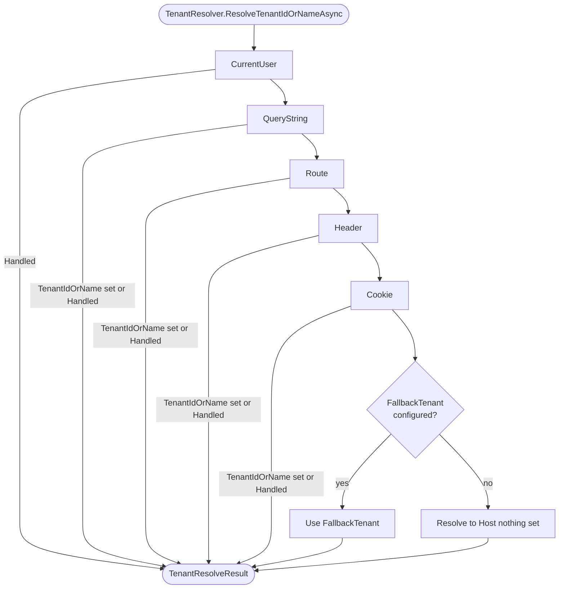

In the ABP Framework, tenant identity comes from a chain of `ITenantResolveContributor` implementations. Each contributor inspects one source — claims, query string, route, header, cookie, or host — and either fills `ITenantResolveContext.TenantIdOrName`, sets `Handled = true`, or declines and lets the next contributor try. This page enumerates every contributor that ships, documents the registration order produced by the modules, and shows how to compose your own.

<Info>
The chain itself is driven by `TenantResolver` in `Volo.Abp.MultiTenancy/Volo/Abp/MultiTenancy/TenantResolver.cs`. For the surrounding pipeline see the [Overview](/multi-tenancy/overview), and for the middleware that triggers it see [ASP.NET Core](/multi-tenancy/aspnetcore-multitenancy).
</Info>

## The contract

Every contributor implements:

```csharp
public interface ITenantResolveContributor
{
    string Name { get; }
    Task ResolveAsync(ITenantResolveContext context);
}
```

…and almost every one inherits from `TenantResolveContributorBase`:

```csharp
public abstract class TenantResolveContributorBase : ITenantResolveContributor
{
    public abstract string Name { get; }
    public abstract Task ResolveAsync(ITenantResolveContext context);
}
```

The context surface is intentionally minimal:

```csharp
public interface ITenantResolveContext : IServiceProviderAccessor
{
    string? TenantIdOrName { get; set; }
    bool Handled { get; set; }
}
```

A contributor's two output knobs are `TenantIdOrName` (any non-null, non-empty value short-circuits later contributors) and `Handled` (set to `true` to force the chain to stop even when `TenantIdOrName` is null — used to pin the request to the **host** side).

## The composed default order

Two ABP modules contribute to `AbpTenantResolveOptions.TenantResolvers`. After both have run their `ConfigureServices`, the list looks like:

| Index | Contributor | Added by | `Name` |
| --- | --- | --- | --- |
| 0 | `CurrentUserTenantResolveContributor` | `AbpMultiTenancyModule` | `"CurrentUser"` |
| 1 | `QueryStringTenantResolveContributor` | `AbpAspNetCoreMultiTenancyModule` | `"QueryString"` |
| 2 | `RouteTenantResolveContributor` | `AbpAspNetCoreMultiTenancyModule` | `"Route"` |
| 3 | `HeaderTenantResolveContributor` | `AbpAspNetCoreMultiTenancyModule` | `"Header"` |
| 4 | `CookieTenantResolveContributor` | `AbpAspNetCoreMultiTenancyModule` | `"Cookie"` |

`DomainTenantResolveContributor` is **not** in the default list. It is inserted by `AbpMultiTenancyOptionsExtensions.AddDomainTenantResolver("{0}.host.com")` at position 1 (immediately after `CurrentUserTenantResolveContributor`).



The `TenantResolver` loop that produces this behaviour:

```csharp
foreach (var tenantResolver in Options.TenantResolvers)
{
    Logger.LogDebug("Trying to resolve tenant through '{TenantResolverName}'...", tenantResolver.Name);
    await tenantResolver.ResolveAsync(context);

    result.AppliedResolvers.Add(tenantResolver.Name);

    if (context.HasResolvedTenantOrHost())
    {
        result.TenantIdOrName = context.TenantIdOrName;
        break;
    }
}
```

And the fallback step:

```csharp
if (result.TenantIdOrName.IsNullOrEmpty() && !string.IsNullOrWhiteSpace(Options.FallbackTenant))
{
    result.TenantIdOrName = Options.FallbackTenant;
    result.AppliedResolvers.Add(TenantResolverNames.FallbackTenant);
}
```

## `CurrentUserTenantResolveContributor`

File: `Volo.Abp.MultiTenancy/Volo/Abp/MultiTenancy/CurrentUserTenantResolveContributor.cs`. Inserted at index 0 by `AbpMultiTenancyModule`.

```csharp
public class CurrentUserTenantResolveContributor : TenantResolveContributorBase
{
    public const string ContributorName = "CurrentUser";
    public override string Name => ContributorName;

    public override Task ResolveAsync(ITenantResolveContext context)
    {
        var currentUser = context.ServiceProvider.GetRequiredService<ICurrentUser>();
        if (currentUser.IsAuthenticated)
        {
            context.Handled = true;
            context.TenantIdOrName = currentUser.TenantId?.ToString();
        }

        return Task.CompletedTask;
    }
}
```

| Property | Value |
| --- | --- |
| Source inspected | `ICurrentUser.TenantId` (claim `tenantid`) |
| Result | GUID string if user's claim is a GUID, `null` if user is host-side |
| `Handled` set when authenticated? | **Yes** — even if `TenantId` is null |
| Default position | `0` (very first) |
| Side-effect on chain | Authenticated users *always* short-circuit later HTTP contributors |

The implication is significant: once a user is authenticated, their token defines the tenant; query-string, header, route, or cookie overrides are *ignored*. This is the right default — it prevents tenant impersonation by spoofed cookies — but it is also why `app.UseMultiTenancy()` must come **after** `app.UseAuthentication()`.

## `QueryStringTenantResolveContributor`

File: `Volo.Abp.AspNetCore.MultiTenancy/Volo/Abp/AspNetCore/MultiTenancy/QueryStringTenantResolveContributor.cs`.

```csharp
public class QueryStringTenantResolveContributor : HttpTenantResolveContributorBase
{
    public const string ContributorName = "QueryString";
    public override string Name => ContributorName;

    protected override Task<string?> GetTenantIdOrNameFromHttpContextOrNullAsync(ITenantResolveContext context, HttpContext httpContext)
    {
        if (httpContext.Request.QueryString.HasValue)
        {
            var tenantKey = context.GetAbpAspNetCoreMultiTenancyOptions().TenantKey;
            if (httpContext.Request.Query.ContainsKey(tenantKey))
            {
                var tenantValue = httpContext.Request.Query[tenantKey].ToString();
                if (tenantValue.IsNullOrWhiteSpace())
                {
                    context.Handled = true;
                    return Task.FromResult<string?>(null);
                }
                return Task.FromResult(tenantValue)!;
            }
        }
        return Task.FromResult<string?>(null);
    }
}
```

| Property | Value |
| --- | --- |
| Source inspected | `HttpContext.Request.Query[options.TenantKey]` |
| Default tenant key | `"__tenant"` |
| Empty-value behaviour | Sets `Handled = true` with `TenantIdOrName = null` (forces host) |
| Default position | `1` (after `CurrentUser`) |
| Side-effect | If applied, `MultiTenancyMiddleware` writes a sticky tenant cookie |

`?__tenant=` (empty value) is a deliberate way to switch to the **host** side. `?__tenant=acme-guid` carries a GUID; `?__tenant=acme` carries a name that the configuration provider will normalise and look up.

## `RouteTenantResolveContributor`

File: `Volo.Abp.AspNetCore.MultiTenancy/Volo/Abp/AspNetCore/MultiTenancy/RouteTenantResolveContributor.cs`.

```csharp
public class RouteTenantResolveContributor : HttpTenantResolveContributorBase
{
    public const string ContributorName = "Route";
    public override string Name => ContributorName;

    protected override Task<string?> GetTenantIdOrNameFromHttpContextOrNullAsync(ITenantResolveContext context, HttpContext httpContext)
    {
        var tenantId = httpContext.GetRouteValue(context.GetAbpAspNetCoreMultiTenancyOptions().TenantKey);
        return Task.FromResult(tenantId != null ? Convert.ToString(tenantId) : null);
    }
}
```

| Property | Value |
| --- | --- |
| Source inspected | `HttpContext.GetRouteValue(options.TenantKey)` |
| Default tenant key | `"__tenant"` |
| Empty-value behaviour | Returns `null` without setting `Handled` |
| Default position | `2` |

Works with both controller and minimal-API routes. A pattern like `/{__tenant}/api/orders` makes the tenant a path segment.

<Note>
Because the key is the same `"__tenant"` value as for the query string, the route token name in your route templates should literally read `{__tenant}` unless you have overridden `AbpAspNetCoreMultiTenancyOptions.TenantKey`. The framework does not ship a separate route-token name.
</Note>

## `HeaderTenantResolveContributor`

File: `Volo.Abp.AspNetCore.MultiTenancy/Volo/Abp/AspNetCore/MultiTenancy/HeaderTenantResolveContributor.cs`.

```csharp
public class HeaderTenantResolveContributor : HttpTenantResolveContributorBase
{
    public const string ContributorName = "Header";
    public override string Name => ContributorName;

    protected override Task<string?> GetTenantIdOrNameFromHttpContextOrNullAsync(ITenantResolveContext context, HttpContext httpContext)
    {
        if (httpContext.Request.Headers.IsNullOrEmpty())
            return Task.FromResult((string?)null);

        var tenantIdKey = context.GetAbpAspNetCoreMultiTenancyOptions().TenantKey;
        var tenantIdHeader = httpContext.Request.Headers[tenantIdKey];

        if (tenantIdHeader == string.Empty || tenantIdHeader.Count < 1)
            return Task.FromResult((string?)null);

        if (tenantIdHeader.Count > 1)
        {
            Log(context, $"HTTP request includes more than one {tenantIdKey} header value. First one will be used. All of them: {tenantIdHeader.JoinAsString(\", \")}");
        }

        return Task.FromResult(tenantIdHeader.First());
    }
}
```

| Property | Value |
| --- | --- |
| Source inspected | `HttpContext.Request.Headers[options.TenantKey]` |
| Default tenant key | `"__tenant"` |
| Multiple values | Picks the first, logs a warning via `ILogger<HeaderTenantResolveContributor>` |
| Default position | `3` |

This is the canonical resolver for service-to-service traffic — your gateway sets `__tenant: <guid>` and downstream services pick it up. If you change `TenantKey` to `X-Tenant-Id`, the header changes too.

## `CookieTenantResolveContributor`

File: `Volo.Abp.AspNetCore.MultiTenancy/Volo/Abp/AspNetCore/MultiTenancy/CookieTenantResolveContributor.cs`.

```csharp
public class CookieTenantResolveContributor : HttpTenantResolveContributorBase
{
    public const string ContributorName = "Cookie";
    public override string Name => ContributorName;

    protected override Task<string?> GetTenantIdOrNameFromHttpContextOrNullAsync(ITenantResolveContext context, HttpContext httpContext)
    {
        return Task.FromResult(httpContext.Request.Cookies[context.GetAbpAspNetCoreMultiTenancyOptions().TenantKey]);
    }
}
```

| Property | Value |
| --- | --- |
| Source inspected | `HttpContext.Request.Cookies[options.TenantKey]` |
| Default cookie name | `"__tenant"` |
| Set by | `AbpMultiTenancyCookieHelper.SetTenantCookie` (called by middleware after a successful query-string resolve) |
| Default position | `4` (last in the default chain) |

The cookie's role in the chain is **persistence**: once a user picks a tenant via `?__tenant=...`, the middleware writes the cookie, and subsequent requests resolve to the same tenant even though the URL no longer carries the query string.

## `DomainTenantResolveContributor`

File: `Volo.Abp.AspNetCore.MultiTenancy/Volo/Abp/AspNetCore/MultiTenancy/DomainTenantResolveContributor.cs`. Not registered by default — opt in via `AddDomainTenantResolver`.

```csharp
public class DomainTenantResolveContributor : HttpTenantResolveContributorBase
{
    public const string ContributorName = "Domain";
    public override string Name => ContributorName;

    private static readonly string[] ProtocolPrefixes = { "http://", "https://" };
    private readonly string _domainFormat;

    public DomainTenantResolveContributor(string domainFormat)
    {
        _domainFormat = domainFormat.RemovePreFix(ProtocolPrefixes);
    }

    protected override Task<string?> GetTenantIdOrNameFromHttpContextOrNullAsync(ITenantResolveContext context, HttpContext httpContext)
    {
        if (!httpContext.Request.Host.HasValue)
            return Task.FromResult<string?>(null);

        var hostName = httpContext.Request.Host.Value.RemovePreFix(ProtocolPrefixes);
        var extractResult = FormattedStringValueExtracter.Extract(hostName, _domainFormat, ignoreCase: true);

        context.Handled = true;

        return Task.FromResult(extractResult.IsMatch ? extractResult.Matches[0].Value : null);
    }
}
```

| Property | Value |
| --- | --- |
| Source inspected | `HttpContext.Request.Host` |
| Format string | `{0}.app.example.com`, `{0}.abp.io:8080`, etc. |
| Always sets `Handled` | **Yes** — when the request reaches the contributor, the host *is* the tenant (or it explicitly is not) |
| Default position | `1` if added via `AddDomainTenantResolver` |
| Mismatch behaviour | `Handled = true` with `TenantIdOrName = null` → resolves to host |

The unconditional `context.Handled = true` is what makes the domain a strict authority: once you wire it in, the only way to override the domain-derived tenant in the same request is via `CurrentUserTenantResolveContributor`, which sits ahead of it.

The unit test `AspNetCoreMultiTenancy_WithDomainResolver_Tests.Should_Use_Domain_As_First_Priority_If_Specified` confirms this — even with an `__tenant` header set to a different GUID, the domain wins:

```csharp
[Fact]
public async Task Should_Use_Domain_As_First_Priority_If_Specified()
{
    Client.DefaultRequestHeaders.Add(_options.TenantKey, Guid.NewGuid().ToString());

    var result = await GetResponseAsObjectAsync<Dictionary<string, string>>("http://acme.abp.io:8080");
    result["TenantId"].ShouldBe(_testTenantId.ToString());
}
```

## `FormTenantResolveContributor` (obsolete)

File: `Volo.Abp.AspNetCore.MultiTenancy/Volo/Abp/AspNetCore/MultiTenancy/FormTenantResolveContributor.cs`. Marked `[Obsolete]` and not auto-registered:

```csharp
[Obsolete("This may make some features of ASP NET Core unavailable, Will be removed in future versions.")]
public class FormTenantResolveContributor : HttpTenantResolveContributorBase
{
    public const string ContributorName = "Form";
    public override string Name => ContributorName;

    protected override async Task<string?> GetTenantIdOrNameFromHttpContextOrNullAsync(ITenantResolveContext context, HttpContext httpContext)
    {
        if (!httpContext.Request.HasFormContentType)
            return null;

        var form = await httpContext.Request.ReadFormAsync();
        return form[context.GetAbpAspNetCoreMultiTenancyOptions().TenantKey];
    }
}
```

Reading the form body during middleware consumes the request stream and breaks model binding for typed actions — that is why it is obsolete. Use header or query-string instead for AJAX form posts.

## `ActionTenantResolveContributor` — the inline escape hatch

File: `Volo.Abp.MultiTenancy/Volo/Abp/MultiTenancy/ActionTenantResolveContributor.cs`. Lets you slot a lambda into the chain without writing a class:

```csharp
public class ActionTenantResolveContributor : TenantResolveContributorBase
{
    public const string ContributorName = "Action";
    public override string Name => ContributorName;

    private readonly Action<ITenantResolveContext> _resolveAction;

    public ActionTenantResolveContributor(Action<ITenantResolveContext> resolveAction)
    {
        Check.NotNull(resolveAction, nameof(resolveAction));
        _resolveAction = resolveAction;
    }

    public override Task ResolveAsync(ITenantResolveContext context)
    {
        _resolveAction(context);
        return Task.CompletedTask;
    }
}
```

Typical use — read a custom claim with a non-standard name:

```csharp
Configure<AbpTenantResolveOptions>(options =>
{
    options.TenantResolvers.Insert(0, new ActionTenantResolveContributor(ctx =>
    {
        var user = ctx.ServiceProvider.GetRequiredService<ICurrentUser>();
        var claim = user.FindClaim("org-tenant-id");
        if (claim != null)
        {
            ctx.Handled = true;
            ctx.TenantIdOrName = claim.Value;
        }
    }));
});
```

## `TenantResolveResult` and diagnostics

`TenantResolveResult.cs`:

```csharp
public class TenantResolveResult
{
    public string? TenantIdOrName { get; set; }
    public List<string> AppliedResolvers { get; }

    public TenantResolveResult()
    {
        AppliedResolvers = new List<string>();
    }
}
```

`AppliedResolvers` lists **every** contributor that ran, in order, *including* the one that handled it. Two practical uses:

1. **Diagnostics** — log it in problem-details responses.
2. **Conditional behaviour** — `MultiTenancyMiddleware` does:
   ```csharp
   if (_tenantResolveResultAccessor.Result != null &&
       _tenantResolveResultAccessor.Result.AppliedResolvers.Contains(QueryStringTenantResolveContributor.ContributorName))
   {
       AbpMultiTenancyCookieHelper.SetTenantCookie(context, _currentTenant.Id, _options.TenantKey);
   }
   ```
3. **The default error page** — checks `AppliedResolvers.Count == 1 && AppliedResolvers.Contains("CurrentUser")` to decide whether to sign the user out on a stale cookie.

The synthetic name for the fallback contributor lives in `TenantResolverNames.cs`:

```csharp
public static class TenantResolverNames
{
    public const string FallbackTenant = "FallbackTenant";
}
```

## Decision matrix

| Scenario | Recommended contributor(s) |
| --- | --- |
| Multi-tenant SaaS on subdomains | `Domain` + `CurrentUser` |
| API gateway with bearer tokens | `CurrentUser` only (default) |
| One UI used by host & tenants via dropdown | `QueryString` (writes cookie) + `Cookie` |
| Tenant-scoped path prefix `/t/{tenant}/...` | `Route` |
| Service-to-service with explicit tenant header | `Header` |
| Background job picking a fixed tenant | `FallbackTenant` setting, or use `ICurrentTenant.Change(...)` directly |
| Custom claim name | `ActionTenantResolveContributor` |

## Composing your own

`AbpTenantResolveOptions.TenantResolvers` is a plain `List<ITenantResolveContributor>`. You can `Add`, `Insert`, `InsertAfter`, or `RemoveAll`. The `InsertAfter` helper used by `AddDomainTenantResolver` is from `Volo.Abp.Collections.AbpListExtensions`:

```csharp
public static void AddDomainTenantResolver(this AbpTenantResolveOptions options, string domainFormat)
{
    options.TenantResolvers.InsertAfter(
        r => r is CurrentUserTenantResolveContributor,
        new DomainTenantResolveContributor(domainFormat)
    );
}
```

To **disable** the cookie resolver (e.g. for stateless API services):

```csharp
Configure<AbpTenantResolveOptions>(options =>
{
    options.TenantResolvers.RemoveAll(r => r is CookieTenantResolveContributor);
});
```

To make **header** the only HTTP source:

```csharp
Configure<AbpTenantResolveOptions>(options =>
{
    options.TenantResolvers.RemoveAll(r =>
        r is QueryStringTenantResolveContributor ||
        r is RouteTenantResolveContributor ||
        r is CookieTenantResolveContributor);
});
```

## Cross-references

<CardGroup cols={2}>
  <Card title="Resolution overview" icon="diagram-project" href="/multi-tenancy/overview">
    The full pipeline including the store lookup that runs after resolution.
  </Card>
  <Card title="ASP.NET Core module" icon="globe" href="/multi-tenancy/aspnetcore-multitenancy">
    `MultiTenancyMiddleware` and `app.UseMultiTenancy()`.
  </Card>
  <Card title="Core package" icon="cube" href="/multi-tenancy/volo-abp-multitenancy">
    `TenantResolver`, `TenantResolveContext`, `TenantResolveResult`.
  </Card>
  <Card title="Tenant store" icon="database" href="/multi-tenancy/tenant-configuration-store">
    What the resolved id/name is looked up against.
  </Card>
  <Card title="Resolution flow" icon="route" href="/flows/multi-tenancy-resolution">
    Step-by-step trace from request to `ICurrentTenant.Change`.
  </Card>
  <Card title="Tenant Management module" icon="building" href="/modules/tenant-management">
    Database-backed `ITenantStore` for production deployments.
  </Card>
</CardGroup>
