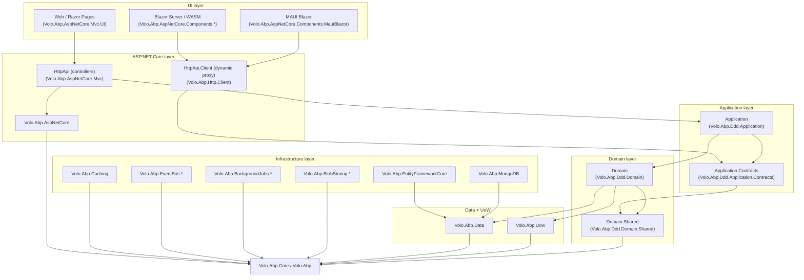
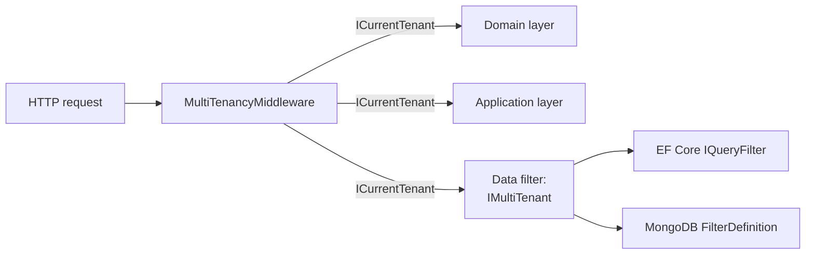
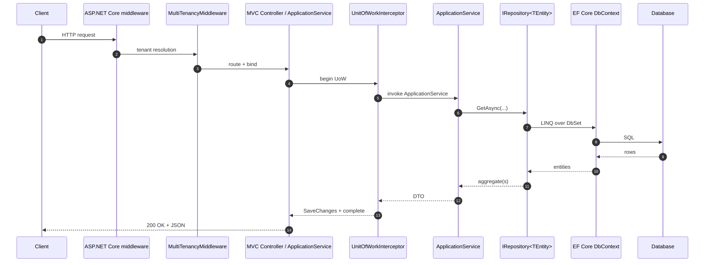

The ABP Framework is an opinionated, modular ASP.NET Core stack distributed as ~169 NuGet packages under `framework/src/`, each shipped as a single `IAbpModule` class plus its types. This page maps those packages onto a clean nine-layer model, shows how the runtime loads them via the `[DependsOn]` graph rooted at `AbpApplicationBase`, and explains the architectural choices — DDD vs single-layer templates, tiered vs non-tiered deployments, and where multi-tenancy slots into the stack.

The starting point for any ABP solution is a startup module type passed into `AbpApplicationFactory.CreateAsync<TStartupModule>(...)` (see `framework/src/Volo.Abp.Core/Volo/Abp/AbpApplicationBase.cs`). From there the `ModuleLoader` in `framework/src/Volo.Abp.Core/Volo/Abp/Modularity/ModuleLoader.cs` walks `[DependsOn(typeof(...))]` attributes, topologically sorts the result, and produces a `IReadOnlyList<IAbpModuleDescriptor>` that drives the rest of bootstrap. Architecturally, every dependency a startup module pulls in belongs to one of the layers described below.

<Note>
  The "nine layers" are not enforced by the compiler — they are conventions
  baked into package names (`Volo.Abp.*.Domain`, `Volo.Abp.*.Application`,
  `Volo.Abp.AspNetCore.*`, …) and `[DependsOn]` graphs. The point of this page
  is to make that convention legible.
</Note>

## The Nine Layers

ABP's logical stack runs from the platform-neutral kernel (`Volo.Abp.Core`) up through DDD building blocks, persistence, infrastructure, ASP.NET Core hosting, and finally UI. Lower layers never reference higher layers — a `*.Domain` package may depend on `Volo.Abp.Ddd.Domain` but never on `Volo.Abp.AspNetCore.Mvc`.

| # | Layer | Package prefix(es) | Source folder | Role |
|---|---|---|---|---|
| 1 | Core runtime | `Volo.Abp.Core`, `Volo.Abp` | `framework/src/Volo.Abp.Core/`, `framework/src/Volo.Abp/` | Modularity, DI, exception handling, options, threading — covered in [/core/overview](/core/overview). |
| 2 | DDD shared kernel | `Volo.Abp.Ddd.Domain.Shared` | `framework/src/Volo.Abp.Ddd.Domain.Shared/` | Enums, constants, error codes shared by all DDD layers. See [/ddd/domain-shared](/ddd/domain-shared). |
| 3 | DDD domain | `Volo.Abp.Ddd.Domain` | `framework/src/Volo.Abp.Ddd.Domain/` | `Entity`, `AggregateRoot<TKey>`, `IRepository<TEntity>`, `DomainService`. See [/ddd/domain-entities-and-aggregates](/ddd/domain-entities-and-aggregates). |
| 4 | Application contracts | `Volo.Abp.Ddd.Application.Contracts` | `framework/src/Volo.Abp.Ddd.Application.Contracts/` | DTOs, app-service interfaces, permissions, features. See [/ddd/application-contracts](/ddd/application-contracts). |
| 5 | Application | `Volo.Abp.Ddd.Application` | `framework/src/Volo.Abp.Ddd.Application/` | `ApplicationService`, `CrudAppService<...>`, object mapping glue. See [/ddd/application-services](/ddd/application-services). |
| 6 | Data + Unit of Work | `Volo.Abp.Data`, `Volo.Abp.Uow` | `framework/src/Volo.Abp.Data/`, `framework/src/Volo.Abp.Uow/` | Connection strings, `IUnitOfWork`, data filters. See [/data/overview](/data/overview). |
| 7 | Infrastructure | `Volo.Abp.EntityFrameworkCore.*`, `Volo.Abp.MongoDB`, `Volo.Abp.Caching*`, `Volo.Abp.EventBus.*`, `Volo.Abp.BackgroundJobs*`, `Volo.Abp.BlobStoring.*` | `framework/src/Volo.Abp.EntityFrameworkCore*/`, `framework/src/Volo.Abp.MongoDB/`, … | Concrete providers for persistence, messaging, scheduling. See [/infrastructure/overview](/infrastructure/overview). |
| 8 | ASP.NET Core | `Volo.Abp.AspNetCore.*` | `framework/src/Volo.Abp.AspNetCore*/` (~40 packages) | Hosting integration, MVC, SignalR, auth, multi-tenancy middleware. See [/aspnetcore/overview](/aspnetcore/overview). |
| 9 | UI | `Volo.Abp.AspNetCore.Mvc.UI.*`, `Volo.Abp.AspNetCore.Components.*`, `Volo.Abp.BlazoriseUI`, `Volo.Abp.Maui.Client` | `framework/src/Volo.Abp.AspNetCore.Mvc.UI*/`, `framework/src/Volo.Abp.AspNetCore.Components.*/` | MVC/Razor, Blazor Server/WASM, MAUI Blazor. See [/ui-mvc/overview](/ui-mvc/overview), [/blazor/overview](/blazor/overview). |

## Dependency Direction

The diagram below shows how a typical ABP solution layers its own packages on top of the framework. Arrows point from "depends on" to "depended upon"; cycles are forbidden by the topological sort in `ModuleLoader.SortByDependency`.



The same shape repeats inside every official module under `modules/`: for example `modules/identity/src/` contains `Volo.Abp.Identity.Domain.Shared`, `Volo.Abp.Identity.Domain`, `Volo.Abp.Identity.Application.Contracts`, `Volo.Abp.Identity.Application`, `Volo.Abp.Identity.HttpApi`, `Volo.Abp.Identity.HttpApi.Client`, `Volo.Abp.Identity.Web`, `Volo.Abp.Identity.Blazor`, `Volo.Abp.Identity.EntityFrameworkCore`, and `Volo.Abp.Identity.MongoDB`. Each of those mirrors a layer slot. See [/modules/identity](/modules/identity) for the full anatomy.

## Module Dependency Rules

ABP enforces composition through the `DependsOnAttribute` defined at `framework/src/Volo.Abp.Core/Volo/Abp/Modularity/DependsOnAttribute.cs`:

```csharp
[AttributeUsage(AttributeTargets.Class, AllowMultiple = true)]
public class DependsOnAttribute : Attribute, IDependedTypesProvider
{
    public Type[] DependedTypes { get; }
    public DependsOnAttribute(params Type[]? dependedTypes) { ... }
    public virtual Type[] GetDependedTypes() => DependedTypes;
}
```

`AbpModuleHelper.FindAllModuleTypes` (in the same folder) walks these attributes recursively starting from the startup module, and `ModuleLoader.SortByDependency` (calling the extension `SortByDependencies`) topologically orders the result so that dependencies are configured before dependents. The deep mechanics live in [/core/modularity-and-modules](/core/modularity-and-modules) and are summarised on [/overview/modularity-model](/overview/modularity-model).

<Warning>
  There is no compiler check that prevents a `*.Domain` project from
  referencing `Volo.Abp.AspNetCore.Mvc`. The discipline is enforced by
  convention, by the per-layer `*.csproj` ProjectReferences in the official
  templates under `templates/app/aspnet-core/src/`, and by ABP Studio
  validations. Crossing layers is technically possible but breaks the
  architectural contract.
</Warning>

## Tiered vs Non-Tiered Deployment

The `templates/app/aspnet-core/src/` folder ships every permutation of "tiered" and "non-tiered" — they share the same `*.Domain` and `*.Application` projects but differ in how the HTTP API, AuthServer, and Web tier are colocated:

| Topology | Projects involved | Trade-off |
|---|---|---|
| **Non-tiered (single deployment)** | `MyCompanyName.MyProjectName.Web` (Razor Pages MVC) hosts both the API and UI. Auth is in-process. | Simplest. One process, one DB connection pool, in-memory auth. |
| **Tiered MVC** | `MyCompanyName.MyProjectName.Web` (UI) + `MyCompanyName.MyProjectName.HttpApi.HostWithIds` (API) + a separate auth host. UI calls API over HTTP. | Allows scaling UI and API independently, but adds latency. |
| **Blazor Server (non-tiered)** | `MyCompanyName.MyProjectName.Blazor.Server` | Server-side rendered Blazor; SignalR circuit. |
| **Blazor Server (tiered)** | `MyCompanyName.MyProjectName.Blazor.Server.Tiered` | Blazor Server + remote API host. |
| **Blazor WebApp (interactive auto)** | `MyCompanyName.MyProjectName.Blazor.WebApp` (+ `.Client`) | .NET 8/9/10 unified Blazor with server + client interactivity. |
| **Blazor WebApp tiered** | `MyCompanyName.MyProjectName.Blazor.WebApp.Tiered` (+ `.Client`) | Same, with remote API host. |
| **Blazor WebAssembly** | `MyCompanyName.MyProjectName.Blazor` + `MyCompanyName.MyProjectName.Blazor.Client` | Standalone WASM SPA against `HttpApi.Host`. |
| **AuthServer split** | `MyCompanyName.MyProjectName.AuthServer` always present in tiered variants | Hosts OpenIddict (see [/modules/openiddict-module](/modules/openiddict-module)). |
| **DbMigrator** | `MyCompanyName.MyProjectName.DbMigrator` | Console app that creates schema + seeds initial data. See [/data/data-seeding](/data/data-seeding). |

In a tiered solution, the Web tier references `Volo.Abp.Http.Client` and `*.HttpApi.Client` instead of `*.Application` directly. The HttpApi.Client projects use ABP's dynamic-proxy system (see [/http/overview](/http/overview)) to expose remote services as if they were local interfaces.

## Single-Layer (`app-nolayers`) vs DDD Layers

ABP also ships an opinion-free template at `templates/app-nolayers/aspnet-core/` that collapses all layers into one project. This is appropriate for small applications, learning, or projects that don't need DDD discipline:

<CardGroup cols={2}>
  <Card title="DDD layered (templates/app)" icon="layer-group">
    Six+ projects per app — Domain.Shared, Domain, Application.Contracts,
    Application, HttpApi, HttpApi.Client, EntityFrameworkCore, Web /
    Blazor / Blazor.Client, DbMigrator. Enforces aggregate isolation and
    DTO boundaries.
  </Card>
  <Card title="Single-layer (templates/app-nolayers)" icon="cube">
    One project per host with entities, app services, controllers, and
    `DbContext` colocated. Faster to prototype but you must pull layers
    back apart manually if the codebase grows.
  </Card>
</CardGroup>

The `ai-rules/template-specific/app-nolayers.mdc` file in `ai-rules/` documents the conventions used by ABP Studio and AI helpers when generating code for the single-layer template, including which `[DependsOn]` modules are pre-wired in the startup module.

## Multi-Tenancy as a Cross-Cutting Concern

Multi-tenancy is implemented in `framework/src/Volo.Abp.MultiTenancy/` (abstractions + core) and `framework/src/Volo.Abp.AspNetCore.MultiTenancy/` (HTTP middleware). It is layered orthogonally to the DDD stack:



`ICurrentTenant` (Volo.Abp.MultiTenancy) is consumed by `IDataFilter<IMultiTenant>` (Volo.Abp.Data) so that `IRepository<TEntity>` queries automatically restrict by `TenantId`. The set of tenant resolvers (header, route, cookie, host) is in `framework/src/Volo.Abp.AspNetCore.MultiTenancy/Volo/Abp/AspNetCore/MultiTenancy/`. Full coverage is in [/multi-tenancy/overview](/multi-tenancy/overview) and [/multi-tenancy/tenant-resolvers](/multi-tenancy/tenant-resolvers).

## How a Request Flows Through the Layers

The diagram below ties the layers to a single HTTP call. The yellow path is what you write; the grey blocks are framework code you compose with `[DependsOn]`.



Each step pins to a real ABP type: the multi-tenancy middleware is `MultiTenancyMiddleware` in `Volo.Abp.AspNetCore.MultiTenancy`; the UoW interceptor is `UnitOfWorkInterceptor` in `Volo.Abp.Uow`; the repository implementation depends on the chosen provider (`EfCoreRepository<T>` in `Volo.Abp.EntityFrameworkCore`, `MongoDbRepository<T>` in `Volo.Abp.MongoDB`). See [/data/unit-of-work](/data/unit-of-work) and [/data/entity-framework-core](/data/entity-framework-core) for the deeper view.

## Why the Layering Pays Off

The layered architecture exists to enable three things ABP cares about:

<Steps>
  <Step title="Pluggable infrastructure">
    Because every infrastructure concern is behind a `Volo.Abp.*.Abstractions`
    package (e.g. `Volo.Abp.Caching` vs `Volo.Abp.Caching.StackExchangeRedis`),
    swapping Redis for an in-memory cache requires only changing the
    `[DependsOn]` of the startup module. See [/infrastructure/caching](/infrastructure/caching).
  </Step>
  <Step title="Module reuse">
    Bringing the [Identity module](/modules/identity) into a brand-new
    solution is a single `[DependsOn(typeof(AbpIdentityDomainModule))]` plus
    a `[DependsOn(typeof(AbpIdentityEntityFrameworkCoreModule))]` — every
    layer is pre-built and follows the same rules.
  </Step>
  <Step title="Microservice or monolith from the same code">
    Because `*.Application` projects expose pure CLR interfaces and
    `*.HttpApi.Client` wraps them as remote proxies, the same client code
    targets either an in-process service or a remote microservice — only
    the `[DependsOn]` in the host changes.
  </Step>
</Steps>

## Where to Go Next

<CardGroup cols={2}>
  <Card title="Repository layout" icon="folder-tree" href="/overview/repository-layout">
    Tour of every top-level folder and a per-cluster breakdown of the 169
    framework packages.
  </Card>
  <Card title="Modularity model" icon="puzzle-piece" href="/overview/modularity-model">
    The seven lifecycle hooks of `AbpModule`, the role of `ServiceConfigurationContext`,
    and plug-in sources.
  </Card>
  <Card title="Solution & build" icon="hammer" href="/overview/solution-and-build">
    How `Directory.Build.props`, `Directory.Packages.props`, `.slnx`,
    `.abpsln`, and `global.json` cooperate; how `build/build-all.ps1` works.
  </Card>
  <Card title="Tech stack" icon="boxes-stacked" href="/overview/tech-stack-and-dependencies">
    Every central package version from `Directory.Packages.props` and the
    Node-side `npm/ng-packs/package.json` requirements.
  </Card>
</CardGroup>
