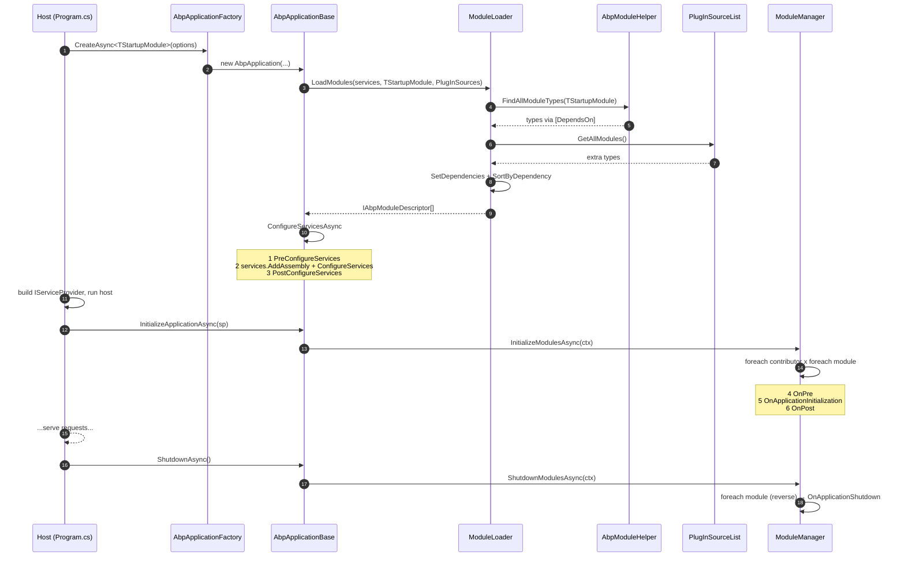

The ABP Framework's plug-in system is built around a single abstract base class — `AbpModule` — and a single attribute — `[DependsOn]`. Every package under `framework/src/` and every reusable module under `modules/` ships exactly one `AbpModule` subclass, and the application boots by topologically walking the `[DependsOn]` graph rooted at a "startup module". This page reads the actual source under `framework/src/Volo.Abp.Core/Volo/Abp/Modularity/` and shows the exact method signatures, the order in which they run, the four lifecycle contributors that fan them out, and the three ways modules can be loaded as runtime plug-ins.

You should already be familiar with the high-level layering covered in [/overview/architecture](/overview/architecture); this page zooms in on the kernel that makes it all hang together. For the runtime details of `AbpApplicationFactory` itself, see [/core/abp-application-and-bootstrap](/core/abp-application-and-bootstrap); for how `AbpModule` integrates with `IServiceCollection`, see [/core/modularity-and-modules](/core/modularity-and-modules).

## The contract — `IAbpModule` and `AbpModule`

The bare minimum that makes something an ABP module is the `IAbpModule` interface in `framework/src/Volo.Abp.Core/Volo/Abp/Modularity/IAbpModule.cs`:

```csharp
public interface IAbpModule
{
    Task ConfigureServicesAsync(ServiceConfigurationContext context);
    void ConfigureServices(ServiceConfigurationContext context);
}
```

In practice nobody implements `IAbpModule` directly — they extend `AbpModule` in `framework/src/Volo.Abp.Core/Volo/Abp/Modularity/AbpModule.cs`. `AbpModule` is declared as:

```csharp
public abstract class AbpModule :
    IAbpModule,
    IOnPreApplicationInitialization,
    IOnApplicationInitialization,
    IOnPostApplicationInitialization,
    IOnApplicationShutdown,
    IPreConfigureServices,
    IPostConfigureServices
```

That set of interfaces enumerates every phase the runtime can call back on. Each has a sync **and** async pair; the default sync override just calls the async one and the default async override calls the sync one and returns `Task.CompletedTask`, so subclasses override whichever flavor is convenient.

The class also exposes:

- `SkipAutoServiceRegistration { get; protected set; }` — when `true`, suppresses the automatic `services.AddAssembly(...)` scan that registers every type in the module's assemblies.
- `ServiceConfigurationContext` — a getter that throws an `AbpException` outside `(Pre|Post)?ConfigureServices(Async)`; this is how `Configure<TOptions>(...)` helpers know which `IServiceCollection` to write to.
- `Configure<TOptions>(...)`, `PreConfigure<TOptions>(...)`, `PostConfigure<TOptions>(...)`, `PostConfigureAll<TOptions>(...)` — wrappers over the matching `IServiceCollection` extensions, scoped to `ServiceConfigurationContext.Services`.
- `static bool IsAbpModule(Type type)` — the predicate (`IsClass && !IsAbstract && !IsGenericType && IAbpModule.IsAssignableFrom`) used by plug-in loaders.
- `internal static void CheckAbpModuleType(Type)` — throws `ArgumentException` when given a non-module.

<Note>
  `SkipAutoServiceRegistration = true` does not skip the module itself — it
  only skips the conventional-DI scan of its assemblies. The module's own
  `ConfigureServices` still runs.
</Note>

## Declaring dependencies — `[DependsOn]`

Dependencies between modules are declared with `Volo.Abp.Modularity.DependsOnAttribute`, located at `framework/src/Volo.Abp.Core/Volo/Abp/Modularity/DependsOnAttribute.cs`:

```csharp
[AttributeUsage(AttributeTargets.Class, AllowMultiple = true)]
public class DependsOnAttribute : Attribute, IDependedTypesProvider
{
    public Type[] DependedTypes { get; }

    public DependsOnAttribute(params Type[]? dependedTypes) =>
        DependedTypes = dependedTypes ?? Type.EmptyTypes;

    public virtual Type[] GetDependedTypes() => DependedTypes;
}
```

A typical usage looks like:

```csharp
[DependsOn(
    typeof(AbpDddDomainModule),
    typeof(AbpEntityFrameworkCoreModule),
    typeof(AbpAutoMapperModule))]
public class MyAppDomainModule : AbpModule
{
    public override void ConfigureServices(ServiceConfigurationContext context)
    {
        // ...
    }
}
```

Because the attribute implements `IDependedTypesProvider`, you can also write your own attribute that derives from `DependsOnAttribute` (e.g. `[DependsOnTheme]`) — `AbpModuleHelper.FindDependedModuleTypes` collects **all** `IDependedTypesProvider` attributes via `GetCustomAttributes().OfType<IDependedTypesProvider>()`, so subclassed attributes are picked up automatically.

A second attribute, `[AdditionalAssembly(...)]` (in the same folder), lets a module pull additional assemblies into its `IAbpModuleDescriptor.AllAssemblies` set without listing them as dependencies — `AbpModuleHelper.GetAllAssemblies` walks `IAdditionalModuleAssemblyProvider` the same way.

## Descriptors — `AbpModuleDescriptor`

When the loader finishes walking the graph it materializes one `AbpModuleDescriptor` per module type. The interface, in `framework/src/Volo.Abp.Core/Volo/Abp/Modularity/IAbpModuleDescriptor.cs`, exposes:

| Member | Type | Purpose |
|---|---|---|
| `Type` | `Type` | The module class. |
| `Assembly` | `Assembly` | The assembly where `Type` is defined. |
| `AllAssemblies` | `Assembly[]` | `Assembly` plus everything from `[AdditionalAssembly]` attributes. |
| `Instance` | `IAbpModule` | The singleton module instance. |
| `IsLoadedAsPlugIn` | `bool` | `true` only when the descriptor came from a `PlugInSource`. |
| `Dependencies` | `IReadOnlyList<IAbpModuleDescriptor>` | Resolved descriptors for each `[DependsOn]` target. |

The concrete `AbpModuleDescriptor` in `AbpModuleDescriptor.cs` validates its inputs with `AbpModule.CheckAbpModuleType(type)` and uses `AbpModuleHelper.GetAllAssemblies(type)` to populate `AllAssemblies`. It also exposes an internal `AddDependency(IAbpModuleDescriptor)` that the loader calls during the second pass; `Dependencies` is returned as an immutable list.

## How modules are discovered — `ModuleLoader`

`framework/src/Volo.Abp.Core/Volo/Abp/Modularity/ModuleLoader.cs` is the entry point that `AbpApplicationBase` calls. Its top-level method is:

```csharp
public IAbpModuleDescriptor[] LoadModules(
    IServiceCollection services,
    Type startupModuleType,
    PlugInSourceList plugInSources)
{
    var modules = GetDescriptors(services, startupModuleType, plugInSources);
    modules = SortByDependency(modules, startupModuleType);
    return modules.ToArray();
}
```

Internally it performs three passes:

<Steps>
  <Step title="FillModules — recursive [DependsOn] walk + plug-ins">
    `AbpModuleHelper.FindAllModuleTypes(startupModuleType, logger)` recursively
    follows `[DependsOn]` from the startup module, logging each loaded module
    at debug level with a depth-based indent. For each discovered `Type`,
    `CreateModuleDescriptor(services, moduleType)` calls
    `Activator.CreateInstance(moduleType)`, registers the instance as a
    singleton (`services.AddSingleton(moduleType, module)`), and creates the
    `AbpModuleDescriptor`.

    Then `plugInSources.GetAllModules(logger)` is iterated; any module **not
    already** in the list is added with `isLoadedAsPlugIn: true`.
  </Step>
  <Step title="SetDependencies — second pass to fill descriptors">
    For every collected `AbpModuleDescriptor`, the loader calls
    `AbpModuleHelper.FindDependedModuleTypes(module.Type)` and resolves each
    depended type back to a descriptor in the same list. If a dependency is
    missing the loader throws `AbpException("Could not find a depended
    module ...")`.
  </Step>
  <Step title="SortByDependency — topological sort">
    `modules.SortByDependencies(m => m.Dependencies)` produces a flat list
    where every module appears after its dependencies. Finally,
    `sortedModules.MoveItem(m => m.Type == startupModuleType, modules.Count - 1)`
    moves the startup module to the very end — so its `ConfigureServices`
    runs last and can override anything its dependencies registered.
  </Step>
</Steps>

The result is exposed on `IAbpApplication.Modules` (`IReadOnlyList<IAbpModuleDescriptor>`) and consumed by `AbpApplicationBase.ConfigureServices` and `ModuleManager.InitializeModulesAsync`.

## Plug-in sources

The third argument to `LoadModules` is a `PlugInSourceList` built from `AbpApplicationCreationOptions.PlugInSources`. The framework ships three concrete sources in `framework/src/Volo.Abp.Core/Volo/Abp/Modularity/PlugIns/`:

| Source | File | Behavior |
|---|---|---|
| `TypePlugInSource` | `PlugIns/TypePlugInSource.cs` | Accepts `params Type[]` directly — the simplest form. |
| `FilePlugInSource` | `PlugIns/FilePlugInSource.cs` | Calls `AssemblyLoadContext.Default.LoadFromAssemblyPath(path)` for each `.dll` and scans for `IsAbpModule(type)`. |
| `FolderPlugInSource` | `PlugIns/FolderPlugInSource.cs` | Scans a folder via `AssemblyHelper.GetAssemblyFiles(Folder, SearchOption)`, optionally with a `Filter`. Default `SearchOption` is `TopDirectoryOnly`. |

A solution typically wires one of these in `Program.cs`:

```csharp
var application = await AbpApplicationFactory.CreateAsync<MyAppHostModule>(options =>
{
    options.PlugInSources.AddFolder(Path.Combine(AppContext.BaseDirectory, "PlugIns"));
});
```

Plug-in modules end up in the descriptor list with `IsLoadedAsPlugIn = true`, which user code can inspect via `IModuleContainer.Modules` if it needs to differentiate them. They are otherwise indistinguishable from compile-time `[DependsOn]` modules — they participate in the same topological sort.

<Tip>
  Plug-ins are appended **after** static modules in `FillModules`, but
  `SortByDependency` then re-orders the merged set. So a plug-in module that
  declares `[DependsOn(typeof(AbpAuditingModule))]` is guaranteed to run after
  `AbpAuditingModule`, even though it was added later.
</Tip>

## Lifecycle phases

`AbpModule` implements seven phases. They are not all in a single method — they are dispatched in two big stages by `AbpApplicationBase`: a synchronous *configure* stage in the constructor and an *initialize* stage triggered after the host has built its `IServiceProvider`.

### ConfigureServices stage

`AbpApplicationBase.ConfigureServicesAsync()` (in `framework/src/Volo.Abp.Core/Volo/Abp/AbpApplicationBase.cs`) runs three nested loops over `Modules`:

```csharp
// PreConfigureServices
foreach (var module in Modules.Where(m => m.Instance is IPreConfigureServices))
    await ((IPreConfigureServices)module.Instance).PreConfigureServicesAsync(context);

// ConfigureServices (also calls services.AddAssembly per module assembly
// unless SkipAutoServiceRegistration is true)
foreach (var module in Modules)
    await module.Instance.ConfigureServicesAsync(context);

// PostConfigureServices
foreach (var module in Modules.Where(m => m.Instance is IPostConfigureServices))
    await ((IPostConfigureServices)module.Instance).PostConfigureServicesAsync(context);
```

Each loop catches exceptions and rethrows them as `AbpInitializationException` with the offending module type printed in the message — so a stack trace always tells you *which* module's `ConfigureServices` failed.

Method signatures from `AbpModule.cs`:

```csharp
public virtual Task PreConfigureServicesAsync(ServiceConfigurationContext context);
public virtual void PreConfigureServices(ServiceConfigurationContext context);
public virtual Task ConfigureServicesAsync(ServiceConfigurationContext context);
public virtual void ConfigureServices(ServiceConfigurationContext context);
public virtual Task PostConfigureServicesAsync(ServiceConfigurationContext context);
public virtual void PostConfigureServices(ServiceConfigurationContext context);
```

Between the three loops, the `ServiceConfigurationContext` reference is set on every module before the loops run, then nulled out after `PostConfigureServices` so calling `Configure<TOptions>(...)` outside the configure stage throws.

### Initialize stage

After the host has built the DI container, the app calls `InitializeApplicationAsync(IServiceProvider)` which delegates to `ModuleManager.InitializeModulesAsync(ApplicationInitializationContext)`. `ModuleManager` (`framework/src/Volo.Abp.Core/Volo/Abp/Modularity/ModuleManager.cs`) does **not** know about the phases directly — it iterates over a configured list of `IModuleLifecycleContributor`:

```csharp
foreach (var contributor in _lifecycleContributors)
    foreach (var module in _moduleContainer.Modules)
        await contributor.InitializeAsync(context, module.Instance);
```

The default contributor list is registered in `framework/src/Volo.Abp.Core/Volo/Abp/Internal/InternalServiceCollectionExtensions.cs`:

```csharp
services.Configure<AbpModuleLifecycleOptions>(options =>
{
    options.Contributors.Add<OnPreApplicationInitializationModuleLifecycleContributor>();
    options.Contributors.Add<OnApplicationInitializationModuleLifecycleContributor>();
    options.Contributors.Add<OnPostApplicationInitializationModuleLifecycleContributor>();
    options.Contributors.Add<OnApplicationShutdownModuleLifecycleContributor>();
});
```

Each contributor (defined in `framework/src/Volo.Abp.Core/Volo/Abp/Modularity/DefaultModuleLifecycleContributor.cs`) is a no-op unless the module implements the matching interface. Method signatures called per module:

```csharp
public virtual Task OnPreApplicationInitializationAsync(ApplicationInitializationContext context);
public virtual void OnPreApplicationInitialization(ApplicationInitializationContext context);
public virtual Task OnApplicationInitializationAsync(ApplicationInitializationContext context);
public virtual void OnApplicationInitialization(ApplicationInitializationContext context);
public virtual Task OnPostApplicationInitializationAsync(ApplicationInitializationContext context);
public virtual void OnPostApplicationInitialization(ApplicationInitializationContext context);
public virtual Task OnApplicationShutdownAsync(ApplicationShutdownContext context);
public virtual void OnApplicationShutdown(ApplicationShutdownContext context);
```

Because `ModuleManager` loops modules **inside** the contributor loop, *every module's* `OnPreApplicationInitialization` runs before *any module's* `OnApplicationInitialization`. That is the lever you use when you need cross-module ordering of post-boot work.

### Shutdown

`AbpApplicationBase.ShutdownAsync()` calls `ModuleManager.ShutdownModulesAsync(ApplicationShutdownContext)`. The manager reverses the module list (`_moduleContainer.Modules.Reverse()`) so dependencies tear down before dependents, then runs the single `OnApplicationShutdownModuleLifecycleContributor`.

## Full lifecycle summary

| Phase | Triggered by | Iterates | Method on `AbpModule` | Typical use |
|---|---|---|---|---|
| 1 | `AbpApplicationBase.ConfigureServicesAsync` | All modules implementing `IPreConfigureServices` | `PreConfigureServices(Async)` | Call `PreConfigure<TOptions>` to influence later modules (e.g. `AbpAspNetCoreMvcOptions`). |
| 2 | same | All modules (and `services.AddAssembly` per module assembly) | `ConfigureServices(Async)` | The bulk of registration — `Configure<TOptions>(...)`, `context.Services.Add...`. |
| 3 | same | All modules implementing `IPostConfigureServices` | `PostConfigureServices(Async)` | Last-chance overrides; runs after every other module's `ConfigureServices`. |
| 4 | `ModuleManager.InitializeModulesAsync` via `OnPreApplicationInitializationModuleLifecycleContributor` | All modules implementing `IOnPreApplicationInitialization` | `OnPreApplicationInitialization(Async)` | Resolve singletons before middleware wires up (e.g. pre-warm caches). |
| 5 | same, `OnApplicationInitializationModuleLifecycleContributor` | All modules implementing `IOnApplicationInitialization` | `OnApplicationInitialization(Async)` | The standard place to call `app.UseAbpRequestLocalization()`, `app.UseRouting()`, etc. on `context.GetApplicationBuilder()`. |
| 6 | same, `OnPostApplicationInitializationModuleLifecycleContributor` | All modules implementing `IOnPostApplicationInitialization` | `OnPostApplicationInitialization(Async)` | Logging banners, last-chance announcements. |
| 7 | `AbpApplicationBase.ShutdownAsync` via `OnApplicationShutdownModuleLifecycleContributor` | Modules in **reverse** dependency order, implementing `IOnApplicationShutdown` | `OnApplicationShutdown(Async)` | Flush queues, close connections. |

## Startup sequence diagram

The diagram below traces a single startup call through the runtime.



## A worked example

Assume a startup module `MyAppHostModule` declares:

```csharp
[DependsOn(
    typeof(AbpAspNetCoreMvcModule),
    typeof(AbpAutofacModule),
    typeof(MyAppApplicationModule))]
public class MyAppHostModule : AbpModule { ... }

[DependsOn(
    typeof(AbpDddApplicationModule),
    typeof(MyAppDomainModule))]
public class MyAppApplicationModule : AbpModule { ... }

[DependsOn(
    typeof(AbpDddDomainModule),
    typeof(AbpEntityFrameworkCoreModule))]
public class MyAppDomainModule : AbpModule { ... }
```

`AbpModuleHelper.FindAllModuleTypes(typeof(MyAppHostModule))` returns (depth-first, in order of discovery): `MyAppHostModule, AbpAspNetCoreMvcModule, ..., AbpAutofacModule, ..., MyAppApplicationModule, AbpDddApplicationModule, ..., MyAppDomainModule, AbpDddDomainModule, AbpEntityFrameworkCoreModule, ...`.

Then `SortByDependency` produces a flat list where each module appears after its dependencies; finally `MoveItem` shoves `MyAppHostModule` to the last slot. So the resulting `IAbpModuleDescriptor[]` order is:

```
[AbpCoreModule (transitive root), …, AbpDddDomainModule, AbpEntityFrameworkCoreModule,
 MyAppDomainModule, AbpDddApplicationModule, MyAppApplicationModule,
 AbpAutofacModule, AbpAspNetCoreMvcModule, …, MyAppHostModule]
```

This is exactly the order in which `ConfigureServices`, `OnApplicationInitialization`, etc. will run. The reverse of this list runs during shutdown.

## Lifecycle interfaces — interface-only vs `AbpModule`

You can implement the lifecycle interfaces directly without inheriting from `AbpModule` — `IPreConfigureServices`, `IPostConfigureServices`, `IOnPreApplicationInitialization`, `IOnApplicationInitialization`, `IOnPostApplicationInitialization`, `IOnApplicationShutdown` are all standalone. `AbpModule` implements all of them with empty virtual methods so subclasses only override what they need.

`ModuleManager` uses **`is`-pattern matching** (`if (module is IOnApplicationInitialization onAppInit)`) so a non-`AbpModule` class that implements only `IAbpModule` + `IOnApplicationInitialization` is fully supported.

<Warning>
  Don't put service registrations in `OnApplicationInitialization` — by then
  the DI container is built and `IServiceCollection` is frozen. Use
  `ConfigureServices` / `PostConfigureServices` instead.
</Warning>

## Auto service registration

When a module's `ConfigureServices` is about to run, `AbpApplicationBase` calls:

```csharp
if (!abpModule.SkipAutoServiceRegistration)
    foreach (var assembly in module.AllAssemblies)
        Services.AddAssembly(assembly);
```

`Services.AddAssembly` walks every public type in the assembly, inspects DI marker interfaces (`ITransientDependency`, `IScopedDependency`, `ISingletonDependency`) and `[Dependency]` / `[ExposeServices]` attributes, and registers each type accordingly. This is the engine behind ABP's "convention over configuration" registration — see [/core/dependency-injection](/core/dependency-injection).

Setting `SkipAutoServiceRegistration = true` is rare; it's used by `Volo.Abp.AspNetCore.TestBase` and a few packages that need fully manual control.

## Module options classes

ABP exposes a handful of mutable options classes around the lifecycle, all in `framework/src/Volo.Abp.Core/Volo/Abp/Modularity/`:

| Options | Used at | Purpose |
|---|---|---|
| `AbpApplicationCreationOptions` | `AbpApplicationFactory.CreateAsync<T>(o => …)` | Carry `ApplicationName`, `Environment`, `PlugInSources`, `SkipConfigureServices`, etc. |
| `ServiceConfigurationContext` | The `(Pre|Post)?ConfigureServices` phase | Wraps the `IServiceCollection` and a per-context `Items` dictionary that modules can use to pass data sideways. |
| `ApplicationInitializationContext` | All four initialize/shutdown phases | Wraps the scoped `IServiceProvider`; call `context.GetApplicationBuilder()` to get an `IApplicationBuilder`. |
| `ApplicationShutdownContext` | `OnApplicationShutdown(Async)` | Wraps the scoped `IServiceProvider`. |
| `AbpModuleLifecycleOptions` | Bootstrap (internal) | Holds the ordered `ITypeList<IModuleLifecycleContributor>` driving `ModuleManager`. Custom contributors are added here. |

## Custom lifecycle contributors

Because `ModuleManager` is driven by `AbpModuleLifecycleOptions.Contributors`, you can inject your own phase. A custom contributor implements `IModuleLifecycleContributor` (or extends `ModuleLifecycleContributorBase`); register it with:

```csharp
public override void PreConfigureServices(ServiceConfigurationContext context)
{
    context.Services.Configure<AbpModuleLifecycleOptions>(options =>
    {
        options.Contributors.Add<MyOnReadyContributor>();
    });
}
```

The contributor's `InitializeAsync` will then be called for every module in dependency order, after the four default phases. This is a power-user feature primarily exercised by internal infrastructure modules.

## Inspecting the module graph at runtime

The application exposes `IModuleContainer` (implemented by `AbpApplicationBase`) — inject it to enumerate descriptors:

```csharp
public class WhoLoadedYou
{
    public WhoLoadedYou(IModuleContainer modules)
    {
        foreach (var m in modules.Modules)
        {
            // m.Type, m.Instance, m.Dependencies, m.IsLoadedAsPlugIn
        }
    }
}
```

The ABP CLI's `abp list-modules` command and ABP Studio's "Solution Explorer → Modules" tab both consume this surface.

## Common pitfalls

| Symptom | Likely cause | Fix |
|---|---|---|
| `AbpException: Could not find a depended module ...` thrown at startup. | A `[DependsOn]` references a type that isn't loaded by any other path. | Add the depended module to the startup module's `[DependsOn]` so it joins `FindAllModuleTypes`. |
| `AbpException: ServiceConfigurationContext is only available in ...` | You called `Configure<TOptions>` from `OnApplicationInitialization`. | Move it to `ConfigureServices`. |
| `AbpInitializationException` wrapping `InvalidCastException` in `ConfigureServices`. | Two modules registered the same `IOptions<T>` differently and the second overwrote the first. | Use `PostConfigureServices` or `Configure<TOptions>` ordering — modules later in the topological sort override earlier ones. |
| A plug-in module never runs `ConfigureServices`. | `PlugInSources` was empty or pointed at a folder with no matching DLLs. | Verify `FolderPlugInSource.Folder` and the file filter; check `AbpModule.IsAbpModule(type)` accepts the type. |
| Singleton registered in a plug-in module isn't visible to non-plugin modules. | The plug-in's assembly hadn't been added before `services.AddAssembly` walked the non-plug-in module. | Plug-in modules are appended to the descriptor list and then sorted — their `ConfigureServices` will run before any module that depends on them. If the consuming module *doesn't* depend on the plug-in, you must resolve via service-locator at runtime. |

<Tip>
  When debugging boot order, set the log level for `Volo.Abp.AbpApplicationBase`
  to `Debug` — `AbpModuleHelper.FindAllModuleTypes` writes one indented log
  line per module so you see the full graph.
</Tip>

## Related wiki pages

- [/core/abp-application-and-bootstrap](/core/abp-application-and-bootstrap) — full walk-through of `AbpApplicationFactory` and `AbpApplicationBase`.
- [/core/modularity-and-modules](/core/modularity-and-modules) — practical guide to writing your own `AbpModule`.
- [/core/dependency-injection](/core/dependency-injection) — what `services.AddAssembly` does for each module.
- [/overview/architecture](/overview/architecture) — the nine logical layers that `[DependsOn]` graphs end up forming.
- [/overview/repository-layout](/overview/repository-layout) — where every `AbpModule` subclass lives on disk.
- [/modules/overview](/modules/overview) — how the modules in `modules/` declare their dependencies.
