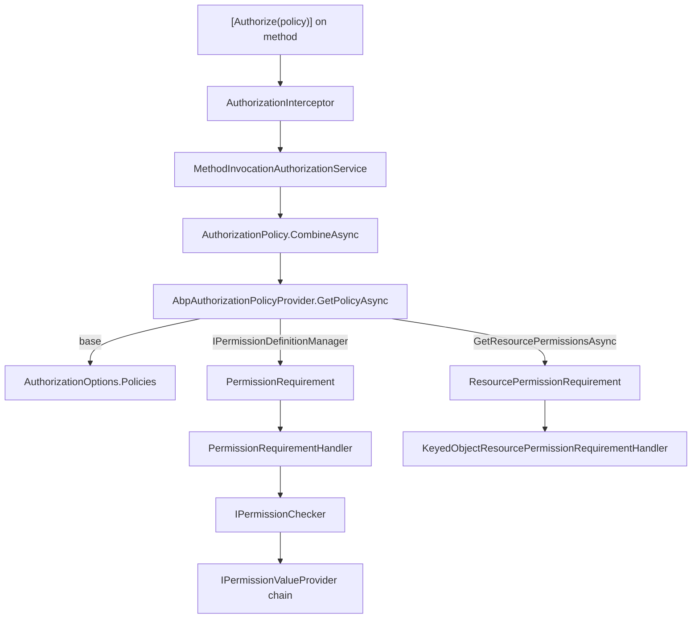

The ABP Framework authorization pipeline lives in two packages — `Volo.Abp.Authorization.Abstractions` (contracts) and `Volo.Abp.Authorization` (implementation) — and layers a permission system on top of ASP.NET Core's `Microsoft.AspNetCore.Authorization` primitives. This page walks through `AbpAuthorizationModule` startup wiring, the dynamic-proxy `AuthorizationInterceptor`, how `AbpAuthorizationPolicyProvider` synthesizes policies from permission definitions, and how `PermissionRequirementHandler` flows through `IPermissionChecker`. Companion pages cover permission definitions ([Permissions](/security/permissions)) and the [Security Abstractions](/security/security-abstractions) that supply the `ClaimsPrincipal`.

## Module wiring

Module `AbpAuthorizationModule` in `framework/src/Volo.Abp.Authorization/Volo/Abp/Authorization/AbpAuthorizationModule.cs` is the entry point. It depends on `AbpAuthorizationAbstractionsModule`, `AbpSecurityModule`, `AbpLocalizationModule`, and `AbpMultiTenancyModule`, and runs two phases of registration.

In `PreConfigureServices` the module hooks `IServiceCollection.OnRegistered` to two callbacks:

```csharp
public override void PreConfigureServices(ServiceConfigurationContext context)
{
    context.Services.OnRegistered(AuthorizationInterceptorRegistrar.RegisterIfNeeded);
    AutoAddDefinitionProviders(context.Services);
}
```

The first callback wires the `AuthorizationInterceptor` into every type whose class or any method is decorated with `AuthorizeAttribute` (see `AuthorizationInterceptorRegistrar.cs`). The second scans every registered service and adds any `IPermissionDefinitionProvider` implementation to `AbpPermissionOptions.DefinitionProviders` — this is how permission providers get auto-discovered without explicit `Configure<>` calls.

In `ConfigureServices` the module calls `context.Services.AddAuthorizationCore()` to register the standard ASP.NET Core authorization services, then registers two `IAuthorizationHandler` singletons: `PermissionRequirementHandler` and `PermissionsRequirementHandler`. It also `TryAddTransient<DefaultAuthorizationPolicyProvider>()` so that the framework's own `AbpAuthorizationPolicyProvider` (registered automatically by `[Dependency]`) has a base policy provider to delegate to.

```csharp
context.Services.AddAuthorizationCore();
context.Services.AddKeyedObjectResourcePermissionAuthorization();
context.Services.AddSingleton<IAuthorizationHandler, PermissionRequirementHandler>();
context.Services.AddSingleton<IAuthorizationHandler, PermissionsRequirementHandler>();
context.Services.TryAddTransient<DefaultAuthorizationPolicyProvider>();
```

The same method configures `AbpPermissionOptions` with three built-in `IPermissionValueProvider` types — `UserPermissionValueProvider`, `RolePermissionValueProvider`, `ClientPermissionValueProvider` — plus their resource counterparts. Those provider chains are covered in detail on the [Permissions](/security/permissions) page.

## The `AbpAuthorizationOptions` surface

ABP does not introduce a separate `AbpAuthorizationOptions`; instead it reuses ASP.NET Core's `AuthorizationOptions` (set up through `AddAuthorizationCore`) and adds an orthogonal `AbpPermissionOptions` for permission-specific configuration. That class lives at `framework/src/Volo.Abp.Authorization.Abstractions/Volo/Abp/Authorization/Permissions/AbpPermissionOptions.cs`:

```csharp
public class AbpPermissionOptions
{
    public ITypeList<IPermissionDefinitionProvider> DefinitionProviders { get; }
    public ITypeList<IPermissionValueProvider> ValueProviders { get; }
    public ITypeList<IResourcePermissionValueProvider> ResourceValueProviders { get; }
    public HashSet<string> DeletedPermissions { get; }
    public HashSet<string> DeletedPermissionGroups { get; }
}
```

| Property | Purpose |
| --- | --- |
| `DefinitionProviders` | `IPermissionDefinitionProvider` types that produce `PermissionDefinition`s at startup |
| `ValueProviders` | Ordered chain that resolves an effective grant for a permission name |
| `ResourceValueProviders` | Same idea, scoped to resource permissions (object-level checks) |
| `DeletedPermissions` | Names removed by post-define hooks; the checker treats them as undefined |
| `DeletedPermissionGroups` | Names of whole groups to drop after providers have run |

`DeletedPermissions` and `DeletedPermissionGroups` exist so a downstream module (or app) can sanitize the merged definition set without rewriting upstream providers — useful when a base module exposes a permission you don't want in your app.

## The `AuthorizationInterceptor`

ABP wraps every service that uses `[Authorize]` in a dynamic proxy. The interceptor at `framework/src/Volo.Abp.Authorization/Volo/Abp/Authorization/AuthorizationInterceptor.cs` is small but important:

```csharp
public class AuthorizationInterceptor : AbpInterceptor, ITransientDependency
{
    private readonly IMethodInvocationAuthorizationService _methodInvocationAuthorizationService;

    public AuthorizationInterceptor(IMethodInvocationAuthorizationService methodInvocationAuthorizationService)
    {
        _methodInvocationAuthorizationService = methodInvocationAuthorizationService;
    }

    public override async Task InterceptAsync(IAbpMethodInvocation invocation)
    {
        await AuthorizeAsync(invocation);
        await invocation.ProceedAsync();
    }

    protected virtual async Task AuthorizeAsync(IAbpMethodInvocation invocation)
    {
        await _methodInvocationAuthorizationService.CheckAsync(
            new MethodInvocationAuthorizationContext(invocation.Method));
    }
}
```

The interceptor runs *before* the wrapped method. If `CheckAsync` throws (because the policy was not satisfied), the actual method body never executes — this is the mechanism that makes `[Authorize]` work on `IApplicationService` calls outside the MVC pipeline (for example, from background workers, gRPC, or direct DI resolution).

`AuthorizationInterceptorRegistrar.RegisterIfNeeded` in the same folder decides which types to intercept. It runs at service-registration time and inspects the `ImplementationType`:

```csharp
private static bool ShouldIntercept(Type type)
{
    return !DynamicProxyIgnoreTypes.Contains(type) &&
           (type.IsDefined(typeof(AuthorizeAttribute), true) ||
            AnyMethodHasAuthorizeAttribute(type));
}
```

Any type that has `[Authorize]` at the class level or on *any* method (public or non-public) is registered with `context.Interceptors.TryAdd<AuthorizationInterceptor>()`. The `[Authorize]` attribute therefore works the same way on every service ABP resolves, not only on MVC controllers.

<Tip>
You can opt a service out of interception by adding it to `DynamicProxyIgnoreTypes` or by replacing the policy resolution with `IAlwaysAllowAuthorizationService` in tests (see `framework/src/Volo.Abp.Authorization.Abstractions/Volo/Abp/Authorization/AlwaysAllowAuthorizationService.cs`).
</Tip>

## `IMethodInvocationAuthorizationService`

Defined in `framework/src/Volo.Abp.Authorization.Abstractions/Volo/Abp/Authorization/IMethodInvocationAuthorizationService.cs`, the contract is a single method:

```csharp
public interface IMethodInvocationAuthorizationService
{
    Task CheckAsync(MethodInvocationAuthorizationContext context);
}
```

The default implementation in `framework/src/Volo.Abp.Authorization/Volo/Abp/Authorization/MethodInvocationAuthorizationService.cs` performs three steps:

1. Bail out early if `[AllowAnonymous]` is present (it implements `IAllowAnonymous`).
2. Collect every `IAuthorizeData` attribute on the method and (if the method is public) on its declaring type, and union them.
3. Use `AuthorizationPolicy.CombineAsync(provider, attributes)` to merge those `IAuthorizeData` instances into one policy, then call `IAbpAuthorizationService.CheckAsync(policy)` which throws on failure.

```csharp
public virtual async Task CheckAsync(MethodInvocationAuthorizationContext context)
{
    if (AllowAnonymous(context)) return;

    var authorizationPolicy = await AuthorizationPolicy.CombineAsync(
        _abpAuthorizationPolicyProvider,
        GetAuthorizationDataAttributes(context.Method));

    if (authorizationPolicy == null) return;

    await _abpAuthorizationService.CheckAsync(authorizationPolicy);
}
```

`MethodInvocationAuthorizationContext` (in the abstractions package) only carries a `MethodInfo` — no `IServiceProvider`, no claims principal — because the authorization service resolves the principal through `ICurrentPrincipalAccessor` (see [Security Abstractions](/security/security-abstractions)).

## `AbpAuthorizationPolicyProvider`

`framework/src/Volo.Abp.Authorization/Volo/Abp/Authorization/AbpAuthorizationPolicyProvider.cs` is what makes `[Authorize("MyApp.Books.Create")]` work *without* registering a policy in `Startup`. It extends `DefaultAuthorizationPolicyProvider` and overrides `GetPolicyAsync`:

```csharp
public override async Task<AuthorizationPolicy?> GetPolicyAsync(string policyName)
{
    var policy = await base.GetPolicyAsync(policyName);
    if (policy != null) return policy;

    var permission = await _permissionDefinitionManager.GetOrNullAsync(policyName);
    if (permission != null)
    {
        var policyBuilder = new AuthorizationPolicyBuilder(Array.Empty<string>());
        policyBuilder.Requirements.Add(new PermissionRequirement(policyName));
        return policyBuilder.Build();
    }

    if ((await _permissionDefinitionManager.GetResourcePermissionsAsync())
        .Any(x => x.Name == policyName))
    {
        var policyBuilder = new AuthorizationPolicyBuilder(Array.Empty<string>());
        policyBuilder.Requirements.Add(new ResourcePermissionRequirement(policyName));
        return policyBuilder.Build();
    }

    return null;
}
```

The resolution order is:

1. Look in the regular `AuthorizationOptions.Policies` (anything you added explicitly via `AddPolicy(...)`).
2. Look in `IPermissionDefinitionManager` — if there's a `PermissionDefinition` with that name, manufacture a one-off policy with a single `PermissionRequirement`.
3. Look in the resource-permission set — if it matches, use `ResourcePermissionRequirement` instead.
4. Otherwise return `null`, which causes ASP.NET Core to throw "the AuthorizationPolicy named '…' was not found".



The provider also exposes `GetPoliciesNamesAsync` which unions explicit policy names with every permission name returned by `IPermissionDefinitionManager.GetPermissionsAsync` — this is what client/UI code uses when it wants the list of permissions to render an admin tree.

## `PermissionRequirement` and its handler

`framework/src/Volo.Abp.Authorization.Abstractions/Volo/Abp/Authorization/PermissionRequirement.cs` is a thin wrapper around a permission name:

```csharp
public class PermissionRequirement : IAuthorizationRequirement
{
    public string PermissionName { get; }

    public PermissionRequirement([NotNull] string permissionName)
    {
        Check.NotNull(permissionName, nameof(permissionName));
        PermissionName = permissionName;
    }

    public override string ToString() => $"PermissionRequirement: {PermissionName}";
}
```

`PermissionRequirementHandler` (same folder) is equally tight — it calls `IPermissionChecker.IsGrantedAsync(context.User, requirement.PermissionName)` and either calls `context.Succeed(requirement)` or does nothing (which leaves the requirement unmet and the policy fails).

```csharp
protected override async Task HandleRequirementAsync(
    AuthorizationHandlerContext context,
    PermissionRequirement requirement)
{
    if (await _permissionChecker.IsGrantedAsync(context.User, requirement.PermissionName))
    {
        context.Succeed(requirement);
    }
}
```

Because the handler receives the `ClaimsPrincipal` from `AuthorizationHandlerContext.User`, it works both for ASP.NET Core HTTP requests (where `User` is `HttpContext.User`) and for non-HTTP code paths where `MethodInvocationAuthorizationService` evaluates the policy through `IAbpAuthorizationService` (the principal then comes from `ICurrentPrincipalAccessor`).

## `IAbpAuthorizationService`

The contract in `framework/src/Volo.Abp.Authorization.Abstractions/Volo/Abp/Authorization/IAbpAuthorizationService.cs` extends `IAuthorizationService` with two additions:

```csharp
public interface IAbpAuthorizationService : IAuthorizationService, IServiceProviderAccessor
{
    ClaimsPrincipal CurrentPrincipal { get; }
}
```

The default implementation `AbpAuthorizationService` (registered with `[Dependency(ReplaceServices = true)]`) extends `DefaultAuthorizationService` and pulls the current principal from `ICurrentPrincipalAccessor`:

```csharp
[Dependency(ReplaceServices = true)]
public class AbpAuthorizationService : DefaultAuthorizationService, IAbpAuthorizationService, ITransientDependency
{
    public ClaimsPrincipal CurrentPrincipal => _currentPrincipalAccessor.Principal;
    public IServiceProvider ServiceProvider { get; }
    // ...
}
```

This replacement is critical: it means that even when there's no `HttpContext` (e.g. inside an `IBackgroundJob`), calls like `_authorizationService.CheckAsync(policy)` will still find the right user — the principal that `ICurrentPrincipalAccessor` is currently scoped to. See the [Security Abstractions](/security/security-abstractions) page for the full principal-accessor story.

### Test-only replacements

`framework/src/Volo.Abp.Authorization.Abstractions/Volo/Abp/Authorization/AlwaysAllowAuthorizationService.cs` and `AlwaysAllowMethodInvocationAuthorizationService.cs` both `Succeed` unconditionally. Wire them up in test modules to bypass authorization without rewiring the production permission system:

```csharp
context.Services.Replace(
    ServiceDescriptor.Transient<IAbpAuthorizationService, AlwaysAllowAuthorizationService>());
```

## Error model

`AbpAuthorizationErrorCodes` (under `framework/src/Volo.Abp.Authorization/Volo/Abp/Authorization/`) defines stable string codes for the localized exceptions. The `Configure<AbpExceptionLocalizationOptions>` call in `AbpAuthorizationModule` maps the `Volo.Authorization` namespace to `AbpAuthorizationResource`, so failed checks raise exceptions that the exception filter can localize using messages from `Volo/Abp/Authorization/Localization/*.json` (embedded via the `AbpVirtualFileSystemOptions` registration).

## How everything composes

The full pipeline for a single attribute-based check looks like this:

| Step | Component | File |
| --- | --- | --- |
| 1 | Service registered with `[Authorize]` | user code |
| 2 | `AuthorizationInterceptorRegistrar` attaches interceptor | `AuthorizationInterceptorRegistrar.cs` |
| 3 | `AuthorizationInterceptor.InterceptAsync` runs before the method | `AuthorizationInterceptor.cs` |
| 4 | `IMethodInvocationAuthorizationService.CheckAsync` builds policy | `MethodInvocationAuthorizationService.cs` |
| 5 | `AbpAuthorizationPolicyProvider.GetPolicyAsync` synthesizes from permission definitions | `AbpAuthorizationPolicyProvider.cs` |
| 6 | `AbpAuthorizationService.CheckAsync` evaluates against `CurrentPrincipal` | `AbpAuthorizationService.cs` |
| 7 | `PermissionRequirementHandler` calls `IPermissionChecker` | `PermissionRequirementHandler.cs` |
| 8 | Provider chain (`User → Role → Client`) consults `IPermissionStore` | see [Permissions](/security/permissions) |

This is also the order in which to read the code if you're debugging an unexpected `AbpAuthorizationException`.

## Related modules

The `permission-management` application module supplies the EF Core / MongoDB `IPermissionStore` implementation used in step 8 (see [Permission Management module](/modules/permission-management)). The `identity` module ([Identity module](/modules/identity)) provides the roles and users whose claims the value providers inspect. Multi-tenancy ([Multi-tenancy overview](/multi-tenancy/overview)) feeds `MultiTenancySides` into `PermissionDefinition.MultiTenancySide` so that the same permission can be host-only, tenant-only, or both. For HTTP, the [JWT Bearer integration](/aspnetcore/jwt-bearer-auth) is what populates `HttpContext.User` and ultimately `ICurrentPrincipalAccessor.Principal` before this whole pipeline runs.

<Note>
The interceptor-based authorization is orthogonal to MVC's filter-based authorization. Both apply: MVC's `AuthorizeFilter` runs first (at the action-execution boundary), and the interceptor runs second when the controller method delegates to an `IApplicationService`. They share the same `AbpAuthorizationPolicyProvider`, so a single permission name works at both layers without configuration.
</Note>
