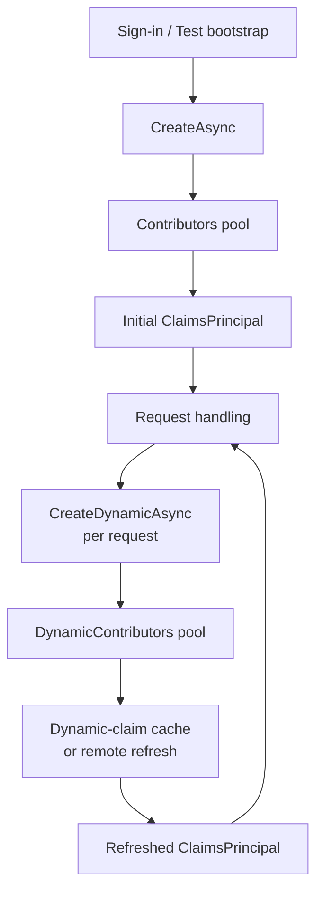
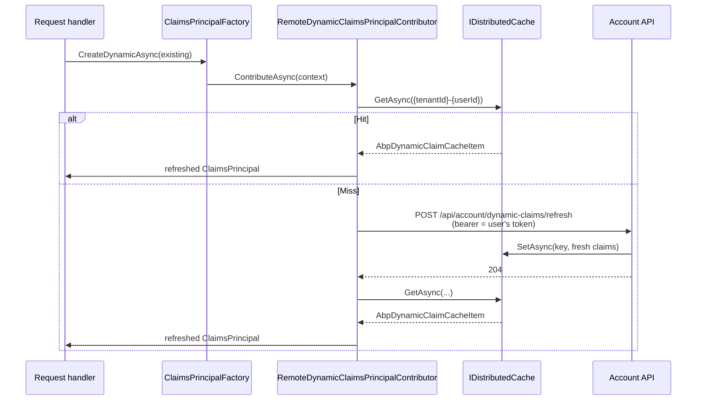

`Volo.Abp.Security.Claims` is the ABP Framework's pluggable identity assembly. Whenever the framework needs a `ClaimsPrincipal` — for tests, for system tenants, after a JWT round-trip — it calls `IAbpClaimsPrincipalFactory`, which walks a list of `IAbpClaimsPrincipalContributor` types from `AbpClaimsPrincipalFactoryOptions`. The "dynamic" variant of that pipeline solves a different problem: how do you keep a long-lived access token's claims (roles, permissions-by-role, email-verified flags) in sync with the database without forcing the user to re-authenticate? This page walks through `IAbpClaimsPrincipalFactory`, the static vs dynamic contributor pools, `AbpDynamicClaimCacheItem`, and the remote refresh pattern implemented by `RemoteDynamicClaimsPrincipalContributorCacheBase`.

## Two contributor pools

`framework/src/Volo.Abp.Security/Volo/Abp/Security/Claims/AbpClaimsPrincipalFactoryOptions.cs`:

```csharp
public class AbpClaimsPrincipalFactoryOptions
{
    public ITypeList<IAbpClaimsPrincipalContributor> Contributors { get; }
    public ITypeList<IAbpDynamicClaimsPrincipalContributor> DynamicContributors { get; }
    public List<string> DynamicClaims { get; }
    public bool IsRemoteRefreshEnabled { get; set; }
    public string RemoteRefreshUrl { get; set; }
    public Dictionary<string, List<string>> ClaimsMap { get; set; }
    public bool IsDynamicClaimsEnabled { get; set; }
}
```

| Property | Used during |
| --- | --- |
| `Contributors` | `IAbpClaimsPrincipalFactory.CreateAsync()` — initial principal creation (sign-in) |
| `DynamicContributors` | `IAbpClaimsPrincipalFactory.CreateDynamicAsync()` — refreshing the principal on every request |
| `DynamicClaims` | Allow-list of claim types that may be refreshed dynamically |
| `IsRemoteRefreshEnabled` | When `true`, remote API services hit a refresh endpoint to repopulate the cache |
| `RemoteRefreshUrl` | Default `"/api/account/dynamic-claims/refresh"` — overridable per host |
| `ClaimsMap` | Mapping from inbound JWT claim types to ABP claim types |
| `IsDynamicClaimsEnabled` | Master switch — when `false`, every request reuses the original principal |

The defaults populate `ClaimsMap` so that common OIDC claim types (`preferred_username`, `unique_name`, `email`, `role`, `roles`) get rewritten to `AbpClaimTypes.UserName`, `AbpClaimTypes.Email`, `AbpClaimTypes.Role`, etc. This is what makes a JWT issued by IdentityServer or Microsoft Entra "just work" with the ABP permission system: the value providers ([Permissions](/security/permissions)) look up `userId`, `role`, and `clientId` on the post-mapped principal.

The default `DynamicClaims` list:

```csharp
DynamicClaims = new List<string>
{
    AbpClaimTypes.UserName,
    AbpClaimTypes.Name,
    AbpClaimTypes.SurName,
    AbpClaimTypes.Role,
    AbpClaimTypes.Email,
    AbpClaimTypes.EmailVerified,
    AbpClaimTypes.PhoneNumber,
    AbpClaimTypes.PhoneNumberVerified
};
```

— exactly the claims that change without requiring a new sign-in (a user verifies their email, an admin assigns a new role). Sensitive immutable claims like `sub` / `userId` are deliberately *not* on the list.

## `IAbpClaimsPrincipalFactory`

`framework/src/Volo.Abp.Security/Volo/Abp/Security/Claims/IAbpClaimsPrincipalFactory.cs`:

```csharp
public interface IAbpClaimsPrincipalFactory
{
    Task<ClaimsPrincipal> CreateAsync(ClaimsPrincipal? existsClaimsPrincipal = null);
    Task<ClaimsPrincipal> CreateDynamicAsync(ClaimsPrincipal? existsClaimsPrincipal = null);
}
```

Two methods, two life-cycles:

- `CreateAsync` is called at *sign-in* (or test-bench bootstrap). It builds the initial principal from the static `Contributors`.
- `CreateDynamicAsync` is called on subsequent requests to refresh just the `DynamicClaims`. It builds (or modifies) the principal using `DynamicContributors`.

The default implementation `AbpClaimsPrincipalFactory` (`AbpClaimsPrincipalFactory.cs`) shares one path:

```csharp
public virtual async Task<ClaimsPrincipal> CreateAsync(ClaimsPrincipal? existsClaimsPrincipal = null)
{
    return await InternalCreateAsync(Options, existsClaimsPrincipal, false);
}

public virtual async Task<ClaimsPrincipal> CreateDynamicAsync(ClaimsPrincipal? existsClaimsPrincipal = null)
{
    return await InternalCreateAsync(Options, existsClaimsPrincipal, true);
}

public virtual async Task<ClaimsPrincipal> InternalCreateAsync(
    AbpClaimsPrincipalFactoryOptions options,
    ClaimsPrincipal? existsClaimsPrincipal = null,
    bool isDynamic = false)
{
    var claimsPrincipal = existsClaimsPrincipal ?? new ClaimsPrincipal(new ClaimsIdentity(
        AuthenticationType,
        AbpClaimTypes.UserName,
        AbpClaimTypes.Role));

    var context = new AbpClaimsPrincipalContributorContext(claimsPrincipal, ServiceProvider);

    if (!isDynamic)
    {
        foreach (var contributorType in options.Contributors)
        {
            var contributor = (IAbpClaimsPrincipalContributor)ServiceProvider.GetRequiredService(contributorType);
            await contributor.ContributeAsync(context);
        }
    }
    else
    {
        foreach (var contributorType in options.DynamicContributors)
        {
            var contributor = (IAbpDynamicClaimsPrincipalContributor)ServiceProvider.GetRequiredService(contributorType);
            await contributor.ContributeAsync(context);
        }
    }

    return context.ClaimsPrincipal;
}
```

`AuthenticationType` is a static `"Abp.Application"`, the value placed in `ClaimsIdentity.AuthenticationType`. The `nameClaimType` and `roleClaimType` arguments to the `ClaimsIdentity` constructor are `AbpClaimTypes.UserName` and `AbpClaimTypes.Role` so `ClaimsPrincipal.Identity.Name` and `IsInRole(...)` work out of the box.



## `IAbpClaimsPrincipalContributor` and `IAbpDynamicClaimsPrincipalContributor`

Both contributor interfaces have the same single method:

```csharp
public interface IAbpClaimsPrincipalContributor
{
    Task ContributeAsync(AbpClaimsPrincipalContributorContext context);
}

public interface IAbpDynamicClaimsPrincipalContributor
{
    Task ContributeAsync(AbpClaimsPrincipalContributorContext context);
}
```

The split exists purely to give the framework two distinct pools to iterate. A static contributor (e.g. an identity module's "load user lockout & tenant info") runs once at sign-in. A dynamic contributor runs every request and is expected to be cheap (cache-backed) — if it can't be, gate it behind `IsDynamicClaimsEnabled`.

`AbpClaimsPrincipalContributorContext` (`AbpClaimsPrincipalContributorContext.cs`):

```csharp
public class AbpClaimsPrincipalContributorContext
{
    public ClaimsPrincipal ClaimsPrincipal { get; set; }
    public IServiceProvider ServiceProvider { get; }
    public T GetRequiredService<T>() where T : notnull;
}
```

`ClaimsPrincipal` is *mutable*. Each contributor reads the current identity, then mutates it in place (adds, removes, or rewrites claims). The convention is to use `ClaimsIdentity.RemoveAll(type)` before adding to avoid duplicates — `AbpDynamicClaimsPrincipalContributorBase` shows this pattern.

## `AbpDynamicClaim` and the cache item

The claim representation that travels through the dynamic pipeline is a serializable POCO:

```csharp
[Serializable]
public class AbpDynamicClaim
{
    public string Type { get; set; }
    public string? Value { get; set; }
    public AbpDynamicClaim(string type, string? value) { Type = type; Value = value; }
}
```

`framework/src/Volo.Abp.Security/Volo/Abp/Security/Claims/AbpDynamicClaimCacheItem.cs`:

```csharp
[Serializable]
public class AbpDynamicClaimCacheItem
{
    public List<AbpDynamicClaim> Claims { get; set; }

    public static string CalculateCacheKey(Guid userId, Guid? tenantId)
    {
        return $"{tenantId}-{userId}";
    }
}
```

The cache key is `{tenantId}-{userId}` — `tenantId` first so a tenant-scoped distributed cache can prefix-scan or invalidate by tenant.

## `AbpDynamicClaimsPrincipalContributorBase`

`framework/src/Volo.Abp.Security/Volo/Abp/Security/Claims/AbpDynamicClaimsPrincipalContributorBase.cs` provides the merging algorithm — given an existing `ClaimsIdentity` and a list of `AbpDynamicClaim`, replace the dynamic claims and apply the `ClaimsMap`:

```csharp
public abstract class AbpDynamicClaimsPrincipalContributorBase : IAbpDynamicClaimsPrincipalContributor, ITransientDependency
{
    public abstract Task ContributeAsync(AbpClaimsPrincipalContributorContext context);

    protected virtual async Task AddDynamicClaimsAsync(
        AbpClaimsPrincipalContributorContext context,
        ClaimsIdentity identity,
        List<AbpDynamicClaim> dynamicClaims)
    {
        var options = context.GetRequiredService<IOptions<AbpClaimsPrincipalFactoryOptions>>().Value;
        foreach (var map in options.ClaimsMap)
        {
            await MapClaimAsync(identity, dynamicClaims, map.Key, map.Value.ToArray());
        }

        foreach (var claimGroup in dynamicClaims.GroupBy(x => x.Type))
        {
            identity.RemoveAll(claimGroup.First().Type);
            identity.AddClaims(claimGroup.Where(c => c.Value != null)
                .Select(c => new Claim(claimGroup.First().Type, c.Value!)));
        }
    }

    protected virtual Task MapClaimAsync(
        ClaimsIdentity identity,
        List<AbpDynamicClaim> dynamicClaims,
        string targetClaimType,
        params string[] sourceClaimTypes)
    {
        var claims = dynamicClaims.Where(c => sourceClaimTypes.Contains(c.Type)).ToList();
        if (claims.IsNullOrEmpty()) return Task.CompletedTask;

        dynamicClaims.RemoveAll(claims);
        identity.RemoveAll(targetClaimType);
        identity.AddClaims(claims.Where(c => c.Value != null)
            .Select(c => new Claim(targetClaimType, c.Value!)));
        return Task.CompletedTask;
    }
}
```

`RemoveAll(type)` ensures a refreshed role list completely replaces the old one — there is no "merge"; the cache's view is authoritative.

## Remote refresh pattern

The remote-refresh subsystem is used by client services that hold a long-lived JWT but trust a central account API for ground-truth claims.

### `RemoteDynamicClaimsPrincipalContributorCacheBase`

`framework/src/Volo.Abp.Security/Volo/Abp/Security/Claims/RemoteDynamicClaimsPrincipalContributorCacheBase.cs`:

```csharp
public abstract class RemoteDynamicClaimsPrincipalContributorCacheBase<TContributorCache>
{
    public async Task<AbpDynamicClaimCacheItem> GetAsync(Guid userId, Guid? tenantId = null)
    {
        Logger.LogDebug($"Get dynamic claims cache for user: {userId}");
        var dynamicClaims = await GetCacheAsync(userId, tenantId);
        if (dynamicClaims != null) return dynamicClaims;

        Logger.LogDebug($"Refresh dynamic claims for user: {userId} from remote service.");
        try { await RefreshAsync(userId, tenantId); }
        catch (Exception e) { Logger.LogWarning(e, $"Failed to refresh remote claims for user: {userId}"); throw; }

        dynamicClaims = await GetCacheAsync(userId, tenantId);
        if (dynamicClaims == null)
        {
            throw new AbpException($"Failed to get dynamic claims for user: {userId} from cache after refreshing, " +
                                   $"Ensure all applications use the same distributed cache and the same cache key prefix.");
        }
        return dynamicClaims;
    }

    protected abstract Task<AbpDynamicClaimCacheItem?> GetCacheAsync(Guid userId, Guid? tenantId = null);
    protected abstract Task RefreshAsync(Guid userId, Guid? tenantId = null);
}
```

The flow is cache-first, refresh-on-miss:

1. `GetCacheAsync` — read `AbpDynamicClaimCacheItem` from `IDistributedCache<AbpDynamicClaimCacheItem>`. If found, return.
2. If missing, call `RefreshAsync` — which hits the remote endpoint that *writes* into the same distributed cache.
3. Re-read the cache. If still missing, throw — this typically means two services don't share the cache.

The shared-cache requirement is the design constraint that makes this whole thing fast: the API gateway, the BFF, and any sidecar microservice all *read* from one cache; only the auth endpoint *writes* to it.

### `RemoteDynamicClaimsPrincipalContributorBase`

`framework/src/Volo.Abp.Security/Volo/Abp/Security/Claims/RemoteDynamicClaimsPrincipalContributorBase.cs`:

```csharp
public abstract class RemoteDynamicClaimsPrincipalContributorBase<TContributor, TContributorCache>
    : AbpDynamicClaimsPrincipalContributorBase
    where TContributor : class
    where TContributorCache : RemoteDynamicClaimsPrincipalContributorCacheBase<TContributorCache>
{
    public async override Task ContributeAsync(AbpClaimsPrincipalContributorContext context)
    {
        var identity = context.ClaimsPrincipal.Identities.FirstOrDefault();
        if (identity == null) return;

        var userId = identity.FindUserId();
        if (userId == null) return;

        var dynamicClaimsCache = context.GetRequiredService<TContributorCache>().As<TContributorCache>();
        AbpDynamicClaimCacheItem dynamicClaims;
        try
        {
            dynamicClaims = await dynamicClaimsCache.GetAsync(userId.Value, identity.FindTenantId());
        }
        catch (Exception e)
        {
            context.ClaimsPrincipal = new ClaimsPrincipal(new ClaimsIdentity());
            var logger = context.GetRequiredService<ILogger<TContributor>>();
            logger.LogWarning(e, $"Failed to refresh remote dynamic claims cache for user: {userId.Value}");
            return;
        }

        if (dynamicClaims.Claims.IsNullOrEmpty()) return;
        await AddDynamicClaimsAsync(context, identity, dynamicClaims.Claims);
    }
}
```

Notice the fail-safe: when the cache lookup throws (because the remote endpoint was unreachable *and* the cache is empty), the contributor replaces the principal with a *fresh empty* `ClaimsPrincipal`. The user becomes anonymous rather than retaining stale elevated claims. This is the right default for security — failing closed beats failing open.

### Concrete subclass

The `Volo.Abp.AspNetCore.Mvc.Client.Common` package supplies a concrete pair, used by BFFs:

```csharp
[DisableConventionalRegistration]
public class RemoteDynamicClaimsPrincipalContributor
    : RemoteDynamicClaimsPrincipalContributorBase<RemoteDynamicClaimsPrincipalContributor, RemoteDynamicClaimsPrincipalContributorCache>
{
}
```

And the cache implementation in `RemoteDynamicClaimsPrincipalContributorCache.cs` calls `IRemoteServiceHttpClientAuthenticator.Authenticate(...)` to attach the user's access token to an `HttpRequestMessage` and POSTs to `AbpClaimsPrincipalFactoryOptions.RemoteRefreshUrl` (default `/api/account/dynamic-claims/refresh`). The server endpoint reads the user's current state from the database and writes a fresh `AbpDynamicClaimCacheItem` to the distributed cache. On the next request the client picks up the new claims.



## When dynamic claims fire

`IsDynamicClaimsEnabled` defaults to `false`. Hosts opt in (typically via a JWT bearer integration's `OnTokenValidated` or an MVC middleware) by calling `IAbpClaimsPrincipalFactory.CreateDynamicAsync(HttpContext.User)` and replacing `HttpContext.User`. See [JWT Bearer integration](/aspnetcore/jwt-bearer-auth) for where this hook is wired.

In other words, dynamic claims is a layered optimization: the JWT carries everything needed for unauthenticated transport, and the host *augments* the principal per-request from a server-side cache when configured to do so.

## Related pages and modules

- [Security Abstractions](/security/security-abstractions) — `AbpClaimTypes`, `ICurrentPrincipalAccessor`, `ICurrentUser`.
- [Authorization](/security/authorization) — consumer of the produced principal.
- [Permissions](/security/permissions) — value providers read `userId`, `role`, `clientId` set up by the factory.
- [Identity Model Token Client](/security/identity-model-token-client) — the OIDC token client whose access tokens carry the static claims.
- [JWT Bearer integration](/aspnetcore/jwt-bearer-auth) — host-side wiring that calls `CreateDynamicAsync` per request.
- [Identity module](/modules/identity) — server-side endpoint that produces the refresh payload.
