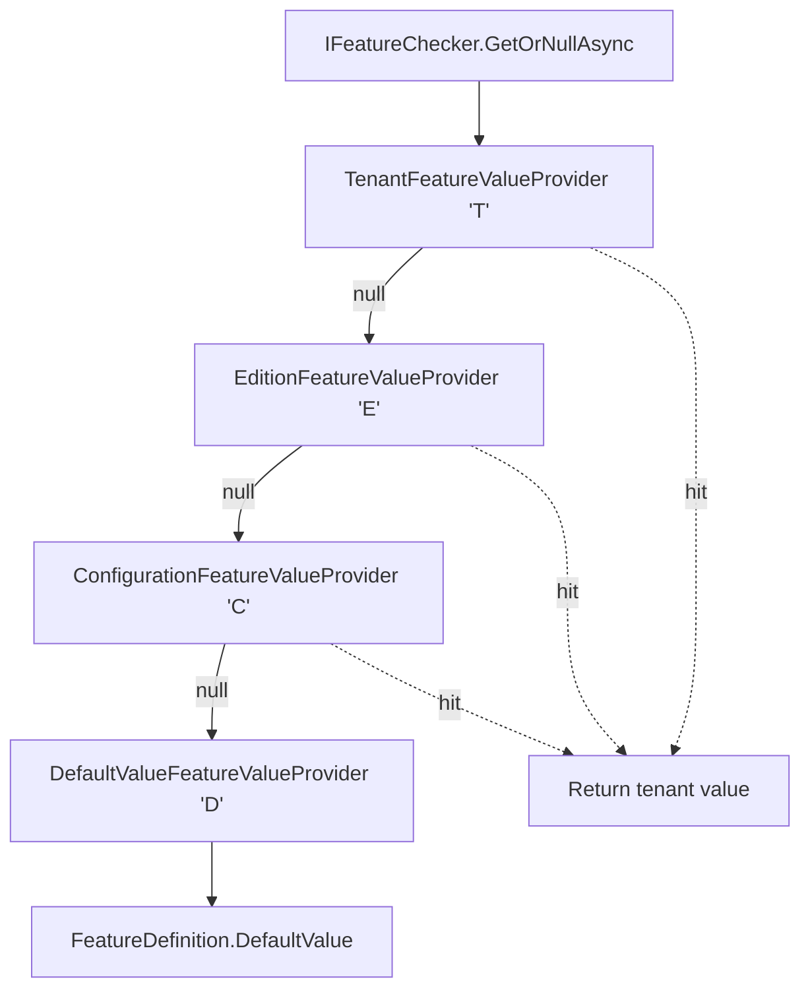

`Volo.Abp.Features` in the ABP Framework provides a tenant- and edition-aware feature toggle system that mirrors the permission system in shape but answers a different question — not "may this user do X" but "is this functionality available for this tenant's plan". This page covers `AbpFeaturesModule` wiring, `FeatureDefinition` and its providers, the `IFeatureChecker` resolution chain, and how `RequiresFeatureAttribute` plugs into the `FeatureInterceptor`. For the orthogonal compile-time switch system see [Global Features](/security/global-features); for the database-backed admin UI see the [Feature Management module](/modules/feature-management).

## Module wiring

`framework/src/Volo.Abp.Features/Volo/Abp/Features/AbpFeaturesModule.cs` depends on `AbpLocalizationModule`, `AbpMultiTenancyModule`, `AbpValidationModule`, and `AbpAuthorizationAbstractionsModule`. Its `PreConfigureServices` registers the feature interceptor and auto-discovers definition providers:

```csharp
public override void PreConfigureServices(ServiceConfigurationContext context)
{
    context.Services.OnRegistered(FeatureInterceptorRegistrar.RegisterIfNeeded);
    AutoAddDefinitionProviders(context.Services);
}
```

`ConfigureServices` populates `AbpFeatureOptions` with the four built-in value providers, in *priority order from lowest to highest* (the checker reverses this list, so the last-added wins):

```csharp
Configure<AbpFeatureOptions>(options =>
{
    options.ValueProviders.Add<DefaultValueFeatureValueProvider>();
    options.ValueProviders.Add<ConfigurationFeatureValueProvider>();
    options.ValueProviders.Add<EditionFeatureValueProvider>();
    options.ValueProviders.Add<TenantFeatureValueProvider>();
});
```

`AutoAddDefinitionProviders` works exactly like the equivalent in `AbpAuthorizationModule` — every concrete `IFeatureDefinitionProvider` registered in DI is appended to `AbpFeatureOptions.DefinitionProviders`.

## `AbpFeatureOptions`

`framework/src/Volo.Abp.Features/Volo/Abp/Features/AbpFeatureOptions.cs`:

```csharp
public class AbpFeatureOptions
{
    public ITypeList<IFeatureDefinitionProvider> DefinitionProviders { get; }
    public ITypeList<IFeatureValueProvider> ValueProviders { get; }
    public HashSet<string> DeletedFeatures { get; }
    public HashSet<string> DeletedFeatureGroups { get; }
}
```

Same shape as `AbpPermissionOptions`. `DeletedFeatures` / `DeletedFeatureGroups` exist so downstream modules can remove items a base module added without rewriting providers.

## `FeatureDefinition`

`framework/src/Volo.Abp.Features/Volo/Abp/Features/FeatureDefinition.cs`:

```csharp
public class FeatureDefinition : ICanCreateChildFeature
{
    public string Name { get; }
    public ILocalizableString DisplayName { get; set; }
    public ILocalizableString? Description { get; set; }
    public FeatureDefinition? Parent { get; private set; }
    public IReadOnlyList<FeatureDefinition> Children { get; }
    public string? DefaultValue { get; set; }
    public bool IsVisibleToClients { get; set; }
    public bool IsAvailableToHost { get; set; }
    public List<string> AllowedProviders { get; }
    public Dictionary<string, object?> Properties { get; }
    public IStringValueType? ValueType { get; set; }
}
```

| Field | Purpose |
| --- | --- |
| `Name` | Lookup key used by `IFeatureChecker` and `[RequiresFeature]` |
| `DefaultValue` | String value returned by `DefaultValueFeatureValueProvider` when nothing else matches |
| `ValueType` | `IStringValueType` for the admin UI — defaults to `ToggleStringValueType` (a boolean) |
| `IsAvailableToHost` | When `false`, the value providers may still resolve a value but the host UI hides it |
| `IsVisibleToClients` | Controls whether the client sees the feature in the `/api/abp/application-configuration` payload |
| `AllowedProviders` | Whitelist of provider names (`"T"`, `"E"`, `"D"`, `"C"`); empty = all |
| `Parent` | A child feature is only effective if the parent evaluates truthy — this is enforced by convention in feature UIs and in custom state checkers |

Note that values are *always strings* internally — the system stores `"true"`, `"false"`, `"100"`, `"Gold"`, etc. The `FeatureCheckerExtensions.GetAsync<T>(...)` helper converts strings to `bool`, `int`, etc. via `.To<T>()`.

## Defining features

`IFeatureDefinitionProvider` (one phase, not three) and `IFeatureDefinitionContext` are smaller than their permission counterparts:

```csharp
public interface IFeatureDefinitionProvider
{
    void Define(IFeatureDefinitionContext context);
}

public interface IFeatureDefinitionContext
{
    FeatureGroupDefinition AddGroup(string name, ILocalizableString? displayName = null);
    FeatureGroupDefinition? GetGroupOrNull(string name);
    void RemoveGroup(string name);
}
```

A typical provider:

```csharp
public class MyFeatureDefinitionProvider : FeatureDefinitionProvider
{
    public override void Define(IFeatureDefinitionContext context)
    {
        var group = context.AddGroup("MyApp", L("Feature:MyApp"));

        group.AddFeature("MyApp.Chat",
            defaultValue: "false",
            displayName: L("Feature:Chat"),
            valueType: new ToggleStringValueType());

        group.AddFeature("MyApp.Storage.Quota",
            defaultValue: "100",
            displayName: L("Feature:Storage.Quota"),
            valueType: new FreeTextStringValueType(new NumericValueValidator(0, int.MaxValue)));
    }
}
```

`FeatureDefinition.CreateChild` enforces hierarchy without disabling values; children are simply nested in `FeatureDefinition.Children` for UI rendering.

## `IFeatureDefinitionManager`

```csharp
public interface IFeatureDefinitionManager
{
    Task<FeatureDefinition> GetAsync(string name);
    Task<IReadOnlyList<FeatureDefinition>> GetAllAsync();
    Task<FeatureDefinition?> GetOrNullAsync(string name);
    Task<IReadOnlyList<FeatureGroupDefinition>> GetGroupsAsync();
}
```

Same two-store pattern as permissions: `IStaticFeatureDefinitionStore` (compiled providers) plus `IDynamicFeatureDefinitionStore` (database, supplied by feature-management module). The default `NullDynamicFeatureDefinitionStore` returns empty lists.

## `IFeatureChecker`

`framework/src/Volo.Abp.Features/Volo/Abp/Features/IFeatureChecker.cs`:

```csharp
public interface IFeatureChecker
{
    Task<string?> GetOrNullAsync(string name);
    Task<bool> IsEnabledAsync(string name);
}
```

The default implementation `FeatureChecker` (`framework/src/Volo.Abp.Features/Volo/Abp/Features/FeatureChecker.cs`) reverses the configured provider list, optionally filters by `AllowedProviders`, and returns the first non-null value:

```csharp
public override async Task<string?> GetOrNullAsync(string name)
{
    var featureDefinition = await FeatureDefinitionManager.GetOrNullAsync(name);
    if (featureDefinition == null) return null;

    var providers = FeatureValueProviderManager.ValueProviders.Reverse();
    if (featureDefinition.AllowedProviders.Any())
        providers = providers.Where(p => featureDefinition.AllowedProviders.Contains(p.Name));

    return await GetOrNullValueFromProvidersAsync(providers, featureDefinition);
}
```

Because the list was added Default → Configuration → Edition → Tenant and the checker reverses it, the *effective lookup order* is Tenant → Edition → Configuration → Default. This means tenant-specific overrides win, then edition-level values, then `appsettings.json`, then the hardcoded `DefaultValue`.



## Built-in value providers

| Provider | `Name` | Lookup |
| --- | --- | --- |
| `TenantFeatureValueProvider` | `"T"` | `IFeatureStore.GetOrNullAsync(name, "T", CurrentTenant.Id)` |
| `EditionFeatureValueProvider` | `"E"` | Finds `editionId` via `Principal.FindEditionId()` then `TenantStore.FindAsync(...)`; queries `(name, "E", editionId)` |
| `ConfigurationFeatureValueProvider` | `"C"` | `IConfiguration["Features:" + name]` |
| `DefaultValueFeatureValueProvider` | `"D"` | `FeatureDefinition.DefaultValue` |

`EditionFeatureValueProvider` is the interesting one — it prefers an `editionId` claim on the principal (set when a host admin impersonates a tenant), and falls back to looking up the tenant's edition through `ITenantStore`:

```csharp
protected virtual async Task<Guid?> FindEditionIdAsync()
{
    var editionId = PrincipalAccessor.Principal?.FindEditionId();
    if (editionId != null) return editionId;

    if (CurrentTenant.Id == null) return null;
    var tenant = await TenantStore.FindAsync(CurrentTenant.Id.Value);
    return tenant?.EditionId;
}
```

This is what makes "Gold-tier tenants have storage quota 100GB" work without rewriting tenants — you set the value on the *edition* and every tenant assigned that edition inherits it.

## `IFeatureStore`

```csharp
public interface IFeatureStore
{
    Task<string?> GetOrNullAsync(string name, string? providerName, string? providerKey);
}
```

`NullFeatureStore` returns `null` for everything. The [feature-management module](/modules/feature-management) ships an EF Core / MongoDB implementation backed by a `FeatureValues` table keyed on `(Name, ProviderName, ProviderKey)`.

## `FeatureCheckerExtensions`

The extension class in `FeatureCheckerExtensions.cs` adds typed gets and multi-feature checks:

```csharp
public static async Task<T> GetAsync<T>(this IFeatureChecker featureChecker, string name, T defaultValue = default)
    where T : struct;

public static async Task<bool> IsEnabledAsync(this IFeatureChecker featureChecker, bool requiresAll, params string[] featureNames);

public static async Task CheckEnabledAsync(this IFeatureChecker featureChecker, string featureName);

public static async Task CheckEnabledAsync(this IFeatureChecker featureChecker, bool requiresAll, params string[] featureNames);
```

`CheckEnabledAsync` throws `AbpAuthorizationException` (with error codes `FeatureIsNotEnabled`, `AllOfTheseFeaturesMustBeEnabled`, or `AtLeastOneOfTheseFeaturesMustBeEnabled` from `AbpFeatureErrorCodes`). The thrown exception is `AbpAuthorizationException` specifically so that the same exception filter that turns `AbpAuthorizationException` into HTTP 403 covers both permission *and* feature failures with no extra wiring.

## `RequiresFeatureAttribute` and the interceptor

`framework/src/Volo.Abp.Features/Volo/Abp/Features/RequiresFeatureAttribute.cs`:

```csharp
[AttributeUsage(AttributeTargets.Class | AttributeTargets.Method)]
public class RequiresFeatureAttribute : Attribute
{
    public string[] Features { get; }
    public bool RequiresAll { get; set; }

    public RequiresFeatureAttribute(params string[] features)
    {
        Features = features ?? Array.Empty<string>();
    }
}
```

`FeatureInterceptor` (`FeatureInterceptor.cs`) runs before each method:

```csharp
public override async Task InterceptAsync(IAbpMethodInvocation invocation)
{
    if (AbpCrossCuttingConcerns.IsApplied(invocation.TargetObject, AbpCrossCuttingConcerns.FeatureChecking))
    {
        await invocation.ProceedAsync();
        return;
    }

    await CheckFeaturesAsync(invocation);
    await invocation.ProceedAsync();
}
```

`MethodInvocationFeatureCheckerService.CheckAsync` collects every `RequiresFeatureAttribute` on the method and on its declaring type (if the method is public) and calls `_featureChecker.CheckEnabledAsync(attribute.RequiresAll, attribute.Features)` for each one:

```csharp
public async Task CheckAsync(MethodInvocationFeatureCheckerContext context)
{
    if (IsFeatureCheckDisabled(context)) return;

    foreach (var requiresFeatureAttribute in GetRequiredFeatureAttributes(context.Method))
    {
        await _featureChecker.CheckEnabledAsync(
            requiresFeatureAttribute.RequiresAll,
            requiresFeatureAttribute.Features);
    }
}
```

`DisableFeatureCheckAttribute` (same folder) is the per-method opt-out — apply it to skip the interceptor for a single method.

`FeatureInterceptorRegistrar.ShouldIntercept` mirrors the authorization version: any class that has `[RequiresFeature]` on the type *or* on any method gets the interceptor attached. Combined with the `DisableAbpFeaturesAttribute` opt-out (covered in [Global Features](/security/global-features)), this gives you both class-wide and per-method control.

## State-checker integration

`RequireFeaturesSimpleStateChecker<TState>` (in the Features folder) lets you gate a `PermissionDefinition` or `SettingDefinition` on one or more features:

```csharp
public class RequireFeaturesSimpleStateChecker<TState> : ISimpleStateChecker<TState>
    where TState : IHasSimpleStateCheckers<TState>
{
    public string[] FeatureNames { get; }
    public bool RequiresAll { get; }

    public async Task<bool> IsEnabledAsync(SimpleStateCheckerContext<TState> context)
    {
        var featureChecker = context.ServiceProvider.GetRequiredService<IFeatureChecker>();
        return await featureChecker.IsEnabledAsync(RequiresAll, FeatureNames);
    }
}
```

`FeatureSimpleStateCheckerExtensions.RequireFeatures(...)` provides a fluent shortcut:

```csharp
context.AddPermission("MyApp.Chat.Send")
    .RequireFeatures("MyApp.Chat");
```

Now `IPermissionChecker.IsGrantedAsync("MyApp.Chat.Send")` will return `false` if the `MyApp.Chat` feature is not enabled for the current tenant, *regardless of how the user/role grants are configured* — because of the state-checker gate in [`PermissionChecker`](/security/permissions). See [Simple State Checking](/security/simple-state-checking) for the underlying mechanism.

## Tenant context propagation

Because `TenantFeatureValueProvider` resolves `CurrentTenant.Id`, the feature value naturally follows tenant context. Inside `ICurrentTenant.Change(...)` blocks the answer flips:

```csharp
using (_currentTenant.Change(tenantA)) {
    // returns tenantA's value
    await _featureChecker.GetAsync<int>("MyApp.Storage.Quota");
}
using (_currentTenant.Change(null)) {
    // returns host value (typically the DefaultValue)
    await _featureChecker.GetAsync<int>("MyApp.Storage.Quota");
}
```

This is how a host-side background job iterates tenants and resolves per-tenant quota without a separate API. See [Multi-tenancy overview](/multi-tenancy/overview) for `ICurrentTenant.Change`.

## Serialization for tooling

`FeaturesSimpleStateCheckerSerializerContributor` serializes `RequireFeaturesSimpleStateChecker` instances to JSON. This lets the [feature-management module](/modules/feature-management) round-trip definitions through its dynamic-definition store — a feature defined statically can be edited at runtime and persisted back, and its state-checker conditions survive.

## End-to-end summary

| Layer | Component | File |
| --- | --- | --- |
| Module | `AbpFeaturesModule` | `AbpFeaturesModule.cs` |
| Options | `AbpFeatureOptions` | `AbpFeatureOptions.cs` |
| Definitions | `IFeatureDefinitionProvider`, `FeatureDefinition` | `IFeatureDefinitionProvider.cs`, `FeatureDefinition.cs` |
| Manager | `IFeatureDefinitionManager` | `IFeatureDefinitionManager.cs` |
| Checker | `IFeatureChecker`, `FeatureChecker` | `IFeatureChecker.cs`, `FeatureChecker.cs` |
| Provider chain | `TenantFeatureValueProvider`, `EditionFeatureValueProvider`, `ConfigurationFeatureValueProvider`, `DefaultValueFeatureValueProvider` | same folder |
| Store | `IFeatureStore`, `NullFeatureStore` | `IFeatureStore.cs`, `NullFeatureStore.cs` |
| Aspect | `RequiresFeatureAttribute`, `FeatureInterceptor` | `RequiresFeatureAttribute.cs`, `FeatureInterceptor.cs` |
| State checker | `RequireFeaturesSimpleStateChecker<>` | `RequireFeaturesSimpleStateChecker.cs` |

## Related pages

- [Global Features](/security/global-features) — startup-time toggles that *remove* whole subsystems.
- [Permissions](/security/permissions) — `RequireFeatures` extension to gate permissions.
- [Simple State Checking](/security/simple-state-checking) — the `ISimpleStateChecker<>` contract.
- [Feature Management module](/modules/feature-management) — admin UI and `IFeatureStore` implementation.
- [Multi-tenancy overview](/multi-tenancy/overview) — tenant resolution and `ICurrentTenant`.
- [Setting Management module](/modules/setting-management) — companion module for settings.
