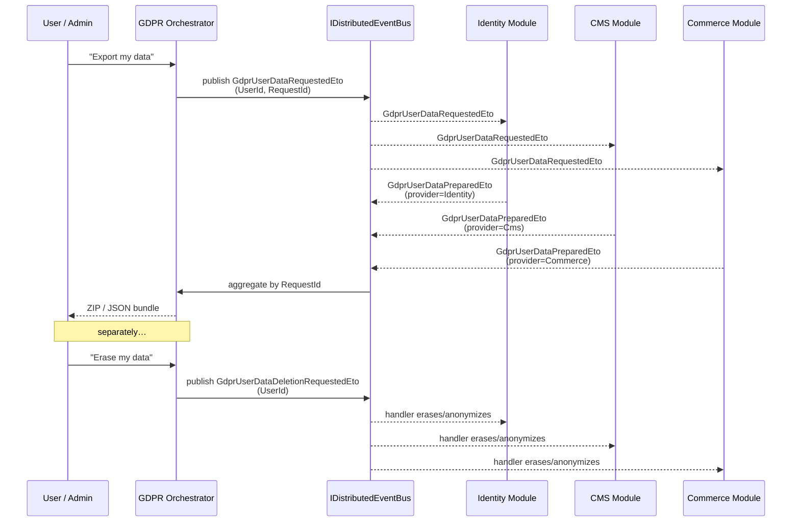

`Volo.Abp.Gdpr.Abstractions` in the ABP Framework is the *contract surface* for cross-module compliance with data-subject rights — collecting and deleting all data ABP modules hold about a single user. The package is intentionally tiny: five POCO types that travel through the distributed event bus, plus the empty module so other packages can `[DependsOn]` it. This page covers every type in the package, the event flow they participate in, and how a module integrates with the orchestrator that the (paid) `Volo.Abp.Gdpr` application module supplies. For the framework-wide security composition see [Security Overview](/security/overview).

## What's in the package

```
framework/src/Volo.Abp.Gdpr.Abstractions/Volo/Abp/Gdpr/
├── AbpGdprAbstractionsModule.cs
├── GdprDataInfo.cs
├── GdprUserDataDeletionRequestedEto.cs
├── GdprUserDataPreparedEto.cs
├── GdprUserDataProviderContext.cs
└── GdprUserDataRequestedEto.cs
```

There are no interfaces, no services, no DI registrations beyond the empty `AbpGdprAbstractionsModule`. The package's value is purely the *vocabulary* — types that other modules can produce and consume without taking a dependency on the orchestrator.

## `AbpGdprAbstractionsModule`

`framework/src/Volo.Abp.Gdpr.Abstractions/Volo/Abp/Gdpr/AbpGdprAbstractionsModule.cs`:

```csharp
namespace Volo.Abp.Gdpr;

public class AbpGdprAbstractionsModule : AbpModule
{
}
```

An empty module is unusual in ABP but here it serves a real purpose: a downstream module can `[DependsOn(typeof(AbpGdprAbstractionsModule))]` to declare an intent to participate in GDPR flows, which gives operators a single search hit (`AbpGdprAbstractionsModule`) to find every module that holds personal data.

## The ETO triplet

The package defines three Event Transfer Objects (ETOs) that flow through `IDistributedEventBus`. ABP modules subscribe to one and may publish another to build a fan-out, fan-in pipeline that the GDPR orchestrator drives.

### `GdprUserDataRequestedEto`

`framework/src/Volo.Abp.Gdpr.Abstractions/Volo/Abp/Gdpr/GdprUserDataRequestedEto.cs`:

```csharp
[Serializable]
public class GdprUserDataRequestedEto
{
    public Guid UserId { get; set; }
    public Guid RequestId { get; set; }
}
```

Published by the orchestrator when a user (or admin) submits a "give me a copy of my data" request. Every participating module subscribes via `IDistributedEventHandler<GdprUserDataRequestedEto>` and responds with a `GdprUserDataPreparedEto`. The `RequestId` correlates the fan-out, so the orchestrator knows when it has heard from every expected provider.

### `GdprUserDataPreparedEto`

`framework/src/Volo.Abp.Gdpr.Abstractions/Volo/Abp/Gdpr/GdprUserDataPreparedEto.cs`:

```csharp
[Serializable]
public class GdprUserDataPreparedEto
{
    public Guid RequestId { get; set; }
    public string Provider { get; set; } = default!;
    public GdprDataInfo Data { get; set; } = default!;
}
```

Each participating module publishes one of these as its answer. Three fields, three responsibilities:

| Field | Purpose |
| --- | --- |
| `RequestId` | Correlates back to `GdprUserDataRequestedEto.RequestId` |
| `Provider` | A stable identifier for the contributing module — used by the orchestrator to deduplicate and to label sections in the export bundle |
| `Data` | The actual data, as a `GdprDataInfo` (see below) |

The orchestrator aggregates every `GdprUserDataPreparedEto` it receives for a given `RequestId` and emits the consolidated export to the user.

### `GdprUserDataDeletionRequestedEto`

`framework/src/Volo.Abp.Gdpr.Abstractions/Volo/Abp/Gdpr/GdprUserDataDeletionRequestedEto.cs`:

```csharp
[Serializable]
public class GdprUserDataDeletionRequestedEto
{
    public Guid UserId { get; set; }
}
```

Published when a "right to erasure" request is approved. No `RequestId` — deletion is fire-and-forget; modules are expected to delete or anonymize their records about `UserId` and not respond. Because the bus may deliver this more than once (at-least-once semantics), handlers must be *idempotent* — re-running deletion for an already-anonymized user must not throw.

## `GdprDataInfo`

`framework/src/Volo.Abp.Gdpr.Abstractions/Volo/Abp/Gdpr/GdprDataInfo.cs`:

```csharp
[Serializable]
public class GdprDataInfo : Dictionary<string, string>
{
}
```

A simple dictionary so the wire format is JSON-friendly across event-bus implementations (RabbitMQ, Azure Service Bus, Kafka, in-memory). Keys are free-form labels chosen by the contributing module — typically a field name like `"FirstName"`, `"PhoneNumber"`, `"OrderHistory.2024-Q1"`. Values are stringified payloads; for nested data, modules typically serialize sub-records to JSON inline.

The `Dictionary<string, string>` shape is intentionally minimal: simple to round-trip across `Volo.Abp.EventBus.Distributed` brokers, simple to render in an admin-facing UI, and forgiving of schema evolution — adding a new key doesn't break old consumers.

## `GdprUserDataProviderContext`

`framework/src/Volo.Abp.Gdpr.Abstractions/Volo/Abp/Gdpr/GdprUserDataProviderContext.cs`:

```csharp
public class GdprUserDataProviderContext
{
    public Guid UserId { get; set; }
}
```

Used by the higher-level `Volo.Abp.Gdpr` orchestrator module to invoke synchronous, in-process data providers (`IGdprUserDataProvider` — defined in the orchestrator package, not here). When a module prefers to participate via direct service contribution rather than through the event bus, it implements a provider that takes this context and returns a `GdprDataInfo`. The same shape is used for both export and (with a deletion variant) erasure.

## The full pipeline

The orchestrator that ties these pieces together lives in the [paid GDPR module](https://abp.io/modules/Volo.Gdpr) outside `framework/src/`. From the abstractions' point of view, the flow is:



## Handler template for participating modules

A module that holds personal data typically registers two event handlers — one for export, one for erasure. Each is just an `IDistributedEventHandler<T>`:

```csharp
using Volo.Abp.DependencyInjection;
using Volo.Abp.EventBus.Distributed;
using Volo.Abp.Gdpr;

public class MyModuleGdprHandler :
    IDistributedEventHandler<GdprUserDataRequestedEto>,
    IDistributedEventHandler<GdprUserDataDeletionRequestedEto>,
    ITransientDependency
{
    private readonly IRepository<MyEntity> _repo;
    private readonly IDistributedEventBus _bus;

    public MyModuleGdprHandler(IRepository<MyEntity> repo, IDistributedEventBus bus)
    {
        _repo = repo;
        _bus  = bus;
    }

    public async Task HandleEventAsync(GdprUserDataRequestedEto eventData)
    {
        var items = await _repo.GetListAsync(x => x.UserId == eventData.UserId);

        var data = new GdprDataInfo();
        foreach (var (it, i) in items.Select((it, i) => (it, i)))
        {
            data[$"Note.{i}.Title"]     = it.Title;
            data[$"Note.{i}.Body"]      = it.Body;
            data[$"Note.{i}.CreatedAt"] = it.CreatedAt.ToString("O");
        }

        await _bus.PublishAsync(new GdprUserDataPreparedEto
        {
            RequestId = eventData.RequestId,
            Provider  = "MyModule",
            Data      = data
        });
    }

    public async Task HandleEventAsync(GdprUserDataDeletionRequestedEto eventData)
    {
        // Idempotent: deletion of an already-deleted record is a no-op.
        await _repo.DeleteAsync(x => x.UserId == eventData.UserId);
    }
}
```

Three idiomatic concerns:

- **Keys are stable and meaningful.** The export bundle is delivered to an end user, so prefer `"OrderHistory.2024-Q1.ItemCount"` over `"Field42"`.
- **Idempotency on deletion.** `at-least-once` delivery is the default for distributed buses; design deletes to tolerate re-delivery.
- **Privacy of the response itself.** `GdprDataInfo` values flow across the bus — if your transport is multi-tenant or shared with other apps, the bus must encrypt at rest *or* you should anonymize before publishing.

## Why ETOs rather than direct calls?

A direct `IGdprUserDataProvider` API would work for a monolith but constrains how the orchestrator scales. The event-based pattern offers:

1. **Module isolation.** No module needs to take a dependency on the orchestrator's package — only on the abstractions. New modules can participate without touching the orchestrator's source.
2. **Cross-process aggregation.** In a microservice deployment, the orchestrator can run in one process and collect responses from several others.
3. **Tolerance for slow providers.** A module that needs minutes to assemble its slice (large blob storage, archived tables) can do so without holding the request thread.
4. **Auditing.** Every step of the flow is a discrete event you can capture in the audit log or rebroadcast for compliance reporting.

The synchronous `GdprUserDataProviderContext`-based hook exists for the common case where everything is in-process and a single transaction is preferred — the orchestrator falls back to it when no event-bus participants respond.

## Schema-evolution discipline

Because these ETOs travel across versions of your services, treat the abstractions as semi-versioned:

| Change | Compatibility |
| --- | --- |
| Add a key to `GdprDataInfo` | Always safe (it's a `Dictionary<string,string>`) |
| Add a new ETO type | Safe — old subscribers ignore it |
| Add a property to an ETO | Safe with `[Serializable]` + `JsonSerializer` — old consumers skip the property |
| Remove or rename an existing property | Breaking — coordinate across modules |
| Change `RequestId` semantics | Breaking — the orchestrator correlates on it |

ABP's distributed event bus uses `System.Text.Json` for the in-memory and most distributed implementations, which means additive changes are forgiving but renames are not.

## Related pages and modules

- [Security Overview](/security/overview) — where GDPR fits into the framework's security composition.
- [Identity module](/modules/identity) — typically the first module that subscribes to deletion requests to anonymize user accounts.
- [Permission Management module](/modules/permission-management) — also a deletion subscriber (removes permission grants tied to the user).
- [Setting Management module](/modules/setting-management) — clears per-user settings on deletion.
- [Multi-tenancy overview](/multi-tenancy/overview) — `Guid UserId` is the cross-tenant key; ensure your deletion handler runs in the correct tenant scope.
- [JWT Bearer integration](/aspnetcore/jwt-bearer-auth) — the user submitting the GDPR request is identified through standard JWT auth.
