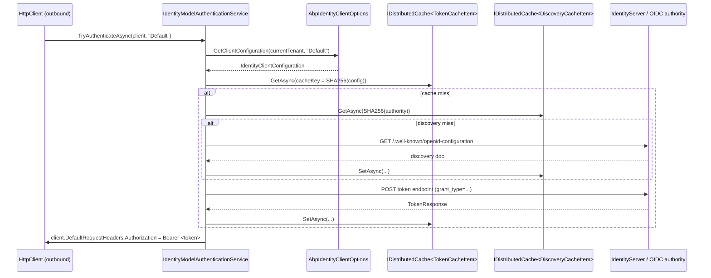

`Volo.Abp.IdentityModel` in the ABP Framework is the service-to-service OIDC client. When one ABP service has to call another (microservice mesh, BFF talking to a downstream API, background worker calling an internal endpoint), it needs an access token that the downstream service's JWT Bearer middleware will accept. This package wraps `Duende.IdentityModel.Client` with caching for discovery documents and tokens, multi-tenancy-aware client configuration, and `client_credentials` / `password` / `device_code` grant support. This page covers `IIdentityModelAuthenticationService`, `IdentityClientConfiguration`, the cache items, and how the client gets resolved per current tenant.

## Module wiring

`framework/src/Volo.Abp.IdentityModel/Volo/Abp/IdentityModel/AbpIdentityModelModule.cs`:

```csharp
[DependsOn(
    typeof(AbpThreadingModule),
    typeof(AbpMultiTenancyModule),
    typeof(AbpCachingModule)
)]
public class AbpIdentityModelModule : AbpModule
{
    public override void ConfigureServices(ServiceConfigurationContext context)
    {
        var configuration = context.Services.GetConfiguration();

        context.Services.AddHttpClient(IdentityModelAuthenticationService.HttpClientName);

        Configure<AbpIdentityClientOptions>(configuration);
    }
}
```

Three responsibilities:

1. Register a named `HttpClient` — `"IdentityModelAuthenticationServiceHttpClientName"` — that all token and discovery calls go through, so hosts can layer `HttpClientHandler` policies (Polly retries, HTTP/2, custom certificate pinning).
2. Bind `AbpIdentityClientOptions` from `IConfiguration` so client credentials can live in `appsettings.json` (`IdentityClients` section).
3. Pull in caching (`IDistributedCache`) and multi-tenancy.

The host typically also registers a token-attaching `DelegatingHandler` on outbound HTTP clients that calls `IIdentityModelAuthenticationService.TryAuthenticateAsync(...)` per request — that's how service-to-service auth is end-to-end automatic.

## `IIdentityModelAuthenticationService`

`framework/src/Volo.Abp.IdentityModel/Volo/Abp/IdentityModel/IIdentityModelAuthenticationService.cs`:

```csharp
//TODO: Re-consider this interface!
public interface IIdentityModelAuthenticationService
{
    Task<bool> TryAuthenticateAsync(
        HttpClient client,
        string? identityClientName = null);

    Task<string> GetAccessTokenAsync(IdentityClientConfiguration configuration);
}
```

Two members:

| Method | Use case |
| --- | --- |
| `TryAuthenticateAsync(HttpClient, name?)` | The everyday helper — resolves a configuration by name, gets a token, and sets `Authorization: Bearer ...` on the passed `HttpClient` |
| `GetAccessTokenAsync(configuration)` | The lower-level path — given an explicit config, return the access token string (you decide what to do with it) |

The framework leaves the `//TODO` comment in the source as a hint that the surface might still evolve, but it has been stable for years.

## `IdentityClientConfiguration`

`framework/src/Volo.Abp.IdentityModel/Volo/Abp/IdentityModel/IdentityClientConfiguration.cs` is — unusually — a `Dictionary<string, string?>` rather than a POCO:

```csharp
public class IdentityClientConfiguration : Dictionary<string, string?>
{
    public string GrantType { get; set; }       // default "client_credentials"
    public string ClientId { get; set; }
    public string ClientSecret { get; set; }
    public string? UserName { get; set; }       // when GrantType="password"
    public string? UserPassword { get; set; }
    public string Authority { get; set; }
    public string Scope { get; set; }
    public bool RequireHttps { get; set; }      // default true
    public int CacheAbsoluteExpiration { get; set; }  // default 1800 (30 min)
    public bool ValidateIssuerName { get; set; } // default true
    public bool ValidateEndpoints { get; set; }  // default true
}
```

The dictionary base is what makes `IdentityModelTokenCacheItem.CalculateCacheKey` work — any extra key/value added to the dictionary becomes part of the cache key automatically (see "Cache keys" below).

The default constructor:

```csharp
public IdentityClientConfiguration(
    string authority,
    string scope,
    string clientId,
    string clientSecret,
    string grantType = OidcConstants.GrantTypes.ClientCredentials,
    string? userName = null,
    string? userPassword = null,
    bool requireHttps = true,
    int cacheAbsoluteExpiration = 60 * 30,
    bool validateIssuerName = true,
    bool validateEndpoints = true)
```

In `appsettings.json` you typically write:

```json
{
  "IdentityClients": {
    "Default": {
      "GrantType": "client_credentials",
      "ClientId": "my-bff",
      "ClientSecret": "1q2w3e*",
      "Authority": "https://auth.example.com/",
      "Scope": "downstream-api"
    },
    "Migration": {
      "GrantType": "password",
      "ClientId": "migration-cli",
      "ClientSecret": "...",
      "Authority": "https://auth.example.com/",
      "Scope": "admin-api",
      "UserName": "svc-migrator",
      "UserPassword": "..."
    }
  }
}
```

## `AbpIdentityClientOptions` and tenant resolution

`framework/src/Volo.Abp.IdentityModel/Volo/Abp/IdentityModel/AbpIdentityClientOptions.cs` does the per-tenant lookup:

```csharp
public IdentityClientConfiguration? GetClientConfiguration(ICurrentTenant currentTenant, string? identityClientName = null)
{
    if (identityClientName.IsNullOrWhiteSpace())
        identityClientName = IdentityClientConfigurationDictionary.DefaultName;

    if (currentTenant.Id.HasValue)
    {
        var tenantConfiguration = IdentityClients.FirstOrDefault(x => x.Key == $"{identityClientName}.{currentTenant.Id}");
        if (tenantConfiguration.Key == null && !currentTenant.Name.IsNullOrWhiteSpace())
        {
            tenantConfiguration = IdentityClients.FirstOrDefault(x => x.Key == $"{identityClientName}.{currentTenant.Name}");
        }
        if (tenantConfiguration.Key != null) return tenantConfiguration.Value;
    }

    return IdentityClients.GetOrDefault(identityClientName!) ?? IdentityClients.Default;
}
```

Resolution order:

1. `"{name}.{tenantId}"` — exact match on tenant GUID.
2. `"{name}.{tenantName}"` — fallback to tenant name.
3. `"{name}"` — global config for that name.
4. `"Default"` (`IdentityClientConfigurationDictionary.DefaultName`) — last-ditch fallback.

This is what lets a multi-tenant deployment configure one IdentityServer per tenant by adding `"Default.5a1b…": { ... }` keys without touching code.

`IdentityClientConfigurationDictionary`:

```csharp
public class IdentityClientConfigurationDictionary : Dictionary<string, IdentityClientConfiguration?>
{
    public const string DefaultName = "Default";
    public IdentityClientConfiguration? Default {
        get => this.GetOrDefault(DefaultName);
        set => this[DefaultName] = value;
    }
}
```

## `IdentityModelAuthenticationService`

`framework/src/Volo.Abp.IdentityModel/Volo/Abp/IdentityModel/IdentityModelAuthenticationService.cs` is registered with `[Dependency(ReplaceServices = true)] ITransientDependency`. The high-level path:

```csharp
public async Task<bool> TryAuthenticateAsync(HttpClient client, string? identityClientName = null)
{
    var accessToken = await GetAccessTokenOrNullAsync(identityClientName);
    if (accessToken == null) return false;
    SetAccessToken(client, accessToken);
    return true;
}

protected virtual void SetAccessToken(HttpClient client, string accessToken)
{
    //TODO: "Bearer" should be configurable
    client.DefaultRequestHeaders.Authorization = new AuthenticationHeaderValue("Bearer", accessToken);
}
```

`GetAccessTokenOrNullAsync` resolves the configuration through `AbpIdentityClientOptions.GetClientConfiguration(CurrentTenant, name)`, then delegates to `GetAccessTokenAsync(configuration)`. If no configuration matches at all, the call logs a warning and returns `false` — the outbound HTTP request will then go anonymously (which is *usually* what you want for public endpoints; for protected calls, it manifests as a 401 you can debug).

### Token cache lookup and refresh

```csharp
public virtual async Task<string> GetAccessTokenAsync(IdentityClientConfiguration configuration)
{
    var cacheKey = CalculateTokenCacheKey(configuration);
    var tokenCacheItem = await TokenCache.GetAsync(cacheKey);
    if (tokenCacheItem == null)
    {
        var tokenResponse = await GetTokenResponse(configuration);
        if (tokenResponse.IsError) { /* throw AbpException */ }

        tokenCacheItem = new IdentityModelTokenCacheItem(tokenResponse.AccessToken!);
        await TokenCache.SetAsync(cacheKey, tokenCacheItem, new DistributedCacheEntryOptions
        {
            AbsoluteExpirationRelativeToNow = AbpHostEnvironment.IsDevelopment()
                ? TimeSpan.FromSeconds(5)
                : TimeSpan.FromSeconds(configuration.CacheAbsoluteExpiration)
        });
    }
    return tokenCacheItem.AccessToken;
}
```

Notice the dev-vs-production cache window:

| Environment | Cache duration |
| --- | --- |
| Development | `5 seconds` |
| Any other | `IdentityClientConfiguration.CacheAbsoluteExpiration` seconds (default `1800` = 30 minutes) |

The dev shortcut exists so you don't get stale tokens during rapid debugging. In production, the 30-minute default plays well with typical OIDC access-token lifetimes — you want to renew slightly before expiry, not on every call.

### Discovery cache

`GetDiscoveryResponse` does the same cache-first pattern for the OIDC discovery document (`.well-known/openid-configuration`). The cache item:

```csharp
[Serializable]
[IgnoreMultiTenancy]
public class IdentityModelDiscoveryDocumentCacheItem
{
    public string TokenEndpoint { get; set; }
    public string DeviceAuthorizationEndpoint { get; set; }
    public static string CalculateCacheKey(IdentityClientConfiguration configuration)
        => configuration.Authority.ToLower().ToSha256();
}
```

`[IgnoreMultiTenancy]` means the same discovery document is reused across tenants when they share an authority — discovery is purely a function of the authority URL.

### Token request grants

```csharp
protected virtual async Task<TokenResponse> GetTokenResponse(IdentityClientConfiguration configuration)
{
    using (var httpClient = HttpClientFactory.CreateClient(HttpClientName))
    {
        AddHeaders(httpClient);
        switch (configuration.GrantType)
        {
            case OidcConstants.GrantTypes.ClientCredentials:
                return await httpClient.RequestClientCredentialsTokenAsync(
                    await CreateClientCredentialsTokenRequestAsync(configuration),
                    CancellationTokenProvider.Token);
            case OidcConstants.GrantTypes.Password:
                return await httpClient.RequestPasswordTokenAsync(
                    await CreatePasswordTokenRequestAsync(configuration),
                    CancellationTokenProvider.Token);
            case OidcConstants.GrantTypes.DeviceCode:
                return await RequestDeviceAuthorizationAsync(httpClient, configuration);
            default:
                throw new AbpException("Grant type was not implemented: " + configuration.GrantType);
        }
    }
}
```

Three grants supported out of the box:

| `GrantType` constant | Use case |
| --- | --- |
| `client_credentials` | Service-to-service (no user context); the default |
| `password` | Resource-owner password (legacy, CLI tools) |
| `urn:ietf:params:oauth:grant-type:device_code` | Device-flow CLI / IoT |

Each branch builds a `Duende.IdentityModel.Client` request, posts to the discovered token endpoint, and returns a `TokenResponse`. Errors are translated to `AbpException` so unhandled token failures bubble up like any other framework exception.

## Cache keys

`IdentityModelTokenCacheItem.CalculateCacheKey` (`IdentityModelTokenCacheItem.cs`):

```csharp
public static string CalculateCacheKey(IdentityClientConfiguration configuration)
{
    return string.Join(",", configuration.Select(x => x.Key + ":" + x.Value)).ToSha256();
}
```

Because `IdentityClientConfiguration` is itself a dictionary, *every* key/value contributes to the SHA-256. Practical consequences:

- Two clients with the same `ClientId` but different `Scope` or `UserName` get *different* cached tokens — no leak between principals.
- Adding a custom key/value (e.g. tenant ID injected upstream) automatically partitions the cache without writing custom keying code.
- The hash is opaque; rotating any field invalidates the previous cache entry.

## Multi-tenancy and `IDistributedCache`

The token cache uses `IDistributedCache<IdentityModelTokenCacheItem>` — a typed wrapper that follows ABP's tenant-aware caching conventions. Combined with `ICurrentTenant`, this means:

- Tokens fetched under tenant A are *not* served when running under tenant B (different cache prefix).
- Switching tenants via `using (CurrentTenant.Change(...))` correctly picks up the per-tenant `IdentityClientConfiguration` resolved by `AbpIdentityClientOptions.GetClientConfiguration`.
- The discovery cache is `[IgnoreMultiTenancy]` because the discovery document is identical across tenants of the same authority.

See [Multi-tenancy overview](/multi-tenancy/overview) for `IDistributedCache` tenant prefixing.

## Customization hooks

`IdentityModelHttpRequestMessageOptions` lets you mutate every outgoing HTTP message — useful for adding correlation IDs, mTLS client headers, or extra request claims:

```csharp
public class IdentityModelHttpRequestMessageOptions
{
    public Action<HttpRequestMessage>? ConfigureHttpRequestMessage { get; set; }
}
```

Wire it up in your module:

```csharp
Configure<IdentityModelHttpRequestMessageOptions>(o =>
{
    o.ConfigureHttpRequestMessage = req =>
    {
        req.Headers.Add("X-Correlation-Id", Guid.NewGuid().ToString());
    };
});
```

The action is invoked from both the discovery request and the token request paths.

## End-to-end flow



## Practical idioms

### Token-attaching `DelegatingHandler`

The common consumer pattern — adding a token to every outbound call — is a tiny handler:

```csharp
public class IdentityModelAuthenticationHttpRequestHandler : DelegatingHandler
{
    private readonly IIdentityModelAuthenticationService _auth;
    public IdentityModelAuthenticationHttpRequestHandler(IIdentityModelAuthenticationService auth) { _auth = auth; }

    protected override async Task<HttpResponseMessage> SendAsync(HttpRequestMessage request, CancellationToken ct)
    {
        // simplified — production code resolves the client name from the typed HttpClient registration
        var client = new HttpClient(); // not used for sending, only for header attachment
        await _auth.TryAuthenticateAsync(client, "Default");
        request.Headers.Authorization = client.DefaultRequestHeaders.Authorization;
        return await base.SendAsync(request, ct);
    }
}
```

ABP's HTTP client modules (`Volo.Abp.Http.Client.IdentityModel`) ship a more complete variant of this handler — see the BFF integration in [JWT Bearer integration](/aspnetcore/jwt-bearer-auth).

### Test-time stubbing

For integration tests, replace `IIdentityModelAuthenticationService` with a stub that returns a pre-generated token (or `false` so requests go anonymously). Because the interface is two methods, a stub is one screen of code.

## Related pages and modules

- [Security Abstractions](/security/security-abstractions) — the principal model that the issued tokens populate downstream.
- [Dynamic Claims](/security/dynamic-claims) — the complementary "keep the claims fresh" mechanism on the *consuming* side.
- [JWT Bearer integration](/aspnetcore/jwt-bearer-auth) — the server-side counterpart that validates these tokens.
- [Authorization](/security/authorization) — how the validated principal flows into permission checks.
- [Multi-tenancy overview](/multi-tenancy/overview) — `ICurrentTenant`-aware client lookup and cache prefixing.
- [Identity module](/modules/identity) — the user store that backs `password` and refresh flows.
