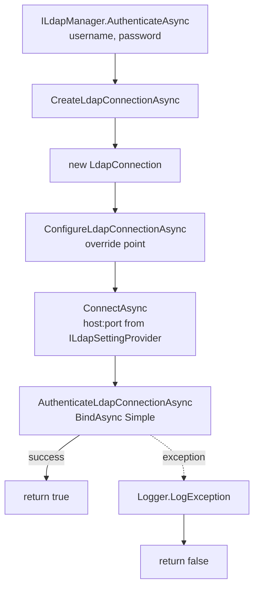

`Volo.Abp.Ldap` in the ABP Framework is a thin LDAP simple-bind authentication client. It does not implement a full directory-services abstraction; instead it answers the single question "given a username and password, can we successfully bind to the configured LDAP server with these credentials?" That is the minimum the identity module needs to support enterprise login flows like Active Directory. This page covers the abstractions package, the `LdapManager` implementation built on the `LdapForNet` library, and how connection settings are sourced through `Volo.Abp.Settings` rather than `IOptions<T>`.

## Two packages, one responsibility

| Package | Module class | Purpose |
| --- | --- | --- |
| `Volo.Abp.Ldap.Abstractions` | `AbpLdapAbstractionsModule` | `ILdapManager`, `ILdapSettingProvider`, `LdapSettingNames`, localization |
| `Volo.Abp.Ldap` | `AbpLdapModule` | `LdapManager` (real LDAP bind), `LdapSettingProvider`, `LdapSettingDefinitionProvider` |

Splitting contracts from implementation lets a module reference only the abstractions (for example, the identity module's external-login provider) and let the host application pick which `ILdapManager` flavor to register.

## `AbpLdapAbstractionsModule`

`framework/src/Volo.Abp.Ldap.Abstractions/Volo/Abp/Ldap/AbpLdapAbstractionsModule.cs` depends on `AbpVirtualFileSystemModule` and `AbpLocalizationModule`. It mounts the embedded JSON resource files under `/Volo/Abp/Ldap/Localization/` so display names like `DisplayName:Abp.Ldap.ServerHost` resolve in every supported culture:

```csharp
public override void ConfigureServices(ServiceConfigurationContext context)
{
    Configure<AbpVirtualFileSystemOptions>(options =>
    {
        options.FileSets.AddEmbedded<AbpLdapAbstractionsModule>();
    });

    Configure<AbpLocalizationOptions>(options =>
    {
        options.Resources
            .Add<LdapResource>("en")
            .AddVirtualJson("/Volo/Abp/Ldap/Localization");
    });
}
```

## `AbpLdapModule`

`framework/src/Volo.Abp.Ldap/Volo/Abp/Ldap/AbpLdapModule.cs` is minimal:

```csharp
[DependsOn(
    typeof(AbpLdapAbstractionsModule),
    typeof(AbpSettingsModule))]
public class AbpLdapModule : AbpModule
{
}
```

It depends on `AbpSettingsModule` because the entire configuration surface (host, port, base DN, bind credentials) is exposed through [Settings](/security/settings-runtime), not through an `LdapOptions` class — which means an admin can change LDAP server details at runtime via the [Setting Management module](/modules/setting-management) without redeploy.

No explicit `ConfigureServices`: `LdapManager`, `LdapSettingProvider`, and `LdapSettingDefinitionProvider` all carry conventional ABP lifetime markers (`ITransientDependency` / `SettingDefinitionProvider`) and are auto-registered by `AbpModule` conventions.

## `LdapSettingNames`

`framework/src/Volo.Abp.Ldap.Abstractions/Volo/Abp/Ldap/LdapSettingNames.cs` is the canonical list of setting keys:

```csharp
public static class LdapSettingNames
{
    public const string Ldaps     = "Abp.Ldap.Ldaps";
    public const string ServerHost = "Abp.Ldap.ServerHost";
    public const string ServerPort = "Abp.Ldap.ServerPort";
    public const string BaseDc    = "Abp.Ldap.BaseDc";
    public const string Domain    = "Abp.Ldap.Domain";
    public const string UserName  = "Abp.Ldap.UserName";
    public const string Password  = "Abp.Ldap.Password";
}
```

Convention: the prefix `Abp.Ldap.` is stable, so a downstream module/UI can group all settings whose name starts with that prefix into a single admin panel.

| Setting | Default | Purpose |
| --- | --- | --- |
| `Abp.Ldap.Ldaps` | `"false"` | If true, use LDAP-over-SSL (port `636` by convention) |
| `Abp.Ldap.ServerHost` | `""` | Hostname or IP of the directory server |
| `Abp.Ldap.ServerPort` | `"389"` | Port (override to `636` for `Ldaps`) |
| `Abp.Ldap.BaseDc` | `""` | Base Distinguished Name for searches (e.g. `DC=corp,DC=example,DC=com`) |
| `Abp.Ldap.Domain` | `""` | NetBIOS / DNS domain (for Active Directory `domain\user` formatting) |
| `Abp.Ldap.UserName` | `""` | Service-account DN or UPN used for non-bind queries (not used by the base manager) |
| `Abp.Ldap.Password` | `""` | Service-account password — registered with `isEncrypted: true` |

## `LdapSettingDefinitionProvider`

`framework/src/Volo.Abp.Ldap/Volo/Abp/Ldap/LdapSettingDefinitionProvider.cs` registers each of the seven settings with localized display names and descriptions:

```csharp
public class LdapSettingDefinitionProvider : SettingDefinitionProvider
{
    public override void Define(ISettingDefinitionContext context)
    {
        context.Add(
            new SettingDefinition(LdapSettingNames.Ldaps,      "false", L("DisplayName:Abp.Ldap.Ldaps"),      L("Description:Abp.Ldap.Ldaps")),
            new SettingDefinition(LdapSettingNames.ServerHost, "",      L("DisplayName:Abp.Ldap.ServerHost"), L("Description:Abp.Ldap.ServerHost")),
            new SettingDefinition(LdapSettingNames.ServerPort, "389",   L("DisplayName:Abp.Ldap.ServerPort"), L("Description:Abp.Ldap.ServerPort")),
            new SettingDefinition(LdapSettingNames.BaseDc,     "",      L("DisplayName:Abp.Ldap.BaseDc"),     L("Description:Abp.Ldap.BaseDc")),
            new SettingDefinition(LdapSettingNames.Domain,     "",      L("DisplayName:Abp.Ldap.Domain"),     L("Description:Abp.Ldap.Domain")),
            new SettingDefinition(LdapSettingNames.UserName,   "",      L("DisplayName:Abp.Ldap.UserName"),   L("Description:Abp.Ldap.UserName")),
            new SettingDefinition(LdapSettingNames.Password,   "",      L("DisplayName:Abp.Ldap.Password"),   L("Description:Abp.Ldap.Password"), isEncrypted: true)
        );
    }

    private static LocalizableString L(string name) =>
        LocalizableString.Create<LdapResource>(name);
}
```

Two things worth noting:

1. `Password` is registered with `isEncrypted: true` so it round-trips through `ISettingEncryptionService` (see [Settings](/security/settings-runtime)). The stored bytes are AES-encrypted using the host's `AbpStringEncryptionOptions.DefaultPassPhrase`.
2. Every default is empty *except* `ServerPort` (`"389"`) — the framework assumes you'll either set values in `appsettings.json` (`Settings:Abp.Ldap.ServerHost`) or via the setting-management UI.

## `ILdapSettingProvider`

`framework/src/Volo.Abp.Ldap.Abstractions/Volo/Abp/Ldap/ILdapSettingProvider.cs` is a thin typed facade over `ISettingProvider`:

```csharp
public interface ILdapSettingProvider
{
    public Task<bool>    GetLdapOverSsl();
    public Task<string?> GetServerHostAsync();
    public Task<int>     GetServerPortAsync();
    public Task<string?> GetBaseDcAsync();
    public Task<string?> GetDomainAsync();
    public Task<string?> GetUserNameAsync();
    public Task<string?> GetPasswordAsync();
}
```

The default implementation `LdapSettingProvider` (`framework/src/Volo.Abp.Ldap/Volo/Abp/Ldap/LdapSettingProvider.cs`) translates each property to a `SettingProvider.GetOrNullAsync(name)` call, converting types as it goes:

```csharp
public class LdapSettingProvider : ILdapSettingProvider, ITransientDependency
{
    protected ISettingProvider SettingProvider { get; }

    public LdapSettingProvider(ISettingProvider settingProvider) => SettingProvider = settingProvider;

    public virtual async Task<bool>    GetLdapOverSsl()         => (await SettingProvider.GetOrNullAsync(LdapSettingNames.Ldaps))?.To<bool>() ?? default;
    public virtual async Task<string?> GetServerHostAsync()     => await SettingProvider.GetOrNullAsync(LdapSettingNames.ServerHost);
    public virtual async Task<int>     GetServerPortAsync()     => (await SettingProvider.GetOrNullAsync(LdapSettingNames.ServerPort))?.To<int>() ?? default;
    public virtual async Task<string?> GetBaseDcAsync()         => await SettingProvider.GetOrNullAsync(LdapSettingNames.BaseDc);
    public virtual async Task<string?> GetDomainAsync()         => await SettingProvider.GetOrNullAsync(LdapSettingNames.Domain);
    public virtual async Task<string?> GetUserNameAsync()       => await SettingProvider.GetOrNullAsync(LdapSettingNames.UserName);
    public virtual async Task<string?> GetPasswordAsync()       => await SettingProvider.GetOrNullAsync(LdapSettingNames.Password);
}
```

Because the provider goes through `ISettingProvider`, it picks up the standard provider chain: tenant-specific overrides win over global, which wins over `appsettings.json`, which wins over the in-class defaults. Per-tenant LDAP configuration (a multi-tenant SaaS pointing each tenant at a different corporate AD) works without changes.

## `ILdapManager` and `LdapManager`

`framework/src/Volo.Abp.Ldap.Abstractions/Volo/Abp/Ldap/ILdapManager.cs`:

```csharp
public interface ILdapManager
{
    Task<bool> AuthenticateAsync(string username, string password);
}
```

The contract is intentionally a single method — "can these credentials bind?". The default `LdapManager` (`framework/src/Volo.Abp.Ldap/Volo/Abp/Ldap/LdapManager.cs`) uses the `LdapForNet` library (a cross-platform LDAP client that wraps OpenLDAP and Windows ADSI):

```csharp
public class LdapManager : ILdapManager, ITransientDependency
{
    public ILogger<LdapManager> Logger { get; set; }
    protected ILdapSettingProvider LdapSettingProvider { get; }

    public LdapManager(ILdapSettingProvider ldapSettingProvider)
    {
        LdapSettingProvider = ldapSettingProvider;
        Logger = NullLogger<LdapManager>.Instance;
    }

    public virtual async Task<bool> AuthenticateAsync(string username, string password)
    {
        try
        {
            using (var conn = await CreateLdapConnectionAsync())
            {
                await AuthenticateLdapConnectionAsync(conn, username, password);
                return true;
            }
        }
        catch (Exception ex)
        {
            Logger.LogException(ex);
            return false;
        }
    }
}
```

The catch-all-and-log pattern means a network failure, an invalid bind DN, and "wrong password" all surface to the caller as `false`. That's good for a sign-in endpoint (don't reveal which kind of failure occurred to the client) but means you should consult logs to diagnose configuration issues.

## Connection lifecycle

`CreateLdapConnectionAsync` builds an `LdapConnection`, gives subclasses a hook (`ConfigureLdapConnectionAsync`) to set TLS callbacks or socket options, and then connects:

```csharp
protected virtual async Task<ILdapConnection> CreateLdapConnectionAsync()
{
    var ldapConnection = new LdapConnection();
    await ConfigureLdapConnectionAsync(ldapConnection);
    await ConnectAsync(ldapConnection);
    return ldapConnection;
}

protected virtual Task ConfigureLdapConnectionAsync(ILdapConnection ldapConnection)
{
    return Task.CompletedTask; // override point
}

protected virtual async Task ConnectAsync(ILdapConnection ldapConnection)
{
    ldapConnection.Connect(
        await LdapSettingProvider.GetServerHostAsync(),
        await LdapSettingProvider.GetServerPortAsync());
}
```

Bind is a simple-bind:

```csharp
protected virtual async Task AuthenticateLdapConnectionAsync(
    ILdapConnection connection, string username, string password)
{
    await connection.BindAsync(Native.LdapAuthType.Simple, new LdapCredential()
    {
        UserName = username,
        Password = password
    });
}
```

`Native.LdapAuthType.Simple` (from `LdapForNet`) is a plain-text DN+password bind. The protection on the wire comes from `Abp.Ldap.Ldaps = true` (TLS) or a stunnel-style sidecar — the framework does not implement SASL or Kerberos directly.



## Extension hooks

`LdapManager` exposes four `virtual` methods that subclasses commonly override:

| Method | Why override |
| --- | --- |
| `CreateLdapConnectionAsync` | Implement custom retry/connection pooling |
| `ConfigureLdapConnectionAsync` | Set `LdapOptions` (e.g. `LDAP_OPT_X_TLS_REQUIRE_CERT`, custom CA store) |
| `ConnectAsync` | Inject DNS load-balancing across multiple servers |
| `AuthenticateLdapConnectionAsync` | Switch to `Negotiate` (Kerberos) or `Sasl` bind, transform `username` to a DN, or prepend a `DOMAIN\` prefix |

For Active Directory deployments, a typical override formats the principal as `domain\samAccountName`:

```csharp
public class ActiveDirectoryLdapManager : LdapManager
{
    public ActiveDirectoryLdapManager(ILdapSettingProvider provider) : base(provider) { }

    protected override async Task AuthenticateLdapConnectionAsync(ILdapConnection connection, string username, string password)
    {
        var domain = await LdapSettingProvider.GetDomainAsync();
        var principal = string.IsNullOrEmpty(domain) ? username : $"{domain}\\{username}";

        await connection.BindAsync(Native.LdapAuthType.Simple, new LdapCredential
        {
            UserName = principal,
            Password = password
        });
    }
}
```

Register it with `[Dependency(ReplaceServices = true)]` or via `services.Replace(...)`.

## Use from the identity module

`Volo.Abp.Ldap` is consumed by the [Identity module](/modules/identity) external-login external auth chain. The identity module's `LdapExternalLoginProvider` calls `ILdapManager.AuthenticateAsync` and — on success — either looks up an existing local user by `userName` or auto-provisions one. The local user record is the authoritative identity (roles, claims, lockout); LDAP is only consulted for the password check, which makes session management consistent with the rest of the framework.

Because the LDAP path returns `bool`, *all* the standard identity policies (lockout-on-failure, password-history, two-factor) still apply at the level above. You don't lose the rest of the identity module by enabling LDAP.

## Configuring at runtime

Since every connection setting flows through `ISettingProvider`, you have three layers to set values:

1. `appsettings.json` (resolved by `ConfigurationSettingValueProvider`):
   ```json
   {
     "Settings": {
       "Abp.Ldap.ServerHost": "dc1.corp.example.com",
       "Abp.Ldap.ServerPort": "636",
       "Abp.Ldap.Ldaps": "true",
       "Abp.Ldap.BaseDc": "DC=corp,DC=example,DC=com"
     }
   }
   ```
2. Global / tenant values via the setting-management module's admin UI.
3. Environment variables / Key Vault via your `IConfiguration` providers, again through `ConfigurationSettingValueProvider`.

Because `Abp.Ldap.Password` is `isEncrypted: true`, *stored* values (in `Settings` table or set via `ISettingManager`) are AES-encrypted, but a raw value in `appsettings.json` is read as-is (Configuration provider doesn't decrypt). Either keep the production password in the database/Key Vault, or set the symmetric password-encryption pass phrase through configuration *and* store the encrypted value in `appsettings.json` — never commit plain LDAP passwords to source.

## Related pages and modules

- [Settings](/security/settings-runtime) — the underlying `ISettingProvider` chain and `ISettingEncryptionService`.
- [Setting Management module](/modules/setting-management) — admin UI for the LDAP settings.
- [Security Abstractions](/security/security-abstractions) — `IStringEncryptionService` used to encrypt `Abp.Ldap.Password`.
- [Identity module](/modules/identity) — the consumer that wires LDAP into a full sign-in pipeline.
- [JWT Bearer integration](/aspnetcore/jwt-bearer-auth) — after LDAP succeeds, the issued JWT carries the standard `ClaimsPrincipal`.
- [Multi-tenancy overview](/multi-tenancy/overview) — per-tenant LDAP configuration via tenant-scoped settings.
