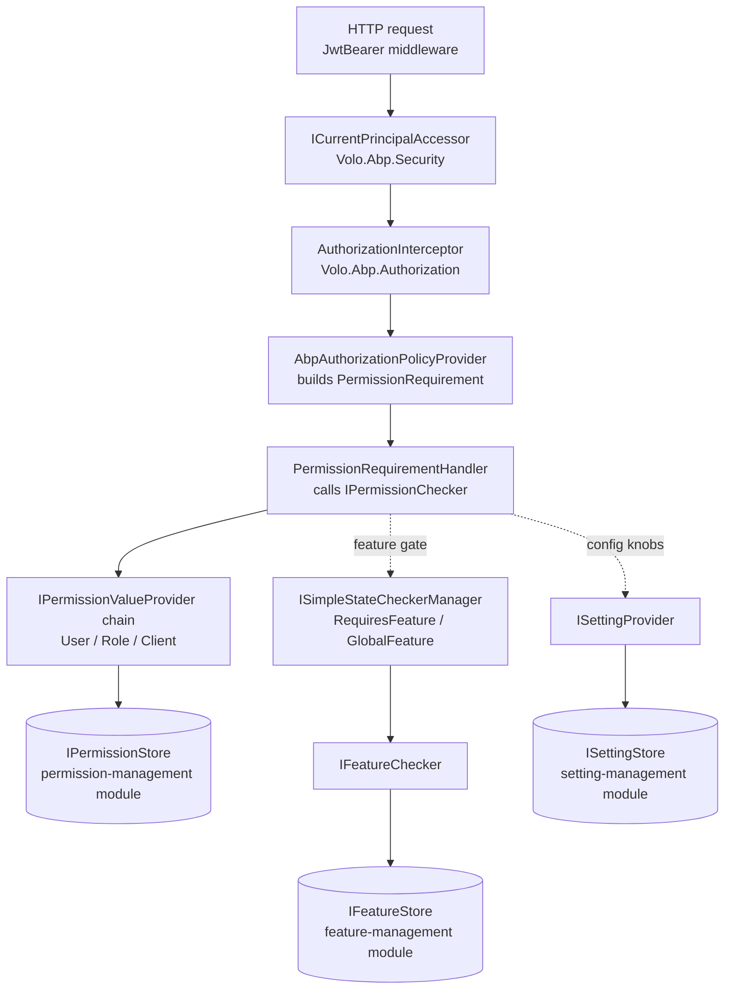

The ABP Framework ships a layered security stack split across several focused NuGet packages under `framework/src/`. This overview page walks through how `Volo.Abp.Security`, `Volo.Abp.Authorization`, `Volo.Abp.Features`, `Volo.Abp.GlobalFeatures`, and `Volo.Abp.Settings` plug together at runtime, what each one is responsible for, and which modules supply the database-backed persistence stores that the abstractions delegate to. The remaining pages in this `security/` section drill into each piece individually.

## What lives where

Every concept in the stack has a clear home assembly. The `framework/src/Volo.Abp.Security/Volo/Abp/Security/AbpSecurityModule.cs` module is the bottom of the stack — it knows nothing about HTTP, EF Core, or permissions; it only models the *current principal* via `ICurrentPrincipalAccessor` and `AbpClaimTypes`. Authorization, features, and settings all `[DependsOn(typeof(AbpSecurityModule))]` (see `framework/src/Volo.Abp.Settings/Volo/Abp/Settings/AbpSettingsModule.cs` and `framework/src/Volo.Abp.Authorization/Volo/Abp/Authorization/AbpAuthorizationModule.cs`).

| Package | Module class | Purpose |
| --- | --- | --- |
| `Volo.Abp.Security` | `AbpSecurityModule` | Claims, current user/client, claim factory |
| `Volo.Abp.Authorization.Abstractions` | `AbpAuthorizationAbstractionsModule` | Permission contracts, `PermissionRequirement` |
| `Volo.Abp.Authorization` | `AbpAuthorizationModule` | Permission checker, policy provider, interceptor |
| `Volo.Abp.Features` | `AbpFeaturesModule` | Tenant/edition features (toggle/numeric) |
| `Volo.Abp.GlobalFeatures` | `AbpGlobalFeaturesModule` | Compile-time / startup feature switches |
| `Volo.Abp.Settings` | `AbpSettingsModule` | Configurable runtime values |
| `Volo.Abp.Ldap.Abstractions` | `AbpLdapAbstractionsModule` | LDAP setting names contract |
| `Volo.Abp.Ldap` | `AbpLdapModule` | LDAP bind-based authentication |
| `Volo.Abp.IdentityModel` | `AbpIdentityModelModule` | OIDC token client + token cache |
| `Volo.Abp.Gdpr.Abstractions` | `AbpGdprAbstractionsModule` | GDPR ETOs and provider context |

## How a request flows through the stack

When an authenticated HTTP request hits an application service decorated with `[Authorize("MyApp.Books.Create")]`, ABP routes the check through five layers. The diagram below is a simplified, file-anchored view; each numbered box maps to a concrete type you can grep for.



The diagram intentionally splits **abstractions** (the boxes in white) from **persistence** (the cylinders). The framework packages ship `Null*` stores — `NullPermissionStore`, `NullFeatureStore`, `NullSettingStore` — so an application can run without any database. Pre-built modules in `modules/permission-management`, `modules/feature-management`, and `modules/setting-management` replace those with EF Core/MongoDB-backed implementations.

## Cross-cutting interceptors

Two ABP interceptors weave the stack into your application services without you writing any plumbing. The Castle-based interceptor `AuthorizationInterceptor` in `framework/src/Volo.Abp.Authorization/Volo/Abp/Authorization/AuthorizationInterceptor.cs` looks for `[Authorize]` / `[AllowAnonymous]` and calls `IMethodInvocationAuthorizationService`. The matching `FeatureInterceptor` in `framework/src/Volo.Abp.Features/Volo/Abp/Features/FeatureInterceptor.cs` handles `[RequiresFeature]`. Both are auto-registered by their modules' `PreConfigureServices` using `services.OnRegistered(...)`.

```csharp
// framework/src/Volo.Abp.Authorization/Volo/Abp/Authorization/AbpAuthorizationModule.cs
public override void PreConfigureServices(ServiceConfigurationContext context)
{
    context.Services.OnRegistered(AuthorizationInterceptorRegistrar.RegisterIfNeeded);
    AutoAddDefinitionProviders(context.Services);
}
```

`AuthorizationInterceptorRegistrar.ShouldIntercept` only attaches the interceptor when the type or one of its methods carries `AuthorizeAttribute`, which keeps the proxy overhead off types that don't need it. The `DisableAbpFeaturesAttribute` in `framework/src/Volo.Abp.Core/Volo/Abp/DisableAbpFeaturesAttribute.cs` lets you opt out per-class.

## Auto-discovery of providers

Every layer uses the same discovery pattern: a `PreConfigureServices` hook walks the DI container and collects implementations of an interface, then stuffs them into an options type. Search for `OnRegistered` to see the pattern repeated.

| Layer | Discovered interface | Options bag |
| --- | --- | --- |
| Security claims | `IAbpClaimsPrincipalContributor` | `AbpClaimsPrincipalFactoryOptions.Contributors` |
| Security claims (dynamic) | `IAbpDynamicClaimsPrincipalContributor` | `AbpClaimsPrincipalFactoryOptions.DynamicContributors` |
| Authorization | `IPermissionDefinitionProvider` | `AbpPermissionOptions.DefinitionProviders` |
| Features | `IFeatureDefinitionProvider` | `AbpFeatureOptions.DefinitionProviders` |
| Settings | `ISettingDefinitionProvider` | `AbpSettingOptions.DefinitionProviders` |

This is why simply implementing one of these interfaces in your module is enough — there's no `services.AddSingleton<...>` line needed.

## Where DB-backed persistence comes from

The framework packages here only define contracts. To get a working permission/feature/setting management UI plus persistence, you compose them with the matching application modules:

<CardGroup cols={2}>
  <Card title="Permission Management" icon="key" href="/modules/permission-management">
    EF Core / Mongo `IPermissionStore` + management app service that backs `IPermissionChecker`.
  </Card>
  <Card title="Feature Management" icon="toggle-on" href="/modules/feature-management">
    Tenant/edition `IFeatureStore` for `IFeatureChecker` and `[RequiresFeature]`.
  </Card>
  <Card title="Setting Management" icon="sliders" href="/modules/setting-management">
    `ISettingStore` + `ISettingManager` for tenant and user-scoped settings.
  </Card>
  <Card title="Identity" icon="user-shield" href="/modules/identity">
    Users, roles, the dynamic claims contributor cache, and IdentityServer/OpenIddict integration.
  </Card>
</CardGroup>

## Multi-tenancy is a first-class input

Every layer in the stack reads `ICurrentTenant` from `Volo.Abp.MultiTenancy`. The `PermissionChecker` in `framework/src/Volo.Abp.Authorization/Volo/Abp/Authorization/Permissions/PermissionChecker.cs` checks `permission.MultiTenancySide.HasFlag(multiTenancySide)`. The `TenantFeatureValueProvider` and `EditionFeatureValueProvider` resolve values per tenant. The `ClientPermissionValueProvider` even calls `CurrentTenant.Change(null)` so machine-to-machine clients are scoped at the host. See [Multi-Tenancy Overview](/multi-tenancy/overview) for the bigger picture.

```csharp
// framework/src/Volo.Abp.Authorization/Volo/Abp/Authorization/Permissions/ClientPermissionValueProvider.cs
using (CurrentTenant.Change(null))
{
    return await PermissionStore.IsGrantedAsync(context.Permission.Name, Name, clientId)
        ? PermissionGrantResult.Granted
        : PermissionGrantResult.Undefined;
}
```

## Where to read next

<Steps>
  <Step title="Claims & current user">
    [Security abstractions](/security/security-abstractions) covers `ICurrentPrincipalAccessor`, `AbpClaimTypes`, `ICurrentUser`, and the extension API.
  </Step>
  <Step title="Authorize attribute pipeline">
    [Authorization](/security/authorization) walks the interceptor → policy provider → handler flow.
  </Step>
  <Step title="Permissions definition + check">
    [Permissions](/security/permissions) explains `IPermissionDefinitionProvider`, value providers, and `IPermissionChecker.IsGrantedAsync`.
  </Step>
  <Step title="Feature toggles">
    [Features & feature management](/security/features-and-feature-management) and [Global features](/security/global-features) for the static vs tenant-scoped flavours.
  </Step>
  <Step title="Runtime settings">
    [Settings runtime](/security/settings-runtime) for the layered value providers.
  </Step>
  <Step title="Integrations">
    [LDAP](/security/ldap), [Simple state checking](/security/simple-state-checking), [GDPR](/security/gdpr), [Dynamic claims](/security/dynamic-claims), and [Identity model token client](/security/identity-model-token-client) cover the satellite packages.
  </Step>
</Steps>

## Companion topics outside this section

The security stack docked here is consumed by the broader framework. The HTTP API layer is wired up via [JWT bearer authentication](/aspnetcore/jwt-bearer-auth) — that's what populates the `ClaimsPrincipal` that `ICurrentPrincipalAccessor` exposes. The Identity, OpenIddict, and IdentityServer pre-built modules layer user/role storage on top of these abstractions.

<Tip>
If you only want to *use* the stack — define a permission, gate an API — you can skip the rest of this section and read [Permissions](/security/permissions) plus [Authorization](/security/authorization). The deeper pages are aimed at people writing framework-level integrations.
</Tip>
