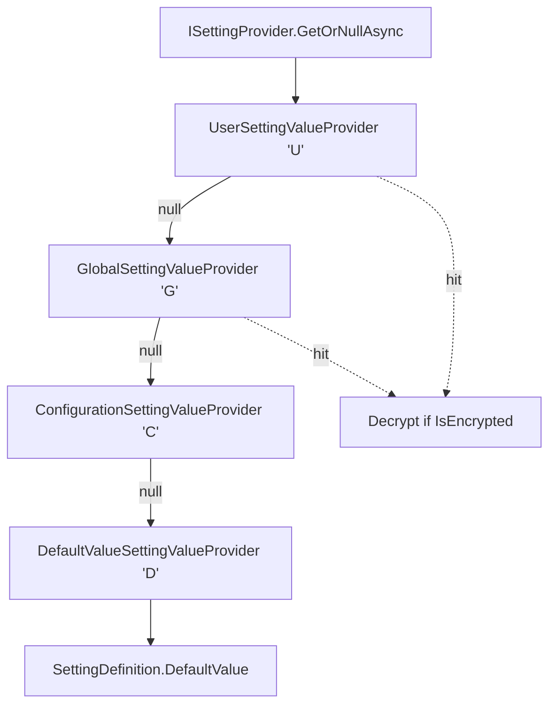

`Volo.Abp.Settings` in the ABP Framework is the runtime side of named configuration values — anything that an admin might want to tweak without redeploy (SMTP host, default time zone, email-verification-required flag, brand colors). This page covers `AbpSettingsModule` wiring, `SettingDefinition`, the four built-in `ISettingValueProvider`s, encryption via `ISettingEncryptionService`, and the contract pattern the [Setting Management module](/modules/setting-management) builds on top to provide `ISettingManager` (which lives outside the framework package, in the application module).

## Module wiring

`framework/src/Volo.Abp.Settings/Volo/Abp/Settings/AbpSettingsModule.cs` depends on `AbpLocalizationAbstractionsModule`, `AbpSecurityModule`, and `AbpDataModule`:

```csharp
[DependsOn(
    typeof(AbpLocalizationAbstractionsModule),
    typeof(AbpSecurityModule),
    typeof(AbpDataModule)
)]
public class AbpSettingsModule : AbpModule
{
    public override void PreConfigureServices(ServiceConfigurationContext context)
    {
        AutoAddDefinitionProviders(context.Services);
    }

    public override void ConfigureServices(ServiceConfigurationContext context)
    {
        Configure<AbpSettingOptions>(options =>
        {
            options.ValueProviders.Add<DefaultValueSettingValueProvider>();
            options.ValueProviders.Add<ConfigurationSettingValueProvider>();
            options.ValueProviders.Add<GlobalSettingValueProvider>();
            options.ValueProviders.Add<UserSettingValueProvider>();
        });
    }
}
```

The providers are added Default → Configuration → Global → User. The checker reverses this list, so the *effective lookup order* is User → Global → Configuration → Default. A per-user setting always wins over a global override, which wins over `appsettings.json`, which wins over the hardcoded `DefaultValue`.

`AutoAddDefinitionProviders` works exactly like its peers — every concrete `ISettingDefinitionProvider` is collected via `OnRegistered` and added to `AbpSettingOptions.DefinitionProviders`.

<Note>
The setup-time providers in this framework package cover non-tenanted cases (per-user and globally). The [Setting Management module](/modules/setting-management) adds a fifth provider that pulls per-tenant overrides from the `Settings` table, slots between `GlobalSettingValueProvider` and `UserSettingValueProvider`, and also supplies `ISettingManager` so admins can update values at runtime.
</Note>

## `AbpSettingOptions`

`framework/src/Volo.Abp.Settings/Volo/Abp/Settings/AbpSettingOptions.cs`:

```csharp
public class AbpSettingOptions
{
    public ITypeList<ISettingDefinitionProvider> DefinitionProviders { get; }
    public ITypeList<ISettingValueProvider> ValueProviders { get; }
    public HashSet<string> DeletedSettings { get; }
    public bool ReturnOriginalValueIfDecryptFailed { get; set; }
}
```

`ReturnOriginalValueIfDecryptFailed` defaults to `true`. Use case: a setting was stored unencrypted, you flipped `SettingDefinition.IsEncrypted` to `true` in a later release, and existing rows in the store are still plain text. With the flag on, `SettingEncryptionService.Decrypt` catches the failure and returns the raw string so the value isn't lost on first read.

## `SettingDefinition`

`framework/src/Volo.Abp.Settings/Volo/Abp/Settings/SettingDefinition.cs`:

```csharp
public class SettingDefinition
{
    public string Name { get; }
    public ILocalizableString DisplayName { get; set; }
    public ILocalizableString? Description { get; set; }
    public string? DefaultValue { get; set; }
    public bool IsVisibleToClients { get; set; }
    public List<string> Providers { get; }
    public bool IsInherited { get; set; }
    public Dictionary<string, object> Properties { get; }
    public bool IsEncrypted { get; set; }
}
```

| Field | Default | Effect |
| --- | --- | --- |
| `Name` | required | Lookup key for `ISettingProvider.GetOrNullAsync` |
| `DefaultValue` | `null` | Returned by `DefaultValueSettingValueProvider` |
| `IsVisibleToClients` | `false` | Controls inclusion in `/api/abp/application-configuration` — keep `false` for secrets |
| `Providers` | empty | Whitelist of provider names (`"U"`, `"T"`, `"G"`, `"D"`, `"C"`); empty = all |
| `IsInherited` | `true` | Reserved — currently noted with a `TODO` in `SettingProvider` |
| `IsEncrypted` | `false` | When `true`, store roundtrips through `ISettingEncryptionService` |

A definition provider looks like:

```csharp
public class EmailSettingsDefinitionProvider : SettingDefinitionProvider
{
    public override void Define(ISettingDefinitionContext context)
    {
        context.Add(
            new SettingDefinition("Abp.Mailing.DefaultFromAddress",
                "noreply@example.com",
                isVisibleToClients: false),

            new SettingDefinition("Abp.Mailing.Smtp.Password",
                "",
                isVisibleToClients: false,
                isEncrypted: true)
        );
    }
}
```

## `ISettingDefinitionContext`

```csharp
public interface ISettingDefinitionContext
{
    SettingDefinition? GetOrNull(string name);
    IReadOnlyList<SettingDefinition> GetAll();
    void Add(params SettingDefinition[] definitions);
}
```

Simpler than the permission/feature contexts (no groups). The `SettingDefinitionProvider` base class supplies a `LocalizableString L(string name)` helper for localized display names, identical to the pattern in the other definition systems.

## `ISettingDefinitionManager`

```csharp
public interface ISettingDefinitionManager
{
    Task<SettingDefinition> GetAsync(string name);
    Task<IReadOnlyList<SettingDefinition>> GetAllAsync();
    Task<SettingDefinition?> GetOrNullAsync(string name);
}
```

Default `SettingDefinitionManager` (in `SettingDefinitionManager.cs`) merges `IStaticSettingDefinitionStore` and `IDynamicSettingDefinitionStore`. `NullDynamicSettingDefinitionStore` is the no-op fallback; the setting-management module ships a database-backed implementation.

## `ISettingProvider`

The runtime-facing read API in `framework/src/Volo.Abp.Settings/Volo/Abp/Settings/ISettingProvider.cs`:

```csharp
public interface ISettingProvider
{
    Task<string?> GetOrNullAsync(string name);
    Task<List<SettingValue>> GetAllAsync(string[] names);
    Task<List<SettingValue>> GetAllAsync();
}
```

The default `SettingProvider` (`SettingProvider.cs`) reverses the provider list, optionally filters by `Providers`, and decrypts when needed:

```csharp
public virtual async Task<string?> GetOrNullAsync(string name)
{
    var setting = await SettingDefinitionManager.GetOrNullAsync(name);
    if (setting == null) return null;

    var providers = Enumerable.Reverse(SettingValueProviderManager.Providers);
    if (setting.Providers.Any())
        providers = providers.Where(p => setting.Providers.Contains(p.Name));

    var value = await GetOrNullValueFromProvidersAsync(providers, setting);
    if (value != null && setting.IsEncrypted)
        value = SettingEncryptionService.Decrypt(setting, value);

    return value;
}
```

`SettingProviderExtensions` (same folder) adds typed helpers:

```csharp
public static async Task<bool> IsTrueAsync(this ISettingProvider provider, string name);
public static async Task<T>    GetAsync<T>(this ISettingProvider provider, string name, T defaultValue = default)
    where T : struct;
```

Both follow the same pattern as the feature-checker counterparts — string-only at the contract level, typed conversion via `.To<T>()` at the helper layer.

## Built-in value providers



### `UserSettingValueProvider` (`"U"`)

```csharp
public override async Task<string?> GetOrNullAsync(SettingDefinition setting)
{
    if (CurrentUser.Id == null) return null;
    return await SettingStore.GetOrNullAsync(setting.Name, Name, CurrentUser.Id.ToString());
}
```

Reads `ICurrentUser.Id` and asks the store for `(name, "U", userId)`. Returns `null` when no user is signed in so the next provider can win.

### `GlobalSettingValueProvider` (`"G"`)

```csharp
public override Task<string?> GetOrNullAsync(SettingDefinition setting)
{
    return SettingStore.GetOrNullAsync(setting.Name, Name, null);
}
```

Single, tenant-agnostic record. The provider key is `null`.

### `ConfigurationSettingValueProvider` (`"C"`)

```csharp
public const string ConfigurationNamePrefix = "Settings:";

public virtual Task<string?> GetOrNullAsync(SettingDefinition setting)
{
    return Task.FromResult(Configuration[ConfigurationNamePrefix + setting.Name]);
}
```

Reads `IConfiguration["Settings:" + name]`. Any provider that `Microsoft.Extensions.Configuration` supports — `appsettings.json`, environment variables, Azure Key Vault, command-line — feeds this. The prefix is fixed so you can declare a whole `Settings` section in `appsettings.json` without colliding with other config.

### `DefaultValueSettingValueProvider` (`"D"`)

```csharp
public override Task<string?> GetOrNullAsync(SettingDefinition setting)
{
    return Task.FromResult(setting.DefaultValue);
}
```

The terminal fallback — returns the value baked into `SettingDefinition` at registration time.

| Provider | `Name` | Source | Provider key |
| --- | --- | --- | --- |
| `UserSettingValueProvider` | `"U"` | `ISettingStore` | `CurrentUser.Id` |
| `GlobalSettingValueProvider` | `"G"` | `ISettingStore` | `null` |
| `ConfigurationSettingValueProvider` | `"C"` | `IConfiguration` | (`Settings:` prefix) |
| `DefaultValueSettingValueProvider` | `"D"` | `SettingDefinition` | (`DefaultValue`) |

## `ISettingStore`

```csharp
public interface ISettingStore
{
    Task<string?> GetOrNullAsync(string name, string? providerName, string? providerKey);
    Task<List<SettingValue>> GetAllAsync(string[] names, string? providerName, string? providerKey);
}
```

`NullSettingStore` returns `null` for everything — out of the box, with only the framework package, only `DefaultValueSettingValueProvider` and `ConfigurationSettingValueProvider` resolve values. The [Setting Management module](/modules/setting-management) ships the EF Core / MongoDB store backed by a `Settings` table keyed on `(Name, ProviderName, ProviderKey, TenantId)`, plus a tenant-scoped value provider that slots in between the global and user providers.

## Encryption

`framework/src/Volo.Abp.Settings/Volo/Abp/Settings/SettingEncryptionService.cs`:

```csharp
public class SettingEncryptionService : ISettingEncryptionService, ITransientDependency
{
    public virtual string? Encrypt(SettingDefinition settingDefinition, string? plainValue)
    {
        if (plainValue.IsNullOrEmpty()) return plainValue;
        return StringEncryptionService.Encrypt(plainValue);
    }

    public virtual string? Decrypt(SettingDefinition settingDefinition, string? encryptedValue)
    {
        if (encryptedValue.IsNullOrEmpty()) return encryptedValue;
        try
        {
            return StringEncryptionService.Decrypt(encryptedValue);
        }
        catch (Exception e)
        {
            if (Options.Value.ReturnOriginalValueIfDecryptFailed)
            {
                Logger.LogWarning(e, "Failed to decrypt the setting: {0}. Returning the original value...", settingDefinition.Name);
                return encryptedValue;
            }
            Logger.LogException(e);
            return string.Empty;
        }
    }
}
```

`IStringEncryptionService` comes from `Volo.Abp.Security.Encryption` and uses a symmetric key configured via `AbpStringEncryptionOptions.DefaultPassPhrase` (see [Security Abstractions](/security/security-abstractions)). Always set a strong pass phrase per environment — the default value is *not* safe for production.

Decryption is only invoked for values that actually came from `ISettingStore` (provider keys `"U"`, `"G"`, or any custom store-backed provider). Configuration values are not decrypted — if you want encrypted values in `appsettings.json`, wire them through Data Protection or Key Vault at the `IConfiguration` layer instead.

## Cross-cutting access in services

In application services, `ISettingProvider` is the everyday API:

```csharp
public class EmailSenderService : ApplicationService
{
    private readonly ISettingProvider _settings;
    public EmailSenderService(ISettingProvider settings) { _settings = settings; }

    public async Task SendAsync(string to, string subject, string body)
    {
        var fromAddress = await _settings.GetOrNullAsync("Abp.Mailing.DefaultFromAddress");
        var smtpHost   = await _settings.GetOrNullAsync("Abp.Mailing.Smtp.Host");
        var smtpPort   = await _settings.GetAsync<int>("Abp.Mailing.Smtp.Port", 25);
        // ...
    }
}
```

Because `UserSettingValueProvider` consults `ICurrentUser`, the same call returns different values for different users at runtime. Wrap with `using (CurrentTenant.Change(tenantId))` to switch tenant context (see [Multi-tenancy overview](/multi-tenancy/overview)) — the setting-management module's tenant provider will then resolve the right row.

## Writing settings: `ISettingManager`

`ISettingManager` is *not* in the framework package — it ships with the [Setting Management module](/modules/setting-management) alongside its concrete `ISettingStore`. The framework package is deliberately read-only; everything in `Volo.Abp.Settings` is built to *resolve* a value, and the management module owns the write API:

```csharp
// from Volo.Abp.SettingManagement
public interface ISettingManager
{
    Task<string?> GetOrNullForCurrentTenantAsync(string name, bool fallback = true);
    Task SetForCurrentTenantAsync(string name, string? value, bool forceToSet = false);
    Task SetForUserAsync(IdentityUser user, string name, string? value, bool forceToSet = false);
    Task SetGlobalAsync(string name, string? value);
    // ...
}
```

This split lets a host run with only `Volo.Abp.Settings` (e.g. a CLI tool that only reads `IConfiguration`) without pulling in the EF/Mongo dependency required by the management module.

## End-to-end summary

| Layer | Component | File |
| --- | --- | --- |
| Module | `AbpSettingsModule` | `AbpSettingsModule.cs` |
| Options | `AbpSettingOptions` | `AbpSettingOptions.cs` |
| Definitions | `ISettingDefinitionProvider`, `SettingDefinition` | `ISettingDefinitionProvider.cs`, `SettingDefinition.cs` |
| Manager | `ISettingDefinitionManager` | `ISettingDefinitionManager.cs` |
| Provider | `ISettingProvider`, `SettingProvider` | `ISettingProvider.cs`, `SettingProvider.cs` |
| Value providers | `UserSettingValueProvider`, `GlobalSettingValueProvider`, `ConfigurationSettingValueProvider`, `DefaultValueSettingValueProvider` | same folder |
| Store | `ISettingStore`, `NullSettingStore` | `ISettingStore.cs`, `NullSettingStore.cs` |
| Encryption | `ISettingEncryptionService`, `SettingEncryptionService` | `ISettingEncryptionService.cs`, `SettingEncryptionService.cs` |
| Helpers | `SettingProviderExtensions` (`IsTrueAsync`, `GetAsync<T>`) | `SettingProviderExtensions.cs` |

## Related pages and modules

- [Setting Management module](/modules/setting-management) — `ISettingManager`, EF/Mongo store, admin UI, tenant provider.
- [Security Abstractions](/security/security-abstractions) — `IStringEncryptionService`, `ICurrentUser`.
- [Multi-tenancy overview](/multi-tenancy/overview) — `ICurrentTenant.Change` for tenant-scoped settings.
- [LDAP](/security/ldap) — uses `ISettingProvider` for connection metadata.
- [Features](/security/features-and-feature-management) — companion system for tenant/edition toggles.
- [Identity module](/modules/identity) — defines many user-facing settings (lockout, password policy).
