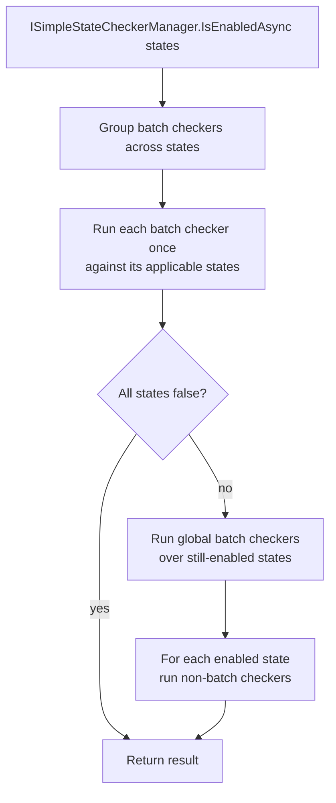

`Volo.Abp.SimpleStateChecking` (in `Volo.Abp.Core`) is a small framework the ABP team uses across the security stack to attach *conditions* to definitions — "this permission is only enabled when these features are on", "this setting only applies to the host", "this menu item only appears if the user passes a custom check". This page covers `IHasSimpleStateCheckers<TState>`, the single and batch checker contracts, `SimpleStateCheckerManager`, and serialization for dynamic definition stores. It complements the consumers — `PermissionDefinition` and `FeatureDefinition` — covered in [Permissions](/security/permissions) and [Features](/security/features-and-feature-management).

## Why a separate abstraction?

`PermissionDefinition` and `FeatureDefinition` both need to say "before checking value providers, ask if this definition is even applicable right now". The conditions are usually one-liners: a global feature is enabled, the user has another permission, the tenant has a specific edition. Rather than baking those into each definition type, ABP factors them out so the same `RequireGlobalFeatures(...)` check can decorate a permission *and* a feature *and* (in the future) a setting, with one implementation.

The package lives at `framework/src/Volo.Abp.Core/Volo/Abp/SimpleStateChecking/` — it ships in `Volo.Abp.Core` because so many other packages depend on it, and it has no dependencies of its own beyond the core.

## `IHasSimpleStateCheckers<TState>`

`framework/src/Volo.Abp.Core/Volo/Abp/SimpleStateChecking/IHasSimpleStateCheckers.cs`:

```csharp
public interface IHasSimpleStateCheckers<TState>
    where TState : IHasSimpleStateCheckers<TState>
{
    List<ISimpleStateChecker<TState>> StateCheckers { get; }
}
```

The recursive generic constraint (`TState : IHasSimpleStateCheckers<TState>`) means a `PermissionDefinition` only carries `ISimpleStateChecker<PermissionDefinition>`, never a `FeatureDefinition` checker. This compile-time discrimination is what makes one fluent extension (`.RequireGlobalFeatures(...)`) work on both definition types — the generic constraint picks the right checker shape.

`PermissionDefinition.cs` ([Permissions](/security/permissions)) and `FeatureDefinition.cs` ([Features](/security/features-and-feature-management)) both implement this interface.

## `ISimpleStateChecker<TState>` and the context

`framework/src/Volo.Abp.Core/Volo/Abp/SimpleStateChecking/ISimpleStateChecker.cs`:

```csharp
public interface ISimpleStateChecker<TState>
    where TState : IHasSimpleStateCheckers<TState>
{
    Task<bool> IsEnabledAsync(SimpleStateCheckerContext<TState> context);
}
```

`SimpleStateCheckerContext` (`SimpleStateCheckerContext.cs`) carries the service provider and the single state being checked:

```csharp
public class SimpleStateCheckerContext<TState>
    where TState : IHasSimpleStateCheckers<TState>
{
    public IServiceProvider ServiceProvider { get; }
    public TState State { get; }
}
```

The `ServiceProvider` is what makes checkers powerful. A checker resolves any service it needs — `IFeatureChecker`, `ICurrentUser`, custom services — straight from `context.ServiceProvider`. There's no DI on the checker itself (it's a value object stored in a `List<>`), which keeps definitions serializable.

## `ISimpleBatchStateChecker<TState>`

`framework/src/Volo.Abp.Core/Volo/Abp/SimpleStateChecking/ISimpleBatchStateChecker.cs` extends the single-state interface:

```csharp
public interface ISimpleBatchStateChecker<TState> : ISimpleStateChecker<TState>
    where TState : IHasSimpleStateCheckers<TState>
{
    Task<SimpleStateCheckerResult<TState>> IsEnabledAsync(SimpleBatchStateCheckerContext<TState> context);
}
```

`SimpleBatchStateCheckerContext` (`SimpleBatchStateCheckerContext.cs`):

```csharp
public class SimpleBatchStateCheckerContext<TState>
    where TState : IHasSimpleStateCheckers<TState>
{
    public IServiceProvider ServiceProvider { get; }
    public TState[] States { get; }
}
```

`SimpleStateCheckerResult<TState>` is a `Dictionary<TState, bool>` (`SimpleStateCheckerResult.cs`). Batch checkers are the right choice when one underlying lookup can answer for many states at once — for example, a single query to `IPermissionStore` covers a hundred permission names.

`SimpleBatchStateCheckerBase<TState>` (`SimpleBatchStateCheckerBase.cs`) is the convenient base — it implements the single-state interface by delegating to its own batch method:

```csharp
public abstract class SimpleBatchStateCheckerBase<TState> : ISimpleBatchStateChecker<TState>
    where TState : IHasSimpleStateCheckers<TState>
{
    public async Task<bool> IsEnabledAsync(SimpleStateCheckerContext<TState> context)
    {
        return (await IsEnabledAsync(
            new SimpleBatchStateCheckerContext<TState>(
                context.ServiceProvider, new[] { context.State })))
            .Values.All(x => x);
    }

    public abstract Task<SimpleStateCheckerResult<TState>> IsEnabledAsync(SimpleBatchStateCheckerContext<TState> context);
}
```

That's why most concrete checkers (e.g. `RequirePermissionsSimpleBatchStateChecker` in the authorization package) inherit `SimpleBatchStateCheckerBase` rather than implementing `ISimpleStateChecker` twice.

## `AbpSimpleStateCheckerOptions<TState>`

`framework/src/Volo.Abp.Core/Volo/Abp/SimpleStateChecking/AbpSimpleStateCheckerOptions.cs`:

```csharp
public class AbpSimpleStateCheckerOptions<TState>
    where TState : IHasSimpleStateCheckers<TState>
{
    public ITypeList<ISimpleStateChecker<TState>> GlobalStateCheckers { get; }
}
```

`GlobalStateCheckers` apply to *every* `TState` of that type — they're the place to install a cross-cutting condition. For example, an enterprise host could add a `MaintenanceModeStateChecker<PermissionDefinition>` that returns `false` for every permission during a maintenance window, instantly locking the app down via one Configure call:

```csharp
Configure<AbpSimpleStateCheckerOptions<PermissionDefinition>>(options =>
{
    options.GlobalStateCheckers.Add<MaintenanceModeStateChecker<PermissionDefinition>>();
});
```

## `ISimpleStateCheckerManager<TState>`

`framework/src/Volo.Abp.Core/Volo/Abp/SimpleStateChecking/ISimpleStateCheckerManager.cs`:

```csharp
public interface ISimpleStateCheckerManager<TState>
    where TState : IHasSimpleStateCheckers<TState>
{
    Task<bool> IsEnabledAsync(TState state);
    Task<SimpleStateCheckerResult<TState>> IsEnabledAsync(TState[] states);
}
```

The default `SimpleStateCheckerManager<TState>` (`SimpleStateCheckerManager.cs`) is the orchestrator. It composes two pools of checkers — per-state `StateCheckers` and the `GlobalStateCheckers` from options — and AND-merges results.

### Single-state path

```csharp
public virtual async Task<bool> IsEnabledAsync(TState state)
{
    return await InternalIsEnabledAsync(state, true);
}

protected virtual async Task<bool> InternalIsEnabledAsync(TState state, bool useBatchChecker)
{
    using (var scope = ServiceProvider.CreateScope())
    {
        var context = new SimpleStateCheckerContext<TState>(
            scope.ServiceProvider.GetRequiredService<ICachedServiceProvider>(), state);

        foreach (var provider in state.StateCheckers
            .WhereIf(!useBatchChecker, x => x is not ISimpleBatchStateChecker<TState>))
        {
            if (!await provider.IsEnabledAsync(context)) return false;
        }

        foreach (ISimpleStateChecker<TState> provider in Options.GlobalStateCheckers
            .WhereIf(!useBatchChecker, x => !typeof(ISimpleBatchStateChecker<TState>).IsAssignableFrom(x))
            .Select(x => ServiceProvider.GetRequiredService(x)))
        {
            if (!await provider.IsEnabledAsync(context)) return false;
        }
        return true;
    }
}
```

Three things to notice:

- The manager creates a `IServiceScope` per call and passes the *cached* service provider into the context. That keeps repeated resolutions of `IFeatureChecker`, `ICurrentUser`, etc. cheap during a single check.
- Per-state checkers run before global ones.
- It is AND semantics — one `false` ends the loop. There is no notion of "vote-and-merge"; if you need OR-of-checkers, write a single checker that wraps an OR.

### Batch path

```csharp
public virtual async Task<SimpleStateCheckerResult<TState>> IsEnabledAsync(TState[] states)
{
    var result = new SimpleStateCheckerResult<TState>(states);
    using (var scope = ServiceProvider.CreateScope())
    {
        var batchStateCheckers = states.SelectMany(x => x.StateCheckers)
            .Where(x => x is ISimpleBatchStateChecker<TState>)
            .Cast<ISimpleBatchStateChecker<TState>>()
            .GroupBy(x => x).Select(x => x.Key);

        foreach (var stateChecker in batchStateCheckers)
        {
            var context = new SimpleBatchStateCheckerContext<TState>(
                scope.ServiceProvider.GetRequiredService<ICachedServiceProvider>(),
                states.Where(x => x.StateCheckers.Contains(stateChecker)).ToArray());

            foreach (var x in await stateChecker.IsEnabledAsync(context))
                result[x.Key] = x.Value;

            if (result.Values.All(x => !x)) return result;
        }

        // global batch checkers, then non-batch state checkers per state…
    }
}
```

The batch path is the optimization that makes "give me all 200 permissions for this user" tractable. It groups identical batch checkers across states (so a single `RequirePermissionsSimpleBatchStateChecker` is invoked once with the union of permission names it gates) and short-circuits when every state has fallen to `false`.

After batch checkers run, the manager iterates each state again with the *single-state* `InternalIsEnabledAsync(state, useBatchChecker: false)` to apply non-batch checkers — only the ones not already covered by a batch checker:

```csharp
foreach (var state in states)
{
    if (result[state])
    {
        result[state] = await InternalIsEnabledAsync(state, false);
    }
}
```



## Consumer integration: how a permission uses it

Inside `PermissionChecker.IsGrantedAsync` ([Permissions](/security/permissions)) the state-checker gate is one line:

```csharp
if (!await StateCheckerManager.IsEnabledAsync(permission)) return false;
```

`StateCheckerManager` is `ISimpleStateCheckerManager<PermissionDefinition>`, registered as a transient by the framework. The same line appears in feature evaluation paths via `RequireFeaturesSimpleStateChecker<TState>`.

### Concrete checker: `RequirePermissionsSimpleBatchStateChecker`

Used by `PermissionSimpleStateCheckerExtensions.RequirePermissions(...)` in `Volo.Abp.Authorization`, this is a batch checker that calls `IPermissionChecker.IsGrantedAsync(string[] names)` once and distributes the result:

```csharp
// in framework/src/Volo.Abp.Authorization/Volo/Abp/Authorization/Permissions/
public class RequirePermissionsSimpleBatchStateChecker
    : SimpleBatchStateCheckerBase<PermissionDefinition>
{
    // …
}
```

It illustrates the batch idiom: one underlying I/O call (`IPermissionStore.IsGrantedAsync`) is collapsed across a list of permission names that all depend on the same gate.

## Serialization

`framework/src/Volo.Abp.Core/Volo/Abp/SimpleStateChecking/ISimpleStateCheckerSerializer.cs` and its default `SimpleStateCheckerSerializer`:

```csharp
public class SimpleStateCheckerSerializer : ISimpleStateCheckerSerializer, ISingletonDependency
{
    private readonly IEnumerable<ISimpleStateCheckerSerializerContributor> _contributors;

    public string? Serialize<TState>(ISimpleStateChecker<TState> checker)
        where TState : IHasSimpleStateCheckers<TState>
    {
        foreach (var contributor in _contributors)
        {
            var result = contributor.SerializeToJson(checker);
            if (result != null) return result;
        }
        return null;
    }

    public ISimpleStateChecker<TState>? Deserialize<TState>(JsonObject jsonObject, TState state)
        where TState : IHasSimpleStateCheckers<TState>
    {
        foreach (var contributor in _contributors)
        {
            var result = contributor.Deserialize(jsonObject, state);
            if (result != null) return result;
        }
        return null;
    }
}
```

`ISimpleStateCheckerSerializerContributor` is an open-ended hook: each package that ships checkers also ships a contributor that knows how to serialize them. Examples in the source tree:

| Package | Contributor |
| --- | --- |
| `Volo.Abp.Authorization` | `AuthenticatedSimpleStateCheckerSerializerContributor`, `PermissionsSimpleStateCheckerSerializerContributor` |
| `Volo.Abp.Features` | `FeaturesSimpleStateCheckerSerializerContributor` |
| `Volo.Abp.GlobalFeatures` | `GlobalFeaturesSimpleStateCheckerSerializerContributor` |

This is what lets the [permission-management module](/modules/permission-management) and [feature-management module](/modules/feature-management) round-trip dynamic definitions — a permission defined at runtime can carry `RequireGlobalFeatures` or `RequirePermissions` conditions, persist them as JSON, and re-hydrate to the right checker type on the next request.

## Authoring a checker

A minimal custom checker — "permission is only enabled on weekends" — looks like:

```csharp
public class WeekendOnlyStateChecker<TState> : ISimpleStateChecker<TState>
    where TState : IHasSimpleStateCheckers<TState>
{
    public Task<bool> IsEnabledAsync(SimpleStateCheckerContext<TState> context)
    {
        var clock = context.ServiceProvider.GetRequiredService<IClock>();
        var now = clock.Now.DayOfWeek;
        return Task.FromResult(now is DayOfWeek.Saturday or DayOfWeek.Sunday);
    }
}
```

Attach it on definition:

```csharp
permission.StateCheckers.Add(new WeekendOnlyStateChecker<PermissionDefinition>());
```

If you want this serializable (so a dynamic-store-backed admin UI can persist it), additionally implement `ISimpleStateCheckerSerializerContributor` and register the checker JSON shape — that's the whole onboarding.

## Summary

| Concept | Type | File |
| --- | --- | --- |
| Stateful definition | `IHasSimpleStateCheckers<TState>` | `IHasSimpleStateCheckers.cs` |
| Checker contract | `ISimpleStateChecker<TState>` | `ISimpleStateChecker.cs` |
| Batch checker | `ISimpleBatchStateChecker<TState>` / `SimpleBatchStateCheckerBase<TState>` | `ISimpleBatchStateChecker.cs`, `SimpleBatchStateCheckerBase.cs` |
| Options | `AbpSimpleStateCheckerOptions<TState>.GlobalStateCheckers` | `AbpSimpleStateCheckerOptions.cs` |
| Manager | `ISimpleStateCheckerManager<TState>` / `SimpleStateCheckerManager<TState>` | `ISimpleStateCheckerManager.cs`, `SimpleStateCheckerManager.cs` |
| Result | `SimpleStateCheckerResult<TState>` | `SimpleStateCheckerResult.cs` |
| Serialization | `ISimpleStateCheckerSerializer` + `ISimpleStateCheckerSerializerContributor` | `SimpleStateCheckerSerializer.cs` |

## Related pages and modules

- [Permissions](/security/permissions) — `PermissionDefinition.StateCheckers` and `RequirePermissions/RequireAuthenticated`.
- [Features](/security/features-and-feature-management) — `RequireFeaturesSimpleStateChecker`.
- [Global Features](/security/global-features) — `RequireGlobalFeaturesSimpleStateChecker`.
- [Authorization](/security/authorization) — consumer of state-gated permissions.
- [Permission Management module](/modules/permission-management) — persists checker JSON for dynamic definitions.
- [Feature Management module](/modules/feature-management) — same, for dynamic feature definitions.
