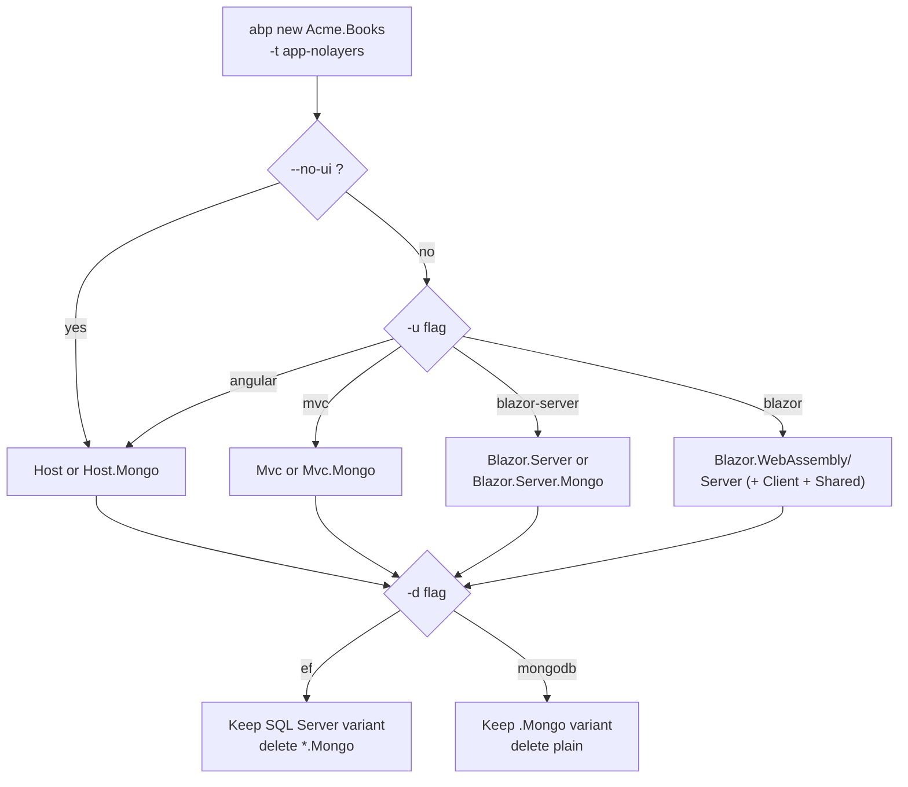

`templates/app-nolayers/` is the ABP Framework's *minimalist* counterpart to the layered `app/` template. Everything that the layered solution splits across nine projects (Domain.Shared, Domain, Application.Contracts, Application, EntityFrameworkCore, HttpApi, HttpApi.Host, Web, DbMigrator) collapses into a **single** project per UI/database combination. This page covers what the nolayer template ships, why the layout differs from the layered one, and the four UI×database variants packaged inside.

## Solution layout

`templates/app-nolayers/MyCompanyName.MyProjectName.slnx` is a flat list of project paths — no `<Folder>` grouping because there is only one tier:

```xml templates/app-nolayers/aspnet-core/MyCompanyName.MyProjectName.slnx
<Solution>
  <Project Path="MyCompanyName.MyProjectName.Blazor.Server.Mongo/MyCompanyName.MyProjectName.Blazor.Server.Mongo.csproj" />
  <Project Path="MyCompanyName.MyProjectName.Blazor.Server/MyCompanyName.MyProjectName.Blazor.Server.csproj" />
  <Project Path="MyCompanyName.MyProjectName.Blazor.WebAssembly/Client/MyCompanyName.MyProjectName.Blazor.WebAssembly.Client.csproj" />
  <Project Path="MyCompanyName.MyProjectName.Blazor.WebAssembly/Server.Mongo/MyCompanyName.MyProjectName.Blazor.WebAssembly.Server.Mongo.csproj" />
  <Project Path="MyCompanyName.MyProjectName.Blazor.WebAssembly/Server/MyCompanyName.MyProjectName.Blazor.WebAssembly.Server.csproj" />
  <Project Path="MyCompanyName.MyProjectName.Blazor.WebAssembly/Shared/MyCompanyName.MyProjectName.Blazor.WebAssembly.Shared.csproj" />
  <Project Path="MyCompanyName.MyProjectName.Host.Mongo/MyCompanyName.MyProjectName.Host.Mongo.csproj" />
  <Project Path="MyCompanyName.MyProjectName.Host/MyCompanyName.MyProjectName.Host.csproj" />
  <Project Path="MyCompanyName.MyProjectName.Mvc.Mongo/MyCompanyName.MyProjectName.Mvc.Mongo.csproj" />
  <Project Path="MyCompanyName.MyProjectName.Mvc/MyCompanyName.MyProjectName.Mvc.csproj" />
</Solution>
```

Ten projects — five UI variants × two databases. The CLI step `AppNoLayersTemplateBase.GetCustomSteps` keeps only one of them.

## The five UI variants

| Folder name | UI | Database | Description |
|---|---|---|---|
| `MyCompanyName.MyProjectName.Mvc/` | MVC + Razor Pages | EF Core / SQL Server | Server-rendered single-project app |
| `MyCompanyName.MyProjectName.Mvc.Mongo/` | MVC + Razor Pages | MongoDB | Same MVC project against documents |
| `MyCompanyName.MyProjectName.Host/` | None (API only) | EF Core / SQL Server | Headless API used by the Angular companion |
| `MyCompanyName.MyProjectName.Host.Mongo/` | None | MongoDB | Headless API with documents |
| `MyCompanyName.MyProjectName.Blazor.Server/` | Blazor Server | EF Core / SQL Server | Single Blazor Server project |
| `MyCompanyName.MyProjectName.Blazor.Server.Mongo/` | Blazor Server | MongoDB | Blazor Server with documents |
| `MyCompanyName.MyProjectName.Blazor.WebAssembly/Client/` | Blazor WASM (client lib) | n/a | Shared component library |
| `MyCompanyName.MyProjectName.Blazor.WebAssembly/Server/` | Blazor WASM host | EF Core / SQL Server | WASM static-host with API |
| `MyCompanyName.MyProjectName.Blazor.WebAssembly/Server.Mongo/` | Blazor WASM host | MongoDB | Same with documents |
| `MyCompanyName.MyProjectName.Blazor.WebAssembly/Shared/` | Shared DTO library | n/a | Cross-tier types |

`templates/app-nolayers/aspnet-core/README.md` explicitly markets this template:

> This is a minimalist, non-layered startup solution with the ABP Framework. All the fundamental ABP modules are already installed.

## How nolayer differs from layered

| Concern | Layered (`app/`) | NoLayers (`app-nolayers/`) |
|---|---|---|
| Domain logic | `Domain.Shared` + `Domain` | folder inside Host: `Entities/`, `Data/` |
| DTOs | `Application.Contracts` | folder inside Host: `Services/` |
| Application services | `Application` | folder inside Host: `Services/` |
| Persistence | `EntityFrameworkCore` (+ `MongoDB`) | `Data/` folder + `Migrations/` |
| HTTP controllers | `HttpApi` | `Controllers/` folder |
| HTTP host | `HttpApi.Host` / `HttpApi.HostWithIds` | the Host project itself |
| DbMigrator | dedicated console project | `Program.cs` accepts `migrate-database` arg |
| UI host | separate `Web` or `Blazor.Server` | merged into the same project |
| Tests | 5+ test projects | none |
| `*.abppkg` files | per project | one per nolayer host |

The Host project is therefore *vertically integrated* — all subfolders (`Entities/`, `Data/`, `Services/`, `Controllers/`, `Pages/` for MVC, `Components/` for Blazor) live next to one another. This is intentional for small applications, demos, and microservice candidates.

## The single `Host` project

`templates/app-nolayers/aspnet-core/MyCompanyName.MyProjectName.Host/` contains 50+ project references in its `.csproj` because it pulls in **every** module's Domain/Application/HttpApi/EntityFrameworkCore package family at once. The top of the csproj declares the Web SDK and embedded-files manifest:

```xml templates/app-nolayers/aspnet-core/MyCompanyName.MyProjectName.Host/MyCompanyName.MyProjectName.Host.csproj
<Project Sdk="Microsoft.NET.Sdk.Web">

  <PropertyGroup>
    <TargetFramework>net10.0</TargetFramework>
    <Nullable>enable</Nullable>
    <ImplicitUsings>enable</ImplicitUsings>
    <GenerateEmbeddedFilesManifest>true</GenerateEmbeddedFilesManifest>
  </PropertyGroup>

  <ItemGroup>
    <PackageReference Include="Serilog.AspNetCore" Version="9.0.0" />
    <PackageReference Include="Serilog.Sinks.Async" Version="2.1.0" />
  </ItemGroup>

  <ItemGroup>
    <ProjectReference Include="..\..\..\..\framework\src\Volo.Abp.AspNetCore.Mvc\Volo.Abp.AspNetCore.Mvc.csproj" />
    <ProjectReference Include="..\..\..\..\framework\src\Volo.Abp.Autofac\Volo.Abp.Autofac.csproj" />
    <ProjectReference Include="..\..\..\..\framework\src\Volo.Abp.Mapperly\Volo.Abp.Mapperly.csproj" />
    <ProjectReference Include="..\..\..\..\framework\src\Volo.Abp.Swashbuckle\Volo.Abp.Swashbuckle.csproj" />
    <ProjectReference Include="..\..\..\..\framework\src\Volo.Abp.AspNetCore.Authentication.JwtBearer\Volo.Abp.AspNetCore.Authentication.JwtBearer.csproj" />
    <ProjectReference Include="..\..\..\..\framework\src\Volo.Abp.AspNetCore.Serilog\Volo.Abp.AspNetCore.Serilog.csproj" />
    <ProjectReference Include="..\..\..\..\framework\src\Volo.Abp.EntityFrameworkCore.SqlServer\Volo.Abp.EntityFrameworkCore.SqlServer.csproj" />
  </ItemGroup>
```

Notable references continue with one `<ItemGroup>` per module family:

```xml templates/app-nolayers/aspnet-core/MyCompanyName.MyProjectName.Host/MyCompanyName.MyProjectName.Host.csproj
<ItemGroup>
  <ProjectReference Include="..\..\..\..\modules\account\src\Volo.Abp.Account.Application\Volo.Abp.Account.Application.csproj" />
  <ProjectReference Include="..\..\..\..\modules\account\src\Volo.Abp.Account.HttpApi\Volo.Abp.Account.HttpApi.csproj" />
  <ProjectReference Include="..\..\..\..\modules\account\src\Volo.Abp.Account.Web.OpenIddict\Volo.Abp.Account.Web.OpenIddict.csproj" />
</ItemGroup>

<ItemGroup>
  <ProjectReference Include="..\..\..\..\modules\identity\src\Volo.Abp.PermissionManagement.Domain.Identity\Volo.Abp.PermissionManagement.Domain.Identity.csproj" />
  <ProjectReference Include="..\..\..\..\modules\identity\src\Volo.Abp.Identity.Application\Volo.Abp.Identity.Application.csproj" />
  <ProjectReference Include="..\..\..\..\modules\identity\src\Volo.Abp.Identity.HttpApi\Volo.Abp.Identity.HttpApi.csproj" />
  <ProjectReference Include="..\..\..\..\modules\identity\src\Volo.Abp.Identity.EntityFrameworkCore\Volo.Abp.Identity.EntityFrameworkCore.csproj" />
  <ProjectReference Include="..\..\..\..\modules\openiddict\src\Volo.Abp.OpenIddict.EntityFrameworkCore\Volo.Abp.OpenIddict.EntityFrameworkCore.csproj" />
</ItemGroup>
```

This is the architectural trade-off: one csproj knows about **everything**.

## `Program.cs` — dual mode (host + migrator)

A unique trait of the nolayer template is that the same `Program.cs` doubles as a database migration runner. Passing the `migrate-database` argument flips the host into a one-shot data seeder rather than a long-running web app:

```csharp templates/app-nolayers/aspnet-core/MyCompanyName.MyProjectName.Host/Program.cs
public class Program
{
    public async static Task<int> Main(string[] args)
    {
//<TEMPLATE-REMOVE IF-NOT='dbms:PostgreSQL'>
        AppContext.SetSwitch("Npgsql.EnableLegacyTimestampBehavior", true);
//</TEMPLATE-REMOVE>
        var loggerConfiguration = new LoggerConfiguration()
            .MinimumLevel.Information()
            .Enrich.FromLogContext()
            .WriteTo.Async(c => c.File("Logs/logs.txt"))
            .WriteTo.Async(c => c.Console());

        if (IsMigrateDatabase(args))
        {
            loggerConfiguration.MinimumLevel.Override("Volo.Abp", LogEventLevel.Warning);
            loggerConfiguration.MinimumLevel.Override("Microsoft", LogEventLevel.Warning);
        }

        Log.Logger = loggerConfiguration.CreateLogger();

        try
        {
            var builder = WebApplication.CreateBuilder(args);
            builder.Host.AddAppSettingsSecretsJson()
                .UseAutofac()
                .UseSerilog();
            if (IsMigrateDatabase(args))
            {
                builder.Services.AddDataMigrationEnvironment();
            }
            await builder.AddApplicationAsync<MyProjectNameModule>();
            var app = builder.Build();
            await app.InitializeApplicationAsync();
            ...
```

`AddDataMigrationEnvironment()` is the marker that swaps the runtime's `IHostedService` set so the app exits after running EF migrations and `IDataSeedContributor`s. The corresponding helper `IsMigrateDatabase(args)` checks `args.Contains("migrate-database")`.

`templates/app-nolayers/aspnet-core/migrate-database.ps1` is the matching one-liner that runs the same project with that argument so developers can migrate without leaving the Host folder.

## `MyProjectNameModule` — every dependency in one place

The Host's `MyProjectNameModule` carries the full module list that the layered template spreads across `Domain`, `Application`, `HttpApi`, `HttpApi.Host`, `EntityFrameworkCore`, and `DbMigrator`. The opening `DependsOn` block in `templates/app-nolayers/aspnet-core/MyCompanyName.MyProjectName.Host/MyProjectNameModule.cs` includes every ABP module family at once:

```csharp templates/app-nolayers/aspnet-core/MyCompanyName.MyProjectName.Host/MyProjectNameModule.cs
[DependsOn(
    typeof(AbpAspNetCoreMvcModule),
    typeof(AbpAspNetCoreMultiTenancyModule),
    typeof(AbpAutofacModule),
    typeof(AbpMapperlyModule),
    typeof(AbpEntityFrameworkCoreSqlServerModule),
    typeof(AbpAspNetCoreMvcUiLeptonXLiteThemeModule),
    typeof(AbpSwashbuckleModule),
    typeof(AbpAspNetCoreSerilogModule),

    // Account
    typeof(AbpAccountApplicationModule),
    typeof(AbpAccountHttpApiModule),
    typeof(AbpAccountWebOpenIddictModule),

    // Identity
    typeof(AbpPermissionManagementDomainIdentityModule),
    typeof(AbpPermissionManagementDomainOpenIddictModule),
    typeof(AbpIdentityApplicationModule),
    typeof(AbpIdentityHttpApiModule),
    typeof(AbpIdentityEntityFrameworkCoreModule),
    typeof(AbpOpenIddictEntityFrameworkCoreModule),

    // Audit logging
    typeof(AbpAuditLoggingEntityFrameworkCoreModule),

    // Permission Management
    typeof(AbpPermissionManagementApplicationModule),
    typeof(AbpPermissionManagementHttpApiModule),
    typeof(AbpPermissionManagementEntityFrameworkCoreModule),

    // Tenant Management
    typeof(AbpTenantManagementApplicationModule),
    typeof(AbpTenantManagementHttpApiModule),
    typeof(AbpTenantManagementEntityFrameworkCoreModule),

    // Feature Management
    typeof(AbpFeatureManagementApplicationModule),
    typeof(AbpFeatureManagementEntityFrameworkCoreModule),
    typeof(AbpFeatureManagementHttpApiModule),

    // Setting Management
    typeof(AbpSettingManagementApplicationModule),
    typeof(AbpSettingManagementEntityFrameworkCoreModule),
    typeof(AbpSettingManagementHttpApiModule)
)]
public class MyProjectNameModule : AbpModule
```

A layered template would split these dependencies across **at least seven** modules. Here they collapse into one because there is no project boundary to cross.

The corresponding `OnApplicationInitialization` configures the middleware pipeline in the canonical ABP order:

```csharp templates/app-nolayers/aspnet-core/MyCompanyName.MyProjectName.Host/MyProjectNameModule.cs
public override void OnApplicationInitialization(ApplicationInitializationContext context)
{
    var app = context.GetApplicationBuilder();
    var env = context.GetEnvironment();

    if (env.IsDevelopment()) app.UseDeveloperExceptionPage();
    app.UseAbpRequestLocalization();
    if (!env.IsDevelopment()) app.UseErrorPage();
    app.UseCorrelationId();
    app.MapAbpStaticAssets();
    app.UseRouting();
    app.UseCors();
    app.UseAuthentication();
    app.UseAbpOpenIddictValidation();
    if (IsMultiTenant) app.UseMultiTenancy();
    app.UseUnitOfWork();
    app.UseDynamicClaims();
    app.UseAuthorization();
    app.UseSwagger();
    app.UseAbpSwaggerUI(options =>
    {
        options.SwaggerEndpoint("/swagger/v1/swagger.json", "MyProjectName API");
        var configuration = context.GetConfiguration();
        options.OAuthClientId(configuration["AuthServer:SwaggerClientId"]);
        options.OAuthScopes("MyProjectName");
    });
    app.UseAuditing();
    app.UseAbpSerilogEnrichers();
    app.UseConfiguredEndpoints();
}
```

The pipeline order matches what every layered host configures, but it lives in one file rather than being split between `HttpApi.Host`, `AuthServer`, and `Web`.

## Folder anatomy of the Host

`templates/app-nolayers/aspnet-core/MyCompanyName.MyProjectName.Host/` contains the following folders, replacing each former layered project:

| Folder | Replaces project | Holds |
|---|---|---|
| `Entities/` | `Domain` | Aggregate roots, value objects |
| `Data/` | `EntityFrameworkCore` | `DbContext`, `IDataSeedContributor` |
| `Migrations/` | `EntityFrameworkCore` migrations | EF `Migration` classes |
| `Services/` | `Application` and `Application.Contracts` | `ApplicationService` impls + DTOs |
| `Controllers/` | `HttpApi` | Manual controllers (optional — auto-API still generates) |
| `Localization/` | `Domain.Shared/Localization` | JSON resources |
| `ObjectMapping/` | `Application` | Mapperly maps |
| `Properties/launchSettings.json` | per host | dev URLs |

The MVC variant adds:

| Folder | Holds |
|---|---|
| `Pages/` | Razor Pages |
| `Menus/` | `IMenuContributor` impls |
| `wwwroot/` | bundled CSS/JS via `abp.resourcemapping.js` |

The Blazor Server variant replaces `Pages/` with `Components/` and `_Imports.razor`.

## MVC variant (`MyProjectName.Mvc`)

The MVC variant pulls the Identity Web module and TenantManagement Web module so the side menu contains the user / tenant management pages:

```csharp templates/app-nolayers/aspnet-core/MyCompanyName.MyProjectName.Mvc/MyProjectNameModule.cs
[DependsOn(
    typeof(AbpAspNetCoreMvcModule),
    ...
    typeof(AbpIdentityWebModule),
    typeof(AbpTenantManagementWebModule),
    typeof(AbpSettingManagementWebModule),
    typeof(AbpFeatureManagementWebModule),
    ...
)]
public class MyProjectNameModule : AbpModule
```

The csproj keeps the `<TEMPLATE-REMOVE>` blocks identical to the layered `Web.csproj` — referencing in-tree theme projects during ABP builds, packages at generation time:

```xml templates/app-nolayers/aspnet-core/MyCompanyName.MyProjectName.Mvc/MyCompanyName.MyProjectName.Mvc.csproj
<ItemGroup>
  <!-- <TEMPLATE-REMOVE> -->
  <ProjectReference Include="..\..\..\..\framework\src\Volo.Abp.AspNetCore.Mvc.UI.MultiTenancy\Volo.Abp.AspNetCore.Mvc.UI.MultiTenancy.csproj" />
  <ProjectReference Include="..\..\..\..\framework\src\Volo.Abp.AspNetCore.Mvc.UI.Theme.Shared\Volo.Abp.AspNetCore.Mvc.UI.Theme.Shared.csproj" />
  <!-- </TEMPLATE-REMOVE> -->
  <PackageReference Include="Volo.Abp.AspNetCore.Mvc.UI.Theme.LeptonXLite" Version="5.0.0" />
</ItemGroup>
```

## Blazor Server variant

`MyCompanyName.MyProjectName.Blazor.Server.csproj` adds Blazorise UI packages (the LeptonX theme depends on it for components):

```xml templates/app-nolayers/aspnet-core/MyCompanyName.MyProjectName.Blazor.Server/MyCompanyName.MyProjectName.Blazor.Server.csproj
<ItemGroup>
  <PackageReference Include="Blazorise.Bootstrap5" Version="2.0.0" />
  <PackageReference Include="Blazorise.Icons.FontAwesome" Version="2.0.0" />
  <PackageReference Include="Serilog.AspNetCore" Version="9.0.0" />
  <PackageReference Include="Serilog.Sinks.Async" Version="2.1.0" />
</ItemGroup>

<ItemGroup>
  <!-- <TEMPLATE-REMOVE> -->
  <ProjectReference Include="..\..\..\..\framework\src\Volo.Abp.AspNetCore.Components.Server.Theming\..." />
  <ProjectReference Include="..\..\..\..\framework\src\Volo.Abp.AspNetCore.Components.Web.Theming\..." />
  <!-- </TEMPLATE-REMOVE> -->
  <PackageReference Include="Volo.Abp.AspNetCore.Components.Server.LeptonXLiteTheme" Version="5.0.0" />
</ItemGroup>
```

Inside the `Components/` folder you'll find `App.razor`, `Routes.razor`, and `Layout/MainLayout.razor` — the standard Blazor Server scaffold.

## MongoDB siblings

For every `*.Mvc`, `*.Host`, and `*.Blazor.Server` variant there is a matching `*.Mongo` folder. The differences are surgical:

1. EF references swap for the corresponding `*.MongoDB` packages.
2. `Data/` contains `IMongoDbContext` instead of `DbContext` plus a `MyProjectNameMongoDbContext.cs`.
3. The `Migrations/` folder is **absent** (Mongo has no schema migrations).
4. `MyProjectNameModule.cs` swaps `AbpEntityFrameworkCoreSqlServerModule` for `AbpMongoDbModule` and each `Abp*EntityFrameworkCoreModule` for `Abp*MongoDbModule`.

The CLI pipeline `AppNoLayersTemplateBase.SwitchDatabaseProvider` deletes either the EF variant or the Mongo variant depending on `-d` flag.

## Decision flow



## The README — promises about reach

`templates/app-nolayers/aspnet-core/README.md` advertises what comes pre-installed and walks the developer through:

```markdown templates/app-nolayers/aspnet-core/README.md
# MyCompanyName.MyProjectName

## About this solution

This is a minimalist, non-layered startup solution with the ABP Framework. All the fundamental ABP modules are already installed.

### Pre-requirements

* [.NET 10.0+ SDK](https://dotnet.microsoft.com/download/dotnet)
* [Node v20.11+](https://nodejs.org/en)

### Configurations

The solution comes with a default configuration that works out of the box. However, you may consider to change the following configuration before running your solution:

* Check the `ConnectionStrings` in `appsettings.json` files under the `MyCompanyName.MyProjectName` project and change it if you need.
```

The README explicitly notes that `openiddict.pfx` is generated at install time and offers the `dotnet dev-certs https -v -ep openiddict.pfx` command if developers need to regenerate it — exactly the same advice as the layered template, because both share `AbpOpenIddictAspNetCoreOptions` semantics.

## Comparison summary

The nolayer template trades modular discipline for fewer files. Decision matrix:

| Question | Pick `app` | Pick `app-nolayers` |
|---|---|---|
| Are you targeting a microservice/small API? | maybe | yes |
| Do multiple teams own different bounded contexts? | yes | no |
| Will you split your AuthServer later? | yes (`--tiered`) | no |
| Are you doing TDD with the bundled test projects? | yes | (no tests bundled) |
| Do you plan to publish your domain as a NuGet package? | yes | use `module` template instead |

The Angular companion at `templates/app-nolayers/angular/` is structurally identical to the layered Angular SPA (`templates/app/angular/`) — same `appConfig`, same routes, same `environment.ts` shape, only the comment headers and `registerLocale()` factory differ. See [`/templates/app-template-angular`](/templates/app-template-angular) for the field-by-field walkthrough.

## Cross-references

<Tip>
  For the contrasting layered architecture (with its full DDD split), see [`/templates/app-template-aspnetcore`](/templates/app-template-aspnetcore). For domain-driven design background, see [`/overview/architecture`](/overview/architecture).
</Tip>

<Note>
  The pipeline step that picks one UI/DB pair and deletes the rest is `AppNoLayersTemplateBase.GetCustomSteps` at `framework/src/Volo.Abp.Cli.Core/Volo/Abp/Cli/ProjectBuilding/Templates/App/AppNoLayersTemplateBase.cs`. See [`/cli/project-building`](/cli/project-building).
</Note>

The next page, [`/templates/module-template`](/templates/module-template), covers the reusable-module template that emits the `*.abpmdl` manifest and lets you ship an ABP module as a NuGet bundle.
