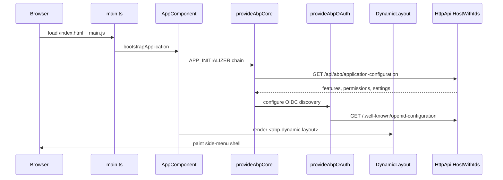

The Angular SPA shipped at `templates/app/angular/` is the front-end half of an ABP Framework Angular solution. It is a standalone-component Angular 21 application wired to consume the `HttpApi.HostWithIds` API host from the layered template, with OAuth implicit-code flow against the embedded OpenIddict server. This page covers its `package.json` dependency set, the `appConfig` providers, the route table, and the two `environment.ts` files that drive base URLs.

## Solution placement

The Angular folder is a **sibling** of `templates/app/aspnet-core/` inside the same `app` zip. The CLI keeps both directories side-by-side in the user's solution when they pass `-u angular`, and `AppTemplateBase.GetCustomSteps` removes the Blazor / MVC / Web variants from the `aspnet-core/src/` tree so only `HttpApi.HostWithIds` remains as the backend.

```
Acme.Books/
├── angular/
│   ├── package.json
│   ├── angular.json
│   ├── tsconfig.json
│   ├── start.ps1
│   └── src/
│       ├── main.ts
│       ├── polyfills.ts
│       ├── styles.scss
│       ├── app/
│       └── environments/
└── aspnet-core/
    └── src/
        └── Acme.Books.HttpApi.HostWithIds/
```

The `templates/app/angular/start.ps1` is a two-line convenience script (`yarn` then `yarn start`) shipped so non-Node-familiar contributors can boot the SPA quickly.

## `package.json` — the ABP Angular library set

`templates/app/angular/package.json` is the source of truth for which ABP Angular packages a generated app installs. Nine `@abp/ng.*` runtime libraries (account, components, core, identity, oauth, setting-management, tenant-management, theme.lepton-x, theme.shared) plus `@abp/ng.schematics` as a dev dependency make up the ABP surface:

```json templates/app/angular/package.json
{
  "name": "MyProjectName",
  "version": "0.0.0",
  "scripts": {
    "ng": "ng",
    "start": "ng serve --open",
    "build": "ng build",
    "build:prod": "ng build --configuration production",
    "watch": "ng build --watch --configuration development",
    "test": "ng test",
    "lint": "ng lint"
  },
  "private": true,
  "dependencies": {
    "@abp/ng.account": "~10.2.0-rc.3",
    "@abp/ng.components": "~10.2.0-rc.3",
    "@abp/ng.core": "~10.2.0-rc.3",
    "@abp/ng.identity": "~10.2.0-rc.3",
    "@abp/ng.oauth": "~10.2.0-rc.3",
    "@abp/ng.setting-management": "~10.2.0-rc.3",
    "@abp/ng.tenant-management": "~10.2.0-rc.3",
    "@abp/ng.theme.lepton-x": "~5.2.0-rc.3",
    "@abp/ng.theme.shared": "~10.2.0-rc.3",
    "@angular/animations": "~21.0.0",
    "@angular/common": "~21.0.0",
    "@angular/core": "~21.0.0",
    "@angular/forms": "~21.0.0",
    "@angular/router": "~21.0.0",
    "bootstrap-icons": "~1.8.0",
    "rxjs": "~7.8.0",
    "zone.js": "~0.15.0"
  },
  "devDependencies": {
    "@abp/ng.schematics": "~10.2.0-rc.3",
    "@angular-eslint/schematics": "~21.0.0",
    "@angular/build": "~21.0.0",
    "@angular/cli": "~21.0.0",
    "typescript": "~5.9.3",
    "vitest": "^4.0.0"
  }
}
```

`@abp/ng.schematics` ships the `ng generate` schematics that the ABP CLI uses for `abp generate-proxy -t ng` (which adds typed service proxies from a published `/api/abp/api-definition` endpoint).

## `angular.json` build target

`templates/app/angular/angular.json` uses the `@angular/build:application` builder (the post-Webpack esbuild backend). The project name is `MyProjectName` and the build outputs to `dist/MyProjectName`. Several CSS bundles are eagerly injected for FontAwesome, ngx-datatable, and the LeptonX Lite Bootstrap dim theme:

```json templates/app/angular/angular.json
"build": {
  "builder": "@angular/build:application",
  "options": {
    "outputPath": "dist/MyProjectName",
    "index": "src/index.html",
    "browser": "src/main.ts",
    "polyfills": ["src/polyfills.ts"],
    "tsConfig": "tsconfig.app.json",
    "inlineStyleLanguage": "scss",
    "allowedCommonJsDependencies": ["chart.js", "js-sha256"],
    "assets": ["src/favicon.ico", "src/assets"],
    "styles": [
      { "input": "node_modules/@fortawesome/fontawesome-free/css/all.min.css", "inject": true, "bundleName": "fontawesome-all.min" },
      { "input": "node_modules/@swimlane/ngx-datatable/index.css", "inject": true, "bundleName": "ngx-datatable-index" },
      { "input": "node_modules/@volo/ngx-lepton-x.lite/assets/css/bootstrap-dim.css", "inject": false, ... }
    ]
  }
}
```

## Bootstrap — `main.ts`

The `templates/app/angular/src/main.ts` entry point is a single `bootstrapApplication` call. It pre-pends `provideZoneChangeDetection()` to the `appConfig.providers` so Zone.js change detection is explicitly opted into:

```typescript templates/app/angular/src/main.ts
import { provideZoneChangeDetection } from "@angular/core";
import { bootstrapApplication } from '@angular/platform-browser';
import { appConfig } from './app/app.config';
import { AppComponent } from './app/app.component';

bootstrapApplication(AppComponent, {
  ...appConfig,
  providers: [provideZoneChangeDetection(), ...appConfig.providers]
}).catch(err => console.error(err));
```

The root component `AppComponent` (`templates/app/angular/src/app/app.component.ts`) is a tiny standalone shell that mounts ABP's chrome:

```typescript templates/app/angular/src/app/app.component.ts
import { Component } from '@angular/core';
import { InternetConnectionStatusComponent, LoaderBarComponent } from '@abp/ng.theme.shared';
import { DynamicLayoutComponent } from '@abp/ng.core';

@Component({
  selector: 'app-root',
  template: `
    <abp-loader-bar />
    <abp-dynamic-layout />
    <abp-internet-status />
  `,
  imports: [LoaderBarComponent, DynamicLayoutComponent, InternetConnectionStatusComponent],
})
export class AppComponent {}
```

`<abp-dynamic-layout>` is the heart of ABP's UI — it picks `eLayoutType.application`, `eLayoutType.account`, or `eLayoutType.empty` based on the active route, and renders the LeptonX shell around the child router-outlet.

## `appConfig` — the provider tree

`templates/app/angular/src/app/app.config.ts` is the single source of truth for which ABP Angular features are enabled. Every `provide*` call here is mandatory for the feature it gates:

```typescript templates/app/angular/src/app/app.config.ts
import {
  withValidationBluePrint,
  provideAbpThemeShared,
  provideLogo,
  withEnvironmentOptions,
} from '@abp/ng.theme.shared';
import { ApplicationConfig } from '@angular/core';
import { provideRouter } from '@angular/router';
import { provideAnimations } from '@angular/platform-browser/animations';

import { appRoutes } from './app.routes';
import { APP_ROUTE_PROVIDER } from './route.provider';
import { provideAbpCore, withOptions } from '@abp/ng.core';
import { environment } from '../environments/environment';
import { registerLocaleForEsBuild } from '@abp/ng.core/locale';
import { provideAbpOAuth } from '@abp/ng.oauth';
import { provideSettingManagementConfig } from '@abp/ng.setting-management/config';
import { provideAccountConfig } from '@abp/ng.account/config';
import { provideIdentityConfig } from '@abp/ng.identity/config';
import { provideTenantManagementConfig } from '@abp/ng.tenant-management/config';
import { provideFeatureManagementConfig } from '@abp/ng.feature-management';
import { provideThemeLeptonX } from '@abp/ng.theme.lepton-x';
import { provideSideMenuLayout } from '@abp/ng.theme.lepton-x/layouts';

export const appConfig: ApplicationConfig = {
  providers: [
    provideRouter(appRoutes),
    APP_ROUTE_PROVIDER,
    provideAbpCore(withOptions({
      environment,
      registerLocaleFn: registerLocaleForEsBuild(),
    })),
    provideThemeLeptonX(),
    provideSideMenuLayout(),
    provideAbpOAuth(),
    provideSettingManagementConfig(),
    provideAccountConfig(),
    provideIdentityConfig(),
    provideTenantManagementConfig(),
    provideFeatureManagementConfig(),
    provideAnimations(),
    provideLogo(withEnvironmentOptions(environment)),
    provideAbpThemeShared(withValidationBluePrint({
      wrongPassword: 'Please choose 1q2w3E*',
    })),
  ],
};
```

Each provider plays a specific role:

| Provider | Effect |
|---|---|
| `provideAbpCore(withOptions({ environment, ... }))` | Bootstraps `EnvironmentService`, loads `/api/abp/application-configuration` on startup. |
| `provideAbpOAuth()` | Registers `angular-oauth2-oidc` with the `oAuthConfig` from `environment`. |
| `provideThemeLeptonX()` + `provideSideMenuLayout()` | Mounts LeptonX dynamic layout and the side-menu chrome. |
| `provideAccountConfig()` | Registers the `/account` lazy-load entry from `@abp/ng.account`. |
| `provideIdentityConfig()` | Registers `/identity` route metadata used by `DynamicLayoutComponent`. |
| `provideTenantManagementConfig()` | Tenant switcher and tenant CRUD pages. |
| `provideSettingManagementConfig()` | `/setting-management` UI. |
| `provideFeatureManagementConfig()` | Per-tenant feature toggle UI. |
| `provideLogo(withEnvironmentOptions(environment))` | Reads `application.logoUrl` from environment. |
| `provideAbpThemeShared(withValidationBluePrint(...))` | Configures default password hint. |
| `APP_ROUTE_PROVIDER` | Custom `APP_INITIALIZER` that pushes a Home menu entry. |

## Route table — lazy ABP modules

`templates/app/angular/src/app/app.routes.ts` is short and lazy-loaded throughout. Every route except `''` calls `createRoutes()` on the corresponding ABP module:

```typescript templates/app/angular/src/app/app.routes.ts
import { Routes } from '@angular/router';

export const appRoutes: Routes = [
  {
    path: '',
    pathMatch: 'full',
    loadChildren: () => import('./home/home.routes').then(m => m.homeRoutes),
  },
  {
    path: 'account',
    loadChildren: () => import('@abp/ng.account').then(m => m.createRoutes()),
  },
  {
    path: 'identity',
    loadChildren: () => import('@abp/ng.identity').then(m => m.createRoutes()),
  },
  {
    path: 'tenant-management',
    loadChildren: () =>
      import('@abp/ng.tenant-management').then(m => m.createRoutes()),
  },
  {
    path: 'setting-management',
    loadChildren: () =>
      import('@abp/ng.setting-management').then(m => m.createRoutes()),
  },
];
```

The `createRoutes()` factory pattern (from `@abp/ng.core`) allows each module to declare its own permissions and layout, then return a `Routes` array. The matching backend permission names (`AbpIdentity.Users`, `AbpTenantManagement.Tenants`) come from the C# `AbpIdentityPermissions` constants generated into `Application.Contracts`.

## Home route and menu

`templates/app/angular/src/app/home/home.routes.ts` lazy-loads the demo HomeComponent:

```typescript templates/app/angular/src/app/home/home.routes.ts
import { Routes } from '@angular/router';

export const homeRoutes: Routes = [
  {
    path: '',
    pathMatch: 'full',
    loadComponent: () => import('./home.component').then(m => m.HomeComponent),
  },
];
```

`templates/app/angular/src/app/route.provider.ts` registers a top-level menu entry via `RoutesService`:

```typescript templates/app/angular/src/app/route.provider.ts
import { RoutesService, eLayoutType } from '@abp/ng.core';
import { APP_INITIALIZER } from '@angular/core';

export const APP_ROUTE_PROVIDER = [
  { provide: APP_INITIALIZER, useFactory: configureRoutes, deps: [RoutesService], multi: true },
];

function configureRoutes(routesService: RoutesService) {
  return () => {
    routesService.add([
      {
        path: '/',
        name: '::Menu:Home',
        iconClass: 'fas fa-home',
        order: 1,
        layout: eLayoutType.application,
      },
    ]);
  };
}
```

The double-colon prefix on `::Menu:Home` instructs the ABP localization pipe to resolve against the project's *default* resource (set in `Application.Contracts.Localization`). The `eLayoutType.application` enum picks the LeptonX side-menu shell, distinct from `eLayoutType.account` (login chrome) and `eLayoutType.empty` (no chrome).

## `HomeComponent` demonstrates `DynamicFormComponent`

The bundled `HomeComponent` (`templates/app/angular/src/app/home/home.component.ts`) is more than a placeholder — it shows how to use ABP's `DynamicFormComponent` and `AuthService`. It also gates a "Login" button on `this.authService.isAuthenticated`:

```typescript templates/app/angular/src/app/home/home.component.ts
@Component({
  selector: 'app-home',
  templateUrl: './home.component.html',
  styleUrls: ['./home.component.scss'],
  imports: [NgTemplateOutlet, LocalizationPipe, DynamicFormComponent],
})
export class HomeComponent {
  private authService = inject(AuthService);

  formFields: FormFieldConfig[] = [
    { key: 'firstName', type: 'text', label: 'First Name', required: true, ... },
    { key: 'userType', type: 'select', label: 'User Type', options: { defaultValues: [...] } },
    {
      key: 'adminNotes',
      type: 'textarea',
      conditionalLogic: [{ dependsOn: 'userType', condition: 'equals', value: 'admin', action: 'show' }],
    },
  ];

  get hasLoggedIn(): boolean { return this.authService.isAuthenticated; }
  login() { this.authService.navigateToLogin(); }
}
```

`authService.navigateToLogin()` redirects to `oAuthConfig.issuer` configured in `environment.ts`.

## Environment files — endpoints and OAuth

`templates/app/angular/src/environments/environment.ts` is the only file the developer must edit to point the SPA at a backend. The default values target `https://localhost:44305` (the `HttpApi.HostWithIds` URL chosen by `Properties/launchSettings.json` in the layered template):

```typescript templates/app/angular/src/environments/environment.ts
import { Environment } from '@abp/ng.core';

const baseUrl = 'http://localhost:4200';

export const environment = {
  production: false,
  application: {
    baseUrl,
    name: 'MyProjectName',
    logoUrl: '',
  },
  oAuthConfig: {
    issuer: 'https://localhost:44305/',
    redirectUri: baseUrl,
    clientId: 'MyProjectName_App',
    responseType: 'code',
    scope: 'offline_access MyProjectName',
    requireHttps: true,
  },
  apis: {
    default: {
      url: 'https://localhost:44305',
      rootNamespace: 'MyCompanyName.MyProjectName',
    },
  },
} as Environment;
```

`environment.prod.ts` is identical except `production: true` and matches the same URLs — production deployments must edit it before `ng build --configuration production`. The `clientId: 'MyProjectName_App'` matches the OpenIddict seed entry inserted by `OpenIddictDataSeedContributor` in the layered solution's `Domain` project.

When the CLI step `AngularEnvironmentFilePortChangeForSeparatedAuthServersStep` (`framework/src/Volo.Abp.Cli.Core/Volo/Abp/Cli/ProjectBuilding/Templates/App/`) runs, it rewrites `oAuthConfig.issuer` to point at the separate AuthServer port (44322 by default) if the user picked `--tiered` or `--separate-auth-server`.

| Field | Purpose |
|---|---|
| `application.baseUrl` | Where the SPA itself is hosted (Angular dev server at `4200`). |
| `application.name` | Shown in `<title>` and side-menu header. |
| `oAuthConfig.issuer` | OpenIddict authority — host of `/.well-known/openid-configuration`. |
| `oAuthConfig.clientId` | Must match an entry seeded by `OpenIddictDataSeedContributor`. |
| `oAuthConfig.scope` | `offline_access` enables refresh tokens; `MyProjectName` is the API audience. |
| `apis.default.url` | Base for every HTTP call routed through `RestService`. |
| `apis.default.rootNamespace` | C# root namespace used by generated proxies (`abp generate-proxy`). |

## Boot sequence



The first XHR a freshly loaded Angular SPA makes is `GET /api/abp/application-configuration` to `apis.default.url`. The response carries the currently authenticated user's permissions, allowed features, settings, current tenant, and localization dictionary — everything ABP's directives (`*abpPermission`, `*abpFeature`) need to render the correct UI without round-trips.

## `abp.config.json` — not present

Unlike older ABP Angular templates, this version does **not** include an `abp.config.json` file. Configuration that previously lived there has moved into `environment.ts` and into `appConfig` provider options. The CLI no longer reads any per-project Angular config file — every customization point is a TypeScript provider call.

## `polyfills.ts`

`templates/app/angular/src/polyfills.ts` is a near-stock Angular CLI polyfill list. It imports `zone.js` and `@angular/localize/init` so the LocalizationPipe ABP relies on can resolve `$localize` tagged strings at runtime. The ABP libraries do not require additional polyfills.

## Shared module

The `templates/app/angular/src/app/shared/shared.module.ts` is an empty boilerplate stub kept for migrations from older non-standalone Angular projects. New code in the template uses standalone components, so the module is effectively empty.

## Module table

| Path | Type | Imported from |
|---|---|---|
| `src/main.ts` | Entry script | — |
| `src/app/app.component.ts` | Standalone root | `@abp/ng.core`, `@abp/ng.theme.shared` |
| `src/app/app.config.ts` | `ApplicationConfig` provider tree | every `@abp/ng.*/config` package |
| `src/app/app.routes.ts` | Top-level `Routes[]` | `@angular/router` |
| `src/app/route.provider.ts` | `APP_INITIALIZER` for menu | `@abp/ng.core` |
| `src/app/home/home.routes.ts` | Lazy `Routes[]` | local component |
| `src/app/home/home.component.ts` | Demo home | `@abp/ng.components/dynamic-form` |
| `src/environments/environment.ts` | Dev env | `@abp/ng.core` typings |
| `src/environments/environment.prod.ts` | Prod env | `@abp/ng.core` typings |
| `src/polyfills.ts` | Zone + i18n | `zone.js`, `@angular/localize` |

## Cross-references

<Tip>
  The OpenIddict `MyProjectName_App` client this SPA logs into is seeded by `OpenIddictDataSeedContributor` in the layered `Domain` project. See [`/templates/app-template-aspnetcore`](/templates/app-template-aspnetcore) for the matching C# host (`HttpApi.HostWithIds`) and to [`/modules/identity`](/modules/identity) for the underlying Identity module that issues the cookies/tokens.
</Tip>

<Note>
  How the Angular template is detected and emitted by the CLI is documented at [`/cli/project-building`](/cli/project-building). The `AngularEnvironmentFilePortChangeForSeparatedAuthServersStep` is the step that rewrites the port numbers in `environment.ts` when AuthServer is split out — see [`/cli/templates-and-bundling`](/cli/templates-and-bundling) for how the templates zip is downloaded and cached.
</Note>

The next page, [`/templates/app-nolayers`](/templates/app-nolayers), walks the single-project nolayer alternative to the layered solution covered here.
