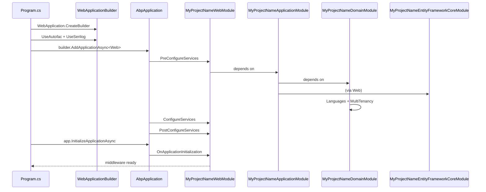

The layered startup solution under `templates/app/aspnet-core/` is the flagship ABP Framework template — every concept covered in the ABP documentation (domain layer, application services, OpenIddict auth server, dynamic permissions, multi-tenancy) is wired together here. This page walks every project under `src/`, shows the dependency graph between their `Module` classes, and explains how the tiered and non-tiered host variants share the same domain layer.

## Solution shape

`templates/app/aspnet-core/MyCompanyName.MyProjectName.slnx` references **22 projects** in `src/` plus **7 in `test/`**. The new XML solution format groups them into two folders:

```xml templates/app/aspnet-core/MyCompanyName.MyProjectName.slnx
<Solution>
  <Folder Name="/src/">
    <Project Path="src/MyCompanyName.MyProjectName.Application.Contracts/..." />
    <Project Path="src/MyCompanyName.MyProjectName.Application/..." />
    <Project Path="src/MyCompanyName.MyProjectName.AuthServer/..." />
    <Project Path="src/MyCompanyName.MyProjectName.Blazor.Client/..." />
    <Project Path="src/MyCompanyName.MyProjectName.Blazor.Server.Tiered/..." />
    <Project Path="src/MyCompanyName.MyProjectName.Blazor.Server/..." />
    <Project Path="src/MyCompanyName.MyProjectName.Blazor.WebApp.Client/..." />
    <Project Path="src/MyCompanyName.MyProjectName.Blazor.WebApp.Tiered.Client/..." />
    <Project Path="src/MyCompanyName.MyProjectName.Blazor.WebApp.Tiered/..." />
    <Project Path="src/MyCompanyName.MyProjectName.Blazor.WebApp/..." />
    <Project Path="src/MyCompanyName.MyProjectName.Blazor/..." />
    <Project Path="src/MyCompanyName.MyProjectName.DbMigrator/..." />
    <Project Path="src/MyCompanyName.MyProjectName.Domain.Shared/..." />
    <Project Path="src/MyCompanyName.MyProjectName.Domain/..." />
    <Project Path="src/MyCompanyName.MyProjectName.EntityFrameworkCore/..." />
    <Project Path="src/MyCompanyName.MyProjectName.HttpApi.Client/..." />
    <Project Path="src/MyCompanyName.MyProjectName.HttpApi.Host/..." />
    <Project Path="src/MyCompanyName.MyProjectName.HttpApi.HostWithIds/..." />
    <Project Path="src/MyCompanyName.MyProjectName.HttpApi/..." />
    <Project Path="src/MyCompanyName.MyProjectName.MongoDB/..." />
    <Project Path="src/MyCompanyName.MyProjectName.Web.Host/..." />
    <Project Path="src/MyCompanyName.MyProjectName.Web/..." />
  </Folder>
</Solution>
```

Only a subset survives generation — `AppTemplateBase.DeleteUnrelatedProjects` (in `framework/src/Volo.Abp.Cli.Core/Volo/Abp/Cli/ProjectBuilding/Templates/App/AppTemplateBase.cs`) removes UI variants the user did not pick. The rest of this page treats every project as if it were kept.

## Project roles at a glance

| Project | Role | SDK |
|---|---|---|
| `Domain.Shared` | Constants, enums, error codes, localization JSON, multi-tenancy flag | `Microsoft.NET.Sdk` |
| `Domain` | Aggregate roots, repositories, domain services, OpenIddict seed data | `Microsoft.NET.Sdk` |
| `Application.Contracts` | DTOs, application service interfaces, permission definitions | `Microsoft.NET.Sdk` |
| `Application` | `ApplicationService` implementations, Mapperly mappers | `Microsoft.NET.Sdk` |
| `EntityFrameworkCore` | `DbContext`, EF Core configurations, migrations | `Microsoft.NET.Sdk` |
| `MongoDB` | `IMongoDbContext`, document mapping (alternative to EFCore) | `Microsoft.NET.Sdk` |
| `HttpApi` | Auto-generated MVC controllers wrapping `Application` | `Microsoft.NET.Sdk` |
| `HttpApi.Client` | C# client proxies for `HttpApi` (used by console test app) | `Microsoft.NET.Sdk` |
| `HttpApi.Host` | Standalone API host (non-tiered) | `Microsoft.NET.Sdk.Web` |
| `HttpApi.HostWithIds` | API host with embedded OpenIddict (Angular default) | `Microsoft.NET.Sdk.Web` |
| `AuthServer` | Dedicated OpenIddict server (tiered Blazor / MVC) | `Microsoft.NET.Sdk.Web` |
| `Web` | MVC + Razor Pages UI (non-tiered) | `Microsoft.NET.Sdk.Web` |
| `Web.Host` | MVC UI consuming external API (tiered) | `Microsoft.NET.Sdk.Web` |
| `Blazor` | Blazor WebAssembly Standalone host | `Microsoft.NET.Sdk.Web` |
| `Blazor.Client` | Shared Razor components (WASM client lib) | `Microsoft.NET.Sdk.BlazorWebAssembly` |
| `Blazor.Server` | Blazor Server (interactive) host | `Microsoft.NET.Sdk.Web` |
| `Blazor.Server.Tiered` | Blazor Server consuming external API + AuthServer | `Microsoft.NET.Sdk.Web` |
| `Blazor.WebApp` | Blazor Web App (per-page render modes) | `Microsoft.NET.Sdk.Web` |
| `Blazor.WebApp.Client` | Interactive WebAssembly companion for `Blazor.WebApp` | `Microsoft.NET.Sdk.BlazorWebAssembly` |
| `Blazor.WebApp.Tiered` | Tiered Blazor Web App | `Microsoft.NET.Sdk.Web` |
| `Blazor.WebApp.Tiered.Client` | Tiered interactive client | `Microsoft.NET.Sdk.BlazorWebAssembly` |
| `DbMigrator` | Console runner that migrates and seeds | `Microsoft.NET.Sdk` |

## Domain.Shared — bottom of the dependency tree

`templates/app/aspnet-core/src/MyCompanyName.MyProjectName.Domain.Shared/MyCompanyName.MyProjectName.Domain.Shared.csproj` references every `*.Domain.Shared` module that ABP ships, plus the embedded localization JSON:

```xml templates/app/aspnet-core/src/MyCompanyName.MyProjectName.Domain.Shared/MyCompanyName.MyProjectName.Domain.Shared.csproj
<ItemGroup>
  <ProjectReference Include="..\..\..\..\..\modules\identity\src\Volo.Abp.Identity.Domain.Shared\Volo.Abp.Identity.Domain.Shared.csproj" />
  <ProjectReference Include="..\..\..\..\..\modules\background-jobs\src\Volo.Abp.BackgroundJobs.Domain.Shared\Volo.Abp.BackgroundJobs.Domain.Shared.csproj" />
  <ProjectReference Include="..\..\..\..\..\modules\audit-logging\src\Volo.Abp.AuditLogging.Domain.Shared\Volo.Abp.AuditLogging.Domain.Shared.csproj" />
  <ProjectReference Include="..\..\..\..\..\modules\tenant-management\src\Volo.Abp.TenantManagement.Domain.Shared\Volo.Abp.TenantManagement.Domain.Shared.csproj" />
  <!-- ... -->
</ItemGroup>
<ItemGroup>
  <EmbeddedResource Include="Localization\MyProjectName\*.json" />
</ItemGroup>
```

The `MyProjectNameDomainSharedModule` class wires up the `MyProjectNameResource` (localization), declares language list, and calls the module-extension and global-feature configurators that other layers extend:

```csharp templates/app/aspnet-core/src/MyCompanyName.MyProjectName.Domain.Shared/MyProjectNameDomainSharedModule.cs
[DependsOn(
    typeof(AbpAuditLoggingDomainSharedModule),
    typeof(AbpBackgroundJobsDomainSharedModule),
    typeof(AbpFeatureManagementDomainSharedModule),
    typeof(AbpIdentityDomainSharedModule),
    typeof(AbpOpenIddictDomainSharedModule),
    typeof(AbpPermissionManagementDomainSharedModule),
    typeof(AbpSettingManagementDomainSharedModule),
    typeof(AbpTenantManagementDomainSharedModule)
)]
public class MyProjectNameDomainSharedModule : AbpModule
{
    public override void PreConfigureServices(ServiceConfigurationContext context)
    {
        MyProjectNameGlobalFeatureConfigurator.Configure();
        MyProjectNameModuleExtensionConfigurator.Configure();
    }
}
```

## Domain — entities, repositories, OpenIddict seed

`MyProjectNameDomainModule` adds the runtime domain services on top of `*.Domain` modules and is the only project where `DEBUG` swaps in a `NullEmailSender`:

```csharp templates/app/aspnet-core/src/MyCompanyName.MyProjectName.Domain/MyProjectNameDomainModule.cs
[DependsOn(
    typeof(MyProjectNameDomainSharedModule),
    typeof(AbpAuditLoggingDomainModule),
    typeof(AbpBackgroundJobsDomainModule),
    typeof(AbpFeatureManagementDomainModule),
    typeof(AbpIdentityDomainModule),
    typeof(AbpOpenIddictDomainModule),
    typeof(AbpPermissionManagementDomainOpenIddictModule),
    typeof(AbpPermissionManagementDomainIdentityModule),
    typeof(AbpSettingManagementDomainModule),
    typeof(AbpTenantManagementDomainModule),
    typeof(AbpEmailingModule)
)]
public class MyProjectNameDomainModule : AbpModule
{
    public override void ConfigureServices(ServiceConfigurationContext context)
    {
        Configure<AbpLocalizationOptions>(options =>
        {
            options.Languages.Add(new LanguageInfo("en", "en", "English"));
            // ... 17 more locales
        });

        Configure<AbpMultiTenancyOptions>(options =>
        {
            options.IsEnabled = MultiTenancyConsts.IsEnabled;
        });

#if DEBUG
        context.Services.Replace(ServiceDescriptor.Singleton<IEmailSender, NullEmailSender>());
#endif
    }
}
```

The `OpenIddict/` subfolder of `templates/app/aspnet-core/src/MyCompanyName.MyProjectName.Domain/` contains `OpenIddictDataSeedContributor.cs` which seeds the default `MyProjectName_App`, `MyProjectName_Swagger`, and `MyProjectName_BlazorServerTiered` clients on first run — invoked by `DbMigrator`.

## Application.Contracts and Application

`MyProjectNameApplicationContractsModule` extends `Account`, `Identity`, `PermissionManagement`, `TenantManagement`, `FeatureManagement`, `SettingManagement`, and configures DTO extensions via `MyProjectNameDtoExtensions.Configure()` in `PreConfigureServices`:

```csharp templates/app/aspnet-core/src/MyCompanyName.MyProjectName.Application.Contracts/MyProjectNameApplicationContractsModule.cs
[DependsOn(
    typeof(MyProjectNameDomainSharedModule),
    typeof(AbpAccountApplicationContractsModule),
    typeof(AbpFeatureManagementApplicationContractsModule),
    typeof(AbpIdentityApplicationContractsModule),
    typeof(AbpPermissionManagementApplicationContractsModule),
    typeof(AbpSettingManagementApplicationContractsModule),
    typeof(AbpTenantManagementApplicationContractsModule),
    typeof(AbpObjectExtendingModule)
)]
public class MyProjectNameApplicationContractsModule : AbpModule
{
    public override void PreConfigureServices(ServiceConfigurationContext context)
    {
        MyProjectNameDtoExtensions.Configure();
    }
}
```

The runtime layer is `Application`, which registers Mapperly:

```csharp templates/app/aspnet-core/src/MyCompanyName.MyProjectName.Application/MyProjectNameApplicationModule.cs
[DependsOn(
    typeof(MyProjectNameDomainModule),
    typeof(AbpAccountApplicationModule),
    typeof(MyProjectNameApplicationContractsModule),
    typeof(AbpIdentityApplicationModule),
    typeof(AbpPermissionManagementApplicationModule),
    typeof(AbpTenantManagementApplicationModule),
    typeof(AbpFeatureManagementApplicationModule),
    typeof(AbpSettingManagementApplicationModule)
)]
public class MyProjectNameApplicationModule : AbpModule
{
    public override void ConfigureServices(ServiceConfigurationContext context)
    {
        context.Services.AddMapperlyObjectMapper<MyProjectNameApplicationModule>();
    }
}
```

The folder also holds `MyProjectNameAppService.cs` (the abstract base every app service inherits) and `MyProjectNameApplicationMappers.cs` (the Mapperly `[Mapper]` partial class).

## EntityFrameworkCore vs MongoDB

The two persistence projects sit side by side under `src/` and never reference each other. They are mutually exclusive at generation time: `AppTemplateSwitchEntityFrameworkCoreToMongoDbStep` removes one and rewrites all dependent project references to the other.

`MyCompanyName.MyProjectName.EntityFrameworkCore.csproj` pulls SQL Server by default and exposes the `Tools` package for `dotnet ef`:

```xml templates/app/aspnet-core/src/MyCompanyName.MyProjectName.EntityFrameworkCore/MyCompanyName.MyProjectName.EntityFrameworkCore.csproj
<ItemGroup>
  <ProjectReference Include="..\MyCompanyName.MyProjectName.Domain\MyCompanyName.MyProjectName.Domain.csproj" />
  <ProjectReference Include="..\..\..\..\..\framework\src\Volo.Abp.EntityFrameworkCore.SqlServer\Volo.Abp.EntityFrameworkCore.SqlServer.csproj" />
  <ProjectReference Include="..\..\..\..\..\modules\permission-management\src\Volo.Abp.PermissionManagement.EntityFrameworkCore\Volo.Abp.PermissionManagement.EntityFrameworkCore.csproj" />
  <!-- 8 more module *.EntityFrameworkCore refs -->
</ItemGroup>
<ItemGroup>
  <PackageReference Include="Microsoft.EntityFrameworkCore.Tools" Version="10.0.2">
    <PrivateAssets>all</PrivateAssets>
  </PackageReference>
</ItemGroup>
```

`MyCompanyName.MyProjectName.MongoDB.csproj` mirrors the same modules but with the `*.MongoDB` flavour. The folder structure of `EntityFrameworkCore/` (with `Migrations/` and `EntityFrameworkCore/MyProjectNameDbContext.cs`) is distinct from `MongoDB/` (which uses `MongoDb/MyProjectNameMongoDbContext.cs`).

## HttpApi and HttpApi.Client

The `HttpApi` layer is intentionally thin — `MyProjectNameHttpApiModule` only configures localization and declares dependencies on the corresponding `*.HttpApi` modules:

```csharp templates/app/aspnet-core/src/MyCompanyName.MyProjectName.HttpApi/MyProjectNameHttpApiModule.cs
[DependsOn(
    typeof(MyProjectNameApplicationContractsModule),
    typeof(AbpAccountHttpApiModule),
    typeof(AbpIdentityHttpApiModule),
    typeof(AbpPermissionManagementHttpApiModule),
    typeof(AbpTenantManagementHttpApiModule),
    typeof(AbpFeatureManagementHttpApiModule),
    typeof(AbpSettingManagementHttpApiModule)
)]
public class MyProjectNameHttpApiModule : AbpModule
```

The C# client proxies live in `HttpApi.Client`, registered via `AddHttpClientProxies`:

```csharp templates/app/aspnet-core/src/MyCompanyName.MyProjectName.HttpApi.Client/MyProjectNameHttpApiClientModule.cs
public class MyProjectNameHttpApiClientModule : AbpModule
{
    public const string RemoteServiceName = "Default";

    public override void ConfigureServices(ServiceConfigurationContext context)
    {
        context.Services.AddHttpClientProxies(
            typeof(MyProjectNameApplicationContractsModule).Assembly,
            RemoteServiceName
        );

        Configure<AbpVirtualFileSystemOptions>(options =>
        {
            options.FileSets.AddEmbedded<MyProjectNameHttpApiClientModule>();
        });
    }
}
```

## HttpApi.Host vs HttpApi.HostWithIds

Both are `Microsoft.NET.Sdk.Web` projects with a `Program.cs` that follows the canonical ABP host pattern:

```csharp templates/app/aspnet-core/src/MyCompanyName.MyProjectName.HttpApi.Host/Program.cs
public class Program
{
    public async static Task<int> Main(string[] args)
    {
        Log.Logger = new LoggerConfiguration()
            .MinimumLevel.Information()
            .Enrich.FromLogContext()
            .WriteTo.Async(c => c.File("Logs/logs.txt"))
            .WriteTo.Async(c => c.Console())
            .CreateLogger();

        try
        {
            var builder = WebApplication.CreateBuilder(args);
            builder.Host.AddAppSettingsSecretsJson()
                .UseAutofac()
                .UseSerilog();
            await builder.AddApplicationAsync<MyProjectNameHttpApiHostModule>();
            var app = builder.Build();
            await app.InitializeApplicationAsync();
            await app.RunAsync();
            return 0;
        }
        catch (Exception ex)
        {
            if (ex is HostAbortedException) throw;
            Log.Fatal(ex, "Host terminated unexpectedly!");
            return 1;
        }
        finally { Log.CloseAndFlush(); }
    }
}
```

`HttpApi.Host` is used in **tiered** layouts: the user logs in at the separate `AuthServer`, then receives JWT tokens that this host validates via `AbpAspNetCoreAuthenticationJwtBearerModule`. The module configures Redis caching, distributed locking, multi-tenancy, and Swagger:

```csharp templates/app/aspnet-core/src/MyCompanyName.MyProjectName.HttpApi.Host/MyProjectNameHttpApiHostModule.cs
[DependsOn(
    typeof(MyProjectNameHttpApiModule),
    typeof(AbpAutofacModule),
    typeof(AbpCachingStackExchangeRedisModule),
    typeof(AbpDistributedLockingModule),
    typeof(AbpAspNetCoreMvcUiMultiTenancyModule),
    typeof(AbpAspNetCoreAuthenticationJwtBearerModule),
    typeof(MyProjectNameApplicationModule),
    typeof(MyProjectNameEntityFrameworkCoreModule),
    typeof(AbpAspNetCoreSerilogModule),
    typeof(AbpSwashbuckleModule)
)]
public class MyProjectNameHttpApiHostModule : AbpModule
```

`HttpApi.HostWithIds` is the all-in-one host used with the Angular SPA: it hosts both the API **and** the OpenIddict authorization endpoints, so no separate AuthServer is required. Both csprojs share the same `UserSecretsId` GUID so user secrets are interchangeable when developers switch between layouts.

## AuthServer — the dedicated OpenIddict host

`AuthServer` only exists in tiered solutions. Its module pulls the LeptonX Lite MVC theme (login screens), Redis, distributed locking, and the Account UI:

```csharp templates/app/aspnet-core/src/MyCompanyName.MyProjectName.AuthServer/MyProjectNameAuthServerModule.cs
[DependsOn(
    typeof(AbpAutofacModule),
    typeof(AbpCachingStackExchangeRedisModule),
    typeof(AbpDistributedLockingModule),
    typeof(AbpAccountWebOpenIddictModule),
    typeof(AbpAccountApplicationModule),
    typeof(AbpAccountHttpApiModule),
    typeof(AbpAspNetCoreMvcUiLeptonXLiteThemeModule),
    typeof(MyProjectNameEntityFrameworkCoreModule),
    typeof(AbpAspNetCoreSerilogModule)
)]
public class MyProjectNameAuthServerModule : AbpModule
```

The same `PreConfigureServices` hook registers OpenIddict validation with the audience `MyProjectName` and, in non-Development environments, loads `openiddict.pfx` as the encryption/signing certificate. The `AuthServer.csproj` embeds `openiddict.pfx` only when the file exists (an `<ItemGroup Condition="Exists('./openiddict.pfx')">` guard, identical to the one in `Web.csproj`).

## DbMigrator

`DbMigrator` is a `Microsoft.Extensions.Hosting`-based console application. `Program.cs` builds a default host, registers `DbMigratorHostedService`, and runs it once:

```csharp templates/app/aspnet-core/src/MyCompanyName.MyProjectName.DbMigrator/Program.cs
class Program
{
    static async Task Main(string[] args)
    {
        Log.Logger = new LoggerConfiguration()
            .MinimumLevel.Information()
            .Enrich.FromLogContext()
            .WriteTo.Async(c => c.File("Logs/logs.txt"))
            .WriteTo.Async(c => c.Console())
            .CreateLogger();

        await CreateHostBuilder(args).RunConsoleAsync();
    }

    public static IHostBuilder CreateHostBuilder(string[] args) =>
        Host.CreateDefaultBuilder(args)
            .AddAppSettingsSecretsJson()
            .ConfigureLogging((context, logging) => logging.ClearProviders())
            .ConfigureServices((hostContext, services) =>
            {
                services.AddHostedService<DbMigratorHostedService>();
            });
}
```

`MyProjectNameDbMigratorModule` only pulls Redis caching when `TIERED` is set — note the `<TEMPLATE-REMOVE IF-NOT='TIERED'>` markers:

```csharp templates/app/aspnet-core/src/MyCompanyName.MyProjectName.DbMigrator/MyProjectNameDbMigratorModule.cs
[DependsOn(
    typeof(AbpAutofacModule),
    //<TEMPLATE-REMOVE IF-NOT='TIERED'>
    typeof(AbpCachingStackExchangeRedisModule),
    //</TEMPLATE-REMOVE>
    typeof(MyProjectNameEntityFrameworkCoreModule),
    typeof(MyProjectNameApplicationContractsModule)
)]
public class MyProjectNameDbMigratorModule : AbpModule
```

`DbMigratorHostedService.cs` resolves `IDataSeeder` and applies pending EF migrations before exiting. It is the only project that depends on **both** `EntityFrameworkCore` (for migrations) and `Application.Contracts` (for permission/seed contributors).

## Module dependency graph

The dependency graph below uses the actual `[DependsOn]` attributes scraped from each `*Module.cs`. Arrows point from a module to the module it directly depends on (excluding ABP framework modules for clarity).

```mermaid
flowchart TB
    DShared[MyProjectNameDomainSharedModule]
    Dom[MyProjectNameDomainModule]
    AppC[MyProjectNameApplicationContractsModule]
    App[MyProjectNameApplicationModule]
    EF[MyProjectNameEntityFrameworkCoreModule]
    Mongo[MyProjectNameMongoDbModule]
    Http[MyProjectNameHttpApiModule]
    HttpCli[MyProjectNameHttpApiClientModule]
    HttpHost[MyProjectNameHttpApiHostModule]
    HttpHostIds[MyProjectNameHttpApiHostWithIdsModule]
    Auth[MyProjectNameAuthServerModule]
    Web[MyProjectNameWebModule<br/>non-tiered]
    WebH[MyProjectNameWebHostModule<br/>tiered]
    BSrv[MyProjectNameBlazorServerModule]
    BSrvT[MyProjectNameBlazorServerTieredModule]
    BCli[MyProjectNameBlazorClientModule]
    BWap[MyProjectNameBlazorWebAppModule]
    DbM[MyProjectNameDbMigratorModule]

    Dom --> DShared
    AppC --> DShared
    App --> Dom
    App --> AppC
    EF --> Dom
    Mongo --> Dom
    Http --> AppC
    HttpCli --> AppC
    HttpHost --> Http
    HttpHost --> App
    HttpHost --> EF
    HttpHostIds --> Http
    HttpHostIds --> App
    HttpHostIds --> EF
    Auth --> EF
    Web --> App
    Web --> Http
    Web --> EF
    WebH --> Http
    WebH --> HttpCli
    BSrv --> App
    BSrv --> Http
    BSrv --> EF
    BSrvT --> HttpCli
    BWap --> App
    BWap --> EF
    BCli --> AppC
    DbM --> EF
    DbM --> AppC
```



## Tiered vs non-tiered

Tiered architecture changes which UI host owns the database and OpenIddict server. The decision tree is:

| Variant | UI host | API host | Auth host | Database access |
|---|---|---|---|---|
| **Non-tiered MVC** | `Web` | embedded in `Web` | embedded in `Web` (OpenIddict in-process) | `Web` references `EntityFrameworkCore` |
| **Tiered MVC** | `Web.Host` | `HttpApi.Host` | `AuthServer` | only `HttpApi.Host` references `EntityFrameworkCore` |
| **Non-tiered Blazor Server** | `Blazor.Server` | embedded | embedded | direct DB |
| **Tiered Blazor Server** | `Blazor.Server.Tiered` | `HttpApi.Host` | `AuthServer` | via `HttpApi.Client` |
| **Blazor WebAssembly** | `Blazor` (host) + `Blazor.Client` | `HttpApi.HostWithIds` | embedded in API | via WASM proxies |
| **Angular** | (separate angular folder) | `HttpApi.HostWithIds` | embedded in API | direct |

The `Blazor.WebApp` and `Blazor.WebApp.Tiered` variants follow the same split but use .NET 9's per-page interactivity model. `templates/app/aspnet-core/src/MyCompanyName.MyProjectName.Blazor.WebApp.Tiered/MyCompanyName.MyProjectName.Blazor.WebApp.Tiered.csproj` adds `Volo.Abp.AspNetCore.Authentication.OpenIdConnect` and `Volo.Abp.Http.Client.IdentityModel.Web` (cookie-based OIDC flow to the AuthServer) on top of the non-tiered references.

`AppTemplateBase.ConfigureTieredArchitecture` (`framework/src/Volo.Abp.Cli.Core/Volo/Abp/Cli/ProjectBuilding/Templates/App/AppTemplateBase.cs`) consumes `--tiered` and removes either the tiered or the non-tiered project family. It also flips `appsettings.json` AuthServer URLs from `localhost:44305` (self-hosted) to `localhost:44322` (dedicated AuthServer).

## Blazor variants in detail

The `Blazor` standalone host is a minimal Web SDK project that mounts a WASM client. `MyProjectNameBlazorModule` adds Razor Components and configures the route options:

```csharp templates/app/aspnet-core/src/MyCompanyName.MyProjectName.Blazor/MyProjectNameBlazorModule.cs
[DependsOn(
    typeof(AbpAutofacModule),
    typeof(AbpAspNetCoreMvcUiBundlingModule),
    typeof(AbpAspNetCoreComponentsWebAssemblyLeptonXLiteThemeBundlingModule)
)]
public class MyProjectNameBlazorModule : AbpModule
{
    public override void ConfigureServices(ServiceConfigurationContext context)
    {
        Configure<RouteOptions>(options =>
        {
            options.SuppressCheckForUnhandledSecurityMetadata = true;
        });

        context.Services.AddRazorComponents()
            .AddInteractiveWebAssemblyComponents();
    }

    public override void OnApplicationInitialization(ApplicationInitializationContext context)
    {
        var env = context.GetEnvironment();
        var app = context.GetApplicationBuilder();

        if (env.IsDevelopment()) app.UseWebAssemblyDebugging();
        else app.UseHsts();

        app.UseHttpsRedirection();
        app.MapAbpStaticAssets();
        app.UseRouting();
        app.UseAntiforgery();

        app.UseConfiguredEndpoints(builder =>
        {
            builder.MapRazorComponents<App>()
                .AddInteractiveWebAssemblyRenderMode()
                .AddAdditionalAssemblies(
                    WebAppAdditionalAssembliesHelper.GetAssemblies<MyProjectNameBlazorClientModule>());
        });
    }
}
```

`Blazor.Client` is the `Microsoft.NET.Sdk.BlazorWebAssembly` library shared by every Blazor host. It pulls `Volo.Abp.AspNetCore.Components.WebAssembly.Theming`, `Volo.Abp.Http.Client.IdentityModel.WebAssembly`, and the Identity/Tenant/Setting management Blazor WASM module packages — the same set every Blazor variant ends up exposing.

The tiered `Blazor.Server.Tiered.csproj` (a Web SDK project) additionally references `Blazorise.Bootstrap5`, `Microsoft.AspNetCore.DataProtection.StackExchangeRedis`, and `DistributedLock.Redis`, mirroring the AuthServer to keep distributed state consistent across both hosts.

## Test projects

`templates/app/aspnet-core/test/` contains:

| Test project | Purpose |
|---|---|
| `*.TestBase` | Shared xUnit base, in-memory `IAbpApplication` bootstrap |
| `*.Domain.Tests` | Domain service tests against in-memory EF |
| `*.Application.Tests` | Application service tests with seed data |
| `*.EntityFrameworkCore.Tests` | `DbContext` + migration round-trip tests |
| `*.MongoDB.Tests` | MongoDB-flavored equivalents |
| `*.Web.Tests` | Razor Pages integration tests (TestServer) |
| `*.HttpApi.Client.ConsoleTestApp` | Console driver to exercise `HttpApi.Client` |

## End-to-end module bootstrap

Putting the pieces together, a non-tiered MVC host's startup graph looks like this:



## Related guidance

<Tip>
  The Identity, Permission, Tenant, and Feature management modules pulled in by `MyProjectNameDomainModule` are documented at [`/modules/identity`](/modules/identity). The host startup conventions used by every `Program.cs` here come from [`/aspnetcore/overview`](/aspnetcore/overview).
</Tip>

<Note>
  For the Blazor WebApp render-mode model used by `Blazor.WebApp` and `Blazor.WebApp.Tiered`, see [`/blazor/overview`](/blazor/overview). For how `TemplateProjectBuilder` deletes the unrelated variants, see [`/cli/project-building`](/cli/project-building) and [`/cli/templates-and-bundling`](/cli/templates-and-bundling).
</Note>

The next page, [`/templates/app-template-angular`](/templates/app-template-angular), covers the sibling Angular SPA shipped under `templates/app/angular/`.
