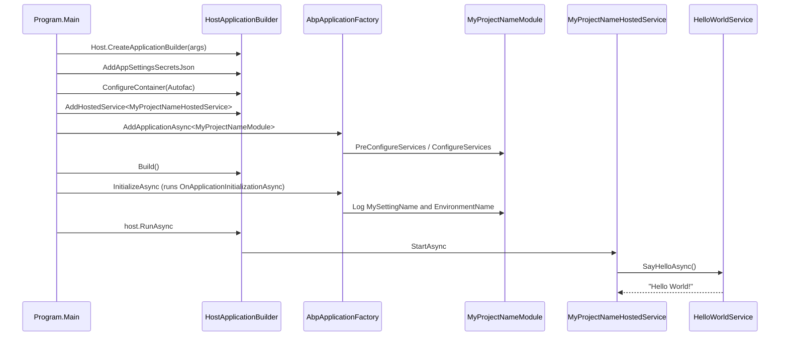

`templates/console/` is the smallest first-party ABP Framework template. It generates a single-project console application that boots the ABP modularity system on top of `Microsoft.Extensions.Hosting`, registers an `IHostedService`, and demonstrates dependency injection with Autofac. This page covers every file the template ships — `.csproj`, `Program.cs`, the entry `MyProjectNameModule`, the `HelloWorldService` sample, and the `appsettings.json` placeholder.

## Solution layout

```
templates/console/
├── MyCompanyName.MyProjectName.slnx
├── common.props
└── src/
    └── MyCompanyName.MyProjectName/
        ├── HelloWorldService.cs
        ├── MyCompanyName.MyProjectName.csproj
        ├── MyProjectNameHostedService.cs
        ├── MyProjectNameModule.cs
        ├── Program.cs
        ├── Properties/
        └── appsettings.json
```

`templates/console/MyCompanyName.MyProjectName.slnx` lists exactly one project:

```xml templates/console/MyCompanyName.MyProjectName.slnx
<Solution>
  <Folder Name="/src/">
    <Project Path="src/MyCompanyName.MyProjectName/MyCompanyName.MyProjectName.csproj" />
  </Folder>
</Solution>
```

This template is registered with `ConsoleTemplate.TemplateName = "console"` in `framework/src/Volo.Abp.Cli.Core/Volo/Abp/Cli/ProjectBuilding/Templates/Console/ConsoleTemplate.cs`, which also sets `DocumentUrl = CliConsts.DocsLink + "latest/get-started/console"`.

## `common.props` — leaner than layered

The console template uses a stripped-down `common.props` that omits `AbpProjectType`, since the CLI doesn't need to distinguish `app`/`module`/`microservice` here:

```xml templates/console/common.props
<Project>
  <PropertyGroup>
    <LangVersion>latest</LangVersion>
    <Version>0.1.0</Version>
    <NoWarn>$(NoWarn);CS1591;CS0436</NoWarn>
  </PropertyGroup>
</Project>
```

Note the lower default `<Version>0.1.0</Version>` (compared to `1.0.0` in `app/common.props`) — a console app is rarely versioned the same way as a public service.

## `MyCompanyName.MyProjectName.csproj`

The single project is a `Microsoft.NET.Sdk` console executable. It references `Volo.Abp.Autofac` (for the IoC container) and pulls Serilog + Microsoft Hosting:

```xml templates/console/src/MyCompanyName.MyProjectName/MyCompanyName.MyProjectName.csproj
<Project Sdk="Microsoft.NET.Sdk">

    <Import Project="..\..\common.props" />

    <PropertyGroup>
        <OutputType>Exe</OutputType>
        <TargetFramework>net10.0</TargetFramework>
        <Nullable>enable</Nullable>
    </PropertyGroup>

    <ItemGroup>
        <ProjectReference Include="..\..\..\..\framework\src\Volo.Abp.Autofac\Volo.Abp.Autofac.csproj" />
    </ItemGroup>

    <ItemGroup>
      <PackageReference Include="Microsoft.Extensions.Hosting" Version="10.0.2" />
      <PackageReference Include="Serilog.Extensions.Hosting" Version="9.0.0" />
      <PackageReference Include="Serilog.Extensions.Logging" Version="9.0.2" />
      <PackageReference Include="Serilog.Sinks.Async" Version="2.1.0" />
      <PackageReference Include="Serilog.Sinks.Console" Version="6.0.0" />
      <PackageReference Include="Serilog.Sinks.File" Version="7.0.0" />
    </ItemGroup>

    <ItemGroup>
        <Content Include="appsettings.json">
            <CopyToPublishDirectory>PreserveNewest</CopyToPublishDirectory>
            <CopyToOutputDirectory>Always</CopyToOutputDirectory>
        </Content>
        <Content Include="appsettings.secrets.json" Condition="Exists('appsettings.secrets.json')">
            <CopyToPublishDirectory>PreserveNewest</CopyToPublishDirectory>
            <CopyToOutputDirectory>Always</CopyToOutputDirectory>
        </Content>
    </ItemGroup>

</Project>
```

Only **one** ABP project reference: `Volo.Abp.Autofac`. The framework module includes everything else transitively (`Volo.Abp.Core`, `Volo.Abp.Modularity`, `Volo.Abp.DependencyInjection`).

## `Program.cs` — minimal hosted-service bootstrap

The entry-point is built on `Host.CreateApplicationBuilder` (the modern `Microsoft.Extensions.Hosting` builder), then handed off to `builder.Services.AddApplicationAsync<MyProjectNameModule>`:

```csharp templates/console/src/MyCompanyName.MyProjectName/Program.cs
public class Program
{
    public async static Task<int> Main(string[] args)
    {
        Log.Logger = new LoggerConfiguration()
#if DEBUG
            .MinimumLevel.Debug()
#else
            .MinimumLevel.Information()
#endif
            .MinimumLevel.Override("Microsoft", LogEventLevel.Information)
            .Enrich.FromLogContext()
            .WriteTo.Async(c => c.File("Logs/logs.txt"))
            .WriteTo.Async(c => c.Console())
            .CreateLogger();

        try
        {
            Log.Information("Starting console host.");

            var builder = Host.CreateApplicationBuilder(args);

            builder.Configuration.AddAppSettingsSecretsJson();
            builder.Logging.ClearProviders().AddSerilog();

            builder.ConfigureContainer(builder.Services.AddAutofacServiceProviderFactory());

            builder.Services.AddHostedService<MyProjectNameHostedService>();

            await builder.Services.AddApplicationAsync<MyProjectNameModule>();

            var host = builder.Build();

            await host.InitializeAsync();

            await host.RunAsync();

            return 0;
        }
        catch (Exception ex)
        {
            if (ex is HostAbortedException) throw;
            Log.Fatal(ex, "Host terminated unexpectedly!");
            return 1;
        }
        finally { Log.CloseAndFlush(); }
    }
}
```

Five lines do the ABP-specific work:

| Line | What it does |
|---|---|
| `builder.Configuration.AddAppSettingsSecretsJson()` | Adds the conventional `appsettings.secrets.json` ABP extension |
| `builder.ConfigureContainer(builder.Services.AddAutofacServiceProviderFactory())` | Swaps `IServiceProviderFactory` for Autofac so `[DependsOn]` modules can use Autofac features |
| `builder.Services.AddHostedService<MyProjectNameHostedService>()` | Plain Microsoft Hosting registration of the demo hosted service |
| `await builder.Services.AddApplicationAsync<MyProjectNameModule>()` | The ABP entry-point — builds the module dependency graph rooted at `MyProjectNameModule` |
| `await host.InitializeAsync()` | Runs `OnApplicationInitializationAsync` across the module tree |

The `Host.CreateApplicationBuilder` (rather than `Host.CreateDefaultBuilder`) is the .NET 8+ generic builder that returns `HostApplicationBuilder` directly, avoiding the older `IHostBuilder` callback style.

## `MyProjectNameModule` — the only ABP module

The root module declares one dependency: `AbpAutofacModule`. Through Autofac the rest of the ABP module graph (Core, DI, Configuration) is wired in:

```csharp templates/console/src/MyCompanyName.MyProjectName/MyProjectNameModule.cs
[DependsOn(
    typeof(AbpAutofacModule)
)]
public class MyProjectNameModule : AbpModule
{
    public override Task OnApplicationInitializationAsync(ApplicationInitializationContext context)
    {
        var logger = context.ServiceProvider.GetRequiredService<ILogger<MyProjectNameModule>>();
        var configuration = context.ServiceProvider.GetRequiredService<IConfiguration>();
        logger.LogInformation($"MySettingName => {configuration["MySettingName"]}");

        var hostEnvironment = context.ServiceProvider.GetRequiredService<IHostEnvironment>();
        logger.LogInformation($"EnvironmentName => {hostEnvironment.EnvironmentName}");

        return Task.CompletedTask;
    }
}
```

The `OnApplicationInitializationAsync` override demonstrates:

1. Reading `IConfiguration` to log the `MySettingName` value placed in `appsettings.json`.
2. Reading `IHostEnvironment` to log the active environment name.

This runs **after** all `ConfigureServices` overrides across the module tree, exactly once, before the host starts taking requests / executing `IHostedService.StartAsync`.

## `HelloWorldService` and `MyProjectNameHostedService`

The bundled `HelloWorldService` shows how ABP's lifetime conventions interact with a console host. It implements `ITransientDependency`, so it is auto-registered without any `ServiceCollection` call:

```csharp templates/console/src/MyCompanyName.MyProjectName/HelloWorldService.cs
public class HelloWorldService : ITransientDependency
{
    public ILogger<HelloWorldService> Logger { get; set; }

    public HelloWorldService()
    {
        Logger = NullLogger<HelloWorldService>.Instance;
    }

    public Task SayHelloAsync()
    {
        Logger.LogInformation("Hello World!");
        return Task.CompletedTask;
    }
}
```

The property-injected `ILogger<HelloWorldService>` and `NullLogger<>.Instance` fallback are the canonical ABP idiom — they let unit tests `new HelloWorldService()` without an IoC container.

`MyProjectNameHostedService` is consumed by `AddHostedService<>` (registered in `Program.cs`). It receives `HelloWorldService` via constructor injection and calls `SayHelloAsync` once at startup:

```csharp templates/console/src/MyCompanyName.MyProjectName/MyProjectNameHostedService.cs
public class MyProjectNameHostedService : IHostedService
{
    private readonly HelloWorldService _helloWorldService;

    public MyProjectNameHostedService(HelloWorldService helloWorldService)
    {
        _helloWorldService = helloWorldService;
    }

    public async Task StartAsync(CancellationToken cancellationToken)
    {
        await _helloWorldService.SayHelloAsync();
    }

    public Task StopAsync(CancellationToken cancellationToken)
    {
        return Task.CompletedTask;
    }
}
```

The chain is therefore:



## `appsettings.json`

The shipped configuration is intentionally trivial — one key the module logs:

```json templates/console/src/MyCompanyName.MyProjectName/appsettings.json
{
  "MySettingName": "MySettingValue"
}
```

The csproj's `<Content Include="appsettings.json">` `CopyToOutputDirectory="Always"` ensures the file is next to the binary at runtime. The same csproj conditionally includes `appsettings.secrets.json` so `dotnet user-secrets` continues to work via `AddAppSettingsSecretsJson()`.

## File-by-file summary

| File | Role | Line count (approx.) |
|---|---|---|
| `Program.cs` | Host bootstrap, Serilog config | ~55 |
| `MyProjectNameModule.cs` | Single ABP module, depends on `AbpAutofacModule` | ~25 |
| `HelloWorldService.cs` | Demo transient service | ~20 |
| `MyProjectNameHostedService.cs` | `IHostedService` driver | ~25 |
| `appsettings.json` | One demo key | 3 |
| `MyCompanyName.MyProjectName.csproj` | SDK + Autofac + Serilog | ~30 |
| `common.props` | Solution-wide MSBuild props | 7 |
| `MyCompanyName.MyProjectName.slnx` | Solution manifest | 5 |

## What you can build with this template

The console template is the right starting point when you need:

| Use case | Why this template fits |
|---|---|
| Background workers / cron-like tasks | `IHostedService` + ABP DI |
| Database migration tools (apart from `DbMigrator`) | Full module system without web stack |
| One-shot data import scripts | `Host.CreateApplicationBuilder` runs and exits |
| Test harnesses for ABP libraries | Lightweight `AbpApplicationFactory` boot |
| CLI tools using `System.CommandLine` + ABP modules | Combine ABP modularity with command parsers |

It is **not** suitable for:

- HTTP-facing applications (use `app` or `app-nolayers`)
- Distributed worker fleets with Hangfire/Quartz (those modules are easier to add to `app`)
- Mobile or desktop apps (use `maui` or `wpf`)

## Extending with more ABP modules

To add Identity, Multi-Tenancy, or Background Jobs to this template, you append `[DependsOn]` entries on `MyProjectNameModule` and reference the matching `Volo.Abp.*.Domain` packages. For example, adding the Background Jobs runtime:

```csharp
[DependsOn(
    typeof(AbpAutofacModule),
    typeof(AbpBackgroundJobsModule)   // additional
)]
public class MyProjectNameModule : AbpModule
{
    // ConfigureServices / OnApplicationInitializationAsync ...
}
```

Plus a `<ProjectReference>` (or NuGet `<PackageReference>`) to `Volo.Abp.BackgroundJobs`. The console host pattern (Autofac + `IHostedService`) is exactly the foundation ABP recommends for hosting `IBackgroundJobWorker` instances.

## Cross-references

<Tip>
  Other one-shot console hosts in the framework follow the same shape — see `templates/app/aspnet-core/src/MyCompanyName.MyProjectName.DbMigrator/Program.cs` covered at [`/templates/app-template-aspnetcore`](/templates/app-template-aspnetcore). For ABP module conventions, see [`/overview/architecture`](/overview/architecture).
</Tip>

<Note>
  The CLI registration that maps `abp new -t console` to this folder lives at `framework/src/Volo.Abp.Cli.Core/Volo/Abp/Cli/ProjectBuilding/Templates/Console/ConsoleTemplate.cs`. See [`/cli/project-building`](/cli/project-building) for how `TemplateProjectBuilder` is invoked, and [`/cli/templates-and-bundling`](/cli/templates-and-bundling) for the source-code store that delivers the zip.
</Note>

The next page, [`/templates/maui-template`](/templates/maui-template), covers the cross-platform .NET MAUI variant that follows the same Autofac-rooted pattern but uses `MauiApp.CreateBuilder` instead of `Host.CreateApplicationBuilder`.
