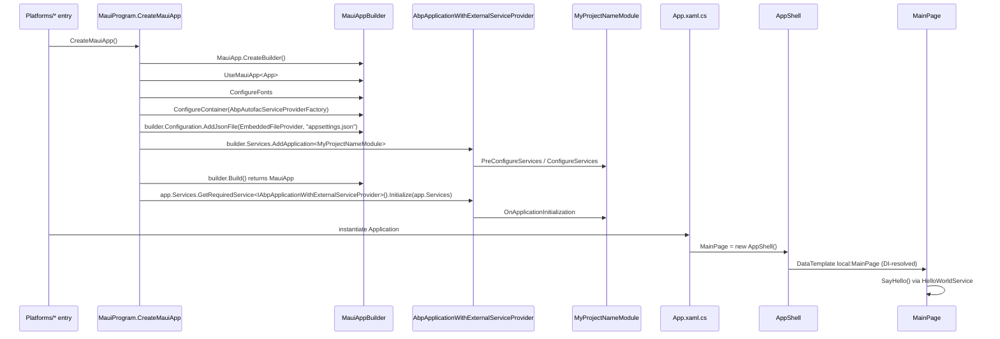

`templates/maui/` is the ABP Framework cross-platform .NET MAUI startup template — a single project that targets Android, iOS, Mac Catalyst, Windows, and (optionally) Tizen while bootstrapping the ABP modularity stack inside `MauiProgram.CreateMauiApp`. This page covers the multi-targeted csproj, the `MauiProgram` entrypoint that wires `AbpAutofacServiceProviderFactory`, the `ContentPage` that resolves a service via `ISingletonDependency`, and the embedded `appsettings.json` that ships inside the assembly.

## Solution layout

```
templates/maui/
├── MyCompanyName.MyProjectName.slnx
├── common.props
└── src/
    └── MyCompanyName.MyProjectName/
        ├── App.xaml
        ├── App.xaml.cs
        ├── AppShell.xaml
        ├── AppShell.xaml.cs
        ├── HelloWorldService.cs
        ├── MainPage.xaml
        ├── MainPage.xaml.cs
        ├── MauiProgram.cs
        ├── MyCompanyName.MyProjectName.csproj
        ├── MyProjectNameModule.cs
        ├── Platforms/
        │   ├── Android/
        │   ├── iOS/
        │   ├── MacCatalyst/
        │   ├── Tizen/
        │   └── Windows/
        ├── Properties/
        ├── Resources/
        └── appsettings.json
```

The slnx marks the project with `<Deploy />` so Visual Studio knows it is a publishable target:

```xml templates/maui/MyCompanyName.MyProjectName.slnx
<Solution>
  <Folder Name="/src/">
    <Project Path="src/MyCompanyName.MyProjectName/MyCompanyName.MyProjectName.csproj">
      <Deploy />
    </Project>
  </Folder>
</Solution>
```

The CLI entry point is `MauiTemplate.TemplateName = "maui"` in `framework/src/Volo.Abp.Cli.Core/Volo/Abp/Cli/ProjectBuilding/Templates/Maui/MauiTemplate.cs`.

## Multi-target csproj

`templates/maui/src/MyCompanyName.MyProjectName/MyCompanyName.MyProjectName.csproj` is the most platform-aware csproj in the entire `templates/` folder. It declares **four base target frameworks** plus a conditional Windows target:

```xml templates/maui/src/MyCompanyName.MyProjectName/MyCompanyName.MyProjectName.csproj
<Project Sdk="Microsoft.NET.Sdk">

	<Import Project="..\..\common.props" />

	<PropertyGroup>
		<TargetFrameworks>net10.0;net10.0-android;net10.0-ios;net10.0-maccatalyst</TargetFrameworks>
		<TargetFrameworks Condition="$([MSBuild]::IsOSPlatform('windows'))">$(TargetFrameworks);net10.0-windows10.0.19041.0</TargetFrameworks>
		<!-- <TargetFrameworks>$(TargetFrameworks);net10.0-tizen</TargetFrameworks> -->
		<Nullable>enable</Nullable>
		<OutputType>Exe</OutputType>
		<RootNamespace>MyCompanyName.MyProjectName</RootNamespace>
		<UseMaui>true</UseMaui>
		<SingleProject>true</SingleProject>
		<ImplicitUsings>enable</ImplicitUsings>

		<ApplicationTitle>MyCompanyName.MyProjectName</ApplicationTitle>
		<ApplicationId>com.mycompanyname.myprojectname</ApplicationId>
		<ApplicationIdGuid>27317750-B571-4690-B433-B358B2480E01</ApplicationIdGuid>
		<ApplicationDisplayVersion>1.0</ApplicationDisplayVersion>
		<ApplicationVersion>1</ApplicationVersion>

		<SupportedOSPlatformVersion Condition="$([MSBuild]::GetTargetPlatformIdentifier('$(TargetFramework)')) == 'ios'">15.0</SupportedOSPlatformVersion>
		<SupportedOSPlatformVersion Condition="$([MSBuild]::GetTargetPlatformIdentifier('$(TargetFramework)')) == 'maccatalyst'">15.0</SupportedOSPlatformVersion>
		<SupportedOSPlatformVersion Condition="$([MSBuild]::GetTargetPlatformIdentifier('$(TargetFramework)')) == 'android'">24.0</SupportedOSPlatformVersion>
		<SupportedOSPlatformVersion Condition="$([MSBuild]::GetTargetPlatformIdentifier('$(TargetFramework)')) == 'windows'">10.0.17763.0</SupportedOSPlatformVersion>
		<TargetPlatformMinVersion Condition="$([MSBuild]::GetTargetPlatformIdentifier('$(TargetFramework)')) == 'windows'">10.0.17763.0</TargetPlatformMinVersion>
	</PropertyGroup>

	<ItemGroup>
		<ProjectReference Include="..\..\..\..\framework\src\Volo.Abp.Autofac\Volo.Abp.Autofac.csproj" />
		<PackageReference Include="Microsoft.Extensions.FileProviders.Embedded" Version="10.0.2" />
	</ItemGroup>
```

| Property | Effect |
|---|---|
| `<UseMaui>true</UseMaui>` | Enables the MAUI workload |
| `<SingleProject>true</SingleProject>` | The single-project MAUI model (no per-platform csprojs) |
| `<ApplicationIdGuid>` | App identity GUID — regenerated by `MauiBlazorChangeApplicationIdGuidStep` at scaffold time |
| `<SupportedOSPlatformVersion>` | Set per-platform via MSBuild conditions |

The `ApplicationIdGuid` value `27317750-B571-4690-B433-B358B2480E01` is hard-coded in the template; the CLI step `MauiBlazorChangeApplicationIdGuidStep` (in `framework/src/Volo.Abp.Cli.Core/Volo/Abp/Cli/ProjectBuilding/Templates/App/`) replaces it with a fresh GUID at generation time.

## Asset and resource items

The csproj continues with the standard MAUI resource pipeline:

```xml templates/maui/src/MyCompanyName.MyProjectName/MyCompanyName.MyProjectName.csproj
<ItemGroup>
  <MauiIcon Include="Resources\AppIcon\appicon.svg" ForegroundFile="Resources\AppIcon\appiconfg.svg" Color="#512BD4" />
  <MauiSplashScreen Include="Resources\Splash\splash.svg" Color="#512BD4" BaseSize="128,128" />
  <MauiImage Include="Resources\Images\*" />
  <MauiImage Update="Resources\Images\dotnet_bot.svg" BaseSize="168,208" />
  <MauiFont Include="Resources\Fonts\*" />
  <MauiAsset Include="Resources\Raw\**" LogicalName="%(RecursiveDir)%(Filename)%(Extension)" />
</ItemGroup>

<ItemGroup>
  <None Remove="appsettings.json" />
  <EmbeddedResource Include="appsettings.json" />
</ItemGroup>
```

The closing block is the ABP-specific touch — `appsettings.json` is removed from `<None>` and re-added as `<EmbeddedResource>` so it lives **inside the assembly**, ready to be read via `EmbeddedFileProvider` (no separate JSON file is deployed to mobile devices).

## `MauiProgram.CreateMauiApp` — ABP boot

`templates/maui/src/MyCompanyName.MyProjectName/MauiProgram.cs` is where ABP is bolted onto MAUI. The crucial calls are `ConfigureContainer(new AbpAutofacServiceProviderFactory(...))`, `Services.AddApplication<MyProjectNameModule>`, and `Initialize` after build:

```csharp templates/maui/src/MyCompanyName.MyProjectName/MauiProgram.cs
public static class MauiProgram
{
    public static MauiApp CreateMauiApp()
    {
        var builder = MauiApp.CreateBuilder();
        builder
            .UseMauiApp<App>()
            .ConfigureFonts(fonts =>
            {
                fonts.AddFont("OpenSans-Regular.ttf", "OpenSansRegular");
                fonts.AddFont("OpenSans-Semibold.ttf", "OpenSansSemibold");
            })
            .ConfigureContainer(new AbpAutofacServiceProviderFactory(new Autofac.ContainerBuilder()));

        ConfigureConfiguration(builder);

        builder.Services.AddApplication<MyProjectNameModule>(options =>
        {
            options.Services.ReplaceConfiguration(builder.Configuration);
        });

        var app = builder.Build();

        app.Services.GetRequiredService<IAbpApplicationWithExternalServiceProvider>().Initialize(app.Services);

        return app;
    }

    private static void ConfigureConfiguration(MauiAppBuilder builder)
    {
        var assembly = typeof(App).GetTypeInfo().Assembly;
        builder.Configuration.AddJsonFile(new EmbeddedFileProvider(assembly), "appsettings.json", optional: false, false);
    }
}
```

Three differences from the console template:

| Aspect | Console template | MAUI template |
|---|---|---|
| Builder | `Host.CreateApplicationBuilder` | `MauiApp.CreateBuilder` |
| Container factory | `builder.Services.AddAutofacServiceProviderFactory()` | `builder.ConfigureContainer(new AbpAutofacServiceProviderFactory(...))` |
| Initialize call | `await host.InitializeAsync()` | `Initialize(IAbpApplicationWithExternalServiceProvider)` |
| Config source | `appsettings.json` on disk | embedded resource via `EmbeddedFileProvider` |

`AddApplication<MyProjectNameModule>` is the **synchronous** variant — MAUI startup is itself synchronous on most platforms, so the async overload isn't necessary. The same module root is then initialized with `IAbpApplicationWithExternalServiceProvider.Initialize`, which assumes the service provider was created externally (by MAUI's container).

## The slim `MyProjectNameModule`

`templates/maui/src/MyCompanyName.MyProjectName/MyProjectNameModule.cs` is the smallest module in any ABP template — three lines plus the attribute:

```csharp templates/maui/src/MyCompanyName.MyProjectName/MyProjectNameModule.cs
using Volo.Abp.Autofac;
using Volo.Abp.Modularity;

namespace MyCompanyName.MyProjectName;

[DependsOn(typeof(AbpAutofacModule))]
public class MyProjectNameModule : AbpModule
{
}
```

No `ConfigureServices`, no `OnApplicationInitialization`. All wiring happens through ABP conventions (`ITransientDependency`, `ISingletonDependency`) and MAUI's own page constructor injection.

## MAUI shell — `App`, `AppShell`, `MainPage`

The `App` class follows the standard MAUI pattern: it points the application's `MainPage` at the shell:

```csharp templates/maui/src/MyCompanyName.MyProjectName/App.xaml.cs
public partial class App : Application
{
	public App()
	{
		InitializeComponent();

		MainPage = new AppShell();
	}
}
```

`AppShell` defines a single tab via XAML:

```xml templates/maui/src/MyCompanyName.MyProjectName/AppShell.xaml
<Shell
    x:Class="MyCompanyName.MyProjectName.AppShell"
    Shell.FlyoutBehavior="Disabled">

    <ShellContent
        Title="Home"
        ContentTemplate="{DataTemplate local:MainPage}"
        Route="MainPage" />

</Shell>
```

`MainPage` is the ABP-flavoured ContentPage. It implements `ISingletonDependency` so ABP auto-registers it, accepts `HelloWorldService` via constructor injection, and uses it on render:

```csharp templates/maui/src/MyCompanyName.MyProjectName/MainPage.xaml.cs
public partial class MainPage : ContentPage, ISingletonDependency
{
	private readonly HelloWorldService _helloWorldService;

	int count = 0;

	public MainPage(HelloWorldService helloWorldService)
	{
		_helloWorldService = helloWorldService;
		InitializeComponent();
		SetHelloLabText();
	}

	private void SetHelloLabText()
	{
		HelloLab.Text = _helloWorldService.SayHello();
	}

	private void OnCounterClicked(object sender, EventArgs e)
	{
		count++;
		CounterBtn.Text = $"Clicked {count} times";
		SemanticScreenReader.Announce(CounterBtn.Text);
	}
}
```

Without `ISingletonDependency`, MAUI's container would still construct the page via reflection, but ABP's `ITransientDependency`/`ISingletonDependency` markers ensure consistent lifecycle and interception support across both DI worlds.

## `HelloWorldService`

A minimal `ITransientDependency` service prints a string:

```csharp templates/maui/src/MyCompanyName.MyProjectName/HelloWorldService.cs
public class HelloWorldService : ITransientDependency
{
    public string SayHello()
    {
        return "Hello, World!";
    }
}
```

Because of ABP's convention-based discovery, this service is auto-registered the moment `MyProjectNameModule` is loaded — no `services.AddTransient<HelloWorldService>` line is needed.

## Embedded configuration

`templates/maui/src/MyCompanyName.MyProjectName/appsettings.json` is intentionally trivial:

```json templates/maui/src/MyCompanyName.MyProjectName/appsettings.json
{
  "AppName": "MyProjectName"
}
```

It is consumed via `new EmbeddedFileProvider(assembly)` and registered with `AddJsonFile("appsettings.json", optional: false)`. The `optional: false` is deliberate — the file must exist (it's embedded in the assembly at build time), so a missing one is a build error rather than a silent runtime fallback.

## Platforms folder

`templates/maui/src/MyCompanyName.MyProjectName/Platforms/` contains the canonical MAUI platform launchers:

| Folder | Role |
|---|---|
| `Android/MainActivity.cs` | `MauiAppCompatActivity` with theme + ConfigurationChanges |
| `iOS/Program.cs` + `AppDelegate.cs` | iOS bootstrap delegate |
| `MacCatalyst/Program.cs` + `AppDelegate.cs` | Mac Catalyst bootstrap |
| `Windows/App.xaml` + `App.xaml.cs` | WinUI 3 host calling `MauiProgram.CreateMauiApp()` |
| `Tizen/` | Tizen bootstrap (commented out by default) |

The Android activity is one line:

```csharp templates/maui/src/MyCompanyName.MyProjectName/Platforms/Android/MainActivity.cs
[Activity(Theme = "@style/Maui.SplashTheme", MainLauncher = true,
    ConfigurationChanges = ConfigChanges.ScreenSize | ConfigChanges.Orientation |
                           ConfigChanges.UiMode | ConfigChanges.ScreenLayout |
                           ConfigChanges.SmallestScreenSize | ConfigChanges.Density)]
public class MainActivity : MauiAppCompatActivity
{
}
```

The Windows project loads the WinUI runtime via `MauiWinUIApplication`:

```csharp templates/maui/src/MyCompanyName.MyProjectName/Platforms/Windows/App.xaml.cs
public partial class App : MauiWinUIApplication
{
    public App() { this.InitializeComponent(); }
    protected override MauiApp CreateMauiApp() => MauiProgram.CreateMauiApp();
}
```

## Startup graph



## Related Volo.Abp.Maui.Client

For richer mobile scenarios (logged-in HTTP API access, token storage, multi-tenancy), the framework also exposes `Volo.Abp.Maui.Client` under `framework/src/Volo.Abp.Maui.Client/`. The default `templates/maui/` template does **not** depend on it — it's the minimum viable MAUI host. Production templates (such as commercial ABP Suite outputs) add `Volo.Abp.Maui.Client` for OIDC login flows and `IHttpClientFactory` integration with the bundled `HttpApi.HostWithIds`.

## File inventory

| File | Role |
|---|---|
| `MauiProgram.cs` | ABP-on-MAUI bootstrap |
| `App.xaml` / `App.xaml.cs` | MAUI Application class |
| `AppShell.xaml` / `AppShell.xaml.cs` | Shell with one ShellContent |
| `MainPage.xaml` / `MainPage.xaml.cs` | Sample ContentPage injecting `HelloWorldService` |
| `HelloWorldService.cs` | `ITransientDependency` demo service |
| `MyProjectNameModule.cs` | Single ABP module (`AbpAutofacModule` only) |
| `appsettings.json` | Embedded JSON config |
| `Platforms/*` | Per-OS startup |
| `Resources/*` | Icons, splash, fonts, raw assets |
| `Properties/launchSettings.json` | Debug profile |

## Cross-references

<Tip>
  The `ISingletonDependency`/`ITransientDependency` marker interfaces used in `MainPage` and `HelloWorldService` are part of `Volo.Abp.DependencyInjection` documented at [`/overview/architecture`](/overview/architecture). The Autofac-based service provider factory matches what every host in [`/templates/app-template-aspnetcore`](/templates/app-template-aspnetcore) uses.
</Tip>

<Note>
  The CLI step that randomizes the application id GUID is `MauiBlazorChangeApplicationIdGuidStep` — see [`/cli/project-building`](/cli/project-building). The zip download path is described at [`/cli/templates-and-bundling`](/cli/templates-and-bundling).
</Note>

The final per-template page, [`/templates/wpf-template`](/templates/wpf-template), covers the Windows-only WPF variant, which uses a slightly different pattern (`AbpApplicationFactory.CreateAsync` called inside `App.OnStartup`).
