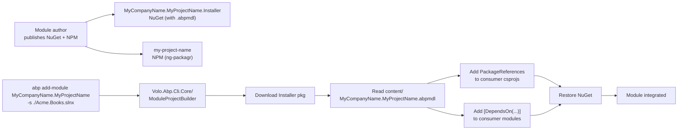

The `templates/module/` template generates an ABP Framework *module* — a self-contained, packageable set of NuGet libraries plus matching Angular ng-packagr library that you can `abp install` into any host app later. Unlike the `app/` and `app-nolayers/` templates, this one produces no runnable application by itself: the included `host/` projects exist only as development drivers. This page walks the layered C# layout under `aspnet-core/`, the `*.abpmdl` manifest, the Angular monorepo under `angular/`, and the `Installer` virtual-file-system trick that ships the manifest inside the NuGet package.

## Top-level layout

```
templates/module/
├── aspnet-core/
│   ├── MyCompanyName.MyProjectName.abpmdl   ← module manifest
│   ├── MyCompanyName.MyProjectName.abpsln
│   ├── MyCompanyName.MyProjectName.slnx
│   ├── MyCompanyName.MyProjectName.sln.DotSettings
│   ├── NuGet.Config
│   ├── common.props
│   ├── docker-compose.yml
│   ├── docker-compose.migrations.yml
│   ├── docker-compose.override.yml
│   ├── database/
│   ├── src/
│   ├── host/
│   └── test/
└── angular/
    ├── angular.json
    ├── package.json
    └── projects/
        ├── dev-app/
        └── my-project-name/
```

The `*.abpmdl` and `*.abpsln` files are how ABP tooling (`abp install`, `abp add-module`, `abp suite`) knows which projects belong to the module.

## What the module ships

The `templates/module/aspnet-core/MyCompanyName.MyProjectName.slnx` lists three folders worth of projects:

| Folder | Projects |
|---|---|
| `/src/` | Domain.Shared, Domain, Application.Contracts, Application, EntityFrameworkCore, MongoDB, HttpApi, HttpApi.Client, Web, Blazor, Blazor.Server, Blazor.WebAssembly, Blazor.WebAssembly.Bundling, **Installer** |
| `/host/` | AuthServer, Blazor.Host, Blazor.Host.Client, Blazor.Server.Host, Host.Shared, HttpApi.Host, Web.Host, Web.Unified |
| `/test/` | TestBase, Domain.Tests, Application.Tests, EntityFrameworkCore.Tests, MongoDB.Tests, HttpApi.Client.ConsoleTestApp |

Compare to the layered `app/` template: the **only structural additions** are `Installer/`, `Blazor.WebAssembly.Bundling/`, and the `host/` folder. The `host/` projects act as a sandbox to host the module during development; they are deleted from `*.abpmdl` and `*.abpsln` when the module is consumed.

## The `*.abpmdl` manifest

`templates/module/aspnet-core/MyCompanyName.MyProjectName.abpmdl` is a JSON document that lists every package the module exposes. `abp install MyCompanyName.MyProjectName` reads it and rewires references in the target solution:

```json templates/module/aspnet-core/MyCompanyName.MyProjectName.abpmdl
{
  "folders": {
    "items": {
      "src": {},
      "test": {},
      "host": {}
    }
  },
  "packages": {
    "MyCompanyName.MyProjectName.Domain.Shared": {
      "path": "src/MyCompanyName.MyProjectName.Domain.Shared/MyCompanyName.MyProjectName.Domain.Shared.abppkg",
      "folder": "src"
    },
    "MyCompanyName.MyProjectName.Domain": {
      "path": "src/MyCompanyName.MyProjectName.Domain/MyCompanyName.MyProjectName.Domain.abppkg",
      "folder": "src"
    },
    "MyCompanyName.MyProjectName.Application.Contracts": { ... },
    "MyCompanyName.MyProjectName.Application": { ... },
    "MyCompanyName.MyProjectName.EntityFrameworkCore": { ... },
    "MyCompanyName.MyProjectName.MongoDB": { ... },
    "MyCompanyName.MyProjectName.HttpApi": { ... },
    "MyCompanyName.MyProjectName.HttpApi.Client": { ... },
    "MyCompanyName.MyProjectName.TestBase": { ... },
    "MyCompanyName.MyProjectName.Web": { ... },
    "MyCompanyName.MyProjectName.HttpApi.Host": { ... },
    "MyCompanyName.MyProjectName.Web.Host": { ... },
    "MyCompanyName.MyProjectName.AuthServer": { ... }
  }
}
```

Each entry points to a `*.abppkg` file inside the project folder. Those `.abppkg` files contain per-package metadata (NuGet ID, side-by-side install rules) read by `ModuleInfoProvider` in `framework/src/Volo.Abp.Cli.Core/Volo/Abp/Cli/ProjectBuilding/ModuleInfoProvider.cs`.

When a consumer runs `abp add-module MyCompanyName.MyProjectName -s <hostSolution>`, ABP:

1. Downloads the module's `.abpmdl` next to the NuGet packages.
2. Reads `packages` and maps each to the consumer's matching project (e.g., `*.Domain.Shared` package → consumer's `*.Domain.Shared` project).
3. Adds `<PackageReference>` or `<ProjectReference>` to each, plus `[DependsOn]` attributes on the corresponding modules.

## The `Installer` project

`templates/module/aspnet-core/src/MyCompanyName.MyProjectName.Installer/` is a tiny project whose only job is to embed the `*.abpmdl` file inside a NuGet package so `abp add-module` can fetch it from `nuget.org`. The csproj does **not** reference `.Domain.Shared` — it stands alone:

```xml templates/module/aspnet-core/src/MyCompanyName.MyProjectName.Installer/MyCompanyName.MyProjectName.Installer.csproj
<Project Sdk="Microsoft.NET.Sdk">

    <Import Project="..\..\common.props" />

    <PropertyGroup>
        <TargetFramework>net10.0</TargetFramework>
        <Nullable>enable</Nullable>
        <GenerateEmbeddedFilesManifest>true</GenerateEmbeddedFilesManifest>
        <RootNamespace>MyCompanyName.MyProjectName</RootNamespace>
    </PropertyGroup>

    <ItemGroup>
        <ProjectReference Include="..\..\..\..\..\framework\src\Volo.Abp.VirtualFileSystem\Volo.Abp.VirtualFileSystem.csproj" />
    </ItemGroup>

    <ItemGroup>
      <None Remove="..\..\MyCompanyName.MyProjectName.abpmdl" />
      <Content Include="..\..\MyCompanyName.MyProjectName.abpmdl">
        <Pack>true</Pack>
        <PackagePath>content\</PackagePath>
      </Content>
    </ItemGroup>

</Project>
```

The `<Content>` line copies `MyCompanyName.MyProjectName.abpmdl` from the solution root into the NuGet `content/` folder so it is unpacked into the consumer's project on `dotnet restore`. `MyProjectNameInstallerModule.cs` exposes the file through ABP's virtual file system:

```csharp templates/module/aspnet-core/src/MyCompanyName.MyProjectName.Installer/MyProjectNameInstallerModule.cs
[DependsOn(
    typeof(AbpVirtualFileSystemModule)
)]
public class MyProjectNameInstallerModule : AbpModule
{
    public override void ConfigureServices(ServiceConfigurationContext context)
    {
        Configure<AbpVirtualFileSystemOptions>(options =>
        {
            options.FileSets.AddEmbedded<MyProjectNameInstallerModule>();
        });
    }
}
```

The CLI command `abp add-module` reads the manifest either from the local file (when the module source is on disk) or from the NuGet `content/` folder (when shipped via NuGet).

## Domain and Application — slim by default

Unlike the `app/` template, the module's `Domain` does **not** depend on Identity, OpenIddict, or TenantManagement. Modules are supposed to be neutral — consumers add those references in their own host. `MyProjectNameDomainModule` is intentionally bare:

```csharp templates/module/aspnet-core/src/MyCompanyName.MyProjectName.Domain/MyProjectNameDomainModule.cs
using Volo.Abp.Domain;
using Volo.Abp.Modularity;

namespace MyCompanyName.MyProjectName;

[DependsOn(
    typeof(AbpDddDomainModule),
    typeof(MyProjectNameDomainSharedModule)
)]
public class MyProjectNameDomainModule : AbpModule
{
}
```

The csproj similarly only references the framework's DDD core:

```xml templates/module/aspnet-core/src/MyCompanyName.MyProjectName.Domain/MyCompanyName.MyProjectName.Domain.csproj
<ItemGroup>
  <ProjectReference Include="..\..\..\..\..\framework\src\Volo.Abp.Ddd.Domain\Volo.Abp.Ddd.Domain.csproj" />
  <ProjectReference Include="..\MyCompanyName.MyProjectName.Domain.Shared\MyCompanyName.MyProjectName.Domain.Shared.csproj" />
</ItemGroup>
```

`MyProjectNameApplicationModule` adds Mapperly and depends on `AbpDddApplicationModule`:

```csharp templates/module/aspnet-core/src/MyCompanyName.MyProjectName.Application/MyProjectNameApplicationModule.cs
[DependsOn(
    typeof(MyProjectNameDomainModule),
    typeof(MyProjectNameApplicationContractsModule),
    typeof(AbpDddApplicationModule),
    typeof(AbpMapperlyModule)
)]
public class MyProjectNameApplicationModule : AbpModule
{
    public override void ConfigureServices(ServiceConfigurationContext context)
    {
        context.Services.AddMapperlyObjectMapper<MyProjectNameApplicationModule>();
    }
}
```

## Blazor WebAssembly Bundling

A unique-to-modules project is `Blazor.WebAssembly.Bundling`, which exposes the module's static assets (CSS, JS) to consumer Blazor WASM hosts through ABP's bundling system:

```csharp templates/module/aspnet-core/src/MyCompanyName.MyProjectName.Blazor.WebAssembly.Bundling/MyProjectNameBlazorWebAssemblyBundlingModule.cs
[DependsOn(
    typeof(AbpAspNetCoreComponentsWebAssemblyThemingBundlingModule)
)]
public class MyProjectNameBlazorWebAssemblyBundlingModule : AbpModule
{
    public override void ConfigureServices(ServiceConfigurationContext context)
    {
        Configure<AbpBundlingOptions>(options =>
        {
            var globalStyles = options.StyleBundles.Get(BlazorWebAssemblyStandardBundles.Styles.Global);
            globalStyles.AddContributors(typeof(MyProjectNameBundleStyleContributor));

            var globalScripts = options.ScriptBundles.Get(BlazorWebAssemblyStandardBundles.Scripts.Global);
            globalScripts.AddContributors(typeof(MyProjectNameBundleScriptContributor));
        });
    }
}
```

`MyProjectNameBundleStyleContributor` and `MyProjectNameBundleScriptContributor` (in the same folder) implement `IBundleContributor` from `Volo.Abp.AspNetCore.Mvc.UI.Bundling` and tell ABP to merge the module's CSS/JS into the host's global bundles.

## The `host/` development sandbox

The `host/` folder is *not* shipped to module consumers. It contains the projects you need to actually run and debug the module locally:

| Project | Purpose |
|---|---|
| `Host.Shared` | Constants and helpers shared across the host projects (multi-tenancy resolver). |
| `AuthServer` | Local OpenIddict server for testing logged-in scenarios. |
| `HttpApi.Host` | Standalone API host. |
| `Web.Host` | MVC host that consumes `HttpApi.Host`. |
| `Web.Unified` | All-in-one host (Web + API + AuthServer) for quick demos. |
| `Blazor.Host` + `Blazor.Host.Client` | Standalone Blazor WASM hosting pair. |
| `Blazor.Server.Host` | Standalone Blazor Server host. |

`templates/module/aspnet-core/host/MyCompanyName.MyProjectName.Host.Shared/MyCompanyName.MyProjectName.Host.Shared.csproj` is intentionally empty (no references) — it exists so multi-tenancy constants and shared config can be moved into it later:

```xml templates/module/aspnet-core/host/MyCompanyName.MyProjectName.Host.Shared/MyCompanyName.MyProjectName.Host.Shared.csproj
<Project Sdk="Microsoft.NET.Sdk">
  <Import Project="..\..\common.props" />
  <PropertyGroup>
    <TargetFramework>net10.0</TargetFramework>
    <Nullable>enable</Nullable>
    <RootNamespace>MyCompanyName.MyProjectName</RootNamespace>
  </PropertyGroup>
</Project>
```

The `HttpApi.Host` host project is structurally identical to the layered template's host — same `Program.cs`, same Redis + Autofac + Swagger module list:

```csharp templates/module/aspnet-core/host/MyCompanyName.MyProjectName.HttpApi.Host/MyProjectNameHttpApiHostModule.cs
[DependsOn(
    typeof(MyProjectNameApplicationModule),
    typeof(MyProjectNameEntityFrameworkCoreModule),
    typeof(MyProjectNameHttpApiModule),
    typeof(AbpAspNetCoreMvcUiMultiTenancyModule),
    typeof(AbpAspNetCoreAuthenticationJwtBearerModule),
    typeof(AbpAutofacModule),
    typeof(AbpCachingStackExchangeRedisModule),
    typeof(AbpEntityFrameworkCoreSqlServerModule),
    typeof(AbpAuditLoggingEntityFrameworkCoreModule),
    ...
)]
```

## Test layout

The `test/` folder reflects the unit/integration testing strategy common to ABP modules:

| Project | Role |
|---|---|
| `TestBase` | xUnit base class with in-memory `AbpApplication` |
| `Domain.Tests` | Tests domain services with EF in-memory provider |
| `Application.Tests` | Tests app services through `Volo.Abp.ApplicationFactory` |
| `EntityFrameworkCore.Tests` | Migration + repository tests |
| `MongoDB.Tests` | Same against `Mongo2Go` in-process Mongo |
| `HttpApi.Client.ConsoleTestApp` | Driver to exercise the `HttpApi.Client` proxies |

## Docker compose for module development

The module template ships three compose files so you can spin up a SQL Server + Redis stack locally:

| File | Purpose |
|---|---|
| `docker-compose.yml` | SQL Server 2022 + Redis + the module's `Web.Unified` host |
| `docker-compose.override.yml` | Local dev overrides (port mappings, volumes) |
| `docker-compose.migrations.yml` | Runs `dotnet ef database update` once at startup |

These are absent from `app/` and `app-nolayers/` because those templates assume an end-user host. The module template, being a library publisher, needs reproducible infrastructure for CI.

## Angular monorepo

`templates/module/angular/` is a small ng-packagr workspace with **two** projects:

```
angular/
├── package.json
├── angular.json
└── projects/
    ├── dev-app/         ← consumer-like app for local development
    └── my-project-name/ ← the actual publishable library
```

`projects/my-project-name/ng-package.json` defines the library entry:

```json templates/module/angular/projects/my-project-name/ng-package.json
{
  "$schema": "../../node_modules/ng-packagr/ng-package.schema.json",
  "dest": "../../dist/my-project-name",
  "lib": {
    "entryFile": "src/public-api.ts"
  }
}
```

The library is published to NPM as `my-project-name`. The `dev-app` workspace project consumes it locally via a tsconfig path mapping so module authors can iterate without `npm pack` round-trips.

This monorepo structure is automatically wired by `ng new --create-application=false` and is the standard Angular way to author publishable libraries.

## Module installation flow



`ModuleProjectBuilder` in `framework/src/Volo.Abp.Cli.Core/Volo/Abp/Cli/ProjectBuilding/ModuleProjectBuilder.cs` orchestrates the inverse direction — it is the runner for `abp new -t module`, while `abp add-module` uses a different path through `Volo.Abp.Cli.ProjectModification`.

## Layered diff vs `app/`

| Difference | `app/` | `module/` |
|---|---|---|
| `*.abpmdl` manifest | ✗ | ✓ |
| `Installer` project | ✗ | ✓ |
| `Blazor.WebAssembly.Bundling` project | ✗ | ✓ |
| `host/` folder | ✗ | ✓ |
| `Domain` depends on Identity/OpenIddict | ✓ | ✗ (clean) |
| Multiple `host/` flavors (Web.Unified, Blazor.Host, AuthServer) | n/a | ✓ |
| Docker compose | ✗ | ✓ |
| Angular `projects/dev-app` + `projects/my-project-name` | ✗ (single SPA) | ✓ (monorepo) |

## Module CLI commands the template integrates with

The bundled `*.abpmdl`, `*.abppkg`, and `*.abpsln` files exist to integrate with these CLI commands (defined under `framework/src/Volo.Abp.Cli.Core/Volo/Abp/Cli/Commands/`):

| Command | What it does |
|---|---|
| `abp new -t module` | Materialize this template |
| `abp add-module <name>` | Read `.abpmdl` and inject the module into a host solution |
| `abp install` | Restore NPM packages for `Blazor.Server` hosts |
| `abp suite` | Use the module's `.abpsln` to add CRUD pages |

## Cross-references

<Tip>
  For the host module bootstrap pattern used in `host/HttpApi.Host`, see [`/templates/app-template-aspnetcore`](/templates/app-template-aspnetcore) — it shares the same Program.cs structure. The bundled Identity references inside the `AuthServer` host are documented at [`/modules/identity`](/modules/identity).
</Tip>

<Note>
  How `ModuleProjectBuilder` and `ModuleInfoProvider` consume the `.abpmdl` file lives at [`/cli/project-building`](/cli/project-building). The packaging step (NuGet `content/`-folder injection plus the bundling cache) is covered by [`/cli/templates-and-bundling`](/cli/templates-and-bundling).
</Note>

The next pages cover the three small standalone templates: [`/templates/console-template`](/templates/console-template), [`/templates/maui-template`](/templates/maui-template), and [`/templates/wpf-template`](/templates/wpf-template).
