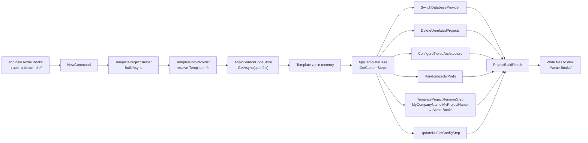

The `templates/` folder at the root of `abpframework/abp` is the source of every project skeleton emitted by the `abp new` CLI command. ABP Framework ships eight first-party templates here, each authored as a real, compilable solution (with `MyCompanyName.MyProjectName` placeholders) that is later zipped, downloaded by `Volo.Abp.Cli.Core`, and rewritten on the developer's machine. This page enumerates every directory, indexes the UI/database options each template exposes, and walks the dispatch path from `abp new <name>` through `TemplateProjectBuilder` to the final files on disk.

## Template inventory

The eight top-level template folders are visible at the root of `templates/` alongside three shared files: `Directory.Packages.props`, `NuGet.Config`, and `zip-templates.ps1`. Every folder is self-contained — it is the archive root that the CLI later expands.

| Template name (CLI) | Source folder | Output kind | Solution file | UI options |
|---|---|---|---|---|
| `app` | `templates/app/` | Layered DDD startup | `MyCompanyName.MyProjectName.slnx` | MVC, Blazor Server, Blazor WebAssembly, Blazor WebApp, Angular, MAUI Blazor, None |
| `app-nolayers` | `templates/app-nolayers/` | Single-project startup | `MyCompanyName.MyProjectName.slnx` | MVC, Blazor Server, Blazor WebAssembly, Angular |
| `module` | `templates/module/` | Reusable module skeleton | `MyCompanyName.MyProjectName.slnx` (+ `.abpmdl`) | MVC, Blazor (Server & WASM), Angular |
| `console` | `templates/console/` | Console host | (no slnx) | n/a |
| `maui` | `templates/maui/` | .NET MAUI startup | (no slnx) | MAUI |
| `wpf` | `templates/wpf/` | WPF desktop app | (no slnx) | WPF |

The three shared files at `templates/` apply when zipping and when restoring the generated project. `templates/zip-templates.ps1` archives each child folder into `<name>-<version>.zip`. `templates/Directory.Packages.props` neutralises central package management, and `templates/NuGet.Config` provides an empty `packageSources` element copied into each generated solution.

## The `zip-templates.ps1` archiver

The packaging script is short enough to read in full. It walks every immediate child directory under `templates/` and produces one zip per template:

```powershell templates/zip-templates.ps1
$version = $args[0]
$folders = Get-ChildItem -Directory

foreach ($folder in $folders) {
    $zipFile = "./" + $folder.Name + "-" + $version + ".zip"

    if (Test-Path $zipFile) {
        Remove-Item $zipFile
    }

    Compress-Archive -Path "$($folder.FullName)\*" -DestinationPath $zipFile
}

Write-Host "All templates have been zipped."
```

The resulting archive name (`app-9.0.0.zip`, `module-9.0.0.zip`, …) is the exact identifier that `Volo.Abp.Cli.ProjectBuilding.AbpIoSourceCodeStore` requests from `https://abp.io` when a user runs `abp new`. Because the script archives `$folder\*` (not the folder itself), the zip root contains `aspnet-core/`, `angular/`, `src/`, etc. — the layout the rest of the pipeline assumes.

## Shared root files

Two siblings of `zip-templates.ps1` ship inside every layered or nolayer solution to keep the developer experience consistent:

```xml templates/Directory.Packages.props
<Project>
  <PropertyGroup>
    <ManagePackageVersionsCentrally>false</ManagePackageVersionsCentrally>
  </PropertyGroup>
</Project>
```

```xml templates/NuGet.Config
<?xml version="1.0" encoding="utf-8"?>
<configuration>
  <packageSources>
  </packageSources>
</configuration>
```

`Directory.Packages.props` deliberately disables central package management because each `*.csproj` pins its own versions (e.g. `Serilog.AspNetCore` 9.0.0, `Microsoft.AspNetCore.DataProtection.StackExchangeRedis` 10.0.2). `NuGet.Config` is an intentional blank — the `UpdateNuGetConfigStep` in `framework/src/Volo.Abp.Cli.Core/Volo/Abp/Cli/ProjectBuilding/Templates/UpdateNuGetConfigStep.cs` later injects the appropriate `nuget.org` / `abp.io` sources at generation time.

## `abp new` to disk: pipeline summary

When a user runs `abp new Acme.Books -t app -u blazor -d ef --no-tiered`, the CLI does **not** invoke `dotnet new`. Instead it goes through `Volo.Abp.Cli.Core/Volo/Abp/Cli/ProjectBuilding/TemplateProjectBuilder.cs`, which orchestrates download, in-memory transformation, and extraction.

<Steps>
  <Step title="Resolve the template">
    `TemplateInfoProvider` maps the `-t` argument to a `TemplateInfo` subclass — `AppTemplate`, `AppNoLayersTemplate`, `ModuleTemplate`, `ConsoleTemplate`, `MauiTemplate`, or `WpfTemplate`. Each lives under `framework/src/Volo.Abp.Cli.Core/Volo/Abp/Cli/ProjectBuilding/Templates/`.
  </Step>
  <Step title="Fetch the zip">
    `AbpIoSourceCodeStore.GetAsync` downloads `<template-name>-<version>.zip` from `abp.io` (or uses a local copy under `~/.abp/templates/` when `--template-source` points to one).
  </Step>
  <Step title="Apply pipeline steps">
    `AppTemplateBase.GetCustomSteps` adds steps such as `SwitchDatabaseProvider`, `DeleteUnrelatedProjects`, `ConfigureTieredArchitecture`, `RandomizeSslPorts`, `UpdateNuGetConfigStep`, and `TemplateProjectRenameStep`. Each step rewrites files inside the in-memory zip.
  </Step>
  <Step title="Rename and write">
    `TemplateProjectRenameStep` replaces every occurrence of `MyCompanyName.MyProjectName` (and the `mycompanyname.myprojectname` lowercase variants) with the real solution name, then unpacks the result to the target directory.
  </Step>
</Steps>



Refer to [`/cli/project-building`](/cli/project-building) for the deeper walkthrough of `TemplateProjectBuilder`, and to [`/cli/templates-and-bundling`](/cli/templates-and-bundling) for how the source-code store interacts with the bundling cache.

## Where each template targets

The on-disk layout differs significantly between the three "shapes" of template (layered, nolayer, module). The table below lists the key root markers a generator script can probe to detect template kind without unpacking the zip.

| Marker file | Present in | Meaning |
|---|---|---|
| `aspnet-core/src/MyCompanyName.MyProjectName.Domain/` | `app/` | Layered DDD startup with `Domain`, `Application`, `EntityFrameworkCore` projects. |
| `aspnet-core/MyCompanyName.MyProjectName.Host/` | `app-nolayers/` | Single-project startup; database access, services, and UI live in one project. |
| `MyCompanyName.MyProjectName.abpmdl` | `module/` | Module manifest used by `abp install` to register packages into a host. |
| `src/MyCompanyName.MyProjectName/MyCompanyName.MyProjectName.csproj` (single child of `src/`) | `console/`, `maui/`, `wpf/` | Single-project standalone app. |
| `aspnet-core/MyCompanyName.MyProjectName.slnx` | `app/`, `app-nolayers/`, `module/` | Solution file using the new `.slnx` XML format. |
| `angular/package.json` | `app/`, `app-nolayers/`, `module/` | Angular SPA companion. |

The layered `app/aspnet-core/MyCompanyName.MyProjectName.slnx` lists **22 projects** in `/src/` plus **7 projects** in `/test/`. The `app-nolayers/aspnet-core/MyCompanyName.MyProjectName.slnx` lists **10 projects** total — one host per UI/database combination. The `module/aspnet-core/MyCompanyName.MyProjectName.slnx` lists **14 src + 8 host + 6 test projects** plus a `MyCompanyName.MyProjectName.abpmdl` manifest in the root.

## Built-in conditional markers

The templates are compilable as-is for ABP contributors (so CI can build them inside the repo), but they also contain machine-readable `<TEMPLATE-REMOVE>` markers that the pipeline strips based on user-selected options. Two forms appear throughout:

```xml templates/app/aspnet-core/src/MyCompanyName.MyProjectName.Web/MyCompanyName.MyProjectName.Web.csproj
<!-- <TEMPLATE-REMOVE> -->
<ProjectReference Include="..\..\..\..\..\framework\src\Volo.Abp.AspNetCore.Mvc.UI.MultiTenancy\Volo.Abp.AspNetCore.Mvc.UI.MultiTenancy.csproj" />
<ProjectReference Include="..\..\..\..\..\framework\src\Volo.Abp.AspNetCore.Mvc.UI.Theme.Shared\Volo.Abp.AspNetCore.Mvc.UI.Theme.Shared.csproj" />
<!-- </TEMPLATE-REMOVE> -->
<PackageReference Include="Volo.Abp.AspNetCore.Mvc.UI.Theme.LeptonXLite" Version="5.0.0" />
```

The block between `<TEMPLATE-REMOVE>` markers is the in-repo project reference that lets the template build against the framework source tree. When the template is materialized for an end user, the step removes those lines and only the `PackageReference` survives. The conditional variant `<TEMPLATE-REMOVE IF-NOT='TIERED'>` (visible in `MyProjectNameDbMigratorModule.cs`) keeps or removes content based on the architecture flag.

```csharp templates/app/aspnet-core/src/MyCompanyName.MyProjectName.DbMigrator/MyProjectNameDbMigratorModule.cs
[DependsOn(
    typeof(AbpAutofacModule),
    //<TEMPLATE-REMOVE IF-NOT='TIERED'>
    typeof(AbpCachingStackExchangeRedisModule),
    //</TEMPLATE-REMOVE>
    typeof(MyProjectNameEntityFrameworkCoreModule),
    typeof(MyProjectNameApplicationContractsModule)
    )]
public class MyProjectNameDbMigratorModule : AbpModule
```

## Common solution-level files

Each layered/nolayer template ships the same set of root convenience files. `templates/app/aspnet-core/common.props` is the import every `*.csproj` references with `<Import Project="..\..\common.props" />`:

```xml templates/app/aspnet-core/common.props
<Project>
  <PropertyGroup>
    <LangVersion>latest</LangVersion>
    <Version>1.0.0</Version>
    <NoWarn>$(NoWarn);CS1591</NoWarn>
    <AbpProjectType>app</AbpProjectType>
  </PropertyGroup>

  <Target Name="NoWarnOnRazorViewImportedTypeConflicts" BeforeTargets="RazorCoreCompile">
    <PropertyGroup>
      <NoWarn>$(NoWarn);0436</NoWarn>
    </PropertyGroup>
  </Target>

  <ItemGroup>
    <Content Remove="$(UserProfile)\.nuget\packages\*\*\contentFiles\any\*\*.abppkg*" />
  </ItemGroup>
</Project>
```

The `AbpProjectType` property is read by ABP tooling (e.g., `abp suite` and `abp install`) to distinguish `app`, `module`, and `microservice` solutions. The `Content Remove` line stops `*.abppkg` files inside NuGet packages from accidentally being copied into output folders.

Each template also includes `MyCompanyName.MyProjectName.sln.DotSettings` containing JetBrains Rider/ReSharper preferences — namespace rules and code style — so the generated solution opens cleanly in both Visual Studio and Rider.

## UI / database option matrix

The CLI flags interact with the templates in concrete ways. The matrix below maps `abp new` flags to the subset of projects they leave behind. Anything not selected is removed by `AppTemplateBase.DeleteUnrelatedProjects` or `AppTemplateBase.SwitchDatabaseProvider`.

| Flag | Effect inside `app/aspnet-core/src/` |
|---|---|
| `-u mvc` | Keeps `*.Web`, `*.Web.Host`, removes `*.Blazor*`. |
| `-u blazor` | Keeps `*.Blazor`, `*.Blazor.Client`, removes server-only `*.Web`. |
| `-u blazor-server` | Keeps `*.Blazor.Server` (or `*.Blazor.Server.Tiered` when `--tiered`). |
| `-u blazor-webapp` | Keeps `*.Blazor.WebApp` and `*.Blazor.WebApp.Client`. |
| `-u angular` | Keeps `*.HttpApi.HostWithIds`, includes `templates/app/angular/`. |
| `-u none` | Headless: keeps only `*.HttpApi.Host` / `*.HttpApi.HostWithIds`. |
| `-d ef` | Keeps `*.EntityFrameworkCore` and EF migrations under `Migrations/`. |
| `-d mongodb` | Replaces EF refs via `AppTemplateSwitchEntityFrameworkCoreToMongoDbStep`. |
| `--tiered` | Adds `AuthServer` + `HttpApi.Host` split; Blazor variants gain `.Tiered` suffix. |
| `--separate-auth-server` | Keeps a dedicated `MyCompanyName.MyProjectName.AuthServer` project. |

The Angular template (`templates/app/angular/`) is shipped as a sibling of `aspnet-core/` and is included verbatim only when `-u angular` is used. The MAUI Blazor option is handled by yet another step — `MauiBlazorChangeApplicationIdGuidStep` from `framework/src/Volo.Abp.Cli.Core/Volo/Abp/Cli/ProjectBuilding/Templates/App/`.

## Anatomy of a generated solution

A freshly created `Acme.Books` solution with `-u blazor-server -d ef --no-tiered` produces this top-level tree (placeholders replaced):

```
Acme.Books/
├── aspnet-core/
│   ├── Acme.Books.slnx
│   ├── common.props
│   ├── NuGet.Config
│   ├── src/
│   │   ├── Acme.Books.Domain.Shared/
│   │   ├── Acme.Books.Domain/
│   │   ├── Acme.Books.Application.Contracts/
│   │   ├── Acme.Books.Application/
│   │   ├── Acme.Books.EntityFrameworkCore/
│   │   ├── Acme.Books.HttpApi/
│   │   ├── Acme.Books.HttpApi.Client/
│   │   ├── Acme.Books.Blazor.Server/
│   │   └── Acme.Books.DbMigrator/
│   └── test/
│       ├── Acme.Books.Application.Tests/
│       ├── Acme.Books.Domain.Tests/
│       ├── Acme.Books.EntityFrameworkCore.Tests/
│       └── Acme.Books.TestBase/
```

The `*.MongoDB`, `*.Web`, `*.AuthServer`, `*.Blazor.WebApp*`, and `*.HttpApi.HostWithIds` projects from the source template are deleted by the pipeline. See [`/overview/architecture`](/overview/architecture) for the layered architecture each remaining project represents.

## Per-template deep dives

The remaining pages in this section dissect each template in detail:

<CardGroup cols={2}>
  <Card title="Layered ASP.NET Core app" href="/templates/app-template-aspnetcore">
    Walks every project under `templates/app/aspnet-core/src/` and the module dependency graph for `MyProjectNameDomainModule`, `MyProjectNameApplicationModule`, and the various host modules.
  </Card>
  <Card title="Angular companion" href="/templates/app-template-angular">
    Covers `templates/app/angular/`, the `appConfig` providers, OAuth wiring through `provideAbpOAuth`, and `environment.ts`.
  </Card>
  <Card title="Single-layer app-nolayers" href="/templates/app-nolayers">
    `templates/app-nolayers/aspnet-core/` and its Mvc / Host / Blazor variants for SQL Server and MongoDB.
  </Card>
  <Card title="Module skeleton" href="/templates/module-template">
    `templates/module/` reusable module layout with `Installer`, `abpmdl` manifest, and host projects.
  </Card>
  <Card title="Console template" href="/templates/console-template">
    `templates/console/` minimal host using `AbpAutofacModule` and `Host.CreateApplicationBuilder`.
  </Card>
  <Card title="MAUI template" href="/templates/maui-template">
    `templates/maui/` cross-platform MAUI app with `AbpAutofacServiceProviderFactory` and embedded `appsettings.json`.
  </Card>
  <Card title="WPF template" href="/templates/wpf-template">
    `templates/wpf/` desktop app using `AbpApplicationFactory` during `App.OnStartup`.
  </Card>
</CardGroup>

## Cross-references

<Tip>
  The bootstrap module list for every layered host (`AbpAutofacModule`, `AbpCachingStackExchangeRedisModule`, `AbpAccountWebOpenIddictModule`, `AbpAspNetCoreSerilogModule`) is identical to what [`/aspnetcore/overview`](/aspnetcore/overview) describes for ASP.NET Core hosting, and the Blazor variants align with [`/blazor/overview`](/blazor/overview).
</Tip>

<Note>
  Identity, Permission, Tenant, Feature, and Setting management modules are referenced from `MyProjectNameDomainModule` in every layered template — see [`/modules/identity`](/modules/identity) for the contents of `AbpIdentityDomainModule`.
</Note>

The next page, [`/templates/app-template-aspnetcore`](/templates/app-template-aspnetcore), walks every project under `templates/app/aspnet-core/src/` and explains the role each plays in the generated solution.
