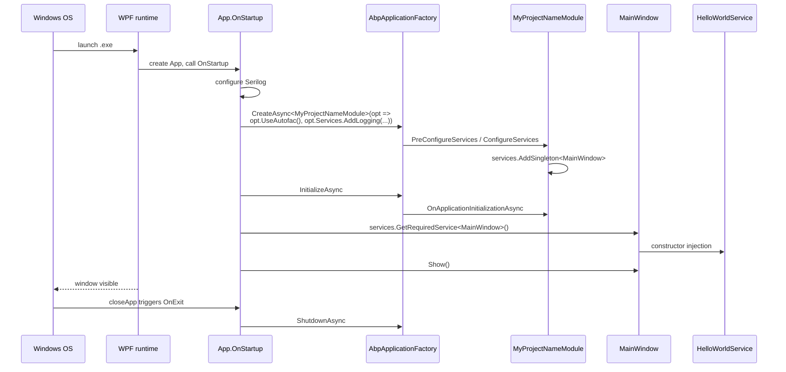

`templates/wpf/` is the ABP Framework's WPF startup template — a Windows-only desktop application that boots ABP modularity inside `App.OnStartup`, then resolves the main window from the framework's IoC container. The pattern differs subtly from the console and MAUI templates: there is **no** `IHostBuilder` or `MauiAppBuilder` to plug into. Instead, the code calls `AbpApplicationFactory.CreateAsync<MyProjectNameModule>` directly. This page covers every file in the template — the csproj, `App.xaml.cs`, `MainWindow.xaml.cs`, the `HelloWorldService` demo, and the `MyProjectNameModule` that registers `MainWindow` as a singleton.

## Solution layout

```
templates/wpf/
├── MyCompanyName.MyProjectName.slnx
├── common.props
└── src/
    └── MyCompanyName.MyProjectName/
        ├── App.xaml
        ├── App.xaml.cs
        ├── AssemblyInfo.cs
        ├── HelloWorldService.cs
        ├── MainWindow.xaml
        ├── MainWindow.xaml.cs
        ├── MyCompanyName.MyProjectName.csproj
        ├── MyProjectNameModule.cs
        └── appsettings.json
```

The solution manifest references a single project:

```xml templates/wpf/MyCompanyName.MyProjectName.slnx
<Solution>
  <Folder Name="/src/">
    <Project Path="src/MyCompanyName.MyProjectName/MyCompanyName.MyProjectName.csproj" />
  </Folder>
</Solution>
```

The CLI dispatch is handled by `WpfTemplate.TemplateName = "wpf"` in `framework/src/Volo.Abp.Cli.Core/Volo/Abp/Cli/ProjectBuilding/Templates/Wpf/WpfTemplate.cs`. The shared `templates/wpf/common.props` matches the console template (no `AbpProjectType`, `Version` 0.1.0).

## The `.csproj` — WPF SDK with Autofac

`templates/wpf/src/MyCompanyName.MyProjectName/MyCompanyName.MyProjectName.csproj` opts into WPF via `<UseWPF>true</UseWPF>` and targets a Windows-flavoured framework:

```xml templates/wpf/src/MyCompanyName.MyProjectName/MyCompanyName.MyProjectName.csproj
<Project Sdk="Microsoft.NET.Sdk">

    <Import Project="..\..\common.props" />

    <PropertyGroup>
        <OutputType>WinExe</OutputType>
        <TargetFramework>net10.0-windows</TargetFramework>
        <Nullable>enable</Nullable>
        <UseWPF>true</UseWPF>
    </PropertyGroup>

    <ItemGroup>
        <ProjectReference Include="..\..\..\..\framework\src\Volo.Abp.Autofac\Volo.Abp.Autofac.csproj" />
    </ItemGroup>

    <ItemGroup>
        <PackageReference Include="Microsoft.Extensions.Hosting" Version="10.0.2" />
        <PackageReference Include="Serilog.Extensions.Hosting" Version="9.0.0" />
        <PackageReference Include="Serilog.Extensions.Logging" Version="9.0.2" />
        <PackageReference Include="Serilog.Sinks.Async" Version="2.1.0" />
        <PackageReference Include="Serilog.Sinks.File" Version="7.0.0" />
    </ItemGroup>

    <ItemGroup>
      <None Remove="appsettings.json" />
      <Content Include="appsettings.json">
        <CopyToOutputDirectory>Always</CopyToOutputDirectory>
      </Content>
    </ItemGroup>

</Project>
```

| Property | Effect |
|---|---|
| `<OutputType>WinExe</OutputType>` | Windowed (no console window pops up on launch) |
| `<TargetFramework>net10.0-windows</TargetFramework>` | TFM with the Windows desktop runtime |
| `<UseWPF>true</UseWPF>` | Pulls the WPF SDK and XAML compiler |

Unlike the MAUI template, `appsettings.json` is **not** embedded — it is a `<Content>` item copied to the output directory alongside the EXE. WPF apps run from a known on-disk location, so this is simpler.

## `App.xaml.cs` — the `AbpApplicationFactory` pattern

This is the file that differs most from console and MAUI. Because WPF's `Application.OnStartup` is the canonical bootstrap hook, ABP is created **inside** that override rather than during builder construction:

```csharp templates/wpf/src/MyCompanyName.MyProjectName/App.xaml.cs
public partial class App : Application
{
    private IAbpApplicationWithInternalServiceProvider? _abpApplication;

    protected override async void OnStartup(StartupEventArgs e)
    {
        Log.Logger = new LoggerConfiguration()
#if DEBUG
            .MinimumLevel.Debug()
#else
            .MinimumLevel.Information()
#endif
            .MinimumLevel.Override("Microsoft", LogEventLevel.Information)
            .Enrich.FromLogContext()
            .WriteTo.Async(c => c.File("Logs/logs.txt"))
            .CreateLogger();

        try
        {
            Log.Information("Starting WPF host.");

            _abpApplication = await AbpApplicationFactory.CreateAsync<MyProjectNameModule>(options =>
            {
                options.UseAutofac();
                options.Services.AddLogging(loggingBuilder => loggingBuilder.AddSerilog(dispose: true));
            });

            await _abpApplication.InitializeAsync();

            _abpApplication.Services.GetRequiredService<MainWindow>()?.Show();
        }
        catch (Exception ex)
        {
            Log.Fatal(ex, "Host terminated unexpectedly!");
        }
    }

    protected override async void OnExit(ExitEventArgs e)
    {
        if (_abpApplication != null)
        {
            await _abpApplication.ShutdownAsync();
        }
        Log.CloseAndFlush();
    }
}
```

Several aspects are worth noting:

| Aspect | Detail |
|---|---|
| `IAbpApplicationWithInternalServiceProvider` | This interface (in `Volo.Abp.Modularity`) means ABP owns the `IServiceProvider` rather than borrowing one from a host builder. |
| `AbpApplicationFactory.CreateAsync<TStartupModule>(opt)` | Top-level factory that builds the modules and returns the application object. |
| `options.UseAutofac()` | Tells ABP to swap the default Microsoft DI container for Autofac during build. |
| `options.Services.AddLogging(... AddSerilog(dispose: true))` | Serilog wired through Microsoft.Extensions.Logging, with `dispose: true` so Serilog flushes on container disposal. |
| `await _abpApplication.InitializeAsync()` | Runs every module's `OnApplicationInitializationAsync`. |
| `_abpApplication.Services.GetRequiredService<MainWindow>()?.Show()` | Resolves the main window from ABP's container (registered as singleton in the module) and displays it. |
| `OnExit` calls `ShutdownAsync()` | Symmetric cleanup of ABP modules and Serilog. |

The pattern of resolving `MainWindow` through the container (instead of `new MainWindow()`) means MainWindow can receive any constructor-injected service — `HelloWorldService` in the demo.

## `App.xaml`

`templates/wpf/src/MyCompanyName.MyProjectName/App.xaml` is intentionally bare so that no `StartupUri` causes WPF to construct the window twice — `App.OnStartup` does it explicitly via the container:

```xml templates/wpf/src/MyCompanyName.MyProjectName/App.xaml
<Application x:Class="MyCompanyName.MyProjectName.App"
             xmlns="http://schemas.microsoft.com/winfx/2006/xaml/presentation"
             xmlns:x="http://schemas.microsoft.com/winfx/2006/xaml"
             xmlns:local="clr-namespace:MyCompanyName.MyProjectName">
    <Application.Resources>

    </Application.Resources>
</Application>
```

Removing `StartupUri="MainWindow.xaml"` is mandatory — otherwise WPF would instantiate `MainWindow` via reflection without ABP DI, and then the container-resolved instance from `OnStartup` would be a *second* window.

## `MyProjectNameModule` — register `MainWindow` as singleton

The single module not only declares the Autofac dependency but also explicitly registers `MainWindow` so that ABP returns the same instance to `App.OnStartup`:

```csharp templates/wpf/src/MyCompanyName.MyProjectName/MyProjectNameModule.cs
[DependsOn(typeof(AbpAutofacModule))]
public class MyProjectNameModule : AbpModule
{
    public override void ConfigureServices(ServiceConfigurationContext context)
    {
        context.Services.AddSingleton<MainWindow>();
    }
}
```

`AddSingleton` (rather than `AddTransient`) prevents a second resolution from creating another window. The `OnExit` handler then disposes the container, which disposes the window — clean shutdown.

## `MainWindow.xaml.cs` — DI-injected ContentPage equivalent

`MainWindow` uses constructor injection just like any ABP service. It overrides `OnContentRendered` to set the label text once the visual tree is ready:

```csharp templates/wpf/src/MyCompanyName.MyProjectName/MainWindow.xaml.cs
public partial class MainWindow : Window
{
    private readonly HelloWorldService _helloWorldService;

    public MainWindow(HelloWorldService helloWorldService)
    {
        _helloWorldService = helloWorldService;
        InitializeComponent();
    }

    protected override void OnContentRendered(EventArgs e)
    {
        HelloLabel.Content = _helloWorldService.SayHello();
    }
}
```

The matching XAML defines a single large label named `HelloLabel`:

```xml templates/wpf/src/MyCompanyName.MyProjectName/MainWindow.xaml
<Window x:Class="MyCompanyName.MyProjectName.MainWindow"
        ...
        Title="MainWindow" Height="450" Width="800">
    <Grid>
        <Label Name="HelloLabel" FontSize="90" Margin="58,129,-58,-129"/>
    </Grid>
</Window>
```

## `HelloWorldService` and ABP DI conventions

Same minimal `ITransientDependency` as the console/MAUI samples, with a logger property:

```csharp templates/wpf/src/MyCompanyName.MyProjectName/HelloWorldService.cs
public class HelloWorldService : ITransientDependency
{
    public ILogger<HelloWorldService> Logger { get; set; }

    public HelloWorldService()
    {
        Logger = NullLogger<HelloWorldService>.Instance;
    }
    public string SayHello()
    {
        Logger.LogInformation("Call SayHello");
        return "Hello world!";
    }
}
```

Auto-registration kicks in because `ITransientDependency` is a marker interface scanned by ABP's `OnRegistered` convention.

## `appsettings.json` and `AssemblyInfo.cs`

The default `appsettings.json` is an empty object — the WPF template doesn't bind any configuration at startup. The file is included so developers can extend without re-adding the `<Content>` lines:

```json templates/wpf/src/MyCompanyName.MyProjectName/appsettings.json
{

}
```

`templates/wpf/src/MyCompanyName.MyProjectName/AssemblyInfo.cs` carries the standard WPF theme attribute (no class definitions):

```csharp templates/wpf/src/MyCompanyName.MyProjectName/AssemblyInfo.cs
using System.Windows;

[assembly: ThemeInfo(
    ResourceDictionaryLocation.None,
    ResourceDictionaryLocation.SourceAssembly
)]
```

This is required by WPF — without it, the loader cannot find generic themes.

## Startup sequence



## Comparison with console and MAUI

| Aspect | Console | MAUI | WPF |
|---|---|---|---|
| Builder | `Host.CreateApplicationBuilder` | `MauiApp.CreateBuilder` | none (factory) |
| ABP entry | `AddApplicationAsync<...>` on `IServiceCollection` | `AddApplication<...>` on `IServiceCollection` | `AbpApplicationFactory.CreateAsync<...>` |
| Container | `AddAutofacServiceProviderFactory()` | `new AbpAutofacServiceProviderFactory(...)` | `options.UseAutofac()` |
| Config | `appsettings.json` on disk | embedded resource | `appsettings.json` on disk |
| Initialize | `host.InitializeAsync()` | `IAbpApplicationWithExternalServiceProvider.Initialize` | `_abpApplication.InitializeAsync()` |
| Window/page resolution | n/a | constructor injection in MainPage | `services.GetRequiredService<MainWindow>()` |
| Shutdown | host disposal | MAUI lifecycle | `OnExit` → `ShutdownAsync()` |

## File inventory

| File | Role | LoC |
|---|---|---|
| `App.xaml` | XAML application | 8 |
| `App.xaml.cs` | OnStartup wires ABP + Serilog | ~50 |
| `MainWindow.xaml` | Single label window | 12 |
| `MainWindow.xaml.cs` | Constructor-injected window | ~20 |
| `MyProjectNameModule.cs` | Single module, registers MainWindow singleton | ~15 |
| `HelloWorldService.cs` | Transient demo service | ~20 |
| `AssemblyInfo.cs` | WPF theme attribute | 7 |
| `appsettings.json` | Empty placeholder | 3 |
| `MyCompanyName.MyProjectName.csproj` | WPF SDK + Autofac + Serilog | ~30 |

## When to start from this template

Pick `templates/wpf/` when:

- You need a Windows-only line-of-business app.
- You want ABP dependency injection in WPF code-behind / view-models.
- You plan to add a `HttpApi.Client` reference and consume an ABP backend over HTTP.

If your application is cross-platform, prefer `templates/maui/`. If it's headless, prefer `templates/console/`.

## Cross-references

<Tip>
  The `AbpApplicationFactory.CreateAsync` and `IAbpApplicationWithInternalServiceProvider` types live in `framework/src/Volo.Abp.Core/Volo/Abp/` and are documented at [`/overview/architecture`](/overview/architecture). Their counterpart in ASP.NET Core hosts (`builder.AddApplicationAsync<...>`) is shown in [`/templates/app-template-aspnetcore`](/templates/app-template-aspnetcore).
</Tip>

<Note>
  How `WpfTemplate` is dispatched from the CLI is the same path as every other template — see [`/cli/project-building`](/cli/project-building) for `TemplateProjectBuilder` and [`/cli/templates-and-bundling`](/cli/templates-and-bundling) for the source-code store.
</Note>

This concludes the per-template walkthrough. Return to [`/templates/overview`](/templates/overview) for the cross-template catalog, or jump to [`/templates/app-template-aspnetcore`](/templates/app-template-aspnetcore) to start from the layered ASP.NET Core flagship.
