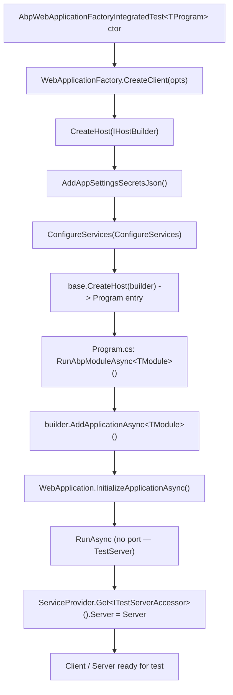
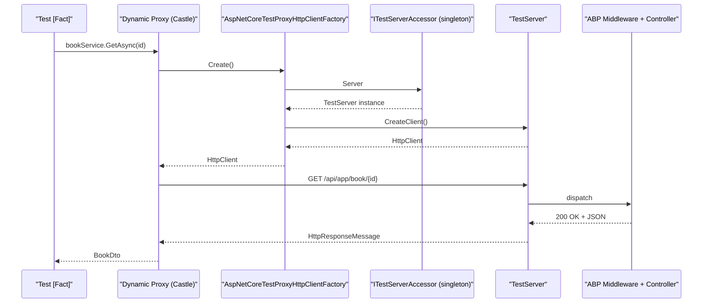

`Volo.Abp.AspNetCore.TestBase` is the ABP Framework package that wraps an entire ASP.NET Core host (Kestrel-free, in-memory) around the modular bootstrap of `Volo.Abp.TestBase`. It lets you write a `[Fact]` that posts JSON to a Razor Page, asserts on the rendered HTML, exercises a SignalR hub, or invokes a dynamic-proxy HTTP client — all without binding to a TCP port. This page reads the source under `framework/src/Volo.Abp.AspNetCore.TestBase/` end-to-end: the test module, the two test bases (`AbpWebApplicationFactoryIntegratedTest<TProgram>` and the now-obsolete `AbpAspNetCoreIntegratedTestBase<TStartupModule>`), and the helpers that glue them to ABP's HTTP client proxying.

The package layers four ABP modules together — `AbpHttpClientModule`, `AbpAspNetCoreModule`, `AbpTestBaseModule`, and `AbpAutofacModule` — and adds a handful of small types that make `TestServer` cooperate with the ABP application graph. The result is that the `IHost` you spin up in a test runs the same `OnApplicationInitialization` pipeline, the same middleware ordering, and the same DI scope rules that a published `Program.cs` would. Once you grasp the few moving parts in this directory you can write controller, page, and service-proxy tests with confidence.

## File map

Every public symbol the package exports lives in `framework/src/Volo.Abp.AspNetCore.TestBase/Volo/Abp/AspNetCore/TestBase/`:

| File | Symbol | Role |
| --- | --- | --- |
| `AbpAspNetCoreTestBaseModule.cs` | `AbpAspNetCoreTestBaseModule : AbpModule` | Composes the four modules above. |
| `AbpWebApplicationFactoryIntegratedTest.cs` | `AbpWebApplicationFactoryIntegratedTest<TProgram>` | Modern test base built on `WebApplicationFactory<TProgram>`. |
| `AbpAspNetCoreIntegratedTestBase.cs` | `AbpAspNetCoreIntegratedTestBase<TStartupModule>` *(obsolete)* | Legacy `IHostBuilder`-based base. |
| `AbpAspNetCoreAsyncIntegratedTestBase.cs` | `AbpAspNetCoreAsyncIntegratedTestBase<TModule>` *(obsolete)* | Awaitable version of the legacy base. |
| `TestStartup.cs` | `TestStartup<TStartupModule>` | Internal startup adapter for the legacy base. |
| `WebHostBuilderExtensions.cs` | `AbpWebHostBuilderExtensions.UseAbpTestServer()` | Replaces `IServer` + `IHostLifetime` with test versions. |
| `WebApplicationBuilderExtensions.cs` | `WebApplicationBuilderExtensions.RunAbpModuleAsync<T>()` | One-liner ABP module bootstrap for `WebApplication`. |
| `AbpNoopHostLifetime.cs`, `TestNoopHostLifetime.cs` | `*HostLifetime : IHostLifetime` | No-op lifetime so `Start/Stop` complete instantly. |
| `TestServerAccessor.cs`, `ITestServerAccessor.cs` | `(I)TestServerAccessor` | Singleton that holds the active `TestServer`. |
| `WebProjectPatchHelper.cs` | `GetWebProjectContentRootPathHelper` | Locates a web project's content root by walking up the directory tree. |
| `DynamicProxying/AspNetCoreTestProxyHttpClientFactory.cs` | `AspNetCoreTestProxyHttpClientFactory` | Replaces the production `IProxyHttpClientFactory` so dynamic proxies hit `TestServer`. |

The package also reads `appsettings.secrets.json` via the `AddAppSettingsSecretsJson()` extension from `Volo.Abp.Core` (`Microsoft/Extensions/Hosting/AbpHostingHostBuilderExtensions.cs`), used inside both `WebApplicationFactory.CreateHost` and the legacy `CreateHostBuilder`.

## The module

`AbpAspNetCoreTestBaseModule` (`AbpAspNetCoreTestBaseModule.cs`) is intentionally tiny — its whole job is to tie four modules together and let downstream test modules `[DependsOn]` on a single name:

```csharp
[DependsOn(typeof(AbpHttpClientModule))]
[DependsOn(typeof(AbpAspNetCoreModule))]
[DependsOn(typeof(AbpTestBaseModule))]
[DependsOn(typeof(AbpAutofacModule))]
public class AbpAspNetCoreTestBaseModule : AbpModule
{
}
```

The choice of dependencies is deliberate:

| Dependency | Why a test base needs it |
| --- | --- |
| `AbpHttpClientModule` | Enables dynamic HTTP-API proxies. The companion `AspNetCoreTestProxyHttpClientFactory` swaps its factory so calls hit `TestServer`. |
| `AbpAspNetCoreModule` | Pulls in ABP's request-pipeline middleware (`UseConfiguredEndpoints`, claims mapping, security headers, auditing, uow). |
| `AbpTestBaseModule` | Re-uses the marker module from `Volo.Abp.TestBase`. |
| `AbpAutofacModule` | Activates Autofac and dynamic-proxy interceptors. Without this, `[Authorize]`, `[Audited]`, `[UnitOfWork]` attributes are silently no-ops. |

<Note>
  Autofac is not optional here. The legacy `AbpAspNetCoreIntegratedTestBase` hard-codes `.UseAutofac()` on the host builder, and `AbpAspNetCoreAsyncIntegratedTestBase` does the same on `WebApplication.CreateBuilder()`. The modern `WebApplicationFactory` base inherits whatever `Program.cs` chose.
</Note>

## The modern base: `AbpWebApplicationFactoryIntegratedTest<TProgram>`

The file `AbpWebApplicationFactoryIntegratedTest.cs` is the recommended entry point for new tests. It inherits Microsoft's `WebApplicationFactory<TProgram>`, which is the `Microsoft.AspNetCore.Mvc.Testing` factory designed for minimal-API and top-level-`Program.cs` apps. The class is short enough to walk in full:

```csharp
public abstract class AbpWebApplicationFactoryIntegratedTest<TProgram> : WebApplicationFactory<TProgram>
    where TProgram : class
{
    protected HttpClient Client { get; set; }
    protected IServiceProvider ServiceProvider => Services;

    protected AbpWebApplicationFactoryIntegratedTest()
    {
        Client = CreateClient(new WebApplicationFactoryClientOptions
        {
            AllowAutoRedirect = false
        });
        ServiceProvider.GetRequiredService<ITestServerAccessor>().Server = Server;
    }

    protected override IHost CreateHost(IHostBuilder builder)
    {
        builder
            .AddAppSettingsSecretsJson()
            .ConfigureServices(ConfigureServices);
        return base.CreateHost(builder);
    }

    protected override void ConfigureWebHost(IWebHostBuilder builder)
    {
        builder.ConfigureAppConfiguration((hostingContext, config) =>
        {
            hostingContext.HostingEnvironment.EnvironmentName = "Production";
        });
        base.ConfigureWebHost(builder);
    }
    // ... GetService / GetRequiredService / keyed-service helpers ...
    // ... GetUrl<TController> helpers ...
}
```

Three details deserve highlighting:

1. **Auto-redirect is disabled.** Tests typically want to assert on the `302` itself, so the factory client opts out of following `Location` headers. Override `CreateClient(...)` in your subclass if you need different behaviour.
2. **Environment is forced to `Production`.** This avoids accidental dev-only behaviour (developer exception page, Swagger UI) and keeps tests deterministic. Override `ConfigureWebHost` to flip it if a test needs Development semantics.
3. **`ITestServerAccessor.Server = Server` is set in the constructor.** The shared accessor is consumed by `AspNetCoreTestProxyHttpClientFactory` (covered below) and by any test fixture that needs the raw `TestServer`.

### Anatomy of a test

The full type is `AbpWebApplicationFactoryIntegratedTest<TProgram> : WebApplicationFactory<TProgram>`, which means everything `WebApplicationFactory` provides — `CreateClient`, `CreateDefaultClient`, `WithWebHostBuilder`, `Services` — is available. ABP adds:

| Member | Source | Purpose |
| --- | --- | --- |
| `Client` | `AbpWebApplicationFactoryIntegratedTest` ctor | Pre-configured `HttpClient` with `AllowAutoRedirect = false`. |
| `ServiceProvider` | Inherited `Services` | Compatibility alias used by callers expecting the name. |
| `GetService<T>()`, `GetRequiredService<T>()`, keyed variants | Same file | Mirror `AbpTestBaseWithServiceProvider`. |
| `GetUrl<TController>()`, `GetUrl<TController>(string)`, `GetUrl<TController>(string, object)` | Same file | Convention-based URL builder. |
| `ConfigureServices(IServiceCollection)` | virtual no-op | Last-chance DI tweak; runs inside `CreateHost`. |

The `GetUrl<TController>(...)` helpers use `RemovePostFix("Controller", "AppService", "ApplicationService", "IntService", "IntegrationService", "Service")` so a `BookAppService` resolves to `/Book`. The variant with a `queryStringParamsAsAnonymousObject` flattens an anonymous object via `RouteValueDictionary` and appends `?key=value` pairs joined by `&`. This is the same algorithm used by ABP's dynamic HTTP-API client conventions.

### Wiring a test project

A typical consumer derives a thin base from `AbpWebApplicationFactoryIntegratedTest<Program>` in its own test assembly. The reference example is `framework/test/Volo.Abp.AspNetCore.Tests/Volo/Abp/AspNetCore/AbpAspNetCoreTestBase.cs`:

```csharp
public class AbpAspNetCoreTestBase : AbpAspNetCoreTestBase<Program>
{
}

public abstract class AbpAspNetCoreTestBase<TProgram> : AbpWebApplicationFactoryIntegratedTest<TProgram>
    where TProgram : class
{
    protected virtual async Task<T> GetResponseAsObjectAsync<T>(string url, HttpStatusCode expectedStatusCode = HttpStatusCode.OK)
    {
        var strResponse = await GetResponseAsStringAsync(url, expectedStatusCode);
        return JsonSerializer.Deserialize<T>(strResponse, new JsonSerializerOptions { PropertyNamingPolicy = JsonNamingPolicy.CamelCase });
    }

    protected virtual async Task<string> GetResponseAsStringAsync(string url, HttpStatusCode expectedStatusCode = HttpStatusCode.OK)
    {
        using (var response = await GetResponseAsync(url, expectedStatusCode))
        {
            return await response.Content.ReadAsStringAsync();
        }
    }

    protected virtual async Task<HttpResponseMessage> GetResponseAsync(string url, HttpStatusCode expectedStatusCode = HttpStatusCode.OK, bool xmlHttpRequest = false)
    {
        using (var requestMessage = new HttpRequestMessage(HttpMethod.Get, url))
        {
            requestMessage.Headers.Add("Accept-Language", CultureInfo.CurrentUICulture.Name);
            if (xmlHttpRequest)
            {
                requestMessage.Headers.Add(HeaderNames.XRequestedWith, "XMLHttpRequest");
            }
            var response = await Client.SendAsync(requestMessage);
            response.StatusCode.ShouldBe(expectedStatusCode);
            return response;
        }
    }
}
```

The three helpers (`GetResponseAsync`, `GetResponseAsStringAsync`, `GetResponseAsObjectAsync`) are the canonical pattern. They send `Accept-Language` from the current culture, optionally identify the request as XHR via `XRequestedWith`, and assert the status code inline. The same pattern reappears (sometimes copy-pasted) in module-level test bases such as `AspNetCoreMvcTestBase` (`framework/test/Volo.Abp.AspNetCore.Mvc.Tests/Volo/Abp/AspNetCore/Mvc/AspNetCoreMvcTestBase.cs`, which is itself `: AbpAspNetCoreTestBase<Program>`).

### The `Program.cs` of a test web

The `TProgram` type parameter must be a class in the assembly hosting the web entry point. ABP test webs use `WebApplicationBuilderExtensions.RunAbpModuleAsync<TModule>()` to bootstrap themselves:

```csharp
public async static Task RunAbpModuleAsync<TModule>(this WebApplicationBuilder builder,
    Action<AbpApplicationCreationOptions>? optionsAction = null, string? applicationName = null)
    where TModule : IAbpModule
{
    applicationName = applicationName ?? typeof(TModule).Assembly.GetName()?.Name;
    if (!applicationName.IsNullOrWhiteSpace())
    {
        // Set the application name as the assembly name of the module will automatically add assembly to the ApplicationParts of MVC application.
        builder.Environment.ApplicationName = applicationName;
    }

    builder.Host.UseAutofac();
    await builder.AddApplicationAsync<TModule>(optionsAction);
    var app = builder.Build();
    await app.InitializeApplicationAsync();
    await app.RunAsync();
}
```

The comment in the source explains the application-name trick: setting `Environment.ApplicationName` to the test module's assembly causes MVC's `ApplicationPartManager` to discover controllers in that assembly automatically — otherwise it would only find controllers in the executing entry assembly.



## The legacy base: `AbpAspNetCoreIntegratedTestBase<TStartupModule>`

`AbpAspNetCoreIntegratedTestBase.cs` is marked `[Obsolete("Use AbpWebApplicationFactoryIntegratedTest instead.")]` but is still used by many older tests in the repo. It is worth understanding because the obsolete attribute does not delete those tests overnight, and its mechanism reveals how `UseAbpTestServer()` works:

```csharp
[Obsolete("Use AbpWebApplicationFactoryIntegratedTest instead.")]
public abstract class AbpAspNetCoreIntegratedTestBase<TStartupModule> : AbpTestBaseWithServiceProvider, IDisposable
    where TStartupModule : class
{
    protected TestServer Server { get; }
    protected HttpClient Client { get; }
    private readonly IHost _host;

    protected AbpAspNetCoreIntegratedTestBase()
    {
        var builder = CreateHostBuilder();
        _host = builder.Build();
        _host.Start();

        Server = _host.GetTestServer();
        Client = _host.GetTestClient();

        ServiceProvider = Server.Services;
        ServiceProvider.GetRequiredService<ITestServerAccessor>().Server = Server;
    }

    protected virtual IHostBuilder CreateHostBuilder()
    {
        return Host.CreateDefaultBuilder()
            .AddAppSettingsSecretsJson()
            .ConfigureWebHostDefaults(webBuilder =>
            {
                if (typeof(TStartupModule).IsAssignableTo<IAbpModule>())
                {
                    webBuilder.UseStartup<TestStartup<TStartupModule>>();
                }
                else
                {
                    webBuilder.UseStartup<TStartupModule>();
                }
                webBuilder.UseAbpTestServer();
            })
            .UseAutofac()
            .ConfigureServices(ConfigureServices);
    }
}
```

There are two interesting branches in `CreateHostBuilder()`:

1. If `TStartupModule` implements `IAbpModule`, it is wrapped in the internal `TestStartup<TStartupModule>` adapter — a class that calls `services.AddApplicationAsync(typeof(TStartupModule))` via `AsyncHelper.RunSync` from `ConfigureServices`, and `app.InitializeApplicationAsync` from `Configure`. This lets you point the base at an `AbpModule` directly without writing a `Startup` class.
2. If `TStartupModule` is an old-style `Startup` (not an `AbpModule`), it is used as-is. The `Startup` class is then expected to do its own ABP wiring.

The async sibling `AbpAspNetCoreAsyncIntegratedTestBase<TModule>` follows the same shape but uses `WebApplication.CreateBuilder()` and `await builder.Services.AddApplicationAsync<TModule>(...)`. It still relies on the same `ITestServerAccessor` indirection.

### `UseAbpTestServer()`

The extension that turns a regular `IWebHostBuilder` into one that boots into `TestServer` lives in `WebHostBuilderExtensions.cs`:

```csharp
public static IWebHostBuilder UseAbpTestServer(this IWebHostBuilder builder)
{
    return builder.ConfigureServices(services =>
    {
        services.AddScoped<IHostLifetime, AbpNoopHostLifetime>();
        services.AddScoped<IServer, TestServer>();
    });
}
```

The two replacements are what make the legacy base work without binding a port. `AbpNoopHostLifetime` (`AbpNoopHostLifetime.cs`) returns completed tasks from both `WaitForStartAsync` and `StopAsync`. The companion `TestNoopHostLifetime` (`TestNoopHostLifetime.cs`) is identical and is used by the async variant — the two classes exist because they were introduced for different DI registrations and are kept separate for backward compatibility.

## `ITestServerAccessor` and the proxy HTTP client factory

A particularly elegant piece of the package is how dynamic HTTP-API clients are made to hit `TestServer` instead of a real network endpoint. `ITestServerAccessor` (`ITestServerAccessor.cs`) is a one-property interface holding the active server:

```csharp
public interface ITestServerAccessor
{
    TestServer Server { get; set; }
}
```

The implementation is a singleton in `TestServerAccessor.cs`:

```csharp
public class TestServerAccessor : ITestServerAccessor, ISingletonDependency
{
    public TestServer Server { get; set; } = default!;
}
```

Then `AspNetCoreTestProxyHttpClientFactory.cs` in the `DynamicProxying/` subfolder replaces ABP's production `IProxyHttpClientFactory`:

```csharp
[Dependency(ReplaceServices = true)]
public class AspNetCoreTestProxyHttpClientFactory : IProxyHttpClientFactory, ITransientDependency
{
    private readonly ITestServerAccessor _testServerAccessor;

    public AspNetCoreTestProxyHttpClientFactory(ITestServerAccessor testServerAccessor)
    {
        _testServerAccessor = testServerAccessor;
    }

    public HttpClient Create() => _testServerAccessor.Server.CreateClient();
    public HttpClient Create(string name) => Create();
}
```

`[Dependency(ReplaceServices = true)]` tells ABP's conventional registrar to *replace* the production `IProxyHttpClientFactory` registered by `Volo.Abp.Http.Client`. The factory ignores the named-client argument and returns a `TestServer.CreateClient()` for every name. The effect is dramatic: any `[RemoteService]` interface that goes through ABP's dynamic proxy will now hit your in-memory `TestServer` — perfect for integration tests of HTTP-API consumers.



<Tip>
  This wiring is automatic the moment your test composition `[DependsOn]` on `AbpAspNetCoreTestBaseModule`. You do not need to register `AspNetCoreTestProxyHttpClientFactory` yourself — `[Dependency(ReplaceServices = true)]` plus `ITransientDependency` do the work.
</Tip>

## A reference test module

`framework/test/Volo.Abp.AspNetCore.Mvc.Tests/Volo/Abp/AspNetCore/Mvc/AbpAspNetCoreMvcTestModule.cs` is the canonical reference for an integration test module that uses this package. The relevant excerpt is the module composition and the OnApplicationInitialization pipeline:

```csharp
[DependsOn(
    typeof(AbpAspNetCoreTestBaseModule),
    typeof(AbpMemoryDbTestModule),
    typeof(AbpAspNetCoreMvcModule),
    typeof(AbpAutofacModule),
    typeof(AbpFluentValidationModule)
    )]
public class AbpAspNetCoreMvcTestModule : AbpModule
{
    public override void ConfigureServices(ServiceConfigurationContext context)
    {
        // ... fake authentication, options, conventional controllers ...
        context.Services.AddAuthentication(options =>
        {
            options.DefaultAuthenticateScheme = FakeAuthenticationSchemeDefaults.Scheme;
            options.DefaultChallengeScheme = "Bearer";
            options.DefaultForbidScheme = "Cookie";
        }).AddFakeAuthentication().AddCookie("Cookie").AddJwtBearer("Bearer", _ => { });

        Configure<AbpMvcLibsOptions>(options =>
        {
            options.CheckLibs = false;
        });
    }

    public override void OnApplicationInitialization(ApplicationInitializationContext context)
    {
        var app = context.GetApplicationBuilder();
        app.UseCorrelationId();
        app.UseStaticFiles();
        app.UseAbpRequestLocalization();
        app.UseAbpSecurityHeaders();
        app.UseRouting();
        app.UseAuthentication();
        app.UseAuthorization();
        app.UseAbpTimeZone();
        app.UseAuditing();
        app.UseUnitOfWork();
        app.UseConfiguredEndpoints();
    }
}
```

Two patterns to copy in your own test modules:

1. `AddFakeAuthentication()` with `DefaultAuthenticateScheme = FakeAuthenticationSchemeDefaults.Scheme` short-circuits cookie/JWT issuance for tests. The fake scheme is defined in `Volo.Abp.AspNetCore.Mvc.Tests` and acts as a test-double.
2. `AbpMvcLibsOptions.CheckLibs = false` disables the runtime check that scans the `/libs/` folder. Tests don't ship libs and the check is noisy.

## Helpers that rarely make headlines

### `GetWebProjectContentRootPathHelper.Get(webProjectName)`

`WebProjectPatchHelper.cs` defines a static helper that walks up the directory tree from the test runner's working directory looking for a `.csproj` whose name matches `webProjectName`, then returns that project's directory. It is used to point `IWebHostEnvironment.ContentRootPath` at the real web project when tests need to serve its embedded files or its `wwwroot`:

```csharp
public static string Get(string webProjectName)
{
    var currentDirectory = new DirectoryInfo(Directory.GetCurrentDirectory());

    while (currentDirectory != null && Directory.GetParent(currentDirectory.FullName) != null)
    {
        currentDirectory = Directory.GetParent(currentDirectory.FullName);
        // ...
        var files = currentDirectory.GetFiles(webProjectName, SearchOption.AllDirectories);
        if (files.Length > 0) return files[0].DirectoryName!;
    }

    throw new AbpException($"Web project({webProjectName}) not found!");
}
```

Use it when a Razor Pages test needs to discover the original page files relative to where `dotnet test` is invoked.

### `TestStartup<TStartupModule>` (internal)

The legacy base uses this minimal `Startup` adapter:

```csharp
internal class TestStartup<TStartupModule>
{
    public void ConfigureServices(IServiceCollection services)
    {
        AsyncHelper.RunSync(() => services.AddApplicationAsync(typeof(TStartupModule)));
    }

    public void Configure(IApplicationBuilder app)
    {
        AsyncHelper.RunSync(app.InitializeApplicationAsync);
    }
}
```

The `AsyncHelper.RunSync` calls are exactly the deadlock-risk reason `AbpAspNetCoreAsyncIntegratedTestBase` and the newer `WebApplicationFactory`-based base exist.

## Lifecycle differences between the three bases

| Aspect | `AbpWebApplicationFactoryIntegratedTest<TProgram>` | `AbpAspNetCoreIntegratedTestBase<TStartupModule>` *(obsolete)* | `AbpAspNetCoreAsyncIntegratedTestBase<TModule>` *(obsolete)* |
| --- | --- | --- | --- |
| Underlying host abstraction | `WebApplicationFactory<TProgram>` | `IHostBuilder` + `Host.CreateDefaultBuilder()` | `WebApplication.CreateBuilder()` |
| ABP bootstrap path | Your `Program.cs` (`RunAbpModuleAsync<T>`) | `TestStartup<T>` adapter | `await builder.Services.AddApplicationAsync<T>()` |
| TestServer wiring | Automatic via factory | `webBuilder.UseAbpTestServer()` | `AddSingleton<IServer, TestServer>()` directly |
| HTTP client | `CreateClient(...)` with `AllowAutoRedirect = false` | `_host.GetTestClient()` | `Server.CreateClient()` |
| Dispose | Inherited from `WebApplicationFactory` | Manual `_host.Dispose()` in `IDisposable.Dispose` | `await WebApplication.DisposeAsync()` |
| Service provider | `Services` (inherited) | `Server.Services` | `Server.Services` |
| Test type | Synchronous constructor | Synchronous constructor | Async `InitializeAsync()` |

Use the first row for new tests. Use the second when you must extend an existing class hierarchy. Use the third when async startup is the only option (rare since `WebApplicationFactory` handles async internally).

## Patterns and recipes

### Recipe: assert on a response object

```csharp
public class BookController_Tests : AbpAspNetCoreTestBase
{
    [Fact]
    public async Task Should_Get_Book_By_Id()
    {
        var book = await GetResponseAsObjectAsync<BookDto>("/api/app/book/123");
        book.Title.ShouldNotBeNullOrEmpty();
    }
}
```

`GetResponseAsObjectAsync<T>` is defined in the consumer-side `AbpAspNetCoreTestBase` (`framework/test/Volo.Abp.AspNetCore.Tests/`). It calls `GetResponseAsStringAsync` and deserialises with `JsonNamingPolicy.CamelCase`.

### Recipe: resolve a dynamic-proxy HTTP API client

```csharp
public class CrossModule_Tests : AspNetCoreMvcTestBase
{
    [Fact]
    public async Task Should_Call_Other_Module_Via_Dynamic_Proxy()
    {
        var bookProxy = GetRequiredService<IBookAppService>();
        var book = await bookProxy.GetAsync(Guid.NewGuid());
        book.ShouldNotBeNull();
    }
}
```

The proxy uses `AspNetCoreTestProxyHttpClientFactory.Create()` under the hood, so the call goes through your `TestServer` without ever leaving the test process.

### Recipe: customise the test host

Override `ConfigureServices` (modern base) or `ConfigureServices(HostBuilderContext, IServiceCollection)` (legacy base) to add or replace services after the application has been added. Both extension points run *after* ABP modules have been configured, which is the correct place to install last-mile fakes (mock clocks, in-memory caches).

### Recipe: build extra `HttpClient`s

`WebApplicationFactory` exposes `CreateClient(WebApplicationFactoryClientOptions)` and `CreateDefaultClient(...)`. Use the former when you want auto-redirect, base address, or handler customisation different from the default. The base address defaults to `http://localhost/`.

## Failure modes

| Symptom | Likely cause | Fix |
| --- | --- | --- |
| `InvalidOperationException: Could not find a type named 'Program'` | Test points at the wrong `TProgram`. | Match `WebApplicationFactory<Program>` to the assembly containing your top-level `Program`. |
| `404` for a controller that exists | Controller assembly is not in MVC's ApplicationParts. | Use `RunAbpModuleAsync` so `Environment.ApplicationName` is set to your module's assembly. |
| `OperationCanceledException` during shutdown | A long-running hosted service is alive. | Override `Dispose` to give it more time, or skip it in tests. |
| Dynamic-proxy calls go to `localhost:80` | `AbpAspNetCoreTestBaseModule` is missing from the test module's `[DependsOn]`. | Add it, or ensure the proxy factory replacement runs. |
| `Authorize` attribute returns 401 unexpectedly | Fake authentication scheme not set as default. | Set `DefaultAuthenticateScheme = FakeAuthenticationSchemeDefaults.Scheme` like `AbpAspNetCoreMvcTestModule`. |

## Cross-references

- [Testing overview](/testing/overview) — how this package fits with the rest of the test infrastructure.
- [TestBase: AbpIntegratedTest](/testing/testbase) — the non-HTTP base whose helpers (`GetRequiredService`, etc.) you reuse here.
- [Framework tests catalog](/testing/framework-tests) — concrete uses of `AbpWebApplicationFactoryIntegratedTest`.
- [Module tests catalog](/testing/module-tests) — module-level HTTP tests under `modules/*/test`.
- [ASP.NET Core test base reference](/aspnetcore/test-base) — published package reference that complements this code-level walkthrough.
- [ABP application bootstrap](/core/abp-application-and-bootstrap) — production-side `RunAbpModuleAsync` analogue.
- [Modules overview](/modules/overview) — how modules compose under `Program.cs`.
- [In-memory database](/data/memory-db) — frequently combined with this base for zero-IO controller tests.
