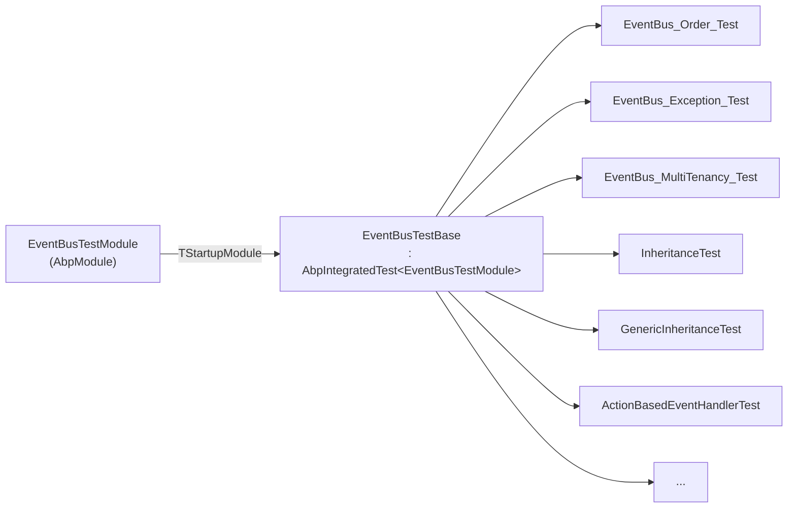
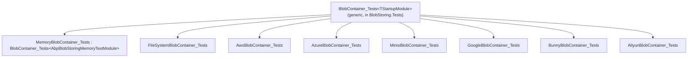

`framework/test/` is the largest single test surface in the ABP Framework repository: 85 directories holding xUnit projects, two helper libraries, and a shared sample application (`Volo.Abp.TestApp`) that many test modules embed instead of writing their own domain. Browsing it linearly is daunting, so this page groups the projects by purpose, points out the conventions that recur across clusters, and shows how reusable test suites like `BlobContainer_Tests<TStartupModule>` are activated once per provider. By the end you will be able to navigate the directory by cluster name, find an existing similar test, and copy the right pattern for your next one.

The collection follows a few rigid conventions. Every test project name ends in `.Tests`. Almost every project contains exactly one `*TestModule : AbpModule` and one `*TestBase : AbpIntegratedTest<*TestModule>` (or a derived ASP.NET Core base), with the rest of the files being `_Tests.cs` xUnit classes derived from that base. Cross-cluster reuse comes from `Volo.Abp.TestApp`, which provides a populated DDD domain (Person, City, Phone, Product), the canonical `TestAppTestBase<T>`, and the helper `WithUnitOfWorkAsync` that nearly every persistence test inherits. The `framework/test/AbpTestBase` project (note: not `Volo.Abp.TestBase` — that is in `framework/src/`) ships the Shouldly-flavoured `ServiceCollectionShouldlyExtensions` plus a tiny `ICanLogOnObject` interface.

## High-level inventory

The 85 directories fall into the groups below. Counts include `*.Tests`, helper projects, and sample apps; the percentage is of the 85 total.

| Cluster | Approximate count | Representative projects |
| --- | --- | --- |
| ASP.NET Core stack | 12 | `Volo.Abp.AspNetCore.Tests`, `Volo.Abp.AspNetCore.Mvc.Tests`, `Volo.Abp.AspNetCore.SignalR.Tests`, `Volo.Abp.AspNetCore.Serilog.Tests`, `Volo.Abp.AspNetCore.MultiTenancy.Tests`, `Volo.Abp.AspNetCore.Mvc.Versioning.Tests`, `Volo.Abp.AspNetCore.Authentication.OAuth.Tests`, `Volo.Abp.AspNetCore.Mvc.Client.Tests`, `Volo.Abp.AspNetCore.Mvc.UI.Tests`, `Volo.Abp.AspNetCore.Mvc.UI.Theme.Shared.Tests`, `Volo.Abp.AspNetCore.Mvc.PlugIn` |
| BlobStoring providers | 9 | `Volo.Abp.BlobStoring.Tests` (shared suite), `*.Memory.Tests`, `*.FileSystem.Tests`, `*.Aws.Tests`, `*.Azure.Tests`, `*.Aliyun.Tests`, `*.Bunny.Tests`, `*.Google.Tests`, `*.Minio.Tests` |
| EF Core / persistence | 5 | `Volo.Abp.EntityFrameworkCore.Tests`, `Volo.Abp.EntityFrameworkCore.Tests.SecondContext`, `Volo.Abp.MongoDB.Tests`, `Volo.Abp.MongoDB.Tests.SecondContext`, `Volo.Abp.MemoryDb.Tests`, `Volo.Abp.Dapper.Tests` |
| Cross-cutting DDD building blocks | 7 | `Volo.Abp.Auditing.Tests`, `Volo.Abp.Caching.Tests`, `Volo.Abp.Caching.StackExchangeRedis.Tests`, `Volo.Abp.Uow.Tests`, `Volo.Abp.Validation.Tests`, `Volo.Abp.ExceptionHandling.Tests`, `Volo.Abp.Specifications.Tests` |
| Eventing & messaging | 2 | `Volo.Abp.EventBus.Tests`, `Volo.Abp.BackgroundJobs.Tests` |
| Authorization / multi-tenancy | 4 | `Volo.Abp.Authorization.Tests`, `Volo.Abp.MultiTenancy.Tests`, `Volo.Abp.Features.Tests`, `Volo.Abp.GlobalFeatures.Tests` |
| HTTP / remote services | 4 | `Volo.Abp.Http.Tests`, `Volo.Abp.Http.Client.Tests`, `Volo.Abp.Http.Client.IdentityModel.Web.Tests`, `Volo.Abp.RemoteServices.Tests` |
| Imaging | 5 | `Volo.Abp.Imaging.Abstractions.Tests`, `*.AspNetCore.Tests`, `*.ImageSharp.Tests`, `*.MagickNet.Tests`, `*.SkiaSharp.Tests` |
| Text / serialization | 6 | `Volo.Abp.Json.Tests`, `Volo.Abp.Serialization.Tests`, `Volo.Abp.TextTemplating.Tests`, `*.Razor.Tests`, `*.Scriban.Tests`, `Volo.Abp.Minify.Tests` |
| Core building blocks | 9 | `Volo.Abp.Core.Tests`, `Volo.Abp.Ddd.Tests`, `Volo.Abp.Data.Tests`, `Volo.Abp.ObjectMapping.Tests`, `Volo.Abp.ObjectExtending.Tests`, `Volo.Abp.MultiLingualObjects.Tests`, `Volo.Abp.Settings.Tests`, `Volo.Abp.Timing.Tests`, `Volo.Abp.Threading.Tests` |
| DI / modularity | 4 | `Volo.Abp.Autofac.Tests`, `Volo.Abp.Castle.Core.Tests`, `Volo.Abp.Cli.Core.Tests`, `Volo.Abp.AutoMapper.Tests` |
| Localization / UI navigation | 2 | `Volo.Abp.Localization.Tests`, `Volo.Abp.UI.Navigation.Tests` |
| Mail / SMS / LDAP / AI / Mapperly | 8 | `Volo.Abp.Emailing.Tests`, `Volo.Abp.MailKit.Tests`, `Volo.Abp.Sms.Aliyun.Tests`, `Volo.Abp.Sms.TencenCloud.Tests`, `Volo.Abp.Ldap.Tests`, `Volo.Abp.AI.Tests`, `Volo.Abp.Mapperly.Tests`, `Volo.Abp.IdentityModel.Tests` |
| Distributed locking & security | 3 | `Volo.Abp.DistributedLocking.Abstractions.Tests`, `Volo.Abp.Security.Tests`, `Volo.Abp.FluentValidation.Tests` |
| VFS | 1 | `Volo.Abp.VirtualFileSystem.Tests` |
| Shared infrastructure / samples | 4 | `AbpTestBase` (Shouldly extensions), `SimpleConsoleDemo`, `Volo.Abp.TestApp`, `Volo.Abp.TestApp.Tests` |

The two `*.SecondContext` projects exist because EF Core and MongoDB tests need a *second* DbContext to verify multi-context scenarios; they are not standalone test assemblies but support libraries referenced by the primary `.Tests` project.

## The recurring pattern

Open almost any project in this folder and you will see the same three-file pattern. The example below is the simplest possible, taken from `framework/test/Volo.Abp.EventBus.Tests/`:

```csharp
// EventBusTestModule.cs
[DependsOn(typeof(AbpEventBusModule))]
public class EventBusTestModule : AbpModule { }

// Local/EventBusTestBase.cs
public abstract class EventBusTestBase : AbpIntegratedTest<EventBusTestModule>
{
    protected ILocalEventBus LocalEventBus;
    protected EventBusTestBase() { LocalEventBus = GetRequiredService<ILocalEventBus>(); }
    protected override void SetAbpApplicationCreationOptions(AbpApplicationCreationOptions options) => options.UseAutofac();
}

// Local/EventBus_Order_Test.cs
public class EventBus_Order_Test : EventBusTestBase
{
    [Fact] public async Task Handler_Should_Execute_By_Order() { /* ... */ }
}
```



The list of `_Tests.cs` files under `framework/test/Volo.Abp.EventBus.Tests/Volo/Abp/EventBus/Local/` (`ActionBasedEventHandlerTest`, `EventBus_DI_Services_Test`, `EventBus_Exception_Test`, `EventBus_MultiTenancy_Test`, `EventBus_MultipleHandle_Test`, `EventBus_Order_Test`, `GenericInheritanceTest`, `InheritanceTest`, `TransientDisposableEventHandlerTest`) is a microcosm of how a cluster builds out one assertion per behavioural concern.

## Cluster: ASP.NET Core

This cluster centres on `framework/test/Volo.Abp.AspNetCore.Tests/`, which defines `AbpAspNetCoreTestBase` (non-generic alias) and `AbpAspNetCoreTestBase<TProgram>` derived from `AbpWebApplicationFactoryIntegratedTest<TProgram>`. The MVC, SignalR, Versioning, Serilog, Authentication.OAuth, and MultiTenancy projects all chain off this base by inheriting it and supplying their own `*TestModule`. A typical specialisation is `AspNetCoreMvcTestBase` (`framework/test/Volo.Abp.AspNetCore.Mvc.Tests/Volo/Abp/AspNetCore/Mvc/AspNetCoreMvcTestBase.cs`):

```csharp
public abstract class AspNetCoreMvcTestBase : AbpAspNetCoreTestBase<Program>
{
}
```

The accompanying `AbpAspNetCoreMvcTestModule` `[DependsOn]` on `AbpAspNetCoreTestBaseModule`, `AbpMemoryDbTestModule`, `AbpAspNetCoreMvcModule`, `AbpAutofacModule`, and `AbpFluentValidationModule`, and configures `AddAuthentication()` with a `FakeAuthenticationSchemeDefaults` scheme, conventional controllers via `AbpAspNetCoreMvcOptions.ConventionalControllers.Create(...)`, embedded virtual files, localized resources, claims mapping, and the `AbpApplicationConfigurationOptions`. The pattern repeats with minor variations across the other AspNetCore projects.

The cluster also includes `Volo.Abp.AspNetCore.Mvc.PlugIn`, which is *not* a test assembly but a fixture sample of a plugin DLL loaded via ABP's plugin discovery — referenced by `Volo.Abp.AspNetCore.Mvc.Tests` to exercise the plugin path.

### Pattern: client-side proxy

`Volo.Abp.AspNetCore.Mvc.Client.Tests` exercises dynamic HTTP-API client proxies. The key insight is that `AspNetCoreTestProxyHttpClientFactory` (registered automatically by `AbpAspNetCoreTestBaseModule`) makes proxy calls hit `TestServer`. A `[Fact]` can resolve a remote-service interface via `GetRequiredService<IFooAppService>()`, call methods on it, and the call traverses the in-memory request pipeline.

## Cluster: BlobStoring providers

`framework/test/Volo.Abp.BlobStoring.Tests/` is the **shared suite**. It defines `AbpBlobStoringTestModule`, `AbpBlobStoringTestBase`, and a generic `BlobContainer_Tests<TStartupModule>` whose `[Fact]` methods use only `IBlobContainer<TestContainer1>` and `ICurrentTenant` — abstractions the providers all implement. Each provider then ships a thin assembly that injects its own `*TestModule` and re-runs the entire suite:

```csharp
// framework/test/Volo.Abp.BlobStoring.Memory.Tests/Volo/Abp/BlobStoring/Memory/AbpBlobStoringMemoryTestModule.cs
[DependsOn(
    typeof(AbpBlobStoringMemoryModule),
    typeof(AbpBlobStoringTestModule)
)]
public class AbpBlobStoringMemoryTestModule : AbpModule
{
    public override void PostConfigureServices(ServiceConfigurationContext context)
    {
        Configure<AbpBlobStoringOptions>(options =>
        {
            options.Containers.ConfigureAll((containerName, containerConfiguration) =>
            {
                containerConfiguration.UseMemory();
            });
        });
    }
}

// framework/test/Volo.Abp.BlobStoring.Memory.Tests/Volo/Abp/BlobStoring/Memory/MemoryBlobContainer_Tests.cs
public class MemoryBlobContainer_Tests : BlobContainer_Tests<AbpBlobStoringMemoryTestModule> { }
```

That last line — a single empty class declaration — is the entire test assembly's behavioural surface. Every `[Fact]` defined on `BlobContainer_Tests<>` is inherited by `MemoryBlobContainer_Tests`. The same trick applies for `FileSystem`, `Aws`, `Azure`, `Aliyun`, `Bunny`, `Google`, `Minio`. The provider-test assemblies effectively become *configuration* of the shared suite.



This generic-suite pattern is the most efficient way to test a provider abstraction in ABP — it should be the first option you reach for when introducing a new provider family.

## Cluster: EF Core, MongoDB, MemoryDb, Dapper

These projects share the embedded `Volo.Abp.TestApp` domain (Person, Phone, City, District, EntityWithIntPk, TestSharedTypeEntity, …) and exercise it through each persistence stack. The reusable helper is `TestAppTestBase<TStartupModule> : AbpIntegratedTest<TStartupModule>` at `framework/test/Volo.Abp.TestApp/Volo/Abp/TestApp/Testing/TestAppTestBase.cs`, which adds:

- `WithUnitOfWorkAsync(Func<Task>)` / `WithUnitOfWorkAsync<TResult>(...)` overloads with and without an `AbpUnitOfWorkOptions` argument — each opens a fresh DI scope, begins a UoW, awaits the action, and calls `uow.CompleteAsync()`.
- `SetAbpApplicationCreationOptions` defaulting to `options.UseAutofac()`.

The EF Core test module at `framework/test/Volo.Abp.EntityFrameworkCore.Tests/Volo/Abp/EntityFrameworkCore/AbpEntityFrameworkCoreTestModule.cs` is the canonical reference for SQLite-backed integration testing. It opens an in-memory SQLite connection, configures the `AbpDbContextOptions` to use it, registers three `DbContext`s (`TestAppDbContext`, `HostTestAppDbContext`, `TenantTestAppDbContext`), wires `DefaultWithDetailsFunc` for each entity, and migrates a second context (`SecondDbContext`) during `OnPreApplicationInitialization`:

```csharp
public override void OnPreApplicationInitialization(ApplicationInitializationContext context)
{
    context.ServiceProvider.GetRequiredService<SecondDbContext>().Database.Migrate();
    // ...
}
```

The matching test base is just three lines:

```csharp
public abstract class EntityFrameworkCoreTestBase : TestAppTestBase<AbpEntityFrameworkCoreTestModule>
{
    protected override void SetAbpApplicationCreationOptions(AbpApplicationCreationOptions options)
        => options.UseAutofac();
}
```

A test then runs entirely inside the UoW helper:

```csharp
[Fact]
public async Task Should_Track_Navigations()
{
    await WithUnitOfWorkAsync(async () =>
    {
        var personRepository = GetRequiredService<IRepository<Person, Guid>>();
        // ...
    });
}
```

The MongoDB counterpart at `framework/test/Volo.Abp.MongoDB.Tests/Volo/Abp/MongoDB/AbpMongoDbTestModule.cs` uses `MongoDbFixture.GetRandomConnectionString()` (which talks to a `MongoSandbox.MongoRunner` held in a static field) so every test instance gets its own database name without sharing data. `MongoDbFixture` lives at `framework/test/Volo.Abp.MongoDB.Tests/Volo/Abp/MongoDB/MongoDbFixture.cs`:

```csharp
public class MongoDbFixture : IDisposable
{
    public readonly static IMongoRunner MongoDbRunner;

    static MongoDbFixture()
    {
        MongoDbRunner = MongoRunner.Run(new MongoRunnerOptions
        {
            UseSingleNodeReplicaSet = true,
            ReplicaSetSetupTimeout = TimeSpan.FromSeconds(30)
        });
    }

    public static string GetRandomConnectionString()
        => GetConnectionString("Db_" + Guid.NewGuid().ToString("N"));
    // ...
}
```

The `MemoryDb` cluster (`framework/test/Volo.Abp.MemoryDb.Tests/`) gives you the same `TestApp` domain over an in-process JSON-backed store — no IO, no setup. `MemoryDbTestBase : AbpIntegratedTest<AbpMemoryDbTestModule>` is the recommended base for tests that don't actually need EF Core semantics.

## Cluster: cross-cutting DDD building blocks

`Volo.Abp.Auditing.Tests`, `Volo.Abp.Uow.Tests`, `Volo.Abp.Caching.Tests`, `Volo.Abp.Validation.Tests`, `Volo.Abp.ExceptionHandling.Tests`, and `Volo.Abp.Specifications.Tests` all follow the same shape: an empty marker base plus a feature-specific test module. `AbpAuditingTestModule` at `framework/test/Volo.Abp.Auditing.Tests/Volo/Abp/Auditing/AbpAuditingTestModule.cs` brings in `AbpTestBaseModule`, `AbpAutofacModule`, and `AbpEntityFrameworkCoreSqliteModule`, opens an in-memory SQLite, registers `AbpAuditingTestDbContext`, configures `AbpAuditingOptions.EntityHistorySelectors`, and exposes the resulting graph to `AbpAuditingTestBase`. Every `_Tests.cs` file then asserts a single auditing concern (creation audit, modification audit, entity version, history selectors).

The Caching tests at `framework/test/Volo.Abp.Caching.Tests/Volo/Abp/Caching/` replace the production `IDistributedCache` with `TestMemoryDistributedCache` — a one-file fake. The same fake is referenced by `Volo.Abp.TestApp.TestAppModule.ConfigureServices()` so any test that uses the `TestApp` domain gets a deterministic cache.

## Cluster: EventBus, BackgroundJobs

The eventbus tests use the minimal `EventBusTestModule` shown above, plus a separate `LocalDistributedEventBusTestBase` for in-process distributed-event scenarios. The interesting trick is that handler classes are *nested* inside the test class so xUnit's auto-discovery picks them up via ABP's transient registration, e.g. `MyOrderEventHandler : ILocalEventHandler<MyOrderEventHandlerEventData>, ITransientDependency` appears inside `EventBus_Order_Test`. ABP's conventional registrar finds the handler at module-initialization time because it lives in the same assembly as the test module.

BackgroundJobs tests follow the same pattern: a `BackgroundJobTestModule`, a `BackgroundJobTestBase`, and `_Tests.cs` classes that submit a `IBackgroundJobManager.EnqueueAsync(...)` and assert side-effects via `ITestCounter`.

## Cluster: Authorization, MultiTenancy, Features, GlobalFeatures

`AbpAuthorizationTestModule` (`framework/test/Volo.Abp.Authorization.Tests/Volo/Abp/Authorization/AbpAuthorizationTestModule.cs`) registers four permission value providers and two resource permission value providers via `Configure<AbpPermissionOptions>()`, and hooks `Services.OnRegistered` so the `AuthorizationInterceptor` is attached to any `IMyAuthorizedService1` implementation. The matching `AuthorizationTestBase` replaces `ICurrentPrincipalAccessor` with an NSubstitute-backed fake whose `Principal` returns a `ClaimsPrincipal` carrying `AbpClaimTypes.UserName`, `AbpClaimTypes.UserId`, and `AbpClaimTypes.Role` claims.

The multi-tenancy tests at `framework/test/Volo.Abp.MultiTenancy.Tests/Volo/Abp/MultiTenancy/` use the literally empty `MultiTenancyTestBase : AbpIntegratedTest<MultiTenancyTestModule>` and rely on the test modules to configure tenant resolvers and connection-string options.

## Cluster: HTTP, RemoteServices, IdentityModel

These projects test ABP's HTTP-client infrastructure. They typically bring up a real `TestServer` (via `AbpAspNetCoreTestBaseModule`) and an HTTP-client-consumer test module that registers a dynamic proxy. `Volo.Abp.Http.Client.Tests` is the broadest, covering correlation-ID propagation, exception unwrapping, and remote-service options.

## Cluster: Imaging providers

Like BlobStoring, the imaging tests use a shared abstract suite (`Volo.Abp.Imaging.Abstractions.Tests`) plus provider-specific projects that re-host the suite under a different module. `Volo.Abp.Imaging.AspNetCore.Tests` is the outlier — it tests the controller-level integration via `AbpAspNetCoreTestBase`.

## Cluster: text, serialization, mapping

`Volo.Abp.Json.Tests`, `Volo.Abp.Serialization.Tests`, `Volo.Abp.TextTemplating.Tests` (and its `Razor` / `Scriban` variants), `Volo.Abp.Minify.Tests`, `Volo.Abp.AutoMapper.Tests`, and `Volo.Abp.Mapperly.Tests` all derive from `AbpIntegratedTest<TheirTestModule>` and primarily exercise pure functions: serialise an object, render a template, map between types. They are valuable because they prove ABP options propagate correctly through `Configure<TOptions>()`.

## Cluster: Core building blocks

`Volo.Abp.Core.Tests` is the only cluster that tests `Volo.Abp.Core` itself — module activation order, `OnPreApplicationInitialization` ordering, generic-host integration, plugin sources. `Volo.Abp.Ddd.Tests` covers entities, aggregate roots, domain events, and value objects. `Volo.Abp.Data.Tests`, `Volo.Abp.ObjectExtending.Tests`, `Volo.Abp.MultiLingualObjects.Tests`, `Volo.Abp.Settings.Tests`, `Volo.Abp.Timing.Tests`, and `Volo.Abp.Threading.Tests` each focus on one cross-cutting facility.

## Cluster: DI and modularity

`Volo.Abp.Autofac.Tests` runs the module pipeline end-to-end with `UseAutofac()`. `Volo.Abp.Castle.Core.Tests` covers dynamic-proxy interceptor wiring at the Castle level. `Volo.Abp.Cli.Core.Tests` tests the CLI command-discovery and template-engine internals; importantly, it does *not* derive from `AbpIntegratedTest` because the CLI has its own bootstrap path.

## Cluster: shared helpers

- `framework/test/AbpTestBase/` — Shouldly extensions and `ICanLogOnObject`. Reference this project from any test assembly that asserts on DI registrations.
- `framework/test/Volo.Abp.TestApp/` — the embedded domain (`Person`, `Phone`, `City`, `District`, `EntityWithIntPk`, `TestSharedTypeEntity`, `AppEntityWithNavigations`, …), `TestAppModule : AbpModule`, `TestAppTestBase<T>`, and the `TestMemoryDistributedCache`. EF Core, MongoDB, MemoryDb, and Auditing all rely on it.
- `framework/test/Volo.Abp.TestApp.Tests/` — sanity tests against the `TestApp` domain itself, ensuring the sample remains valid as ABP evolves.
- `framework/test/SimpleConsoleDemo/` — a non-xUnit console app used as a smoke harness for the modular host.

## Patterns that recur across clusters

The same five idioms appear in nearly every project:

| Idiom | Where to see it | Why it matters |
| --- | --- | --- |
| `[DependsOn(typeof(AbpAutofacModule))]` + `options.UseAutofac()` in `SetAbpApplicationCreationOptions` | Almost every base | Required for dynamic-proxy interceptors. |
| `OnApplicationInitialization` seeds via a `TestDataBuilder` resolved from a new scope | `TestAppModule`, `AbpIdentityTestBaseModule` | Keeps seed code reusable and DI-friendly. |
| In-memory SQLite via `Microsoft.Data.Sqlite` + `IRelationalDatabaseCreator.CreateTables()` | EF Core test modules | Avoids running migrations while still using SQL semantics. |
| `[Dependency(ReplaceServices = true)]` fakes (e.g. `AspNetCoreTestProxyHttpClientFactory`) | `AbpAspNetCoreTestBase`, `TestMemoryDistributedCache` | Replaces concrete infrastructure without subclassing. |
| Generic shared suite (e.g. `BlobContainer_Tests<TStartupModule>`) re-hosted per provider | BlobStoring, Imaging | Maximises behavioural coverage per provider with near-zero per-assembly code. |

## How `test-all.ps1` runs this directory

`build/test-all.ps1` does not iterate test projects directly — it iterates the solution paths defined in `build/common.ps1`, which include `../framework` as the very first entry. Running it from `build/` runs `dotnet test` against the framework solution (`framework/Volo.Abp.Framework.sln`) which transitively builds and tests every project listed above. The `--collect:"XPlat Code Coverage"` switch produces a `coverage.cobertura.xml` per project that CI aggregates.

```powershell
dotnet test --no-build --no-restore --collect:"XPlat Code Coverage"
```

The `--no-build --no-restore` flags exist because `build/build-all.ps1` (or `build-all-release.ps1`) is expected to have built the solution first; `test-all.ps1` is the second leg of a two-step CI gate.

## Worked example: how `MultiTenancy_Tests` configures default tenants

The MultiTenancy cluster shows how a test customises options that would normally come from configuration. `CurrentTenant_Tests` at `framework/test/Volo.Abp.MultiTenancy.Tests/Volo/Abp/MultiTenancy/CurrentTenant_Tests.cs` overrides `BeforeAddApplication` to inject default tenants:

```csharp
public class CurrentTenant_Tests : MultiTenancyTestBase
{
    private readonly ICurrentTenant _currentTenant;
    private readonly Guid _tenantAId = Guid.NewGuid();
    private readonly Guid _tenantBId = Guid.NewGuid();

    public CurrentTenant_Tests()
    {
        _currentTenant = ServiceProvider.GetRequiredService<ICurrentTenant>();
    }

    [Fact]
    public void CurrentTenant_Should_Be_Null_As_Default()
    {
        _currentTenant.Id.ShouldBeNull();
    }

    protected override void BeforeAddApplication(IServiceCollection services)
    {
        services.Configure<AbpDefaultTenantStoreOptions>(options =>
        {
            options.Tenants = new[]
            {
                new TenantConfiguration(_tenantAId, "A"),
                new TenantConfiguration(_tenantAId, "B")
            };
        });
    }
}
```

Two patterns worth noticing. First, the test class itself overrides `BeforeAddApplication`, which is the lowest-level hook from `AbpIntegratedTest<T>` — instead of putting tenant config in a shared `MultiTenancyTestModule`, the test scopes it to a single class so it does not pollute siblings. Second, the configured `Guid`s are *instance* fields, which is fine because xUnit gives each `[Fact]` a fresh class instance — there is no shared state across facts.

## Worked example: UoW tests

`framework/test/Volo.Abp.Uow.Tests/` shows that even pure-DI features deserve full integration tests. The folder contains `AlwaysDisableUnitOfWorkTransaction_Tests`, `UnitOfWork_Ambient_Scope_Tests`, `UnitOfWork_Events_Tests`, `UnitOfWork_Nested_Tests`, and `UnitOfWorkExtensions_Tests` — five concerns of unit-of-work behaviour split across files but all rooted in the same `UnitOfWorkTestBase`. Each test resolves `IUnitOfWorkManager` from the test's `ServiceProvider`, opens a UoW, performs assertions, and disposes. This is one of the simplest illustrations of using the test infrastructure without persistence — no DbContext, no MongoDB, just `Volo.Abp.Uow` plus the test base.

## When to add a new project under `framework/test/`

<Tip>
  Prefer extending an existing test project over creating a new one. The unit of physical separation is `framework/src/Volo.Abp.X` — if a new behaviour belongs to an existing `Volo.Abp.X`, add a `_Tests.cs` file to `framework/test/Volo.Abp.X.Tests/`.
</Tip>

Create a new test assembly only when:

- You are testing a new top-level framework package under `framework/src/`.
- You are adding a new provider to a shared-suite cluster (e.g. a new BlobStoring backend) — copy the shape of `Volo.Abp.BlobStoring.Memory.Tests` and supply a `*TestModule` plus a single `: BlobContainer_Tests<TStartupModule>` derived class.
- You need to integrate with a heavyweight dependency (Redis, Mongo, RabbitMQ) that warrants its own assembly to keep CI runtimes balanced.

## Cross-references

- [Testing overview](/testing/overview) — layered architecture this catalogue sits within.
- [TestBase: AbpIntegratedTest](/testing/testbase) — the synchronous integrated test that almost every project here ultimately derives from.
- [ASP.NET Core TestBase](/testing/aspnetcore-testbase) — the base behind the AspNetCore cluster.
- [Module tests catalog](/testing/module-tests) — equivalent walkthrough for `modules/*/test/`.
- [ABP application bootstrap](/core/abp-application-and-bootstrap) — production-side counterpart to the modular boot every test uses.
- [ASP.NET Core test base reference](/aspnetcore/test-base) — published package reference.
- [Modules overview](/modules/overview) — application modules whose framework dependencies these tests cover.
- [In-memory database](/data/memory-db) — `Volo.Abp.MemoryDb.Tests` and the modules that reuse it.
