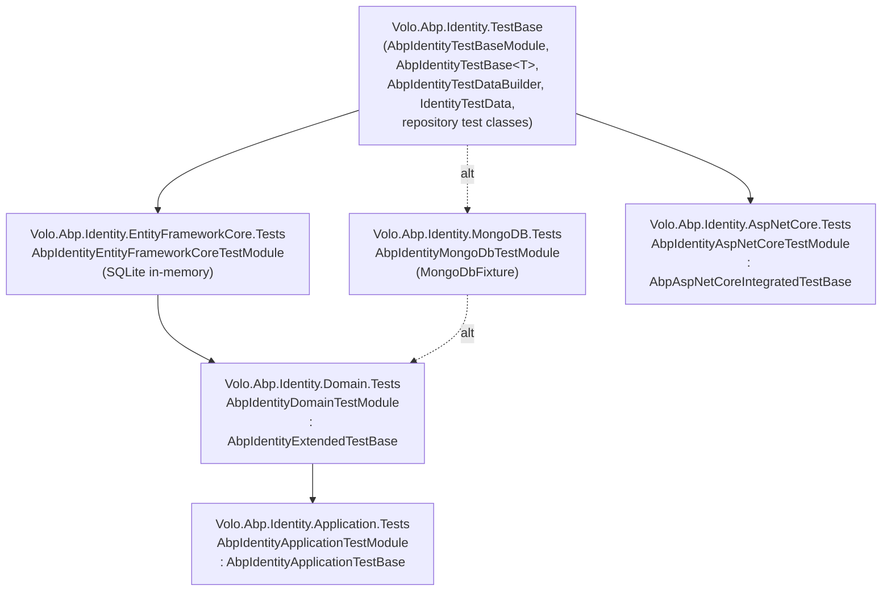

Every ABP application module under `modules/*/` ships its own `test/` directory that mirrors the module's DDD layering. The shape is rigorously consistent across `identity`, `cms-kit`, `permission-management`, `feature-management`, `tenant-management`, `audit-logging`, `background-jobs`, `setting-management`, `openiddict`, `identityserver`, `account`, `blob-storing-database`, `blogging`, `basic-theme`, and `docs` — once you've learned one tree, you know all of them. This page uses `modules/identity/test/` as the canonical example, points out where `modules/cms-kit/test/` diverges, and explains the conventions you should follow when you add tests to your own module.

Module tests live in the same `[DependsOn]`-driven world as framework tests, but they layer more deeply. A typical module ships a *non-test* assembly `Volo.Abp.{Module}.TestBase` that is referenced by every per-layer test project (`Domain.Tests`, `Application.Tests`, `EntityFrameworkCore.Tests`, `MongoDB.Tests`, `AspNetCore.Tests`). The `TestBase` assembly contains the shared `*TestBaseModule`, an abstract `*TestBase<T>` derived from `AbpIntegratedTest<T>`, the data builder, the fake `ICurrentUser` or `ICurrentPrincipalAccessor`, and any repository test classes that are valid for both EF Core and MongoDB. Persistence-specific assemblies pick the provider, configure connection strings (in-memory SQLite, `MongoSandbox`), and inherit the repository tests once per provider.

## Per-module project counts

The 15 application-module trees host between 1 and 6 test projects each. The total is around 60 test assemblies — comparable in volume to the 85 under `framework/test/`.

| Module | Projects | Layout highlights |
| --- | --- | --- |
| `identity` | 6 | TestBase, Domain.Tests, Application.Tests, EntityFrameworkCore.Tests, MongoDB.Tests, AspNetCore.Tests |
| `cms-kit` | 6 | TestBase, Domain.Tests, Application.Tests, EntityFrameworkCore.Tests, MongoDB.Tests, HttpApi.Client.ConsoleTestApp |
| `docs` | 6 | TestBase, Domain.Tests, Application.Tests, EntityFrameworkCore.Tests, MongoDB.Tests, Web.Tests |
| `feature-management` | 5 | TestBase, Domain.Tests, Application.Tests, EntityFrameworkCore.Tests, MongoDB.Tests |
| `permission-management` | 5 | TestBase, Domain.Tests, Application.Tests, EntityFrameworkCore.Tests, MongoDB.Tests |
| `tenant-management` | 5 | Same shape with Application.Tests |
| `blogging` | 5 | Domain + Application + persistence variants |
| `audit-logging` | 4 | TestBase, EntityFrameworkCore.Tests, MongoDB.Tests, plus `Volo.Abp.AuditLogging.Tests` |
| `background-jobs` | 4 | TestBase, Domain.Tests, EntityFrameworkCore.Tests, MongoDB.Tests |
| `blob-storing-database` | 4 | TestBase + persistence variants |
| `openiddict` | 4 | Same shape |
| `identityserver` | 4 | Same shape |
| `setting-management` | 4 | TestBase + persistence variants + `Volo.Abp.SettingManagement.Tests` |
| `basic-theme` | 3 | Bootstrap Demo, Bootstrap Demo Tests, Theme.Basic Demo |
| `account` | 1 | A single `Application.Tests` project |

The presence/absence of `Application.Tests` correlates with whether the module exposes an Application layer; modules like `permission-management` keep most logic in the Domain layer and skip Application tests.

## Reference walkthrough: `modules/identity/test/`

The identity module is the largest and most representative example. Its layout:

```text
modules/identity/test/
├── Volo.Abp.Identity.TestBase/                  # not a test assembly, a shared library
├── Volo.Abp.Identity.Domain.Tests/
├── Volo.Abp.Identity.Application.Tests/
├── Volo.Abp.Identity.EntityFrameworkCore.Tests/
├── Volo.Abp.Identity.MongoDB.Tests/
└── Volo.Abp.Identity.AspNetCore.Tests/
```



### `Volo.Abp.Identity.TestBase`

This is a **non-test** library — its `.csproj` does not reference xUnit. Its responsibilities:

1. Define the marker `AbpIdentityTestBaseModule : AbpModule` that every test composition will eventually depend on.
2. Define the abstract `AbpIdentityTestBase<TStartupModule> : AbpIntegratedTest<TStartupModule>` that test bases derive from.
3. Provide an `AbpIdentityTestDataBuilder` (`Build()` method) that seeds roles, users, OUs, claim types, security logs, link users, and user delegations.
4. Provide an `IdentityTestData` POCO holding well-known IDs/usernames so tests can reference seeded data.
5. Provide **shared repository test classes** like `IdentityUserRepository_Tests`, `IdentityRoleRepository_Tests`, `OrganizationUnitRepository_Tests`. These are abstract or polymorphic — the actual `[Fact]` methods live here and are inherited by both the EF Core and MongoDB test assemblies.

The module itself is:

```csharp
[DependsOn(
    typeof(AbpAutofacModule),
    typeof(AbpTestBaseModule),
    typeof(AbpIdentityDomainModule),
    typeof(AbpAuthorizationModule)
    )]
public class AbpIdentityTestBaseModule : AbpModule
{
    public override void ConfigureServices(ServiceConfigurationContext context)
    {
        context.Services.AddAlwaysAllowAuthorization();
    }

    public override void OnApplicationInitialization(ApplicationInitializationContext context)
    {
        SeedTestData(context);
    }

    private static void SeedTestData(ApplicationInitializationContext context)
    {
        using (var scope = context.ServiceProvider.CreateScope())
        {
            var dataSeeder = scope.ServiceProvider.GetRequiredService<IDataSeeder>();
            AsyncHelper.RunSync(async () =>
            {
                await dataSeeder.SeedAsync();
                await scope.ServiceProvider
                    .GetRequiredService<AbpIdentityTestDataBuilder>()
                    .Build();
            });
        }
    }
}
```

The pattern is universal across modules:

- A *scope* is created inside `OnApplicationInitialization` so seeders run in their own DI scope (clean lifetime).
- `IDataSeeder.SeedAsync()` runs the module's *production* seeders (e.g. the admin role/user).
- Then a custom `AbpIdentityTestDataBuilder` adds *test-only* data on top.
- `context.Services.AddAlwaysAllowAuthorization()` short-circuits permission checks so tests can call repositories and managers without setting up policies.

The base class is intentionally trivial:

```csharp
public abstract class AbpIdentityTestBase<TStartupModule> : AbpIntegratedTest<TStartupModule>
    where TStartupModule : IAbpModule
{
    protected override void SetAbpApplicationCreationOptions(AbpApplicationCreationOptions options)
    {
        options.UseAutofac();
    }
}
```

### `AbpIdentityTestDataBuilder`

`modules/identity/test/Volo.Abp.Identity.TestBase/Volo/Abp/Identity/AbpIdentityTestDataBuilder.cs` is a `: ITransientDependency` data builder injected into the seeding scope. Its constructor takes a long list of repositories, managers, and the `IdentityTestData` POCO, and its `Build()` method walks through:

```csharp
public async Task Build()
{
    await AddRoles();
    await AddOrganizationUnits();
    await AddUsers();
    await AddLinkUsers();
    await AddClaimTypes();
    await AddSecurityLogs();
    await AddUserDelegations();
}
```

The pattern is: idempotent inserts of fixed-ID entities so that every test sees the same baseline. Note how `_adminRole = await _roleRepository.FindByNormalizedNameAsync(...)` retrieves the role already created by the production `IDataSeeder.SeedAsync()` — the builder *extends* the production seed, it doesn't replace it.

### `Volo.Abp.Identity.EntityFrameworkCore.Tests`

This assembly carries the persistence provider for the Domain and Application layer tests. The module wires SQLite in-memory:

```csharp
[DependsOn(
    typeof(AbpIdentityTestBaseModule),
    typeof(AbpPermissionManagementEntityFrameworkCoreModule),
    typeof(AbpIdentityEntityFrameworkCoreModule),
    typeof(AbpEntityFrameworkCoreSqliteModule)
    )]
public class AbpIdentityEntityFrameworkCoreTestModule : AbpModule
{
    public override void PreConfigureServices(ServiceConfigurationContext context)
    {
        PreConfigure<AbpSqliteOptions>(x => x.BusyTimeout = null);
    }

    public override void ConfigureServices(ServiceConfigurationContext context)
    {
        var sqliteConnection = CreateDatabaseAndGetConnection();

        Configure<AbpDbContextOptions>(options =>
        {
            options.Configure(abpDbContextConfigurationContext =>
            {
                abpDbContextConfigurationContext.DbContextOptions.UseSqlite(sqliteConnection);
            });
        });

        context.Services.AddAlwaysDisableUnitOfWorkTransaction();
    }

    private static SqliteConnection CreateDatabaseAndGetConnection()
    {
        var connection = new AbpUnitTestSqliteConnection("Data Source=:memory:");
        connection.Open();

        new IdentityDbContext(
            new DbContextOptionsBuilder<IdentityDbContext>().UseSqlite(connection).Options
        ).GetService<IRelationalDatabaseCreator>().CreateTables();

        new PermissionManagementDbContext(
            new DbContextOptionsBuilder<PermissionManagementDbContext>().UseSqlite(connection).Options
        ).GetService<IRelationalDatabaseCreator>().CreateTables();

        return connection;
    }
}
```

Three patterns to call out:

1. `AbpUnitTestSqliteConnection` is an ABP-supplied subclass of `SqliteConnection` that keeps the in-memory database alive across the test's lifetime.
2. Two `DbContext`s are created (Identity and Permission Management) to ensure both schemas exist on the shared in-memory database.
3. `AddAlwaysDisableUnitOfWorkTransaction()` is critical for SQLite in-memory — opening a transaction on `:memory:` triggers SQLite locking semantics that break tests.

The test files under `EntityFrameworkCore/` such as `IdentityUserRepository_Tests.cs` inherit *the abstract test class from `Volo.Abp.Identity.TestBase`* and provide nothing more than the persistence wiring. The repository test methods themselves live in the TestBase library.

### `Volo.Abp.Identity.MongoDB.Tests`

The MongoDB variant is symmetric:

```csharp
[DependsOn(
    typeof(AbpIdentityTestBaseModule),
    typeof(AbpPermissionManagementMongoDbModule),
    typeof(AbpIdentityMongoDbModule)
)]
public class AbpIdentityMongoDbTestModule : AbpModule
{
    public override void ConfigureServices(ServiceConfigurationContext context)
    {
        Configure<AbpDbConnectionOptions>(options =>
        {
            options.ConnectionStrings.Default = MongoDbFixture.GetRandomConnectionString();
        });

        Configure<AbpUnitOfWorkDefaultOptions>(options =>
        {
            options.TransactionBehavior = UnitOfWorkTransactionBehavior.Disabled;
        });
    }
}
```

`MongoDbFixture` is a per-module copy of the framework-level fixture:

```csharp
public class MongoDbFixture : IDisposable
{
    public readonly static IMongoRunner MongoDbRunner;

    static MongoDbFixture()
    {
        MongoDbRunner = MongoRunner.Run(new MongoRunnerOptions
        {
            UseSingleNodeReplicaSet = true
        });
    }

    public static string GetRandomConnectionString()
        => GetConnectionString("Db_" + Guid.NewGuid().ToString("N"));

    public static string GetConnectionString(string databaseName)
    {
        var stringArray = MongoDbRunner.ConnectionString.Split('?');
        var connectionString = stringArray[0].EnsureEndsWith('/') + databaseName + "/?" + stringArray[1];
        return connectionString;
    }

    public void Dispose() => MongoDbRunner?.Dispose();
}
```

Each module copies this fixture into its own assembly rather than referencing a central one — this keeps the per-module test projects self-contained and lets each module choose its own `MongoRunnerOptions`.

### `Volo.Abp.Identity.Domain.Tests`

The domain tests assembly contributes its own startup module on top of the EF Core module:

```csharp
[DependsOn(
    typeof(AbpIdentityEntityFrameworkCoreTestModule),
    typeof(AbpIdentityTestBaseModule),
    typeof(AbpPermissionManagementDomainIdentityModule)
    )]
public class AbpIdentityDomainTestModule : AbpModule
{
    public override void ConfigureServices(ServiceConfigurationContext context)
    {
        Configure<AbpDistributedEntityEventOptions>(options =>
        {
            options.AutoEventSelectors.Add<IdentityUser>();
        });

        Configure<AbpVirtualFileSystemOptions>(options =>
        {
            options.FileSets.AddEmbedded<AbpIdentityDomainTestModule>();
        });

        Configure<AbpLocalizationOptions>(options =>
        {
            options.Resources
                .Get<IdentityResource>()
                .AddVirtualJson("/Volo/Abp/Identity/LocalizationExtensions");
        });

        Configure<PermissionManagementOptions>(options =>
        {
            options.IsDynamicPermissionStoreEnabled = false;
            options.SaveStaticPermissionsToDatabase = false;
        });

        Configure<AbpUnitOfWorkDefaultOptions>(options =>
        {
            options.TransactionBehavior = UnitOfWorkTransactionBehavior.Disabled;
        });

        Configure<AbpSettingOptions>(options =>
        {
            options.ValueProviders.Add<TestSettingValueProvider>();
        });
    }
    // OnApplicationInitialization seeds permission test data via TestPermissionDataBuilder
}
```

The companion `AbpIdentityDomainTestBase` and `AbpIdentityExtendedTestBase` add `UsingDbContext` and `UsingUowAsync` helpers:

```csharp
public abstract class AbpIdentityExtendedTestBase<TStartupModule> : AbpIdentityTestBase<TStartupModule>
    where TStartupModule : IAbpModule
{
    protected virtual T UsingDbContext<T>(Func<IIdentityDbContext, T> action)
    {
        using (var dbContext = GetRequiredService<IIdentityDbContext>())
        {
            return action.Invoke(dbContext);
        }
    }

    protected virtual async Task UsingUowAsync(Func<Task> action)
    {
        using (var uow = GetRequiredService<IUnitOfWorkManager>().Begin())
        {
            await action();
            await uow.CompleteAsync();
        }
    }
}
```

Note that `UsingDbContext` injects `IIdentityDbContext` directly, not `DbContext`. This is the ABP idiom — `IIdentityDbContext` is the slim contract the repositories require, and resolving it through DI lets MongoDB tests substitute a different `IIdentityDbContext` implementation.

### `Volo.Abp.Identity.Application.Tests`

The Application layer adds one more level of `[DependsOn]`:

```csharp
[DependsOn(
    typeof(AbpIdentityApplicationModule),
    typeof(AbpIdentityDomainTestModule)
    )]
public class AbpIdentityApplicationTestModule : AbpModule { }

public class AbpIdentityApplicationTestBase : AbpIdentityExtendedTestBase<AbpIdentityApplicationTestModule> { }
```

`IdentityUserAppService_Tests` is the canonical test class — it constructor-injects `IIdentityUserAppService`, `IIdentityUserRepository`, `IPermissionManager`, `UserPermissionManagementProvider`, `IdentityTestData`, and `ICurrentPrincipalAccessor`:

```csharp
public class IdentityUserAppService_Tests : AbpIdentityApplicationTestBase
{
    private readonly IIdentityUserAppService _userAppService;
    private readonly IIdentityUserRepository _userRepository;
    private readonly IPermissionManager _permissionManager;
    // ...

    public IdentityUserAppService_Tests()
    {
        _userAppService = GetRequiredService<IIdentityUserAppService>();
        _userRepository = GetRequiredService<IIdentityUserRepository>();
        // ...
    }
}
```

This is the same constructor-injection pattern you saw in framework tests; nothing about the Application layer changes the test base mechanics.

### `Volo.Abp.Identity.AspNetCore.Tests`

The AspNetCore layer pulls in `AbpAspNetCoreTestBaseModule` and an MVC startup. Its module composes `AbpIdentityAspNetCoreModule`, `AbpIdentityDomainTestModule`, `AbpAspNetCoreTestBaseModule`, and `AbpAspNetCoreMvcModule`:

```csharp
[DependsOn(
    typeof(AbpIdentityAspNetCoreModule),
    typeof(AbpIdentityDomainTestModule),
    typeof(AbpAspNetCoreTestBaseModule),
    typeof(AbpAspNetCoreMvcModule)
)]
public class AbpIdentityAspNetCoreTestModule : AbpModule
{
    public override void PreConfigureServices(ServiceConfigurationContext context)
    {
        context.Services.PreConfigure<IMvcBuilder>(builder =>
        {
            builder.PartManager.ApplicationParts.Add(new AssemblyPart(typeof(AbpIdentityAspNetCoreTestModule).Assembly));
        });
    }
    // ...
}
```

The `PreConfigure<IMvcBuilder>` callback is important: it adds the test assembly as an MVC `ApplicationPart`, which mirrors what `RunAbpModuleAsync<T>` does for `WebApplicationFactory`-based tests but works inside the legacy `AbpAspNetCoreIntegratedTestBase` path.

The corresponding `AbpIdentityAspNetCoreTestBase` derives from `AbpAspNetCoreIntegratedTestBase<AbpIdentityAspNetCoreTestStartup>` and provides `GetResponseAsync` / `GetResponseAsStringAsync` helpers analogous to the framework-side `AbpAspNetCoreTestBase` (see the [ASP.NET Core TestBase page](/testing/aspnetcore-testbase) for the modern `WebApplicationFactory`-based pattern).

## The `FakeCurrentPrincipalAccessor` idiom

Module tests typically need a *known* authenticated user so that authorization, audit logging, and ownership filters behave deterministically. The identity Application tests use `FakeCurrentPrincipalAccessor` at `modules/identity/test/Volo.Abp.Identity.Application.Tests/Volo/Abp/Identity/FakeCurrentPrincipalAccessor.cs`:

```csharp
[Dependency(ReplaceServices = true)]
public class FakeCurrentPrincipalAccessor : ThreadCurrentPrincipalAccessor
{
    private readonly IdentityTestData _testData;
    private readonly Lazy<ClaimsPrincipal> _principal;

    public FakeCurrentPrincipalAccessor(IdentityTestData testData)
    {
        _testData = testData;
        _principal = new Lazy<ClaimsPrincipal>(() => new ClaimsPrincipal(
            new ClaimsIdentity(new List<Claim>
            {
                new Claim(AbpClaimTypes.UserId, _testData.UserAdminId.ToString()),
                new Claim(AbpClaimTypes.UserName, "administrator"),
                new Claim(AbpClaimTypes.Email, "administrator@abp.io")
            })
        ));
    }

    protected override ClaimsPrincipal GetClaimsPrincipal() => _principal.Value;
}
```

`[Dependency(ReplaceServices = true)]` swaps it in for the production accessor. The fake reads identifiers from the `IdentityTestData` POCO — the same POCO the data builder consumed — so the seeded admin is the principal the tests run as. Other modules use the same idiom: `CmsKitFakeCurrentUser : ITransientDependency, ICurrentUser` at `modules/cms-kit/test/Volo.CmsKit.TestBase/CmsKitFakeCurrentUser.cs` replaces `ICurrentUser` with a hard-coded test user.

## CMS Kit walkthrough — a contrasting example

`modules/cms-kit/test/` is structurally similar but introduces three differences worth flagging:

### 1. `CmsKitTestBaseModule` swaps the blob provider with a Substitute

`modules/cms-kit/test/Volo.CmsKit.TestBase/CmsKitTestBaseModule.cs` uses NSubstitute to register a `FakeBlobProvider` so media-related tests have a deterministic blob backend, and disables culture-sensitive behaviour:

```csharp
public override void PreConfigureServices(ServiceConfigurationContext context)
{
    // Set culture to InvariantCulture to avoid Turkish-I problem and other culture-specific issues in tests
    CultureInfo.DefaultThreadCurrentCulture = CultureInfo.InvariantCulture;
    CultureInfo.DefaultThreadCurrentUICulture = CultureInfo.InvariantCulture;
    
    OneTimeRunner.Run(() =>
    {
        GlobalFeatureManager.Instance.Modules.CmsKit().EnableAll();
    });
}

public override void ConfigureServices(ServiceConfigurationContext context)
{
    context.Services.AddSingleton<IBlobProvider>(Substitute.For<FakeBlobProvider>());

    Configure<AbpBlobStoringOptions>(options =>
    {
        options.Containers.ConfigureAll((containerName, containerConfiguration) =>
        {
            containerConfiguration.ProviderType = typeof(FakeBlobProvider);
        });
    });

    context.Services.AddAlwaysAllowAuthorization();
}
```

The `OneTimeRunner` pattern ensures `GlobalFeatureManager.Instance.Modules.CmsKit().EnableAll()` runs exactly once across all tests (the global-feature registry is static, so re-enabling on every test would be wasteful).

### 2. The Domain tests assembly is provider-bound

Unlike identity (whose `AbpIdentityDomainTestModule` depends on `AbpIdentityEntityFrameworkCoreTestModule`), `CmsKitDomainTestModule` `[DependsOn]` directly on `CmsKitEntityFrameworkCoreTestModule` and uses the comment to make the choice explicit:

```csharp
/* Domain tests are configured to use the EF Core provider.
 * You can switch to MongoDB, however your domain tests should be
 * database independent anyway.
 */
[DependsOn(
    typeof(CmsKitEntityFrameworkCoreTestModule)
    )]
public class CmsKitDomainTestModule : AbpModule { }
```

This is a recurring decision in module testing: the domain layer is database-agnostic in theory, but tests must run against *some* provider, and choosing EF Core SQLite is the common default.

### 3. `WithUnitOfWorkAsync` is on `CmsKitTestBase` directly

CmsKit follows the same `WithUnitOfWorkAsync` pattern as `TestAppTestBase`, but the helpers live on `CmsKitTestBase<TStartupModule>` rather than a separate `Extended` base. The implementation is identical to the framework `TestAppTestBase` — open a scope, begin a UoW, await, complete. See `modules/cms-kit/test/Volo.CmsKit.TestBase/CmsKitTestBase.cs` for the canonical copy.

## Pattern summary

| Pattern | What it does | Where to see it |
| --- | --- | --- |
| `*TestBase` (non-test library) | Holds shared `*TestBaseModule`, `*TestBase<T>`, data builders, POCOs of seed IDs | All modules |
| `*Domain.Tests` `[DependsOn]` `*EntityFrameworkCore.Tests` | Picks the default provider for domain-layer tests | identity, cms-kit, account, audit-logging |
| Per-module `MongoDbFixture` | Holds a static `MongoSandbox.MongoRunner` | identity, cms-kit, feature-management, … |
| `AddAlwaysAllowAuthorization()` in TestBaseModule | Disables permission checks unless a test opts back in | identity, cms-kit, openiddict, permission-management |
| `AddAlwaysDisableUnitOfWorkTransaction()` / `AbpUnitOfWorkDefaultOptions.TransactionBehavior = Disabled` | Avoids SQLite/Mongo replica-set transaction limitations | EF Core test modules, MongoDB test modules |
| `[Dependency(ReplaceServices = true)] FakeCurrentPrincipalAccessor` / `CmsKitFakeCurrentUser` | Hard-codes the test principal | identity, cms-kit, audit-logging |
| `OneTimeRunner` around `GlobalFeatureManager` mutation | Avoids re-enabling features on every test instantiation | cms-kit, blogging |
| `PreConfigure<IMvcBuilder>` adding the test assembly as `ApplicationPart` | Lets MVC discover test controllers under the legacy AspNetCore base | identity.AspNetCore.Tests |
| `AddDataMigrationEnvironment()` in EF Core test module | Lets seed-on-startup behaviour run cleanly | cms-kit |

## How `test-all.ps1` invokes module tests

`build/test-all.ps1` runs `dotnet test` against each entry in `$solutionPaths` from `build/common.ps1`. The modules included by default are:

```powershell
$solutionPaths = @(
    "../framework",
    "../modules/basic-theme",
    "../modules/users",
    "../modules/permission-management",
    "../modules/setting-management",
    "../modules/feature-management",
    "../modules/identity",
    "../modules/identityserver",
    "../modules/openiddict",
    "../modules/tenant-management",
    "../modules/audit-logging",
    "../modules/background-jobs",
    "../modules/account",
    "../modules/cms-kit",
    "../modules/blob-storing-database"
)
```

Each module path points to a `.sln` (or `.slnx`) that includes its `test/*` projects, so `dotnet test --no-build --no-restore --collect:"XPlat Code Coverage"` against that solution runs the entire module's test matrix. Modules behind the `-f` (full) switch (`docs`, `blogging`, `client-simulation`, `virtual-file-explorer`) are skipped in the default loop because they add significant wall-clock time.

## Recipes for module test authors

<Tip>
  Start by copying the smallest module test tree that fits your module's persistence story (`audit-logging` if Domain-only, `cms-kit` if Domain + Application, `identity` if you need AspNetCore tests too). Adjust namespaces and `[DependsOn]` references; the rest of the structure should remain untouched.
</Tip>

### Recipe: add a domain test for a new aggregate

1. Find your module's `*Domain.Tests/` folder.
2. Add a `MyAggregate_Tests.cs` deriving from the existing `*DomainTestBase`.
3. Inject the repository or manager via `GetRequiredService<T>()` in the constructor.
4. Wrap mutation in `WithUnitOfWorkAsync` (or the module's equivalent helper) when you need lazy-load and change-tracking.

### Recipe: add an application service test

1. Pick `*Application.Tests/`.
2. Derive from `*ApplicationTestBase`.
3. Resolve `IMyAppService` and the supporting repository.
4. Assert on returned DTOs and on persisted state via the repository.

### Recipe: add a new persistence provider test assembly

1. Copy `*MongoDB.Tests/` shape — module + connection-string config + `_Tests.cs` files that inherit shared `*Repository_Tests` from the TestBase library.
2. Add the corresponding production module under `*.MongoDB`, `*.Dapper`, or whatever provider you target.
3. Inherit the shared repository test classes by writing one-liners: `public class IdentityUserRepository_NewProvider_Tests : IdentityUserRepository_Tests {}` — the test methods come along for the ride.

## Failure modes specific to module tests

| Symptom | Likely cause | Fix |
| --- | --- | --- |
| Tests pass locally, fail in CI with `MongoServerSelectionException` | `MongoDbFixture` static initialiser timed out spinning up replica set | Increase `MongoRunnerOptions.ReplicaSetSetupTimeout` in your fixture (the framework copy uses 30s). |
| `AbpAuthorizationException` thrown during seeding | Production `IDataSeeder` is permission-checked | Ensure your TestBase module calls `services.AddAlwaysAllowAuthorization()`. |
| Permission tests don't see seeded permissions | `PermissionManagementOptions.SaveStaticPermissionsToDatabase = true` is the default and triggers a separate provider | Override it in the test module (`identity.Domain.Tests` does this explicitly). |
| `ICurrentUser.Id` is null in tests | Fake accessor not registered with `[Dependency(ReplaceServices = true)]` | Add the attribute or use `Services.Replace(...)`. |
| SQLite "database is locked" errors | UoW transaction enabled against `:memory:` | Add `AddAlwaysDisableUnitOfWorkTransaction()` or `TransactionBehavior = Disabled`. |
| MVC controllers from the test assembly return 404 | Test assembly not added as an `ApplicationPart` | `PreConfigure<IMvcBuilder>` to add `new AssemblyPart(GetType().Assembly)`, as `AbpIdentityAspNetCoreTestModule` does. |

## Cross-references

- [Testing overview](/testing/overview) — layered architecture this catalogue sits within.
- [TestBase: AbpIntegratedTest](/testing/testbase) — synchronous base every `*TestBase<T>` here inherits from.
- [ASP.NET Core TestBase](/testing/aspnetcore-testbase) — base behind the AspNetCore.Tests assemblies.
- [Framework tests catalog](/testing/framework-tests) — equivalent walkthrough for `framework/test/`.
- [ABP application bootstrap](/core/abp-application-and-bootstrap) — production-side counterpart to the modular boot inside each test.
- [ASP.NET Core test base reference](/aspnetcore/test-base) — focused reference for the published `Volo.Abp.AspNetCore.TestBase` package.
- [Modules overview](/modules/overview) — application modules this catalogue tests.
- [In-memory database](/data/memory-db) — the `AbpMemoryDbModule` used as a no-IO backing store by many test modules and as an alternative to SQLite in this catalogue.
