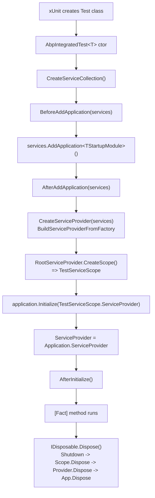
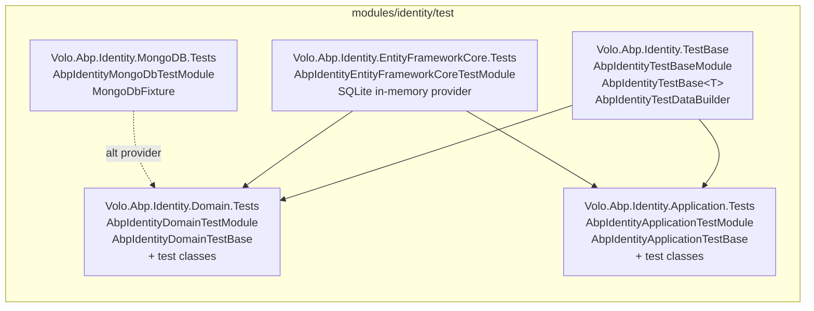

The ABP Framework treats integration testing as a first-class capability, not an afterthought bolted onto an MVC startup. The same module system that boots a production application (`AddApplication<TStartupModule>`, `Initialize`, `Shutdown`) is reused inside every test class, so the dependency injection container, options, virtual file system, unit of work, event bus, and localization pipeline all behave exactly as they do at runtime. This overview maps the layered test infrastructure rooted at `framework/src/Volo.Abp.TestBase/`, shows how it specialises into ASP.NET Core, EF Core, MongoDB, and module-specific test bases, and gives you a mental model for where to put a new test before you write a single `[Fact]`.

The codebase ships three sources of test scaffolding that are layered on top of each other. The lowest layer is `Volo.Abp.TestBase`, which contains `AbpIntegratedTest<TStartupModule>` and `AbpAsyncIntegratedTest<TStartupModule>` plus the `AbpTestBaseModule`. The next layer is `Volo.Abp.AspNetCore.TestBase`, which adds an in-memory `TestServer`, an `AbpWebApplicationFactoryIntegratedTest<TProgram>` for `Program.cs`-style hosts, and a proxy `HttpClientFactory`. On top of those, every framework module (`framework/test/Volo.Abp.*.Tests/`) and every application module (`modules/*/test/Volo.Abp.*.TestBase`, `*.Application.Tests`, `*.Domain.Tests`, `*.EntityFrameworkCore.Tests`, `*.MongoDB.Tests`) defines its own `*TestModule` and `*TestBase` derived from one of these classes.

<Info>
  Every test in this repository ultimately resolves to a concrete subclass of either `AbpIntegratedTest<T>` or `AbpWebApplicationFactoryIntegratedTest<T>`. There is no parallel "unit test" infrastructure — even tests that mock a single service still spin up the full ABP application graph for that test's startup module.
</Info>

## The three layers at a glance

The relationship between the framework test bases and the per-suite test classes is uniform across the repo. A startup module describes "the slice of ABP I want bootstrapped"; a test base binds that startup module to one of the integrated test classes; concrete `_Tests` classes inherit the test base and call `GetRequiredService<T>()` from their constructor.

| Layer | Project (source) | Public types | Used by |
| --- | --- | --- | --- |
| Core test runtime | `framework/src/Volo.Abp.TestBase` | `AbpIntegratedTest<T>`, `AbpAsyncIntegratedTest<T>`, `AbpTestBaseModule`, `AbpTestBaseWithServiceProvider`, `ITestCounter` | All other layers |
| ASP.NET Core runtime | `framework/src/Volo.Abp.AspNetCore.TestBase` | `AbpWebApplicationFactoryIntegratedTest<TProgram>`, `AbpAspNetCoreIntegratedTestBase<T>` (obsolete), `ITestServerAccessor`, `AbpNoopHostLifetime` | MVC, Razor Pages, SignalR, Auth tests |
| Module test bases | `modules/{x}/test/Volo.Abp.{X}.TestBase`, `framework/test/Volo.Abp.{X}.Tests` | `*TestModule : AbpModule`, `*TestBase : AbpIntegratedTest<...>`, fakers, data builders, `MongoDbFixture` | Concrete `_Tests` xUnit classes |

Each row narrows the scope of what is being assembled: layer 1 produces an `IAbpApplication`, layer 2 wraps it in an `IHost` with `TestServer`, layer 3 wires module-specific dependencies (`AbpIdentityDomainModule`, `AbpEventBusModule`, `AbpMemoryDbModule`, …) and seeds test data.

## How a test boots

The bootstrap path is small enough to read end-to-end. `AbpIntegratedTest<TStartupModule>`'s constructor at `framework/src/Volo.Abp.TestBase/Volo/Abp/Testing/AbpIntegratedTest.cs` walks the same five-step sequence that production hosts use, just synchronously inside an xUnit constructor.



That diagram matches the literal control-flow of the constructor and `Dispose()` method — there is no hidden xUnit fixture machinery, just a normal constructor and `IDisposable`. The `AbpAsyncIntegratedTest<T>` variant in the same folder is the awaitable twin and exposes `InitializeAsync()` / `DisposeAsync()` for xUnit's `IAsyncLifetime` pattern.

## What "test module" means

A *test module* is just an `AbpModule` whose only purpose is to declare which production modules are needed by a test, plus any overrides like fake authentication, in-memory caches, or relaxed unit-of-work options. For example `framework/test/Volo.Abp.EventBus.Tests/Volo/Abp/EventBus/EventBusTestModule.cs` is two lines of code:

```csharp
[DependsOn(typeof(AbpEventBusModule))]
public class EventBusTestModule : AbpModule
{
}
```

Larger test modules add fakes and seed data. `framework/test/Volo.Abp.Authorization.Tests/Volo/Abp/Authorization/AbpAuthorizationTestModule.cs` registers test permission providers via `Configure<AbpPermissionOptions>()` and uses `Services.OnRegistered()` to attach the `AuthorizationInterceptor` to test services. The `AbpIdentityTestBaseModule` at `modules/identity/test/Volo.Abp.Identity.TestBase/Volo/Abp/Identity/AbpIdentityTestBaseModule.cs` goes further and runs `IDataSeeder.SeedAsync()` and a custom `AbpIdentityTestDataBuilder` inside `OnApplicationInitialization`, so every test gets a populated user, role, OU graph.

<Note>
  Because a test module is a regular `AbpModule`, you compose it the same way you compose production modules: `[DependsOn(typeof(...))]`. This is why ABP test projects do not need xUnit collection fixtures for most scenarios — the dependency graph itself is the fixture.
</Note>

### What "production-equivalent" actually means

The phrase "the test runs the same module pipeline as production" sometimes glosses over what is and isn't included. Concretely:

- **Included:** Every `[DependsOn]` module's `PreConfigureServices`, `ConfigureServices`, `PostConfigureServices`, and the `OnPre*`, `On*`, `OnPost*` initialisation hooks. Options pattern (`Configure<TOptions>()`), claims mapping, virtual file system, localization, conventional registrars, dynamic-proxy interceptors (if Autofac is enabled).
- **Mocked or swapped:** `IHostLifetime` (via `AbpNoopHostLifetime`), `IServer` (via `TestServer`), `IProxyHttpClientFactory` (via `AspNetCoreTestProxyHttpClientFactory`), `IDistributedCache` (often `TestMemoryDistributedCache`), `ICurrentPrincipalAccessor` / `ICurrentUser` (fakes), `IBlobProvider` (e.g. `FakeBlobProvider` in cms-kit), `IAuthorizationService` (often `AlwaysAllowAuthorization`).
- **Not included:** Real network listeners, real Mongo/Redis (unless a fixture spins them up), Kestrel, IIS hosting model, Windows authentication, the actual production database. Tests that need these are typically integration tests run outside CI.

If you find yourself reaching for a Microsoft-supplied unit-test trick (in-memory EF Core provider, etc.), check whether ABP already has a higher-fidelity option (`AbpEntityFrameworkCoreSqliteModule` + `AbpUnitTestSqliteConnection`) — these are usually preferable because they keep the production query-translation behaviour.

## Choosing a base class

| Scenario | Base class | Project reference | Example |
| --- | --- | --- | --- |
| Pure DI + module test (no HTTP) | `AbpIntegratedTest<T>` | `Volo.Abp.TestBase` | `EventBusTestBase`, `MultiTenancyTestBase` |
| Async lifecycle (`xUnit IAsyncLifetime`) | `AbpAsyncIntegratedTest<T>` | `Volo.Abp.TestBase` | Tests that await `InitializeAsync` |
| MVC / Razor Pages / SignalR via `TestServer` | `AbpWebApplicationFactoryIntegratedTest<TProgram>` | `Volo.Abp.AspNetCore.TestBase` | `AbpAspNetCoreTestBase`, `AspNetCoreMvcTestBase` |
| Legacy `IHostBuilder`-style web test | `AbpAspNetCoreIntegratedTestBase<T>` *(obsolete)* | `Volo.Abp.AspNetCore.TestBase` | Older tests pre-`WebApplicationFactory` |
| EF Core domain / repository | `EntityFrameworkCoreTestBase` -> `TestAppTestBase<T>` -> `AbpIntegratedTest<T>` | `Volo.Abp.EntityFrameworkCore.Tests` | EF Core auditing, change-tracking |
| MongoDB repository | `*MongoDbTestBase` -> `TestAppTestBase<T>` | `Volo.Abp.MongoDB.Tests`, identity, cms-kit | `MongoDbFixture` shared per AppDomain |
| In-memory DB CRUD | `MemoryDbTestBase` | `Volo.Abp.MemoryDb.Tests` | Fast no-IO repository tests |

The obsolete attribute on `AbpAspNetCoreIntegratedTestBase` (see `framework/src/Volo.Abp.AspNetCore.TestBase/Volo/Abp/AspNetCore/TestBase/AbpAspNetCoreIntegratedTestBase.cs`) makes the migration direction explicit: new tests should derive from `AbpWebApplicationFactoryIntegratedTest<TProgram>`.

## Test project naming convention

The repo follows a strict convention so test discovery is mechanical:

- `framework/test/Volo.Abp.{Component}.Tests/` — tests for a single framework component (one solution-wide xUnit assembly).
- `modules/{module}/test/Volo.Abp.{Module}.TestBase/` — shared `AbpModule` + `TestBase<T>` + data builders consumed by sibling `*.Tests` projects.
- `modules/{module}/test/Volo.Abp.{Module}.{Layer}.Tests/` — one assembly per DDD layer (Domain, Application) and per persistence provider (EntityFrameworkCore, MongoDB).
- `test/AbpPerfTest/` — non-xUnit harness for end-to-end perf with and without ABP (`AbpPerfTest.WithAbp`, `AbpPerfTest.WithoutAbp`).
- `test/DistEvents/` — non-xUnit demo apps for distributed-event-bus integration (RabbitMQ, Kafka, Rebus).

The convention is the contract: `build/test-all.ps1` walks the solutions listed in `build/common.ps1` and runs `dotnet test --no-build --no-restore --collect:"XPlat Code Coverage"` against each.

```powershell
# build/test-all.ps1
foreach ($solutionPath in $solutionPaths) {
    $solutionAbsPath = (Join-Path $rootFolder $solutionPath)
    Set-Location $solutionAbsPath
    dotnet test --no-build --no-restore --collect:"XPlat Code Coverage"
    if (-Not $?) {
        Write-Host ("Test failed for the solution: " + $solutionPath)
        Set-Location $rootFolder
        exit $LASTEXITCODE
    }
}
```

The script delegates path discovery to `build/common.ps1`, which contains a curated `$solutionPaths` list (`../framework`, `../modules/basic-theme`, `../modules/identity`, …) and a `-f` ("full") switch that adds optional solutions like `../modules/blogging` and `../templates/*`. Running `test-all.ps1` from `build/` therefore builds and tests the entire framework, all stable modules, and (with `-f`) every template — the single command CI uses to gate a release.

## Inside the test runtime layer

`AbpTestBaseWithServiceProvider` at `framework/src/Volo.Abp.TestBase/Volo/Abp/AbpTestBaseWithServiceProvider.cs` is the bottom of the hierarchy. It owns the `IServiceProvider`, exposes `GetService<T>()`, `GetRequiredService<T>()`, `GetKeyedServices<T>()`, and `GetRequiredKeyedService<T>()`, and is the type your custom helpers (`UsingDbContext`, `WithUnitOfWorkAsync`) extend. The class is intentionally tiny so it can be reused by both the synchronous `AbpIntegratedTest<T>` and the async `AbpAsyncIntegratedTest<T>` without duplication.

```csharp
public abstract class AbpTestBaseWithServiceProvider
{
    protected IServiceProvider ServiceProvider { get; set; } = default!;

    protected virtual T? GetService<T>() => ServiceProvider.GetService<T>();
    protected virtual T GetRequiredService<T>() where T : notnull => ServiceProvider.GetRequiredService<T>();
    protected virtual T? GetKeyedServices<T>(object? serviceKey) => ServiceProvider.GetKeyedService<T>(serviceKey);
    protected virtual T GetRequiredKeyedService<T>(object? serviceKey) where T : notnull => ServiceProvider.GetRequiredKeyedService<T>(serviceKey);
}
```

The `AbpTestBaseModule` itself, at `framework/src/Volo.Abp.TestBase/Volo/Abp/AbpTestBaseModule.cs`, is an empty marker module. Test modules declare `[DependsOn(typeof(AbpTestBaseModule))]` (or transitively pull it in through `AbpAspNetCoreTestBaseModule`) so that future test-only services can be registered centrally without breaking the public API. The accompanying `TestCounter : ITestCounter, ISingletonDependency` at `Volo/Abp/Testing/Utils/TestCounter.cs` is a lock-protected dictionary used as a thread-safe assertion helper across tests that observe event-handler invocation counts.

## ASP.NET Core add-ons

`AbpAspNetCoreTestBaseModule` (`framework/src/Volo.Abp.AspNetCore.TestBase/Volo/Abp/AspNetCore/TestBase/AbpAspNetCoreTestBaseModule.cs`) brings four modules together: `AbpHttpClientModule`, `AbpAspNetCoreModule`, `AbpTestBaseModule`, and `AbpAutofacModule`. It is the missing ingredient that turns a plain DI graph into a routable, request-pipeline-enabled host. The companion `AbpWebHostBuilderExtensions.UseAbpTestServer()` swaps the live `IServer` and `IHostLifetime` for `TestServer` and `AbpNoopHostLifetime` so the host never tries to bind to a TCP port.

A typical ASP.NET Core test module (e.g. `AbpAspNetCoreMvcTestModule`) chains `AbpAspNetCoreTestBaseModule`, `AbpMemoryDbTestModule`, `AbpAspNetCoreMvcModule`, `AbpAutofacModule`, configures `AddFakeAuthentication()`, registers test permissions, and sets `AbpMvcLibsOptions.CheckLibs = false`. Read the full file for a reference example of a complex test module.

## How module tests pull the seams together

A module's testing surface is usually three projects deep:



Read this diagram alongside the actual files: `AbpIdentityDomainTestModule` `[DependsOn]` on `AbpIdentityEntityFrameworkCoreTestModule`, and `AbpIdentityApplicationTestModule` depends on `AbpIdentityDomainTestModule`. The MongoDB tests parallel the EF Core branch by depending on `AbpIdentityMongoDbTestModule` instead, with `MongoDbFixture` holding the shared `MongoSandbox` runner.

## Seeding patterns

Seeding test data lives in three styles across the repository:

1. **No seeding** — minimal tests use a `*TestModule` that does not override `OnApplicationInitialization`. The default `EventBusTestModule` and `MultiTenancyTestModule` fall into this bucket.
2. **Production seeder + test data builder** — the dominant pattern for module tests. `OnApplicationInitialization` creates a scope, resolves `IDataSeeder.SeedAsync()` to run production seeders, then resolves an `ITransientDependency` data builder (`AbpIdentityTestDataBuilder`, `TestPermissionDataBuilder`, …) for test-only data.
3. **Static fixture + per-test fresh DB** — Mongo tests rely on a process-wide `MongoSandbox.MongoRunner` (held in `MongoDbFixture.MongoDbRunner` as a `static readonly` field) but use `GetRandomConnectionString()` per test to get a fresh database name. The runner is *not* disposed between tests; it lives for the whole xUnit assembly run.

The choice is driven by how expensive setup is and by whether tests need to observe each other's effects. Most modules pick (2), which gives a fresh `IAbpApplication` and a fresh seed per `[Fact]` — slow but deterministic.

## Cross-cutting / non-xUnit harnesses

Two folders under `test/` (not `framework/test/`) host non-xUnit harnesses that exercise ABP at runtime:

- `test/AbpPerfTest/` — `AbpPerfTest.WithAbp` and `AbpPerfTest.WithoutAbp` are MVC apps that expose the same controllers. The `_jmeter/` folder holds JMX plans and `_results/` collects baseline numbers. The two apps share a schema (`AppModule.cs` registers `AbpEntityFrameworkCoreSqlServerModule` and a `BookDbContext` for the ABP variant) so the perf delta isolates ABP overhead from MVC overhead.
- `test/DistEvents/` — Four sample apps (`DistDemoApp.EfCoreRabbitMq`, `DistDemoApp.MongoDbKafka`, `DistDemoApp.MongoDbRebus`, `DistDemoApp.Shared`) exercise distributed-event-bus + outbox/inbox scenarios across transports. `DistDemoAppSharedModule` configures `AbpDistributedEntityEventOptions.AutoEventSelectors.Add<TodoItem>()` and a Redis `IDistributedLockProvider`.

These are not invoked by `test-all.ps1`; they are run manually for performance regressions and distributed-systems smoke testing.

## Test naming, discovery, and parallelism

xUnit discovers tests by reflection: every public class derived (transitively) from `AbpIntegratedTest<T>` or `AbpWebApplicationFactoryIntegratedTest<T>` whose methods are attributed with `[Fact]` or `[Theory]` is a candidate. ABP test classes are conventionally named `<Subject>_<Behaviour>_Tests` (with the underscore in the middle), e.g. `EventBus_Order_Test`, `Authorization_Tests`, `IdentityUserAppService_Tests`. The xUnit assembly attribute `[CollectionBehavior(DisableTestParallelization = false)]` is the default — test classes inside the same project run in parallel by default but each `[Fact]` within a class is serialized. Because every `AbpIntegratedTest<T>` constructs a fresh `IAbpApplication` per test, parallel xUnit test classes do not collide on shared state unless the module deliberately uses statics (like `MongoDbFixture.MongoDbRunner`).

`xunit.runner.json` files in some projects pin `parallelizeAssembly = false` when expensive resources like a real Mongo replica set need to be sequenced. Read the project's `xunit.runner.json` and `appsettings.Test.json` first when chasing flakiness; they are the small files that change behaviour across the otherwise-uniform project shape.

## A grouped tour of `framework/test/`

The framework test directory contains 85 entries. The following groupings make the directory traversable; deeper analysis lives on the [framework tests catalog](/testing/framework-tests):

| Group (folder prefix) | Highlights |
| --- | --- |
| `Volo.Abp.AspNetCore.*.Tests` | MVC, SignalR, Serilog, MultiTenancy, Versioning, Authentication.OAuth, UI, UI.Theme.Shared, Mvc.Client, Mvc.PlugIn. All chain off `AbpAspNetCoreTestBaseModule`. |
| `Volo.Abp.BlobStoring.*.Tests` | Shared `Volo.Abp.BlobStoring.Tests` + provider variants (Memory, FileSystem, Aws, Azure, Aliyun, Bunny, Google, Minio). |
| `Volo.Abp.EntityFrameworkCore.Tests` + `.SecondContext` | SQLite in-memory `TestAppDbContext` and a second context to verify multi-context behaviour. |
| `Volo.Abp.MongoDB.Tests` + `.SecondContext` | `MongoSandbox` replica-set + per-database random connection strings. |
| `Volo.Abp.MemoryDb.Tests` | Zero-IO repository tests, often re-used by ASP.NET Core test modules. |
| `Volo.Abp.Auditing.Tests` | EF Core SQLite + auditing options + entity-history selectors. |
| `Volo.Abp.Caching.Tests`, `Volo.Abp.Caching.StackExchangeRedis.Tests` | `TestMemoryDistributedCache` fakes the distributed cache for deterministic tests. |
| `Volo.Abp.Authorization.Tests`, `Volo.Abp.Features.Tests`, `Volo.Abp.GlobalFeatures.Tests` | NSubstitute-backed `ICurrentPrincipalAccessor`, permission value providers, feature definitions. |
| `Volo.Abp.MultiTenancy.Tests`, `Volo.Abp.AspNetCore.MultiTenancy.Tests` | `AbpDefaultTenantStoreOptions` configured per test. |
| `Volo.Abp.EventBus.Tests`, `Volo.Abp.BackgroundJobs.Tests` | Local + (in-process) distributed event bus tests; nested handler classes auto-registered. |
| `Volo.Abp.Http.*` and `Volo.Abp.RemoteServices.Tests` | Dynamic HTTP-API proxies; rely on `AspNetCoreTestProxyHttpClientFactory`. |
| `Volo.Abp.Json.Tests`, `Volo.Abp.Serialization.Tests`, `Volo.Abp.TextTemplating.Tests` (+ Razor/Scriban), `Volo.Abp.Minify.Tests` | Pure-function feature tests through `Configure<TOptions>`. |
| `Volo.Abp.Localization.Tests`, `Volo.Abp.UI.Navigation.Tests`, `Volo.Abp.MultiLingualObjects.Tests`, `Volo.Abp.ObjectExtending.Tests` | UI- and metadata-layer tests. |
| `Volo.Abp.Imaging.*.Tests` | Five provider variants (Abstractions, AspNetCore, ImageSharp, MagickNet, SkiaSharp) over a shared abstraction. |
| `Volo.Abp.Sms.*`, `Volo.Abp.MailKit.Tests`, `Volo.Abp.Ldap.Tests`, `Volo.Abp.AI.Tests` | External-integration test surfaces (often skip in CI without secrets). |
| `Volo.Abp.Cli.Core.Tests` | CLI command harness; does *not* derive from `AbpIntegratedTest<T>` because the CLI has its own bootstrap. |

## Helpers in `framework/test/AbpTestBase/`

`framework/test/AbpTestBase/` is the *test-side* analog of `Volo.Abp.TestBase` and contains shared utilities used by xUnit tests rather than by the runtime. The two files there are small but heavily reused:

- `Microsoft/Extensions/DependencyInjection/ServiceCollectionShouldlyExtensions.cs` — Shouldly-flavoured assertions like `services.ShouldContainTransient(typeof(IFoo), typeof(Foo))`, `ShouldContainSingleton`, `ShouldContainScoped`, `ShouldNotContainService`. These are the canonical way to assert DI registrations inside an `AbpModule` test.
- `Volo/Abp/TestBase/Logging/ICanLogOnObject.cs` — a one-property interface (`List<string> Logs { get; }`) implemented by mock services that need to record their interactions for later assertion.

## How a `[Fact]` flows through the layers

A useful exercise is to read the call stack of a single Identity Application test top-to-bottom. `IdentityUserAppService_Tests` from `modules/identity/test/Volo.Abp.Identity.Application.Tests/Volo/Abp/Identity/IdentityUserAppService_Tests.cs` derives from `AbpIdentityApplicationTestBase`, which derives from `AbpIdentityExtendedTestBase<AbpIdentityApplicationTestModule>`, which derives from `AbpIdentityTestBase<TStartupModule>`, which derives from `AbpIntegratedTest<TStartupModule>` (in `framework/src/Volo.Abp.TestBase/`). The `AbpIdentityApplicationTestModule` `[DependsOn]` `AbpIdentityApplicationModule` and `AbpIdentityDomainTestModule`; the latter chains into `AbpIdentityEntityFrameworkCoreTestModule` (SQLite in-memory) and `AbpIdentityTestBaseModule` (data seeding). The result is that constructing one `IdentityUserAppService_Tests` instance:

1. Builds a `ServiceCollection` and runs every dependent module's `PreConfigureServices`, `ConfigureServices`, and `PostConfigureServices`.
2. Builds an Autofac container via `options.UseAutofac()` (set in `AbpIdentityTestBase`).
3. Calls every module's `OnPreApplicationInitialization` / `OnApplicationInitialization` / `OnPostApplicationInitialization`, including the seeders.
4. Resolves `IIdentityUserAppService`, `IIdentityUserRepository`, `IPermissionManager`, and `ICurrentPrincipalAccessor` from the constructed scope.

The single test method then runs against a fully populated database and a "logged-in" admin (via `FakeCurrentPrincipalAccessor`). The same flow applies to every test in the repository — the only thing that changes between projects is the composition of the startup module.

## When to write what

<Tip>
  Decide the *startup module* first. If your test needs `IEventBus` only, use a `TestModule` that `[DependsOn(typeof(AbpEventBusModule))]` and inherit `AbpIntegratedTest<MyTestModule>`. If you need an HTTP request hitting a controller, derive from `AbpWebApplicationFactoryIntegratedTest<Program>` and ensure your `Program.cs` calls `RunAbpModuleAsync<YourModule>()` from `WebApplicationBuilderExtensions`.
</Tip>

Use the following heuristic when slotting a new test into the repository:

| Question | If yes | If no |
| --- | --- | --- |
| Do I cross an HTTP boundary? | Use `AbpAspNetCoreTestBase` (in `framework/test/Volo.Abp.AspNetCore.Tests/`) or a module's `*HttpApi.Client.ConsoleTestApp`. | Stay with `AbpIntegratedTest<T>`. |
| Do I need EF Core entity tracking? | Inherit `EntityFrameworkCoreTestBase` and run code via `WithUnitOfWorkAsync(async () => …)`. | Use `MemoryDbTestBase` to avoid SQLite. |
| Do I assert that registrations exist? | Build a `ServiceCollection`, call your module's `ConfigureServices`, and use `ServiceCollectionShouldlyExtensions`. | Resolve and call. |
| Am I writing a fake authenticated user? | Add a `FakeCurrentPrincipalAccessor` to the test module, like `modules/identity/test/Volo.Abp.Identity.Application.Tests/Volo/Abp/Identity/FakeCurrentPrincipalAccessor.cs`. | Anonymous request flows are fine. |

## Conventions you can rely on

The repository's testing layout is consistent enough that the following statements hold true across almost every test project:

| Convention | Concrete check | Where it appears |
| --- | --- | --- |
| Class name ends in `_Tests` (rarely `_Test`) | `EventBus_Order_Test`, `IdentityUserAppService_Tests`, `Authorization_Tests` | All `framework/test/` and `modules/*/test/` projects. |
| One `*TestModule` per project | A single `: AbpModule` decorated with `[DependsOn]` | Every test project. |
| One `*TestBase` per project | A single `: AbpIntegratedTest<TStartupModule>` or `: AbpWebApplicationFactoryIntegratedTest<TProgram>` | Every project except some that re-host shared suites. |
| Constructor-time service resolution | Fields assigned in the ctor via `GetRequiredService<T>()` | `IdentityUserAppService_Tests` and dozens more. |
| `options.UseAutofac()` in `SetAbpApplicationCreationOptions` | Required for dynamic-proxy interceptors | Nearly every `*TestBase`. |
| Shared suite generics for providers | `BlobContainer_Tests<TStartupModule>` re-hosted per provider | BlobStoring, Imaging. |
| Per-module `MongoDbFixture` static | `MongoSandbox.MongoRunner.Run(...)` in a `static` ctor | identity, cms-kit, feature-management, … |
| `[Dependency(ReplaceServices = true)]` fakes | `FakeCurrentPrincipalAccessor`, `AspNetCoreTestProxyHttpClientFactory`, `TestMemoryDistributedCache` | Application tests, AspNetCore tests. |

You can use these as a checklist when reviewing or writing a new test project — anything that deviates should have an explicit reason (a code comment is the typical signal).

## A note on file paths

The codebase splits "test infrastructure" between two locations that are easy to confuse:

| Path | Contents | Reference type |
| --- | --- | --- |
| `framework/src/Volo.Abp.TestBase/` | The published runtime library — `AbpIntegratedTest<T>`, `AbpAsyncIntegratedTest<T>`, `AbpTestBaseWithServiceProvider`, `AbpTestBaseModule`, `ITestCounter`/`TestCounter`. | NuGet package consumed by every test. |
| `framework/src/Volo.Abp.AspNetCore.TestBase/` | Published ASP.NET Core companion — `AbpWebApplicationFactoryIntegratedTest<TProgram>`, `AbpAspNetCoreTestBaseModule`, `ITestServerAccessor`, `AspNetCoreTestProxyHttpClientFactory`. | NuGet package. |
| `framework/test/AbpTestBase/` | Test-side helpers — `ServiceCollectionShouldlyExtensions`, `ICanLogOnObject`. | Project reference, never published. |
| `framework/test/Volo.Abp.TestApp/` | Embedded DDD sample (`Person`, `City`, `Phone`, `Product`, `TestAppModule`, `TestAppTestBase<T>`) used by EF Core, Mongo, MemoryDb, Auditing. | Project reference, never published. |

When the same name appears under both `src/` and `test/`, the `src/` version is the runtime contract and the `test/` version is the in-repo helper. The two roles never overlap.

## Common pitfalls

| Pitfall | Source location | Resolution |
| --- | --- | --- |
| Forgetting `options.UseAutofac()` in `SetAbpApplicationCreationOptions` | Any `*TestBase` deriving from `AbpIntegratedTest<T>` | Dynamic-proxy interceptors (auth, audit, uow) become silent no-ops. Always call it unless you know you don't need interceptors. |
| Resolving scoped services from `RootServiceProvider` | `framework/src/Volo.Abp.TestBase/Volo/Abp/Testing/AbpIntegratedTest.cs` exposes it | Use `GetRequiredService<T>()` (which uses the inherited `ServiceProvider` already pointing at the test scope). |
| Relying on a fixture leak between tests | xUnit creates a new instance per `[Fact]` | If you need shared state, use a `static` field deliberately, e.g. `MongoDbFixture.MongoDbRunner`. |
| Cross-test interference via `GlobalFeatureManager.Instance` | A static singleton | Wrap mutation in `OneTimeRunner.Run(...)` as `CmsKitTestBaseModule` does. |
| MVC controllers in the test assembly returning 404 | Test assembly not in `ApplicationParts` | `PreConfigure<IMvcBuilder>(b => b.PartManager.ApplicationParts.Add(new AssemblyPart(...)))`, or use `RunAbpModuleAsync<T>` which sets `Environment.ApplicationName` for you. |
| SQLite in-memory "database is locked" | EF Core UoW transaction interacts badly with `:memory:` | `context.Services.AddAlwaysDisableUnitOfWorkTransaction()` in the test module. |

## Quick-reference matrix

| If you need… | Use… | Source file |
| --- | --- | --- |
| A blank, in-memory DI graph for one module | `AbpIntegratedTest<TStartupModule>` | `framework/src/Volo.Abp.TestBase/Volo/Abp/Testing/AbpIntegratedTest.cs` |
| Async startup hooks | `AbpAsyncIntegratedTest<TStartupModule>` | `framework/src/Volo.Abp.TestBase/Volo/Abp/Testing/AbpAsyncIntegratedTest.cs` |
| ASP.NET Core `TestServer` + `HttpClient` | `AbpWebApplicationFactoryIntegratedTest<TProgram>` | `framework/src/Volo.Abp.AspNetCore.TestBase/.../AbpWebApplicationFactoryIntegratedTest.cs` |
| Shared abstraction tests across providers | A generic shared suite (see `BlobContainer_Tests<TStartupModule>`) | `framework/test/Volo.Abp.BlobStoring.Tests/Volo/Abp/BlobStoring/BlobContainer_Tests.cs` |
| Unit-of-work scoping inside a test | `WithUnitOfWorkAsync` helper from `TestAppTestBase<T>` | `framework/test/Volo.Abp.TestApp/Volo/Abp/TestApp/Testing/TestAppTestBase.cs` |
| Authentication fakes | `[Dependency(ReplaceServices = true)] FakeCurrentPrincipalAccessor` | `modules/identity/test/Volo.Abp.Identity.Application.Tests/Volo/Abp/Identity/FakeCurrentPrincipalAccessor.cs` |

## Where to go next

- [TestBase: AbpIntegratedTest internals](/testing/testbase) — full walkthrough of the synchronous and async test bases, virtual hooks, and DI scope semantics.
- [ASP.NET Core TestBase](/testing/aspnetcore-testbase) — `WebApplicationFactory` integration, `TestServer`, fake HTTP client factory, and request helpers.
- [Framework tests catalog](/testing/framework-tests) — clusters under `framework/test/`, the reusable `Volo.Abp.TestApp` project, and pattern catalogue.
- [Module tests catalog](/testing/module-tests) — Domain / Application / EF Core / Mongo layering using `modules/identity/test/` as a walkthrough.
- [ABP application bootstrap](/core/abp-application-and-bootstrap) — production-side counterpart to `AbpIntegratedTest`.
- [ASP.NET Core test base reference](/aspnetcore/test-base) — focused reference for the `Volo.Abp.AspNetCore.TestBase` package.
- [Modules overview](/modules/overview) — application module layering that drives module test projects.
- [In-memory database](/data/memory-db) — the `AbpMemoryDbModule` used as a zero-I/O backing store in many test modules.
