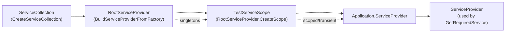

`Volo.Abp.TestBase` is the package every other ABP test base depends on. It is intentionally small — six files, a couple hundred lines — but it encodes the full ABP application lifecycle inside an xUnit test class constructor. This page walks the source of `AbpIntegratedTest<TStartupModule>`, its async sibling `AbpAsyncIntegratedTest<TStartupModule>`, the `AbpTestBaseWithServiceProvider` parent, and the supporting `ITestCounter` utility, so you can extend them, reason about lifetimes, or debug a flaky boot. The page focuses on the framework code in `framework/src/Volo.Abp.TestBase/` rather than on consumer-side patterns.

The first thing to notice when you open `framework/src/Volo.Abp.TestBase/Volo.Abp.TestBase.csproj` is how little ABP code lives here: the project's job is to host two abstract base classes plus a marker `AbpModule`. The heavy lifting — building the modular application, running module callbacks, registering Autofac, configuring options — is delegated to `Volo.Abp.Core`, `Volo.Abp.Modularity`, and the consumer-supplied `TStartupModule`. That separation lets a test base remain a single file you can subclass freely without inheriting framework noise.

## Source map

The package contains exactly six C# files. Understanding which symbol lives where eliminates a lot of confusion when you grep.

| File (under `framework/src/Volo.Abp.TestBase/Volo/Abp/`) | Symbol | Role |
| --- | --- | --- |
| `AbpTestBaseModule.cs` | `AbpTestBaseModule : AbpModule` | Empty marker module that test modules declare a `[DependsOn]` on. |
| `AbpTestBaseWithServiceProvider.cs` | `AbpTestBaseWithServiceProvider` | Holds `IServiceProvider` + typed/keyed resolution helpers. |
| `Testing/AbpIntegratedTest.cs` | `AbpIntegratedTest<TStartupModule>` | Synchronous, `IDisposable`-driven test base. |
| `Testing/AbpAsyncIntegratedTest.cs` | `AbpAsyncIntegratedTest<TStartupModule>` | Awaitable variant implementing the `InitializeAsync/DisposeAsync` pattern. |
| `Testing/Utils/ITestCounter.cs` | `ITestCounter` | Public surface of a thread-safe named counter. |
| `Testing/Utils/TestCounter.cs` | `TestCounter : ITestCounter, ISingletonDependency` | Lock-guarded dictionary implementation, auto-registered. |

The package's csproj references `Volo.Abp.Core` and exposes the public types under the `Volo.Abp` and `Volo.Abp.Testing` namespaces. Everything else (Autofac, EF Core, MongoDB) is layered on by *downstream* test modules.

## `AbpTestBaseWithServiceProvider` — the shared root

`framework/src/Volo.Abp.TestBase/Volo/Abp/AbpTestBaseWithServiceProvider.cs` is the smallest meaningful type in the package. It exists so the sync and async test bases can share the resolution helpers and so user-written helper methods (`UsingDbContext`, `WithUnitOfWorkAsync`) can be defined on this base and reused everywhere.

```csharp
public abstract class AbpTestBaseWithServiceProvider
{
    protected IServiceProvider ServiceProvider { get; set; } = default!;

    protected virtual T? GetService<T>()
        => ServiceProvider.GetService<T>();

    protected virtual T GetRequiredService<T>() where T : notnull
        => ServiceProvider.GetRequiredService<T>();

    protected virtual T? GetKeyedServices<T>(object? serviceKey)
        => ServiceProvider.GetKeyedService<T>(serviceKey);

    protected virtual T GetRequiredKeyedService<T>(object? serviceKey) where T : notnull
        => ServiceProvider.GetRequiredKeyedService<T>(serviceKey);
}
```

Two design notes worth highlighting. First, `ServiceProvider` has a public setter (`{ get; set; }`) so derived test bases can swap it — `AbpAspNetCoreIntegratedTestBase` for example assigns it to `Server.Services` after the `IHost` boots. Second, the keyed-service helpers were added so test bases keep parity with .NET 8's keyed DI; before that point, ABP tests resolved keyed services manually.

<Note>
  The signature `GetKeyedServices<T>(object? serviceKey)` returning a single `T?` actually calls `GetKeyedService<T>` (singular). The plural method name predates .NET keyed DI being finalised; treat it as "get the keyed service".
</Note>

## `AbpIntegratedTest<TStartupModule>` — the synchronous base

The synchronous base in `framework/src/Volo.Abp.TestBase/Volo/Abp/Testing/AbpIntegratedTest.cs` is what 90% of framework tests inherit (directly or transitively). The full constructor and dispose are quoted below so you can correlate the lifecycle hooks with the source.

```csharp
public abstract class AbpIntegratedTest<TStartupModule> : AbpTestBaseWithServiceProvider, IDisposable
    where TStartupModule : IAbpModule
{
    protected IAbpApplication Application { get; }
    protected IServiceProvider RootServiceProvider { get; }
    protected IServiceScope TestServiceScope { get; }

    protected AbpIntegratedTest()
    {
        var services = CreateServiceCollection();

        BeforeAddApplication(services);

        var application = services.AddApplication<TStartupModule>(SetAbpApplicationCreationOptions);
        Application = application;

        AfterAddApplication(services);

        RootServiceProvider = CreateServiceProvider(services);
        TestServiceScope = RootServiceProvider.CreateScope();

        application.Initialize(TestServiceScope.ServiceProvider);
        ServiceProvider = Application.ServiceProvider;

        AfterInitialize();
    }
```

xUnit constructs a fresh instance per `[Fact]`, which means a fresh `IAbpApplication`, a fresh root provider, a fresh `TestServiceScope`, and a fresh module-graph activation per test. Tests therefore start from a clean slate without explicit reset code — at the cost of running every module's `OnApplicationInitialization` once per test.

### Properties exposed to tests

| Property | Type | Lifetime | When to use |
| --- | --- | --- | --- |
| `Application` | `IAbpApplication` | Single instance per test | Inspect the resolved module graph, call `ShutdownAsync` early, etc. |
| `RootServiceProvider` | `IServiceProvider` | Single instance per test | Resolve singletons, build extra scopes manually. |
| `TestServiceScope` | `IServiceScope` | Single instance per test | The scope the `IAbpApplication` was initialised into. |
| `ServiceProvider` (inherited) | `IServiceProvider` | Points at `Application.ServiceProvider` | Default resolution surface used by `GetRequiredService<T>()`. |

`Application.ServiceProvider` and `TestServiceScope.ServiceProvider` are intentionally the same provider — the constructor sets `ServiceProvider = Application.ServiceProvider` immediately after `application.Initialize(TestServiceScope.ServiceProvider)`. The implementation lives in `services.AddApplication<TStartupModule>(...)` from `Volo.Abp.Core`; see [the bootstrap reference](/core/abp-application-and-bootstrap) for the production-side counterpart.

### Virtual hooks — what to override and when

`AbpIntegratedTest<T>` exposes five virtual hooks. The naming is precise: each runs at exactly the point of its name and is the *only* extension point you need 95% of the time.

```mermaid
sequenceDiagram
    participant xUnit
    participant Ctor as "AbpIntegratedTest&lt;T&gt; ctor"
    participant Services as "ServiceCollection"
    participant App as "IAbpApplication"
    participant Test as "Test class"

    xUnit->>Ctor: new MyTest()
    Ctor->>Services: CreateServiceCollection()
    Ctor->>Ctor: BeforeAddApplication(services)
    Ctor->>Services: services.AddApplication&lt;T&gt;(SetAbpApplicationCreationOptions)
    Services-->>App: Module graph built (PreConfigure / Configure)
    Ctor->>Ctor: AfterAddApplication(services)
    Ctor->>Services: CreateServiceProvider(services)
    Ctor->>App: application.Initialize(scope.ServiceProvider)
    App-->>App: OnPreApplicationInitialization / OnApplicationInitialization / OnPostApplicationInitialization
    Ctor->>Ctor: AfterInitialize()
    Ctor-->>Test: ready
    Test->>Test: [Fact] runs, resolves via GetRequiredService
    xUnit->>Test: Dispose()
    Test->>App: Shutdown()
    Test->>Test: TestServiceScope.Dispose()
    Test->>Test: RootServiceProvider.Dispose()
    Test->>App: Dispose()
```

| Hook | Default | When it runs | Typical use |
| --- | --- | --- | --- |
| `CreateServiceCollection()` | `new ServiceCollection()` | First — empty collection | Pre-populate with `Microsoft.Extensions.Logging` providers, `IConfiguration`, host environment fakes. |
| `BeforeAddApplication(services)` | no-op | After collection is built, before `AddApplication` | Register fakes that the module graph will *consume* (e.g. mock `IClock`, fake `ICurrentPrincipalAccessor`). |
| `SetAbpApplicationCreationOptions(opts)` | no-op | Inside `AddApplication<T>` | Call `options.UseAutofac()` — this is by far the most common override. |
| `AfterAddApplication(services)` | no-op | After module-graph registration | Replace registrations that modules introduced (e.g. `services.AddSingleton<IDistributedCache>(new TestMemoryDistributedCache())`). |
| `CreateServiceProvider(services)` | `services.BuildServiceProviderFromFactory()` | After all registrations | Swap in a different container, attach validation, capture for inspection. |
| `AfterInitialize()` | no-op | After `application.Initialize(...)` | Run additional seed code, snapshot internal state, fail fast on missing services. |

The default `CreateServiceProvider` calls `BuildServiceProviderFromFactory()`, which is the ABP extension method that picks up the `IServiceProviderFactory<TContainerBuilder>` registered through `options.UseAutofac()`. Without `UseAutofac()` you get the stock `Microsoft.Extensions.DependencyInjection` provider, which is fine for pure DI tests but skips ABP's dynamic-proxy interceptors (auditing, unit of work, authorization).

<Warning>
  Tests that exercise interceptors — authorization, auditing, transactional unit of work — **must** override `SetAbpApplicationCreationOptions` to call `options.UseAutofac()`. The pattern is so common that nearly every module's `*TestBase` does it: see `framework/test/Volo.Abp.EventBus.Tests/Volo/Abp/EventBus/Local/EventBusTestBase.cs`, `framework/test/Volo.Abp.Authorization.Tests/Volo/Abp/Authorization/AuthorizationTestBase.cs`, and `modules/identity/test/Volo.Abp.Identity.TestBase/Volo/Abp/Identity/AbpIdentityTestBase.cs`.
</Warning>

### Example: AuthorizationTestBase

`framework/test/Volo.Abp.Authorization.Tests/Volo/Abp/Authorization/AuthorizationTestBase.cs` is a good template because it overrides two hooks at once and shows where to install authentication fakes:

```csharp
public class AuthorizationTestBase : AbpIntegratedTest<AbpAuthorizationTestModule>
{
    protected override void SetAbpApplicationCreationOptions(AbpApplicationCreationOptions options)
    {
        options.UseAutofac();
    }

    protected override void AfterAddApplication(IServiceCollection services)
    {
        var claims = new List<Claim>() {
            new Claim(AbpClaimTypes.UserName, "Douglas"),
            new Claim(AbpClaimTypes.UserId, "1fcf46b2-28c3-48d0-8bac-fa53268a2775"),
            new Claim(AbpClaimTypes.Role, "MyRole")
        };

        var identity = new ClaimsIdentity(claims);
        var claimsPrincipal = new ClaimsPrincipal(identity);
        var principalAccessor = Substitute.For<ICurrentPrincipalAccessor>();
        principalAccessor.Principal.Returns(ci => claimsPrincipal);
        Thread.CurrentPrincipal = claimsPrincipal;
    }
}
```

The `AfterAddApplication` override runs *after* the authorization module has registered its services but *before* the provider is built, so the substituted `ICurrentPrincipalAccessor` is correctly picked up by the eventual permission checker. Setting `Thread.CurrentPrincipal` is a belt-and-braces line for code paths that bypass the accessor.

### Constructor-time service resolution

Concrete test classes derive from a test base and pull services in their constructor:

```csharp
public class Authorization_Tests : AuthorizationTestBase
{
    private readonly IMyAuthorizedService1 _myAuthorizedService1;
    private readonly IPermissionDefinitionManager _permissionDefinitionManager;

    public Authorization_Tests()
    {
        _myAuthorizedService1 = GetRequiredService<IMyAuthorizedService1>();
        _permissionDefinitionManager = GetRequiredService<IPermissionDefinitionManager>();
    }

    [Fact]
    public async Task Should_Permission_Definition_GetGroup()
    {
        (await _permissionDefinitionManager.GetGroupsAsync()).Count.ShouldBe(1);
    }
}
```

Because xUnit creates a new instance per `[Fact]`, each constructor call goes through `AbpIntegratedTest<T>` -> module activation -> service resolution. There is no shared state between tests unless you explicitly opt in via a class fixture or static field.

## `IDisposable` semantics and shutdown order

The `Dispose()` method in `AbpIntegratedTest<T>` is the mirror image of the constructor and the order matters:

```csharp
public virtual void Dispose()
{
    Application.Shutdown();
    TestServiceScope.Dispose();
    if (RootServiceProvider is IDisposable disposable)
    {
        disposable.Dispose();
    }
    Application.Dispose();
}
```

1. `Application.Shutdown()` runs every module's `OnApplicationShutdown` synchronously.
2. The test scope is disposed, which disposes all scoped services in it.
3. The root provider is disposed (if it implements `IDisposable` — both the MSDI provider and the Autofac provider do).
4. The application itself is disposed, releasing module instances.

If you override `Dispose`, call `base.Dispose()` first to preserve this order, or replicate it precisely. The reason the application is disposed *last* is that some modules hold onto the root provider in their fields and need it to stay alive until `Dispose` runs.

<Tip>
  If a test hangs after a failure, the first thing to check is whether an async module is using `AsyncHelper.RunSync` inside `OnApplicationInitialization`. Because `AbpIntegratedTest<T>` is synchronous, deadlocks here surface as the constructor never returning.
</Tip>

## `AbpAsyncIntegratedTest<TStartupModule>` — the awaitable twin

When a module's initialisation pipeline is truly async (network calls, MongoDB replica-set spin-up, Redis bootstrap), the synchronous base would have to use `AsyncHelper.RunSync` and risk deadlocks. `AbpAsyncIntegratedTest<TStartupModule>` removes that risk by implementing the xUnit `IAsyncLifetime`-style pattern.

```csharp
public class AbpAsyncIntegratedTest<TStartupModule> : AbpTestBaseWithServiceProvider
    where TStartupModule : IAbpModule
{
    protected IAbpApplication Application { get; set; } = default!;
    protected IServiceProvider RootServiceProvider { get; set; } = default!;
    protected IServiceScope TestServiceScope { get; set; } = default!;

    public virtual async Task InitializeAsync()
    {
        var services = await CreateServiceCollectionAsync();

        await BeforeAddApplicationAsync(services);
        var application = await services.AddApplicationAsync<TStartupModule>(
            await SetAbpApplicationCreationOptionsAsync());
        await AfterAddApplicationAsync(services);

        RootServiceProvider = await CreateServiceProviderAsync(services);
        TestServiceScope = RootServiceProvider.CreateScope();
        await application.InitializeAsync(TestServiceScope.ServiceProvider);
        ServiceProvider = application.ServiceProvider;
        Application = application;

        await InitializeServicesAsync();
    }

    public virtual async Task DisposeAsync()
    {
        await Application.ShutdownAsync();
        if (RootServiceProvider is IDisposable disposable)
        {
            disposable.Dispose();
        }
        TestServiceScope.Dispose();
        Application.Dispose();
    }
}
```

The mapping between sync and async hooks is one-to-one:

| Synchronous (`AbpIntegratedTest<T>`) | Asynchronous (`AbpAsyncIntegratedTest<T>`) |
| --- | --- |
| `CreateServiceCollection()` | `CreateServiceCollectionAsync()` |
| `BeforeAddApplication(services)` | `BeforeAddApplicationAsync(services)` |
| `SetAbpApplicationCreationOptions(opts)` | `SetAbpApplicationCreationOptionsAsync()` *(returns `Action<AbpApplicationCreationOptions>`)* |
| `AfterAddApplication(services)` | `AfterAddApplicationAsync(services)` |
| `CreateServiceProvider(services)` | `CreateServiceProviderAsync(services)` |
| `AfterInitialize()` | `InitializeServicesAsync()` |
| `IDisposable.Dispose()` | `DisposeAsync()` |

Notice that `SetAbpApplicationCreationOptionsAsync()` returns an `Action<AbpApplicationCreationOptions>` rather than running the configuration itself — `AddApplicationAsync` requires a delegate, and producing it inside an `async` method gives you a chance to `await` any preparatory work first.

Two other shutdown ordering differences from the sync variant:

1. The async base does *not* implement `IDisposable`; it relies on xUnit invoking `DisposeAsync()`.
2. In `DisposeAsync()` the order is `ShutdownAsync` → dispose root provider → dispose test scope → dispose application. This differs from the sync `Dispose()` which disposes the test scope before the root provider — be aware of the subtle reordering when you migrate a test from sync to async.

## DI scope topology

For a single test instance, the provider topology looks like this:



The take-aways:

- **Singletons** live on the root provider. Anything registered with `ISingletonDependency` is shared across every nested scope you build during the test.
- **The test's default `ServiceProvider`** points at the same scope the application was initialised into. Calling `GetRequiredService<T>()` therefore resolves *scoped* services from that one scope — there is no per-`[Fact]` outer scope.
- **Manual nested scopes** are still useful. Helpers like `WithUnitOfWorkAsync` (see `framework/test/Volo.Abp.TestApp/Volo/Abp/TestApp/Testing/TestAppTestBase.cs`) call `ServiceProvider.CreateScope()` so each unit-of-work runs in its own scope and disposes deterministically.

### Worked example: WithUnitOfWorkAsync

The most common reason to create a nested scope is to begin a unit of work. `TestAppTestBase<T>` in `framework/test/Volo.Abp.TestApp/Volo/Abp/TestApp/Testing/TestAppTestBase.cs` defines the canonical helper that countless module test bases re-implement verbatim:

```csharp
protected virtual async Task WithUnitOfWorkAsync(AbpUnitOfWorkOptions options, Func<Task> action)
{
    using (var scope = ServiceProvider.CreateScope())
    {
        var uowManager = scope.ServiceProvider.GetRequiredService<IUnitOfWorkManager>();

        using (var uow = uowManager.Begin(options))
        {
            await action();
            await uow.CompleteAsync();
        }
    }
}
```

Two things to note:

1. The helper creates a *new* scope rather than reusing `TestServiceScope`. That ensures scoped services like the EF Core `DbContext` and `ICurrentUnitOfWork` are freshly resolved, mirroring how a real request scope would behave.
2. `uowManager.Begin(options)` is what makes the operation observable to repositories — anything in `action` that resolves a repository through DI will see the same uow.

This pattern is re-implemented (and slightly customised) in many `*TestBase` classes, e.g. `modules/cms-kit/test/Volo.CmsKit.TestBase/CmsKitTestBase.cs`, `modules/blob-storing-database/test/Volo.Abp.BlobStoring.Database.TestBase/BlobStoringDatabaseTestBase.cs`, and `modules/identity/test/Volo.Abp.Identity.Domain.Tests/Volo/Abp/Identity/AbpIdentityExtendedTestBase.cs` (as `UsingUowAsync`).

## The marker module

`AbpTestBaseModule.cs` is the simplest meaningful file in the package:

```csharp
public class AbpTestBaseModule : AbpModule
{
}
```

It exists to give downstream test modules a stable dependency to express the intent "I am a test composition". For example `AbpAspNetCoreTestBaseModule` lists it under `[DependsOn]`, and the various module-specific TestBases (`AbpIdentityTestBaseModule`, `BlobStoringDatabaseTestBaseModule`, etc.) also depend on it transitively. Today the module registers no services, but the dependency graph leaves room to attach test-only options later without a SemVer break.

## `TestCounter` — a thread-safe counter for handler assertions

`framework/src/Volo.Abp.TestBase/Volo/Abp/Testing/Utils/TestCounter.cs` is a singleton dictionary used by tests that need to count how many times a handler was invoked across multiple threads (e.g. transient event handlers triggered by a single publish). Because it implements `ISingletonDependency` it is auto-registered whenever the `AbpTestBaseModule` is in the graph.

```csharp
public class TestCounter : ITestCounter, ISingletonDependency
{
    private readonly Dictionary<string, int> _values = new();

    public int Increment(string name) => Add(name, 1);
    public int Decrement(string name) => Add(name, -1);

    public int Add(string name, int count)
    {
        lock (_values)
        {
            var newValue = _values.GetOrDefault(name) + count;
            _values[name] = newValue;
            return newValue;
        }
    }

    public int GetValue(string name)
    {
        lock (_values)
        {
            return _values.GetOrDefault(name);
        }
    }

    public void ResetCount(string name)
    {
        lock (_values)
        {
            _values[name] = 0;
        }
    }
}
```

The `ITestCounter` interface in `Volo/Abp/Testing/Utils/ITestCounter.cs` exposes `Add`, `Decrement`, `Increment`, `GetValue`, and `ResetCount`. The implementation guards the inner dictionary with a plain `lock` — sufficient because counters are flipped a few times per test, not in tight loops.

Inject `ITestCounter` from a test handler or fake service, increment with a stable name, and assert with `GetRequiredService<ITestCounter>().GetValue("handled-orders").ShouldBe(3)`. Because the counter is a singleton on the root provider, every nested scope inside the test sees the same instance.

## Practical recipes

### Recipe: register a fake from the start

```csharp
public class MyTestBase : AbpIntegratedTest<MyTestModule>
{
    protected override void BeforeAddApplication(IServiceCollection services)
    {
        services.Replace(ServiceDescriptor.Singleton<IClock, FakeClock>());
    }

    protected override void SetAbpApplicationCreationOptions(AbpApplicationCreationOptions options)
    {
        options.UseAutofac();
    }
}
```

`BeforeAddApplication` lets the fake win because module registrations can no longer override what is already there once `AddApplication<T>` is called.

### Recipe: override a registration that modules introduced

```csharp
protected override void AfterAddApplication(IServiceCollection services)
{
    services.Replace(ServiceDescriptor.Singleton<IDistributedCache, TestMemoryDistributedCache>());
}
```

This is exactly what `Volo.Abp.TestApp.TestAppModule.ConfigureServices` does inside its module callback — see `framework/test/Volo.Abp.TestApp/Volo/Abp/TestApp/TestAppModule.cs`.

### Recipe: assert on the configured `ServiceCollection`

When testing modules themselves (not the services they produce), use `AbpTestBase`'s `ServiceCollectionShouldlyExtensions` from `framework/test/AbpTestBase/Microsoft/Extensions/DependencyInjection/ServiceCollectionShouldlyExtensions.cs`:

```csharp
services.ShouldContainSingleton(typeof(ITestCounter), typeof(TestCounter));
services.ShouldContainTransient(typeof(IMyHandler));
services.ShouldNotContainService(typeof(IShouldBeReplaced));
```

These are particularly useful for module-level conventional registration tests.

## Failure modes

| Symptom | Likely cause | Fix |
| --- | --- | --- |
| `InvalidOperationException: Cannot consume scoped service '...' from singleton '...'` | A test resolved a scoped service via `RootServiceProvider` instead of `ServiceProvider`. | Use `GetRequiredService<T>()` (which uses the inherited `ServiceProvider`). |
| Dynamic-proxy interceptor (auth/audit/uow) silently skipped | `options.UseAutofac()` not called. | Override `SetAbpApplicationCreationOptions` to call it. |
| Test deadlocks at construction | A module called `AsyncHelper.RunSync` inside `OnApplicationInitialization` while xUnit synchronously builds. | Switch the test base to `AbpAsyncIntegratedTest<T>` and override `InitializeAsync`. |
| Fakes you registered are overwritten | Registered in `BeforeAddApplication` but a module re-registers later. | Move registration to `AfterAddApplication`. |
| `Dispose` swallows exceptions from `OnApplicationShutdown` | xUnit reports the test exception, not the shutdown. | Add `try/finally` in your override and surface the inner exception, or move teardown into the test method. |

## Cross-references

- [Testing overview](/testing/overview) — how this file fits into the broader layered architecture.
- [ASP.NET Core TestBase](/testing/aspnetcore-testbase) — the `WebApplicationFactory`-based descendant of `AbpTestBaseWithServiceProvider`.
- [Framework tests catalog](/testing/framework-tests) — concrete derivations under `framework/test/`.
- [Module tests catalog](/testing/module-tests) — module-specific descendants and data builders.
- [ABP application bootstrap](/core/abp-application-and-bootstrap) — the production-side counterpart to `services.AddApplication<T>` and `application.Initialize(...)`.
- [ASP.NET Core test base reference](/aspnetcore/test-base) — companion reference for the ASP.NET Core layer.
- [Modules overview](/modules/overview) — how application modules are composed (the same composition is reused by test modules).
- [In-memory database](/data/memory-db) — `AbpMemoryDbModule`, frequently combined with `AbpIntegratedTest<T>` for no-IO tests.
