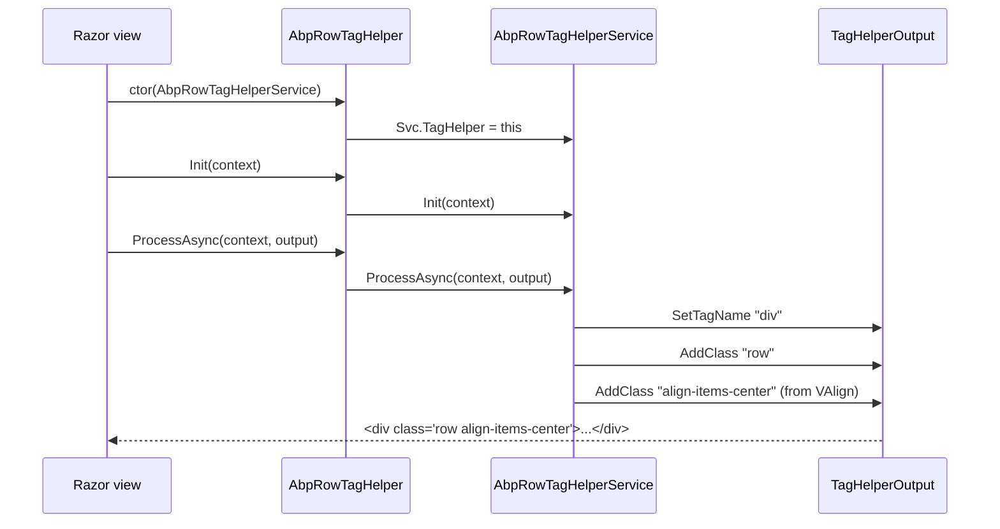

`Volo.Abp.AspNetCore.Mvc.UI.Bootstrap` is the package that turns Razor markup into Bootstrap 5 HTML through tag helpers prefixed with `abp-`. This page enumerates every helper shipped under `framework/src/Volo.Abp.AspNetCore.Mvc.UI.Bootstrap/TagHelpers/`, documents the base class they all inherit from, and groups the helpers by Bootstrap feature so you can find the right one from the markup you want to author rather than from the C# class name.

<Info>
For the lower-level MVC pipeline that hosts these tag helpers, see [`/aspnetcore/mvc`](/aspnetcore/mvc). For the Blazor equivalent (`Volo.Abp.AspNetCore.Components.Web` components), see [`/blazor/overview`](/blazor/overview).
</Info>

## Module wiring

`framework/src/Volo.Abp.AspNetCore.Mvc.UI.Bootstrap/AbpAspNetCoreMvcUiBootstrapModule.cs`:

```csharp
[DependsOn(typeof(AbpAspNetCoreMvcUiModule))]
public class AbpAspNetCoreMvcUiBootstrapModule : AbpModule
{
    public override void ConfigureServices(ServiceConfigurationContext context)
    {
        Configure<AbpVirtualFileSystemOptions>(options =>
        {
            options.FileSets.AddEmbedded<AbpAspNetCoreMvcUiBootstrapModule>("Volo.Abp.AspNetCore.Mvc.UI.Bootstrap");
        });
    }
}
```

The embedded file set carries `_ViewImports.cshtml`-style entries that register the tag helpers under their `abp-*` prefix. A consumer pulls in this module by depending on `AbpAspNetCoreMvcUiThemeSharedModule` (which depends on this one), or by listing it directly.

## The base class

Every helper inherits from `AbpTagHelper<TTagHelper, TService>` in `TagHelpers/AbpTagHelper.cs`:

```csharp
public abstract class AbpTagHelper : TagHelper, ITransientDependency { }

public abstract class AbpTagHelper<TTagHelper, TService> : AbpTagHelper
    where TTagHelper : AbpTagHelper<TTagHelper, TService>
    where TService : class, IAbpTagHelperService<TTagHelper>
{
    protected TService Service { get; }
    public override int Order => Service.Order;

    [HtmlAttributeNotBound]
    [ViewContext]
    public ViewContext ViewContext { get; set; } = default!;

    protected AbpTagHelper(TService service)
    {
        Service = service;
        Service.As<AbpTagHelperService<TTagHelper>>().TagHelper = (TTagHelper)this;
    }

    public override void Init(TagHelperContext context) => Service.Init(context);
    public override void Process(TagHelperContext context, TagHelperOutput output) => Service.Process(context, output);
    public override Task ProcessAsync(TagHelperContext context, TagHelperOutput output) => Service.ProcessAsync(context, output);
}
```

The separation matters: a developer authoring a custom Bootstrap helper subclasses `AbpTagHelper<MyTagHelper, MyTagHelperService>` and implements all rendering logic in the service. Services are `ITransientDependency` so they can pull other DI services for localization or model state without the tag helper carrying that surface area.

## Forms

The form tag helpers are the most heavily customized. They wire ASP.NET model expressions to Bootstrap-flavoured rendering with validation, tooltips, and label helpers.

| Tag | C# class | Notable attributes |
| --- | --- | --- |
| `<abp-input>` | `AbpInputTagHelper` | `asp-for`, `label`, `label-tooltip`, `info`, `disabled`, `readonly`, `type`, `size`, `required-symbol`, `floating-label`, `use-switch-checkbox`, `add-margin-bottom-class` |
| `<abp-select>` | `AbpSelectTagHelper` | (Bootstrap-styled `<select>` with `asp-for`) |
| `<abp-radio>` | `AbpRadioInputTagHelper` | radio button group |
| `<abp-date-picker>` | `AbpDatePickerTagHelper` | datepicker via `BootstrapDatepicker` package |
| `<abp-date-range-picker>` | `AbpDateRangePickerTagHelper` | range picker via `BootstrapDaterangepicker` |
| `<abp-dynamic-form>` | `AbpDynamicFormTagHelper` | renders an entire model with `abp-form-content` |
| `<abp-form-content />` | `AbpFormContentTagHelper` | placeholder for dynamic form body |
| any element with `abp-id-name` | `AbpIdNameTagHelper` | adds `id`/`name` from an attribute |
| any element with `asp-validation-summary` | `AbpValidationAttributeTagHelper` | restyles validation summaries |

### `AbpInputTagHelper`

`TagHelpers/Form/AbpInputTagHelper.cs` is the workhorse:

```csharp
public class AbpInputTagHelper : AbpTagHelper<AbpInputTagHelper, AbpInputTagHelperService>
{
    public ModelExpression AspFor { get; set; } = default!;
    public string? Label { get; set; }
    public string? LabelTooltip { get; set; }
    public string LabelTooltipIcon { get; set; } = "bi-info-circle";
    public string LabelTooltipPlacement { get; set; } = "right";
    public bool LabelTooltipHtml { get; set; } = false;

    [HtmlAttributeName("info")]
    public string? InfoText { get; set; }

    [HtmlAttributeName("disabled")]
    public bool IsDisabled { get; set; } = false;

    [HtmlAttributeName("readonly")]
    public bool? IsReadonly { get; set; } = false;

    public bool AutoFocus { get; set; }

    [HtmlAttributeName("type")]
    public string? InputTypeName { get; set; }

    public AbpFormControlSize Size { get; set; } = AbpFormControlSize.Default;

    [HtmlAttributeName("required-symbol")]
    public bool DisplayRequiredSymbol { get; set; } = true;

    [HtmlAttributeName("asp-format")]
    public string? Format { get; set; }

    public string? Name { get; set; }
    public string? Value { get; set; }
    public bool SuppressLabel { get; set; }

    [HtmlAttributeName("floating-label")]
    public bool FloatingLabel { get; set; }

    public CheckBoxHiddenInputRenderMode? CheckBoxHiddenInputRenderMode { get; set; }

    [HtmlAttributeName("use-switch-checkbox")]
    public bool UseSwitchCheckBox { get; set; } = false;

    public bool AddMarginBottomClass { get; set; } = true;
}
```

Usage:

```cshtml
<abp-input asp-for="Customer.Email"
           label="@L["Email"]"
           info="@L["EmailIsPublic"]"
           floating-label="true" />
```

The companion `AbpInputTagHelperService` inspects `AspFor.Metadata` to detect the model type, pick the right `<input type="...">`, render labels, and emit a validation span — all without the page author needing to know which Bootstrap classes apply.

## Buttons

Defined under `TagHelpers/Button/`.

| Tag | C# class | Description |
| --- | --- | --- |
| `<abp-button>` | `AbpButtonTagHelper` | Normal button. Carries `button-type`, `size`, `icon`, `text`, `busy-text`, `icon-type`, `disabled` |
| `<input abp-button>` | `AbpLinkButtonTagHelper` | Decorates a plain `<input>` as a button |
| `<abp-button-group>` | `AbpButtonGroupTagHelper` | Bootstrap button group |
| `<abp-button-toolbar>` | `AbpButtonToolbarTagHelper` | Toolbar wrapping multiple groups |

`TagHelpers/Button/AbpButtonTagHelper.cs`:

```csharp
[HtmlTargetElement("abp-button", TagStructure = TagStructure.NormalOrSelfClosing)]
public class AbpButtonTagHelper : AbpTagHelper<AbpButtonTagHelper, AbpButtonTagHelperService>, IButtonTagHelperBase
{
    public AbpButtonType ButtonType { get; set; } = AbpButtonType.Default;
    public AbpButtonSize Size { get; set; } = AbpButtonSize.Default;
    public string? BusyText { get; set; }
    public string? Text { get; set; }
    public string? Icon { get; set; }
    public bool? Disabled { get; set; }
    public FontIconType IconType { get; set; } = FontIconType.FontAwesome;
    public bool BusyTextIsHtml { get; set; }
}
```

The enum `AbpButtonType` lists `Default`, `Primary`, `Secondary`, `Success`, `Danger`, `Warning`, `Info`, `Light`, `Dark`, `Link`, `Outline_Primary` ... mapping directly to Bootstrap classes.

## Grid

Defined under `TagHelpers/Grid/`. These translate to `container`, `row`, and `col-*-*` classes.

| Tag | C# class | Notable attributes |
| --- | --- | --- |
| `<abp-container>` | `AbpContainerTagHelper` | (no extra attributes) |
| `<abp-row>` / `<abp-form-row>` | `AbpRowTagHelper` | `v-align`, `h-align`, `gutters` |
| `<abp-column>` | `AbpColumnTagHelper` | `size`, `size-sm`, `size-md`, `size-lg`, `size-xl`, `size-xxl`, `offset*`, `order`, `v-align` |
| `<abp-column-breaker>` | `AbpColumnBreakerTagHelper` | wraps row to a new line |

`AbpRowTagHelper` carries the two `HtmlTargetElement` attributes so it covers both `<abp-row>` and `<abp-form-row>`:

```csharp
[HtmlTargetElement("abp-row")]
[HtmlTargetElement("abp-form-row")]
public class AbpRowTagHelper : AbpTagHelper<AbpRowTagHelper, AbpRowTagHelperService>
{
    public VerticalAlign VAlign { get; set; } = VerticalAlign.Default;
    public HorizontalAlign HAlign { get; set; } = HorizontalAlign.Default;
    public bool? Gutters { get; set; } = true;
}
```

## Cards

Defined under `TagHelpers/Card/`.

| Tag | C# class | Description |
| --- | --- | --- |
| `<abp-card>` | `AbpCardTagHelper` | Card wrapper |
| `<abp-card-header>` | `AbpCardHeaderTagHelper` | header section |
| `<abp-card-body>` | `AbpCardBodyTagHelper` | body section |
| `<abp-card-footer>` | `AbpCardFooterTagHelper` | footer section |
| `<abp-card-title>` | `AbpCardTitleTagHelper` | `h*` title |
| `<abp-card-subtitle>` | `AbpCardSubtitleTagHelper` | subtitle |
| `<abp-card-text>` | `AbpCardTextTagHelper` | paragraph text |
| `<abp-image abp-card-image>` | `AbpCardImageTagHelper` | card image |
| `<a abp-card-link>` | `AbpCardLinkTagHelper` | link |
| `<abp-card background="*">` | `AbpCardBackgroundTagHelper` | wraps `abp-card`/`abp-card-header`/`abp-card-body`/`abp-card-footer` to apply a background color |
| `<abp-card text-color="*">` | `AbpCardTextColorTagHelper` | similar for text color |

The background and text-color helpers reuse `[HtmlTargetElement("abp-card", Attributes = "background")]` so they piggy-back on existing tag elements. This is visible in the source listing for `TagHelpers/Card/AbpCardBackgroundTagHelper.cs`.

## Alerts

| Tag | C# class | Description |
| --- | --- | --- |
| `<abp-alert>` | `AbpAlertTagHelper` | Wraps a Bootstrap alert |
| `<h*>` inside `<abp-alert>` | `AbpAlertHeaderTagHelper` | Styles headers inside an alert |
| `<a abp-alert-link>` | `AbpAlertLinkTagHelper` | Styles a link inside an alert |

`TagHelpers/Alert/AbpAlertHeaderTagHelper.cs`:

```csharp
[HtmlTargetElement("h6", ParentTag = "abp-alert", TagStructure = TagStructure.NormalOrSelfClosing)]
public class AbpAlertHeaderTagHelper : AbpTagHelper<AbpAlertHeaderTagHelper, AbpAlertHeaderTagHelperService>
{
    // ...
}
```

## Navigation & navbar

Defined under `TagHelpers/Nav/`.

| Tag | C# class |
| --- | --- |
| `<abp-nav>` | `AbpNavTagHelper` |
| `<abp-nav-item>` | `AbpNavItemTagHelper` |
| `<a abp-nav-link>` | `AbpNavLinkTagHelper` |
| `<abp-navbar>` | `AbpNavBarTagHelper` |
| `<a abp-navbar-brand>` / `<abp-navbar-brand>` | `AbpNavbarBrandTagHelper` |
| `<abp-navbar-nav>` | `AbpNavbarNavTagHelper` |
| `<span abp-navbar-text>` | `AbpNavbarTextTagHelper` |
| `<abp-navbar-toggle>` | `AbpNavbarToggleTagHelper` |

## Modals

Defined under `TagHelpers/Modal/`.

| Tag | C# class |
| --- | --- |
| `<abp-modal>` | `AbpModalTagHelper` |
| `<abp-modal-header>` | `AbpModalHeaderTagHelper` |
| `<abp-modal-body>` | `AbpModalBodyTagHelper` |
| `<abp-modal-footer>` | `AbpModalFooterTagHelper` |

The footer helper uses the `AbpModalButtons` flag enum so authors write `buttons="@(AbpModalButtons.Cancel|AbpModalButtons.Save)"` — see the tenant switch modal markup at `framework/src/Volo.Abp.AspNetCore.Mvc.UI.MultiTenancy/Pages/Abp/MultiTenancy/TenantSwitchModal.cshtml`.

## Tabs

Defined under `TagHelpers/Tab/`.

| Tag | C# class |
| --- | --- |
| `<abp-tabs>` | `AbpTabsTagHelper` |
| `<abp-tab>` | `AbpTabTagHelper` |
| `<abp-tab-dropdown>` | `AbpTabDropdownTagHelper` |
| `<abp-tab-link>` | `AbpTabLinkTagHelper` |

`AbpTabLinkTagHelper` is self-closing:

```csharp
[HtmlTargetElement("abp-tab-link", TagStructure = TagStructure.WithoutEndTag)]
public class AbpTabLinkTagHelper : AbpTagHelper<AbpTabLinkTagHelper, AbpTabLinkTagHelperService> { /* ... */ }
```

## Tables

Defined under `TagHelpers/Table/`. These re-decorate plain HTML table elements when the `abp-table` attribute is present.

| Tag | C# class |
| --- | --- |
| `<abp-table>` | `AbpTableTagHelper` |
| `<thead>` (inside `<abp-table>`) | `AbpTableHeaderTagHelper` |
| `<th>` | `AbpTableHeadScopeTagHelper` |
| `<td>` | `AbpTableStyleTagHelper` |

## Dropdowns

Defined under `TagHelpers/Dropdown/`.

| Tag | C# class |
| --- | --- |
| `<abp-dropdown>` | `AbpDropdownTagHelper` |
| `<abp-dropdown-button>` | `AbpDropdownButtonTagHelper` |
| `<abp-dropdown-menu>` | `AbpDropdownMenuTagHelper` |
| `<abp-dropdown-item>` | `AbpDropdownItemTagHelper` |
| `<abp-dropdown-item-text>` | `AbpDropdownItemTextTagHelper` |
| `<abp-dropdown-header>` | `AbpDropdownHeaderTagHelper` |
| `<abp-dropdown-divider>` | `AbpDropdownDividerTagHelper` |

## Collapse and accordion

Defined under `TagHelpers/Collapse/`.

| Tag | C# class |
| --- | --- |
| `<abp-accordion>` | `AbpAccordionTagHelper` |
| `<abp-accordion-item>` | `AbpAccordionItemTagHelper` |
| `<abp-collapse-body>` | `AbpCollapseBodyTagHelper` |
| `<a abp-collapse-id>` | `AbpCollapseButtonTagHelper` |

`AbpCollapseButtonTagHelper` plus the popover helper rely on attribute-driven targeting:

```csharp
[HtmlTargetElement("a", Attributes = "abp-collapse-id")]
public class AbpCollapseButtonTagHelper : AbpTagHelper<AbpCollapseButtonTagHelper, AbpCollapseButtonTagHelperService> { /* ... */ }
```

## Carousel, blockquote, breadcrumb, figure

| Group | Tags |
| --- | --- |
| Carousel | `<abp-carousel>` (`AbpCarouselTagHelper`), `<abp-carousel-item>` (`AbpCarouselItemTagHelper`) |
| Blockquote | `<abp-blockquote>` (`AbpBlockquoteTagHelper`), `<p>` inside (`AbpBlockquoteParagraphTagHelper`), `<footer>` inside (`AbpBlockquoteFooterTagHelper`) |
| Breadcrumb | `<abp-breadcrumb>` (`AbpBreadcrumbTagHelper`), `<abp-breadcrumb-item>` (`AbpBreadcrumbItemTagHelper`) |
| Figure | `<abp-figure>` (`AbpFigureTagHelper`), `<abp-image>` inside (`AbpFigureImageTagHelper`), `<abp-figcaption>` (`AbpFigureCaptionTagHelper`) |

## Badge, border, list group, pagination, popover, progress, tooltip, utils

| Tag(s) | C# class |
| --- | --- |
| `<span abp-badge-pill>` | `AbpBadgeTagHelper` |
| any element with `abp-border` | `AbpBorderTagHelper` |
| any element with `abp-rounded` | `AbpRoundedTagHelper` |
| `<abp-list-group>` | `AbpListGroupTagHelper` |
| `<abp-list-group-item>` | `AbpListGroupItemTagHelper` |
| `<abp-paginator>` | `AbpPaginationTagHelper` |
| `<abp-button abp-popover*>` / `<abp-button abp-tooltip*>` | `AbpPopoverTagHelper` / `AbpTooltipTagHelper` |
| `<abp-progress-bar>` / `<abp-progress-part>` / `<abp-progress-group>` | `AbpProgressBarTagHelper` / `AbpProgressGroupTagHelper` |
| any element with `abp-auto-focus` | `AbpAutoFocusTagHelper` |
| any element with `abp-if` | `AbpIfTagHelper` |

The popover helper registers itself against multiple attribute variants so that placement is encoded in the attribute name:

```text
abp-button abp-popover
abp-button abp-popover-top
abp-button abp-popover-bottom
abp-button abp-popover-left
abp-button abp-popover-right
```

This is visible in `grep -rh "HtmlTargetElement(\"abp-" TagHelpers/` over the package — each placement is its own `[HtmlTargetElement]` on `AbpPopoverTagHelper`.

## How a helper actually renders

Take the row helper as an example. The flow when the Razor view engine encounters `<abp-row v-align="center">...</abp-row>`:



The pattern means: to override how `<abp-row>` renders, you replace `AbpRowTagHelperService` in DI via `[Dependency(ReplaceServices = true)]`. The tag helper itself almost never needs to be subclassed.

## Authoring a custom helper

To add an `<abp-card-icon icon="bi-star">` tag helper:

1. Create `MyCardIconTagHelper : AbpTagHelper<MyCardIconTagHelper, MyCardIconTagHelperService>`.
2. Create `MyCardIconTagHelperService : AbpTagHelperService<MyCardIconTagHelper>` and put `Process(...)` logic there.
3. Add `<add tag-helper="*, MyAssembly"/>` to `_ViewImports.cshtml` or rely on the module's embedded `_ViewImports`.

The DI scaffolding works automatically because `AbpTagHelper` is decorated with `ITransientDependency` and the framework calls `Service.As<AbpTagHelperService<TTagHelper>>().TagHelper = ...` so the service can read attribute values from `Service.TagHelper`.

## Related pages

<CardGroup cols={2}>
  <Card title="Bundling" href="./bundling">
    The `<abp-script>` / `<abp-style>` / `<abp-script-bundle>` / `<abp-style-bundle>` tag helpers and how they emit the right asset URLs.
  </Card>
  <Card title="Theme shared" href="./theme-shared">
    How toolbars and page toolbars compose with these tag helpers.
  </Card>
  <Card title="ASP.NET Core MVC" href="/aspnetcore/mvc">
    The MVC pipeline these helpers run inside.
  </Card>
  <Card title="Basic theme" href="/modules/basic-theme">
    A complete theme that uses these helpers in its layouts.
  </Card>
</CardGroup>
