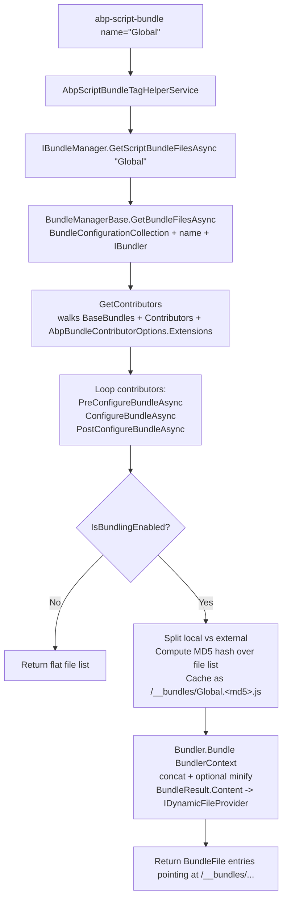

ABP's bundling story replaces ASP.NET's `BundleConfig` legacy with a modular pipeline where every module contributes files to named bundles via typed contributors. This page walks the two packages that implement it — `Volo.Abp.AspNetCore.Mvc.UI.Bundling.Abstractions` (types) and `Volo.Abp.AspNetCore.Mvc.UI.Bundling` (runtime) — and explains the contributor lifecycle, the four `BundlingMode` values, how the `BundleManager` builds and caches bundles, and how `<abp-script-bundle>` / `<abp-style-bundle>` emit URLs into a page.

<Info>
For minification (which the bundling pipeline calls into for `BundleAndMinify` mode) see [Minify](./minify). For the global bundles that themes pre-register, see [Theme shared](./theme-shared).
</Info>

## Two packages, one pipeline

| Package | Role | Key types |
| --- | --- | --- |
| `Volo.Abp.AspNetCore.Mvc.UI.Bundling.Abstractions` | Defines contributor + options types. No DI behaviour. | `BundleContributor`, `IBundleContributor`, `BundleConfiguration`, `BundleConfigurationCollection`, `BundleConfigurationContext`, `BundleFile`, `BundleFileContributor`, `AbpBundlingOptions`, `AbpBundleContributorOptions`, `BundlingMode` |
| `Volo.Abp.AspNetCore.Mvc.UI.Bundling` | Implements the runtime. | `BundleManager`, `ScriptBundler`, `StyleBundler`, `AbpScriptBundleTagHelper`, `AbpStyleBundleTagHelper`, `AbpScriptTagHelper`, `AbpStyleTagHelper` |

Modules that only declare contributors should depend on the abstractions package; the runtime is brought in transitively via `AbpAspNetCoreMvcUiThemeSharedModule` (which depends on `AbpAspNetCoreMvcUiBundlingModule`).

## The contributor model

Every bundle is built by walking an ordered list of contributors. A contributor either appends files or mutates the in-progress file list. The interface is in `Volo.Abp.AspNetCore.Mvc.UI.Bundling.Abstractions/Volo/Abp/AspNetCore/Mvc/UI/Bundling/IBundleContributor.cs`:

```csharp
public interface IBundleContributor
{
    Task PreConfigureBundleAsync(BundleConfigurationContext context);
    Task ConfigureBundleAsync(BundleConfigurationContext context);
    Task PostConfigureBundleAsync(BundleConfigurationContext context);
    Task ConfigureDynamicResourcesAsync(BundleConfigurationContext context);
}
```

The abstract base class `BundleContributor` provides synchronous overload shims so most contributors simply override `ConfigureBundle`:

```csharp
public abstract class BundleContributor : IBundleContributor
{
    public virtual Task ConfigureBundleAsync(BundleConfigurationContext context)
    {
        ConfigureBundle(context);
        return Task.CompletedTask;
    }

    public virtual void ConfigureBundle(BundleConfigurationContext context) { }
    // ... Pre/Post/DynamicResources counterparts
}
```

There are no separate `ScriptBundleContributor` / `StyleBundleContributor` subclasses — a single contributor can be referenced from a script bundle or a style bundle. The file extensions inside `context.Files` decide what gets emitted as `<script>` vs `<link>` at the tag-helper layer.

### `BundleConfigurationContext`

`Bundling.Abstractions/.../BundleConfigurationContext.cs`:

```csharp
public class BundleConfigurationContext : IBundleConfigurationContext
{
    public List<BundleFile> Files { get; }
    public IFileProvider FileProvider { get; }
    public IServiceProvider ServiceProvider { get; }
    public IAbpLazyServiceProvider LazyServiceProvider { get; }
    public BundleParameterDictionary Parameters { get; set; }

    public BundleConfigurationContext(IServiceProvider serviceProvider, IFileProvider fileProvider, BundleParameterDictionary? parameters = null)
    {
        Files = new List<BundleFile>();
        ServiceProvider = serviceProvider;
        LazyServiceProvider = ServiceProvider.GetRequiredService<IAbpLazyServiceProvider>();
        FileProvider = fileProvider;
        Parameters = parameters ?? new BundleParameterDictionary();
    }
}
```

Inside `ConfigureBundle` a contributor pushes file paths into `context.Files`. The `FileProvider` is the web root provider so contributors can call `context.FileProvider.GetFileInfo("/libs/...").Exists` to gate adding optional files.

### Example contributors

The package `Volo.Abp.AspNetCore.Mvc.UI.Packages` ships dozens of contributors. The simplest ones look like this:

`framework/src/Volo.Abp.AspNetCore.Mvc.UI.Packages/Volo/Abp/AspNetCore/Mvc/UI/Packages/JQuery/JQueryScriptContributor.cs`:

```csharp
[DependsOn(typeof(CoreScriptContributor))]
public class JQueryScriptContributor : BundleContributor
{
    public override void ConfigureBundle(BundleConfigurationContext context)
    {
        context.Files.AddIfNotContains("/libs/jquery/jquery.js");
        context.Files.AddIfNotContains("/libs/abp/jquery/abp.jquery.js");
    }
}
```

`framework/src/Volo.Abp.AspNetCore.Mvc.UI.Packages/Volo/Abp/AspNetCore/Mvc/UI/Packages/Bootstrap/BootstrapScriptContributor.cs`:

```csharp
[DependsOn(typeof(JQueryScriptContributor))]
public class BootstrapScriptContributor : BundleContributor
{
    public override void ConfigureBundle(BundleConfigurationContext context)
    {
        context.Files.AddIfNotContains("/libs/bootstrap/js/bootstrap.bundle.js");
    }
}
```

The `[DependsOn(typeof(JQueryScriptContributor))]` attribute is honoured by the bundling system — it expands the contributor list so jQuery is added before Bootstrap, even if only `BootstrapScriptContributor` was explicitly registered. This mirrors the module-level `DependsOn` semantics.

### The `BundleFileContributor` shortcut

When you don't need a typed contributor, the file-collection extensions wrap a list of paths into a `BundleFileContributor`:

`Bundling.Abstractions/.../BundleFileContributor.cs`:

```csharp
public class BundleFileContributor : BundleContributor
{
    public List<BundleFile> Files { get; }

    public BundleFileContributor(params BundleFile[] files)
    {
        Files = new List<BundleFile>();
        Files.AddRange(files);
    }

    public BundleFileContributor(params string[] files)
    {
        Files = new List<BundleFile>();
        Files.AddRange(files.Select(file => new BundleFile(file)));
    }

    public override void ConfigureBundle(BundleConfigurationContext context)
    {
        foreach (var file in Files)
        {
            context.Files.AddIfNotContains(x => x.FileName.Equals(file.FileName, StringComparison.OrdinalIgnoreCase), () => file);
        }
    }
}
```

So `bundle.AddFiles("/a.js", "/b.js")` is equivalent to `bundle.AddContributors(new BundleFileContributor("/a.js", "/b.js"))`.

## `BundleConfiguration` and `BundleConfigurationCollection`

A bundle is a name plus an ordered list of contributors plus a list of "base bundles" to inherit from:

`Bundling.Abstractions/.../BundleConfiguration.cs`:

```csharp
public class BundleConfiguration
{
    public string Name { get; }
    public BundleContributorCollection Contributors { get; }
    public List<string> BaseBundles { get; }

    public BundleConfiguration(string name)
    {
        Name = name;
        Contributors = new BundleContributorCollection();
        BaseBundles = new List<string>();
    }
}
```

`BundleConfigurationExtensions` provides the fluent surface used everywhere:

```csharp
public static BundleConfiguration AddFiles(this BundleConfiguration bundleConfiguration, params string[] files);
public static BundleConfiguration AddExternalFiles(this BundleConfiguration bundleConfiguration, params string[] files);
public static BundleConfiguration RemoveFiles(this BundleConfiguration bundleConfiguration, params string[] files);
public static BundleConfiguration RemoveFiles(this BundleConfiguration bundleConfiguration, Func<string, bool> predicate);
public static BundleConfiguration AddContributors(this BundleConfiguration bundleConfiguration, params Type[] contributorTypes);
public static BundleConfiguration AddBaseBundles(this BundleConfiguration bundleConfiguration, params string[] bundleNames);
```

The companion `BundleConfigurationCollection` supports configuring bundles that don't yet exist — when a tag helper later creates the bundle, the deferred actions run:

```csharp
public BundleConfigurationCollection Configure([NotNull] string bundleName, [NotNull] Action<BundleConfiguration> configureAction)
{
    if (_bundles.TryGetValue(bundleName, out var bundle))
    {
        configureAction.Invoke(bundle);
    }
    else
    {
        var configurationActions = _lazyBundleConfigurationActions
            .GetOrAdd(bundleName, () => new List<Action<BundleConfiguration>>());

        lock (configurationActions)
        {
            configurationActions.Add(configureAction);
        }
    }

    return this;
}
```

This lazy semantics is the reason a module can write `options.ScriptBundles.Get(StandardBundles.Scripts.Global).AddFiles(...)` even if the bundle is first declared by a different module loaded later.

## `AbpBundlingOptions`

The root configuration object: `Bundling.Abstractions/.../AbpBundlingOptions.cs`:

```csharp
public class AbpBundlingOptions
{
    public BundleConfigurationCollection StyleBundles { get; }
    public BundleConfigurationCollection ScriptBundles { get; }
    public HashSet<string> MinificationIgnoredFiles { get; }

    /// <summary>Default: "__bundles".</summary>
    public string BundleFolderName { get; } = "__bundles";

    /// <summary>Default: auto.</summary>
    public BundlingMode Mode { get; set; } = BundlingMode.Auto;

    public bool DeferScriptsByDefault { get; set; }
    public List<string> DeferScripts { get; }

    public bool PreloadStylesByDefault { get; set; }
    public List<string> PreloadStyles { get; }

    public AbpBundlingGlobalAssetsOptions GlobalAssets { get; set; }
    public BundleParameterDictionary Parameters { get; set; }
}
```

| Property | Purpose |
| --- | --- |
| `ScriptBundles` / `StyleBundles` | Named bundle definitions |
| `MinificationIgnoredFiles` | Skip minification for matching paths |
| `BundleFolderName` | URL prefix for emitted bundle files (`/__bundles/...`) |
| `Mode` | One of `None`, `Auto`, `Bundle`, `BundleAndMinify` |
| `DeferScriptsByDefault` / `DeferScripts` | Add `defer` to emitted `<script>` tags |
| `PreloadStylesByDefault` / `PreloadStyles` | Add `rel="preload"` for emitted `<link>` tags |
| `GlobalAssets` | Settings for the global `_combined.css`/`_combined.js` outputs |
| `Parameters` | Free-form key/value bag passed into `BundleConfigurationContext.Parameters` |

### `BundlingMode`

`Bundling.Abstractions/.../BundlingMode.cs`:

```csharp
public enum BundlingMode
{
    /// <summary>No bundling or minification.</summary>
    None,

    /// <summary>
    /// Automatically determine the mode.
    /// - Uses None for development time.
    /// - Uses BundleAndMinify for other environments.
    /// </summary>
    Auto,

    /// <summary>Bundled but not minified.</summary>
    Bundle,

    /// <summary>Bundled and minified.</summary>
    BundleAndMinify
}
```

`BundleManager.IsBundlingEnabled` in `framework/src/Volo.Abp.AspNetCore.Mvc.UI.Bundling/.../BundleManager.cs` implements `Auto`:

```csharp
public override bool IsBundlingEnabled()
{
    switch (Options.Mode)
    {
        case BundlingMode.None: return false;
        case BundlingMode.Bundle:
        case BundlingMode.BundleAndMinify: return true;
        case BundlingMode.Auto: return !HostingEnvironment.IsDevelopment();
        default: throw new AbpException($"Unhandled {nameof(BundlingMode)}: {Options.Mode}");
    }
}

protected override bool IsMinficationEnabled()
{
    switch (Options.Mode)
    {
        case BundlingMode.None:
        case BundlingMode.Bundle: return false;
        case BundlingMode.BundleAndMinify: return true;
        case BundlingMode.Auto: return !HostingEnvironment.IsDevelopment();
        default: throw new AbpException($"Unhandled {nameof(BundlingMode)}: {Options.Mode}");
    }
}
```

In Development the asset list is emitted as a flat list of `<script>`/`<link>` tags — making each file individually debuggable. In any other environment the bundle is fused and minified.

## `BundleManager` — building a bundle

The `BundleManager` is the top-level service tag helpers ask for the bundle file list. It lives in `framework/src/Volo.Abp.AspNetCore.Mvc.UI.Bundling/Volo/Abp/AspNetCore/Mvc/UI/Bundling/BundleManager.cs` and extends `BundleManagerBase` (in `Volo.Abp.AspNetCore.Bundling`).



The MD5 stamping in `BundleManagerBase.AddToBundleCache`:

```csharp
private BundleCacheItem AddToBundleCache(string bundleName, IBundler bundler, List<string> bundleFiles)
{
    var bundleRelativePath =
        Options.BundleFolderName.EnsureEndsWith('/') +
        bundleName + "." + bundleFiles.JoinAsString("|").ToMd5() + "." + bundler.FileExtension;

    return BundleCache.GetOrAdd(bundleRelativePath, () =>
    {
        var cacheValue = new BundleCacheItem(
            new List<BundleFile> { new BundleFile("/" + bundleRelativePath) }
        );

        WatchChanges(cacheValue, bundleFiles, bundleRelativePath);

        var bundleResult = bundler.Bundle(/* ... */);
        // ...
    });
}
```

The hash of the joined file list means changing any constituent file (or its order) produces a new URL — automatic cache busting without manual fingerprinting.

## `IBundler` and the script/style bundlers

`Volo.Abp.AspNetCore.Bundling/Volo/Abp/AspNetCore/Bundling/IBundler.cs`:

```csharp
public interface IBundler
{
    string FileExtension { get; }
    BundleResult Bundle(IBundlerContext context);
}
```

Two derived interfaces:

```csharp
public interface IScriptBundler : IBundler { }
public interface IStyleBundler : IBundler { }
```

Concrete implementations live in the bundling runtime:

`framework/src/Volo.Abp.AspNetCore.Mvc.UI.Bundling/.../Scripts/ScriptBundler.cs`:

```csharp
public class ScriptBundler : MvcUiBundlerBase, IScriptBundler
{
    public override string FileExtension => "js";

    public ScriptBundler(IWebHostEnvironment hostingEnvironment, IJavascriptMinifier minifier, IOptions<AbpBundlingOptions> bundlingOptions)
        : base(hostingEnvironment, minifier, bundlingOptions) { }

    protected override string ProcessBeforeAddingToTheBundle(IBundlerContext context, string filePath, string fileContent)
    {
        return fileContent.EnsureEndsWith(';') + Environment.NewLine;
    }
}
```

`framework/src/Volo.Abp.AspNetCore.Mvc.UI.Bundling/.../Styles/StyleBundler.cs`:

```csharp
public class StyleBundler : MvcUiBundlerBase, IStyleBundler
{
    public override string FileExtension => "css";

    public StyleBundler(IWebHostEnvironment hostingEnvironment, ICssMinifier minifier, IOptions<AbpBundlingOptions> bundlingOptions)
        : base(hostingEnvironment, minifier, bundlingOptions) { _hostingEnvironment = hostingEnvironment; }

    protected override string ProcessBeforeAddingToTheBundle(IBundlerContext context, string filePath, string fileContent)
    {
        return CssRelativePath.Adjust(
            fileContent,
            GetAbsolutePath(filePath),
            GetAbsolutePath(context.BundleRelativePath)
        );
    }
}
```

The style bundler rewrites `url(...)` references inside CSS files when the bundle moves them to `/__bundles/`. The minifiers are pulled from DI by interface (see [Minify](./minify)).

## Tag helpers

`framework/src/Volo.Abp.AspNetCore.Mvc.UI.Bundling/.../TagHelpers/` exposes four tag helpers.

### `<abp-script-bundle>` and `<abp-style-bundle>`

`AbpScriptBundleTagHelper.cs`:

```csharp
[HtmlTargetElement("abp-script-bundle", TagStructure = TagStructure.NormalOrSelfClosing)]
public class AbpScriptBundleTagHelper : AbpBundleTagHelper<AbpScriptBundleTagHelper, AbpScriptBundleTagHelperService>, IBundleTagHelper
{
    [HtmlAttributeName("defer")]
    public bool Defer { get; set; }
}
```

`AbpStyleBundleTagHelper.cs`:

```csharp
[HtmlTargetElement("abp-style-bundle", TagStructure = TagStructure.NormalOrSelfClosing)]
public class AbpStyleBundleTagHelper : AbpBundleTagHelper<AbpStyleBundleTagHelper, AbpStyleBundleTagHelperService>, IBundleTagHelper
{
    [HtmlAttributeName("preload")]
    public bool Preload { get; set; }
}
```

The base type `AbpBundleTagHelper<TTagHelper, TService>` carries the `name` attribute:

```csharp
public abstract class AbpBundleTagHelper<TTagHelper, TService> : AbpTagHelper<TTagHelper, TService>, IBundleTagHelper
{
    public string? Name { get; set; }
    public virtual string? GetNameOrNull() => Name;
}
```

In a layout you call:

```cshtml
<abp-style-bundle name="@StandardBundles.Styles.Global" />
<!-- ... -->
<abp-script-bundle name="@StandardBundles.Scripts.Global" defer="true" />
```

The service implementation walks `IBundleManager.GetStyleBundleFilesAsync(name)`/`GetScriptBundleFilesAsync(name)` and emits a `<link>` or `<script>` for every returned `BundleFile`. The bundle is created lazily — the same `BundleConfigurationCollection.TryAdd` path runs the first time the tag helper asks for an unknown bundle.

### `<abp-script>` and `<abp-style>`

These let a single page contribute additional files to a bundle without declaring it through options:

`AbpScriptTagHelper.cs`:

```csharp
[HtmlTargetElement("abp-script", TagStructure = TagStructure.NormalOrSelfClosing)]
public class AbpScriptTagHelper : AbpBundleItemTagHelper<AbpScriptTagHelper, AbpScriptTagHelperService>, IBundleItemTagHelper
{
    [HtmlAttributeName("defer")]
    public bool Defer { get; set; }

    protected override string GetFileExtension() => "js";
}
```

`AbpStyleTagHelper.cs`:

```csharp
[HtmlTargetElement("abp-style", TagStructure = TagStructure.NormalOrSelfClosing)]
public class AbpStyleTagHelper : AbpBundleItemTagHelper<AbpStyleTagHelper, AbpStyleTagHelperService>, IBundleItemTagHelper
{
    [HtmlAttributeName("preload")]
    public bool Preload { get; set; }

    protected override string GetFileExtension() => "css";
}
```

A typical page usage:

```cshtml
@section scripts {
    <abp-script src="/Pages/Customers/index.js" />
}
@section styles {
    <abp-style src="/Pages/Customers/index.css" />
}
```

The tag helper service collects these per-page files via `IWebRequestResources` and emits the corresponding `<script>` / `<link>` tags. In production mode they are folded into a per-page bundle file under `/__bundles/`.

## Per-request resource collection

`framework/src/Volo.Abp.AspNetCore.Mvc.UI.Bundling/.../Resources/WebRequestResources.cs` is the scoped service that tracks what's already been emitted on the current request. `BundleManager.GetBundleFilesAsync` calls `RequestResources.TryAdd(...)` so the same file is never written twice when two bundles share a contributor:

```csharp
protected async override Task<List<BundleFile>> GetBundleFilesAsync(List<IBundleContributor> contributors)
{
    return RequestResources.TryAdd(await base.GetBundleFilesAsync(contributors));
}
```

This is why `<abp-script-bundle name="Global" />` followed by `<abp-script-bundle name="ModuleX" />` does not double-load jQuery — the second bundle's `jquery.js` entry is filtered against the request-scoped set.

## Global assets

`AbpBundlingOptions.GlobalAssets` (instance of `AbpBundlingGlobalAssetsOptions`) lets the host emit a single concatenated `_combined.js` and `_combined.css` representing the entire global bundle into the dynamic file provider at startup. The pre-baking runs from `AbpAspNetCoreMvcUiBundlingModule.OnApplicationInitializationAsync` and reads:

```csharp
protected virtual async Task InitialGlobalAssetsAsync(ApplicationInitializationContext context)
{
    var bundlingOptions = context.ServiceProvider.GetRequiredService<IOptions<AbpBundlingOptions>>().Value;
    if (!bundlingOptions.GlobalAssets.Enabled) return;

    var bundleManager = context.ServiceProvider.GetRequiredService<BundleManager>();
    // ...
    if (!bundlingOptions.GlobalAssets.GlobalStyleBundleName.IsNullOrWhiteSpace())
    {
        var styleFiles = await bundleManager.GetStyleBundleFilesAsync(bundlingOptions.GlobalAssets.GlobalStyleBundleName);
        // concatenate, adjust relative urls, push into IDynamicFileProvider
        dynamicFileProvider.AddOrUpdate(
            new InMemoryFileInfo("/wwwroot/" + bundlingOptions.GlobalAssets.CssFileName,
                Encoding.UTF8.GetBytes(styles),
                bundlingOptions.GlobalAssets.CssFileName));
    }
}
```

This is what powers a single-file `?v=...` asset for a CDN to fetch.

## `AbpBundleContributorOptions` — extension contributors

`Bundling.Abstractions/.../AbpBundleContributorOptions.cs`:

```csharp
public class AbpBundleContributorOptions
{
    public ConcurrentDictionary<Type, BundleContributorCollection> AllExtensions { get; }

    public BundleContributorCollection Extensions<TContributor>() => Extensions(typeof(TContributor));

    public BundleContributorCollection Extensions([NotNull] Type contributorType)
    {
        return AllExtensions.GetOrAdd(contributorType, _ => new BundleContributorCollection());
    }
}
```

`AllExtensions` lets a module extend a third-party contributor without owning it. For example, to add an extra `kendo-fixup.js` to every place that uses jQuery:

```csharp
Configure<AbpBundleContributorOptions>(options =>
{
    options.Extensions<JQueryScriptContributor>().AddFiles("/libs/kendo-fixup.js");
});
```

`BundleManagerBase.GetContributors` walks both the declared contributors and these extensions.

## Lifecycle summary

| Phase | When | Typical usage |
| --- | --- | --- |
| `PreConfigureBundleAsync` | Before file list is populated | Mutate `context.Parameters`, set conditional flags |
| `ConfigureBundleAsync` | Populate `context.Files` | Append `/libs/...` paths via `context.Files.AddIfNotContains(...)` |
| `PostConfigureBundleAsync` | After files added | Remove or re-order files |
| `ConfigureDynamicResourcesAsync` | Emitted alongside static files | Add per-request dynamic CSS/JS (e.g. localization-driven) |

## Defining a bundle

A theme defines its global bundle at module configuration time. From `framework/src/Volo.Abp.AspNetCore.Mvc.UI.Theme.Shared/AbpAspNetCoreMvcUiThemeSharedModule.cs`:

```csharp
Configure<AbpBundlingOptions>(options =>
{
    options.StyleBundles.Add(StandardBundles.Styles.Global,
        bundle => { bundle.AddContributors(typeof(SharedThemeGlobalStyleContributor)); });

    options.ScriptBundles.Add(StandardBundles.Scripts.Global,
        bundle => bundle.AddContributors(typeof(SharedThemeGlobalScriptContributor)));
});
```

`SharedThemeGlobalScriptContributor` itself depends on every package contributor it needs:

```csharp
[DependsOn(
    typeof(JQueryScriptContributor),
    typeof(BootstrapScriptContributor),
    typeof(LodashScriptContributor),
    typeof(JQueryValidationUnobtrusiveScriptContributor),
    typeof(Select2ScriptContributor),
    typeof(DatatablesNetBs5ScriptContributor),
    typeof(Sweetalert2ScriptContributor),
    typeof(MalihuCustomScrollbarPluginScriptBundleContributor),
    typeof(LuxonScriptContributor),
    typeof(TimeagoScriptContributor),
    typeof(BootstrapDatepickerScriptContributor),
    typeof(BootstrapDaterangepickerScriptContributor)
)]
public class SharedThemeGlobalScriptContributor : BundleContributor { /* ... */ }
```

Each `[DependsOn]` declares an upstream contributor whose `ConfigureBundle` must run first.

## Recipes

<AccordionGroup>
  <Accordion title="Add a JS file to the global bundle">
    ```csharp
    Configure<AbpBundlingOptions>(options =>
    {
        options.ScriptBundles
               .Get(StandardBundles.Scripts.Global)
               .AddFiles("/scripts/feature.js");
    });
    ```
  </Accordion>
  <Accordion title="Remove a file from a bundle">
    ```csharp
    Configure<AbpBundlingOptions>(options =>
    {
        options.ScriptBundles
               .Get(StandardBundles.Scripts.Global)
               .RemoveFiles("/libs/timeago/jquery.timeago.js");
    });
    ```
  </Accordion>
  <Accordion title="Force defer on every emitted script">
    ```csharp
    Configure<AbpBundlingOptions>(options =>
    {
        options.DeferScriptsByDefault = true;
    });
    ```
  </Accordion>
  <Accordion title="Disable bundling for a single file">
    ```csharp
    Configure<AbpBundlingOptions>(options =>
    {
        options.MinificationIgnoredFiles.Add("/libs/chart.js/chart.js");
    });
    ```
  </Accordion>
  <Accordion title="Create a per-page bundle">
    ```cshtml
    @section scripts {
        <abp-script-bundle name="@(typeof(IndexModel).FullName!)">
            <abp-script src="/Pages/Customers/index.js" />
        </abp-script-bundle>
    }
    ```
    The first call creates the bundle lazily; subsequent calls reuse the cached version.
  </Accordion>
</AccordionGroup>

## Related pages

<CardGroup cols={2}>
  <Card title="Minify" href="./minify">
    The `IJavascriptMinifier` / `ICssMinifier` services that `ScriptBundler` and `StyleBundler` call.
  </Card>
  <Card title="Theme shared" href="./theme-shared">
    Where `StandardBundles.Global` is defined and the shared theme contributors live.
  </Card>
  <Card title="Bootstrap tag helpers" href="./bootstrap-tag-helpers">
    The other major Razor tag-helper surface.
  </Card>
  <Card title="Basic theme" href="/modules/basic-theme">
    A real consumer of all of the above.
  </Card>
</CardGroup>
