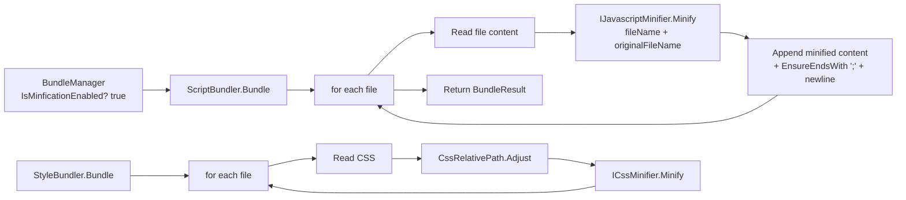

`Volo.Abp.Minify` is the smallest package in the MVC UI stack. It defines a three-method abstraction (`Minify`) and three marker interfaces (one per file type), and ships an NUglify-based implementation. The bundling pipeline in `Volo.Abp.AspNetCore.Mvc.UI.Bundling` resolves these services through DI, which means a host can swap the minifier without touching any bundle code. This deep dive walks every file under `framework/src/Volo.Abp.Minify/Volo/Abp/Minify/` and explains how `ScriptBundler` and `StyleBundler` consume them in `BundlingMode.BundleAndMinify`.

<Info>
The minifiers are stateless and registered as `ITransientDependency` so they are safe to use both inside the request pipeline and from the application-initialization hook that pre-bakes `GlobalAssets` — see [Bundling](./bundling) for the consumer side.
</Info>

## Module

`framework/src/Volo.Abp.Minify/Volo/Abp/Minify/AbpMinifyModule.cs`:

```csharp
public class AbpMinifyModule : AbpModule
{
}
```

There is no `ConfigureServices` here — every implementation type is marked `ITransientDependency` and is therefore auto-registered by the conventional DI scanner. Hosts pick up `Volo.Abp.Minify` implicitly because `AbpAspNetCoreMvcUiBundlingModule` references it indirectly through `Volo.Abp.AspNetCore.Bundling` → `MvcUiBundlerBase`.

## File-by-file tour

| File | Role |
| --- | --- |
| `IMinifier.cs` | Root abstraction with one method: `Minify(source, fileName, originalFileName)` |
| `Scripts/IJavascriptMinifier.cs` | Marker interface for JS minifier |
| `Styles/ICssMinifier.cs` | Marker interface for CSS minifier |
| `Html/IHtmlMinifier.cs` | Marker interface for HTML minifier |
| `NUglify/NUglifyMinifierBase.cs` | Shared boilerplate (error -> `NUglifyException`) |
| `NUglify/NUglifyJavascriptMinifier.cs` | `IJavascriptMinifier` via `Uglify.Js` |
| `NUglify/NUglifyCssMinifier.cs` | `ICssMinifier` via `Uglify.Css` |
| `NUglify/NUglifyHtmlMinifier.cs` | `IHtmlMinifier` via `Uglify.Html` |
| `NUglify/NUglifyException.cs` | `AbpException` subclass that surfaces NUglify errors |
| `AbpMinifyModule.cs` | Module registration |

## The root abstraction

`Volo/Abp/Minify/IMinifier.cs`:

```csharp
public interface IMinifier
{
    string Minify(
        string source,
        string? fileName = null,
        string? originalFileName = null);
}
```

| Parameter | Purpose |
| --- | --- |
| `source` | The actual file content to minify |
| `fileName` | Optional file name the minifier hands off to its parser — used for source maps and error messages |
| `originalFileName` | Optional pre-bundling path, used purely in error messages so a thrown `NUglifyException` says "Original file: /libs/jquery/jquery.js" rather than `/__bundles/Global.{md5}.js` |

The three marker interfaces are exactly that — markers, not contracts. They exist so the bundling pipeline can inject "the JS minifier" without colliding with "the CSS minifier".

`Volo/Abp/Minify/Scripts/IJavascriptMinifier.cs`:

```csharp
public interface IJavascriptMinifier : IMinifier { }
```

`Volo/Abp/Minify/Styles/ICssMinifier.cs`:

```csharp
public interface ICssMinifier : IMinifier { }
```

`Volo/Abp/Minify/Html/IHtmlMinifier.cs`:

```csharp
public interface IHtmlMinifier : IMinifier { }
```

## NUglify implementations

The default implementations live in `Volo/Abp/Minify/NUglify/`. They all extend a tiny base that converts NUglify's `UglifyResult.Errors` into a strongly-typed `NUglifyException`.

`Volo/Abp/Minify/NUglify/NUglifyMinifierBase.cs`:

```csharp
public abstract class NUglifyMinifierBase : IMinifier, ITransientDependency
{
    private static void CheckErrors(UglifyResult result, string? originalFileName)
    {
        if (result.HasErrors)
        {
            var errorMessage = "There are some errors on uglifying the given source code!";

            if (originalFileName != null)
            {
                errorMessage += " Original file: " + originalFileName;
            }

            throw new NUglifyException(
                $"{errorMessage}{Environment.NewLine}{result.Errors.Select(err => err.ToString()).JoinAsString(Environment.NewLine)}",
                result.Errors
            );
        }
    }

    public string Minify(
        string source,
        string? fileName = null,
        string? originalFileName = null)
    {
        try
        {
            var result = UglifySource(source, fileName);
            CheckErrors(result, originalFileName);
            return result.Code;
        }
        catch (Exception e)
        {
            var errorMessage = "There is an error in uglifying the given source code!";

            if (originalFileName != null)
            {
                errorMessage += " Original file: " + originalFileName;
            }

            throw new NUglifyException($"{errorMessage}{Environment.NewLine}{e.Message}", e);
        }
    }

    protected abstract UglifyResult UglifySource(string source, string? fileName);
}
```

There are three concrete subclasses; each is a four-line type that delegates to the matching `Uglify` method.

`Volo/Abp/Minify/NUglify/NUglifyJavascriptMinifier.cs`:

```csharp
public class NUglifyJavascriptMinifier : NUglifyMinifierBase, IJavascriptMinifier
{
    protected override UglifyResult UglifySource(string source, string? fileName)
    {
        return Uglify.Js(source, fileName);
    }
}
```

`Volo/Abp/Minify/NUglify/NUglifyCssMinifier.cs`:

```csharp
public class NUglifyCssMinifier : NUglifyMinifierBase, ICssMinifier
{
    protected override UglifyResult UglifySource(string source, string? fileName)
    {
        return Uglify.Css(source, fileName);
    }
}
```

`Volo/Abp/Minify/NUglify/NUglifyHtmlMinifier.cs`:

```csharp
public class NUglifyHtmlMinifier : NUglifyMinifierBase, IHtmlMinifier
{
    protected override UglifyResult UglifySource(string source, string? fileName)
    {
        return Uglify.Html(source, sourceFileName: fileName);
    }
}
```

The `IHtmlMinifier` is not used by the bundling pipeline (bundling only emits CSS and JS), but it is used by some templating modules to minify rendered Razor output.

## `NUglifyException`

`Volo/Abp/Minify/NUglify/NUglifyException.cs`:

```csharp
public class NUglifyException : AbpException
{
    public List<UglifyError>? Errors { get; set; }

    public NUglifyException(string message, List<UglifyError> errors) : base(message)
    {
        Errors = errors;
    }

    public NUglifyException(string message, Exception innerException) : base(message, innerException)
    {
    }
}
```

By exposing the structured `Errors` collection, downstream code (e.g. a CI-time build task) can render syntax errors as a build failure rather than swallowing them.

## How bundling consumes the minifier

The two bundlers in `framework/src/Volo.Abp.AspNetCore.Mvc.UI.Bundling/Volo/Abp/AspNetCore/Mvc/UI/Bundling/Scripts/ScriptBundler.cs` and `.../Styles/StyleBundler.cs` inject the matching minifier interface:

```csharp
public class ScriptBundler : MvcUiBundlerBase, IScriptBundler
{
    public override string FileExtension => "js";

    public ScriptBundler(
        IWebHostEnvironment hostingEnvironment,
        IJavascriptMinifier minifier,   // <-- here
        IOptions<AbpBundlingOptions> bundlingOptions)
        : base(hostingEnvironment, minifier, bundlingOptions) { }
    // ...
}

public class StyleBundler : MvcUiBundlerBase, IStyleBundler
{
    public override string FileExtension => "css";

    public StyleBundler(
        IWebHostEnvironment hostingEnvironment,
        ICssMinifier minifier,          // <-- and here
        IOptions<AbpBundlingOptions> bundlingOptions)
        : base(hostingEnvironment, minifier, bundlingOptions) { /* ... */ }
    // ...
}
```

The shared base `MvcUiBundlerBase` then calls `_minifier.Minify(content, fileName: bundleRelativePath, originalFileName: filePath)` for every file when `IsMinificationEnabled()` returns true — see [Bundling](./bundling) for the decision logic. The injected service is whichever implementation is registered in DI; by default this is the NUglify trio.



## `MinificationIgnoredFiles`

The bundling options carry a `HashSet<string> MinificationIgnoredFiles` (declared in `framework/src/Volo.Abp.AspNetCore.Mvc.UI.Bundling.Abstractions/Volo/Abp/AspNetCore/Mvc/UI/Bundling/AbpBundlingOptions.cs`). `MvcUiBundlerBase` consults this set per file. The pattern matters when a third-party JS file is already minified or — more commonly — contains syntax NUglify cannot parse:

```csharp
Configure<AbpBundlingOptions>(options =>
{
    options.MinificationIgnoredFiles.Add("/libs/some-lib/some-lib.min.js");
    options.MinificationIgnoredFiles.Add("/libs/chart.js/chart.js");
});
```

## Replacing the minifier

Because both implementations are reached purely through interface injection, a host can swap them out by registering its own type with `[Dependency(ReplaceServices = true)]`:

```csharp
[Dependency(ReplaceServices = true)]
public class MyTerserJsMinifier : IJavascriptMinifier, ITransientDependency
{
    public string Minify(string source, string? fileName = null, string? originalFileName = null)
    {
        // call out to node, run Terser, return result
        return TerserCli.MinifyAsync(source).GetAwaiter().GetResult();
    }
}
```

After this, `ScriptBundler` receives `MyTerserJsMinifier` instead of `NUglifyJavascriptMinifier`. The exact same pattern works for `ICssMinifier` (e.g. swapping to `clean-css`) or `IHtmlMinifier`.

A host can also degrade to no-op when running under a configuration that should never minify:

```csharp
public class NoopMinifier : IJavascriptMinifier, ICssMinifier, IHtmlMinifier, ITransientDependency
{
    public string Minify(string source, string? fileName = null, string? originalFileName = null) => source;
}
```

Combined with `Configure<AbpBundlingOptions>(opts => opts.Mode = BundlingMode.Bundle)` this is equivalent to "bundle without minification", but the noop variant is useful when the global mode is `BundleAndMinify` and only a subset of files should pass through unaltered.

## Error surface

| When the minifier sees... | The framework... |
| --- | --- |
| Valid input | Returns minified content |
| Parsing errors reported as `UglifyResult.HasErrors == true` | Throws `NUglifyException` whose `Errors` list contains every `UglifyError` |
| Any other exception thrown by NUglify | Wraps it as `NUglifyException` whose `InnerException` is the original |

Because `NUglifyException` extends `AbpException`, it is handled by the standard ABP exception middleware (see the exception-handling page in the ASP.NET section). At build time it shows up as a regular exception with the original file path in the message — which is the whole purpose of the `originalFileName` parameter on `IMinifier.Minify`.

## Edge cases

<AccordionGroup>
  <Accordion title="A bundled file has invalid JS">
    `Uglify.Js` reports errors, `CheckErrors` throws `NUglifyException`, the request fails with a 500 (or the application-initialization step fails if `GlobalAssets` is enabled). Resolution: fix the JS, ignore the file via `MinificationIgnoredFiles`, or switch the host to `BundlingMode.Bundle`.
  </Accordion>
  <Accordion title="HTML minification is needed">
    Inject `IHtmlMinifier` and call `Minify(razorOutput)`. The default NUglify implementation passes `sourceFileName: fileName` — useful for templating modules that minify rendered emails or PDFs.
  </Accordion>
  <Accordion title="A library is already minified">
    Add it to `MinificationIgnoredFiles`. The bundler will still include it in the concatenated output, but it will skip the round-trip through NUglify, saving startup time and avoiding double-minification warnings.
  </Accordion>
</AccordionGroup>

## Related pages

<CardGroup cols={2}>
  <Card title="Bundling" href="./bundling">
    Where `IJavascriptMinifier` and `ICssMinifier` are consumed.
  </Card>
  <Card title="Theme shared" href="./theme-shared">
    Defines the `Global` bundles that get minified.
  </Card>
  <Card title="ASP.NET Core MVC" href="/aspnetcore/mvc">
    The exception-handling middleware that catches `NUglifyException`.
  </Card>
</CardGroup>
