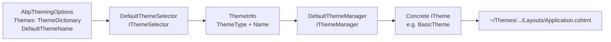

`Volo.Abp.AspNetCore.Mvc.UI` is the seed package that all other ABP MVC UI assemblies depend on. This page walks the folder layout under `framework/src/Volo.Abp.AspNetCore.Mvc.UI/Volo/Abp/AspNetCore/Mvc/UI/`, takes apart the theme resolution pipeline that decides which `.cshtml` layout an action will render, and inspects the base types — `AbpPage`, `AbpPageModel`, `AlertManager`, `PageLayout` — that every Razor page in an ABP solution inherits.

<Info>
The lower-level MVC primitives (controllers, model binding, validation, conventions) live in [`/aspnetcore/mvc`](/aspnetcore/mvc). This page only covers the UI surface that sits on top of those.
</Info>

## The module

`AbpAspNetCoreMvcUiModule` is small. Its job is to register the application part and the embedded views.

`framework/src/Volo.Abp.AspNetCore.Mvc.UI/Volo/Abp/AspNetCore/Mvc/UI/AbpAspNetCoreMvcUiModule.cs`:

```csharp
[DependsOn(typeof(AbpAspNetCoreMvcModule))]
[DependsOn(typeof(AbpUiNavigationModule))]
public class AbpAspNetCoreMvcUiModule : AbpModule
{
    public override void PreConfigureServices(ServiceConfigurationContext context)
    {
        PreConfigure<IMvcBuilder>(mvcBuilder =>
        {
            mvcBuilder.AddApplicationPartIfNotExists(typeof(AbpAspNetCoreMvcUiModule).Assembly);
        });
    }

    public override void ConfigureServices(ServiceConfigurationContext context)
    {
        Configure<AbpVirtualFileSystemOptions>(options =>
        {
            options.FileSets.AddEmbedded<AbpAspNetCoreMvcUiModule>();
        });
    }
}
```

The `AddApplicationPartIfNotExists` call ensures every embedded view component, view, and Razor page contained in this assembly is discovered by MVC. The `FileSets.AddEmbedded` call makes them resolvable via the virtual file system, which the `BundleManager` and the Razor view engine both consult.

## Folder map

| Subfolder | Purpose | Key types |
| --- | --- | --- |
| `Theming/` | Theme abstraction and selection | `ITheme`, `IThemeManager`, `DefaultThemeManager`, `IThemeSelector`, `DefaultThemeSelector`, `ThemeInfo`, `ThemeDictionary`, `AbpThemingOptions`, `StandardLayouts`, `ThemeExtensions`, `ThemeNameAttribute` |
| `Layout/` | Per-request layout state | `IPageLayout`, `PageLayout`, `ContentLayout`, `BreadCrumb`, `BreadCrumbItem` |
| `Alerts/` | Per-request alert messages | `IAlertManager`, `AlertManager`, `AlertList`, `AlertMessage`, `AlertType` |
| `RazorPages/` | Base classes for Razor Pages | `AbpPage`, `AbpPageModel`, `ServiceBasedPageModelActivatorProvider` |
| `Components/LayoutHook/` | Cross-cutting layout extension points | `LayoutHookViewComponent`, `ViewComponentHelperLayoutHookExtensions` |
| (root) | Module + global options | `AbpAspNetCoreMvcUiModule`, `AbpMvcUiOptions` |

## `AbpMvcUiOptions`

The package keeps almost no global options. `framework/src/Volo.Abp.AspNetCore.Mvc.UI/Volo/Abp/AspNetCore/Mvc/UI/AbpMvcUiOptions.cs` exposes only the login / logout convention:

```csharp
public class AbpMvcUiOptions
{
    /// <summary>Default value: "/Account/Login".</summary>
    public string LoginUrl { get; set; } = "/Account/Login";

    /// <summary>Default value: "/Account/Logout".</summary>
    public string LogoutUrl { get; set; } = "/Account/Logout";
}
```

These values are read by themes (for example, the basic theme's user menu component) so they don't hard-code account URLs.

## Theming subsystem

The theming abstraction is small enough to fit in one diagram. The pipeline is: an options class lists registered themes, a selector picks which one is "current" for a request, a manager resolves the concrete `ITheme` instance from DI, and an extension method asks the theme to map a `StandardLayouts` name onto a physical `.cshtml` path.



### `ITheme` and registration

`Theming/ITheme.cs` is one method:

```csharp
public interface ITheme
{
    string GetLayout(string name, bool fallbackToDefault = true);
}
```

Themes self-describe via `[ThemeName("Basic")]` (`Theming/ThemeNameAttribute.cs`), and they are registered through `ThemeDictionary` (`Theming/ThemeDictionary.cs`) inside `Configure<AbpThemingOptions>`:

```csharp
Configure<AbpThemingOptions>(options =>
{
    options.Themes.Add<BasicTheme>();
    options.DefaultThemeName = BasicTheme.Name;
});
```

`ThemeDictionary.Add<TTheme>()` constructs a `ThemeInfo` which reads the `[ThemeName]` attribute via the static `ThemeNameAttribute.GetName(themeType)`. See `modules/basic-theme/src/Volo.Abp.AspNetCore.Mvc.UI.Theme.Basic/BasicTheme.cs` for the reference implementation.

## Theme selection and resolution

The selector resolves the theme type once per request based on `AbpThemingOptions.DefaultThemeName`. The default implementation falls back to the first registered theme:

`Theming/DefaultThemeSelector.cs`:

```csharp
public virtual ThemeInfo GetCurrentThemeInfo()
{
    if (!Options.Themes.Any())
    {
        throw new AbpException($"No theme registered! Use {nameof(AbpThemingOptions)} to register themes.");
    }

    if (Options.DefaultThemeName == null)
    {
        return Options.Themes.Values.First();
    }

    var themeInfo = Options.Themes.Values.FirstOrDefault(t => t.Name == Options.DefaultThemeName);
    if (themeInfo == null)
    {
        throw new AbpException("Default theme is configured but it's not found in the registered themes: " + Options.DefaultThemeName);
    }

    return themeInfo;
}
```

The manager then caches the resolved theme on `HttpContext.Items` to avoid re-resolving when several Razor partials all ask for the current theme:

`Theming/DefaultThemeManager.cs`:

```csharp
private const string CurrentThemeHttpContextKey = "__AbpCurrentTheme";

protected virtual ITheme GetCurrentTheme()
{
    var preSelectedTheme = HttpContextAccessor.HttpContext!.Items[CurrentThemeHttpContextKey] as ITheme;

    if (preSelectedTheme == null)
    {
        preSelectedTheme = (ITheme)ServiceProvider.GetRequiredService(ThemeSelector.GetCurrentThemeInfo().ThemeType);
        HttpContextAccessor.HttpContext.Items[CurrentThemeHttpContextKey] = preSelectedTheme;
    }

    return preSelectedTheme;
}
```

The manager is registered as `IScopedDependency` so each HTTP request gets its own cached value.

### `StandardLayouts` and `ThemeExtensions`

`Theming/StandardLayouts.cs` lists the four well-known layout names:

```csharp
public static class StandardLayouts
{
    public const string Application = "Application";
    public const string Account = "Account";
    public const string Public = "Public";
    public const string Empty = "Empty";
}
```

The extensions in `Theming/ThemeExtensions.cs` are the idiomatic call site — Razor `_ViewStart.cshtml` files use them like this:

```csharp
public static string GetApplicationLayout(this ITheme theme, bool fallbackToDefault = true)
    => theme.GetLayout(StandardLayouts.Application, fallbackToDefault);

public static string GetAccountLayout(this ITheme theme, bool fallbackToDefault = true)
    => theme.GetLayout(StandardLayouts.Account, fallbackToDefault);

public static string GetPublicLayout(this ITheme theme, bool fallbackToDefault = true)
    => theme.GetLayout(StandardLayouts.Public, fallbackToDefault);

public static string GetEmptyLayout(this ITheme theme, bool fallbackToDefault = true)
    => theme.GetLayout(StandardLayouts.Empty, fallbackToDefault);
```

Themes implement `ITheme.GetLayout` with a `switch` statement, as shown by the basic theme:

```csharp
public virtual string GetLayout(string name, bool fallbackToDefault = true)
{
    switch (name)
    {
        case StandardLayouts.Application:
            return "~/Themes/Basic/Layouts/Application.cshtml";
        case StandardLayouts.Account:
            return "~/Themes/Basic/Layouts/Account.cshtml";
        case StandardLayouts.Empty:
            return "~/Themes/Basic/Layouts/Empty.cshtml";
        default:
            return fallbackToDefault ? "~/Themes/Basic/Layouts/Application.cshtml" : null;
    }
}
```

### `AbpThemingOptions` and `BaseUrl`

`Theming/AbpThemingOptions.cs` also exposes a `BaseUrl` property:

```csharp
public class AbpThemingOptions
{
    public ThemeDictionary Themes { get; }
    public string? DefaultThemeName { get; set; }

    /// <summary>
    /// If set, the <c>base</c> element will be added to the <c>head</c> element of the page.
    /// eg: <base href="/BaseUrl/" />
    /// </summary>
    public string? BaseUrl { get; set; }

    public AbpThemingOptions() { Themes = new ThemeDictionary(); }
}
```

A theme's `_Layout.cshtml` renders `<base href="@Theme.GetBaseUrlOrDefault()">` when this is set — used when the app is hosted under a virtual directory.

## Per-request page layout state

`Layout/PageLayout.cs` is a scoped service that themes inject into their layout components to render the current page's title and breadcrumb:

```csharp
public class PageLayout : IPageLayout, IScopedDependency
{
    public ContentLayout Content { get; }

    public PageLayout()
    {
        Content = new ContentLayout();
    }
}
```

`ContentLayout` carries the current page title plus a `BreadCrumb`. The breadcrumb class is straightforward:

`Layout/BreadCrumb.cs`:

```csharp
public class BreadCrumb
{
    public bool ShowHome { get; set; } = true;
    public bool ShowCurrent { get; set; } = true;
    public List<BreadCrumbItem> Items { get; }

    public BreadCrumb()
    {
        Items = new List<BreadCrumbItem>();
    }

    public void Add(string text, string? url = null, string? icon = null)
    {
        Items.Add(new BreadCrumbItem(text, url, icon));
    }
}
```

A Razor Page sets these in `OnGet`:

```csharp
public void OnGet()
{
    PageLayout.Content.Title = L["Customers"];
    PageLayout.Content.BreadCrumb.Add(L["Home"], "/");
    PageLayout.Content.BreadCrumb.Add(L["Customers"]);
}
```

## Alerts

The alert subsystem follows the same scoped-state pattern as `PageLayout`. `Alerts/AlertManager.cs`:

```csharp
public class AlertManager : IAlertManager, IScopedDependency
{
    public AlertList Alerts { get; }

    public AlertManager()
    {
        Alerts = new AlertList();
    }
}
```

`AlertList` extends `List<AlertMessage>` and offers typed shortcuts:

```csharp
public void Info(string text, string? title = null, bool dismissible = true)
    => Add(new AlertMessage(AlertType.Info, text, title, dismissible));

public void Warning(string text, string? title = null, bool dismissible = true)
    => Add(new AlertMessage(AlertType.Warning, text, title, dismissible));

public void Danger(string text, string? title = null, bool dismissible = true)
    => Add(new AlertMessage(AlertType.Danger, text, title, dismissible));

public void Success(string text, string? title = null, bool dismissible = true)
    => Add(new AlertMessage(AlertType.Success, text, title, dismissible));
```

The `AlertType` enum (`Alerts/AlertType.cs`) covers every Bootstrap variant: `Default`, `Primary`, `Secondary`, `Success`, `Danger`, `Warning`, `Info`, `Light`, `Dark`. Themes typically render them inside a `PageAlerts` view component (see the basic theme's `Themes/Basic/Components/PageAlerts/PageAlertsViewComponent.cs`).

## `AbpPage` and `AbpPageModel`

The Razor Pages base classes are in `RazorPages/`. `AbpPage` is intentionally thin:

```csharp
public abstract class AbpPage : Page
{
    [RazorInject]
    public ICurrentUser CurrentUser { get; set; } = default!;
}
```

`AbpPageModel` is where the bulk of the developer ergonomics live. It uses `IAbpLazyServiceProvider` so that the lazy-loaded services don't pay a DI cost unless touched:

```csharp
public abstract class AbpPageModel : PageModel
{
    public IAbpLazyServiceProvider LazyServiceProvider { get; set; } = default!;

    protected IClock Clock => LazyServiceProvider.LazyGetRequiredService<IClock>();
    protected AlertList Alerts => AlertManager.Alerts;
    protected IUnitOfWorkManager UnitOfWorkManager => LazyServiceProvider.LazyGetRequiredService<IUnitOfWorkManager>();
    protected IObjectMapper ObjectMapper => /* ... */;
    protected IGuidGenerator GuidGenerator => LazyServiceProvider.LazyGetService<IGuidGenerator>(SimpleGuidGenerator.Instance);
    protected ILoggerFactory LoggerFactory => LazyServiceProvider.LazyGetRequiredService<ILoggerFactory>();
    protected IStringLocalizerFactory StringLocalizerFactory => LazyServiceProvider.LazyGetRequiredService<IStringLocalizerFactory>();
    protected IStringLocalizer L { get { /* ... */ } }
    protected ICurrentUser CurrentUser => LazyServiceProvider.LazyGetRequiredService<ICurrentUser>();
    protected ICurrentTenant CurrentTenant => LazyServiceProvider.LazyGetRequiredService<ICurrentTenant>();
    protected ISettingProvider SettingProvider => LazyServiceProvider.LazyGetRequiredService<ISettingProvider>();
    protected IModelStateValidator ModelValidator => LazyServiceProvider.LazyGetRequiredService<IModelStateValidator>();
    protected IAuthorizationService AuthorizationService => LazyServiceProvider.LazyGetRequiredService<IAuthorizationService>();
    protected IAlertManager AlertManager => LazyServiceProvider.LazyGetRequiredService<IAlertManager>();
    protected IAppUrlProvider AppUrlProvider => LazyServiceProvider.LazyGetRequiredService<IAppUrlProvider>();
    // ...
}
```

`AbpPageModel` exposes the same surface as `AbpController` (covered in [`/aspnetcore/mvc`](/aspnetcore/mvc)) so navigation between MVC controllers and Razor Pages preserves muscle memory.

### Localization

`L` is created lazily by `CreateLocalizer()`. The recipe is:

```csharp
protected virtual IStringLocalizer CreateLocalizer()
{
    if (LocalizationResourceType != null)
    {
        return StringLocalizerFactory.Create(LocalizationResourceType);
    }

    var localizer = StringLocalizerFactory.CreateDefaultOrNull();
    if (localizer == null)
    {
        throw new AbpException($"Set {nameof(LocalizationResourceType)} or define the default localization resource type ...");
    }

    return localizer;
}
```

A page sets `LocalizationResourceType = typeof(MyResource)` in its constructor and then `L["MyKey"]` resolves through the shared `IStringLocalizerFactory`.

### Validation

`ValidateModel()` defers to `IModelStateValidator`:

```csharp
protected virtual void ValidateModel()
{
    ModelValidator?.Validate(ModelState);
}
```

The validator throws `AbpValidationException` if the model state has errors — that exception is then translated to a 400-level response by the `Volo.Abp.AspNetCore.ExceptionHandling` middleware.

### Safe redirects

`RedirectSafelyAsync` is the canonical "return after login / after action" helper. It refuses external URLs unless the `IAppUrlProvider` (from `Volo.Abp.UI.Navigation`) has been configured to allow them:

```csharp
protected virtual async Task<string> NormalizeReturnUrlAsync(string returnUrl)
{
    if (returnUrl.IsNullOrEmpty())
    {
        return await GetAppHomeUrlAsync();
    }

    if (Url.IsLocalUrl(returnUrl) || await AppUrlProvider.IsRedirectAllowedUrlAsync(returnUrl))
    {
        return returnUrl;
    }

    return await GetAppHomeUrlAsync();
}
```

This is the equivalent of the `RedirectSafely` controller helper covered in [`/aspnetcore/mvc`](/aspnetcore/mvc).

### Permissions

`CheckPolicyAsync` is the shortcut for "throw if not authorized":

```csharp
protected virtual Task CheckPolicyAsync(string policyName)
{
    return AuthorizationService.CheckAsync(policyName);
}
```

`AuthorizationService.CheckAsync` is an ABP extension that throws `AbpAuthorizationException` rather than returning a boolean.

## `ServiceBasedPageModelActivatorProvider`

To make `LazyServiceProvider` and the lazy-loaded properties on `AbpPageModel` work, ABP swaps the default page-model activator with one that resolves models from DI. `RazorPages/ServiceBasedPageModelActivatorProvider.cs` is registered by the module's MVC setup and ensures every `PageModel` is constructed by the IoC container, which then triggers the property injection used by `AbpPageModel`.

## Layout hooks

`Components/LayoutHook/LayoutHookViewComponent.cs` powers a cross-cutting extension point — modules can attach view components to named slots in the layout. `AbpLayoutHookOptions` (in the `Volo.Abp.Ui.LayoutHooks` namespace) keeps a `Hooks` dictionary keyed by hook name. The view component filters by layout name:

```csharp
public virtual IViewComponentResult Invoke(string name, string? layout)
{
    var hooks = Options.Hooks.GetOrDefault(name)?
        .Where(x => IsViewComponent(x) && (string.IsNullOrWhiteSpace(x.Layout) || x.Layout == layout))
        .ToArray() ?? Array.Empty<LayoutHookInfo>();

    return View(
        "~/Volo/Abp/AspNetCore/Mvc/UI/Components/LayoutHook/Default.cshtml",
        new LayoutHookViewModel(hooks, layout)
    );
}
```

A theme calls it from layout markup like `<vc:layout-hook name="Head.Last" layout="@StandardLayouts.Application" />` so any module can append `<link>` or `<script>` markup without modifying the theme. The companion extension class `ViewComponentHelperLayoutHookExtensions` makes the imperative version available from any view.

## Composition with other UI packages

| Adds | Reads | Pattern |
| --- | --- | --- |
| `AbpAspNetCoreMvcUiBootstrapModule` | depends on this module | Adds Bootstrap tag helpers (see [Bootstrap tag helpers](./bootstrap-tag-helpers)) |
| `AbpAspNetCoreMvcUiBundlingModule` | reads `IThemeManager` indirectly via `BundleManager` | Provides `abp-script-bundle` / `abp-style-bundle` ([Bundling](./bundling)) |
| `AbpAspNetCoreMvcUiThemeSharedModule` | reads `IThemeManager` for `ToolbarManager` | Provides toolbars, page toolbars, error pages ([Theme shared](./theme-shared)) |
| `AbpAspNetCoreMvcUiMultiTenancyModule` | reads `AbpMvcUiOptions.LoginUrl` indirectly | Provides tenant switch modal ([Multi-tenancy UI](./multi-tenancy-ui)) |
| Basic theme | implements `ITheme` | See [`/modules/basic-theme`](/modules/basic-theme) |

## Quick reference

<AccordionGroup>
  <Accordion title="Change the login URL">
    ```csharp
    Configure<AbpMvcUiOptions>(options =>
    {
        options.LoginUrl = "/auth/sign-in";
        options.LogoutUrl = "/auth/sign-out";
    });
    ```
  </Accordion>
  <Accordion title="Register a custom theme">
    ```csharp
    Configure<AbpThemingOptions>(options =>
    {
        options.Themes.Add<MyTheme>();
        options.DefaultThemeName = MyTheme.Name;
        options.BaseUrl = "/admin/";
    });
    ```
    Make sure `MyTheme` carries `[ThemeName("MyTheme")]` so `ThemeInfo.Name` resolves correctly.
  </Accordion>
  <Accordion title="Use alerts from a page">
    ```csharp
    public class IndexModel : AbpPageModel
    {
        public IActionResult OnPostSave()
        {
            Alerts.Success(L["SavedSuccessfully"]);
            return RedirectToPage();
        }
    }
    ```
  </Accordion>
  <Accordion title="Get the current theme inside a view">
    ```cshtml
    @inject IThemeManager ThemeManager
    @{
        Layout = ThemeManager.CurrentTheme.GetApplicationLayout();
    }
    ```
    This is what `Pages/_ViewStart.cshtml` from `Volo.Abp.AspNetCore.Mvc.UI.Theme.Shared` does.
  </Accordion>
</AccordionGroup>
