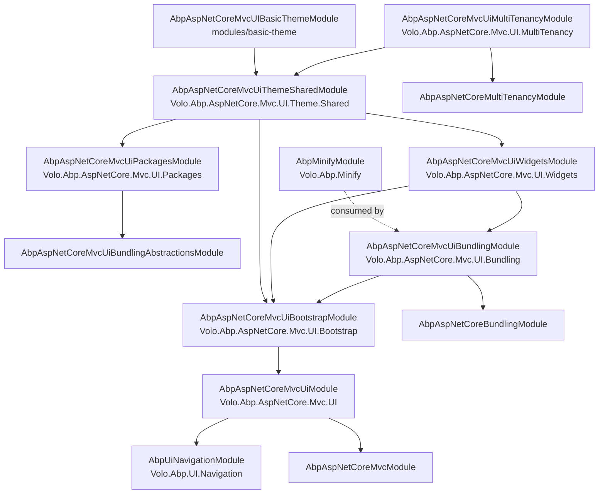
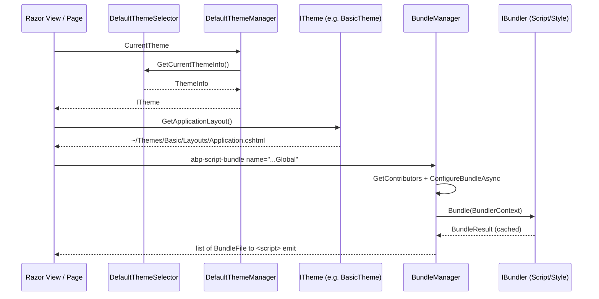

The ABP Framework ships a layered stack of NuGet packages that bring server-rendered Razor Pages / MVC views to feature parity with the rest of the framework's modular conventions. This overview page is the map for the remaining eight deep dives in this section: it identifies every assembly under `framework/src/Volo.Abp.AspNetCore.Mvc.UI*` (plus `Volo.Abp.UI.Navigation` and `Volo.Abp.Minify`), explains how they depend on each other, and points at the seed types each subsequent page expands on.

## What the stack does

The MVC UI stack solves four problems that every ABP application running on top of `Volo.Abp.AspNetCore.Mvc` will hit: which Razor layout to render, which CSS / JS to ship to the browser, how to compose menus and widgets contributed by independent modules, and how to render Bootstrap-flavoured markup without authoring raw HTML. The entry point for every other concern is `AbpAspNetCoreMvcUiModule` in `framework/src/Volo.Abp.AspNetCore.Mvc.UI/Volo/Abp/AspNetCore/Mvc/UI/AbpAspNetCoreMvcUiModule.cs`, which depends on `AbpAspNetCoreMvcModule` and `AbpUiNavigationModule` and registers the embedded `Pages/Shared` files into the virtual file system.

<Info>
For the underlying request pipeline, controllers, model binding and convention surface — see [`/aspnetcore/mvc`](/aspnetcore/mvc). The MVC UI stack assumes that page is read first.
</Info>

## Package hierarchy

The diagram below tracks the `DependsOn` attributes wired across these modules. Each box is one csproj under `framework/src/`.



The dotted edge is a runtime dependency: `ScriptBundler` and `StyleBundler` in `Volo.Abp.AspNetCore.Mvc.UI.Bundling` take `IJavascriptMinifier` and `ICssMinifier` (defined in `Volo.Abp.Minify`) through constructor injection.

## Package responsibilities

| Package | Folder | Primary entry type | Covered in |
| --- | --- | --- | --- |
| `Volo.Abp.AspNetCore.Mvc.UI` | `framework/src/Volo.Abp.AspNetCore.Mvc.UI` | `AbpAspNetCoreMvcUiModule`, `ITheme`, `AbpPageModel` | [MVC UI core](./mvc-ui) |
| `Volo.Abp.AspNetCore.Mvc.UI.Bootstrap` | `framework/src/Volo.Abp.AspNetCore.Mvc.UI.Bootstrap` | `AbpTagHelper<,>`, all `Abp*TagHelper` classes | [Bootstrap tag helpers](./bootstrap-tag-helpers) |
| `Volo.Abp.AspNetCore.Mvc.UI.Bundling.Abstractions` | `framework/src/Volo.Abp.AspNetCore.Mvc.UI.Bundling.Abstractions` | `BundleContributor`, `BundleConfiguration`, `AbpBundlingOptions` | [Bundling](./bundling) |
| `Volo.Abp.AspNetCore.Mvc.UI.Bundling` | `framework/src/Volo.Abp.AspNetCore.Mvc.UI.Bundling` | `BundleManager`, `ScriptBundler`, `StyleBundler`, `AbpScriptBundleTagHelper`, `AbpStyleBundleTagHelper` | [Bundling](./bundling) |
| `Volo.Abp.AspNetCore.Mvc.UI.Packages` | `framework/src/Volo.Abp.AspNetCore.Mvc.UI.Packages` | `JQueryScriptContributor`, `BootstrapScriptContributor`, ... | [Bundling](./bundling) |
| `Volo.Abp.AspNetCore.Mvc.UI.Theme.Shared` | `framework/src/Volo.Abp.AspNetCore.Mvc.UI.Theme.Shared` | `StandardBundles`, `IToolbarManager`, `IPageToolbarManager`, `SharedThemeGlobalScriptContributor` | [Theme shared](./theme-shared) |
| `Volo.Abp.AspNetCore.Mvc.UI.Widgets` | `framework/src/Volo.Abp.AspNetCore.Mvc.UI.Widgets` | `WidgetAttribute`, `WidgetDefinition`, `IWidgetManager`, `AbpViewComponentHelper` | [Widgets](./widgets) |
| `Volo.Abp.UI.Navigation` | `framework/src/Volo.Abp.UI.Navigation` | `IMenuManager`, `ApplicationMenu`, `ApplicationMenuItem`, `IMenuContributor` | [UI navigation](./ui-navigation) |
| `Volo.Abp.Minify` | `framework/src/Volo.Abp.Minify` | `IJavascriptMinifier`, `ICssMinifier`, `NUglifyJavascriptMinifier` | [Minify](./minify) |
| `Volo.Abp.AspNetCore.Mvc.UI.MultiTenancy` | `framework/src/Volo.Abp.AspNetCore.Mvc.UI.MultiTenancy` | `TenantSwitchModalModel`, `AbpTenantController`, `tenant-switch.js` | [Multi-tenancy UI](./multi-tenancy-ui) |

## Module loading order

When an ABP MVC host boots, the modules below initialise in a fixed order driven by their `[DependsOn]` graph. Knowing the order matters for two reasons: it determines which module can `Configure<AbpBundlingOptions>` against a bundle name another module declared, and it tells you which module's virtual file set wins when two embed the same physical path.

| Order | Module | What it adds |
| --- | --- | --- |
| 1 | `AbpAspNetCoreMvcModule` | MVC pipeline, conventions, model binding |
| 2 | `AbpUiNavigationModule` | `IMenuManager`, `AppUrlProvider`, default `Administration` item |
| 3 | `AbpAspNetCoreMvcUiModule` | `ITheme`, `AbpPageModel`, `AbpMvcUiOptions` |
| 4 | `AbpAspNetCoreMvcUiBootstrapModule` | Every `Abp*TagHelper` |
| 5 | `AbpAspNetCoreMvcUiPackagesModule` | One `BundleContributor` per third-party library |
| 6 | `AbpAspNetCoreMvcUiBundlingModule` | `BundleManager`, bundlers, bundle tag helpers |
| 7 | `AbpAspNetCoreMvcUiWidgetsModule` | Widget discovery, `AbpViewComponentHelper` swap |
| 8 | `AbpAspNetCoreMvcUiThemeSharedModule` | Toolbars, page toolbars, error pages, `StandardBundles.Global` |
| 9 | `AbpAspNetCoreMvcUiMultiTenancyModule` | Tenant-switch modal, appends `tenant-switch.js` to the global script bundle |
| 10 | Application module | Wires custom themes, menus, widgets |

The two main interaction surfaces sit below.

## The two main interaction surfaces

There are two surfaces a developer touches in day-to-day work, and the rest of the documentation maps back to them.

### Surface 1 — Razor tag helpers

The Bootstrap package exposes a forest of `Abp*TagHelper` types (declared in `framework/src/Volo.Abp.AspNetCore.Mvc.UI.Bootstrap/TagHelpers/`) that participate in Razor compilation. They all derive from `AbpTagHelper<TTagHelper, TService>` in `TagHelpers/AbpTagHelper.cs`:

```csharp
public abstract class AbpTagHelper<TTagHelper, TService> : AbpTagHelper
    where TTagHelper : AbpTagHelper<TTagHelper, TService>
    where TService : class, IAbpTagHelperService<TTagHelper>
{
    protected TService Service { get; }
    public override int Order => Service.Order;
    // ...
}
```

The separation between a thin tag helper (carrying attributes) and a stateless `Service` (`ITransientDependency`, registered via DI) is the recipe ABP uses everywhere. The bundling package follows the same convention with `AbpScriptBundleTagHelper`, `AbpStyleBundleTagHelper`, `AbpScriptTagHelper`, and `AbpStyleTagHelper` declared in `framework/src/Volo.Abp.AspNetCore.Mvc.UI.Bundling/Volo/Abp/AspNetCore/Mvc/UI/Bundling/TagHelpers/`.

### Surface 2 — Options-pattern configuration

Every cross-cutting concern is configured via an options class registered through `Configure<TOptions>(...)` inside the module's `ConfigureServices`:

| Options class | Purpose | File |
| --- | --- | --- |
| `AbpMvcUiOptions` | `LoginUrl`, `LogoutUrl` defaults | `Volo.Abp.AspNetCore.Mvc.UI/.../AbpMvcUiOptions.cs` |
| `AbpThemingOptions` | Registered themes, default theme name, `BaseUrl` | `Volo.Abp.AspNetCore.Mvc.UI/.../Theming/AbpThemingOptions.cs` |
| `AbpBundlingOptions` | `ScriptBundles`, `StyleBundles`, `BundlingMode`, defer/preload flags | `Volo.Abp.AspNetCore.Mvc.UI.Bundling.Abstractions/.../AbpBundlingOptions.cs` |
| `AbpBundleContributorOptions` | Per-contributor extension list (`AllExtensions`) | `Volo.Abp.AspNetCore.Mvc.UI.Bundling.Abstractions/.../AbpBundleContributorOptions.cs` |
| `AbpWidgetOptions` | Registered `WidgetDefinition` collection | `Volo.Abp.AspNetCore.Mvc.UI.Widgets/.../AbpWidgetOptions.cs` |
| `AbpNavigationOptions` | `MenuContributors`, `MainMenuNames` | `Volo.Abp.UI.Navigation/.../AbpNavigationOptions.cs` |
| `AbpToolbarOptions` | Theme toolbar contributors | `Volo.Abp.AspNetCore.Mvc.UI.Theme.Shared/Toolbars/AbpToolbarOptions.cs` |
| `AbpPageToolbarOptions` | Per-page toolbar `PageToolbarDictionary` | `Volo.Abp.AspNetCore.Mvc.UI.Theme.Shared/PageToolbars/AbpPageToolbarOptions.cs` |

## Lifecycle: from request to rendered page

The flow of an MVC UI request, from layout selection to bundle emission, runs through three managers. All three are concrete (with virtual members) so themes and modules can subclass them.



`DefaultThemeManager` (`framework/src/Volo.Abp.AspNetCore.Mvc.UI/Volo/Abp/AspNetCore/Mvc/UI/Theming/DefaultThemeManager.cs`) caches the resolved theme in `HttpContext.Items["__AbpCurrentTheme"]` so a single request never reselects. `BundleManager` (`framework/src/Volo.Abp.AspNetCore.Mvc.UI.Bundling/Volo/Abp/AspNetCore/Mvc/UI/Bundling/BundleManager.cs`) extends `BundleManagerBase` and uses `IWebHostEnvironment.IsDevelopment()` to decide whether `BundlingMode.Auto` resolves to bundling/minification — covered in detail on the [bundling page](./bundling).

## The `StandardBundles` and `StandardLayouts` contracts

Two constant classes are the glue between modules that contribute to bundles and the theme that consumes them.

`framework/src/Volo.Abp.AspNetCore.Mvc.UI.Theme.Shared/Bundling/StandardBundles.cs`:

```csharp
public class StandardBundles
{
    public static class Styles { public static string Global = "Global"; }
    public static class Scripts { public static string Global = "Global"; }
}
```

`framework/src/Volo.Abp.AspNetCore.Mvc.UI/Volo/Abp/AspNetCore/Mvc/UI/Theming/StandardLayouts.cs`:

```csharp
public static class StandardLayouts
{
    public const string Application = "Application";
    public const string Account = "Account";
    public const string Public = "Public";
    public const string Empty = "Empty";
}
```

A theme implementation maps each `StandardLayouts` constant onto a physical `.cshtml`. The reference `BasicTheme` lives at `modules/basic-theme/src/Volo.Abp.AspNetCore.Mvc.UI.Theme.Basic/BasicTheme.cs` and is decorated with `[ThemeName("Basic")]` — the bridge that `ThemeInfo.Name` reads in `Theming/ThemeNameAttribute.cs`. See [`/modules/basic-theme`](/modules/basic-theme) for the full theme walkthrough.

## How modules contribute UI

Every non-trivial ABP module that wants to ship a Razor page, a widget, a menu item, or a tag helper plugs into the surfaces above. The conventions are:

<Steps>
  <Step title="Reference the relevant module">
    Add `[DependsOn(typeof(AbpAspNetCoreMvcUiThemeSharedModule))]` (or a narrower module) to the module class.
  </Step>
  <Step title="Register an embedded file set">
    Call `options.FileSets.AddEmbedded<TModule>()` inside `Configure<AbpVirtualFileSystemOptions>` — the pattern used by every `AbpAspNetCoreMvcUi*Module` source file.
  </Step>
  <Step title="Configure bundles">
    Call `options.ScriptBundles.Get(StandardBundles.Scripts.Global).AddFiles(...)` or add a `BundleContributor` subclass.
  </Step>
  <Step title="Configure menus">
    Add an `IMenuContributor` to `AbpNavigationOptions.MenuContributors`.
  </Step>
  <Step title="Author widgets">
    Decorate a `ViewComponent` with `[Widget(...)]` — `AbpAspNetCoreMvcUiWidgetsModule.AutoAddWidgets` discovers them via `services.OnRegistered`.
  </Step>
</Steps>

## Touchpoints with other layers

The MVC UI stack is intentionally narrow: it consumes lots of other framework primitives but exposes very few of its own. The most important boundaries are:

| Boundary | Direction | Concrete example |
| --- | --- | --- |
| Virtual file system | consumes | `options.FileSets.AddEmbedded<AbpAspNetCoreMvcUiModule>()` in `AbpAspNetCoreMvcUiModule` |
| Authorization | consumes | `WidgetManager.IsGrantedAsync` calls `IAuthorizationService.AuthorizeAsync(policy)` |
| Localization | consumes | `MenuConfigurationContext.GetLocalizer<T>()` |
| Multi-tenancy | consumes | `TenantSwitchModalModel` uses `ITenantStore`, `ITenantNormalizer`, `AbpMultiTenancyCookieHelper` — see [`/multi-tenancy/aspnetcore-multitenancy`](/multi-tenancy/aspnetcore-multitenancy) |
| Settings | consumes (via `AbpPageModel`) | `protected ISettingProvider SettingProvider` |

For the Blazor counterpart of these concerns (which uses many of the same options classes but a completely different rendering pipeline) refer to [`/blazor/overview`](/blazor/overview).

## Cross-cutting state — the per-request scoped services

A pattern that recurs across every page in this section is the **per-request scoped state object**. Each of the four cases below is a `IScopedDependency` populated during a request and consumed by the layout at render time.

| Scoped service | Defined in | Populated by | Read by |
| --- | --- | --- | --- |
| `IPageLayout` (`PageLayout`) | `Volo.Abp.AspNetCore.Mvc.UI/Layout/PageLayout.cs` | Razor page in `OnGet` | Theme layout (title + breadcrumb) |
| `IAlertManager` (`AlertManager`) | `Volo.Abp.AspNetCore.Mvc.UI/Alerts/AlertManager.cs` | Razor page actions | `PageAlerts` view component |
| `IPageWidgetManager` (`PageWidgetManager`) | `Volo.Abp.AspNetCore.Mvc.UI.Widgets/PageWidgetManager.cs` | `AbpViewComponentHelper` whenever a widget renders | `WidgetScripts` / `WidgetStyles` view components |
| `IWebRequestResources` (`WebRequestResources`) | `Volo.Abp.AspNetCore.Mvc.UI.Bundling/Resources/WebRequestResources.cs` | `BundleManager` after building each bundle | Tag helpers to dedupe `<script>`/`<link>` emission |

Two of those services hang their state on `HttpContext.Items` (`__AbpCurrentTheme`, `__AbpCurrentWidgets`). The pattern is consistent because Razor partials and view components run in unpredictable order, and the bottom-of-page emitters need a stable read of "what was already done".

## A request, end to end

A typical authenticated request that renders a page with a widget and a bundle looks like:

```mermaid
sequenceDiagram
    participant Req as HTTP request
    participant CT as ICurrentTenant
    participant Page as AbpPageModel.OnGetAsync
    participant Theme as Theme layout .cshtml
    participant Widget as ChartViewComponent (with [Widget])
    participant Bundle as &lt;abp-script-bundle&gt;

    Req->>CT: Resolve tenant from cookie (multi-tenancy module)
    Req->>Page: Activate page model from DI
    Page->>Page: Populate PageLayout + Alerts
    Page-->>Theme: View result
    Theme->>Theme: Pick layout via ThemeManager.CurrentTheme.GetApplicationLayout()
    Theme->>Widget: Component.InvokeAsync("Chart")
    Widget-->>Theme: HTML inside &lt;div class="abp-widget-wrapper"&gt;
    Theme->>Bundle: Render &lt;abp-script-bundle name="Global"&gt;
    Bundle-->>Theme: &lt;script&gt; tags pointing to /__bundles/Global.&lt;md5&gt;.js
    Theme-->>Req: Final HTML
```

Each arrow above is covered by one of the deep-dive pages — the diagram is the table of contents in pictorial form.

## Read in order

The eight remaining pages in this section are designed to be read top-to-bottom but each is self-contained:

<CardGroup cols={2}>
  <Card title="MVC UI core" href="./mvc-ui">
    `AbpAspNetCoreMvcUiModule`, layouts, theming, `AbpPageModel`, alerts.
  </Card>
  <Card title="Bootstrap tag helpers" href="./bootstrap-tag-helpers">
    Every `Abp*TagHelper` shipped in the Bootstrap package.
  </Card>
  <Card title="Bundling" href="./bundling">
    `BundleContributor`, `BundleManager`, `abp-script-bundle`, `abp-style-bundle`.
  </Card>
  <Card title="Theme shared" href="./theme-shared">
    Toolbars, page toolbars, error pages, standard bundles, shared components.
  </Card>
  <Card title="Widgets" href="./widgets">
    `[Widget]`, `WidgetDefinition`, `AbpViewComponentHelper`, `IPageWidgetManager`.
  </Card>
  <Card title="UI navigation" href="./ui-navigation">
    `IMenuManager`, menu contributors, `StandardMenus`, app URLs.
  </Card>
  <Card title="Minify" href="./minify">
    `IJavascriptMinifier`, `ICssMinifier`, `NUglifyMinifierBase`.
  </Card>
  <Card title="Multi-tenancy UI" href="./multi-tenancy-ui">
    Tenant switch modal, `AbpTenantController`, the `abp.multiTenancy` JS.
  </Card>
</CardGroup>
