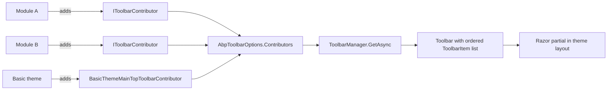
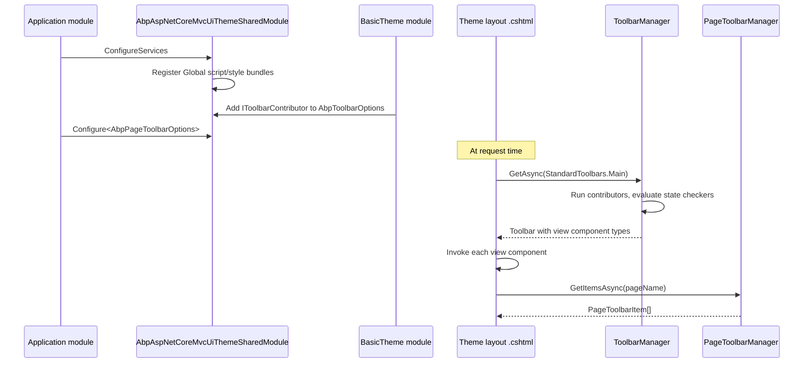

`Volo.Abp.AspNetCore.Mvc.UI.Theme.Shared` is the cross-theme support module. Themes such as the basic theme, LeptonX, and any custom theme depend on it for the things that should look the same regardless of the chosen skin: which global script and style bundles exist, how toolbars are composed, how per-page toolbars are extended by modules, how error pages are rendered, and which shared view components sit in `Pages/Shared/Components`. This page walks the package's folder structure under `framework/src/Volo.Abp.AspNetCore.Mvc.UI.Theme.Shared/` and shows how the basic theme consumes each surface.

<Info>
The package companion `Volo.Abp.AspNetCore.Mvc.UI.Theme.Shared.Demo` is a tiny consumer app used by ABP CI to smoke-test the shared theme — it is not a runtime dependency.
</Info>

## Module wiring

`framework/src/Volo.Abp.AspNetCore.Mvc.UI.Theme.Shared/AbpAspNetCoreMvcUiThemeSharedModule.cs`:

```csharp
[DependsOn(
    typeof(AbpAspNetCoreMvcUiBootstrapModule),
    typeof(AbpAspNetCoreMvcUiPackagesModule),
    typeof(AbpAspNetCoreMvcUiWidgetsModule)
)]
public class AbpAspNetCoreMvcUiThemeSharedModule : AbpModule
{
    public override void PreConfigureServices(ServiceConfigurationContext context)
    {
        PreConfigure<IMvcBuilder>(mvcBuilder =>
        {
            mvcBuilder.AddApplicationPartIfNotExists(typeof(AbpAspNetCoreMvcUiThemeSharedModule).Assembly);
        });
    }

    public override void ConfigureServices(ServiceConfigurationContext context)
    {
        Configure<AbpVirtualFileSystemOptions>(options =>
        {
            options.FileSets.AddEmbedded<AbpAspNetCoreMvcUiThemeSharedModule>("Volo.Abp.AspNetCore.Mvc.UI.Theme.Shared");
        });

        Configure<AbpBundlingOptions>(options =>
        {
            options.StyleBundles
                .Add(StandardBundles.Styles.Global,
                    bundle => { bundle.AddContributors(typeof(SharedThemeGlobalStyleContributor)); });

            options.ScriptBundles
                .Add(StandardBundles.Scripts.Global,
                    bundle => bundle.AddContributors(typeof(SharedThemeGlobalScriptContributor)));
        });
    }
}
```

Two things happen here: every theme that depends on this module gets the global script/style bundles called `"Global"`, and the embedded view components / Razor partials become available through the virtual file system.

## Folder map

| Folder | Purpose | Key types |
| --- | --- | --- |
| `Bundling/` | Global bundle name constants and contributors | `StandardBundles`, `SharedThemeGlobalScriptContributor`, `SharedThemeGlobalStyleContributor` |
| `Toolbars/` | Theme-level toolbar definitions | `Toolbar`, `ToolbarItem`, `IToolbarManager`, `IToolbarContributor`, `StandardToolbars`, `AbpToolbarOptions` |
| `PageToolbars/` | Per-page toolbar definitions | `PageToolbar`, `PageToolbarItem`, `IPageToolbarManager`, `PageToolbarContributor`, `SimplePageToolbarContributor`, `AbpPageToolbarOptions` |
| `Controllers/` | Error controller | `ErrorController` |
| `Views/Error/` | Default error view | `Default.cshtml`, `AbpErrorViewModel` |
| `Pages/Shared/Components/` | Reusable view components for themes | `AbpApplicationPath`, `AbpPageSearchBox`, `AbpPageToolbar` |
| `Pages/Shared/Components/AbpPageToolbar/Button/` | Button rendering for page toolbars | `AbpPageToolbarButtonViewComponent` |
| (root) | Module + error page options | `AbpAspNetCoreMvcUiThemeSharedModule`, `AbpErrorPageOptions`, `AbpApplicationBuilderErrorPageExtensions` |

## `StandardBundles`

`Bundling/StandardBundles.cs`:

```csharp
public class StandardBundles
{
    public static class Styles
    {
        public static string Global = "Global";
    }

    public static class Scripts
    {
        public static string Global = "Global";
    }
}
```

These constants are the bundle names every theme registers and every module appends into. They are the entry point for `<abp-script-bundle name="@StandardBundles.Scripts.Global" />` in theme layouts — see [Bundling](./bundling) for the lifecycle of those bundles.

### Global script contributor

`Bundling/SharedThemeGlobalScriptContributor.cs`:

```csharp
[DependsOn(
    typeof(JQueryScriptContributor),
    typeof(BootstrapScriptContributor),
    typeof(LodashScriptContributor),
    typeof(JQueryValidationUnobtrusiveScriptContributor),
    typeof(Select2ScriptContributor),
    typeof(DatatablesNetBs5ScriptContributor),
    typeof(Sweetalert2ScriptContributor),
    typeof(MalihuCustomScrollbarPluginScriptBundleContributor),
    typeof(LuxonScriptContributor),
    typeof(TimeagoScriptContributor),
    typeof(BootstrapDatepickerScriptContributor),
    typeof(BootstrapDaterangepickerScriptContributor)
)]
public class SharedThemeGlobalScriptContributor : BundleContributor
{
    public override void ConfigureBundle(BundleConfigurationContext context)
    {
        context.Files.AddRange(new BundleFile[]
        {
            "/libs/abp/aspnetcore-mvc-ui-theme-shared/ui-extensions.js",
            "/libs/abp/aspnetcore-mvc-ui-theme-shared/jquery/jquery-extensions.js",
            "/libs/abp/aspnetcore-mvc-ui-theme-shared/jquery-form/jquery-form-extensions.js",
            "/libs/abp/aspnetcore-mvc-ui-theme-shared/jquery/widget-manager.js",
            "/libs/abp/aspnetcore-mvc-ui-theme-shared/bootstrap/dom-event-handlers.js",
            "/libs/abp/aspnetcore-mvc-ui-theme-shared/bootstrap/modal-manager.js",
            "/libs/abp/aspnetcore-mvc-ui-theme-shared/datatables/datatables-extensions.js",
            "/libs/abp/aspnetcore-mvc-ui-theme-shared/sweetalert2/abp-sweetalert2.js",
            "/libs/abp/aspnetcore-mvc-ui-theme-shared/toast/abp-toast.js",
            "/libs/abp/aspnetcore-mvc-ui-theme-shared/date-range-picker/date-range-picker-extensions.js",
            "/libs/abp/aspnetcore-mvc-ui-theme-shared/authentication-state/authentication-state-listener.js"
        });
    }
}
```

Each `[DependsOn]` ensures the upstream contributor's files are inserted earlier. The own files are the ABP-authored JS shims that adapt jQuery, Bootstrap, DataTables, SweetAlert2, etc. to the ABP conventions exposed in `abp.*` JavaScript globals.

### Global style contributor

`Bundling/SharedThemeGlobalStyleContributor.cs`:

```csharp
[DependsOn(
    typeof(CoreStyleContributor),
    typeof(BootstrapStyleContributor),
    typeof(FontAwesomeStyleContributor),
    typeof(Select2StyleContributor),
    typeof(MalihuCustomScrollbarPluginStyleBundleContributor),
    typeof(DatatablesNetBs5StyleContributor),
    typeof(BootstrapDatepickerStyleContributor),
    typeof(BootstrapDaterangepickerStyleContributor)
)]
public class SharedThemeGlobalStyleContributor : BundleContributor
{
    public override void ConfigureBundle(BundleConfigurationContext context)
    {
        context.Files.AddRange(new BundleFile[]
        {
            "/libs/abp/aspnetcore-mvc-ui-theme-shared/datatables/datatables-styles.css",
            "/libs/abp/aspnetcore-mvc-ui-theme-shared/date-range-picker/date-range-picker-styles.css",
            "/libs/abp/aspnetcore-mvc-ui-theme-shared/toast/abp-toast.css",
        });
    }
}
```

## Toolbars

A "toolbar" here means the strip of icons / dropdowns at the top of an application layout — the language switcher, the user menu, notifications, etc. Toolbars are composed from view components contributed by modules.



### `Toolbar`, `ToolbarItem`

`Toolbars/Toolbar.cs`:

```csharp
public class Toolbar
{
    public string Name { get; }
    public List<ToolbarItem> Items { get; }

    public Toolbar([NotNull] string name)
    {
        Name = Check.NotNull(name, nameof(name));
        Items = new List<ToolbarItem>();
    }
}
```

`Toolbars/ToolbarItem.cs`:

```csharp
public class ToolbarItem : IHasSimpleStateCheckers<ToolbarItem>
{
    public Type ComponentType { get; set; }
    public int Order { get; set; }
    public List<ISimpleStateChecker<ToolbarItem>> StateCheckers { get; }

    public ToolbarItem([NotNull] Type componentType, int order = 0, string? requiredPermissionName = null)
    {
        Order = order;
        ComponentType = Check.NotNull(componentType, nameof(componentType));
        StateCheckers = new List<ISimpleStateChecker<ToolbarItem>>();
    }
}
```

Each item is *a view component type* — the theme renders it via the standard view component infrastructure. State checkers (mostly permission checks) are evaluated by the manager so an item disappears for users who lack the policy.

### `StandardToolbars`

`Toolbars/StandardToolbars.cs`:

```csharp
public static class StandardToolbars
{
    public const string Main = "Main";
}
```

There is currently one standard toolbar name. Themes are free to add others, but `Main` is the contract every existing toolbar contributor targets.

### `IToolbarContributor`

`Toolbars/IToolbarContributor.cs`:

```csharp
public interface IToolbarContributor
{
    Task ConfigureToolbarAsync(IToolbarConfigurationContext context);
}
```

Contributors get an `IToolbarConfigurationContext`:

```csharp
public interface IToolbarConfigurationContext : IServiceProviderAccessor
{
    ITheme Theme { get; }
    Toolbar Toolbar { get; }
    IAuthorizationService AuthorizationService { get; }
    IStringLocalizerFactory StringLocalizerFactory { get; }

    Task<bool> IsGrantedAsync(string policyName);
    IStringLocalizer? GetDefaultLocalizer();
    IStringLocalizer GetLocalizer<T>();
    IStringLocalizer GetLocalizer(Type resourceType);
}
```

Note that the context exposes the current `ITheme` — a contributor can adapt what it adds based on theme (e.g. only add a sidebar toggle for the basic theme).

### `ToolbarManager`

`Toolbars/ToolbarManager.cs` is the runtime that walks contributors and evaluates state checkers:

```csharp
public async Task<Toolbar> GetAsync(string name)
{
    var toolbar = new Toolbar(name);

    using (var scope = ServiceProvider.CreateScope())
    {
        using (RequirePermissionsSimpleBatchStateChecker<ToolbarItem>.Use(new RequirePermissionsSimpleBatchStateChecker<ToolbarItem>()))
        {
            var context = new ToolbarConfigurationContext(ThemeManager.CurrentTheme, toolbar, scope.ServiceProvider);

            foreach (var contributor in Options.Contributors)
            {
                await contributor.ConfigureToolbarAsync(context);
            }

            await CheckPermissionsAsync(scope.ServiceProvider, toolbar);
        }
    }

    return toolbar;
}
```

`CheckPermissionsAsync` removes items whose `StateCheckers` returned false:

```csharp
protected virtual async Task CheckPermissionsAsync(IServiceProvider serviceProvider, Toolbar toolbar)
{
    foreach (var item in toolbar.Items.Where(x => !x.RequiredPermissionName.IsNullOrWhiteSpace()))
    {
        item.RequirePermissions(item.RequiredPermissionName!);
    }

    var checkPermissionsToolbarItems = toolbar.Items.Where(x => x.StateCheckers.Any()).ToArray();
    if (checkPermissionsToolbarItems.Any())
    {
        var result = await SimpleStateCheckerManager.IsEnabledAsync(checkPermissionsToolbarItems);
        // remove items where result[item] == false
    }
}
```

### Basic theme example

The reference contributor lives in the basic theme at `modules/basic-theme/src/Volo.Abp.AspNetCore.Mvc.UI.Theme.Basic/Toolbars/BasicThemeMainTopToolbarContributor.cs`. It adds `LanguageSwitchViewComponent` and `UserMenuViewComponent` to the `Main` toolbar — both view components ship from the basic theme assembly.

## Page toolbars

Page toolbars are the buttons rendered at the top of each Razor page — `New customer`, `Export`, `Import`. They are extensible per page so a downstream module can add its own button to a page it doesn't own.

```mermaid
flowchart LR
    Module[Application/module] -->|Configure&lt;TPage&gt;<br/>(pt =&gt; pt.AddComponent&lt;X&gt;())| Opt[AbpPageToolbarOptions.Toolbars]
    Opt --> Mgr[PageToolbarManager.GetItemsAsync pageName]
    Mgr --> Walk[Walk PageToolbar.Contributors]
    Walk --> Items[PageToolbarItem list]
    Items --> VC[AbpPageToolbarViewComponent renders Default.cshtml]
```

### `PageToolbar`

`PageToolbars/PageToolbar.cs`:

```csharp
public class PageToolbar
{
    public string PageName { get; }
    public PageToolbarContributorList Contributors { get; set; }

    public PageToolbar([NotNull] string pageName)
    {
        PageName = Check.NotNullOrEmpty(pageName, nameof(pageName));
        Contributors = new PageToolbarContributorList();
    }
}
```

### `AbpPageToolbarOptions`

`PageToolbars/AbpPageToolbarOptions.cs`:

```csharp
public class AbpPageToolbarOptions
{
    public PageToolbarDictionary Toolbars { get; }

    public void Configure<TPage>([NotNull] Action<PageToolbar> configureAction)
    {
        Configure(typeof(TPage).FullName!, configureAction);
    }

    public void Configure([NotNull] string pageName, [NotNull] Action<PageToolbar> configureAction)
    {
        var toolbar = Toolbars.GetOrAdd(pageName, () => new PageToolbar(pageName));
        configureAction(toolbar);
    }
}
```

Page identity is the fully-qualified `PageModel` type name — so identity changes automatically if a developer renames or moves the page model.

### `IPageToolbarContributor` and `SimplePageToolbarContributor`

`PageToolbars/PageToolbarContributor.cs`:

```csharp
public abstract class PageToolbarContributor : IPageToolbarContributor
{
    public abstract Task ContributeAsync(PageToolbarContributionContext context);
}
```

`PageToolbars/SimplePageToolbarContributor.cs` covers the common case:

```csharp
public class SimplePageToolbarContributor : IPageToolbarContributor
{
    public Type ComponentType { get; }
    public object? Argument { get; set; }
    public int Order { get; }
    public string? RequiredPolicyName { get; }

    public async Task ContributeAsync(PageToolbarContributionContext context)
    {
        if (await ShouldAddComponentAsync(context))
        {
            context.Items.Add(new PageToolbarItem(ComponentType, Argument, Order));
        }
    }

    protected virtual async Task<bool> ShouldAddComponentAsync(PageToolbarContributionContext context)
    {
        if (RequiredPolicyName != null)
        {
            var authorizationService = context.ServiceProvider.GetRequiredService<IAuthorizationService>();
            if (!await authorizationService.IsGrantedAsync(RequiredPolicyName))
            {
                return false;
            }
        }

        return true;
    }
}
```

### `PageToolbarManager`

`PageToolbars/PageToolbarManager.cs`:

```csharp
public virtual async Task<PageToolbarItem[]> GetItemsAsync(string pageName)
{
    var toolbar = Options.Toolbars.GetOrDefault(pageName);
    if (toolbar == null || !toolbar.Contributors.Any())
    {
        return Array.Empty<PageToolbarItem>();
    }

    using (var scope = ServiceScopeFactory.CreateScope())
    {
        var context = new PageToolbarContributionContext(pageName, scope.ServiceProvider);

        foreach (var contributor in toolbar.Contributors)
        {
            await contributor.ContributeAsync(context);
        }

        return context.Items.OrderBy(i => i.Order).ToArray();
    }
}
```

### Rendering

`Pages/Shared/Components/AbpPageToolbar/AbpPageToolbarViewComponent.cs`:

```csharp
public class AbpPageToolbarViewComponent : AbpViewComponent
{
    protected IPageToolbarManager ToolbarManager { get; }

    public AbpPageToolbarViewComponent(IPageToolbarManager toolbarManager)
    {
        ToolbarManager = toolbarManager;
    }

    public virtual async Task<IViewComponentResult> InvokeAsync(string pageName)
    {
        var items = await ToolbarManager.GetItemsAsync(pageName);
        return View("~/Pages/Shared/Components/AbpPageToolbar/Default.cshtml", items);
    }
}
```

A theme renders the toolbar from a layout partial with `<vc:abp-page-toolbar page-name="@Model.GetType().FullName" />`. The companion `AbpPageToolbarButtonViewComponent` handles the actual `<abp-button>` rendering for an `Action`-style item.

### Recipe: adding a button to an existing page's toolbar

```csharp
Configure<AbpPageToolbarOptions>(options =>
{
    options.Configure<IndexModel>(toolbar =>
    {
        toolbar.AddComponent<MyExtraButtonViewComponent>();
    });
});
```

The `AddComponent<T>` extension wraps the registration into a `SimplePageToolbarContributor`.

## Error pages

`Controllers/ErrorController.cs` is the catch-all action invoked by the ASP.NET error handler middleware:

```csharp
public virtual async Task<IActionResult> Index(int httpStatusCode)
{
    var exHandlerFeature = HttpContext.Features.Get<IExceptionHandlerFeature>();
    var exception = exHandlerFeature != null
        ? exHandlerFeature.Error
        : new Exception(Localizer["UnhandledException"]);

    await ExceptionNotifier.NotifyAsync(new ExceptionNotificationContext(exception));

    var errorInfo = ErrorInfoConverter.Convert(exception, options =>
    {
        options.SendExceptionsDetailsToClients = ExceptionHandlingOptions.SendExceptionsDetailsToClients;
        options.SendStackTraceToClients = ExceptionHandlingOptions.SendStackTraceToClients;
        options.SendExceptionDataToClientTypes = ExceptionHandlingOptions.SendExceptionDataToClientTypes;
    });

    if (httpStatusCode == 0)
    {
        httpStatusCode = (int)StatusCodeFinder.GetStatusCode(HttpContext, exception);
    }

    HttpContext.Response.StatusCode = httpStatusCode;

    var page = GetErrorPageUrl(httpStatusCode);

    return View(page, new AbpErrorViewModel
    {
        ErrorInfo = errorInfo,
        HttpStatusCode = httpStatusCode
    });
}
```

`GetErrorPageUrl` looks up `AbpErrorPageOptions.ErrorViewUrls` for a status-code-specific path; otherwise it falls back to `~/Views/Error/Default.cshtml` shipped in the package.

`AbpErrorPageOptions.cs`:

```csharp
public class AbpErrorPageOptions
{
    public readonly IDictionary<string, string> ErrorViewUrls;

    public AbpErrorPageOptions()
    {
        ErrorViewUrls = new Dictionary<string, string>();
    }
}
```

A consumer overrides the 404 page with:

```csharp
Configure<AbpErrorPageOptions>(options =>
{
    options.ErrorViewUrls["404"] = "~/Views/Error/404.cshtml";
});
```

`AbpApplicationBuilderErrorPageExtensions` adds the routing extension that wires `/Error` into the pipeline.

## Shared view components

| Component | Folder | Purpose |
| --- | --- | --- |
| `AbpApplicationPathViewComponent` | `Pages/Shared/Components/AbpApplicationPath` | Renders `window.abp.appPath = '/'` etc. into the layout |
| `AbpPageSearchBoxViewComponent` | `Pages/Shared/Components/AbpPageSearchBox` | Generic search box partial |
| `AbpPageToolbarViewComponent` | `Pages/Shared/Components/AbpPageToolbar` | Page toolbar (above) |
| `AbpPageToolbarButtonViewComponent` | `Pages/Shared/Components/AbpPageToolbar/Button` | Individual button inside a page toolbar |

`AbpPageSearchBoxViewComponent` is the simplest — it just returns the embedded view:

```csharp
public class AbpPageSearchBoxViewComponent : AbpViewComponent
{
    public virtual IViewComponentResult Invoke()
    {
        return View("~/Pages/Shared/Components/AbpPageSearchBox/Default.cshtml");
    }
}
```

The `_ViewImports.cshtml` next to each component (e.g. `Pages/Shared/Components/AbpPageSearchBox/_ViewImports.cshtml`) wires up the Bootstrap tag helpers so the partials can use `<abp-input>` etc.

## Composition timeline



## Reading list

<CardGroup cols={2}>
  <Card title="MVC UI core" href="./mvc-ui">
    The `ITheme`/`IThemeManager` foundation this module builds on.
  </Card>
  <Card title="Bootstrap tag helpers" href="./bootstrap-tag-helpers">
    The tag helpers shared components and toolbars render with.
  </Card>
  <Card title="Bundling" href="./bundling">
    The bundle infrastructure consumed by `StandardBundles.Global`.
  </Card>
  <Card title="Widgets" href="./widgets">
    Widgets and toolbars both layer on top of MVC view components.
  </Card>
  <Card title="UI navigation" href="./ui-navigation">
    The menu system rendered next to toolbars in the basic theme.
  </Card>
  <Card title="Basic theme" href="/modules/basic-theme">
    A complete theme consuming every surface on this page.
  </Card>
</CardGroup>
